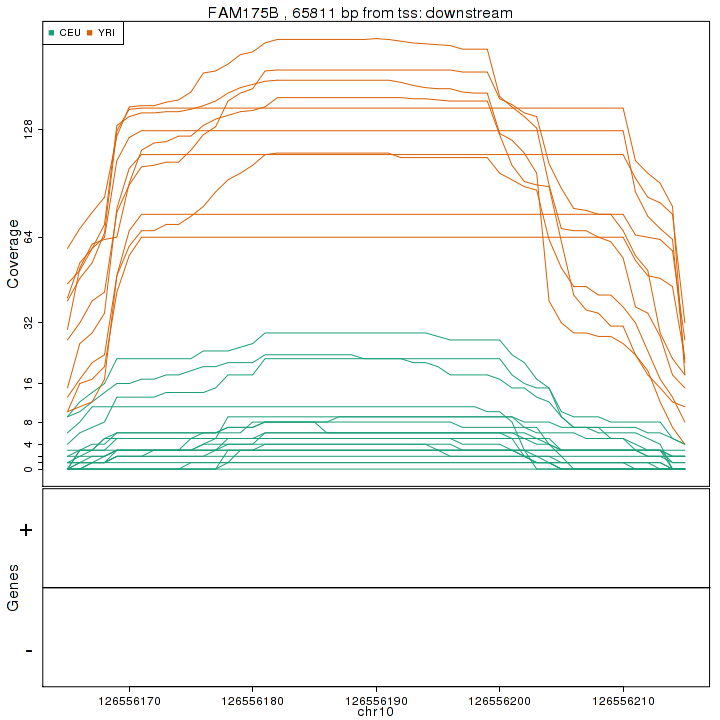
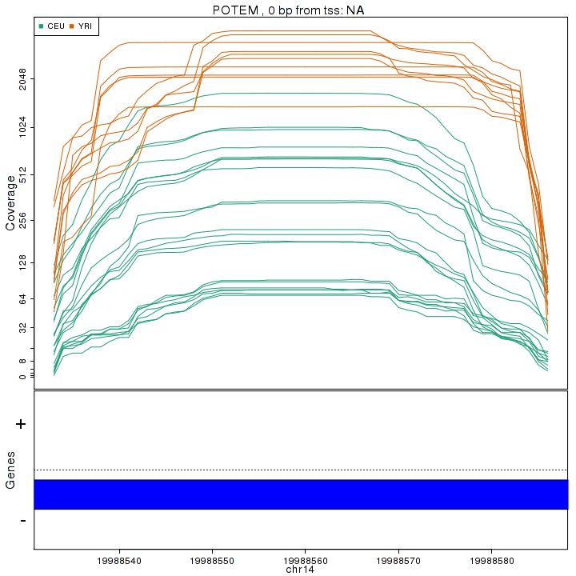
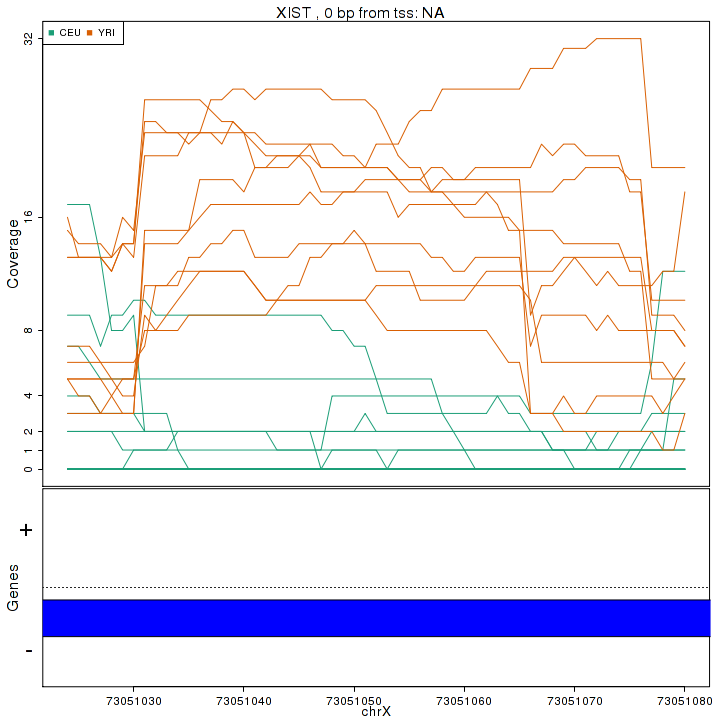
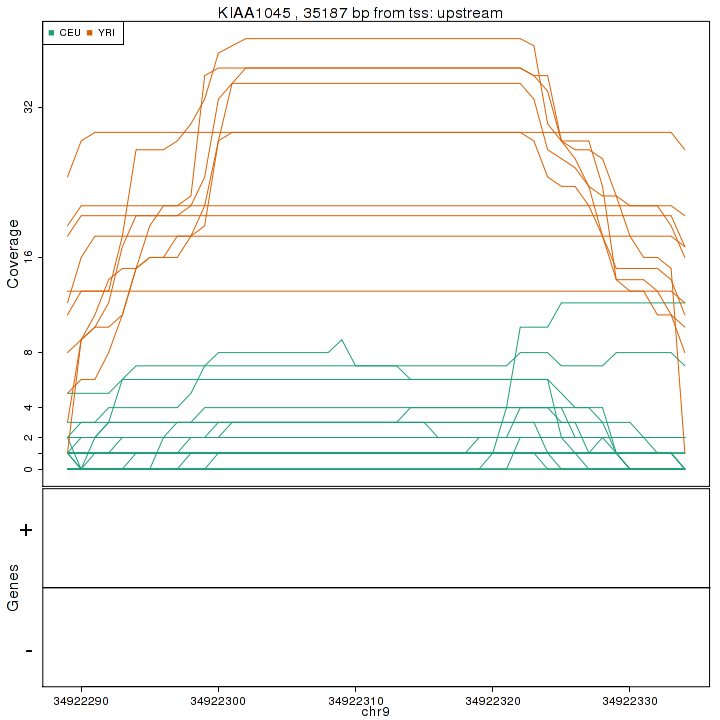

[derfinder](https://github.com/lcolladotor/derfinder) basic results exploration
=================================================================================

Project: <code class="knitr inline">run1-v0.0.28</code>.

# Introduction

This report is meant to help explore the results of the `derfinder` <code class="knitr inline">(<a href="https://github.com/lcolladotor/derfinder">Collado-Torres et al. 2013</a>)</code> package and was generated using the `derfinderReport` <code class="knitr inline">(<a href="https://github.com/lcolladotor/derfinderReport">Collado-Torres et al. 2013b</a>)</code> package. While the report is rich, it is meant to just start the exploration of the results and exemplify some of the code used to do so. You will most likely need a more in-depth analysis for your specific data set.

Most plots were made with using `ggplot2` <code class="knitr inline">(<a href="http://had.co.nz/ggplot2/book">Wickham, 2009</a>)</code>.

## Code setup

<pre class="knitr r">#### Libraries needed

## Bioconductor
library("IRanges")
library("GenomicRanges")

if(hg19) {
	library("biovizBase")
	library("TxDb.Hsapiens.UCSC.hg19.knownGene")
}

## CRAN
library("ggplot2")
library("gridExtra")
library("data.table")
library("knitcitations")
library("xtable")
library("RColorBrewer")

## GitHub	
library("derfinder")
library("knitrBootstrap")
library("rCharts")

#### Code setup

## For ggplot
tmp <- fullRegions
names(tmp) <- seq_len(length(tmp))
regions.df <- as.data.frame(tmp)
regions.df$width <- width(tmp)
rm(tmp)
nulls.df <- as.data.frame(fullNullSummary)

## Get chr lengths
if(hg19) {
	data(hg19Ideogram, package = "biovizBase")
	seqlengths(fullRegions) <- seqlengths(hg19Ideogram)[names(seqlengths(fullRegions))]
}

## Find which chrs are present in the data set
chrs <- levels(seqnames(fullRegions))
names(chrs) <- gsub("chr", "", chrs)

## Subset the fullCoverage data in case that a subset was used
colsubset <- optionsStats$colsubset
if(!is.null(fullCov) & !is.null(colsubset)) {
	fullCov <- lapply(fullCov, function(x) { x[, colsubset] })
}

## Get region coverage for the top regions
if(nBestRegions > 0) {
	regionCoverage <- getRegionCoverage(fullCov=fullCov, regions=fullRegions[seq_len(nBestRegions)], calculateMeans=FALSE, verbose=FALSE)
	save(regionCoverage, file=file.path(workingDir, "regionCoverage.Rdata"))
}
</pre>

# Quality checks

## P-values

Theoretically, the p-values should be uniformly distributed between 0 and 1.

<pre class="knitr r">p1 <- ggplot(regions.df, aes(x=pvalues, colour=seqnames)) + geom_line(stat="density") + xlim(0, 1) + labs(title="Density of p-values") + xlab("p-values") + scale_colour_discrete(limits=chrs) + theme(legend.title=element_blank())
p1
</pre>

<pre class="knitr r">## Compare the pvalues
summary(fullRegions$pvalues)
</pre>

<pre class="knitr r">##    Min. 1st Qu.  Median    Mean 3rd Qu.    Max. 
##  0.0012  0.0264  0.1870  0.3050  0.5450  1.0000
</pre>

This is the numerical summary of the distribution of the p-values. <code class="knitr inline"></code>

## Q-values

<pre class="knitr r">summary(fullRegions$qvalues)
</pre>

<pre class="knitr r">##    Min. 1st Qu.  Median    Mean 3rd Qu.    Max. 
##  0.0049  0.0618  0.2210  0.2460  0.4300  0.5920
</pre>

This is the numerical summary of the distribution of the q-values. <code class="knitr inline"></code>

<pre class="knitr r">qtable <- lapply(c(1e-04, 0.001, 0.01, 0.025, 0.05, 0.1, 0.2, 0.3, 0.4, 0.5, 0.6, 0.7, 0.8, 0.9, 1), function(x) {
	data.frame("Cut" = x, "Count" = sum(fullRegions$qvalues <= x))
})
qtable <- do.call(rbind, qtable)
print(xtable(qtable, digits=4, align=rep("c", 3)), type="html", include.rownames=FALSE)
</pre>

<!-- html table generated in R 3.0.1 by xtable 1.7-1 package -->
<!-- Tue Oct  1 03:08:55 2013 -->
<TABLE border=1>
<TR> <TH> Cut </TH> <TH> Count </TH>  </TR>
  <TR> <TD align="center"> 0.0001 </TD> <TD align="center">     0 </TD> </TR>
  <TR> <TD align="center"> 0.0010 </TD> <TD align="center">     0 </TD> </TR>
  <TR> <TD align="center"> 0.0100 </TD> <TD align="center">  3333 </TD> </TR>
  <TR> <TD align="center"> 0.0250 </TD> <TD align="center">  4881 </TD> </TR>
  <TR> <TD align="center"> 0.0500 </TD> <TD align="center">  5788 </TD> </TR>
  <TR> <TD align="center"> 0.1000 </TD> <TD align="center">  8496 </TD> </TR>
  <TR> <TD align="center"> 0.2000 </TD> <TD align="center"> 11622 </TD> </TR>
  <TR> <TD align="center"> 0.3000 </TD> <TD align="center"> 14791 </TD> </TR>
  <TR> <TD align="center"> 0.4000 </TD> <TD align="center"> 16930 </TD> </TR>
  <TR> <TD align="center"> 0.5000 </TD> <TD align="center"> 19613 </TD> </TR>
  <TR> <TD align="center"> 0.6000 </TD> <TD align="center"> 24031 </TD> </TR>
  <TR> <TD align="center"> 0.7000 </TD> <TD align="center"> 24031 </TD> </TR>
  <TR> <TD align="center"> 0.8000 </TD> <TD align="center"> 24031 </TD> </TR>
  <TR> <TD align="center"> 0.9000 </TD> <TD align="center"> 24031 </TD> </TR>
  <TR> <TD align="center"> 1.0000 </TD> <TD align="center"> 24031 </TD> </TR>
   </TABLE>

This table shows the number of candidate Differentially Expressed Regions (DERs) with q-value less or equal than some commonly used cutoff values. <code class="knitr inline"></code>

## Region width

<pre class="knitr r">xrange <- range(log10(regions.df$width))
p2a <- ggplot(regions.df, aes(x=log10(width), colour=seqnames)) + geom_line(stat="density") + labs(title="Density of region lengths") + xlab("Region width (log10)") + scale_colour_discrete(limits=chrs) + xlim(xrange) + theme(legend.title=element_blank())
p2b <- ggplot(regions.df[idx.sig, ], aes(x=log10(width), colour=seqnames)) + geom_line(stat="density") + labs(title="Density of region lengths (significant only)") + xlab("Region width (log10)") + scale_colour_discrete(limits=chrs) + xlim(xrange) + theme(legend.title=element_blank())
grid.arrange(p2a, p2b)
</pre>

This plot shows the density of the region lengths for all regions. <code class="knitr inline">The bottom panel is restricted to significant regions (q-value < 0.1)</code>

## Region Area

<pre class="knitr r">xrange <- range(log10(regions.df$area))
p3a <- ggplot(regions.df, aes(x=log10(area), colour=seqnames)) + geom_line(stat="density") + labs(title="Density of region areas") + xlab("Region area (log10)") + scale_colour_discrete(limits=chrs) + xlim(xrange) + theme(legend.title=element_blank())
p3b <- ggplot(regions.df[idx.sig, ], aes(x=log10(area), colour=seqnames)) + geom_line(stat="density") + labs(title="Density of region areas (significant only)") + xlab("Region area (log10)") + scale_colour_discrete(limits=chrs) + xlim(xrange) + theme(legend.title=element_blank())
grid.arrange(p3a, p3b)
</pre>

This plot shows the density of the region areas for all regions. <code class="knitr inline">The bottom panel is restricted to significant regions (q-value < 0.1)</code>

## Null regions: width and area

<pre class="knitr r">p4 <- ggplot(nulls.df, aes(x=log10(width), colour=chr)) + geom_line(stat="density") + labs(title="Density of null region lengths") + xlab("Region width (log10)") + scale_colour_discrete(limits=chrs) + theme(legend.title=element_blank())
p5 <- ggplot(nulls.df, aes(x=log10(area), colour=chr)) + geom_line(stat="density") + labs(title="Density of null region areas") + xlab("Region area (log10)") + scale_colour_discrete(limits=chrs) + theme(legend.title=element_blank())
grid.arrange(p4, p5)
</pre>

This plot shows the density of the null region lengths and areas. <code class="knitr inline"></code> There were a total of <code class="knitr inline">870</code> null regions.

## Mean coverage

<pre class="knitr r">xrange <- range(log2(regions.df$meanCoverage))
p6a <- ggplot(regions.df, aes(x=log2(meanCoverage), colour=seqnames)) + geom_line(stat="density") + labs(title="Density of region mean coverage") + xlab("Region mean coverage (log2)") + scale_colour_discrete(limits=chrs) + xlim(xrange) + theme(legend.title=element_blank())
p6b <- ggplot(regions.df[idx.sig, ], aes(x=log2(meanCoverage), colour=seqnames)) + geom_line(stat="density") + labs(title="Density of region mean coverage (significant only)") + xlab("Region mean coverage (log2)") + scale_colour_discrete(limits=chrs) + xlim(xrange) + theme(legend.title=element_blank())
grid.arrange(p6a, p6b)
</pre>

This plot shows the density of the region mean coverage for all regions. <code class="knitr inline">The bottom panel is restricted to significant regions (q-value < 0.1)</code>

## Mean coverage vs fold change

The following plots are [MA](http://en.wikipedia.org/wiki/MA_plot)-style plots comparing each group vs the first one. The mean coverage is calculated using only two groups at a time and is weighted according to the number of samples on each group. Note that the mean coverage and fold change as calculated here do not taking into account the library sizes.

These plots are only shown when there are two or more groups. A total of <code class="knitr inline">1</code> plot(s) were made.

<pre class="knitr r">for(j in grep("foldChange", colnames(values(fullRegions)))) {
	## Identify the groups
	groups <- strsplit(gsub("foldChange", "", colnames(values(fullRegions))[j]), "vs")[[1]]
	
	## Calculate the mean coverage only using the 2 groups in question
	j.mean <- which(colnames(values(fullRegions)) %in% paste0("mean", groups))
	groups.n <- sapply(groups, function(x) { sum(optionsStats$groupInfo == x) })
	ma.mean.mat <- as.matrix(values(fullRegions)[, j.mean])
	## Weighted means
	ma.mean <- drop(ma.mean.mat %*% groups.n) / sum(groups.n)
	
	ma <- data.frame(mean=ma.mean, foldChange=values(fullRegions)[, j])
	ma2 <- ma[is.finite(ma$foldChange), ]
	fold.mean <- data.frame(foldMean=mean(ma2$foldChange, na.rm=TRUE))
	
	p.ma <- ggplot(ma, aes(x=log2(mean), y=foldChange)) + geom_point(size=1.5, alpha=1/5) + ylab("Fold Change (log2)\nRed dashed line at mean; blue line is loess fit") + xlab(paste("Mean coverage (log2) using only groups", groups[1], "and", groups[2])) + labs(title=paste("MA style plot:", groups[1], "vs ", groups[2])) + geom_hline(aes(yintercept=foldMean), data=fold.mean, colour="#990000", linetype="dashed") + geom_smooth(aes(y=foldChange, x=log2(mean)), data=subset(ma2, mean > 0), method=loess)
	print(p.ma)
}
</pre>

# Genomic overview

The following plots were made using `ggbio` <code class="knitr inline">(<a href="">Yin et al. 2012</a>)</code> which in turn uses `ggplot2` <code class="knitr inline">(<a href="http://had.co.nz/ggplot2/book">Wickham, 2009</a>)</code>. For more details check `plotOverview` in `derfinder` <code class="knitr inline">(<a href="https://github.com/lcolladotor/derfinder">Collado-Torres et al. 2013</a>)</code>.

## Q-values

<pre class="knitr r">plotOverview(regions=fullRegions, type="qval", base_size=30, areaRel=10, legend.position=c(0.97, 0.12))
</pre>

This plot shows the genomic locations of the __candidate__ regions found in the analysis. The significant regions (q-value less than <code class="knitr inline">0.1</code>) are highlighted and the area of the regions is shown on top of each chromosome. Note that the area is in a relative scale.

## Annotation

<pre class="knitr r">plotOverview(regions=fullRegions, annotation=fullRegions, type="annotation", base_size=30, areaRel=10, legend.position=c(0.97, 0.12))
</pre>

This genomic overview plot shows the annotation region type for the __candidate__ regions. Note that the regions are shown only if the annotation information is available. Below is a table of the actual number of results per annotation region type.

<pre class="knitr r">annoReg <- table(fullRegions$region, useNA="always")
annoReg.df <- data.frame(Region=names(annoReg), Count=as.vector(annoReg))
print(xtable(annoReg.df, align=rep("c", 3)), type="html", include.rownames=FALSE)
</pre>

<!-- html table generated in R 3.0.1 by xtable 1.7-1 package -->
<!-- Tue Oct  1 03:11:05 2013 -->
<TABLE border=1>
<TR> <TH> Region </TH> <TH> Count </TH>  </TR>
  <TR> <TD align="center"> upstream </TD> <TD align="center"> 2046 </TD> </TR>
  <TR> <TD align="center"> promoter </TD> <TD align="center"> 121 </TD> </TR>
  <TR> <TD align="center"> overlaps 5' </TD> <TD align="center">   9 </TD> </TR>
  <TR> <TD align="center"> inside </TD> <TD align="center"> 15587 </TD> </TR>
  <TR> <TD align="center"> overlaps 3' </TD> <TD align="center">   9 </TD> </TR>
  <TR> <TD align="center"> close to 3' </TD> <TD align="center">  54 </TD> </TR>
  <TR> <TD align="center"> downstream </TD> <TD align="center"> 1783 </TD> </TR>
  <TR> <TD align="center"> covers </TD> <TD align="center">   0 </TD> </TR>
  <TR> <TD align="center">  </TD> <TD align="center"> 4422 </TD> </TR>
   </TABLE>

## Annotation (significant)

<pre class="knitr r">plotOverview(regions=fullRegions[idx.sig], annotation=fullRegions[idx.sig], type="annotation", base_size=30, areaRel=10, legend.position=c(0.97, 0.12))
</pre>

This genomic overview plot shows the annotation region type for the __candidate__ regions that have a q-value less than <code class="knitr inline">0.1</code>. Note that the regions are shown only if the annotation information is available. <code class="knitr inline"></code>

# Best regions

## Plots

Below are the plots for the top <code class="knitr inline">100</code> candidate DERs as ranked by area. For each plot, annotation is shown if the candidate DER has a minimum overlap of <code class="knitr inline">20</code> base pairs with annotation information (strand specific). If present, exons are collapsed and shown in blue. Introns are shown in light blue. The title of each plot is composed of the name of the nearest annotation element, the distance to it, and whether the region of the genome the DER falls into; all three pieces of information are based on `bumphunter::annotateNearest()`.

The annotation depends on the Genomic State used. For details on which one was used for this report check the call to `mergeResults` in the reproducibility details.

<pre class="knitr r">if(nBestRegions > 0) {
	plotRegionCoverage(regions=fullRegions, regionCoverage=regionCoverage, groupInfo=optionsStats$groupInfo, nearestAnnotation=regions.df, annotatedRegions=fullAnnotatedRegions, whichRegions = seq_len(min(nBestRegions, length(fullRegions))), colors=NULL, scalefac = 32, ask = FALSE, verbose = TRUE) 
}
</pre>

Below is a table summarizing the number of genomic states per region.

<pre class="knitr r">info <- do.call(rbind, lapply(fullAnnotatedRegions$countTable, function(x) { data.frame(table(x)) }))
colnames(info) <- c("Number of Overlapping States", "Frequency")
info$State <- gsub("\\..*", "", rownames(info))
rownames(info) <- NULL
print(xtable(info, align=rep("c", 4)), type="html", include.rownames=FALSE)
</pre>

<!-- html table generated in R 3.0.1 by xtable 1.7-1 package -->
<!-- Tue Oct  1 03:12:28 2013 -->
<TABLE border=1>
<TR> <TH> Number of Overlapping States </TH> <TH> Frequency </TH> <TH> State </TH>  </TR>
  <TR> <TD align="center"> 0 </TD> <TD align="center"> 22118 </TD> <TD align="center"> exon </TD> </TR>
  <TR> <TD align="center"> 1 </TD> <TD align="center"> 1803 </TD> <TD align="center"> exon </TD> </TR>
  <TR> <TD align="center"> 2 </TD> <TD align="center"> 110 </TD> <TD align="center"> exon </TD> </TR>
  <TR> <TD align="center"> 0 </TD> <TD align="center"> 22892 </TD> <TD align="center"> intragenic </TD> </TR>
  <TR> <TD align="center"> 1 </TD> <TD align="center"> 1139 </TD> <TD align="center"> intragenic </TD> </TR>
  <TR> <TD align="center"> 0 </TD> <TD align="center"> 23132 </TD> <TD align="center"> intron </TD> </TR>
  <TR> <TD align="center"> 1 </TD> <TD align="center"> 861 </TD> <TD align="center"> intron </TD> </TR>
  <TR> <TD align="center"> 2 </TD> <TD align="center">  38 </TD> <TD align="center"> intron </TD> </TR>
   </TABLE>

## Region information

Below is an interactive table with the top <code class="knitr inline">2000</code> regions (out of <code class="knitr inline">24031</code>) as ranked by area. This table was generated using `rCharts` <code class="knitr inline">(<a href="">Vaidyanathan, 2013</a>)</code>. Inf and -Inf are shown as 1e100 and -1e100 respectively.

<link rel="stylesheet" href="http://ajax.aspnetcdn.com/ajax/jquery.dataTables/1.9.4/css/jquery.dataTables.css" />

<pre class="knitr r">topArea <- head(regions.df, 2000)
topArea <- data.frame("areaRank"=order(topArea$area, decreasing=TRUE), topArea)
## Clean up -Inf, Inf if present
## More details at https://github.com/ramnathv/rCharts/issues/259
replaceInf <- function(df, colsubset=seq_len(ncol(df))) {
	for(i in colsubset) {
		inf.idx <- !is.finite(df[, i])
		if(any(inf.idx)) {
			inf.sign <- sign(df[inf.idx, i])
			df[inf.idx, i] <- inf.sign * 1e100
		}
	}
	return(df)
}
topArea <- replaceInf(topArea, grep("foldChange", colnames(topArea)))

## Make the table
d <- data.table(topArea)
t1 <- dTable(d, sPaginationType=  'full_numbers', iDisplayLength=10, sScrollX='100%')
t1$print("regions", cdn=TRUE)
</pre>

<table id = 'regions' class = 'rChart datatables'></table>
<script type="text/javascript" charset="utf-8">
  var chartParamsregions = {
 "dom": "regions",
"width":    800,
"height":    400,
"table": {
 "aaData": [
 [
 1,
"chrX",
73046858,
73047107,
250,
"*",
126.15,
 31537,
925542,
925791,
243,
  6946,
8.1406,
2.4785,
20.031,
3.0147,
0.0011481,
"TRUE",
0.0049022,
"TRUE",
"TSIX",
"NR_003255",
null,
null,
     0,
null,
null,
null,
1,
null,
"+",
     0,
     0 
],
[
 2,
"chrX",
73046534,
73046805,
272,
"*",
107.64,
 29278,
925218,
925489,
243,
  6946,
7.6038,
 2.232,
18.885,
3.0808,
0.0011481,
"TRUE",
0.0049022,
"TRUE",
"TSIX",
"NR_003255",
null,
null,
     0,
null,
null,
null,
1,
null,
"+",
     0,
     0 
],
[
 3,
"chrX",
73062447,
73062874,
428,
"*",
65.518,
 28042,
927824,
928251,
248,
  6076,
3.6091,
0.88852,
9.3222,
3.3912,
0.0011481,
"TRUE",
0.0049022,
"TRUE",
"XIST",
"NR_001564",
null,
null,
     0,
null,
null,
null,
6,
null,
"-",
     0,
     0 
],
[
 4,
"chrX",
73065857,
73066158,
302,
"*",
92.431,
 27914,
930907,
931208,
248,
  6076,
3.0531,
0.39735,
8.6301,
4.4409,
0.0011481,
"TRUE",
0.0049022,
"TRUE",
"XIST",
"NR_001564",
null,
null,
     0,
null,
null,
null,
6,
null,
"-",
     0,
     0 
],
[
 5,
"chrX",
73065192,
73065367,
176,
"*",
118.45,
 20847,
930270,
930445,
248,
  6076,
2.8098,
0.57116,
7.5108,
 3.717,
0.0011481,
"TRUE",
0.0049022,
"TRUE",
"XIST",
"NR_001564",
null,
null,
     0,
null,
null,
null,
6,
null,
"-",
     0,
     0 
],
[
 6,
"chr6",
5973899,
5973953,
55,
"*",
344.17,
 18929,
92967,
93021,
32,
    55,
 58.88,
13.475,
154.23,
3.5167,
0.0011481,
"TRUE",
0.0049022,
"TRUE",
"NRN1",
null,
null,
null,
     0,
null,
null,
null,
3,
null,
"-",
     0,
     0 
],
[
 7,
"chrX",
73064924,
73065130,
207,
"*",
91.251,
 18889,
930003,
930209,
248,
  6076,
 3.566,
0.7458,
9.4884,
3.6693,
0.0011481,
"TRUE",
0.0049022,
"TRUE",
"XIST",
"NR_001564",
null,
null,
     0,
null,
null,
null,
6,
null,
"-",
     0,
     0 
],
[
 8,
"chrX",
73045851,
73046071,
221,
"*",
70.404,
 15559,
924535,
924755,
243,
  6946,
 4.317,
1.4667,
10.303,
2.8124,
0.0011481,
"TRUE",
0.0049022,
"TRUE",
"TSIX",
"NR_003255",
null,
null,
     0,
null,
null,
null,
1,
null,
"+",
     0,
     0 
],
[
 9,
"chr6",
31324284,
31324422,
139,
"*",
 108.4,
 15068,
593825,
593963,
151,
  1167,
9.6742,
3.3806,
22.891,
2.7594,
0.0011481,
"TRUE",
0.0049022,
"TRUE",
"HLA-B",
null,
"inside intron",
"inside",
   312,
"inside intron",
   -43,
     1,
2,
"inside transcription region",
"-",
  1435,
   871 
],
[
 10,
"chr8",
57014691,
57014750,
60,
"*",
246.88,
 14813,
764313,
764372,
120,
    60,
62.583,
 13.86,
 164.9,
3.5726,
0.0011481,
"FALSE",
0.0049022,
"TRUE",
"MOS",
"NP_001663",
"downstream",
"downstream",
 11791,
null,
null,
null,
1,
null,
"-",
  1040,
  1040 
],
[
 11,
"chrX",
73066172,
73066358,
187,
"*",
78.828,
 14741,
931222,
931408,
248,
  6076,
2.2134,
0.40209,
6.0171,
3.9035,
0.0011481,
"TRUE",
0.0049022,
"TRUE",
"XIST",
"NR_001564",
null,
null,
     0,
null,
null,
null,
6,
null,
"-",
     0,
     0 
],
[
 12,
"chrX",
73041846,
73042052,
207,
"*",
61.794,
 12791,
921484,
921690,
243,
  6946,
6.4839,
2.2068,
15.466,
 2.809,
0.0011481,
"TRUE",
0.0049022,
"TRUE",
"TSIX",
"NR_003255",
null,
null,
     0,
null,
null,
null,
1,
null,
"+",
     0,
     0 
],
[
 13,
"chr10",
126556165,
126556215,
51,
"*",
242.93,
 12389,
1895727,
1895777,
378,
    51,
37.002,
5.3725,
103.42,
4.2668,
0.0011481,
"TRUE",
0.0049022,
"TRUE",
"FAM175B",
"NM_001164318",
"downstream",
"downstream",
 65811,
null,
null,
null,
9,
null,
"+",
 34885,
 33141 
],
[
 14,
"chr1",
115079805,
115079857,
53,
"*",
228.46,
 12109,
2598156,
2598208,
633,
   187,
68.522,
23.351,
163.38,
2.8066,
0.0011481,
"TRUE",
0.0049022,
"TRUE",
"DENND2C",
null,
null,
null,
     0,
null,
null,
null,
30,
null,
"-",
     0,
     0 
],
[
 15,
"chr2",
61644256,
61644310,
55,
"*",
213.92,
 11766,
885719,
885773,
138,
    55,
184.52,
50.163,
466.67,
3.2177,
0.0011481,
"TRUE",
0.0049022,
"TRUE",
"USP34",
null,
"inside intron",
"inside",
 53539,
"inside intron",
 -3571,
     2,
80,
"inside transcription region",
"-",
2.8326e+05,
2.8259e+05 
],
[
 16,
"chr4",
174555327,
174555393,
67,
"*",
169.23,
 11338,
1774572,
1774638,
317,
    67,
50.683,
20.461,
114.15,
  2.48,
0.0011481,
"TRUE",
0.0049022,
"TRUE",
"NBLA00301",
"NP_001257932",
null,
null,
     0,
null,
null,
null,
5,
null,
"+",
     0,
     0 
],
[
 17,
"chr1",
154351070,
154351136,
67,
"*",
168.53,
 11291,
3207975,
3208041,
834,
   666,
290.77,
167.49,
549.66,
1.7145,
0.0011481,
"TRUE",
0.0049022,
"TRUE",
"IL6R",
null,
"upstream",
"upstream",
 26533,
null,
null,
null,
7,
null,
"+",
 32892,
 31914 
],
[
 18,
"chr9",
35971788,
35971860,
73,
"*",
151.71,
 11075,
432442,
432514,
117,
   809,
187.56,
 147.4,
271.92,
0.88346,
0.0011481,
"TRUE",
0.0049022,
"TRUE",
"OR2S2",
null,
"upstream",
"upstream",
 13637,
null,
null,
null,
1,
null,
"-",
  1046,
   959 
],
[
 19,
"chr13",
68406743,
68406793,
51,
"*",
212.91,
 10858,
562099,
562149,
118,
    51,
38.046,
6.5415,
104.21,
3.9937,
0.0011481,
"FALSE",
0.0049022,
"TRUE",
"PCDH9",
null,
"upstream",
"upstream",
6.0228e+05,
null,
null,
null,
5,
null,
"-",
9.275e+05,
9.2378e+05 
],
[
 20,
"chr10",
120631641,
120631726,
86,
"*",
126.01,
 10837,
1785893,
1785978,
360,
   259,
177.45,
67.792,
407.74,
2.5885,
0.0011481,
"TRUE",
0.0049022,
"TRUE",
"CACUL1",
null,
null,
null,
     0,
null,
null,
null,
10,
null,
"-",
     0,
     0 
],
[
 21,
"chr7",
63602128,
63602187,
60,
"*",
180.01,
 10801,
908720,
908779,
207,
   185,
114.15,
23.702,
304.09,
3.6814,
0.0011481,
"TRUE",
0.0049022,
"TRUE",
"ZNF727",
null,
"downstream",
"downstream",
 96307,
null,
null,
null,
4,
null,
"+",
 33106,
 32927 
],
[
 22,
"chr8",
70899787,
70899844,
58,
"*",
182.43,
 10581,
899205,
899262,
130,
   194,
 19.58,
4.7053,
50.817,
 3.433,
0.0011481,
"FALSE",
0.0049022,
"TRUE",
"PRDM14",
"NP_001034662",
"downstream",
"downstream",
 83718,
null,
null,
null,
8,
null,
"-",
 19676,
 17783 
],
[
 23,
"chr21",
34213976,
34214033,
58,
"*",
181.87,
 10548,
184951,
185008,
27,
    58,
217.03,
59.411,
548.02,
3.2054,
0.0011481,
"FALSE",
0.0049022,
"TRUE",
"C21orf62",
null,
"upstream",
"upstream",
 27923,
null,
null,
null,
4,
null,
"-",
 23069,
   659 
],
[
 24,
"chr11",
57344037,
57344107,
71,
"*",
146.08,
 10372,
786916,
786986,
157,
   176,
83.709,
20.275,
216.92,
3.4194,
0.0011481,
"TRUE",
0.0049022,
"TRUE",
"UBE2L6",
null,
"upstream",
"upstream",
  8234,
null,
null,
null,
4,
null,
"-",
 16675,
  2190 
],
[
 25,
"chrX",
73070946,
73071078,
133,
"*",
77.652,
 10328,
934314,
934446,
250,
  1837,
2.8106,
0.33548,
8.0083,
4.5772,
0.0011481,
"TRUE",
0.0049022,
"TRUE",
"XIST",
"NR_001564",
null,
null,
     0,
null,
null,
null,
6,
null,
"-",
     0,
     0 
],
[
 26,
"chrX",
39646543,
39646598,
56,
"*",
184.42,
 10327,
421994,
422049,
100,
   612,
515.39,
151.11,
1280.4,
3.0829,
0.0011481,
"TRUE",
0.0049022,
"TRUE",
"BCOR",
null,
"downstream",
"downstream",
2.7573e+05,
null,
null,
null,
7,
null,
"-",
 11825,
  9160 
],
[
 27,
"chrX",
73066537,
73066650,
114,
"*",
90.574,
 10325,
931587,
931700,
248,
  6076,
2.3183,
0.24728,
6.6675,
4.7529,
0.0011481,
"TRUE",
0.0049022,
"TRUE",
"XIST",
"NR_001564",
null,
null,
     0,
null,
null,
null,
6,
null,
"-",
     0,
     0 
],
[
 28,
"chr15",
71356266,
71356322,
57,
"*",
180.16,
 10269,
1085204,
1085260,
213,
   644,
102.54,
27.703,
259.68,
3.2287,
0.0011481,
"TRUE",
0.0049022,
"TRUE",
"LRRC49",
null,
"downstream",
"downstream",
2.1065e+05,
null,
null,
null,
17,
null,
"+",
1.9682e+05,
1.7641e+05 
],
[
 29,
"chr1",
187532976,
187533029,
54,
"*",
188.17,
 10161,
4006010,
4006063,
1010,
    54,
21.401,
4.9691,
55.907,
 3.492,
0.0011481,
"TRUE",
0.0049022,
"TRUE",
"PLA2G4A",
null,
"downstream",
"downstream",
7.3494e+05,
null,
null,
null,
18,
null,
"+",
1.6008e+05,
1.3415e+05 
],
[
 30,
"chrX",
73062922,
73063060,
139,
"*",
72.487,
 10076,
928299,
928437,
248,
  6076,
3.6275,
0.75197,
9.6662,
3.6842,
0.0011481,
"TRUE",
0.0049022,
"TRUE",
"XIST",
"NR_001564",
null,
null,
     0,
null,
null,
null,
6,
null,
"-",
     0,
     0 
],
[
 31,
"chr8",
98636510,
98636577,
68,
"*",
146.01,
9928.6,
1139677,
1139744,
172,
    68,
375.11,
109.74,
932.37,
3.0868,
0.0011481,
"FALSE",
0.0049022,
"TRUE",
"MTDH",
null,
"upstream",
"upstream",
 19830,
null,
null,
null,
12,
null,
"+",
 86081,
 80163 
],
[
 32,
"chr1",
201947785,
201947846,
62,
"*",
156.68,
9713.9,
4133967,
4134028,
1031,
   129,
236.08,
 87.32,
548.46,
 2.651,
0.0011481,
"TRUE",
0.0049022,
"TRUE",
"RNPEP",
"NM_001024808",
"upstream",
"upstream",
  3920,
null,
null,
null,
11,
null,
"+",
 23509,
 23049 
],
[
 33,
"chr1",
201947866,
201947913,
48,
"*",
200.98,
9647.2,
4134044,
4134091,
1031,
   129,
249.59,
75.062,
616.08,
 3.037,
0.0011481,
"TRUE",
0.0049022,
"TRUE",
"RNPEP",
"NM_001024808",
"upstream",
"upstream",
  3853,
null,
null,
null,
11,
null,
"+",
 23509,
 23049 
],
[
 34,
"chr1",
203224921,
203224978,
58,
"*",
165.03,
  9572,
4176007,
4176064,
1043,
   368,
56.548,
11.848,
150.42,
3.6663,
0.0011481,
"TRUE",
0.0049022,
"TRUE",
"CHIT1",
null,
null,
null,
     0,
null,
null,
null,
12,
null,
"-",
     0,
     0 
],
[
 35,
"chr14",
105302504,
105302582,
79,
"*",
120.19,
9495.1,
1501259,
1501337,
272,
   314,
575.23,
315.64,
1120.4,
1.8276,
0.0011481,
"TRUE",
0.0049022,
"TRUE",
"LINC00638",
"NR_024396",
null,
null,
     0,
null,
null,
null,
1,
null,
"+",
     0,
     0 
],
[
 36,
"chr20",
21095583,
21095643,
61,
"*",
154.86,
9446.2,
325744,
325804,
55,
   173,
58.451,
17.568,
 144.3,
3.0381,
0.0011481,
"TRUE",
0.0049022,
"TRUE",
"PLK1S1",
null,
"upstream",
"upstream",
 10981,
null,
null,
null,
14,
null,
"+",
1.2063e+05,
1.2046e+05 
],
[
 37,
"chr13",
61211942,
61211988,
47,
"*",
198.95,
9350.5,
548916,
548962,
113,
    47,
25.625,
 4.154,
70.715,
4.0894,
0.0011481,
"FALSE",
0.0049022,
"TRUE",
"TDRD3",
null,
"downstream",
"downstream",
2.4135e+05,
null,
null,
null,
14,
null,
"+",
1.7742e+05,
1.0717e+05 
],
[
 38,
"chr1",
185196775,
185196827,
53,
"*",
176.29,
9343.4,
3985494,
3985546,
1003,
    55,
 58.41,
17.802,
143.69,
3.0128,
0.0011481,
"TRUE",
0.0049022,
"TRUE",
"SWT1",
null,
"inside intron",
"inside",
 70484,
"inside intron",
  3882,
    16,
19,
"inside transcription region",
"+",
1.3462e+05,
1.2996e+05 
],
[
 39,
"chr6",
56736096,
56736157,
62,
"*",
149.26,
9254.2,
1364846,
1364907,
331,
   182,
 179.9,
57.042,
437.89,
2.9405,
0.0011481,
"TRUE",
0.0049022,
"TRUE",
"DST",
null,
"upstream",
"upstream",
 19382,
null,
null,
null,
34,
null,
"-",
2.3756e+05,
2.3743e+05 
],
[
 40,
"chr1",
53461594,
53461649,
56,
"*",
163.38,
9149.2,
1838777,
1838832,
460,
    56,
140.93,
44.139,
344.18,
 2.963,
0.0011481,
"TRUE",
0.0049022,
"TRUE",
"SCP2",
"NM_001184813",
"inside exon",
"inside",
 68693,
"inside exon",
     0,
    12,
17,
"5' UTR",
"+",
1.2439e+05,
 35683 
],
[
 41,
"chr3",
183833902,
183833952,
51,
"*",
179.33,
9145.8,
2466186,
2466236,
428,
    51,
18.373,
6.9823,
42.294,
2.5987,
0.0011481,
"TRUE",
0.0049022,
"TRUE",
"HTR3E",
null,
"downstream",
"downstream",
 19050,
null,
null,
null,
9,
null,
"+",
  9931,
  9163 
],
[
 42,
"chr1",
238090320,
238090386,
67,
"*",
135.83,
9100.7,
4832761,
4832827,
1184,
    69,
485.43,
203.78,
1076.9,
2.4018,
0.0011481,
"TRUE",
0.0049022,
"TRUE",
"LOC100130331",
"NR_027247",
null,
null,
     0,
null,
null,
null,
12,
null,
"+",
     0,
     0 
],
[
 43,
"chr9",
7477426,
7477487,
62,
"*",
146.66,
9092.7,
143848,
143909,
36,
  1062,
237.07,
 143.6,
433.35,
1.5935,
0.0011481,
"TRUE",
0.0049022,
"TRUE",
"KDM4C",
"NM_002015",
"downstream",
"downstream",
7.1978e+05,
null,
null,
null,
22,
null,
"+",
4.1801e+05,
3.8174e+05 
],
[
 44,
"chr2",
215712091,
215712162,
72,
"*",
125.26,
9018.7,
2924211,
2924282,
524,
   273,
323.54,
198.37,
 586.4,
1.5637,
0.0011481,
"TRUE",
0.0049022,
"TRUE",
"BARD1",
null,
"upstream",
"upstream",
 37663,
null,
null,
null,
11,
null,
"-",
 81153,
 80893 
],
[
 45,
"chr8",
18240837,
18240894,
58,
"*",
154.26,
  8947,
189056,
189113,
19,
    58,
65.189,
19.388,
161.37,
3.0572,
0.0011481,
"FALSE",
0.0049022,
"TRUE",
"NAT2",
null,
"upstream",
"upstream",
  7861,
null,
null,
null,
2,
null,
"+",
  9968,
   872 
],
[
 46,
"chr22",
32435490,
32435539,
50,
"*",
 177.4,
8870.1,
608393,
608442,
131,
   224,
78.289,
 37.53,
163.88,
2.1266,
0.0011481,
"TRUE",
0.0049022,
"TRUE",
"SLC5A1",
"NM_130851",
"upstream",
"upstream",
  3480,
null,
null,
null,
15,
null,
"+",
 69992,
 66931 
],
[
 47,
"chr4",
39975384,
39975434,
51,
"*",
173.61,
8854.1,
555647,
555697,
128,
    51,
67.716,
28.956,
149.11,
2.3645,
0.0011481,
"TRUE",
0.0049022,
"TRUE",
"PDS5A",
"NP_891555",
"inside intron",
"inside",
  4142,
"inside intron",
 -2626,
     2,
16,
"inside transcription region",
"-",
 79985,
 78221 
],
[
 48,
"chr1",
158495473,
158495525,
53,
"*",
 166.2,
8808.7,
3451365,
3451417,
897,
   225,
22.039,
8.0782,
51.357,
2.6684,
0.0011481,
"TRUE",
0.0049022,
"TRUE",
"OR6Y1",
null,
"downstream",
"downstream",
 22370,
null,
null,
null,
1,
null,
"-",
   977,
   977 
],
[
 49,
"chr3",
155027515,
155027581,
67,
"*",
130.95,
8773.8,
2155181,
2155247,
377,
    67,
89.956,
34.289,
206.86,
2.5928,
0.0011481,
"TRUE",
0.0049022,
"TRUE",
"LOC100507537",
"NR_037902",
null,
null,
     0,
null,
null,
null,
3,
null,
"-",
     0,
     0 
],
[
 50,
"chr8",
33397725,
33397778,
54,
"*",
 160.1,
8645.3,
456340,
456393,
67,
    54,
173.27,
53.593,
424.59,
 2.986,
0.0011481,
"FALSE",
0.0049022,
"TRUE",
"RNF122",
null,
"downstream",
"downstream",
 26865,
null,
null,
null,
6,
null,
"-",
 19370,
 17970 
],
[
 51,
"chr2",
85143538,
85143616,
79,
"*",
108.65,
8583.1,
1247253,
1247331,
220,
   161,
633.54,
401.61,
1120.6,
1.4804,
0.0011481,
"TRUE",
0.0049022,
"TRUE",
"TMSB10",
null,
"downstream",
"downstream",
 10775,
null,
null,
null,
3,
null,
"+",
  1036,
   405 
],
[
 52,
"chr17",
25634770,
25634868,
99,
"*",
86.046,
8518.6,
925949,
926047,
215,
   977,
14.043,
4.1145,
34.893,
3.0842,
0.0011481,
"TRUE",
0.0049022,
"TRUE",
"WSB1",
null,
null,
null,
     0,
null,
null,
null,
9,
null,
"+",
     0,
     0 
],
[
 53,
"chr15",
25154904,
25154963,
60,
"*",
141.29,
8477.4,
81428,
81487,
38,
    60,
114.39,
34.594,
281.97,
3.0269,
0.0011481,
"TRUE",
0.0049022,
"TRUE",
"SNRPN",
null,
"inside intron",
"inside",
 53206,
"inside intron",
 10195,
     3,
12,
"5' UTR",
"+",
1.2203e+05,
  3990 
],
[
 54,
"chr17",
51834523,
51834582,
60,
"*",
140.12,
8407.3,
2096538,
2096597,
461,
   367,
396.94,
 185.8,
840.34,
2.1772,
0.0011481,
"TRUE",
0.0049022,
"TRUE",
"KIF2B",
"NM_181356",
"upstream",
"upstream",
 65657,
null,
null,
null,
1,
null,
"+",
  2334,
  2021 
],
[
 55,
"chr18",
18699328,
18699380,
53,
"*",
 158.6,
8405.7,
225839,
225891,
53,
   242,
64.287,
24.449,
147.95,
2.5972,
0.0011481,
"TRUE",
0.0049022,
"TRUE",
"ROCK1",
null,
"upstream",
"upstream",
  7516,
null,
null,
null,
33,
null,
"-",
1.6211e+05,
1.5953e+05 
],
[
 56,
"chr9",
124282602,
124282653,
52,
"*",
161.48,
8396.9,
1416175,
1416226,
295,
   288,
 27.47,
6.4121,
 71.69,
3.4829,
0.0011481,
"TRUE",
0.0049022,
"TRUE",
"GGTA1P",
"NM_000479",
null,
null,
     0,
null,
null,
null,
8,
null,
"-",
     0,
     0 
],
[
 57,
"chr6",
108939346,
108939408,
63,
"*",
133.21,
8392.1,
1798459,
1798521,
399,
    63,
26.919,
7.1723,
68.386,
3.2532,
0.0011481,
"TRUE",
0.0049022,
"TRUE",
"FOXO3",
null,
"inside intron",
"inside",
 28437,
"inside intron",
-28328,
     1,
3,
"5' UTR",
"+",
 95062,
  1361 
],
[
 58,
"chr5",
170793313,
170793389,
77,
"*",
105.52,
8124.9,
2128408,
2128484,
390,
    77,
 316.1,
 129.8,
707.32,
 2.446,
0.0011481,
"TRUE",
0.0049022,
"TRUE",
"MIR3912",
"NR_037474",
null,
null,
     0,
null,
null,
null,
1,
null,
"-",
     0,
     0 
],
[
 59,
"chrX",
39646866,
39646938,
73,
"*",
110.66,
8078.1,
422317,
422389,
100,
   612,
694.06,
336.91,
1444.1,
2.0997,
0.0011481,
"TRUE",
0.0049022,
"TRUE",
"BCOR",
null,
"downstream",
"downstream",
2.7539e+05,
null,
null,
null,
7,
null,
"-",
 11825,
  9160 
],
[
 60,
"chr6",
80662936,
80662982,
47,
"*",
   170,
7989.9,
1529535,
1529581,
367,
   261,
   373,
127.03,
889.52,
2.8078,
0.0011481,
"TRUE",
0.0049022,
"TRUE",
"ELOVL4",
null,
"upstream",
"upstream",
  5621,
null,
null,
null,
6,
null,
"-",
 32786,
 30671 
],
[
 61,
"chr1",
40428849,
40428921,
73,
"*",
108.06,
7888.2,
1464112,
1464184,
383,
   507,
567.54,
342.33,
1040.5,
1.6038,
0.0011481,
"TRUE",
0.0049022,
"TRUE",
"MFSD2A",
null,
null,
null,
     0,
null,
null,
null,
12,
null,
"+",
     0,
     0 
],
[
 62,
"chrX",
46299624,
46299674,
51,
"*",
154.31,
7869.9,
498187,
498237,
128,
   443,
350.74,
105.24,
866.29,
3.0412,
0.0011481,
"TRUE",
0.0049022,
"TRUE",
"ZNF673",
null,
"upstream",
"upstream",
  6950,
null,
null,
null,
7,
null,
"+",
 27450,
 20724 
],
[
 63,
"chr14",
106324327,
106324493,
167,
"*",
47.121,
7869.2,
1604810,
1604976,
312,
  2735,
19.871,
27.217,
4.4437,
-2.6147,
0.0011481,
"TRUE",
0.0049022,
"TRUE",
"KIAA0125",
"NM_001786",
"upstream",
"upstream",
 31487,
null,
null,
null,
4,
null,
"+",
 32550,
  1546 
],
[
 64,
"chrX",
73071655,
73071774,
120,
"*",
64.318,
7718.2,
935002,
935121,
250,
  1837,
2.6591,
0.40198,
7.3992,
4.2022,
0.0011481,
"TRUE",
0.0049022,
"TRUE",
"XIST",
"NR_001564",
null,
null,
     0,
null,
null,
null,
6,
null,
"-",
     0,
     0 
],
[
 65,
"chr9",
131104688,
131104756,
69,
"*",
111.08,
7664.6,
1628878,
1628946,
329,
    69,
452.21,
144.28,
1098.9,
2.9291,
0.0011481,
"TRUE",
0.0049022,
"TRUE",
"SLC27A4",
null,
"inside intron",
"inside",
  1849,
"inside intron",
   650,
     2,
6,
"inside transcription region",
"+",
 20910,
 19728 
],
[
 66,
"chr3",
48162539,
48162582,
44,
"*",
173.62,
7639.2,
731987,
732030,
118,
   386,
112.47,
25.966,
294.13,
3.5017,
0.0011481,
"TRUE",
0.0049022,
"TRUE",
"MAP4",
null,
"upstream",
"upstream",
 31770,
null,
null,
null,
19,
null,
"-",
2.3859e+05,
1.4583e+05 
],
[
 67,
"chr8",
102381423,
102381469,
47,
"*",
161.83,
7605.9,
1219137,
1219183,
199,
   198,
73.719,
30.638,
164.19,
 2.422,
0.0011481,
"FALSE",
0.0049022,
"TRUE",
"NACAP1",
null,
"inside exon",
"inside",
   302,
"inside exon",
     0,
     1,
1,
"inside transcription region",
"+",
   702,
   407 
],
[
 68,
"chr1",
27533506,
27533556,
51,
"*",
148.07,
7551.3,
992558,
992608,
292,
    90,
 42.97,
13.774,
104.28,
2.9205,
0.0011481,
"TRUE",
0.0049022,
"TRUE",
"WDTC1",
null,
"upstream",
"upstream",
 27451,
null,
null,
null,
16,
null,
"+",
 72927,
 45328 
],
[
 69,
"chr1",
211381092,
211381153,
62,
"*",
 121.4,
  7527,
4356618,
4356679,
1085,
    62,
24.296,
11.754,
50.634,
2.1069,
0.0011481,
"TRUE",
0.0049022,
"TRUE",
"RCOR3",
"NP_001158231",
null,
null,
     0,
null,
null,
null,
13,
null,
"+",
     0,
     0 
],
[
 70,
"chr1",
173710824,
173710879,
56,
"*",
134.24,
7517.2,
3773882,
3773937,
982,
   212,
145.22,
 74.41,
293.92,
1.9819,
0.0011481,
"TRUE",
0.0049022,
"TRUE",
"KLHL20",
null,
"inside intron",
"inside",
 26744,
"inside intron",
 -7399,
     2,
11,
"inside transcription region",
"+",
 71760,
 51502 
],
[
 71,
"chr1",
569219,
569267,
49,
"*",
152.12,
7454.1,
33144,
33192,
27,
   277,
90.007,
6.6113,
265.14,
5.3257,
0.0011481,
"TRUE",
0.0049022,
"TRUE",
"OR4F29",
null,
"downstream",
"downstream",
 52767,
null,
null,
null,
1,
null,
"-",
   938,
   938 
],
[
 72,
"chrX",
125606955,
125607019,
65,
"*",
113.85,
7400.3,
1361436,
1361500,
396,
    65,
64.464,
12.548,
173.49,
3.7893,
0.0011481,
"TRUE",
0.0049022,
"TRUE",
"DCAF12L1",
null,
"downstream",
"downstream",
 79823,
null,
null,
null,
2,
null,
"-",
  3476,
  1391 
],
[
 73,
"chr16",
29392796,
29392891,
96,
"*",
 76.84,
7376.7,
1224461,
1224556,
365,
   493,
42.802,
24.211,
81.845,
1.7572,
0.0011481,
"TRUE",
0.0049022,
"TRUE",
"SNX29P2",
"NR_002939",
null,
null,
     0,
null,
null,
null,
7,
null,
"+",
     0,
     0 
],
[
 74,
"chr16",
30234379,
30234466,
88,
"*",
83.507,
7348.6,
1349428,
1349515,
439,
  2561,
61.688,
34.229,
119.35,
1.8019,
0.0011481,
"TRUE",
0.0049022,
"TRUE",
"LOC613037",
"NR_002555",
"inside exon",
"inside",
 22656,
"inside exon",
    -0,
     8,
8,
"inside transcription region",
"-",
 22772,
 22544 
],
[
 75,
"chr14",
19988533,
19988586,
54,
"*",
135.12,
7296.6,
13997,
14050,
10,
    54,
861.32,
294.34,
  2052,
2.8015,
0.0011481,
"TRUE",
0.0049022,
"TRUE",
"POTEM",
null,
null,
null,
     0,
null,
null,
null,
12,
null,
"-",
     0,
     0 
],
[
 76,
"chr14",
66479684,
66479766,
83,
"*",
87.843,
  7291,
759607,
759689,
162,
   549,
276.39,
231.72,
370.18,
0.67585,
0.0011481,
"TRUE",
0.0049022,
"TRUE",
"FUT8",
null,
"downstream",
"downstream",
6.0237e+05,
null,
null,
null,
11,
null,
"+",
3.3353e+05,
1.8085e+05 
],
[
 77,
"chr6",
31249045,
31249110,
66,
"*",
110.22,
7274.5,
590552,
590617,
149,
   200,
193.81,
126.78,
334.57,
   1.4,
0.0011481,
"TRUE",
0.0049022,
"TRUE",
"HLA-B",
null,
"inside intron",
"inside",
 75879,
"inside intron",
  9920,
     3,
3,
"inside transcription region",
"-",
 86139,
 86084 
],
[
 78,
"chr10",
81272968,
81273029,
62,
"*",
117.23,
7268.1,
1120969,
1121030,
218,
   555,
68.248,
33.622,
140.96,
2.0678,
0.0011481,
"TRUE",
0.0049022,
"TRUE",
"EIF5AL1",
null,
"inside exon",
"inside",
   611,
"inside exon",
     0,
     1,
1,
"3'UTR",
"+",
  3835,
   464 
],
[
 79,
"chr1",
113992464,
113992539,
76,
"*",
95.517,
7259.3,
2560746,
2560821,
631,
   510,
27.005,
15.877,
50.375,
1.6658,
0.0011481,
"TRUE",
0.0049022,
"TRUE",
"MAGI3",
null,
"inside intron",
"inside",
 58989,
"inside intron",
-58493,
     1,
22,
"inside transcription region",
"+",
2.9507e+05,
2.9123e+05 
],
[
 80,
"chr8",
103936115,
103936162,
48,
"*",
149.96,
7198.1,
1254935,
1254982,
208,
   411,
92.187,
45.007,
191.27,
2.0874,
0.0011481,
"FALSE",
0.0049022,
"TRUE",
"AZIN1",
"NM_001145291",
"upstream",
"upstream",
 59718,
null,
null,
null,
13,
null,
"-",
 37861,
 15085 
],
[
 81,
"chrX",
73051024,
73051080,
57,
"*",
126.13,
7189.3,
926635,
926691,
245,
   209,
5.2864,
0.96742,
14.356,
3.8914,
0.0011481,
"TRUE",
0.0049022,
"TRUE",
"XIST",
"NR_001564",
null,
null,
     0,
null,
null,
null,
6,
null,
"-",
     0,
     0 
],
[
 82,
"chr22",
16256171,
16256224,
54,
"*",
132.08,
7132.4,
4111,
4164,
3,
    79,
908.32,
318.81,
2146.3,
2.7511,
0.0011481,
"TRUE",
0.0049022,
"TRUE",
"POTEH",
null,
null,
null,
     0,
null,
null,
null,
12,
null,
"-",
     0,
     0 
],
[
 83,
"chrX",
73071475,
73071548,
74,
"*",
96.253,
7122.8,
934822,
934895,
250,
  1837,
2.9268,
0.43179,
8.1662,
4.2413,
0.0011481,
"TRUE",
0.0049022,
"TRUE",
"XIST",
"NR_001564",
null,
null,
     0,
null,
null,
null,
6,
null,
"-",
     0,
     0 
],
[
 84,
"chr14",
19585050,
19585103,
54,
"*",
131.41,
7095.9,
6264,
6317,
4,
    79,
 911.6,
323.51,
2146.6,
2.7302,
0.0011481,
"TRUE",
0.0049022,
"TRUE",
"POTEG",
null,
null,
null,
     0,
null,
null,
null,
12,
null,
"+",
     0,
     0 
],
[
 85,
"chr16",
30234564,
30234639,
76,
"*",
93.363,
7095.6,
1349611,
1349686,
439,
  2561,
57.688,
29.234,
117.44,
2.0062,
0.0011481,
"TRUE",
0.0049022,
"TRUE",
"LOC613037",
"NR_002555",
"inside exon",
"inside",
 22483,
"inside exon",
    -0,
     8,
8,
"inside transcription region",
"-",
 22772,
 22544 
],
[
 86,
"chr1",
50792445,
50792511,
67,
"*",
105.86,
7092.7,
1752436,
1752502,
446,
   399,
513.49,
284.17,
995.06,
 1.808,
0.0011481,
"TRUE",
0.0049022,
"TRUE",
"DMRTA2",
null,
"downstream",
"downstream",
 94793,
null,
null,
null,
2,
null,
"-",
  4081,
  2871 
],
[
 87,
"chr1",
102252318,
102252373,
56,
"*",
126.65,
7092.4,
2381139,
2381194,
575,
   473,
114.83,
54.753,
240.99,
 2.138,
0.0011481,
"TRUE",
0.0049022,
"TRUE",
"OLFM3",
null,
null,
null,
     0,
null,
null,
null,
7,
null,
"-",
     0,
     0 
],
[
 88,
"chrX",
73050901,
73051012,
112,
"*",
 63.26,
7085.1,
926512,
926623,
245,
   209,
5.1238,
1.5765,
12.573,
2.9955,
0.0011481,
"TRUE",
0.0049022,
"TRUE",
"XIST",
"NR_001564",
null,
null,
     0,
null,
null,
null,
6,
null,
"-",
     0,
     0 
],
[
 89,
"chr11",
57343932,
57343988,
57,
"*",
123.91,
7062.9,
786811,
786867,
157,
   176,
132.07,
49.006,
 306.5,
2.6449,
0.0011481,
"TRUE",
0.0049022,
"TRUE",
"UBE2L6",
null,
"upstream",
"upstream",
  8129,
null,
null,
null,
4,
null,
"-",
 16675,
  2190 
],
[
 90,
"chrX",
68004717,
68004773,
57,
"*",
 123.9,
7062.3,
833733,
833789,
220,
   440,
61.208,
43.364,
98.679,
1.1862,
0.0011481,
"TRUE",
0.0049022,
"TRUE",
"EFNB1",
null,
"upstream",
"upstream",
 44067,
null,
null,
null,
5,
null,
"+",
 13166,
 10877 
],
[
 91,
"chr1",
220317343,
220317393,
51,
"*",
138.21,
7048.7,
4486496,
4486546,
1104,
    51,
 122.7,
47.313,
281.02,
2.5704,
0.0011481,
"TRUE",
0.0049022,
"TRUE",
"IARS2",
null,
"inside intron",
"inside",
 49888,
"inside intron",
  -867,
    21,
23,
"inside transcription region",
"+",
 53928,
 53418 
],
[
 92,
"chr5",
173988871,
173988924,
54,
"*",
130.15,
7028.2,
2189664,
2189717,
408,
   119,
 17.07,
 5.679,
40.993,
2.8517,
0.0011481,
"TRUE",
0.0049022,
"TRUE",
"MSX2",
null,
"upstream",
"upstream",
1.6265e+05,
null,
null,
null,
2,
null,
"+",
  6327,
  4923 
],
[
 93,
"chr2",
111725422,
111725478,
57,
"*",
123.22,
7023.5,
1758901,
1758957,
310,
   873,
137.82,
49.641,
322.98,
2.7019,
0.0011481,
"TRUE",
0.0049022,
"TRUE",
"ACOXL",
null,
"inside intron",
"inside",
1.6883e+05,
"inside intron",
 19207,
     7,
12,
"inside transcription region",
"+",
2.9533e+05,
2.9441e+05 
],
[
 94,
"chr9",
34922289,
34922334,
46,
"*",
152.34,
7007.7,
370224,
370269,
97,
    46,
9.0231,
2.0756,
23.613,
 3.508,
0.0011481,
"TRUE",
0.0049022,
"TRUE",
"KIAA1045",
"NP_001162595",
"upstream",
"upstream",
 35187,
null,
null,
null,
8,
null,
"+",
 25020,
  6812 
],
[
 95,
"chr3",
98501615,
98501662,
48,
"*",
145.62,
6989.6,
1363377,
1363424,
249,
    48,
22.666,
 3.747,
62.396,
4.0576,
0.0011481,
"TRUE",
0.0049022,
"TRUE",
"ST3GAL6",
"NP_001254",
"inside intron",
"inside",
 50043,
"inside intron",
  2127,
     6,
10,
"inside transcription region",
"+",
 61664,
 60897 
],
[
 96,
"chr4",
171525889,
171525963,
75,
"*",
92.328,
6924.6,
1758405,
1758479,
311,
   232,
41.939,
20.219,
87.551,
2.1144,
0.0011481,
"TRUE",
0.0049022,
"TRUE",
"HSP90AA6P",
"NR_036751",
null,
null,
     0,
null,
null,
null,
2,
null,
"-",
     0,
     0 
],
[
 97,
"chr20",
44269301,
44269397,
97,
"*",
71.239,
6910.2,
818487,
818583,
160,
   293,
 849.4,
545.01,
1488.6,
1.4496,
0.0011481,
"TRUE",
0.0049022,
"TRUE",
"WFDC11",
null,
"downstream",
"downstream",
 29481,
null,
null,
null,
5,
null,
"-",
 21676,
  1881 
],
[
 98,
"chr6",
42924198,
42924250,
53,
"*",
130.16,
6898.6,
1136518,
1136570,
284,
   141,
146.69,
98.738,
 247.4,
1.3252,
0.0011481,
"TRUE",
0.0049022,
"TRUE",
"GNMT",
null,
"upstream",
"upstream",
  4250,
null,
null,
null,
6,
null,
"+",
  3118,
  2938 
],
[
 99,
"chr4",
128990339,
128990397,
59,
"*",
116.91,
6897.5,
1423777,
1423835,
264,
    59,
109.53,
55.984,
221.98,
1.9874,
0.0011481,
"TRUE",
0.0049022,
"TRUE",
"LARP1B",
null,
"inside intron",
"inside",
  7836,
"inside intron",
  5218,
     2,
20,
"5' UTR",
"+",
1.4979e+05,
1.351e+05 
],
[
 100,
"chr1",
102252451,
102252509,
59,
"*",
116.52,
6874.8,
2381272,
2381330,
575,
   473,
190.33,
136.39,
303.61,
1.1545,
0.0011481,
"TRUE",
0.0049022,
"TRUE",
"OLFM3",
null,
null,
null,
     0,
null,
null,
null,
7,
null,
"-",
     0,
     0 
],
[
 101,
"chr1",
15931471,
15931523,
53,
"*",
129.37,
6856.6,
574013,
574065,
171,
   163,
44.103,
14.419,
106.44,
 2.884,
0.0011481,
"TRUE",
0.0049022,
"TRUE",
"DDI2",
null,
"upstream",
"upstream",
 12430,
null,
null,
null,
4,
null,
"+",
 16843,
 15898 
],
[
 102,
"chr7",
43313864,
43313922,
59,
"*",
115.97,
6842.2,
624655,
624713,
109,
    59,
92.868,
32.172,
220.33,
2.7758,
0.0011481,
"TRUE",
0.0049022,
"TRUE",
"HECW1",
"NP_004109",
"inside intron",
"inside",
1.6052e+05,
"inside intron",
 37440,
     2,
7,
"inside transcription region",
"+",
3.2686e+05,
3.2388e+05 
],
[
 103,
"chr7",
100847410,
100847476,
67,
"*",
101.71,
6814.2,
1827375,
1827441,
403,
   269,
244.63,
113.55,
519.89,
2.1949,
0.0011481,
"TRUE",
0.0049022,
"TRUE",
"PLOD3",
null,
"downstream",
"downstream",
 13535,
null,
null,
null,
19,
null,
"-",
 11753,
 10993 
],
[
 104,
"chr4",
83049916,
83049969,
54,
"*",
126.09,
6808.9,
994343,
994396,
193,
    54,
14.854,
3.5952,
38.496,
3.4206,
0.0011481,
"TRUE",
0.0049022,
"TRUE",
"HNRNPD",
"NM_147173",
null,
null,
     0,
null,
null,
null,
8,
null,
"-",
     0,
     0 
],
[
 105,
"chr12",
112739850,
112739901,
52,
"*",
130.36,
  6779,
1952393,
1952444,
392,
   198,
117.31,
38.225,
283.38,
2.8901,
0.0011481,
"TRUE",
0.0049022,
"TRUE",
"HECTD4",
null,
"inside intron",
"inside",
 79995,
"inside intron",
 -3967,
     7,
76,
"inside transcription region",
"-",
2.219e+05,
1.571e+05 
],
[
 106,
"chr15",
79155774,
79155826,
53,
"*",
127.48,
6756.4,
1301188,
1301240,
267,
    53,
 71.37,
28.953,
160.45,
2.4703,
0.0011481,
"TRUE",
0.0049022,
"TRUE",
"MORF4L1",
null,
"upstream",
"upstream",
  9346,
null,
null,
null,
6,
null,
"+",
 18875,
 18112 
],
[
 107,
"chr16",
50185420,
50185468,
49,
"*",
137.83,
6753.4,
1662083,
1662131,
507,
    49,
 132.2,
40.225,
325.35,
3.0158,
0.0011481,
"TRUE",
0.0049022,
"TRUE",
"PAPD5",
"NP_003008",
"promoter",
"promoter",
  1361,
null,
null,
null,
13,
null,
"+",
 82390,
 76375 
],
[
 108,
"chrX",
73070667,
73070772,
106,
"*",
63.412,
6721.6,
934044,
934149,
250,
  1837,
2.7961,
0.4982,
7.6217,
3.9353,
0.0011481,
"TRUE",
0.0049022,
"TRUE",
"XIST",
"NR_001564",
null,
null,
     0,
null,
null,
null,
6,
null,
"-",
     0,
     0 
],
[
 109,
"chr6",
26202409,
26202466,
58,
"*",
115.39,
6692.3,
381272,
381329,
75,
    58,
110.78,
 41.98,
255.25,
2.6041,
0.0011481,
"TRUE",
0.0049022,
"TRUE",
"HIST1H2BF",
"NM_001257119",
"downstream",
"downstream",
  2622,
null,
null,
null,
1,
null,
"+",
   429,
   380 
],
[
 110,
"chr1",
242156891,
242156939,
49,
"*",
136.21,
6674.1,
4860926,
4860974,
1192,
    49,
45.419,
19.293,
100.29,
 2.378,
0.0011481,
"TRUE",
0.0049022,
"TRUE",
"MAP1LC3C",
null,
"downstream",
"downstream",
  5446,
null,
null,
null,
4,
null,
"-",
  3593,
  2845 
],
[
 111,
"chr3",
113569505,
113569577,
73,
"*",
90.426,
6601.1,
1536053,
1536125,
274,
   208,
 112.6,
59.927,
223.22,
1.8972,
0.0011481,
"TRUE",
0.0049022,
"TRUE",
"GRAMD1C",
"NM_001127695",
"inside intron",
"inside",
 11824,
"inside intron",
 -6009,
     2,
18,
"inside transcription region",
"+",
1.0834e+05,
1.0657e+05 
],
[
 112,
"chr5",
50571130,
50571183,
54,
"*",
122.22,
6600.1,
476676,
476729,
114,
    54,
118.58,
32.844,
298.63,
3.1847,
0.0011481,
"TRUE",
0.0049022,
"TRUE",
"ISL1",
null,
"upstream",
"upstream",
1.0778e+05,
null,
null,
null,
6,
null,
"+",
 11605,
  9938 
],
[
 113,
"chr19",
52646360,
52646411,
52,
"*",
125.75,
6538.9,
2677985,
2678036,
542,
    52,
262.42,
 82.62,
639.99,
2.9535,
0.0011481,
"TRUE",
0.0049022,
"TRUE",
"ZNF616",
null,
"upstream",
"upstream",
  3169,
null,
null,
null,
4,
null,
"-",
 25538,
 15694 
],
[
 114,
"chr17",
74221833,
74221908,
76,
"*",
85.953,
6532.4,
2668541,
2668616,
576,
  1006,
34.988,
  23.1,
59.953,
1.3759,
0.0011481,
"TRUE",
0.0049022,
"TRUE",
"RNF157",
null,
"inside intron",
"inside",
 14482,
"inside intron",
 13270,
     2,
18,
"inside transcription region",
"-",
 97856,
 95005 
],
[
 115,
"chr20",
29873250,
29873312,
63,
"*",
103.05,
6492.2,
393314,
393376,
71,
    63,
6.1265,
2.5797,
13.575,
2.3956,
0.0011481,
"TRUE",
0.0049022,
"TRUE",
"DEFB116",
null,
"downstream",
"downstream",
 23076,
null,
null,
null,
2,
null,
"-",
  5373,
  5373 
],
[
 116,
"chr2",
127315113,
127315160,
48,
"*",
135.22,
6490.8,
1937718,
1937765,
341,
   613,
21.087,
11.717,
40.763,
1.7986,
0.0011481,
"TRUE",
0.0049022,
"TRUE",
"GYPC",
null,
"upstream",
"upstream",
 98524,
null,
null,
null,
4,
null,
"+",
 40562,
 39878 
],
[
 117,
"chr13",
82264127,
82264210,
84,
"*",
77.264,
6490.2,
662781,
662864,
133,
  1075,
375.86,
 265.2,
608.24,
1.1975,
0.0011481,
"FALSE",
0.0049022,
"TRUE",
"SPRY2",
null,
"upstream",
"upstream",
1.349e+06,
null,
null,
null,
2,
null,
"-",
  4974,
   947 
],
[
 118,
"chr6",
118320466,
118320521,
56,
"*",
115.44,
6464.5,
1931840,
1931895,
440,
   520,
154.74,
93.491,
283.37,
1.5998,
0.0011481,
"TRUE",
0.0049022,
"TRUE",
"SLC35F1",
null,
"inside intron",
"inside",
 91777,
"inside intron",
-91404,
     1,
8,
"inside transcription region",
"+",
4.1015e+05,
4.0652e+05 
],
[
 119,
"chr9",
72832336,
72832390,
55,
"*",
117.44,
6459.3,
741792,
741846,
188,
    55,
74.002,
35.165,
155.56,
2.1452,
0.0011481,
"TRUE",
0.0049022,
"TRUE",
"MAMDC2",
null,
null,
null,
     0,
null,
null,
null,
14,
null,
"+",
     0,
     0 
],
[
 120,
"chr4",
141287718,
141287772,
55,
"*",
117.04,
6437.2,
1500435,
1500489,
274,
   367,
132.04,
54.705,
294.43,
2.4282,
0.0011481,
"TRUE",
0.0049022,
"TRUE",
"SCOC",
"NM_002940",
"inside intron",
"inside",
 23103,
"inside intron",
 12503,
     2,
3,
"inside transcription region",
"+",
 39095,
 37465 
],
[
 121,
"chrX",
16216598,
16216643,
46,
"*",
139.32,
6408.8,
244711,
244756,
45,
   277,
31.999,
8.2505,
 81.87,
3.3108,
0.0011481,
"TRUE",
0.0049022,
"TRUE",
"GRPR",
null,
"downstream",
"downstream",
 75174,
null,
null,
null,
3,
null,
"+",
 30217,
 28691 
],
[
 122,
"chr10",
51532248,
51532308,
61,
"*",
104.94,
6401.1,
709974,
710034,
121,
    61,
347.15,
118.47,
827.36,
 2.804,
0.0011481,
"TRUE",
0.0049022,
"TRUE",
"PARG",
null,
"inside intron",
"inside",
1.9766e+05,
"inside intron",
1.6108e+05,
     2,
19,
"5' UTR",
"-",
7.0364e+05,
3.4368e+05 
],
[
 123,
"chr15",
102515263,
102515343,
81,
"*",
78.798,
6382.6,
1707387,
1707467,
335,
    81,
22.189,
14.327,
38.699,
1.4336,
0.0011481,
"TRUE",
0.0049022,
"TRUE",
"WASH3P",
null,
null,
null,
     0,
null,
null,
null,
4,
null,
"+",
     0,
     0 
],
[
 124,
"chr10",
15197161,
15197217,
57,
"*",
111.87,
6376.7,
247102,
247158,
33,
    57,
104.91,
28.516,
265.34,
 3.218,
0.0011481,
"TRUE",
0.0049022,
"TRUE",
"NMT2",
null,
"inside intron",
"inside",
 13478,
"inside intron",
-13285,
     1,
13,
"inside transcription region",
"-",
 62924,
 59335 
],
[
 125,
"chr7",
146864486,
146864544,
59,
"*",
108.04,
6374.1,
2527428,
2527486,
544,
    62,
44.145,
18.506,
97.988,
2.4046,
0.0011481,
"TRUE",
0.0049022,
"TRUE",
"CNTNAP2",
null,
"inside intron",
"inside",
1.051e+06,
"inside intron",
-34885,
     8,
24,
"inside transcription region",
"+",
2.3046e+06,
2.2987e+06 
],
[
 126,
"chr13",
48337713,
48337767,
55,
"*",
115.66,
6361.1,
423832,
423886,
94,
    55,
26.063,
12.112,
 55.36,
2.1924,
0.0011481,
"FALSE",
0.0049022,
"TRUE",
"SUCLA2",
null,
"downstream",
"downstream",
2.3734e+05,
null,
null,
null,
11,
null,
"-",
 58319,
 53562 
],
[
 127,
"chr13",
50747143,
50747189,
47,
"*",
134.82,
6336.6,
485020,
485066,
106,
    47,
7.4928,
 2.768,
17.415,
2.6534,
0.0011481,
"FALSE",
0.0049022,
"TRUE",
"ST13P4",
null,
"inside exon",
"inside",
   989,
"inside exon",
     0,
     1,
1,
"3'UTR",
"+",
  1597,
   722 
],
[
 128,
"chr18",
36915012,
36915075,
64,
"*",
98.546,
6306.9,
413433,
413496,
66,
   265,
265.92,
145.99,
517.78,
1.8264,
0.0011481,
"TRUE",
0.0049022,
"TRUE",
"LINC00669",
"NR_024391",
null,
null,
     0,
null,
null,
null,
4,
null,
"-",
     0,
     0 
],
[
 129,
"chr8",
80483587,
80483645,
59,
"*",
106.79,
6300.6,
969658,
969716,
142,
    59,
125.96,
53.831,
277.44,
2.3657,
0.0011481,
"FALSE",
0.0049022,
"TRUE",
"STMN2",
"NP_001005273",
"upstream",
"upstream",
 39404,
null,
null,
null,
6,
null,
"+",
 55361,
 53620 
],
[
 130,
"chr16",
29392893,
29392969,
77,
"*",
81.377,
  6266,
1224558,
1224634,
365,
   493,
57.564,
31.039,
113.27,
1.8676,
0.0011481,
"TRUE",
0.0049022,
"TRUE",
"SNX29P2",
"NR_002939",
null,
null,
     0,
null,
null,
null,
7,
null,
"+",
     0,
     0 
],
[
 131,
"chr3",
121213517,
121213579,
63,
"*",
99.371,
6260.4,
1624364,
1624426,
284,
   207,
293.32,
183.72,
 523.5,
1.5107,
0.0011481,
"TRUE",
0.0049022,
"TRUE",
"POLQ",
"NM_005507",
"inside intron",
"inside",
 51274,
"inside intron",
   949,
    15,
30,
"inside transcription region",
"-",
1.1458e+05,
1.1357e+05 
],
[
 132,
"chr5",
77081733,
77081793,
61,
"*",
 102.5,
6252.6,
905156,
905216,
161,
   243,
557.32,
166.09,
1378.9,
3.0535,
0.0011481,
"TRUE",
0.0049022,
"TRUE",
"TBCA",
null,
"upstream",
"upstream",
  9548,
null,
null,
null,
4,
null,
"-",
 85190,
 84838 
],
[
 133,
"chr19",
35024417,
35024469,
53,
"*",
117.89,
6247.9,
1677237,
1677289,
325,
    53,
 97.29,
26.328,
246.31,
3.2258,
0.0011481,
"TRUE",
0.0049022,
"TRUE",
"WTIP",
null,
"downstream",
"downstream",
 51537,
null,
null,
null,
8,
null,
"+",
 19205,
 18294 
],
[
 134,
"chr2",
147345685,
147345729,
45,
"*",
138.68,
6240.7,
2169712,
2169756,
415,
    48,
48.871,
14.492,
121.07,
3.0625,
0.0011481,
"TRUE",
0.0049022,
"TRUE",
"PABPC1P2",
"NR_026904",
"inside exon",
"inside",
  1060,
"inside exon",
     0,
     1,
1,
"inside transcription region",
"+",
  3933,
   809 
],
[
 135,
"chrX",
73064258,
73064340,
83,
"*",
75.078,
6231.5,
929338,
929420,
248,
  6076,
 2.143,
0.55995,
5.4675,
3.2875,
0.0011481,
"TRUE",
0.0049022,
"TRUE",
"XIST",
"NR_001564",
null,
null,
     0,
null,
null,
null,
6,
null,
"-",
     0,
     0 
],
[
 136,
"chr21",
28515674,
28515733,
60,
"*",
 103.5,
6210.2,
122455,
122514,
16,
   173,
31.553,
15.835,
64.562,
2.0276,
0.0011481,
"FALSE",
0.0049022,
"TRUE",
"ADAMTS5",
null,
"upstream",
"upstream",
1.7624e+05,
null,
null,
null,
8,
null,
"-",
 49208,
 42338 
],
[
 137,
"chr3",
197577663,
197577718,
56,
"*",
 110.8,
6204.6,
2796096,
2796151,
502,
   394,
122.31,
40.285,
294.57,
2.8703,
0.0011481,
"TRUE",
0.0049022,
"TRUE",
"LRCH3",
null,
"inside intron",
"inside",
 21228,
"inside intron",
  1714,
     8,
16,
"inside transcription region",
"+",
 54608,
 47879 
],
[
 138,
"chr1",
22234836,
22234887,
52,
"*",
118.62,
6168.3,
774289,
774340,
245,
   256,
69.986,
36.513,
140.28,
1.9418,
0.0011481,
"TRUE",
0.0049022,
"TRUE",
"HSPG2",
null,
"inside intron",
"inside",
 28863,
"inside intron",
 12033,
     2,
97,
"inside transcription region",
"-",
1.1501e+05,
1.139e+05 
],
[
 139,
"chr9",
90939630,
90939683,
54,
"*",
113.32,
6119.2,
902960,
903013,
215,
   395,
183.67,
93.019,
374.04,
2.0076,
0.0011481,
"TRUE",
0.0049022,
"TRUE",
"SPIN1",
null,
"upstream",
"upstream",
 63157,
null,
null,
null,
6,
null,
"+",
 90782,
 48737 
],
[
 140,
"chr6",
33367956,
33368006,
51,
"*",
 119.8,
  6110,
835934,
835984,
225,
   233,
108.93,
 40.97,
251.63,
2.6187,
0.0011481,
"TRUE",
0.0049022,
"TRUE",
"KIFC1",
"NP_000036",
"inside intron",
"inside",
  8643,
"inside intron",
 -1792,
     3,
11,
"inside transcription region",
"+",
 18386,
 17704 
],
[
 141,
"chr8",
63768178,
63768224,
47,
"*",
 129.6,
6091.2,
818294,
818340,
123,
   170,
15.693,
2.5532,
43.287,
4.0836,
0.0011481,
"FALSE",
0.0049022,
"TRUE",
"NKAIN3",
null,
"inside intron",
"inside",
6.0668e+05,
"inside intron",
 62788,
     5,
6,
"inside transcription region",
"+",
7.4213e+05,
7.4116e+05 
],
[
 142,
"chr16",
29495224,
29495299,
76,
"*",
80.092,
  6087,
1248825,
1248900,
385,
  1960,
62.657,
34.963,
120.82,
1.7889,
0.0011481,
"TRUE",
0.0049022,
"TRUE",
"LOC440354",
"NR_002473",
null,
null,
     0,
null,
null,
null,
14,
null,
"-",
     0,
     0 
],
[
 143,
"chr11",
67817429,
67817492,
64,
"*",
94.993,
6079.5,
1412362,
1412425,
320,
  1269,
23.873,
17.283,
37.711,
1.1256,
0.0011481,
"TRUE",
0.0049022,
"TRUE",
"TCIRG1",
"NM_078626",
null,
null,
     0,
null,
null,
null,
3,
null,
"+",
     0,
     0 
],
[
 144,
"chrX",
74604427,
74604498,
72,
"*",
84.409,
6077.4,
958535,
958606,
258,
   171,
202.55,
134.02,
346.48,
1.3704,
0.0011481,
"TRUE",
0.0049022,
"TRUE",
"ZDHHC15",
null,
null,
null,
     0,
null,
null,
null,
10,
null,
"-",
     0,
     0 
],
[
 145,
"chr5",
120951982,
120952030,
49,
"*",
123.81,
6066.8,
1315044,
1315092,
228,
    49,
59.575,
23.012,
136.36,
 2.567,
0.0011481,
"TRUE",
0.0049022,
"TRUE",
"FTMT",
"NP_004252",
"upstream",
"upstream",
2.3562e+05,
null,
null,
null,
1,
null,
"+",
   873,
   728 
],
[
 146,
"chr10",
76849138,
76849195,
58,
"*",
104.24,
6046.1,
1073242,
1073299,
207,
   340,
102.79,
51.979,
 209.5,
 2.011,
0.0011481,
"TRUE",
0.0049022,
"TRUE",
"DUSP13",
null,
"downstream",
"downstream",
 10053,
null,
null,
null,
4,
null,
"-",
  5058,
  3208 
],
[
 147,
"chrY",
5206389,
5206450,
62,
"*",
 97.39,
6038.2,
12197,
12258,
9,
  1065,
52.907,
31.398,
98.077,
1.6433,
0.0011481,
null,
0.0049022,
"TRUE",
"PCDH11Y",
null,
"inside intron",
"inside",
2.8226e+05,
"inside intron",
1.6265e+05,
     3,
5,
"inside transcription region",
"+",
6.8613e+05,
6.8112e+05 
],
[
 148,
"chr2",
215711946,
215711998,
53,
"*",
113.93,
  6038,
2924066,
2924118,
524,
   273,
453.61,
299.09,
778.11,
1.3794,
0.0011481,
"TRUE",
0.0049022,
"TRUE",
"BARD1",
null,
"upstream",
"upstream",
 37518,
null,
null,
null,
11,
null,
"-",
 81153,
 80893 
],
[
 149,
"chr5",
72021267,
72021312,
46,
"*",
 131.1,
6030.7,
814527,
814572,
144,
   669,
4.8065,
1.4948,
11.761,
2.9759,
0.0011481,
"TRUE",
0.0049022,
"TRUE",
"TNPO1",
"NP_001163",
null,
null,
     0,
null,
null,
null,
9,
null,
"+",
     0,
     0 
],
[
 150,
"chr14",
68888418,
68888480,
63,
"*",
95.182,
5996.5,
800147,
800209,
166,
   204,
182.54,
88.351,
380.34,
 2.106,
0.0011481,
"TRUE",
0.0049022,
"TRUE",
"RAD51B",
null,
"inside intron",
"inside",
6.0192e+05,
"inside intron",
-10174,
     9,
12,
"inside transcription region",
"+",
9.1044e+05,
8.273e+05 
],
[
 151,
"chr12",
53421799,
53421910,
112,
"*",
53.467,
5988.4,
932834,
932945,
204,
   298,
290.12,
380.43,
100.48,
-1.9208,
0.0011481,
"TRUE",
0.0049022,
"TRUE",
"EIF4B",
null,
"inside exon",
"inside",
 21737,
"inside exon",
     0,
     7,
14,
"inside transcription region",
"+",
 35931,
 33739 
],
[
 152,
"chr13",
52035230,
52035278,
49,
"*",
 122.2,
  5988,
495531,
495579,
107,
   309,
111.77,
39.467,
263.61,
2.7396,
0.0011481,
"FALSE",
0.0049022,
"TRUE",
"INTS6",
"NM_145649",
"upstream",
"upstream",
  7955,
null,
null,
null,
19,
null,
"-",
 91574,
 86734 
],
[
 153,
"chr16",
22547583,
22547666,
84,
"*",
71.223,
5982.7,
985449,
985532,
281,
   376,
56.255,
32.647,
105.83,
1.6967,
0.0011481,
"TRUE",
0.0049022,
"TRUE",
"LOC100132247",
null,
"inside exon",
"inside",
  4978,
"inside exon",
     0,
     4,
4,
"inside transcription region",
"+",
  5236,
  4321 
],
[
 154,
"chr17",
25621342,
25621428,
87,
"*",
68.744,
5980.7,
924481,
924567,
212,
   257,
19.177,
12.958,
32.237,
1.3149,
0.0011481,
"TRUE",
0.0049022,
"TRUE",
"WSB1",
null,
null,
null,
     0,
null,
null,
null,
9,
null,
"+",
     0,
     0 
],
[
 155,
"chr10",
108310119,
108310176,
58,
"*",
103.04,
5976.2,
1668823,
1668880,
341,
    58,
351.52,
120.28,
837.12,
2.7991,
0.0011481,
"TRUE",
0.0049022,
"TRUE",
"SORCS1",
null,
"downstream",
"downstream",
6.1429e+05,
null,
null,
null,
27,
null,
"-",
5.9104e+05,
5.8698e+05 
],
[
 156,
"chr11",
66529415,
66529478,
64,
"*",
  93.3,
5971.2,
1332905,
1332968,
288,
    64,
27.533,
13.273,
57.478,
2.1145,
0.0011481,
"TRUE",
0.0049022,
"TRUE",
"C11orf80",
null,
"inside intron",
"inside",
 17208,
"inside intron",
 -2848,
     4,
17,
"inside transcription region",
"+",
 98780,
 98491 
],
[
 157,
"chrX",
44600649,
44600738,
90,
"*",
66.191,
5957.2,
485803,
485892,
124,
   479,
430.92,
335.25,
631.83,
0.9143,
0.0011481,
"TRUE",
0.0049022,
"TRUE",
"DUSP21",
null,
"upstream",
"upstream",
1.0251e+05,
null,
null,
null,
1,
null,
"+",
   885,
   572 
],
[
 158,
"chr18",
72057258,
72057311,
54,
"*",
 109.8,
5929.2,
703862,
703915,
96,
   198,
67.428,
28.273,
149.65,
2.4041,
0.0011481,
"TRUE",
0.0049022,
"TRUE",
"C18orf63",
null,
"downstream",
"downstream",
 74148,
null,
null,
null,
14,
null,
"+",
 43312,
 36647 
],
[
 159,
"chr1",
809052,
809105,
54,
"*",
109.36,
5905.6,
48813,
48866,
36,
    54,
10.421,
2.7972,
26.431,
3.2402,
0.0011481,
"TRUE",
0.0049022,
"TRUE",
"FAM41C",
"NR_027055",
null,
null,
     0,
null,
null,
null,
3,
null,
"-",
     0,
     0 
],
[
 160,
"chr16",
29495050,
29495124,
75,
"*",
78.584,
5893.8,
1248651,
1248725,
385,
  1960,
64.307,
37.608,
120.37,
1.6784,
0.0011481,
"TRUE",
0.0049022,
"TRUE",
"LOC440354",
"NR_002473",
null,
null,
     0,
null,
null,
null,
14,
null,
"-",
     0,
     0 
],
[
 161,
"chr8",
29974943,
29974993,
51,
"*",
115.44,
5887.3,
415880,
415930,
55,
    51,
119.45,
42.502,
281.04,
2.7252,
0.0011481,
"FALSE",
0.0049022,
"TRUE",
"LEPROTL1",
"NM_016729",
"inside intron",
"inside",
 22021,
"inside intron",
-12941,
     3,
4,
"inside transcription region",
"+",
 42300,
 41989 
],
[
 162,
"chr12",
63359335,
63359398,
64,
"*",
91.963,
5885.7,
1274675,
1274738,
303,
   368,
348.32,
295.81,
458.58,
0.6325,
0.0011481,
"TRUE",
0.0049022,
"TRUE",
"PPM1H",
null,
"upstream",
"upstream",
 30670,
null,
null,
null,
10,
null,
"-",
2.909e+05,
2.8625e+05 
],
[
 163,
"chr3",
134070838,
134070895,
58,
"*",
100.77,
5844.7,
1922116,
1922173,
340,
    58,
 115.1,
40.231,
272.32,
2.7589,
0.0011481,
"TRUE",
0.0049022,
"TRUE",
"AMOTL2",
"NM_001037339",
"downstream",
"downstream",
 14788,
null,
null,
null,
7,
null,
"-",
 11493,
  8638 
],
[
 164,
"chr1",
40428627,
40428689,
63,
"*",
92.612,
5834.5,
1463893,
1463955,
383,
   507,
544.08,
327.11,
 999.7,
1.6117,
0.0011481,
"TRUE",
0.0049022,
"TRUE",
"MFSD2A",
null,
null,
null,
     0,
null,
null,
null,
12,
null,
"+",
     0,
     0 
],
[
 165,
"chr3",
178977985,
178978033,
49,
"*",
119.05,
5833.4,
2371714,
2371762,
407,
  1297,
 17.72,
8.2838,
37.535,
2.1799,
0.0011481,
"TRUE",
0.0049022,
"TRUE",
"KCNMB3",
null,
"inside intron",
"inside",
  6805,
"inside intron",
 -6404,
     1,
4,
"inside transcription region",
"-",
 24241,
 23806 
],
[
 166,
"chr7",
122321448,
122321507,
60,
"*",
97.202,
5832.1,
2120067,
2120126,
480,
   178,
179.61,
94.923,
357.46,
 1.913,
0.0011481,
"TRUE",
0.0049022,
"TRUE",
"CADPS2",
null,
"inside intron",
"inside",
2.0531e+05,
"inside intron",
 17825,
     3,
30,
"inside transcription region",
"-",
5.6834e+05,
5.6617e+05 
],
[
 167,
"chr13",
66362568,
66362647,
80,
"*",
72.893,
5831.4,
558213,
558292,
116,
   269,
36.336,
22.502,
65.386,
1.5389,
0.0011481,
"FALSE",
0.0049022,
"TRUE",
"PCDH9",
null,
null,
null,
     0,
null,
null,
null,
4,
null,
"-",
     0,
     0 
],
[
 168,
"chr8",
54446029,
54446100,
72,
"*",
80.734,
5812.9,
723523,
723594,
105,
   202,
171.61,
101.28,
319.31,
1.6566,
0.0011481,
"FALSE",
0.0049022,
"TRUE",
"ATP6V1H",
"NP_001166925",
"downstream",
"downstream",
3.0642e+05,
null,
null,
null,
13,
null,
"-",
1.2441e+05,
1.1712e+05 
],
[
 169,
"chr4",
190904272,
190904325,
54,
"*",
107.58,
5809.1,
1912614,
1912667,
336,
   188,
10.611,
3.0776,
26.431,
3.1024,
0.0011481,
"TRUE",
0.0049022,
"TRUE",
"FRG1",
null,
"downstream",
"downstream",
 42298,
null,
null,
null,
9,
null,
"+",
 22385,
 22119 
],
[
 170,
"chr1",
158494861,
158494906,
46,
"*",
125.89,
5790.7,
3451122,
3451167,
896,
    46,
11.978,
4.9431,
26.752,
2.4362,
0.0011481,
"TRUE",
0.0049022,
"TRUE",
"OR6Y1",
null,
"downstream",
"downstream",
 22989,
null,
null,
null,
1,
null,
"-",
   977,
   977 
],
[
 171,
"chr14",
106323564,
106323704,
141,
"*",
40.966,
5776.2,
1604047,
1604187,
312,
  2735,
14.173,
19.132,
3.7582,
-2.3479,
0.0011481,
"TRUE",
0.0049022,
"TRUE",
"KIAA0125",
"NM_001786",
"upstream",
"upstream",
 32276,
null,
null,
null,
4,
null,
"+",
 32550,
  1546 
],
[
 172,
"chr10",
93621,
93674,
54,
"*",
106.87,
5770.7,
401,
454,
1,
   188,
10.619,
3.0891,
26.431,
 3.097,
0.0011481,
"TRUE",
0.0049022,
"TRUE",
"TUBB8",
null,
"inside exon",
"inside",
  1504,
"inside exon",
    -0,
     4,
4,
"inside transcription region",
"-",
  2350,
  2181 
],
[
 173,
"chr3",
197846973,
197847026,
54,
"*",
106.85,
5769.8,
2806613,
2806666,
505,
   188,
10.622,
3.0935,
26.431,
 3.095,
0.0011481,
"TRUE",
0.0049022,
"TRUE",
"FAM157A",
null,
"upstream",
"upstream",
 32211,
null,
null,
null,
7,
null,
"+",
 28498,
 17486 
],
[
 174,
"chr3",
185136421,
185136490,
70,
"*",
82.368,
5765.7,
2514553,
2514622,
444,
  1026,
225.19,
179.46,
321.22,
0.83991,
0.0011481,
"TRUE",
0.0049022,
"TRUE",
"MAP3K13",
null,
"inside intron",
"inside",
 55585,
"inside intron",
  9795,
     2,
12,
"5' UTR",
"+",
1.2605e+05,
 34588 
],
[
 175,
"chr17",
60593808,
60593901,
94,
"*",
61.233,
5755.9,
2296763,
2296856,
511,
   344,
412.04,
 321.6,
601.96,
0.90438,
0.0011481,
"TRUE",
0.0049022,
"TRUE",
"TLK2",
"NM_001267",
"inside intron",
"inside",
 35334,
"inside intron",
  4233,
     2,
20,
"inside transcription region",
"+",
1.3437e+05,
1.3144e+05 
],
[
 176,
"chr3",
178977122,
178977182,
61,
"*",
94.248,
5749.1,
2371272,
2371332,
407,
  1297,
6.7456,
2.6089,
15.433,
2.5645,
0.0011481,
"TRUE",
0.0049022,
"TRUE",
"KCNMB3",
null,
"inside intron",
"inside",
  7656,
"inside intron",
 -7255,
     1,
4,
"inside transcription region",
"-",
 24241,
 23806 
],
[
 177,
"chr4",
98947250,
98947314,
65,
"*",
88.356,
5743.2,
1144792,
1144856,
216,
    65,
101.11,
49.552,
209.39,
2.0792,
0.0011481,
"TRUE",
0.0049022,
"TRUE",
"STPG2",
null,
"inside intron",
"inside",
1.1708e+05,
"inside intron",
 44781,
     6,
11,
"inside transcription region",
"-",
5.8437e+05,
5.8409e+05 
],
[
 178,
"chr15",
72494081,
72494196,
116,
"*",
49.507,
5742.9,
1098806,
1098921,
216,
  2324,
5.9942,
2.5837,
13.156,
2.3482,
0.0011481,
"TRUE",
0.0049022,
"TRUE",
"PKM",
null,
"inside intron",
"inside",
 26821,
"inside intron",
  1085,
    10,
10,
"inside transcription region",
"-",
 28202,
 28151 
],
[
 179,
"chr6",
166478418,
166478476,
59,
"*",
97.268,
5738.8,
2406474,
2406532,
518,
   316,
289.97,
131.18,
623.44,
2.2487,
0.0011481,
"TRUE",
0.0049022,
"TRUE",
"LINC00602",
null,
"downstream",
"downstream",
 77379,
null,
null,
null,
1,
null,
"+",
  2064,
   704 
],
[
 180,
"chr5",
86564511,
86564623,
113,
"*",
50.762,
5736.1,
1008296,
1008408,
185,
   277,
13.643,
18.977,
2.4416,
-2.9584,
0.0011481,
"TRUE",
0.0049022,
"TRUE",
"RASA1",
null,
null,
null,
     0,
null,
null,
null,
26,
null,
"+",
     0,
     0 
],
[
 181,
"chr9",
141071039,
141071092,
54,
"*",
106.19,
5734.3,
2139663,
2139716,
426,
    54,
 10.67,
 3.164,
26.431,
3.0624,
0.0011481,
"TRUE",
0.0049022,
"TRUE",
"TUBBP5",
"NR_027156",
"inside exon",
"inside",
 26474,
"inside exon",
     0,
     5,
5,
"3'UTR",
"+",
 27320,
  1613 
],
[
 182,
"chr12",
25562287,
25562344,
58,
"*",
98.827,
  5732,
466774,
466831,
134,
    58,
114.09,
39.345,
271.07,
2.7844,
0.0011481,
"TRUE",
0.0049022,
"TRUE",
"IFLTD1",
null,
"downstream",
"downstream",
1.4384e+05,
null,
null,
null,
10,
null,
"-",
 77170,
 42750 
],
[
 183,
"chr6",
76028921,
76028970,
50,
"*",
114.44,
5721.8,
1495126,
1495175,
362,
    50,
22.655,
7.0505,
55.426,
2.9748,
0.0011481,
"TRUE",
0.0049022,
"TRUE",
"FILIP1",
null,
"inside intron",
"inside",
 15536,
"inside intron",
  4003,
     2,
2,
"5' UTR",
"-",
 22393,
  2690 
],
[
 184,
"chr13",
28681947,
28681994,
48,
"*",
118.76,
5700.5,
167524,
167571,
44,
   183,
28.855,
6.3988,
76.013,
3.5704,
0.0011481,
"FALSE",
0.0049022,
"TRUE",
"FLT3",
null,
"upstream",
"upstream",
  7218,
null,
null,
null,
24,
null,
"-",
 97318,
 96458 
],
[
 185,
"chr3",
195692321,
195692385,
65,
"*",
87.635,
5696.3,
2677164,
2677228,
472,
    68,
14.275,
8.0117,
27.429,
1.7755,
0.0011481,
"TRUE",
0.0049022,
"TRUE",
"SDHAP1",
"NR_003264",
"inside exon",
"inside",
  2476,
"inside exon",
    -0,
     3,
4,
"inside transcription region",
"-",
  4885,
  4307 
],
[
 186,
"chrX",
67291247,
67291314,
68,
"*",
83.534,
5680.3,
826322,
826389,
217,
    68,
78.937,
 40.09,
160.52,
2.0014,
0.0011481,
"TRUE",
0.0049022,
"TRUE",
"OPHN1",
"NM_001257334",
"inside intron",
"inside",
3.6198e+05,
"inside intron",
 -1680,
    20,
24,
"inside transcription region",
"-",
3.9111e+05,
3.846e+05 
],
[
 187,
"chr1",
51716699,
51716756,
58,
"*",
97.866,
5676.2,
1766129,
1766186,
447,
   493,
393.31,
 187.7,
825.11,
2.1362,
0.0011481,
"TRUE",
0.0049022,
"TRUE",
"RNF11",
null,
"inside intron",
"inside",
 14754,
"inside intron",
-14148,
     1,
3,
"inside transcription region",
"+",
 37174,
 34565 
],
[
 188,
"chr4",
110474769,
110474824,
56,
"*",
   101,
5655.9,
1281453,
1281508,
240,
   257,
7.3721,
2.9473,
16.664,
2.4993,
0.0011481,
"TRUE",
0.0049022,
"TRUE",
"CCDC109B",
"NP_001231903",
"upstream",
"upstream",
  6531,
null,
null,
null,
5,
null,
"+",
1.23e+05,
1.2242e+05 
],
[
 189,
"chr22",
16255389,
16255449,
61,
"*",
92.688,
5653.9,
3719,
3779,
2,
    61,
557.34,
165.99,
1379.2,
3.0547,
0.0011481,
"TRUE",
0.0049022,
"TRUE",
"POTEH",
null,
null,
null,
     0,
null,
null,
null,
12,
null,
"-",
     0,
     0 
],
[
 190,
"chrX",
73072033,
73072096,
64,
"*",
88.277,
5649.7,
935205,
935268,
250,
  1837,
 1.631,
0.2567,
4.5172,
4.1373,
0.0011481,
"TRUE",
0.0049022,
"TRUE",
"XIST",
"NR_001564",
null,
null,
     0,
null,
null,
null,
6,
null,
"-",
     0,
     0 
],
[
 191,
"chrX",
73063815,
73063908,
94,
"*",
60.098,
5649.2,
928948,
929041,
248,
  6076,
2.0058,
0.22442,
5.7468,
4.6785,
0.0011481,
"TRUE",
0.0049022,
"TRUE",
"XIST",
"NR_001564",
null,
null,
     0,
null,
null,
null,
6,
null,
"-",
     0,
     0 
],
[
 192,
"chr14",
106444780,
106444840,
61,
"*",
92.538,
5644.8,
1634110,
1634170,
328,
   206,
97.392,
54.789,
186.86,
  1.77,
0.0011481,
"TRUE",
0.0049022,
"TRUE",
"ADAM6",
"NP_001171479",
"upstream",
"upstream",
  6422,
null,
null,
null,
2,
null,
"-",
  2539,
   995 
],
[
 193,
"chrX",
73053152,
73053209,
58,
"*",
97.205,
5637.9,
926850,
926907,
246,
   137,
2.7358,
0.62233,
7.1741,
 3.527,
0.0011481,
"TRUE",
0.0049022,
"TRUE",
"XIST",
"NR_001564",
null,
null,
     0,
null,
null,
null,
6,
null,
"-",
     0,
     0 
],
[
 194,
"chr18",
48015,
48067,
53,
"*",
105.88,
5611.7,
508,
560,
1,
   188,
10.879,
3.2534,
26.894,
3.0473,
0.0011481,
"TRUE",
0.0049022,
"TRUE",
"ROCK1P1",
"NR_033770",
null,
null,
     0,
null,
null,
null,
5,
null,
"+",
     0,
     0 
],
[
 195,
"chr14",
19585825,
19585885,
61,
"*",
91.973,
5610.3,
6678,
6738,
5,
    61,
 558.1,
166.71,
  1380,
3.0493,
0.0011481,
"TRUE",
0.0049022,
"TRUE",
"POTEG",
null,
null,
null,
     0,
null,
null,
null,
12,
null,
"+",
     0,
     0 
],
[
 196,
"chr6",
13522060,
13522108,
49,
"*",
114.29,
5600.3,
208231,
208279,
48,
    49,
120.32,
42.845,
283.01,
2.7236,
0.0011481,
"TRUE",
0.0049022,
"TRUE",
"GFOD1",
null,
"upstream",
"upstream",
 34191,
null,
null,
null,
2,
null,
"-",
1.2428e+05,
1.2215e+05 
],
[
 197,
"chr14",
19987751,
19987811,
61,
"*",
91.806,
5600.2,
13641,
13701,
9,
    61,
558.06,
166.78,
1379.8,
3.0484,
0.0011481,
"TRUE",
0.0049022,
"TRUE",
"POTEM",
null,
null,
null,
     0,
null,
null,
null,
12,
null,
"-",
     0,
     0 
],
[
 198,
"chr1",
15842,
15904,
63,
"*",
88.784,
5593.4,
992,
1054,
3,
    84,
19.276,
11.722,
35.141,
 1.584,
0.0011481,
"TRUE",
0.0049022,
"TRUE",
"WASH7P",
"NR_024540",
null,
null,
     0,
null,
null,
null,
5,
null,
"-",
     0,
     0 
],
[
 199,
"chr16",
74586182,
74586231,
50,
"*",
111.41,
5570.4,
2250858,
2250907,
653,
    50,
 88.88,
28.327,
216.04,
2.9311,
0.0011481,
"TRUE",
0.0049022,
"TRUE",
"GLG1",
"NP_647477",
"inside intron",
"inside",
 54811,
"inside intron",
 20131,
     2,
21,
"5' UTR",
"-",
1.5972e+05,
 50391 
],
[
 200,
"chr16",
21413819,
21413893,
75,
"*",
74.164,
5562.3,
848926,
849000,
215,
  2768,
65.697,
 37.55,
124.81,
1.7328,
0.0011481,
"TRUE",
0.0049022,
"TRUE",
"NPIPL3",
null,
"inside exon",
"inside",
 22806,
"inside exon",
    -0,
    16,
16,
"inside transcription region",
"-",
 23244,
 22814 
],
[
 201,
"chr4",
189271055,
189271105,
51,
"*",
109.05,
5561.7,
1899775,
1899825,
332,
    51,
98.294,
 33.71,
233.92,
2.7948,
0.0011481,
"TRUE",
0.0049022,
"TRUE",
"LOC401164",
"NR_033869",
null,
null,
     0,
null,
null,
null,
5,
null,
"+",
     0,
     0 
],
[
 202,
"chr2",
130831857,
130831917,
61,
"*",
90.676,
5531.2,
2013377,
2013437,
355,
    61,
568.04,
181.48,
1379.8,
2.9266,
0.0011481,
"TRUE",
0.0049022,
"TRUE",
"POTEF",
null,
"inside exon",
"inside",
 54878,
"inside exon",
    -0,
    17,
17,
"inside transcription region",
"-",
 55687,
 46271 
],
[
 203,
"chr17",
18580576,
18580656,
81,
"*",
68.188,
5523.3,
801943,
802023,
176,
   443,
 44.47,
31.627,
71.442,
1.1756,
0.0011481,
"TRUE",
0.0049022,
"TRUE",
"ZNF286B",
null,
"inside intron",
"inside",
  4916,
"inside intron",
 -3398,
     3,
5,
"inside transcription region",
"-",
 23830,
 19714 
],
[
 204,
"chr4",
100912570,
100912615,
46,
"*",
 119.9,
5515.2,
1175646,
1175691,
220,
    46,
4.8121,
1.6656,
 11.42,
2.7774,
0.0011481,
"TRUE",
0.0049022,
"TRUE",
"LOC256880",
"NR_002799",
null,
null,
     0,
null,
null,
null,
1,
null,
"+",
     0,
     0 
],
[
 205,
"chrX",
147133874,
147133934,
61,
"*",
90.349,
5511.3,
1516831,
1516891,
427,
   327,
156.72,
132.85,
206.85,
0.63883,
0.0011481,
"TRUE",
0.0049022,
"TRUE",
"FMR1NB",
null,
"downstream",
"downstream",
 71025,
null,
null,
null,
6,
null,
"+",
 45338,
 43597 
],
[
 206,
"chr16",
70113445,
70113494,
50,
"*",
 110.2,
5509.9,
2094323,
2094372,
612,
    50,
89.019,
28.532,
216.04,
2.9206,
0.0011481,
"TRUE",
0.0049022,
"TRUE",
"CLEC18C",
null,
"inside intron",
"inside",
1.2882e+05,
"inside intron",
1.0226e+05,
     5,
13,
"inside transcription region",
"+",
2.3617e+05,
2.3515e+05 
],
[
 207,
"chr4",
190904138,
190904187,
50,
"*",
110.07,
5503.3,
1912560,
1912609,
336,
   188,
10.386,
3.2933,
 25.28,
2.9404,
0.0011481,
"TRUE",
0.0049022,
"TRUE",
"FRG1",
null,
"downstream",
"downstream",
 42164,
null,
null,
null,
9,
null,
"+",
 22385,
 22119 
],
[
 208,
"chr2",
131220429,
131220489,
61,
"*",
90.207,
5502.6,
2035030,
2035090,
363,
    61,
567.96,
181.36,
1379.8,
2.9275,
0.0011481,
"TRUE",
0.0049022,
"TRUE",
"CFC1B",
null,
"upstream",
"upstream",
 58178,
null,
null,
null,
6,
null,
"+",
  6916,
  6410 
],
[
 209,
"chr16",
21846253,
21846327,
75,
"*",
73.329,
5499.7,
898288,
898362,
234,
  2786,
65.328,
37.192,
124.41,
1.7421,
0.0011481,
"TRUE",
0.0049022,
"TRUE",
"RRN3P1",
"NR_003370",
null,
null,
     0,
null,
null,
null,
8,
null,
"-",
     0,
     0 
],
[
 210,
"chr12",
77054430,
77054485,
56,
"*",
98.207,
5499.6,
1444085,
1444140,
329,
   133,
126.27,
88.451,
205.68,
1.2175,
0.0011481,
"TRUE",
0.0049022,
"TRUE",
"OSBPL8",
null,
"upstream",
"upstream",
1.0084e+05,
null,
null,
null,
24,
null,
"-",
2.0801e+05,
1.3166e+05 
],
[
 211,
"chr1",
40428958,
40429013,
56,
"*",
97.978,
5486.8,
1464221,
1464276,
383,
   507,
391.65,
169.16,
858.87,
 2.344,
0.0011481,
"TRUE",
0.0049022,
"TRUE",
"MFSD2A",
null,
null,
null,
     0,
null,
null,
null,
12,
null,
"+",
     0,
     0 
],
[
 212,
"chr16",
21413645,
21413718,
74,
"*",
74.079,
5481.8,
848752,
848825,
215,
  2768,
67.879,
40.197,
126.01,
1.6484,
0.0011481,
"TRUE",
0.0049022,
"TRUE",
"NPIPL3",
null,
"inside exon",
"inside",
 22981,
"inside exon",
    -0,
    16,
16,
"inside transcription region",
"-",
 23244,
 22814 
],
[
 213,
"chrX",
73065738,
73065797,
60,
"*",
91.301,
5478.1,
930792,
930851,
248,
  6076,
3.3022,
0.36825,
9.4633,
4.6836,
0.0011481,
"TRUE",
0.0049022,
"TRUE",
"XIST",
"NR_001564",
null,
null,
     0,
null,
null,
null,
6,
null,
"-",
     0,
     0 
],
[
 214,
"chr8",
39015261,
39015308,
48,
"*",
114.09,
5476.5,
554969,
555016,
84,
    48,
59.454,
18.703,
145.03,
 2.955,
0.0011481,
"FALSE",
0.0049022,
"TRUE",
"ADAM32",
null,
"inside intron",
"inside",
 50211,
"inside intron",
  3108,
     7,
19,
"inside transcription region",
"+",
1.7739e+05,
1.7702e+05 
],
[
 215,
"chrX",
73071550,
73071652,
103,
"*",
53.151,
5474.5,
934897,
934999,
250,
  1837,
3.5027,
0.57328,
9.6544,
4.0739,
0.0011481,
"TRUE",
0.0049022,
"TRUE",
"XIST",
"NR_001564",
null,
null,
     0,
null,
null,
null,
6,
null,
"-",
     0,
     0 
],
[
 216,
"chr5",
78825192,
78825242,
51,
"*",
107.13,
5463.5,
937941,
937991,
166,
    51,
97.154,
32.252,
233.45,
2.8556,
0.0011481,
"TRUE",
0.0049022,
"TRUE",
"HOMER1",
"NP_001763",
"upstream",
"upstream",
 15492,
null,
null,
null,
9,
null,
"-",
1.3991e+05,
1.3676e+05 
],
[
 217,
"chr10",
93487,
93536,
50,
"*",
109.16,
5457.8,
347,
396,
1,
   188,
10.392,
3.3029,
 25.28,
2.9362,
0.0011481,
"TRUE",
0.0049022,
"TRUE",
"TUBB8",
null,
"inside exon",
"inside",
  1642,
"inside exon",
    -0,
     4,
4,
"inside transcription region",
"-",
  2350,
  2181 
],
[
 218,
"chr2",
232573330,
232573442,
113,
"*",
48.175,
5443.8,
3231137,
3231249,
591,
   211,
765.79,
701.81,
900.14,
0.35906,
0.0011481,
"TRUE",
0.0049022,
"TRUE",
"PTMA",
null,
"inside exon",
"inside",
    95,
"inside exon",
     0,
     1,
5,
"overlaps 5' UTR",
"+",
  5015,
  4144 
],
[
 219,
"chr22",
42976304,
42976361,
58,
"*",
93.822,
5441.7,
1077608,
1077665,
264,
    58,
9.6479,
4.5739,
20.303,
2.1502,
0.0011481,
"TRUE",
0.0049022,
"TRUE",
"RRP7B",
"NR_002184",
null,
null,
     0,
null,
null,
null,
7,
null,
"-",
     0,
     0 
],
[
 220,
"chr4",
171526067,
171526120,
54,
"*",
100.68,
  5437,
1758503,
1758556,
311,
   232,
 25.25,
 10.62,
55.974,
 2.398,
0.0011481,
"TRUE",
0.0049022,
"TRUE",
"HSP90AA6P",
"NR_036751",
null,
null,
     0,
null,
null,
null,
2,
null,
"-",
     0,
     0 
],
[
 221,
"chrX",
71264577,
71264664,
88,
"*",
61.784,
  5437,
905226,
905313,
239,
   302,
233.63,
129.13,
453.07,
1.8109,
0.0011481,
"TRUE",
0.0049022,
"TRUE",
"RPS26P11",
"NR_002309",
null,
null,
     0,
null,
null,
null,
1,
null,
"+",
     0,
     0 
],
[
 222,
"chr13",
25671018,
25671074,
57,
"*",
95.358,
5435.4,
122356,
122412,
32,
  1209,
 74.43,
36.486,
154.11,
2.0785,
0.0011481,
"FALSE",
0.0049022,
"TRUE",
"PABPC3",
null,
"inside exon",
"inside",
   742,
"inside exon",
     0,
     1,
1,
"inside transcription region",
"+",
  2428,
  1895 
],
[
 223,
"chr3",
197847111,
197847160,
50,
"*",
108.62,
  5431,
2806671,
2806720,
505,
   188,
10.398,
3.3124,
25.278,
2.9319,
0.0011481,
"TRUE",
0.0049022,
"TRUE",
"FAM157A",
null,
"upstream",
"upstream",
 32077,
null,
null,
null,
7,
null,
"+",
 28498,
 17486 
],
[
 224,
"chr15",
45492585,
45492683,
99,
"*",
54.818,
5426.9,
587005,
587103,
137,
    99,
5.8237,
8.2915,
0.64141,
-3.6923,
0.0011481,
"TRUE",
0.0049022,
"TRUE",
"SHF",
null,
"inside intron",
"inside",
   690,
"inside intron",
  -242,
     1,
8,
"5' UTR",
"-",
 33961,
 31127 
],
[
 225,
"chr16",
65529,
65590,
62,
"*",
87.452,
  5422,
1039,
1100,
3,
   632,
20.956,
12.186,
39.374,
 1.692,
0.0011481,
"TRUE",
0.0049022,
"TRUE",
"DDX11L10",
"NR_045117",
null,
null,
     0,
null,
null,
null,
3,
null,
"+",
     0,
     0 
],
[
 226,
"chr10",
76131644,
76131696,
53,
"*",
102.29,
5421.5,
1059747,
1059799,
204,
   393,
76.963,
32.686,
169.95,
2.3783,
0.0011481,
"TRUE",
0.0049022,
"TRUE",
"ADK",
"NP_001077",
"inside intron",
"inside",
1.954e+05,
"inside intron",
 22203,
     4,
10,
"inside transcription region",
"+",
5.3281e+05,
5.3157e+05 
],
[
 227,
"chr15",
96984894,
96984940,
47,
"*",
115.28,
5418.1,
1632359,
1632405,
322,
    47,
25.744,
6.6687,
65.802,
3.3027,
0.0011481,
"TRUE",
0.0049022,
"TRUE",
"NR2F2",
null,
"downstream",
"downstream",
1.1574e+05,
null,
null,
null,
3,
null,
"+",
 14335,
 11312 
],
[
 228,
"chr20",
53691509,
53691559,
51,
"*",
105.98,
5405.2,
1043781,
1043831,
190,
   123,
125.32,
65.306,
251.35,
1.9444,
0.0011481,
"TRUE",
0.0049022,
"TRUE",
"DOK5",
null,
"downstream",
"downstream",
5.9924e+05,
null,
null,
null,
8,
null,
"+",
1.7544e+05,
1.7453e+05 
],
[
 229,
"chr2",
74645357,
74645424,
68,
"*",
79.193,
5385.1,
1173061,
1173128,
206,
    68,
74.192,
53.598,
117.44,
1.1317,
0.0011481,
"TRUE",
0.0049022,
"TRUE",
"C2orf81",
null,
"promoter",
"promoter",
   513,
null,
null,
null,
4,
null,
"-",
  3541,
  3079 
],
[
 230,
"chr9",
15527473,
15527538,
66,
"*",
81.425,
5374.1,
178072,
178137,
51,
   181,
149.24,
103.96,
244.31,
1.2326,
0.0011481,
"TRUE",
0.0049022,
"TRUE",
"PSIP1",
null,
"upstream",
"upstream",
 16470,
null,
null,
null,
16,
null,
"-",
 46938,
 44668 
],
[
 231,
"chr4",
145767893,
145767955,
63,
"*",
 85.24,
5370.1,
1538103,
1538165,
276,
   502,
21.568,
9.0952,
 47.76,
2.3926,
0.0011481,
"TRUE",
0.0049022,
"TRUE",
"HHIP",
null,
"downstream",
"downstream",
2.0074e+05,
null,
null,
null,
13,
null,
"+",
 92733,
 91281 
],
[
 232,
"chr14",
55696120,
55696198,
79,
"*",
67.905,
5364.5,
577644,
577722,
123,
   367,
26.404,
17.511,
45.078,
1.3642,
0.0011481,
"TRUE",
0.0049022,
"TRUE",
"DLGAP5",
null,
"upstream",
"upstream",
 37724,
null,
null,
null,
20,
null,
"-",
 43562,
 40725 
],
[
 233,
"chr5",
177483006,
177483065,
60,
"*",
89.406,
5364.3,
2314073,
2314132,
434,
   440,
402.26,
275.87,
667.68,
1.2751,
0.0011481,
"TRUE",
0.0049022,
"TRUE",
"FAM153C",
null,
"downstream",
"downstream",
 49039,
null,
null,
null,
12,
null,
"+",
 42121,
 11969 
],
[
 234,
"chr18",
47880,
47929,
50,
"*",
107.17,
5358.7,
452,
501,
1,
   188,
10.403,
 3.319,
 25.28,
2.9292,
0.0011481,
"TRUE",
0.0049022,
"TRUE",
"ROCK1P1",
"NR_033770",
null,
null,
     0,
null,
null,
null,
5,
null,
"+",
     0,
     0 
],
[
 235,
"chr14",
32954095,
32954139,
45,
"*",
118.89,
5350.2,
305279,
305323,
92,
   178,
72.963,
38.865,
144.57,
1.8952,
0.0011481,
"TRUE",
0.0049022,
"TRUE",
"AKAP6",
"NM_001773",
"inside intron",
"inside",
1.5562e+05,
"inside intron",
 50621,
     3,
14,
"inside transcription region",
"+",
5.0379e+05,
3.9128e+05 
],
[
 236,
"chr1",
206702800,
206702857,
58,
"*",
92.216,
5348.5,
4282578,
4282635,
1065,
   541,
210.91,
105.51,
432.26,
2.0345,
0.0011481,
"TRUE",
0.0049022,
"TRUE",
"RASSF5",
null,
"inside intron",
"inside",
 21921,
"inside intron",
  8644,
     2,
5,
"inside transcription region",
"+",
 81737,
 79244 
],
[
 237,
"chr16",
22547495,
22547580,
86,
"*",
62.132,
5343.4,
985361,
985446,
281,
   376,
48.295,
30.272,
86.144,
1.5088,
0.0011481,
"TRUE",
0.0049022,
"TRUE",
"LOC100132247",
null,
"inside exon",
"inside",
  4890,
"inside exon",
     0,
     4,
4,
"inside transcription region",
"+",
  5236,
  4321 
],
[
 238,
"chr11",
65831103,
65831179,
77,
"*",
69.252,
5332.4,
1283739,
1283815,
276,
   170,
58.198,
54.357,
66.264,
0.28574,
0.0011481,
"TRUE",
0.0049022,
"TRUE",
"SF3B2",
null,
"inside exon",
"inside",
 11287,
"inside exon",
     0,
    19,
22,
"inside transcription region",
"+",
 16566,
 16360 
],
[
 239,
"chr17",
40985446,
40985549,
104,
"*",
50.957,
5299.5,
1647381,
1647484,
376,
   107,
46.785,
 64.54,
   9.5,
-2.7642,
0.0011481,
"TRUE",
0.0049022,
"TRUE",
"PSME3",
null,
"inside exon",
"inside",
    23,
"inside exon",
     0,
     1,
10,
"5' UTR",
"+",
 10354,
  6718 
],
[
 240,
"chr9",
92065109,
92065160,
52,
"*",
101.71,
  5289,
924680,
924731,
220,
   292,
19.013,
4.3819,
49.738,
3.5047,
0.0011481,
"TRUE",
0.0049022,
"TRUE",
"SEMA4D",
null,
"inside intron",
"inside",
 47728,
"inside intron",
 -5643,
     2,
16,
"5' UTR",
"-",
1.2074e+05,
 26752 
],
[
 241,
"chr1",
45309672,
45309726,
55,
"*",
96.133,
5287.3,
1631364,
1631418,
421,
    55,
356.63,
136.99,
817.88,
2.5778,
0.0011481,
"TRUE",
0.0049022,
"TRUE",
"PTCH2",
"NP_001026850",
"promoter",
"promoter",
  1056,
null,
null,
null,
23,
null,
"-",
 23100,
 22243 
],
[
 242,
"chr2",
3665205,
3665267,
63,
"*",
  83.9,
5285.7,
38296,
38358,
14,
    63,
1035.1,
 501.4,
  2156,
2.1044,
0.0011481,
"TRUE",
0.0049022,
"TRUE",
"COLEC11",
null,
"inside intron",
"inside",
 11563,
"inside intron",
-11372,
     1,
4,
"inside transcription region",
"+",
 38405,
 37926 
],
[
 243,
"chr2",
172231517,
172231574,
58,
"*",
91.007,
5278.4,
2394058,
2394115,
441,
   192,
152.45,
46.947,
   374,
2.9939,
0.0011481,
"TRUE",
0.0049022,
"TRUE",
"METTL8",
null,
"inside intron",
"inside",
 59738,
"inside intron",
 14494,
     2,
9,
"inside transcription region",
"-",
1.174e+05,
1.1042e+05 
],
[
 244,
"chr16",
21846079,
21846152,
74,
"*",
71.226,
5270.7,
898114,
898187,
234,
  2786,
68.031,
 40.35,
126.16,
1.6446,
0.0011481,
"TRUE",
0.0049022,
"TRUE",
"RRN3P1",
"NR_003370",
null,
null,
     0,
null,
null,
null,
8,
null,
"-",
     0,
     0 
],
[
 245,
"chr13",
67841714,
67841785,
72,
"*",
72.918,
5250.1,
561145,
561216,
117,
    72,
147.03,
 74.04,
 300.3,
  2.02,
0.0011481,
"FALSE",
0.0049022,
"TRUE",
"PCDH9",
null,
"upstream",
"upstream",
 37246,
null,
null,
null,
5,
null,
"-",
9.275e+05,
9.2378e+05 
],
[
 246,
"chr11",
72651918,
72651978,
61,
"*",
85.892,
5239.4,
1554318,
1554378,
358,
    68,
162.03,
76.737,
341.13,
2.1523,
0.0011481,
"TRUE",
0.0049022,
"TRUE",
"FCHSD2",
"NP_001186211",
"inside intron",
"inside",
1.992e+05,
"inside intron",
 18923,
     9,
16,
"inside transcription region",
"-",
2.9717e+05,
2.3452e+05 
],
[
 247,
"chr2",
27616031,
27616091,
61,
"*",
85.778,
5232.5,
377068,
377128,
61,
   252,
179.56,
 149.7,
242.27,
0.69454,
0.0011481,
"TRUE",
0.0049022,
"TRUE",
"PPM1G",
null,
"inside intron",
"inside",
 16405,
"inside intron",
  6006,
     2,
8,
"5' UTR",
"-",
 28435,
  3448 
],
[
 248,
"chr1",
245018814,
245018910,
97,
"*",
 53.93,
5231.2,
4903677,
4903773,
1198,
   402,
149.92,
199.58,
45.639,
-2.1286,
0.0011481,
"TRUE",
0.0049022,
"TRUE",
"HNRNPU",
"NP_001629",
"inside exon",
"inside",
  8917,
"inside exon",
    -0,
    12,
14,
"inside transcription region",
"-",
 14225,
  9857 
],
[
 249,
"chr1",
160818230,
160818276,
47,
"*",
111.12,
5222.4,
3535444,
3535490,
928,
    47,
79.274,
 18.75,
206.37,
3.4603,
0.0011481,
"TRUE",
0.0049022,
"TRUE",
"CD244",
"NP_001188254",
null,
null,
     0,
null,
null,
null,
4,
null,
"-",
     0,
     0 
],
[
 250,
"chr3",
178977769,
178977816,
48,
"*",
108.72,
5218.7,
2371582,
2371629,
407,
  1297,
7.9946,
3.2718,
17.912,
2.4528,
0.0011481,
"TRUE",
0.0049022,
"TRUE",
"KCNMB3",
null,
"inside intron",
"inside",
  7022,
"inside intron",
 -6621,
     1,
4,
"inside transcription region",
"-",
 24241,
 23806 
],
[
 251,
"chr11",
112138435,
112138487,
53,
"*",
98.312,
5210.5,
2012727,
2012779,
401,
    53,
19.013,
8.7718,
40.519,
2.2077,
0.0011481,
"TRUE",
0.0049022,
"TRUE",
"PTS",
null,
null,
null,
     0,
null,
null,
null,
7,
null,
"+",
     0,
     0 
],
[
 252,
"chr7",
22813301,
22813376,
76,
"*",
68.519,
5207.4,
389874,
389949,
66,
   278,
374.57,
189.65,
762.91,
2.0082,
0.0011481,
"TRUE",
0.0049022,
"TRUE",
"TOMM7",
null,
"downstream",
"downstream",
 49045,
null,
null,
null,
3,
null,
"-",
 10169,
  9609 
],
[
 253,
"chr2",
132384740,
132384799,
60,
"*",
86.604,
5196.3,
2067225,
2067284,
381,
    60,
582.14,
 192.6,
1400.2,
2.8619,
0.0011481,
"TRUE",
0.0049022,
"TRUE",
"POTEKP",
null,
null,
null,
     0,
null,
null,
null,
11,
null,
"+",
     0,
     0 
],
[
 254,
"chr7",
102395666,
102395716,
51,
"*",
101.85,
5194.5,
1943197,
1943247,
452,
    51,
102.65,
40.373,
233.44,
2.5316,
0.0011481,
"TRUE",
0.0049022,
"TRUE",
"FAM185A",
null,
null,
null,
     0,
null,
null,
null,
8,
null,
"+",
     0,
     0 
],
[
 255,
"chr3",
36810062,
36810117,
56,
"*",
 92.65,
5188.4,
442508,
442563,
65,
    56,
9.7938,
4.4575,
    21,
2.2361,
0.0011481,
"TRUE",
0.0049022,
"TRUE",
"DCLK3",
"NP_001018119",
"upstream",
"upstream",
 28710,
null,
null,
null,
5,
null,
"-",
 27439,
 23331 
],
[
 256,
"chr5",
79595540,
79595597,
58,
"*",
 89.44,
5187.5,
950397,
950454,
167,
    58,
480.68,
159.23,
1155.7,
2.8596,
0.0011481,
"TRUE",
0.0049022,
"TRUE",
"LOC644936",
"NR_004845",
"inside exon",
"inside",
   700,
"inside exon",
    -0,
     1,
1,
"inside transcription region",
"-",
  1380,
   659 
],
[
 257,
"chr2",
131415351,
131415410,
60,
"*",
86.405,
5184.3,
2037331,
2037390,
366,
    60,
   582,
192.39,
1400.2,
2.8635,
0.0011481,
"TRUE",
0.0049022,
"TRUE",
"CYP4F30P",
null,
null,
null,
     0,
null,
null,
null,
5,
null,
"+",
     0,
     0 
],
[
 258,
"chr2",
132022157,
132022216,
60,
"*",
86.316,
  5179,
2054006,
2054065,
372,
    60,
 582.1,
192.54,
1400.2,
2.8624,
0.0011481,
"TRUE",
0.0049022,
"TRUE",
"PLEKHB2",
"NM_006241",
"inside intron",
"inside",
1.5974e+05,
"inside intron",
 88377,
     7,
7,
"inside transcription region",
"+",
2.4886e+05,
2.3258e+05 
],
[
 259,
"chr14",
106323089,
106323232,
144,
"*",
35.895,
5168.9,
1603572,
1603715,
312,
  2735,
12.531,
17.006,
3.1333,
-2.4402,
0.0011481,
"TRUE",
0.0049022,
"TRUE",
"KIAA0125",
"NM_001786",
"upstream",
"upstream",
 32748,
null,
null,
null,
4,
null,
"+",
 32550,
  1546 
],
[
 260,
"chr15",
22440233,
22440284,
52,
"*",
99.257,
5161.4,
29568,
29619,
13,
    52,
220.94,
94.583,
 486.3,
2.3622,
0.0011481,
"TRUE",
0.0049022,
"TRUE",
"OR4N3P",
"NR_028067",
"downstream",
"downstream",
 26771,
null,
null,
null,
1,
null,
"+",
   933,
   683 
],
[
 261,
"chr1",
146675765,
146675813,
49,
"*",
104.92,
5140.8,
2869157,
2869205,
729,
   681,
19.597,
7.2284,
45.571,
2.6564,
0.0011481,
"TRUE",
0.0049022,
"TRUE",
"FMO5",
null,
"inside intron",
"inside",
 21417,
"inside intron",
 -4601,
     5,
7,
"inside transcription region",
"-",
 39392,
 34820 
],
[
 262,
"chr16",
22547424,
22547493,
70,
"*",
73.136,
5119.5,
985290,
985359,
281,
   376,
 57.63,
32.347,
110.72,
1.7753,
0.0011481,
"TRUE",
0.0049022,
"TRUE",
"LOC100132247",
null,
"inside exon",
"inside",
  4819,
"inside exon",
     0,
     4,
4,
"inside transcription region",
"+",
  5236,
  4321 
],
[
 263,
"chr16",
76269432,
76269478,
47,
"*",
108.92,
5119.1,
2304258,
2304304,
667,
    47,
131.49,
73.002,
254.31,
1.8006,
0.0011481,
"TRUE",
0.0049022,
"TRUE",
"CNTNAP4",
null,
"upstream",
"upstream",
 41698,
null,
null,
null,
25,
null,
"+",
2.8196e+05,
2.8102e+05 
],
[
 264,
"chr7",
76745386,
76745436,
51,
"*",
 100.3,
5115.1,
1415187,
1415237,
337,
    51,
102.63,
40.299,
233.53,
2.5348,
0.0011481,
"TRUE",
0.0049022,
"TRUE",
"CCDC146",
null,
"upstream",
"upstream",
  6498,
null,
null,
null,
3,
null,
"+",
1.1861e+05,
 69403 
],
[
 265,
"chr15",
102514122,
102514183,
62,
"*",
 82.28,
5101.4,
1707023,
1707084,
334,
    62,
20.945,
12.906,
37.829,
1.5515,
0.0011481,
"TRUE",
0.0049022,
"TRUE",
"WASH3P",
null,
null,
null,
     0,
null,
null,
null,
7,
null,
"+",
     0,
     0 
],
[
 266,
"chr10",
118783250,
118783300,
51,
"*",
100.02,
5100.8,
1767482,
1767532,
359,
    51,
4.3378,
1.1391,
11.055,
3.2787,
0.0011481,
"TRUE",
0.0049022,
"TRUE",
"KIAA1598",
null,
"inside intron",
"inside",
1.028e+05,
"inside intron",
-24656,
     2,
18,
"5' UTR",
"-",
2.2627e+05,
 59685 
],
[
 267,
"chr2",
198245381,
198245415,
35,
"*",
145.02,
5075.7,
2663953,
2663987,
486,
    35,
150.27,
82.231,
293.16,
1.8339,
0.0011481,
"TRUE",
0.0049022,
"TRUE",
"SF3B1",
null,
"downstream",
"downstream",
 54356,
null,
null,
null,
25,
null,
"-",
 43073,
 42696 
],
[
 268,
"chr11",
9627715,
9627764,
50,
"*",
101.48,
5073.9,
285769,
285818,
67,
   270,
324.86,
149.94,
692.18,
2.2068,
0.0011481,
"TRUE",
0.0049022,
"TRUE",
"WEE1",
null,
"downstream",
"downstream",
 32487,
null,
null,
null,
11,
null,
"+",
 16085,
 14668 
],
[
 269,
"chr17",
69617154,
69617207,
54,
"*",
93.876,
5069.3,
2493716,
2493769,
540,
    54,
43.339,
17.698,
97.185,
2.4572,
0.0011481,
"TRUE",
0.0049022,
"TRUE",
"SOX9",
"NP_115904",
"upstream",
"upstream",
4.9995e+05,
null,
null,
null,
3,
null,
"+",
  5399,
  2995 
],
[
 270,
"chr6",
27491228,
27491276,
49,
"*",
 103.4,
5066.6,
430649,
430697,
94,
    49,
70.142,
26.569,
161.65,
2.6051,
0.0011481,
"TRUE",
0.0049022,
"TRUE",
"ZNF184",
"NP_001120694",
"upstream",
"upstream",
 50331,
null,
null,
null,
6,
null,
"-",
 22376,
 20991 
],
[
 271,
"chr16",
70010558,
70010635,
78,
"*",
64.784,
5053.2,
2087000,
2087077,
598,
   394,
13.463,
5.5409,
  30.1,
2.4416,
0.0011481,
"TRUE",
0.0049022,
"TRUE",
"CLEC18C",
null,
"inside intron",
"inside",
 25932,
"inside intron",
-22082,
     4,
13,
"inside transcription region",
"+",
2.3617e+05,
2.3515e+05 
],
[
 272,
"chr2",
239446664,
239446785,
122,
"*",
41.337,
5043.1,
3354621,
3354742,
620,
  6717,
2.1036,
3.0285,
0.16148,
-4.2292,
0.0011481,
"TRUE",
0.0049022,
"TRUE",
"LOC151171",
"NR_037809",
null,
null,
     0,
null,
null,
null,
3,
null,
"-",
     0,
     0 
],
[
 273,
"chr1",
148202120,
148202178,
59,
"*",
85.401,
5038.7,
2907167,
2907225,
739,
   201,
126.56,
57.211,
272.21,
2.2503,
0.0011481,
"TRUE",
0.0049022,
"TRUE",
"PPIAL4D",
null,
"inside exon",
"inside",
   358,
"inside exon",
    -0,
     1,
1,
"inside transcription region",
"-",
   784,
   494 
],
[
 274,
"chr2",
11492184,
11492230,
47,
"*",
 107.2,
5038.3,
129367,
129413,
23,
   336,
79.999,
19.653,
206.72,
3.3948,
0.0011481,
"TRUE",
0.0049022,
"TRUE",
"ROCK2",
null,
"upstream",
"upstream",
  7473,
null,
null,
null,
33,
null,
"-",
1.6293e+05,
1.607e+05 
],
[
 275,
"chr14",
102144457,
102144528,
72,
"*",
69.857,
5029.7,
1363426,
1363497,
245,
    72,
251.19,
 150.1,
463.48,
1.6266,
0.0011481,
"TRUE",
0.0049022,
"TRUE",
"LINC00239",
"NR_026774",
"upstream",
"upstream",
 52246,
null,
null,
null,
4,
null,
"+",
  2088,
   657 
],
[
 276,
"chrX",
91368389,
91368455,
67,
"*",
    75,
  5025,
1057575,
1057641,
294,
   926,
62.631,
45.824,
97.927,
1.0956,
0.0011481,
"TRUE",
0.0049022,
"TRUE",
"PCDH11X",
null,
"inside intron",
"inside",
2.7793e+05,
"inside intron",
-2.3412e+05,
     2,
5,
"inside transcription region",
"+",
7.8777e+05,
7.8344e+05 
],
[
 277,
"chr10",
86320825,
86320893,
69,
"*",
 72.73,
5018.4,
1171643,
1171711,
237,
   290,
 184.6,
103.68,
354.54,
1.7738,
0.0011481,
"TRUE",
0.0049022,
"TRUE",
"FAM190B",
"NP_000931",
"downstream",
"downstream",
2.3242e+05,
null,
null,
null,
11,
null,
"+",
1.8987e+05,
1.4249e+05 
],
[
 278,
"chr4",
40045470,
40045514,
45,
"*",
 111.4,
5012.9,
558139,
558183,
129,
    45,
2.8208,
0.40952,
7.8844,
 4.267,
0.0011481,
"TRUE",
0.0049022,
"TRUE",
"LOC344967",
"NR_027277",
"inside exon",
"inside",
 13305,
"inside exon",
    -0,
     3,
3,
"inside transcription region",
"-",
 14282,
   758 
],
[
 279,
"chr2",
181737950,
181738017,
68,
"*",
73.688,
5010.8,
2514633,
2514700,
458,
   240,
131.13,
106.72,
182.41,
0.77341,
0.0011481,
"TRUE",
0.0049022,
"TRUE",
"UBE2E3",
null,
"upstream",
"upstream",
1.071e+05,
null,
null,
null,
7,
null,
"+",
 83038,
 80845 
],
[
 280,
"chr14",
106323338,
106323473,
136,
"*",
36.842,
5010.5,
1603821,
1603956,
312,
  2735,
17.374,
23.308,
4.9118,
-2.2465,
0.0011481,
"TRUE",
0.0049022,
"TRUE",
"KIAA0125",
"NM_001786",
"upstream",
"upstream",
 32507,
null,
null,
null,
4,
null,
"+",
 32550,
  1546 
],
[
 281,
"chr1",
146676389,
146676438,
50,
"*",
99.659,
4982.9,
2869422,
2869471,
730,
    62,
27.775,
13.836,
57.048,
2.0437,
0.0011481,
"TRUE",
0.0049022,
"TRUE",
"FMO5",
null,
"inside intron",
"inside",
 20792,
"inside intron",
 -3976,
     5,
7,
"inside transcription region",
"-",
 39392,
 34820 
],
[
 282,
"chr12",
133402304,
133402372,
69,
"*",
71.994,
4967.6,
2529197,
2529265,
503,
   336,
260.59,
139.17,
515.56,
1.8893,
0.0011481,
"TRUE",
0.0049022,
"TRUE",
"GOLGA3",
"NP_066188",
"inside intron",
"inside",
  3054,
"inside intron",
 -3017,
     1,
16,
"5' UTR",
"-",
 44972,
 38102 
],
[
 283,
"chr8",
30209721,
30209800,
80,
"*",
62.023,
4961.8,
420884,
420963,
59,
  1462,
119.47,
95.546,
 169.7,
0.82872,
0.0011481,
"FALSE",
0.0049022,
"TRUE",
"RBPMS",
null,
"upstream",
"upstream",
 32144,
null,
null,
null,
6,
null,
"+",
1.6116e+05,
1.5968e+05 
],
[
 284,
"chr2",
33861948,
33861996,
49,
"*",
101.09,
4953.2,
498681,
498729,
70,
   219,
 130.9,
78.324,
 241.3,
1.6233,
0.0011481,
"TRUE",
0.0049022,
"TRUE",
"FAM98A",
null,
"upstream",
"upstream",
 37586,
null,
null,
null,
8,
null,
"-",
 15633,
 14445 
],
[
 285,
"chr1",
148806373,
148806431,
59,
"*",
83.856,
4947.5,
2939883,
2939941,
772,
   201,
124.63,
54.303,
272.31,
2.3261,
0.0011481,
"TRUE",
0.0049022,
"TRUE",
"PPIAL4D",
null,
"inside exon",
"inside",
   358,
"inside exon",
     0,
     1,
1,
"inside transcription region",
"+",
   784,
   494 
],
[
 286,
"chr1",
8938707,
8938754,
48,
"*",
102.94,
  4941,
338903,
338950,
122,
    60,
302.35,
404.41,
88.038,
-2.1996,
0.0011481,
"TRUE",
0.0049022,
"TRUE",
"ENO1",
null,
"inside exon",
"inside",
   397,
"inside exon",
    -0,
     1,
3,
"inside transcription region",
"-",
  8145,
  6873 
],
[
 287,
"chrX",
39646692,
39646740,
49,
"*",
 100.8,
4939.3,
422143,
422191,
100,
   612,
210.29,
90.252,
462.38,
2.3571,
0.0011481,
"TRUE",
0.0049022,
"TRUE",
"BCOR",
null,
"downstream",
"downstream",
2.7558e+05,
null,
null,
null,
7,
null,
"-",
 11825,
  9160 
],
[
 288,
"chr13",
29881765,
29881810,
46,
"*",
107.27,
4934.5,
185211,
185256,
49,
    46,
167.23,
25.704,
464.42,
4.1754,
0.0011481,
"FALSE",
0.0049022,
"TRUE",
"MTUS2",
"NM_001002294",
"inside intron",
"inside",
2.8302e+05,
"inside intron",
 16940,
     5,
14,
"inside transcription region",
"+",
4.8134e+05,
4.7854e+05 
],
[
 289,
"chrX",
28677221,
28677286,
66,
"*",
74.708,
4930.7,
375049,
375114,
91,
    66,
39.675,
18.177,
 84.82,
2.2222,
0.0011481,
"TRUE",
0.0049022,
"TRUE",
"IL1RAPL1",
"NM_001819",
"inside intron",
"inside",
 71540,
"inside intron",
-71057,
     1,
11,
"5' UTR",
"+",
1.3683e+06,
1.1665e+06 
],
[
 290,
"chr10",
89402557,
89402619,
63,
"*",
78.145,
4923.2,
1213230,
1213292,
246,
    63,
126.14,
50.791,
284.37,
2.4851,
0.0011481,
"TRUE",
0.0049022,
"TRUE",
"PAPSS2",
null,
"upstream",
"upstream",
 16857,
null,
null,
null,
13,
null,
"+",
 87986,
 85988 
],
[
 291,
"chr7",
66071763,
66071823,
61,
"*",
80.706,
4923.1,
982348,
982408,
221,
   160,
480.83,
274.97,
913.13,
1.7315,
0.0011481,
"TRUE",
0.0049022,
"TRUE",
"LOC493754",
"NR_002933",
null,
null,
     0,
null,
null,
null,
6,
null,
"-",
     0,
     0 
],
[
 292,
"chr2",
231380563,
231380614,
52,
"*",
94.672,
  4923,
3182584,
3182635,
577,
    52,
27.478,
11.233,
61.594,
2.4551,
0.0011481,
"TRUE",
0.0049022,
"TRUE",
"SP100",
"NM_001144770",
"inside intron",
"inside",
 11662,
"inside intron",
 -4682,
     3,
8,
"inside transcription region",
"+",
 41416,
 36506 
],
[
 293,
"chr2",
208546699,
208546754,
56,
"*",
87.612,
4906.3,
2866595,
2866650,
518,
    56,
22.342,
 15.82,
36.039,
1.1878,
0.0011481,
"TRUE",
0.0049022,
"TRUE",
"CCNYL1",
null,
"upstream",
"upstream",
 29510,
null,
null,
null,
11,
null,
"+",
 44632,
 41591 
],
[
 294,
"chr16",
30234476,
30234538,
63,
"*",
77.781,
4900.2,
1349525,
1349587,
439,
  2561,
48.777,
 25.55,
97.556,
1.9329,
0.0011481,
"TRUE",
0.0049022,
"TRUE",
"LOC613037",
"NR_002555",
"inside exon",
"inside",
 22584,
"inside exon",
    -0,
     8,
8,
"inside transcription region",
"-",
 22772,
 22544 
],
[
 295,
"chr2",
174350738,
174350797,
60,
"*",
81.549,
  4893,
2436022,
2436081,
448,
    60,
103.53,
49.321,
217.36,
2.1398,
0.0011481,
"TRUE",
0.0049022,
"TRUE",
"CDCA7",
null,
"downstream",
"downstream",
1.3118e+05,
null,
null,
null,
10,
null,
"+",
 14157,
 12700 
],
[
 296,
"chrX",
53172202,
53172267,
66,
"*",
74.012,
4884.8,
675012,
675077,
179,
   222,
1286.1,
681.54,
2555.6,
1.9068,
0.0011481,
"TRUE",
0.0049022,
"TRUE",
"KDM5C",
"NM_001748",
"downstream",
"downstream",
 82337,
null,
null,
null,
26,
null,
"-",
 34101,
 31922 
],
[
 297,
"chr4",
113092594,
113092656,
63,
"*",
77.387,
4875.4,
1298537,
1298599,
241,
    63,
136.62,
51.956,
314.41,
2.5973,
0.0011481,
"TRUE",
0.0049022,
"TRUE",
"C4orf32",
null,
"inside intron",
"inside",
 26041,
"inside intron",
 15193,
     2,
2,
"inside transcription region",
"+",
 43684,
 41357 
],
[
 298,
"chr22",
19780095,
19780161,
67,
"*",
72.632,
4866.4,
118091,
118157,
30,
   545,
287.22,
213.55,
441.93,
1.0492,
0.0011481,
"TRUE",
0.0049022,
"TRUE",
"GNB1L",
null,
"inside intron",
"inside",
 62301,
"inside intron",
  3612,
     8,
8,
"inside transcription region",
"-",
 66528,
 32646 
],
[
 299,
"chr1",
208870781,
208870840,
60,
"*",
81.075,
4864.5,
4332125,
4332184,
1079,
   137,
145.35,
57.523,
 329.8,
2.5194,
0.0011481,
"TRUE",
0.0049022,
"TRUE",
"PLXNA2",
null,
"upstream",
"upstream",
4.5312e+05,
null,
null,
null,
32,
null,
"-",
2.2208e+05,
1.9068e+05 
],
[
 300,
"chr8",
93156352,
93156412,
61,
"*",
79.667,
4859.7,
1075307,
1075367,
159,
   211,
274.29,
123.36,
591.26,
2.2609,
0.0011481,
"FALSE",
0.0049022,
"TRUE",
"RUNX1T1",
"NM_177989",
"upstream",
"upstream",
 40898,
null,
null,
null,
11,
null,
"-",
1.4826e+05,
1.4264e+05 
],
[
 301,
"chr3",
77366585,
77366636,
52,
"*",
  93.4,
4856.8,
1267740,
1267791,
237,
    52,
26.127,
14.242,
51.087,
1.8428,
0.0011481,
"TRUE",
0.0049022,
"TRUE",
"ROBO2",
null,
"inside intron",
"inside",
2.7729e+05,
"inside intron",
1.5993e+05,
     3,
27,
"inside transcription region",
"+",
6.0982e+05,
6.0527e+05 
],
[
 302,
"chr3",
155705569,
155705620,
52,
"*",
93.265,
4849.8,
2167767,
2167818,
378,
   300,
47.534,
31.136,
81.969,
1.3965,
0.0011481,
"TRUE",
0.0049022,
"TRUE",
"GMPS",
"NM_004059",
"downstream",
"downstream",
1.1724e+05,
null,
null,
null,
16,
null,
"+",
 67195,
 66821 
],
[
 303,
"chr1",
147955006,
147955061,
56,
"*",
 86.51,
4844.6,
2900654,
2900709,
734,
   198,
116.85,
52.637,
 251.7,
2.2575,
0.0011481,
"TRUE",
0.0049022,
"TRUE",
"PPIAL4B",
null,
"inside exon",
"inside",
   358,
"inside exon",
    -0,
     1,
1,
"inside transcription region",
"-",
   784,
   494 
],
[
 304,
"chr14",
54457949,
54457999,
51,
"*",
94.979,
4843.9,
542968,
543018,
119,
   401,
 24.78,
9.2596,
57.373,
2.6313,
0.0011481,
"TRUE",
0.0049022,
"TRUE",
"BMP4",
null,
"upstream",
"upstream",
 34395,
null,
null,
null,
4,
null,
"-",
  7099,
  2190 
],
[
 305,
"chr17",
38595891,
38595948,
58,
"*",
83.473,
4841.4,
1514287,
1514344,
340,
    58,
90.463,
43.588,
 188.9,
2.1156,
0.0011481,
"TRUE",
0.0049022,
"TRUE",
"IGFBP4",
null,
"upstream",
"upstream",
  3728,
null,
null,
null,
4,
null,
"+",
 14306,
 12847 
],
[
 306,
"chr3",
183868035,
183868082,
48,
"*",
100.86,
4841.3,
2470089,
2470136,
430,
   360,
217.63,
154.18,
350.88,
1.1863,
0.0011481,
"TRUE",
0.0049022,
"TRUE",
"EIF2B5",
"NM_194454",
"downstream",
"downstream",
 15225,
null,
null,
null,
16,
null,
"+",
 10289,
  9557 
],
[
 307,
"chrX",
73071272,
73071328,
57,
"*",
 84.74,
4830.2,
934619,
934675,
250,
  1837,
4.7368,
1.0485,
12.482,
3.5736,
0.0011481,
"TRUE",
0.0049022,
"TRUE",
"XIST",
"NR_001564",
null,
null,
     0,
null,
null,
null,
6,
null,
"-",
     0,
     0 
],
[
 308,
"chr2",
139045664,
139045708,
45,
"*",
107.23,
4825.4,
2141975,
2142019,
410,
    45,
 11.68,
3.5048,
28.849,
3.0411,
0.0011481,
"TRUE",
0.0049022,
"TRUE",
"SPOPL",
null,
"upstream",
"upstream",
2.1364e+05,
null,
null,
null,
11,
null,
"+",
 71455,
 18863 
],
[
 309,
"chrX",
73040594,
73040682,
89,
"*",
54.217,
4825.3,
920426,
920514,
243,
  6946,
3.9706,
0.46763,
11.327,
4.5983,
0.0011481,
"TRUE",
0.0049022,
"TRUE",
"TSIX",
"NR_003255",
null,
null,
     0,
null,
null,
null,
1,
null,
"+",
     0,
     0 
],
[
 310,
"chr11",
39183444,
39183491,
48,
"*",
 100.5,
4824.2,
569696,
569743,
122,
    48,
91.432,
32.657,
214.86,
2.7179,
0.0011481,
"TRUE",
0.0049022,
"TRUE",
"LRRC4C",
null,
"downstream",
"downstream",
1.1322e+06,
null,
null,
null,
2,
null,
"-",
1.7991e+05,
  1922 
],
[
 311,
"chr2",
220136065,
220136127,
63,
"*",
76.451,
4816.4,
3050405,
3050467,
549,
   212,
16.538,
7.5835,
35.343,
2.2205,
0.0011481,
"TRUE",
0.0049022,
"TRUE",
"TUBA4B",
"NR_003063",
"inside exon",
"inside",
 18100,
"inside exon",
     0,
     4,
4,
"inside transcription region",
"+",
 18945,
 18291 
],
[
 312,
"chrX",
149399628,
149399680,
53,
"*",
90.601,
4801.9,
1536285,
1536337,
433,
   652,
32.467,
15.994,
67.062,
 2.068,
0.0011481,
"TRUE",
0.0049022,
"TRUE",
"MIR2114",
"NR_031748",
null,
null,
     0,
null,
null,
null,
1,
null,
"+",
     0,
     0 
],
[
 313,
"chr11",
107779188,
107779237,
50,
"*",
96.036,
4801.8,
1920377,
1920426,
391,
    50,
119.89,
56.492,
253.04,
2.1632,
0.0011481,
"TRUE",
0.0049022,
"TRUE",
"RAB39A",
null,
"upstream",
"upstream",
 20040,
null,
null,
null,
2,
null,
"+",
 34931,
 33803 
],
[
 314,
"chr1",
1326771,
1326843,
73,
"*",
65.775,
4801.6,
104576,
104648,
45,
   245,
3.7835,
1.4729,
8.6356,
2.5516,
0.0011481,
"TRUE",
0.0049022,
"TRUE",
"CCNL2",
null,
"inside exon",
"inside",
  7875,
"inside exon",
    -0,
     6,
6,
"3'UTR",
"-",
  8572,
  6524 
],
[
 315,
"chr22",
19779876,
19779936,
61,
"*",
78.353,
4779.6,
117881,
117941,
30,
   545,
199.85,
139.44,
326.72,
1.2284,
0.0011481,
"TRUE",
0.0049022,
"TRUE",
"GNB1L",
null,
"inside intron",
"inside",
 62526,
"inside intron",
  3393,
     8,
8,
"inside transcription region",
"-",
 66528,
 32646 
],
[
 316,
"chr6",
30453987,
30454030,
44,
"*",
108.48,
  4773,
509673,
509716,
120,
   135,
45.772,
29.601,
79.732,
1.4295,
0.0011481,
"TRUE",
0.0049022,
"TRUE",
"HLA-E",
"NM_001637",
null,
null,
     0,
null,
null,
null,
7,
null,
"+",
     0,
     0 
],
[
 317,
"chrX",
11784906,
11784989,
84,
"*",
56.815,
4772.5,
195913,
195996,
29,
   450,
3.7485,
 2.068,
7.2774,
1.8152,
0.0011481,
"TRUE",
0.0049022,
"TRUE",
"MSL3",
null,
"inside intron",
"inside",
  7171,
"inside intron",
 -1058,
     8,
12,
"inside transcription region",
"+",
 16137,
 12916 
],
[
 318,
"chr13",
23270503,
23270563,
61,
"*",
78.216,
4771.2,
77706,
77766,
19,
   288,
228.08,
 195.4,
296.71,
0.60263,
0.0011481,
"FALSE",
0.0049022,
"TRUE",
"BASP1P1",
"NR_033774",
null,
null,
     0,
null,
null,
null,
1,
null,
"-",
     0,
     0 
],
[
 319,
"chrX",
73065446,
73065482,
37,
"*",
128.85,
4767.4,
930524,
930560,
248,
  6076,
1.9102,
0.34234,
5.2027,
3.9257,
0.0011481,
"TRUE",
0.0049022,
"TRUE",
"XIST",
"NR_001564",
null,
null,
     0,
null,
null,
null,
6,
null,
"-",
     0,
     0 
],
[
 320,
"chr13",
41959073,
41959122,
50,
"*",
95.275,
4763.8,
328723,
328772,
67,
   106,
93.056,
52.054,
179.16,
1.7832,
0.0011481,
"FALSE",
0.0049022,
"TRUE",
"NAA16",
null,
"downstream",
"downstream",
 73732,
null,
null,
null,
20,
null,
"+",
 65825,
 64073 
],
[
 321,
"chr22",
26956709,
26956761,
53,
"*",
89.875,
4763.4,
420325,
420377,
90,
   202,
37.141,
11.543,
90.898,
2.9773,
0.0011481,
"TRUE",
0.0049022,
"TRUE",
"TPST2",
null,
"inside intron",
"inside",
 29328,
"inside intron",
 16068,
     2,
4,
"5' UTR",
"-",
 49334,
   839 
],
[
 322,
"chr6",
32293036,
32293100,
65,
"*",
73.219,
4759.3,
721989,
722053,
188,
    65,
124.63,
65.208,
249.41,
1.9354,
0.0011481,
"TRUE",
0.0049022,
"TRUE",
"C6orf10",
"NP_001020366",
"inside intron",
"inside",
 46556,
"inside intron",
  1645,
    17,
24,
"inside transcription region",
"-",
 78898,
 78725 
],
[
 323,
"chr1",
224052305,
224052356,
52,
"*",
91.402,
4752.9,
4538699,
4538750,
1120,
    52,
800.64,
417.83,
1604.6,
1.9412,
0.0011481,
"TRUE",
0.0049022,
"TRUE",
"TP53BP2",
null,
"upstream",
"upstream",
 18631,
null,
null,
null,
19,
null,
"-",
 66079,
 26079 
],
[
 324,
"chr9",
34224094,
34224142,
49,
"*",
96.845,
4745.4,
352849,
352897,
91,
    49,
277.21,
121.86,
603.45,
 2.308,
0.0011481,
"TRUE",
0.0049022,
"TRUE",
"UBAP1",
"NM_001170460",
"inside intron",
"inside",
  3657,
"inside intron",
 -3148,
     2,
7,
"inside transcription region",
"+",
 32084,
 30617 
],
[
 325,
"chr1",
50792543,
50792594,
52,
"*",
91.202,
4742.5,
1752534,
1752585,
446,
   399,
329.96,
158.29,
690.47,
 2.125,
0.0011481,
"TRUE",
0.0049022,
"TRUE",
"DMRTA2",
null,
"downstream",
"downstream",
 94710,
null,
null,
null,
2,
null,
"-",
  4081,
  2871 
],
[
 326,
"chr1",
148644369,
148644424,
56,
"*",
84.679,
  4742,
2934495,
2934550,
771,
   198,
115.71,
51.205,
251.18,
2.2944,
0.0011481,
"TRUE",
0.0049022,
"TRUE",
"PPIAL4E",
null,
"inside exon",
"inside",
   358,
"inside exon",
     0,
     1,
1,
"inside transcription region",
"+",
   784,
   494 
],
[
 327,
"chr1",
149553361,
149553417,
57,
"*",
83.162,
4740.2,
2952952,
2953008,
778,
   199,
113.58,
49.652,
247.84,
2.3195,
0.0011481,
"TRUE",
0.0049022,
"TRUE",
"PPIAL4C",
null,
"inside exon",
"inside",
   358,
"inside exon",
     0,
     1,
1,
"inside transcription region",
"+",
   784,
   494 
],
[
 328,
"chr10",
135515782,
135515824,
43,
"*",
110.18,
4737.8,
1993401,
1993443,
398,
   201,
 40.23,
11.339,
 100.9,
3.1536,
0.0011481,
"TRUE",
0.0049022,
"TRUE",
"DUX2",
null,
"downstream",
"downstream",
 22122,
null,
null,
null,
2,
null,
"+",
  4832,
  4750 
],
[
 329,
"chr13",
52035121,
52035180,
60,
"*",
78.957,
4737.4,
495429,
495488,
107,
   309,
55.353,
11.713,
   147,
3.6497,
0.0011481,
"FALSE",
0.0049022,
"TRUE",
"INTS6",
"NM_145649",
"upstream",
"upstream",
  7846,
null,
null,
null,
19,
null,
"-",
 91574,
 86734 
],
[
 330,
"chrY",
10036057,
10036128,
72,
"*",
 65.72,
4731.9,
36292,
36363,
14,
   814,
136.43,
185.48,
33.442,
-2.4715,
0.0011481,
null,
0.0049022,
"TRUE",
"TTTY23",
"NR_001540",
null,
null,
     0,
null,
null,
null,
3,
null,
"+",
     0,
     0 
],
[
 331,
"chr1",
144363833,
144363888,
56,
"*",
84.467,
4730.2,
2757271,
2757326,
675,
   198,
116.51,
 51.84,
252.32,
2.2831,
0.0011481,
"TRUE",
0.0049022,
"TRUE",
"PPIAL4C",
null,
"inside exon",
"inside",
   358,
"inside exon",
    -0,
     1,
1,
"inside transcription region",
"-",
   784,
   494 
],
[
 332,
"chr15",
71355748,
71355799,
52,
"*",
90.922,
4727.9,
1084872,
1084923,
213,
   644,
72.833,
 24.81,
173.68,
2.8075,
0.0011481,
"TRUE",
0.0049022,
"TRUE",
"LRRC49",
null,
"downstream",
"downstream",
2.1013e+05,
null,
null,
null,
17,
null,
"+",
1.9682e+05,
1.7641e+05 
],
[
 333,
"chr22",
42262931,
42263019,
89,
"*",
52.903,
4708.4,
1022270,
1022358,
254,
   134,
49.528,
66.006,
14.926,
-2.1448,
0.0011481,
"TRUE",
0.0049022,
"TRUE",
"SREBF2",
"NM_007294",
"inside exon",
"inside",
 33825,
"inside exon",
     0,
     2,
19,
"inside transcription region",
"+",
 73269,
 72389 
],
[
 334,
"chr3",
22423396,
22423445,
50,
"*",
93.956,
4697.8,
324880,
324929,
43,
   235,
 51.74,
34.745,
 87.43,
1.3313,
0.0011481,
"TRUE",
0.0049022,
"TRUE",
"ZNF385D",
null,
null,
null,
     0,
null,
null,
null,
7,
null,
"-",
     0,
     0 
],
[
 335,
"chr5",
79655005,
79655061,
57,
"*",
82.341,
4693.4,
952770,
952826,
171,
   633,
132.25,
89.611,
 221.8,
1.3075,
0.0011481,
"TRUE",
0.0049022,
"TRUE",
"CRSP8P",
"NR_003665",
null,
null,
     0,
null,
null,
null,
1,
null,
"-",
     0,
     0 
],
[
 336,
"chr13",
23709165,
23709215,
51,
"*",
91.948,
4689.4,
81597,
81647,
25,
   429,
101.29,
53.014,
202.66,
1.9346,
0.0011481,
"FALSE",
0.0049022,
"TRUE",
"SGCG",
null,
"upstream",
"upstream",
 45845,
null,
null,
null,
8,
null,
"+",
1.4424e+05,
1.2085e+05 
],
[
 337,
"chr1",
149424804,
149424837,
34,
"*",
137.71,
  4682,
2951067,
2951100,
774,
    48,
37.438,
8.7255,
97.735,
3.4856,
0.0011481,
"TRUE",
0.0049022,
"TRUE",
"FCGR1C",
null,
null,
null,
     0,
null,
null,
null,
6,
null,
"+",
     0,
     0 
],
[
 338,
"chr3",
156528044,
156528099,
56,
"*",
83.459,
4673.7,
2179961,
2180016,
380,
   361,
24.535,
15.194,
 44.15,
1.5389,
0.0011481,
"TRUE",
0.0049022,
"TRUE",
"LOC730091",
"NR_038387",
null,
null,
     0,
null,
null,
null,
3,
null,
"-",
     0,
     0 
],
[
 339,
"chr22",
41460173,
41460241,
69,
"*",
67.699,
4671.2,
941504,
941572,
227,
   441,
263.55,
 206.8,
382.73,
0.88805,
0.0011481,
"TRUE",
0.0049022,
"TRUE",
"MIR1281",
"NR_031694",
null,
null,
     0,
null,
null,
null,
1,
null,
"+",
     0,
     0 
],
[
 340,
"chr9",
6835475,
6835538,
64,
"*",
72.915,
4666.5,
137694,
137757,
35,
    64,
 800.6,
319.08,
1811.8,
2.5054,
0.0011481,
"TRUE",
0.0049022,
"TRUE",
"KDM4C",
"NM_002015",
"inside intron",
"inside",
 77834,
"inside intron",
 13969,
     4,
20,
"5' UTR",
"+",
4.1801e+05,
3.2511e+05 
],
[
 341,
"chrX",
73062366,
73062432,
67,
"*",
69.601,
4663.3,
927743,
927809,
248,
  6076,
2.9904,
0.58067,
8.0507,
3.7933,
0.0011481,
"TRUE",
0.0049022,
"TRUE",
"XIST",
"NR_001564",
null,
null,
     0,
null,
null,
null,
6,
null,
"-",
     0,
     0 
],
[
 342,
"chr7",
56635695,
56635747,
53,
"*",
87.955,
4661.6,
867666,
867718,
193,
    53,
14.033,
5.3765,
32.211,
2.5828,
0.0011481,
"TRUE",
0.0049022,
"TRUE",
"DKFZp434L192",
"NR_026929",
null,
null,
     0,
null,
null,
null,
1,
null,
"+",
     0,
     0 
],
[
 343,
"chr17",
59668033,
59668087,
55,
"*",
84.703,
4658.7,
2262027,
2262081,
503,
   102,
90.121,
40.997,
193.28,
2.2371,
0.0011481,
"TRUE",
0.0049022,
"TRUE",
"NACA2",
null,
"inside exon",
"inside",
   476,
"inside exon",
    -0,
     1,
1,
"inside transcription region",
"-",
   769,
   647 
],
[
 344,
"chr8",
59501054,
59501130,
77,
"*",
60.309,
4643.8,
787013,
787089,
121,
   166,
236.29,
118.28,
484.11,
2.0332,
0.0011481,
"FALSE",
0.0049022,
"TRUE",
"NSMAF",
"NP_001221",
"inside intron",
"inside",
 71274,
"inside intron",
   794,
    27,
31,
"inside transcription region",
"-",
 76340,
 75525 
],
[
 345,
"chr1",
226259543,
226259652,
110,
"*",
42.195,
4641.4,
4591739,
4591848,
1142,
   112,
15.091,
21.758,
1.0909,
-4.3179,
0.0011481,
"TRUE",
0.0049022,
"TRUE",
"H3F3AP4",
"NR_002315",
"inside exon",
"inside",
  7865,
"inside exon",
     0,
     3,
3,
"3'UTR",
"+",
  8025,
  7127 
],
[
 346,
"chr4",
135873765,
135873810,
46,
"*",
100.89,
  4641,
1460143,
1460188,
266,
   469,
144.66,
58.517,
325.57,
 2.476,
0.0011481,
"TRUE",
0.0049022,
"TRUE",
"PABPC4L",
null,
"upstream",
"upstream",
7.5086e+05,
null,
null,
null,
2,
null,
"-",
  5414,
  1286 
],
[
 347,
"chr2",
136957356,
136957409,
54,
"*",
85.796,
  4633,
2135801,
2135854,
408,
   743,
16.128,
7.5873,
34.063,
2.1665,
0.0011481,
"TRUE",
0.0049022,
"TRUE",
"CXCR4",
"NM_001005746",
"upstream",
"upstream",
 81631,
null,
null,
null,
2,
null,
"-",
  3806,
  3191 
],
[
 348,
"chr8",
83203969,
83204024,
56,
"*",
 82.51,
4620.5,
1005255,
1005310,
153,
   376,
140.65,
99.959,
226.09,
1.1775,
0.0011481,
"FALSE",
0.0049022,
"TRUE",
"SNX16",
null,
"upstream",
"upstream",
4.4945e+05,
null,
null,
null,
9,
null,
"-",
 42703,
 38489 
],
[
 349,
"chrX",
73071197,
73071253,
57,
"*",
80.996,
4616.8,
934544,
934600,
250,
  1837,
2.9372,
0.86216,
7.2947,
3.0808,
0.0011481,
"TRUE",
0.0049022,
"TRUE",
"XIST",
"NR_001564",
null,
null,
     0,
null,
null,
null,
6,
null,
"-",
     0,
     0 
],
[
 350,
"chr12",
100403422,
100403472,
51,
"*",
90.366,
4608.6,
1633259,
1633309,
357,
    51,
116.99,
44.527,
269.18,
2.5958,
0.0011481,
"TRUE",
0.0049022,
"TRUE",
"ANKS1B",
null,
"upstream",
"upstream",
 24990,
null,
null,
null,
26,
null,
"-",
1.2499e+06,
1.2487e+06 
],
[
 351,
"chr13",
99867932,
99867985,
54,
"*",
85.306,
4606.5,
748141,
748194,
142,
   358,
41.569,
15.823,
95.637,
2.5956,
0.0011481,
"FALSE",
0.0049022,
"TRUE",
"UBAC2",
null,
null,
null,
     0,
null,
null,
null,
7,
null,
"+",
     0,
     0 
],
[
 352,
"chr10",
44285582,
44285636,
55,
"*",
83.745,
  4606,
568343,
568397,
72,
   390,
13.252,
6.1203,
28.227,
2.2054,
0.0011481,
"TRUE",
0.0049022,
"TRUE",
"HNRNPA3P1",
"NM_001144663",
"inside exon",
"inside",
   229,
"inside exon",
    -0,
     1,
1,
"inside transcription region",
"-",
  3005,
   809 
],
[
 353,
"chr5",
72293134,
72293194,
61,
"*",
75.442,
  4602,
824348,
824408,
147,
    61,
9.4944,
3.7205,
 21.62,
2.5388,
0.0011481,
"TRUE",
0.0049022,
"TRUE",
"FCHO2",
null,
"inside intron",
"inside",
 41326,
"inside intron",
 -6443,
     5,
25,
"inside transcription region",
"+",
1.3454e+05,
1.3199e+05 
],
[
 354,
"chr14",
77352985,
77353039,
55,
"*",
83.665,
4601.6,
1039196,
1039250,
193,
    61,
96.567,
48.513,
197.48,
2.0253,
0.0011481,
"TRUE",
0.0049022,
"TRUE",
"C14orf166B",
null,
"downstream",
"downstream",
 60260,
null,
null,
null,
14,
null,
"+",
 43920,
 43653 
],
[
 355,
"chr11",
3913950,
3914012,
63,
"*",
73.014,
4599.9,
161139,
161201,
50,
    76,
 147.1,
68.716,
311.72,
2.1815,
0.0011481,
"TRUE",
0.0049022,
"TRUE",
"STIM1",
null,
"inside intron",
"inside",
 37017,
"inside intron",
-36311,
     1,
12,
"inside transcription region",
"+",
2.3751e+05,
2.3553e+05 
],
[
 356,
"chr6",
122001255,
122001304,
50,
"*",
91.821,
  4591,
1953177,
1953226,
442,
    50,
269.94,
87.819,
652.39,
2.8931,
0.0011481,
"TRUE",
0.0049022,
"TRUE",
"GJA1",
null,
"downstream",
"downstream",
2.4451e+05,
null,
null,
null,
2,
null,
"+",
 14128,
  1148 
],
[
 357,
"chr5",
177482906,
177482956,
51,
"*",
89.822,
4580.9,
2313973,
2314023,
434,
   440,
 346.6,
240.33,
569.78,
1.2454,
0.0011481,
"TRUE",
0.0049022,
"TRUE",
"FAM153C",
null,
"downstream",
"downstream",
 48939,
null,
null,
null,
12,
null,
"+",
 42121,
 11969 
],
[
 358,
"chr17",
58804785,
58804841,
57,
"*",
80.236,
4573.5,
2253930,
2253986,
501,
    57,
 65.51,
36.854,
125.69,
  1.77,
0.0011481,
"TRUE",
0.0049022,
"TRUE",
"BCAS3",
null,
"inside intron",
"inside",
 49613,
"inside intron",
-18099,
     5,
26,
"inside transcription region",
"+",
7.1503e+05,
7.1254e+05 
],
[
 359,
"chr6",
25732090,
25732136,
47,
"*",
97.257,
4571.1,
364982,
365028,
70,
    47,
13.795,
3.4478,
35.526,
3.3651,
0.0011481,
"TRUE",
0.0049022,
"TRUE",
"HIST1H2APS1",
"NR_045125",
null,
null,
     0,
null,
null,
null,
1,
null,
"+",
     0,
     0 
],
[
 360,
"chr1",
101052386,
101052441,
56,
"*",
81.547,
4566.6,
2359625,
2359680,
574,
    59,
194.29,
97.467,
397.61,
2.0284,
0.0011481,
"TRUE",
0.0049022,
"TRUE",
"LOC100128787",
"NR_038914",
null,
null,
     0,
null,
null,
null,
5,
null,
"-",
     0,
     0 
],
[
 361,
"chrY",
5206688,
5206755,
68,
"*",
67.103,
  4563,
12388,
12455,
9,
  1065,
104.13,
80.959,
152.78,
0.91622,
0.0011481,
null,
0.0049022,
"TRUE",
"PCDH11Y",
null,
"inside intron",
"inside",
2.8256e+05,
"inside intron",
1.6234e+05,
     3,
5,
"inside transcription region",
"+",
6.8613e+05,
6.8112e+05 
],
[
 362,
"chr17",
51834763,
51834817,
55,
"*",
 82.84,
4556.2,
2096751,
2096805,
461,
   367,
451.27,
259.94,
853.09,
1.7145,
0.0011481,
"TRUE",
0.0049022,
"TRUE",
"KIF2B",
"NM_181356",
"upstream",
"upstream",
 65422,
null,
null,
null,
1,
null,
"+",
  2334,
  2021 
],
[
 363,
"chr9",
102879228,
102879285,
58,
"*",
78.399,
4547.1,
1124212,
1124269,
252,
   203,
 386.9,
229.23,
718.02,
1.6472,
0.0011481,
"TRUE",
0.0049022,
"TRUE",
"INVS",
null,
"inside intron",
"inside",
 17717,
"inside intron",
  9380,
     3,
17,
"5' UTR",
"+",
2.0192e+05,
 53986 
],
[
 364,
"chr11",
29747585,
29747633,
49,
"*",
 92.27,
4521.2,
458616,
458664,
100,
    49,
 93.46,
  46.1,
192.91,
2.0651,
0.0011481,
"TRUE",
0.0049022,
"TRUE",
"KCNA4",
null,
"downstream",
"downstream",
2.9094e+05,
null,
null,
null,
2,
null,
"-",
  7289,
  1961 
],
[
 365,
"chr6",
33041352,
33041409,
58,
"*",
77.925,
4519.7,
794901,
794958,
209,
    58,
142.24,
192.32,
 37.06,
-2.3756,
0.0011481,
"TRUE",
0.0049022,
"TRUE",
"HLA-DPA1",
"NM_145869",
"overlaps 5'",
"overlaps 5'",
     0,
"inside exon",
    -0,
     1,
4,
"5' UTR",
"-",
  5112,
  4920 
],
[
 366,
"chr12",
6709454,
6709551,
98,
"*",
46.109,
4518.6,
164706,
164803,
46,
   313,
37.683,
50.496,
10.774,
-2.2286,
0.0011481,
"TRUE",
0.0049022,
"TRUE",
"CHD4",
null,
"inside exon",
"inside",
  7000,
"inside exon",
    -0,
     9,
39,
"inside transcription region",
"-",
 37303,
 35697 
],
[
 367,
"chrX",
100055305,
100055351,
47,
"*",
 96.14,
4518.6,
1082457,
1082503,
303,
    47,
93.543,
25.303,
236.85,
3.2266,
0.0011481,
"TRUE",
0.0049022,
"TRUE",
"CSTF2",
null,
"upstream",
"upstream",
 19997,
null,
null,
null,
14,
null,
"+",
 20575,
 17944 
],
[
 368,
"chr12",
6640118,
6640219,
102,
"*",
44.211,
4509.6,
148097,
148198,
28,
   555,
35.225,
27.694,
51.039,
0.88202,
0.0011481,
"TRUE",
0.0049022,
"TRUE",
"NCAPD2",
null,
"inside exon",
"inside",
 36820,
"inside exon",
     0,
    30,
31,
"inside transcription region",
"+",
 37834,
 36237 
],
[
 369,
"chr16",
29495137,
29495207,
71,
"*",
63.408,
  4502,
1248738,
1248808,
385,
  1960,
57.547,
34.764,
105.39,
1.6001,
0.0011481,
"TRUE",
0.0049022,
"TRUE",
"LOC440354",
"NR_002473",
null,
null,
     0,
null,
null,
null,
14,
null,
"-",
     0,
     0 
],
[
 370,
"chr11",
567206,
567301,
96,
"*",
46.695,
4482.7,
45267,
45362,
25,
  1243,
9.4446,
4.5575,
19.707,
2.1124,
0.0011481,
"TRUE",
0.0049022,
"TRUE",
"MIR210HG",
"NR_038262",
null,
null,
     0,
null,
null,
null,
2,
null,
"-",
     0,
     0 
],
[
 371,
"chr2",
38459025,
38459080,
56,
"*",
79.936,
4476.4,
569893,
569948,
75,
    56,
50.236,
26.699,
99.663,
1.9003,
0.0011481,
"TRUE",
0.0049022,
"TRUE",
"CYP1B1-AS1",
null,
null,
null,
     0,
null,
null,
null,
3,
null,
"+",
     0,
     0 
],
[
 372,
"chr8",
107709892,
107709959,
68,
"*",
65.648,
  4464,
1279130,
1279197,
210,
   441,
48.801,
35.197,
77.368,
1.1363,
0.0011481,
"FALSE",
0.0049022,
"TRUE",
"OXR1",
null,
"inside intron",
"inside",
 39773,
"inside intron",
 -4787,
     5,
7,
"inside transcription region",
"+",
 49254,
 27890 
],
[
 373,
"chr5",
177593029,
177593078,
50,
"*",
89.118,
4455.9,
2325525,
2325574,
436,
    52,
3.9116,
1.6581,
 8.644,
2.3822,
0.0011481,
"TRUE",
0.0049022,
"TRUE",
"NHP2",
"NM_005399",
"upstream",
"upstream",
 12068,
null,
null,
null,
4,
null,
"-",
  4496,
  4104 
],
[
 374,
"chr19",
6441344,
6441398,
55,
"*",
80.995,
4454.7,
520444,
520498,
107,
  1072,
23.638,
18.536,
34.353,
0.8901,
0.0011481,
"TRUE",
0.0049022,
"TRUE",
"SLC25A23",
null,
"inside exon",
"inside",
 18383,
"inside exon",
    -0,
    10,
10,
"3'UTR",
"-",
 19706,
 17653 
],
[
 375,
"chr2",
67108289,
67108332,
44,
"*",
101.21,
4453.1,
995330,
995373,
172,
    44,
272.47,
99.116,
 636.5,
 2.683,
0.0011481,
"TRUE",
0.0049022,
"TRUE",
"LOC644838",
"NR_038844",
null,
null,
     0,
null,
null,
null,
8,
null,
"-",
     0,
     0 
],
[
 376,
"chr14",
106324648,
106324752,
105,
"*",
42.306,
4442.1,
1605131,
1605235,
312,
  2735,
10.878,
15.112,
1.9876,
-2.9265,
0.0011481,
"TRUE",
0.0049022,
"TRUE",
"KIAA0125",
"NM_001786",
"upstream",
"upstream",
 31228,
null,
null,
null,
4,
null,
"+",
 32550,
  1546 
],
[
 377,
"chr8",
30210111,
30210169,
59,
"*",
75.206,
4437.2,
421233,
421291,
59,
  1462,
80.498,
46.009,
152.93,
1.7328,
0.0011481,
"FALSE",
0.0049022,
"TRUE",
"RBPMS",
null,
"upstream",
"upstream",
 31775,
null,
null,
null,
6,
null,
"+",
1.6116e+05,
1.5968e+05 
],
[
 378,
"chrX",
73046341,
73046413,
73,
"*",
60.574,
4421.9,
925025,
925097,
243,
  6946,
3.1715,
0.6771,
8.4096,
3.6346,
0.0011481,
"TRUE",
0.0049022,
"TRUE",
"TSIX",
"NR_003255",
null,
null,
     0,
null,
null,
null,
1,
null,
"+",
     0,
     0 
],
[
 379,
"chr15",
35235506,
35235567,
62,
"*",
71.301,
4420.7,
242670,
242731,
87,
   274,
220.14,
118.84,
432.85,
1.8648,
0.0011481,
"TRUE",
0.0049022,
"TRUE",
"AQR",
null,
"inside intron",
"inside",
 26428,
"inside intron",
  -922,
     6,
35,
"inside transcription region",
"-",
1.1344e+05,
1.1282e+05 
],
[
 380,
"chr16",
29392978,
29393056,
79,
"*",
55.942,
4419.4,
1224643,
1224721,
365,
   493,
26.711,
15.201,
50.882,
 1.743,
0.0011481,
"TRUE",
0.0049022,
"TRUE",
"SNX29P2",
"NR_002939",
null,
null,
     0,
null,
null,
null,
7,
null,
"+",
     0,
     0 
],
[
 381,
"chr1",
8810640,
8810695,
56,
"*",
78.908,
4418.8,
331408,
331463,
113,
    56,
 105.6,
37.486,
248.63,
2.7296,
0.0011481,
"TRUE",
0.0049022,
"TRUE",
"RERE",
"NP_001087",
"inside intron",
"inside",
  3202,
"inside intron",
 -2795,
     1,
11,
"5' UTR",
"-",
2.8887e+05,
1.9064e+05 
],
[
 382,
"chr12",
9847971,
9848032,
62,
"*",
71.246,
4417.3,
291768,
291829,
98,
   605,
143.68,
86.499,
263.75,
1.6084,
0.0011481,
"TRUE",
0.0049022,
"TRUE",
"CLEC2D",
"NM_000839",
null,
null,
     0,
null,
null,
null,
5,
null,
"+",
     0,
     0 
],
[
 383,
"chr7",
124121324,
124121370,
47,
"*",
93.821,
4409.6,
2128971,
2129017,
482,
   314,
181.37,
 67.88,
419.69,
2.6283,
0.0011481,
"TRUE",
0.0049022,
"TRUE",
"GPR37",
"NM_000037",
"downstream",
"downstream",
2.8431e+05,
null,
null,
null,
2,
null,
"-",
 19567,
 18451 
],
[
 384,
"chr7",
44507619,
44507666,
48,
"*",
 91.84,
4408.3,
681169,
681216,
133,
   332,
272.68,
163.12,
502.75,
1.6239,
0.0011481,
"TRUE",
0.0049022,
"TRUE",
"NUDCD3",
null,
"inside intron",
"inside",
 22719,
"inside intron",
-16901,
     2,
6,
"inside transcription region",
"-",
1.0842e+05,
1.0459e+05 
],
[
 385,
"chr16",
21413732,
21413802,
71,
"*",
 62.03,
4404.1,
848839,
848909,
215,
  2768,
59.288,
36.396,
107.36,
1.5606,
0.0011481,
"TRUE",
0.0049022,
"TRUE",
"NPIPL3",
null,
"inside exon",
"inside",
 22897,
"inside exon",
    -0,
    16,
16,
"inside transcription region",
"-",
 23244,
 22814 
],
[
 386,
"chr1",
77166157,
77166222,
66,
"*",
66.699,
4402.1,
2081904,
2081969,
509,
   425,
174.25,
122.54,
282.85,
1.2068,
0.0011481,
"TRUE",
0.0049022,
"TRUE",
"ST6GALNAC3",
null,
"downstream",
"downstream",
6.2577e+05,
null,
null,
null,
5,
null,
"+",
5.5628e+05,
5.5394e+05 
],
[
 387,
"chr6",
112677181,
112677228,
48,
"*",
91.484,
4391.2,
1876470,
1876517,
416,
   691,
79.682,
29.993,
184.03,
2.6172,
0.0011481,
"TRUE",
0.0049022,
"TRUE",
"RFPL4B",
null,
"downstream",
"downstream",
  8649,
null,
null,
null,
3,
null,
"+",
  3966,
   791 
],
[
 388,
"chr8",
101724881,
101724937,
57,
"*",
76.851,
4380.5,
1204918,
1204974,
190,
    57,
455.16,
614.95,
119.61,
-2.3621,
0.0011481,
"FALSE",
0.0049022,
"TRUE",
"PABPC1",
null,
null,
null,
     0,
null,
null,
null,
12,
null,
"-",
     0,
     0 
],
[
 389,
"chr16",
21846166,
21846236,
71,
"*",
61.651,
4377.2,
898201,
898271,
234,
  2786,
 59.68,
 36.52,
108.32,
1.5685,
0.0011481,
"TRUE",
0.0049022,
"TRUE",
"RRN3P1",
"NR_003370",
null,
null,
     0,
null,
null,
null,
8,
null,
"-",
     0,
     0 
],
[
 390,
"chrX",
99411646,
99411696,
51,
"*",
85.654,
4368.4,
1080201,
1080251,
302,
   785,
97.903,
 58.59,
180.46,
 1.623,
0.0011481,
"TRUE",
0.0049022,
"TRUE",
"PCDH19",
null,
"downstream",
"downstream",
2.5358e+05,
null,
null,
null,
6,
null,
"-",
1.1863e+05,
1.1232e+05 
],
[
 391,
"chr11",
131043,
131102,
60,
"*",
72.642,
4358.5,
3121,
3180,
4,
   219,
4.5952,
2.0214,
    10,
2.3066,
0.0011481,
"TRUE",
0.0049022,
"TRUE",
"LOC100133161",
"NR_028326",
null,
null,
     0,
null,
null,
null,
8,
null,
"-",
     0,
     0 
],
[
 392,
"chr1",
166245977,
166246027,
51,
"*",
85.439,
4357.4,
3652644,
3652694,
953,
   639,
12.349,
6.7274,
24.153,
1.8441,
0.0011481,
"TRUE",
0.0049022,
"TRUE",
"FAM78B",
null,
null,
null,
     0,
null,
null,
null,
3,
null,
"-",
     0,
     0 
],
[
 393,
"chr1",
161376284,
161376347,
64,
"*",
68.076,
4356.9,
3580829,
3580892,
940,
   431,
408.46,
272.08,
694.85,
1.3526,
0.0011481,
"TRUE",
0.0049022,
"TRUE",
"C1orf192",
null,
"upstream",
"upstream",
 38620,
null,
null,
null,
5,
null,
"-",
  3143,
  2903 
],
[
 394,
"chr2",
184472246,
184472307,
62,
"*",
70.114,
  4347,
2543546,
2543607,
463,
    62,
8.2825,
2.8756,
19.637,
2.7717,
0.0011481,
"TRUE",
0.0049022,
"TRUE",
"NUP35",
null,
"downstream",
"downstream",
4.875e+05,
null,
null,
null,
9,
null,
"+",
 41658,
 32830 
],
[
 395,
"chr10",
82007339,
82007395,
57,
"*",
76.168,
4341.6,
1138651,
1138707,
227,
   415,
108.26,
66.661,
195.63,
1.5532,
0.0011481,
"TRUE",
0.0049022,
"TRUE",
"MAT1A",
"NP_001660",
"downstream",
"downstream",
 42039,
null,
null,
null,
9,
null,
"-",
 17858,
 15642 
],
[
 396,
"chr13",
22202869,
22202924,
56,
"*",
77.504,
4340.2,
72946,
73001,
18,
   114,
181.82,
136.08,
277.86,
1.0299,
0.0011481,
"FALSE",
0.0049022,
"TRUE",
"EFHA1",
null,
"upstream",
"upstream",
 24514,
null,
null,
null,
12,
null,
"-",
1.1153e+05,
1.109e+05 
],
[
 397,
"chr8",
82539705,
82539761,
57,
"*",
76.045,
4334.6,
997138,
997194,
151,
    57,
101.85,
39.578,
232.62,
2.5552,
0.0011481,
"FALSE",
0.0049022,
"TRUE",
"IMPA1",
"NM_004028",
"downstream",
"downstream",
 58828,
null,
null,
null,
10,
null,
"-",
 29438,
 26564 
],
[
 398,
"chr4",
117520458,
117520541,
84,
"*",
51.558,
4330.8,
1337564,
1337647,
250,
   389,
21.513,
12.811,
39.788,
 1.635,
0.0011481,
"TRUE",
0.0049022,
"TRUE",
"MIR1973",
"NR_031737",
null,
null,
     0,
null,
null,
null,
1,
null,
"+",
     0,
     0 
],
[
 399,
"chr1",
59096593,
59096647,
55,
"*",
78.737,
4330.5,
1918632,
1918686,
477,
   224,
17.154,
11.416,
29.205,
1.3552,
0.0011481,
"TRUE",
0.0049022,
"TRUE",
"MYSM1",
null,
"downstream",
"downstream",
 37931,
null,
null,
null,
7,
null,
"-",
 14167,
  7909 
],
[
 400,
"chr13",
52035382,
52035429,
48,
"*",
89.943,
4317.3,
495672,
495719,
107,
   309,
186.88,
 46.91,
480.82,
3.3575,
0.0011481,
"FALSE",
0.0049022,
"TRUE",
"INTS6",
"NM_145649",
"upstream",
"upstream",
  8107,
null,
null,
null,
19,
null,
"-",
 91574,
 86734 
],
[
 401,
"chr10",
81272450,
81272506,
57,
"*",
75.702,
  4315,
1120517,
1120573,
217,
    57,
108.71,
67.285,
195.72,
1.5404,
0.0011481,
"TRUE",
0.0049022,
"TRUE",
"EIF5AL1",
null,
"inside exon",
"inside",
    93,
"inside exon",
     0,
     1,
1,
"inside transcription region",
"+",
  3835,
   464 
],
[
 402,
"chr2",
24557558,
24557621,
64,
"*",
67.375,
  4312,
249182,
249245,
44,
    64,
112.83,
55.093,
234.07,
 2.087,
0.0011481,
"TRUE",
0.0049022,
"TRUE",
"ITSN2",
null,
"inside intron",
"inside",
 25776,
"inside intron",
  6574,
     2,
17,
"5' UTR",
"-",
 74316,
 41870 
],
[
 403,
"chr12",
25260805,
25260897,
93,
"*",
46.362,
4311.7,
461112,
461204,
133,
   252,
 32.67,
16.375,
66.889,
2.0303,
0.0011481,
"TRUE",
0.0049022,
"TRUE",
"LRMP",
null,
"inside exon",
"inside",
 55624,
"inside exon",
     0,
    17,
17,
"inside transcription region",
"+",
 56088,
 28381 
],
[
 404,
"chr19",
16524267,
16524316,
50,
"*",
  86.2,
  4310,
1185725,
1185774,
257,
    50,
337.96,
149.69,
733.32,
2.2924,
0.0011481,
"TRUE",
0.0049022,
"TRUE",
"EPS15L1",
null,
"inside intron",
"inside",
 58446,
"inside intron",
  -268,
    13,
16,
"inside transcription region",
"-",
 71320,
 69639 
],
[
 405,
"chr1",
211616090,
211616142,
53,
"*",
81.138,
4300.3,
4368458,
4368510,
1087,
    57,
21.377,
10.199,
44.853,
2.1368,
0.0011481,
"TRUE",
0.0049022,
"TRUE",
"LINC00467",
"NM_001197323",
null,
null,
     0,
null,
null,
null,
6,
null,
"+",
     0,
     0 
],
[
 406,
"chrX",
92543178,
92543229,
52,
"*",
82.669,
4298.8,
1062076,
1062127,
298,
   794,
25.933,
16.192,
46.388,
1.5185,
0.0011481,
"TRUE",
0.0049022,
"TRUE",
"NAP1L3",
"NM_001206486",
"downstream",
"downstream",
3.8545e+05,
null,
null,
null,
1,
null,
"-",
  2757,
  1520 
],
[
 407,
"chrX",
73062225,
73062281,
57,
"*",
75.301,
4292.2,
927638,
927694,
248,
  6076,
3.2705,
0.39766,
9.3035,
4.5482,
0.0011481,
"TRUE",
0.0049022,
"TRUE",
"XIST",
"NR_001564",
null,
null,
     0,
null,
null,
null,
6,
null,
"-",
     0,
     0 
],
[
 408,
"chr9",
14631,
14683,
53,
"*",
80.916,
4288.6,
460,
512,
1,
   163,
13.974,
7.2884,
28.013,
1.9424,
0.0011481,
"TRUE",
0.0049022,
"TRUE",
"WASH1",
null,
"inside exon",
"inside",
 15056,
"inside exon",
    -0,
    11,
11,
"3'UTR",
"-",
 15228,
 10192 
],
[
 409,
"chr9",
15962,
16018,
57,
"*",
75.233,
4288.3,
885,
941,
3,
    57,
22.174,
13.592,
40.196,
1.5643,
0.0011481,
"TRUE",
0.0049022,
"TRUE",
"WASH1",
null,
null,
null,
     0,
null,
null,
null,
10,
null,
"-",
     0,
     0 
],
[
 410,
"chr19",
14181909,
14181962,
54,
"*",
79.383,
4286.7,
1066393,
1066446,
222,
   419,
81.172,
58.515,
128.75,
1.1377,
0.0011481,
"TRUE",
0.0049022,
"TRUE",
"LOC113230",
"NR_024282",
"promoter",
"promoter",
  1859,
null,
null,
null,
3,
null,
"+",
  2053,
  1413 
],
[
 411,
"chr1",
1247606,
1247669,
64,
"*",
66.909,
4282.2,
89706,
89769,
42,
   444,
25.425,
 19.41,
38.058,
0.97139,
0.0011481,
"TRUE",
0.0049022,
"TRUE",
"CPSF3L",
null,
"inside exon",
"inside",
 12377,
"inside exon",
    -0,
    12,
14,
"inside transcription region",
"-",
 13081,
  2055 
],
[
 412,
"chr9",
128026289,
128026350,
62,
"*",
69.027,
4279.7,
1510416,
1510477,
314,
   508,
213.95,
97.599,
458.29,
2.2313,
0.0011481,
"TRUE",
0.0049022,
"TRUE",
"GAPVD1",
null,
"inside intron",
"inside",
  2178,
"inside intron",
 -2051,
     1,
28,
"5' UTR",
"+",
1.0318e+05,
 63824 
],
[
 413,
"chr17",
560066,
560120,
55,
"*",
77.807,
4279.4,
17422,
17476,
1,
   331,
183.68,
 74.48,
412.99,
2.4712,
0.0011481,
"TRUE",
0.0049022,
"TRUE",
"VPS53",
"NM_178587",
"inside intron",
"inside",
 57976,
"inside intron",
-40538,
     4,
12,
"inside transcription region",
"-",
1.8256e+05,
1.8188e+05 
],
[
 414,
"chrY",
5206533,
5206585,
53,
"*",
80.729,
4278.7,
12266,
12318,
9,
  1065,
39.184,
26.079,
66.704,
1.3549,
0.0011481,
null,
0.0049022,
"TRUE",
"PCDH11Y",
null,
"inside intron",
"inside",
2.824e+05,
"inside intron",
1.6251e+05,
     3,
5,
"inside transcription region",
"+",
6.8613e+05,
6.8112e+05 
],
[
 415,
"chr10",
75182211,
75182261,
51,
"*",
83.797,
4273.7,
1001995,
1002045,
189,
   221,
 117.7,
63.324,
 231.9,
1.8727,
0.0011481,
"TRUE",
0.0049022,
"TRUE",
"MSS51",
null,
"inside exon",
"inside",
 11058,
"inside exon",
    -0,
     6,
6,
"3'UTR",
"-",
 12924,
  3193 
],
[
 416,
"chrX",
46299145,
46299197,
53,
"*",
80.522,
4267.7,
497872,
497924,
127,
    70,
546.84,
272.48,
  1123,
2.0431,
0.0011481,
"TRUE",
0.0049022,
"TRUE",
"ZNF673",
null,
"upstream",
"upstream",
  7427,
null,
null,
null,
7,
null,
"+",
 27450,
 20724 
],
[
 417,
"chr3",
36809156,
36809213,
58,
"*",
73.491,
4262.5,
442282,
442339,
64,
   444,
16.522,
 6.353,
37.876,
2.5758,
0.0011481,
"TRUE",
0.0049022,
"TRUE",
"DCLK3",
"NP_001018119",
"upstream",
"upstream",
 27804,
null,
null,
null,
5,
null,
"-",
 27439,
 23331 
],
[
 418,
"chr11",
90015920,
90015976,
57,
"*",
74.734,
4259.8,
1780964,
1781020,
381,
   841,
103.82,
60.789,
194.18,
1.6755,
0.0011481,
"TRUE",
0.0049022,
"TRUE",
"CHORDC1",
null,
"upstream",
"upstream",
 59388,
null,
null,
null,
11,
null,
"-",
 22935,
 20549 
],
[
 419,
"chrX",
73046194,
73046266,
73,
"*",
58.343,
4259.1,
924878,
924950,
243,
  6946,
3.4039,
0.94781,
8.5616,
3.1752,
0.0011481,
"TRUE",
0.0049022,
"TRUE",
"TSIX",
"NR_003255",
null,
null,
     0,
null,
null,
null,
1,
null,
"+",
     0,
     0 
],
[
 420,
"chrX",
118355542,
118355598,
57,
"*",
74.447,
4243.5,
1265232,
1265288,
366,
    57,
132.69,
87.145,
228.33,
1.3897,
0.0011481,
"TRUE",
0.0049022,
"TRUE",
"PGRMC1",
null,
"upstream",
"upstream",
 14613,
null,
null,
null,
3,
null,
"+",
  8218,
  6890 
],
[
 421,
"chr4",
106406784,
106406838,
55,
"*",
77.097,
4240.3,
1240413,
1240467,
230,
   836,
1669.9,
983.21,
3111.8,
1.6622,
0.0011481,
"TRUE",
0.0049022,
"TRUE",
"PPA2",
null,
"upstream",
"upstream",
 11557,
null,
null,
null,
12,
null,
"-",
1.0499e+05,
1.0432e+05 
],
[
 422,
"chr7",
56358521,
56358564,
44,
"*",
96.174,
4231.7,
864112,
864155,
190,
    44,
4.2177,
1.0173,
10.939,
3.4266,
0.0011481,
"TRUE",
0.0049022,
"TRUE",
"LOC650226",
"NR_029420",
null,
null,
     0,
null,
null,
null,
6,
null,
"-",
     0,
     0 
],
[
 423,
"chr19",
46722905,
46722968,
64,
"*",
66.064,
4228.1,
2304812,
2304875,
461,
    64,
 162.4,
83.219,
328.67,
1.9816,
0.0011481,
"TRUE",
0.0049022,
"TRUE",
"DKFZp434J0226",
"NR_027003",
null,
null,
     0,
null,
null,
null,
6,
null,
"+",
     0,
     0 
],
[
 424,
"chr22",
22469322,
22469373,
52,
"*",
81.252,
4225.1,
263481,
263532,
60,
   262,
10.512,
5.1758,
21.717,
 2.069,
0.0011481,
"TRUE",
0.0049022,
"TRUE",
"VPREB1",
"NM_001145399",
"upstream",
"upstream",
1.2983e+05,
null,
null,
null,
2,
null,
"+",
   726,
   523 
],
[
 425,
"chr10",
104332690,
104332743,
54,
"*",
78.158,
4220.5,
1590254,
1590307,
331,
    54,
75.633,
36.251,
158.33,
2.1269,
0.0011481,
"TRUE",
0.0049022,
"TRUE",
"SUFU",
"NP_001035181",
"inside intron",
"inside",
 68971,
"inside intron",
 19596,
     4,
12,
"inside transcription region",
"+",
1.295e+05,
1.26e+05 
],
[
 426,
"chr14",
106325019,
106325118,
100,
"*",
42.178,
4217.8,
1605502,
1605601,
312,
  2735,
18.126,
25.055,
 3.576,
-2.8087,
0.0011481,
"TRUE",
0.0049022,
"TRUE",
"KIAA0125",
"NM_001786",
"upstream",
"upstream",
 30862,
null,
null,
null,
4,
null,
"+",
 32550,
  1546 
],
[
 427,
"chr6",
36562154,
36562235,
82,
"*",
51.284,
4205.3,
970203,
970284,
251,
    82,
129.73,
179.41,
25.396,
-2.8206,
0.0011481,
"TRUE",
0.0049022,
"TRUE",
"SRSF3",
null,
"inside exon",
"inside",
    64,
"inside exon",
     0,
     1,
6,
"5' UTR",
"+",
 10154,
  5226 
],
[
 428,
"chr17",
16648963,
16649015,
53,
"*",
79.285,
4202.1,
683617,
683669,
139,
    60,
9.0323,
6.1842,
15.013,
1.2796,
0.0011481,
"TRUE",
0.0049022,
"TRUE",
"CCDC144A",
null,
"inside intron",
"inside",
 38180,
"inside intron",
 -7974,
     9,
12,
"inside transcription region",
"+",
 59004,
 52553 
],
[
 429,
"chr2",
62373849,
62373914,
66,
"*",
63.601,
4197.7,
907680,
907745,
147,
   642,
324.26,
249.48,
481.28,
0.94793,
0.0011481,
"TRUE",
0.0049022,
"TRUE",
"COMMD1",
null,
"downstream",
"downstream",
2.4105e+05,
null,
null,
null,
3,
null,
"+",
2.304e+05,
2.3026e+05 
],
[
 430,
"chr4",
88814816,
88814877,
62,
"*",
67.605,
4191.5,
1087118,
1087179,
210,
   323,
143.79,
110.98,
212.69,
0.93841,
0.0011481,
"TRUE",
0.0049022,
"TRUE",
"HSP90AB3P",
"NR_036694",
"inside exon",
"inside",
  1821,
"inside exon",
     0,
     4,
4,
"inside transcription region",
"+",
  2172,
  2172 
],
[
 431,
"chr14",
66480078,
66480133,
56,
"*",
74.806,
4189.1,
760001,
760056,
162,
   549,
245.19,
221.98,
293.92,
0.40498,
0.0011481,
"TRUE",
0.0049022,
"TRUE",
"FUT8",
null,
"downstream",
"downstream",
6.0277e+05,
null,
null,
null,
11,
null,
"+",
3.3353e+05,
1.8085e+05 
],
[
 432,
"chr1",
51716371,
51716442,
72,
"*",
58.125,
  4185,
1765845,
1765916,
447,
   493,
547.28,
308.43,
1048.9,
1.7658,
0.0011481,
"TRUE",
0.0049022,
"TRUE",
"RNF11",
null,
"inside intron",
"inside",
 14426,
"inside intron",
-13820,
     1,
3,
"inside transcription region",
"+",
 37174,
 34565 
],
[
 433,
"chr17",
7247368,
7247416,
49,
"*",
85.214,
4175.5,
416965,
417013,
78,
   194,
 40.44,
 33.93,
 54.11,
0.67334,
0.0011481,
"TRUE",
0.0049022,
"TRUE",
"ACAP1",
"NP_000617",
"inside exon",
"inside",
  7520,
"inside exon",
     0,
     9,
22,
"inside transcription region",
"+",
 14945,
 14660 
],
[
 434,
"chr5",
37085455,
37085501,
47,
"*",
88.839,
4175.4,
350754,
350800,
92,
   335,
 75.77,
19.836,
193.23,
3.2842,
0.0011481,
"TRUE",
0.0049022,
"TRUE",
"NIPBL",
null,
"downstream",
"downstream",
2.0859e+05,
null,
null,
null,
47,
null,
"+",
1.8906e+05,
1.112e+05 
],
[
 435,
"chr16",
31196260,
31196357,
98,
"*",
42.592,
  4174,
1502634,
1502731,
493,
   130,
156.73,
209.32,
46.291,
-2.1769,
0.0011481,
"TRUE",
0.0049022,
"TRUE",
"FUS",
null,
"inside exon",
"inside",
  4829,
"inside exon",
     0,
     6,
14,
"overlaps 5' UTR",
"+",
 14761,
  6442 
],
[
 436,
"chr5",
17354319,
17354379,
61,
"*",
68.421,
4173.7,
216918,
216978,
65,
   202,
 318.3,
280.45,
 397.8,
0.50429,
0.0011481,
"TRUE",
0.0049022,
"TRUE",
"LOC401177",
"NR_033975",
null,
null,
     0,
null,
null,
null,
3,
null,
"-",
     0,
     0 
],
[
 437,
"chr4",
190395953,
190396022,
70,
"*",
59.609,
4172.7,
1906478,
1906547,
333,
   215,
36.525,
22.877,
65.186,
1.5107,
0.0011481,
"TRUE",
0.0049022,
"TRUE",
"HSP90AA4P",
"NM_001168",
"overlaps exon upstream",
"inside",
  1654,
"overlaps exon upstream",
     0,
     4,
4,
"inside transcription region",
"+",
  2045,
  1934 
],
[
 438,
"chr15",
28954948,
28954991,
44,
"*",
94.784,
4170.5,
132749,
132792,
57,
   167,
4.7177,
0.88095,
12.775,
3.8581,
0.0011481,
"TRUE",
0.0049022,
"TRUE",
"HERC2P9",
null,
null,
null,
     0,
null,
null,
null,
14,
null,
"+",
     0,
     0 
],
[
 439,
"chr10",
44285685,
44285733,
49,
"*",
85.034,
4166.7,
568440,
568488,
72,
   390,
7.7275,
2.5044,
18.696,
2.9002,
0.0011481,
"TRUE",
0.0049022,
"TRUE",
"HNRNPA3P1",
"NM_001144663",
"inside exon",
"inside",
   132,
"inside exon",
    -0,
     1,
1,
"inside transcription region",
"-",
  3005,
   809 
],
[
 440,
"chr8",
102381543,
102381620,
78,
"*",
53.364,
4162.4,
1219204,
1219281,
199,
   198,
113.21,
69.659,
204.68,
 1.555,
0.0011481,
"FALSE",
0.0049022,
"TRUE",
"NACAP1",
null,
"inside exon",
"inside",
   422,
"inside exon",
     0,
     1,
1,
"overlaps 3'UTR",
"+",
   702,
   407 
],
[
 441,
"chr20",
61599450,
61599508,
59,
"*",
70.206,
4142.1,
1180862,
1180920,
221,
   933,
11.122,
6.9419,
19.902,
1.5195,
0.0011481,
"TRUE",
0.0049022,
"TRUE",
"SLC17A9",
null,
"inside exon",
"inside",
 14974,
"inside exon",
     0,
    12,
12,
"3'UTR",
"+",
 15471,
 13628 
],
[
 442,
"chr2",
171458669,
171458716,
48,
"*",
86.249,
  4140,
2372876,
2372923,
437,
    48,
80.874,
25.646,
196.85,
2.9403,
0.0011481,
"TRUE",
0.0049022,
"TRUE",
"MYO3B",
null,
null,
null,
     0,
null,
null,
null,
22,
null,
"+",
     0,
     0 
],
[
 443,
"chr1",
21798062,
21798109,
48,
"*",
86.188,
  4137,
763764,
763811,
242,
    48,
2.1364,
0.53075,
5.5083,
3.3755,
0.0011481,
"TRUE",
0.0049022,
"TRUE",
"NBPF3",
null,
"inside exon",
"inside",
 31431,
"inside exon",
     0,
     4,
14,
"inside transcription region",
"+",
 44762,
 38299 
],
[
 444,
"chr20",
49457208,
49457272,
65,
"*",
 63.57,
4132.1,
985544,
985608,
181,
   197,
1897.4,
1226.9,
3305.2,
1.4297,
0.0011481,
"TRUE",
0.0049022,
"TRUE",
"BCAS4",
null,
"inside intron",
"inside",
 45741,
"inside intron",
-10291,
     3,
4,
"inside transcription region",
"+",
 82247,
 81614 
],
[
 445,
"chr1",
6246443,
6246515,
73,
"*",
56.579,
4130.3,
254847,
254919,
98,
   308,
77.614,
102.88,
 24.56,
-2.0665,
0.0011481,
"TRUE",
0.0049022,
"TRUE",
"RPL22",
null,
"inside exon",
"inside",
 13164,
"inside exon",
    -0,
     4,
4,
"3'UTR",
"-",
 14599,
 12798 
],
[
 446,
"chr7",
102989119,
102989174,
56,
"*",
73.731,
4128.9,
1959474,
1959529,
455,
    56,
299.58,
121.49,
673.55,
2.4709,
0.0011481,
"TRUE",
0.0049022,
"TRUE",
"PSMC2",
"NM_001127610",
"inside intron",
"inside",
  1148,
"inside intron",
  -891,
     1,
11,
"5' UTR",
"+",
 21871,
  5976 
],
[
 447,
"chr19",
50223245,
50223308,
64,
"*",
64.455,
4125.2,
2553735,
2553798,
524,
   346,
106.86,
78.537,
166.33,
1.0826,
0.0011481,
"TRUE",
0.0049022,
"TRUE",
"CPT1C",
null,
"downstream",
"downstream",
 28880,
null,
null,
null,
20,
null,
"+",
 22623,
 21352 
],
[
 448,
"chr5",
81305423,
81305480,
58,
"*",
71.098,
4123.7,
978368,
978425,
176,
   378,
156.04,
77.475,
321.02,
2.0509,
0.0011481,
"TRUE",
0.0049022,
"TRUE",
"ATG10",
null,
"inside intron",
"inside",
 37579,
"inside intron",
-21926,
     2,
7,
"inside transcription region",
"+",
2.8337e+05,
2.6585e+05 
],
[
 449,
"chr16",
2149976,
2150028,
53,
"*",
77.781,
4122.4,
187597,
187649,
45,
   376,
10.685,
 5.416,
21.751,
2.0058,
0.0011481,
"TRUE",
0.0049022,
"TRUE",
"PKD1",
null,
null,
null,
     0,
null,
null,
null,
21,
null,
"-",
     0,
     0 
],
[
 450,
"chr10",
124931156,
124931213,
58,
"*",
71.067,
4121.9,
1875584,
1875641,
377,
   215,
84.922,
38.124,
 183.2,
2.2646,
0.0011481,
"TRUE",
0.0049022,
"TRUE",
"BUB3",
null,
"downstream",
"downstream",
 17396,
null,
null,
null,
8,
null,
"+",
 11126,
 10138 
],
[
 451,
"chr7",
2292201,
2292295,
95,
"*",
43.376,
4120.8,
82918,
83012,
12,
   489,
10.345,
14.324,
1.9905,
-2.8472,
0.0011481,
"TRUE",
0.0049022,
"TRUE",
"SNX8",
null,
"inside exon",
"inside",
 61804,
"inside exon",
    -0,
    11,
11,
"3'UTR",
"-",
 62694,
 59365 
],
[
 452,
"chr7",
105222939,
105223012,
74,
"*",
55.635,
  4117,
1995298,
1995371,
467,
    74,
223.95,
 154.3,
370.23,
1.2627,
0.0011481,
"TRUE",
0.0049022,
"TRUE",
"EFCAB10",
"NR_027068",
"promoter",
"promoter",
   963,
null,
null,
null,
5,
null,
"-",
 16396,
 16016 
],
[
 453,
"chr6",
112938020,
112938067,
48,
"*",
 85.63,
4110.2,
1877497,
1877544,
417,
    48,
9.3851,
3.0228,
22.746,
2.9116,
0.0011481,
"TRUE",
0.0049022,
"TRUE",
"RFPL4B",
null,
"downstream",
"downstream",
2.6949e+05,
null,
null,
null,
3,
null,
"+",
  3966,
   791 
],
[
 454,
"chr8",
117768007,
117768042,
36,
"*",
114.13,
4108.6,
1319713,
1319748,
217,
   185,
111.15,
152.85,
23.583,
-2.6963,
0.0011481,
"FALSE",
0.0049022,
"TRUE",
"EIF3H",
null,
"inside exon",
"inside",
    20,
"inside exon",
    -0,
     1,
3,
"overlaps 5' UTR",
"-",
 97574,
 96989 
],
[
 455,
"chr12",
63359502,
63359570,
69,
"*",
 59.51,
4106.2,
1274842,
1274910,
303,
   368,
253.15,
219.74,
323.31,
0.55711,
0.0011481,
"TRUE",
0.0049022,
"TRUE",
"PPM1H",
null,
"upstream",
"upstream",
 30837,
null,
null,
null,
10,
null,
"-",
2.909e+05,
2.8625e+05 
],
[
 456,
"chr2",
61165498,
61165580,
83,
"*",
49.404,
4100.5,
858951,
859033,
130,
    83,
123.64,
78.772,
217.86,
1.4677,
0.0011481,
"TRUE",
0.0049022,
"TRUE",
"PUS10",
null,
"downstream",
"downstream",
 78748,
null,
null,
null,
18,
null,
"-",
 76780,
 69495 
],
[
 457,
"chr13",
21535764,
21535836,
73,
"*",
56.126,
4097.2,
50530,
50602,
13,
   645,
542.63,
422.83,
794.21,
0.90943,
0.0011481,
"FALSE",
0.0049022,
"TRUE",
"LATS2",
null,
"downstream",
"downstream",
 98593,
null,
null,
null,
8,
null,
"-",
 87253,
 71156 
],
[
 458,
"chr2",
128006200,
128006248,
49,
"*",
 83.59,
4095.9,
1946247,
1946295,
345,
    49,
3.6544,
1.1118,
8.9939,
3.0161,
0.0011481,
"TRUE",
0.0049022,
"TRUE",
"ERCC3",
"NM_001014431",
"downstream",
"downstream",
 42221,
null,
null,
null,
10,
null,
"-",
 33603,
 31827 
],
[
 459,
"chr17",
55123084,
55123130,
47,
"*",
86.984,
4088.3,
2129174,
2129220,
466,
    47,
5.1867,
2.1581,
11.547,
2.4197,
0.0011481,
"TRUE",
0.0049022,
"TRUE",
"RNF126P1",
"NR_002818",
null,
null,
     0,
null,
null,
null,
1,
null,
"+",
     0,
     0 
],
[
 460,
"chr6",
54489664,
54489718,
55,
"*",
74.331,
4088.2,
1342980,
1343034,
324,
    55,
190.18,
98.717,
382.24,
1.9531,
0.0011481,
"TRUE",
0.0049022,
"TRUE",
"FAM83B",
null,
"upstream",
"upstream",
2.2185e+05,
null,
null,
null,
5,
null,
"+",
 95250,
 71760 
],
[
 461,
"chr13",
37512952,
37513010,
59,
"*",
69.287,
4087.9,
268200,
268258,
59,
    59,
26.997,
15.423,
51.302,
1.7339,
0.0011481,
"FALSE",
0.0049022,
"TRUE",
"ALG5",
null,
"downstream",
"downstream",
 60494,
null,
null,
null,
10,
null,
"-",
 49596,
 49358 
],
[
 462,
"chr10",
74678074,
74678124,
51,
"*",
80.151,
4087.7,
979991,
980041,
181,
    51,
49.261,
32.443,
84.578,
1.3824,
0.0011481,
"TRUE",
0.0049022,
"TRUE",
"OIT3",
null,
null,
null,
     0,
null,
null,
null,
8,
null,
"+",
     0,
     0 
],
[
 463,
"chr2",
204499809,
204499859,
51,
"*",
80.072,
4083.7,
2815459,
2815509,
509,
    51,
 8.277,
4.1438,
16.957,
2.0328,
0.0011481,
"TRUE",
0.0049022,
"TRUE",
"CD28",
null,
null,
null,
     0,
null,
null,
null,
4,
null,
"+",
     0,
     0 
],
[
 464,
"chrX",
30636113,
30636156,
44,
"*",
92.669,
4077.5,
381719,
381762,
93,
    44,
23.404,
10.326,
50.868,
2.3005,
0.0011481,
"TRUE",
0.0049022,
"TRUE",
"GK",
"NP_001129473",
"upstream",
"upstream",
 35320,
null,
null,
null,
21,
null,
"+",
 78101,
 75204 
],
[
 465,
"chr20",
47751495,
47751547,
53,
"*",
76.928,
4077.2,
923560,
923612,
174,
   141,
18.812,
 10.28,
36.728,
 1.837,
0.0011481,
"TRUE",
0.0049022,
"TRUE",
"STAU1",
null,
"inside intron",
"inside",
 53741,
"inside intron",
  -823,
     6,
14,
"inside transcription region",
"-",
 75412,
 51323 
],
[
 466,
"chr1",
8117779,
8117835,
57,
"*",
71.475,
4074.1,
317094,
317150,
107,
    57,
199.25,
119.12,
367.52,
1.6254,
0.0011481,
"TRUE",
0.0049022,
"TRUE",
"ERRFI1",
null,
"upstream",
"upstream",
 31386,
null,
null,
null,
4,
null,
"-",
 14614,
  2409 
],
[
 467,
"chr6",
70415296,
70415359,
64,
"*",
63.582,
4069.2,
1427470,
1427533,
347,
    64,
37.672,
16.709,
81.695,
2.2896,
0.0011481,
"TRUE",
0.0049022,
"TRUE",
"LMBRD1",
null,
null,
null,
     0,
null,
null,
null,
14,
null,
"-",
     0,
     0 
],
[
 468,
"chrX",
25663945,
25664000,
56,
"*",
72.442,
4056.8,
366916,
366971,
85,
   427,
25.013,
13.986,
 48.17,
1.7841,
0.0011481,
"TRUE",
0.0049022,
"TRUE",
"MAGEB18",
null,
"upstream",
"upstream",
4.9246e+05,
null,
null,
null,
3,
null,
"+",
  2393,
  1031 
],
[
 469,
"chr2",
187126285,
187126334,
50,
"*",
80.995,
4049.8,
2551442,
2551491,
465,
    50,
227.45,
 76.95,
543.49,
2.8203,
0.0011481,
"TRUE",
0.0049022,
"TRUE",
"ZC3H15",
"NP_998725",
"upstream",
"upstream",
2.2455e+05,
null,
null,
null,
10,
null,
"+",
 23202,
 22350 
],
[
 470,
"chr5",
84845361,
84845407,
47,
"*",
86.162,
4049.6,
1001464,
1001510,
182,
   255,
10.371,
6.0993,
 19.34,
1.6649,
0.0011481,
"TRUE",
0.0049022,
"TRUE",
"NBPF22P",
"NR_003719",
"upstream",
"upstream",
7.3286e+05,
null,
null,
null,
8,
null,
"+",
 15100,
 10619 
],
[
 471,
"chr4",
165933762,
165933822,
61,
"*",
66.325,
4045.8,
1708019,
1708079,
306,
   208,
102.52,
59.815,
192.19,
 1.684,
0.0011481,
"TRUE",
0.0049022,
"TRUE",
"TRIM60",
null,
"upstream",
"upstream",
 19329,
null,
null,
null,
3,
null,
"+",
  9745,
  1415 
],
[
 472,
"chr18",
55686140,
55686191,
52,
"*",
77.802,
4045.7,
562765,
562816,
82,
    52,
21.159,
10.293,
43.977,
2.0951,
0.0011481,
"TRUE",
0.0049022,
"TRUE",
"NEDD4L",
"NP_001172005",
"upstream",
"upstream",
 25419,
null,
null,
null,
31,
null,
"+",
3.5716e+05,
3.5161e+05 
],
[
 473,
"chr4",
76807253,
76807287,
35,
"*",
115.44,
4040.4,
927073,
927107,
183,
   101,
72.489,
3.0993,
218.21,
6.1376,
0.0011481,
"TRUE",
0.0049022,
"TRUE",
"PPEF2",
null,
"inside intron",
"inside",
 10249,
"inside intron",
  -718,
     6,
14,
"inside transcription region",
"-",
 30194,
 29811 
],
[
 474,
"chr2",
132591803,
132591849,
47,
"*",
85.848,
4034.9,
2069863,
2069909,
385,
    47,
6.3713,
2.5735,
14.347,
 2.479,
0.0011481,
"TRUE",
0.0049022,
"TRUE",
"C2orf27B",
null,
"upstream",
"upstream",
 32569,
null,
null,
null,
3,
null,
"-",
  6700,
  5774 
],
[
 475,
"chr5",
99385098,
99385164,
67,
"*",
60.219,
4034.6,
1136515,
1136581,
205,
    67,
108.32,
46.981,
237.13,
2.3355,
0.0011481,
"TRUE",
0.0049022,
"TRUE",
"LOC100133050",
"NR_027503",
null,
null,
     0,
null,
null,
null,
4,
null,
"-",
     0,
     0 
],
[
 476,
"chr19",
34513601,
34513659,
59,
"*",
68.131,
4019.7,
1652966,
1653024,
313,
    59,
133.22,
79.654,
245.72,
1.6252,
0.0011481,
"TRUE",
0.0049022,
"TRUE",
"LSM14A",
null,
"upstream",
"upstream",
1.4969e+05,
null,
null,
null,
11,
null,
"+",
 57068,
 53788 
],
[
 477,
"chrX",
77224422,
77224473,
52,
"*",
77.225,
4015.7,
988450,
988501,
268,
   543,
 131.3,
117.92,
159.38,
0.4347,
0.0011481,
"TRUE",
0.0049022,
"TRUE",
"ATP7A",
null,
"inside intron",
"inside",
 58228,
"inside intron",
  2645,
     2,
23,
"5' UTR",
"+",
1.397e+05,
 74928 
],
[
 478,
"chr2",
201927834,
201927886,
53,
"*",
75.607,
4007.2,
2726703,
2726755,
499,
    56,
54.397,
26.313,
113.37,
2.1073,
0.0011481,
"TRUE",
0.0049022,
"TRUE",
"FAM126B",
null,
"inside intron",
"inside",
  8506,
"inside intron",
 -8447,
     1,
8,
"5' UTR",
"-",
 75619,
 26568 
],
[
 479,
"chr13",
29173969,
29174039,
71,
"*",
56.403,
4004.6,
179228,
179298,
47,
    71,
54.914,
36.485,
93.615,
1.3594,
0.0011481,
"FALSE",
0.0049022,
"TRUE",
"POMP",
"NM_001191056",
"upstream",
"upstream",
 59102,
null,
null,
null,
6,
null,
"+",
 19952,
 18917 
],
[
 480,
"chrX",
73064086,
73064139,
54,
"*",
74.133,
4003.2,
929219,
929272,
248,
  6076,
 1.899,
0.21517,
5.4352,
4.6588,
0.0011481,
"TRUE",
0.0049022,
"TRUE",
"XIST",
"NR_001564",
null,
null,
     0,
null,
null,
null,
6,
null,
"-",
     0,
     0 
],
[
 481,
"chr8",
90255760,
90255807,
48,
"*",
83.194,
3993.3,
1048564,
1048611,
157,
    48,
78.708,
28.206,
184.76,
2.7116,
0.0011481,
"FALSE",
0.0049022,
"TRUE",
"RIPK2",
null,
"upstream",
"upstream",
5.1417e+05,
null,
null,
null,
11,
null,
"+",
 33317,
 32355 
],
[
 482,
"chr10",
94428686,
94428749,
64,
"*",
62.389,
3992.9,
1305484,
1305547,
254,
   347,
9.4138,
2.5446,
23.839,
3.2278,
0.0011481,
"TRUE",
0.0049022,
"TRUE",
"KIF11",
"NM_001244438",
"downstream",
"downstream",
 75861,
null,
null,
null,
22,
null,
"+",
 62327,
 60420 
],
[
 483,
"chrX",
73251307,
73251353,
47,
"*",
84.935,
3991.9,
938653,
938699,
251,
   234,
178.25,
103.92,
334.37,
 1.686,
0.0011481,
"TRUE",
0.0049022,
"TRUE",
"JPX",
"NR_024582",
null,
null,
     0,
null,
null,
null,
5,
null,
"+",
     0,
     0 
],
[
 484,
"chr5",
37085738,
37085789,
52,
"*",
76.711,
  3989,
350903,
350954,
92,
   335,
70.747,
30.883,
154.46,
2.3224,
0.0011481,
"TRUE",
0.0049022,
"TRUE",
"NIPBL",
null,
"downstream",
"downstream",
2.0888e+05,
null,
null,
null,
47,
null,
"+",
1.8906e+05,
1.112e+05 
],
[
 485,
"chrX",
53172050,
53172095,
46,
"*",
86.686,
3987.6,
674959,
675004,
179,
   222,
126.66,
38.224,
312.39,
3.0308,
0.0011481,
"TRUE",
0.0049022,
"TRUE",
"KDM5C",
"NM_001748",
"downstream",
"downstream",
 82509,
null,
null,
null,
26,
null,
"-",
 34101,
 31922 
],
[
 486,
"chr7",
132854299,
132854344,
46,
"*",
86.129,
3961.9,
2276208,
2276253,
513,
   456,
8.8163,
4.6149,
17.639,
1.9344,
0.0011481,
"TRUE",
0.0049022,
"TRUE",
"EXOC4",
"NP_066956",
"upstream",
"upstream",
 83479,
null,
null,
null,
9,
null,
"+",
2.2798e+05,
2.2704e+05 
],
[
 487,
"chr2",
122466218,
122466274,
57,
"*",
69.483,
3960.5,
1919443,
1919499,
340,
   218,
43.866,
18.145,
97.881,
2.4314,
0.0011481,
"TRUE",
0.0049022,
"TRUE",
"LOC254128",
null,
null,
null,
     0,
null,
null,
null,
4,
null,
"+",
     0,
     0 
],
[
 488,
"chr10",
33346786,
33346832,
47,
"*",
84.244,
3959.4,
449043,
449089,
55,
    47,
129.73,
69.889,
255.39,
1.8696,
0.0011481,
"TRUE",
0.0049022,
"TRUE",
"ITGB1",
null,
"upstream",
"upstream",
 99493,
null,
null,
null,
16,
null,
"-",
 58047,
 33988 
],
[
 489,
"chr13",
44545145,
44545203,
59,
"*",
66.969,
3951.2,
364975,
365033,
75,
   161,
6.0634,
2.9411,
 12.62,
2.1013,
0.0011481,
"FALSE",
0.0049022,
"TRUE",
"LINC00284",
"NR_026955",
null,
null,
     0,
null,
null,
null,
3,
null,
"+",
     0,
     0 
],
[
 490,
"chr10",
73949917,
73949964,
48,
"*",
82.233,
3947.2,
955743,
955790,
175,
   336,
65.935,
32.833,
135.45,
2.0445,
0.0011481,
"TRUE",
0.0049022,
"TRUE",
"ASCC1",
null,
"inside intron",
"inside",
 26928,
"inside intron",
 -6605,
     5,
10,
"inside transcription region",
"-",
1.211e+05,
1.1952e+05 
],
[
 491,
"chr7",
36858860,
36858906,
47,
"*",
83.967,
3946.4,
567490,
567536,
98,
   553,
38.895,
16.511,
85.902,
2.3793,
0.0011481,
"TRUE",
0.0049022,
"TRUE",
"ELMO1",
"NM_033488",
"downstream",
"downstream",
1.6581e+05,
null,
null,
null,
7,
null,
"-",
1.3221e+05,
 39463 
],
[
 492,
"chr5",
148875618,
148875705,
88,
"*",
44.827,
3944.8,
1816040,
1816127,
310,
   129,
2.9567,
4.2657,
0.20795,
-4.3584,
0.0011481,
"TRUE",
0.0049022,
"TRUE",
"CSNK1A1",
null,
"inside exon",
"inside",
 55302,
"inside exon",
    -0,
    10,
10,
"3'UTR",
"-",
 56162,
 45522 
],
[
 493,
"chr12",
8613644,
8613696,
53,
"*",
74.415,
  3944,
262758,
262810,
75,
    53,
253.68,
 140.5,
491.38,
1.8063,
0.0011481,
"TRUE",
0.0049022,
"TRUE",
"CLEC6A",
null,
"inside intron",
"inside",
  5053,
"inside intron",
 -1350,
     3,
6,
"inside transcription region",
"+",
 22335,
 21352 
],
[
 494,
"chr9",
15361553,
15361599,
47,
"*",
83.875,
3942.1,
168289,
168335,
46,
    47,
42.996,
17.223,
97.119,
2.4954,
0.0011481,
"TRUE",
0.0049022,
"TRUE",
"TTC39B",
null,
"upstream",
"upstream",
 54195,
null,
null,
null,
20,
null,
"-",
1.3652e+05,
1.353e+05 
],
[
 495,
"chr5",
149473898,
149473942,
45,
"*",
87.593,
3941.7,
1841576,
1841620,
318,
   110,
186.08,
144.92,
 272.5,
0.91101,
0.0011481,
"TRUE",
0.0049022,
"TRUE",
"CSF1R",
null,
"inside intron",
"inside",
 18993,
"inside intron",
  7728,
     2,
22,
"5' UTR",
"-",
 60081,
 32358 
],
[
 496,
"chr22",
43172515,
43172569,
55,
"*",
71.477,
3931.3,
1090322,
1090376,
266,
   156,
195.06,
152.88,
283.61,
0.89149,
0.0011481,
"TRUE",
0.0049022,
"TRUE",
"ARFGAP3",
null,
"downstream",
"downstream",
 80839,
null,
null,
null,
16,
null,
"-",
 60876,
 59594 
],
[
 497,
"chr1",
21810317,
21810364,
48,
"*",
81.846,
3928.6,
764238,
764285,
243,
   366,
4.1586,
1.5565,
9.6229,
2.6281,
0.0011481,
"TRUE",
0.0049022,
"TRUE",
"NBPF3",
null,
"inside exon",
"inside",
 43686,
"inside exon",
     0,
    14,
14,
"3'UTR",
"+",
 44762,
 38299 
],
[
 498,
"chrX",
73053073,
73053125,
53,
"*",
73.809,
3911.9,
926777,
926829,
246,
   137,
2.8436,
0.38994,
7.9962,
 4.358,
0.0011481,
"TRUE",
0.0049022,
"TRUE",
"XIST",
"NR_001564",
null,
null,
     0,
null,
null,
null,
6,
null,
"-",
     0,
     0 
],
[
 499,
"chr13",
82264572,
82264627,
56,
"*",
69.852,
3911.7,
663222,
663277,
133,
  1075,
310.09,
235.67,
466.36,
0.98465,
0.0011481,
"FALSE",
0.0049022,
"TRUE",
"SPRY2",
null,
"upstream",
"upstream",
1.3495e+06,
null,
null,
null,
2,
null,
"-",
  4974,
   947 
],
[
 500,
"chr13",
111591091,
111591138,
48,
"*",
81.376,
  3906,
838740,
838787,
160,
    48,
 4.832,
1.4732,
11.885,
3.0122,
0.0011481,
"FALSE",
0.0049022,
"TRUE",
"ANKRD10",
null,
"upstream",
"upstream",
 23675,
null,
null,
null,
6,
null,
"-",
 36529,
 35297 
],
[
 501,
"chr16",
29495318,
29495386,
69,
"*",
56.533,
3900.8,
1248919,
1248987,
385,
  1960,
27.044,
15.182,
51.955,
1.7749,
0.0011481,
"TRUE",
0.0049022,
"TRUE",
"LOC440354",
"NR_002473",
null,
null,
     0,
null,
null,
null,
14,
null,
"-",
     0,
     0 
],
[
 502,
"chr11",
122920518,
122920570,
53,
"*",
73.363,
3888.3,
2247972,
2248024,
443,
    53,
100.96,
38.967,
231.15,
2.5685,
0.0011481,
"TRUE",
0.0049022,
"TRUE",
"HSPA8",
"NM_001204401",
"downstream",
"downstream",
 10524,
null,
null,
null,
6,
null,
"-",
  2894,
  2150 
],
[
 503,
"chr16",
29678299,
29678385,
87,
"*",
44.642,
3883.9,
1280836,
1280922,
402,
   139,
33.447,
45.338,
 8.477,
-2.4191,
0.0011481,
"TRUE",
0.0049022,
"TRUE",
"SPN",
"NP_001715",
"inside exon",
"inside",
  3719,
"inside exon",
     0,
     2,
2,
"3'UTR",
"+",
  7243,
  1202 
],
[
 504,
"chr2",
114353973,
114354044,
72,
"*",
53.909,
3881.5,
1839539,
1839610,
327,
   379,
20.958,
13.286,
37.069,
1.4804,
0.0011481,
"TRUE",
0.0049022,
"TRUE",
"WASH2P",
null,
"inside exon",
"inside",
   328,
"inside exon",
     0,
     2,
6,
"inside transcription region",
"+",
  2968,
  2614 
],
[
 505,
"chr15",
60696663,
60696710,
48,
"*",
80.738,
3875.4,
838708,
838755,
169,
   281,
67.716,
39.895,
126.14,
1.6608,
0.0011481,
"TRUE",
0.0049022,
"TRUE",
"ANXA2",
"NM_001607",
"upstream",
"upstream",
  6478,
null,
null,
null,
14,
null,
"-",
 50835,
 38445 
],
[
 506,
"chrY",
2713687,
2713784,
98,
"*",
39.539,
3874.8,
510,
607,
2,
    98,
40.166,
59.186,
0.22245,
-8.0556,
0.0011481,
null,
0.0049022,
"TRUE",
"RPS4Y1",
null,
"inside exon",
"inside",
  4160,
"inside exon",
     0,
     4,
7,
"inside transcription region",
"+",
 25470,
 25269 
],
[
 507,
"chr20",
44269544,
44269593,
50,
"*",
77.313,
3865.6,
818730,
818779,
160,
   293,
878.02,
566.17,
1532.9,
1.4369,
0.0011481,
"TRUE",
0.0049022,
"TRUE",
"WFDC11",
null,
"downstream",
"downstream",
 29285,
null,
null,
null,
5,
null,
"-",
 21676,
  1881 
],
[
 508,
"chr11",
74790546,
74790601,
56,
"*",
69.015,
3864.9,
1622000,
1622055,
369,
    56,
62.111,
28.825,
132.01,
2.1953,
0.0011481,
"TRUE",
0.0049022,
"TRUE",
"OR2AT4",
null,
"downstream",
"downstream",
 10157,
null,
null,
null,
1,
null,
"-",
   962,
   962 
],
[
 509,
"chr9",
79013809,
79013862,
54,
"*",
71.096,
3839.2,
792862,
792915,
193,
   606,
151.41,
131.66,
 192.9,
0.55106,
0.0011481,
"TRUE",
0.0049022,
"TRUE",
"RPSAP9",
"NR_026890",
"inside exon",
"inside",
   294,
"inside exon",
     0,
     1,
1,
"inside transcription region",
"+",
  1439,
   527 
],
[
 510,
"chrX",
91368724,
91368779,
56,
"*",
68.489,
3835.4,
1057883,
1057938,
294,
   926,
97.689,
78.702,
137.56,
0.80559,
0.0011481,
"TRUE",
0.0049022,
"TRUE",
"PCDH11X",
null,
"inside intron",
"inside",
2.7826e+05,
"inside intron",
-2.3445e+05,
     2,
5,
"inside transcription region",
"+",
7.8777e+05,
7.8344e+05 
],
[
 511,
"chr6",
7339568,
7339613,
46,
"*",
83.343,
3833.8,
125337,
125382,
40,
    46,
227.27,
120.86,
450.73,
 1.899,
0.0011481,
"TRUE",
0.0049022,
"TRUE",
"CAGE1",
null,
"inside intron",
"inside",
 50329,
"inside intron",
  5245,
    11,
13,
"inside transcription region",
"-",
 60612,
 58008 
],
[
 512,
"chr9",
9091097,
9091167,
71,
"*",
53.957,
3830.9,
149607,
149677,
38,
   271,
275.73,
159.97,
518.83,
1.6975,
0.0011481,
"TRUE",
0.0049022,
"TRUE",
"PTPRD",
null,
"inside intron",
"inside",
1.5216e+06,
"inside intron",
 72362,
    12,
17,
"5' UTR",
"-",
2.0846e+06,
2.0542e+05 
],
[
 513,
"chr3",
121213373,
121213427,
55,
"*",
 69.62,
3829.1,
1624235,
1624289,
284,
   207,
 166.8,
111.65,
 282.6,
1.3398,
0.0011481,
"TRUE",
0.0049022,
"TRUE",
"POLQ",
"NM_005507",
"inside intron",
"inside",
 51426,
"inside intron",
   805,
    15,
30,
"inside transcription region",
"-",
1.1458e+05,
1.1357e+05 
],
[
 514,
"chr3",
50757056,
50757106,
51,
"*",
75.052,
3827.7,
927242,
927292,
174,
    54,
74.469,
40.946,
144.87,
 1.823,
0.0011481,
"TRUE",
0.0049022,
"TRUE",
"DOCK3",
null,
"inside intron",
"inside",
 44384,
"inside intron",
-44325,
     1,
53,
"inside transcription region",
"+",
7.0896e+05,
7.063e+05 
],
[
 515,
"chr11",
9627898,
9627984,
87,
"*",
43.897,
3819.1,
285920,
286006,
67,
   270,
299.72,
189.21,
531.78,
1.4908,
0.0011481,
"TRUE",
0.0049022,
"TRUE",
"WEE1",
null,
"downstream",
"downstream",
 32670,
null,
null,
null,
11,
null,
"+",
 16085,
 14668 
],
[
 516,
"chr19",
50338293,
50338349,
57,
"*",
66.946,
3815.9,
2562391,
2562447,
526,
    57,
  26.3,
21.272,
36.858,
0.79299,
0.0011481,
"TRUE",
0.0049022,
"TRUE",
"MED25",
null,
"inside exon",
"inside",
  5250,
"inside exon",
     0,
     9,
13,
"inside transcription region",
"+",
  8993,
  8861 
],
[
 517,
"chr18",
29655893,
29655941,
49,
"*",
77.794,
3811.9,
349311,
349359,
59,
    49,
79.725,
28.509,
187.28,
2.7157,
0.0011481,
"TRUE",
0.0049022,
"TRUE",
"RNF125",
"NM_021003",
"downstream",
"downstream",
 57448,
null,
null,
null,
6,
null,
"+",
 54709,
 49520 
],
[
 518,
"chr11",
56125124,
56125171,
48,
"*",
79.411,
3811.7,
764612,
764659,
149,
   436,
82.899,
43.661,
 165.3,
1.9207,
0.0011481,
"TRUE",
0.0049022,
"TRUE",
"OR8J1",
null,
"upstream",
"upstream",
  2520,
null,
null,
null,
1,
null,
"+",
  1073,
   950 
],
[
 519,
"chr7",
51327801,
51327845,
45,
"*",
84.676,
3810.4,
797666,
797710,
170,
    45,
3.5907,
0.87619,
9.2911,
3.4065,
0.0011481,
"TRUE",
0.0049022,
"TRUE",
"COBL",
"NM_182925",
"inside intron",
"inside",
 56670,
"inside intron",
 40160,
     2,
8,
"inside transcription region",
"-",
2.4599e+05,
2.4329e+05 
],
[
 520,
"chr2",
239444741,
239444827,
87,
"*",
43.724,
  3804,
3352783,
3352869,
620,
  6717,
2.8687,
 4.156,
0.16552,
-4.6501,
0.0011481,
"TRUE",
0.0049022,
"TRUE",
"LOC151171",
"NR_037809",
null,
null,
     0,
null,
null,
null,
3,
null,
"-",
     0,
     0 
],
[
 521,
"chr14",
103840868,
103840948,
81,
"*",
 46.87,
3796.4,
1451182,
1451262,
263,
    81,
417.24,
277.17,
 711.4,
1.3599,
0.0011481,
"TRUE",
0.0049022,
"TRUE",
"MARK3",
null,
"upstream",
"upstream",
 10753,
null,
null,
null,
18,
null,
"+",
1.1846e+05,
1.172e+05 
],
[
 522,
"chr5",
149827224,
149827298,
75,
"*",
50.567,
3792.5,
1860671,
1860745,
329,
    75,
1262.6,
1761.7,
214.57,
-3.0374,
0.0011481,
"TRUE",
0.0049022,
"TRUE",
"RPS14",
null,
"inside exon",
"inside",
  2021,
"inside exon",
    -0,
     2,
5,
"overlaps 5' UTR",
"-",
  5527,
  3447 
],
[
 523,
"chr1",
68708262,
68708308,
47,
"*",
80.596,
  3788,
2026455,
2026501,
494,
   232,
201.78,
92.326,
431.62,
 2.225,
0.0011481,
"TRUE",
0.0049022,
"TRUE",
"WLS",
null,
"upstream",
"upstream",
  9978,
null,
null,
null,
12,
null,
"-",
1.3414e+05,
1.3367e+05 
],
[
 524,
"chr22",
19779990,
19780052,
63,
"*",
59.981,
3778.8,
117994,
118056,
30,
   545,
336.31,
242.28,
533.76,
1.1395,
0.0011481,
"TRUE",
0.0049022,
"TRUE",
"GNB1L",
null,
"inside intron",
"inside",
 62410,
"inside intron",
  3507,
     8,
8,
"inside transcription region",
"-",
 66528,
 32646 
],
[
 525,
"chr13",
77555524,
77555574,
51,
"*",
74.093,
3778.7,
613005,
613055,
124,
    51,
78.412,
36.272,
166.91,
2.2021,
0.0011481,
"FALSE",
0.0049022,
"TRUE",
"CLN5",
"NM_019903",
"upstream",
"upstream",
 10485,
null,
null,
null,
4,
null,
"+",
 10593,
  9017 
],
[
 526,
"chrX",
46147619,
46147664,
46,
"*",
81.806,
3763.1,
496817,
496862,
126,
    46,
544.92,
154.21,
1365.4,
3.1464,
0.0011481,
"TRUE",
0.0049022,
"TRUE",
"ZNF673",
null,
"upstream",
"upstream",
1.5896e+05,
null,
null,
null,
7,
null,
"+",
 27450,
 20724 
],
[
 527,
"chrX",
73068357,
73068433,
77,
"*",
48.847,
3761.2,
932751,
932827,
249,
  2253,
1.7788,
0.46506,
4.5377,
3.2865,
0.0011481,
"TRUE",
0.0049022,
"TRUE",
"XIST",
"NR_001564",
null,
null,
     0,
null,
null,
null,
6,
null,
"-",
     0,
     0 
],
[
 528,
"chr1",
104113005,
104113052,
48,
"*",
 78.08,
3747.8,
2387501,
2387548,
576,
    48,
717.38,
 305.2,
  1583,
2.3748,
0.0011481,
"TRUE",
0.0049022,
"TRUE",
"ACTG1P4",
"NR_073018",
null,
null,
     0,
null,
null,
null,
1,
null,
"+",
     0,
     0 
],
[
 529,
"chr1",
171239773,
171239825,
53,
"*",
70.638,
3743.8,
3736185,
3736237,
965,
    53,
12.234,
5.0575,
27.306,
2.4327,
0.0011481,
"TRUE",
0.0049022,
"TRUE",
"FMO1",
null,
"inside intron",
"inside",
 12677,
"inside intron",
 -2903,
     2,
8,
"inside transcription region",
"+",
 28017,
 27456 
],
[
 530,
"chr7",
128696439,
128696507,
69,
"*",
54.138,
3735.5,
2204884,
2204952,
500,
    69,
94.371,
66.761,
152.35,
1.1903,
0.0011481,
"TRUE",
0.0049022,
"TRUE",
"TPI1P2",
"NR_002187",
null,
null,
     0,
null,
null,
null,
1,
null,
"+",
     0,
     0 
],
[
 531,
"chr19",
2098738,
2098785,
48,
"*",
77.816,
3735.2,
201734,
201781,
48,
    72,
2.9032,
0.86508,
7.1833,
3.0537,
0.0011481,
"TRUE",
0.0049022,
"TRUE",
"IZUMO4",
null,
"inside exon",
"inside",
  1870,
"inside exon",
     0,
     7,
7,
"3'UTR",
"+",
  2715,
  1508 
],
[
 532,
"chr17",
74221994,
74222060,
67,
"*",
55.737,
3734.4,
2668697,
2668763,
576,
  1006,
82.023,
66.269,
 115.1,
0.79653,
0.0011481,
"TRUE",
0.0049022,
"TRUE",
"RNF157",
null,
"inside intron",
"inside",
 14330,
"inside intron",
 13431,
     2,
18,
"inside transcription region",
"-",
 97856,
 95005 
],
[
 533,
"chr17",
56167136,
56167224,
89,
"*",
41.949,
3733.4,
2157561,
2157649,
476,
   139,
 21.57,
30.341,
3.1506,
-3.2676,
0.0011481,
"TRUE",
0.0049022,
"TRUE",
"DYNLL2",
null,
"inside exon",
"inside",
  6356,
"inside exon",
     0,
     3,
3,
"3'UTR",
"+",
  6838,
  2188 
],
[
 534,
"chr1",
78414174,
78414260,
87,
"*",
42.855,
3728.4,
2104147,
2104233,
515,
   150,
3.0675,
4.4959,
0.067816,
-6.0508,
0.0011481,
"TRUE",
0.0049022,
"TRUE",
"FUBP1",
null,
"inside exon",
"inside",
 30517,
"inside exon",
    -0,
    21,
21,
"3'UTR",
"-",
 31186,
 30237 
],
[
 535,
"chr1",
38010491,
38010543,
53,
"*",
70.346,
3728.4,
1364863,
1364915,
365,
    53,
96.924,
64.478,
165.06,
1.3561,
0.0011481,
"TRUE",
0.0049022,
"TRUE",
"SNIP1",
null,
null,
null,
     0,
null,
null,
null,
4,
null,
"-",
     0,
     0 
],
[
 536,
"chr8",
42199782,
42199829,
48,
"*",
77.635,
3726.5,
604669,
604716,
88,
   145,
113.22,
76.511,
190.31,
1.3146,
0.0011481,
"FALSE",
0.0049022,
"TRUE",
"POLB",
null,
"inside intron",
"inside",
  3809,
"inside intron",
  2642,
     2,
10,
"5' UTR",
"+",
 33358,
 14448 
],
[
 537,
"chr7",
131438652,
131438714,
63,
"*",
58.957,
3714.3,
2269235,
2269297,
510,
    63,
10.305,
5.2872,
20.843,
 1.979,
0.0011481,
"TRUE",
0.0049022,
"TRUE",
"PODXL",
null,
"upstream",
"upstream",
1.9728e+05,
null,
null,
null,
9,
null,
"-",
 56355,
 52048 
],
[
 538,
"chr6",
27806683,
27806737,
55,
"*",
67.481,
3711.4,
440120,
440174,
97,
    55,
27.471,
10.997,
62.065,
2.4966,
0.0011481,
"TRUE",
0.0049022,
"TRUE",
"HIST1H2BN",
"NM_001223",
"inside exon",
"inside",
   243,
"inside exon",
     0,
     1,
1,
"inside transcription region",
"+",
   448,
   380 
],
[
 539,
"chr5",
159377516,
159377568,
53,
"*",
70.015,
3710.8,
2040585,
2040637,
362,
    53,
 300.3,
179.35,
554.31,
1.6279,
0.0011481,
"TRUE",
0.0049022,
"TRUE",
"ADRA1B",
null,
"inside intron",
"inside",
 33776,
"inside intron",
 21318,
     2,
2,
"inside transcription region",
"+",
 56277,
 55586 
],
[
 540,
"chr14",
95192828,
95192873,
46,
"*",
80.622,
3708.6,
1265639,
1265684,
220,
   332,
100.58,
  74.4,
155.55,
 1.064,
0.0011481,
"TRUE",
0.0049022,
"TRUE",
"GSC",
null,
"downstream",
"downstream",
 43626,
null,
null,
null,
3,
null,
"-",
  1939,
  1524 
],
[
 541,
"chr4",
88814669,
88814721,
53,
"*",
69.849,
  3702,
1086971,
1087023,
210,
   323,
29.647,
16.246,
57.789,
1.8307,
0.0011481,
"TRUE",
0.0049022,
"TRUE",
"HSP90AB3P",
"NR_036694",
"inside exon",
"inside",
  1674,
"inside exon",
     0,
     4,
4,
"inside transcription region",
"+",
  2172,
  2172 
],
[
 542,
"chr3",
32232936,
32232982,
47,
"*",
78.741,
3700.8,
391775,
391821,
58,
   229,
 103.9,
55.441,
205.66,
1.8912,
0.0011481,
"TRUE",
0.0049022,
"TRUE",
"GPD1L",
"NM_001164317",
"downstream",
"downstream",
 84933,
null,
null,
null,
8,
null,
"+",
 62204,
 59198 
],
[
 543,
"chr5",
74286231,
74286281,
51,
"*",
 72.51,
  3698,
852785,
852835,
151,
    51,
78.903,
44.496,
151.16,
1.7643,
0.0011481,
"TRUE",
0.0049022,
"TRUE",
"GCNT4",
"NM_005017",
"downstream",
"downstream",
 40443,
null,
null,
null,
1,
null,
"-",
  3435,
  1361 
],
[
 544,
"chr14",
77101678,
77101744,
67,
"*",
55.127,
3693.5,
1031833,
1031899,
192,
   245,
282.53,
179.65,
498.59,
1.4727,
0.0011481,
"TRUE",
0.0049022,
"TRUE",
"VASH1",
null,
"upstream",
"upstream",
1.2649e+05,
null,
null,
null,
4,
null,
"+",
 11745,
 10474 
],
[
 545,
"chr19",
34080358,
34080415,
58,
"*",
63.648,
3691.6,
1650110,
1650167,
312,
   203,
76.878,
40.108,
154.09,
1.9418,
0.0011481,
"TRUE",
0.0049022,
"TRUE",
"CHST8",
null,
"upstream",
"upstream",
 32446,
null,
null,
null,
5,
null,
"+",
1.5155e+05,
 83800 
],
[
 546,
"chr7",
44507501,
44507552,
52,
"*",
70.927,
3688.2,
681051,
681102,
133,
   332,
224.66,
120.46,
443.48,
1.8803,
0.0011481,
"TRUE",
0.0049022,
"TRUE",
"NUDCD3",
null,
"inside intron",
"inside",
 22833,
"inside intron",
-17015,
     2,
6,
"inside transcription region",
"-",
1.0842e+05,
1.0459e+05 
],
[
 547,
"chr14",
105302750,
105302805,
56,
"*",
65.675,
3677.8,
1501504,
1501559,
272,
   314,
771.19,
464.71,
1414.8,
1.6062,
0.0011481,
"TRUE",
0.0049022,
"TRUE",
"LINC00638",
"NR_024396",
null,
null,
     0,
null,
null,
null,
1,
null,
"+",
     0,
     0 
],
[
 548,
"chr6",
109649053,
109649098,
46,
"*",
  79.8,
3670.8,
1808270,
1808315,
401,
    46,
3.6024,
0.58075,
9.9478,
4.0984,
0.0011481,
"TRUE",
0.0049022,
"TRUE",
"CCDC162P",
"NR_028595",
null,
null,
     0,
null,
null,
null,
4,
null,
"+",
     0,
     0 
],
[
 549,
"chr5",
173988806,
173988852,
47,
"*",
78.036,
3667.7,
2189612,
2189658,
408,
   119,
 39.16,
18.158,
83.264,
2.1971,
0.0011481,
"TRUE",
0.0049022,
"TRUE",
"MSX2",
null,
"upstream",
"upstream",
1.6272e+05,
null,
null,
null,
2,
null,
"+",
  6327,
  4923 
],
[
 550,
"chr16",
21415709,
21415759,
51,
"*",
71.899,
3666.8,
850780,
850830,
215,
  2768,
14.948,
4.1597,
37.604,
3.1763,
0.0011481,
"TRUE",
0.0049022,
"TRUE",
"NPIPL3",
null,
"inside intron",
"inside",
 15319,
"inside intron",
   -75,
     7,
8,
"inside transcription region",
"-",
 16760,
 16593 
],
[
 551,
"chr1",
146675240,
146675292,
53,
"*",
69.171,
  3666,
2868844,
2868896,
729,
   681,
39.055,
20.565,
77.883,
1.9211,
0.0011481,
"TRUE",
0.0049022,
"TRUE",
"FMO5",
null,
"inside intron",
"inside",
 21938,
"inside intron",
 -5122,
     5,
7,
"inside transcription region",
"-",
 39392,
 34820 
],
[
 552,
"chr9",
95599873,
95599925,
53,
"*",
 69.02,
3658.1,
974802,
974854,
232,
    53,
 42.29,
24.591,
79.458,
1.6921,
0.0011481,
"TRUE",
0.0049022,
"TRUE",
"ANKRD19P",
null,
null,
null,
     0,
null,
null,
null,
11,
null,
"+",
     0,
     0 
],
[
 553,
"chr1",
81564483,
81564538,
56,
"*",
65.298,
3656.7,
2132108,
2132163,
522,
    56,
100.57,
41.122,
 225.4,
2.4545,
0.0011481,
"TRUE",
0.0049022,
"TRUE",
"LPHN2",
null,
"upstream",
"upstream",
2.0731e+05,
null,
null,
null,
9,
null,
"+",
6.8626e+05,
1.5416e+05 
],
[
 554,
"chr15",
59161930,
59161982,
53,
"*",
68.989,
3656.4,
798635,
798687,
157,
   251,
67.656,
37.078,
131.87,
1.8305,
0.0011481,
"TRUE",
0.0049022,
"TRUE",
"SLTM",
null,
"downstream",
"downstream",
 24799,
null,
null,
null,
12,
null,
"-",
 15537,
 14517 
],
[
 555,
"chr11",
567381,
567459,
79,
"*",
46.268,
3655.1,
45442,
45520,
25,
  1243,
6.3626,
3.7209,
 11.91,
1.6785,
0.0011481,
"TRUE",
0.0049022,
"TRUE",
"MIR210HG",
"NR_038262",
null,
null,
     0,
null,
null,
null,
2,
null,
"-",
     0,
     0 
],
[
 556,
"chr10",
47133440,
47133486,
47,
"*",
77.716,
3652.6,
624604,
624650,
80,
   321,
 99.69,
64.077,
174.48,
1.4452,
0.0011481,
"TRUE",
0.0049022,
"TRUE",
"LOC728643",
"NR_003277",
null,
null,
     0,
null,
null,
null,
1,
null,
"-",
     0,
     0 
],
[
 557,
"chr4",
113709567,
113709622,
56,
"*",
 65.19,
3650.7,
1321293,
1321348,
246,
   541,
152.22,
95.688,
270.94,
1.5016,
0.0011481,
"TRUE",
0.0049022,
"TRUE",
"ANK2",
null,
"upstream",
"upstream",
 29617,
null,
null,
null,
31,
null,
"+",
5.1797e+05,
4.3155e+05 
],
[
 558,
"chr4",
57222371,
57222417,
47,
"*",
77.651,
3649.6,
768050,
768096,
142,
   251,
96.031,
41.754,
210.01,
2.3305,
0.0011481,
"TRUE",
0.0049022,
"TRUE",
"AASDH",
null,
"inside intron",
"inside",
 31221,
"inside intron",
   782,
     6,
11,
"inside transcription region",
"-",
 38525,
 35074 
],
[
 559,
"chr1",
27652188,
27652240,
53,
"*",
68.767,
3644.7,
999942,
999994,
295,
    55,
290.06,
125.79,
635.03,
2.3359,
0.0011481,
"TRUE",
0.0049022,
"TRUE",
"TMEM222",
"NP_001164221",
"inside intron",
"inside",
  3552,
"inside intron",
 -3306,
     1,
6,
"inside transcription region",
"+",
 14255,
 13268 
],
[
 560,
"chr15",
66797143,
66797171,
29,
"*",
125.59,
  3642,
1020594,
1020622,
200,
    29,
378.25,
534.14,
50.886,
-3.3919,
0.0011481,
"TRUE",
0.0049022,
"TRUE",
"RPL4",
null,
"inside exon",
"inside",
    22,
"inside exon",
    -0,
     1,
6,
"5' UTR",
"-",
  3847,
  3423 
],
[
 561,
"chr1",
143767497,
143767562,
66,
"*",
55.135,
3638.9,
2735552,
2735617,
669,
   211,
186.99,
120.99,
325.59,
1.4282,
0.0011481,
"TRUE",
0.0049022,
"TRUE",
"PPIAL4G",
null,
"inside exon",
"inside",
   319,
"inside exon",
    -0,
     1,
1,
"inside transcription region",
"-",
   737,
   494 
],
[
 562,
"chr1",
147621533,
147621570,
38,
"*",
 95.74,
3638.1,
2895449,
2895486,
733,
    38,
17.598,
 6.812,
40.247,
2.5627,
0.0011481,
"TRUE",
0.0049022,
"TRUE",
"NBPF11",
null,
"inside intron",
"inside",
7.2536e+05,
"inside intron",
 44605,
    11,
12,
"inside transcription region",
"-",
7.7261e+05,
4.4889e+05 
],
[
 563,
"chr14",
106324062,
106324150,
89,
"*",
40.869,
3637.4,
1604545,
1604633,
312,
  2735,
21.262,
29.163,
4.6708,
-2.6424,
0.0011481,
"TRUE",
0.0049022,
"TRUE",
"KIAA0125",
"NM_001786",
"upstream",
"upstream",
 31830,
null,
null,
null,
4,
null,
"+",
 32550,
  1546 
],
[
 564,
"chr20",
32990102,
32990156,
55,
"*",
66.107,
3635.9,
506383,
506437,
96,
    63,
15.415,
 10.93,
24.835,
1.1841,
0.0011481,
"TRUE",
0.0049022,
"TRUE",
"ITCH",
null,
"inside intron",
"inside",
 39040,
"inside intron",
 -8415,
     3,
24,
"5' UTR",
"+",
1.4814e+05,
 95160 
],
[
 565,
"chr7",
102792681,
102792734,
54,
"*",
67.331,
3635.9,
1951058,
1951111,
454,
    54,
74.688,
35.274,
157.46,
2.1583,
0.0011481,
"TRUE",
0.0049022,
"TRUE",
"NAPEPLD",
null,
"upstream",
"upstream",
  2674,
null,
null,
null,
5,
null,
"-",
 49984,
 46052 
],
[
 566,
"chrX",
73063944,
73063999,
56,
"*",
64.861,
3632.2,
929077,
929132,
248,
  6076,
1.9672,
0.20153,
 5.675,
4.8155,
0.0011481,
"TRUE",
0.0049022,
"TRUE",
"XIST",
"NR_001564",
null,
null,
     0,
null,
null,
null,
6,
null,
"-",
     0,
     0 
],
[
 567,
"chrX",
87351543,
87351589,
47,
"*",
77.022,
3620.1,
1047472,
1047518,
290,
    47,
8.1935,
3.1054,
18.879,
2.6039,
0.0011481,
"TRUE",
0.0049022,
"TRUE",
"KLHL4",
"NM_145109",
"downstream",
"downstream",
5.7883e+05,
null,
null,
null,
11,
null,
"+",
1.5234e+05,
1.4864e+05 
],
[
 568,
"chr21",
22200587,
22200632,
46,
"*",
78.695,
  3620,
81277,
81322,
9,
   188,
51.134,
27.737,
100.27,
 1.854,
0.0011481,
"FALSE",
0.0049022,
"TRUE",
"LINC00320",
"NR_024090",
null,
null,
     0,
null,
null,
null,
8,
null,
"-",
     0,
     0 
],
[
 569,
"chr8",
128098818,
128098868,
51,
"*",
70.947,
3618.3,
1434313,
1434363,
237,
  1149,
14.844,
9.3641,
26.353,
1.4927,
0.0011481,
"FALSE",
0.0049022,
"TRUE",
"PCAT1",
"NR_045262",
null,
null,
     0,
null,
null,
null,
2,
null,
"+",
     0,
     0 
],
[
 570,
"chr14",
106323952,
106324044,
93,
"*",
38.883,
3616.1,
1604435,
1604527,
312,
  2735,
14.293,
19.288,
3.8022,
-2.3428,
0.0011481,
"TRUE",
0.0049022,
"TRUE",
"KIAA0125",
"NM_001786",
"upstream",
"upstream",
 31936,
null,
null,
null,
4,
null,
"+",
 32550,
  1546 
],
[
 571,
"chr1",
42965919,
42965980,
62,
"*",
 58.28,
3613.4,
1536452,
1536513,
401,
    62,
1039.8,
647.57,
1863.4,
1.5249,
0.0011481,
"TRUE",
0.0049022,
"TRUE",
"CCDC30",
null,
null,
null,
     0,
null,
null,
null,
11,
null,
"+",
     0,
     0 
],
[
 572,
"chr5",
78580297,
78580352,
56,
"*",
64.502,
3612.1,
931998,
932053,
164,
   605,
99.236,
 39.95,
223.74,
2.4855,
0.0011481,
"TRUE",
0.0049022,
"TRUE",
"JMY",
null,
"inside intron",
"inside",
  6571,
"inside intron",
  5592,
     2,
8,
"inside transcription region",
"+",
 36948,
 36910 
],
[
 573,
"chr3",
22423522,
22423568,
47,
"*",
76.842,
3611.6,
325006,
325052,
43,
   235,
92.958,
73.104,
134.65,
0.8812,
0.0011481,
"TRUE",
0.0049022,
"TRUE",
"ZNF385D",
null,
null,
null,
     0,
null,
null,
null,
7,
null,
"-",
     0,
     0 
],
[
 574,
"chr9",
90939415,
90939466,
52,
"*",
 69.35,
3606.2,
902851,
902902,
215,
   395,
129.34,
68.317,
 257.5,
1.9143,
0.0011481,
"TRUE",
0.0049022,
"TRUE",
"SPIN1",
null,
"upstream",
"upstream",
 63374,
null,
null,
null,
6,
null,
"+",
 90782,
 48737 
],
[
 575,
"chr20",
3470844,
3470883,
40,
"*",
90.125,
  3605,
108844,
108883,
26,
   208,
7.6177,
3.2262,
 16.84,
 2.384,
0.0011481,
"TRUE",
0.0049022,
"TRUE",
"ATRN",
null,
"inside intron",
"inside",
 19179,
"inside intron",
-18680,
     1,
29,
"inside transcription region",
"+",
1.801e+05,
1.7574e+05 
],
[
 576,
"chr5",
31822693,
31822744,
52,
"*",
69.271,
3602.1,
270851,
270902,
77,
   130,
38.243,
8.4899,
100.72,
3.5685,
0.0011481,
"TRUE",
0.0049022,
"TRUE",
"PDZD2",
null,
"inside intron",
"inside",
 23697,
"inside intron",
-22862,
     1,
24,
"inside transcription region",
"+",
3.1204e+05,
3.0888e+05 
],
[
 577,
"chr11",
84732257,
84732304,
48,
"*",
75.037,
3601.8,
1737650,
1737697,
378,
   644,
19.266,
6.7004,
45.654,
2.7684,
0.0011481,
"TRUE",
0.0049022,
"TRUE",
"DLG2",
null,
"inside intron",
"inside",
6.0601e+05,
"inside intron",
-90401,
     6,
28,
"inside transcription region",
"-",
2.1723e+06,
2.1389e+06 
],
[
 578,
"chr8",
81471808,
81471855,
48,
"*",
74.993,
3599.7,
985316,
985363,
148,
    48,
  95.5,
 44.78,
202.01,
2.1735,
0.0011481,
"FALSE",
0.0049022,
"TRUE",
"ZBTB10",
null,
"downstream",
"downstream",
 73954,
null,
null,
null,
6,
null,
"+",
 36756,
 33744 
],
[
 579,
"chr2",
112645607,
112645651,
45,
"*",
79.988,
3599.5,
1775641,
1775685,
314,
    45,
3.1004,
1.2593,
6.9667,
2.4679,
0.0011481,
"TRUE",
0.0049022,
"TRUE",
"ANAPC1",
"NP_071322",
"upstream",
"upstream",
  3866,
null,
null,
null,
48,
null,
"-",
1.1653e+05,
1.1153e+05 
],
[
 580,
"chr7",
152299338,
152299394,
57,
"*",
63.088,
  3596,
2689732,
2689788,
565,
    62,
148.03,
76.226,
298.82,
 1.971,
0.0011481,
"TRUE",
0.0049022,
"TRUE",
"XRCC2",
null,
"downstream",
"downstream",
 73856,
null,
null,
null,
3,
null,
"-",
 29663,
 27437 
],
[
 581,
"chr7",
88078283,
88078332,
50,
"*",
71.855,
3592.8,
1483049,
1483098,
349,
    50,
13.946,
4.7429,
33.272,
2.8105,
0.0011481,
"TRUE",
0.0049022,
"TRUE",
"STEAP4",
null,
"upstream",
"upstream",
1.4206e+05,
null,
null,
null,
6,
null,
"-",
 30484,
  4871 
],
[
 582,
"chr8",
119774176,
119774223,
48,
"*",
74.828,
3591.8,
1338130,
1338177,
227,
   231,
72.989,
20.929,
182.32,
3.1229,
0.0011481,
"FALSE",
0.0049022,
"TRUE",
"SAMD12-AS1",
"NR_038210",
null,
null,
     0,
null,
null,
null,
5,
null,
"+",
     0,
     0 
],
[
 583,
"chr16",
11120900,
11120944,
45,
"*",
79.621,
  3583,
502651,
502695,
90,
    45,
3.4846,
0.78624,
9.1511,
3.5409,
0.0011481,
"TRUE",
0.0049022,
"TRUE",
"CLEC16A",
null,
"inside intron",
"inside",
 82555,
"inside intron",
 -2122,
    13,
24,
"inside transcription region",
"+",
2.377e+05,
2.3397e+05 
],
[
 584,
"chr14",
106239179,
106239253,
75,
"*",
47.769,
3582.6,
1593049,
1593123,
308,
  1263,
8.2409,
2.4952,
20.307,
3.0247,
0.0011481,
"TRUE",
0.0049022,
"TRUE",
"KIAA0125",
"NM_001786",
"upstream",
"upstream",
1.1673e+05,
null,
null,
null,
4,
null,
"+",
 32550,
  1546 
],
[
 585,
"chr18",
15004060,
15004105,
46,
"*",
77.853,
3581.2,
213112,
213157,
50,
   369,
6.2048,
2.4348,
14.122,
2.5361,
0.0011481,
"TRUE",
0.0049022,
"TRUE",
"ANKRD30B",
null,
"downstream",
"downstream",
2.5582e+05,
null,
null,
null,
36,
null,
"+",
1.045e+05,
1.0406e+05 
],
[
 586,
"chr15",
57598439,
57598508,
70,
"*",
51.116,
3578.1,
780413,
780482,
149,
   558,
2.3005,
0.62789,
5.8129,
3.2107,
0.0011481,
"TRUE",
0.0049022,
"TRUE",
"LOC283663",
"NR_024433",
null,
null,
     0,
null,
null,
null,
3,
null,
"+",
     0,
     0 
],
[
 587,
"chr5",
180670853,
180670890,
38,
"*",
  94.1,
3575.8,
2435492,
2435529,
461,
    38,
515.26,
712.12,
101.85,
-2.8057,
0.0011481,
"TRUE",
0.0049022,
"TRUE",
"GNB2L1",
null,
"inside exon",
"inside",
    16,
"inside exon",
    -0,
     1,
4,
"5' UTR",
"-",
  4033,
  3487 
],
[
 588,
"chr12",
104659325,
104659381,
57,
"*",
62.672,
3572.3,
1709551,
1709607,
365,
   390,
919.53,
822.71,
1122.8,
0.4487,
0.0011481,
"TRUE",
0.0049022,
"TRUE",
"TXNRD1",
null,
"inside intron",
"inside",
 49766,
"inside intron",
 -7468,
     3,
17,
"inside transcription region",
"+",
1.345e+05,
1.3262e+05 
],
[
 589,
"chr1",
93299147,
93299192,
46,
"*",
77.632,
3571.1,
2267461,
2267506,
554,
    46,
386.74,
527.95,
90.215,
-2.5489,
0.0011481,
"TRUE",
0.0049022,
"TRUE",
"RPL5",
null,
"inside exon",
"inside",
  1230,
"inside exon",
     0,
     1,
6,
"overlaps 5' UTR",
"+",
  9564,
  8243 
],
[
 590,
"chr4",
106058504,
106058549,
46,
"*",
77.607,
3569.9,
1227340,
1227385,
229,
    46,
38.182,
9.7422,
97.907,
3.3291,
0.0011481,
"TRUE",
0.0049022,
"TRUE",
"TET2",
null,
"upstream",
"upstream",
  8483,
null,
null,
null,
3,
null,
"+",
 96896,
  3497 
],
[
 591,
"chr22",
44352960,
44353006,
47,
"*",
 75.78,
3561.7,
1116465,
1116511,
269,
    47,
70.684,
31.228,
153.54,
2.2977,
0.0011481,
"TRUE",
0.0049022,
"TRUE",
"PNPLA3",
null,
null,
null,
     0,
null,
null,
null,
10,
null,
"+",
     0,
     0 
],
[
 592,
"chr1",
197705029,
197705085,
57,
"*",
62.459,
3560.1,
4056094,
4056150,
1017,
    57,
 80.17,
43.148,
157.92,
1.8718,
0.0011481,
"TRUE",
0.0049022,
"TRUE",
"DENND1B",
null,
"inside intron",
"inside",
 39538,
"inside intron",
   103,
     3,
3,
"inside transcription region",
"-",
 41484,
 39507 
],
[
 593,
"chr4",
66960135,
66960215,
81,
"*",
43.944,
3559.4,
822374,
822454,
158,
    89,
29.683,
15.517,
59.431,
1.9374,
0.0011481,
"TRUE",
0.0049022,
"TRUE",
"LOC100144602",
"NR_034138",
null,
null,
     0,
null,
null,
null,
4,
null,
"+",
     0,
     0 
],
[
 594,
"chr2",
128007089,
128007147,
59,
"*",
60.256,
3555.1,
1946490,
1946548,
346,
   272,
9.2974,
4.7272,
18.895,
1.9989,
0.0011481,
"TRUE",
0.0049022,
"TRUE",
"ERCC3",
"NM_001014431",
"downstream",
"downstream",
 41322,
null,
null,
null,
10,
null,
"-",
 33603,
 31827 
],
[
 595,
"chr9",
91026303,
91026355,
53,
"*",
 67.04,
3553.1,
904698,
904750,
216,
   515,
55.806,
28.363,
113.44,
1.9998,
0.0011481,
"TRUE",
0.0049022,
"TRUE",
"SPIN1",
null,
"inside intron",
"inside",
 22308,
"inside intron",
  7338,
     2,
7,
"5' UTR",
"+",
 89627,
 48737 
],
[
 596,
"chr5",
15451837,
15451891,
55,
"*",
64.598,
3552.9,
202142,
202196,
61,
    55,
266.75,
109.76,
596.44,
 2.442,
0.0011481,
"TRUE",
0.0049022,
"TRUE",
"FBXL7",
null,
"upstream",
"upstream",
 48414,
null,
null,
null,
4,
null,
"+",
4.396e+05,
4.3651e+05 
],
[
 597,
"chr13",
23377444,
23377491,
48,
"*",
73.967,
3550.4,
78230,
78277,
20,
    48,
131.31,
64.349,
271.94,
2.0793,
0.0011481,
"FALSE",
0.0049022,
"TRUE",
"BASP1P1",
"NR_033774",
null,
null,
     0,
null,
null,
null,
1,
null,
"-",
     0,
     0 
],
[
 598,
"chr12",
9848967,
9849034,
68,
"*",
52.186,
3548.6,
292764,
292831,
99,
    68,
182.37,
97.958,
359.64,
1.8763,
0.0011481,
"TRUE",
0.0049022,
"TRUE",
"CLEC2D",
"NM_000839",
null,
null,
     0,
null,
null,
null,
5,
null,
"+",
     0,
     0 
],
[
 599,
"chr17",
18811645,
18811697,
53,
"*",
66.923,
3546.9,
811461,
811513,
177,
    53,
 7.678,
3.7942,
15.834,
2.0611,
0.0011481,
"TRUE",
0.0049022,
"TRUE",
"PRPSAP2",
null,
"inside intron",
"inside",
 42863,
"inside intron",
  2719,
     8,
10,
"inside transcription region",
"+",
 65817,
 64864 
],
[
 600,
"chr1",
77165950,
77166001,
52,
"*",
68.192,
  3546,
2081719,
2081770,
509,
   425,
271.94,
215.04,
391.42,
0.86411,
0.0011481,
"TRUE",
0.0049022,
"TRUE",
"ST6GALNAC3",
null,
"downstream",
"downstream",
6.2556e+05,
null,
null,
null,
5,
null,
"+",
5.5628e+05,
5.5394e+05 
],
[
 601,
"chr1",
214656171,
214656220,
50,
"*",
70.848,
3542.4,
4442859,
4442908,
1094,
    50,
14.229,
3.8514,
36.022,
3.2254,
0.0011481,
"TRUE",
0.0049022,
"TRUE",
"PTPN14",
null,
"inside intron",
"inside",
 68804,
"inside intron",
 30854,
     2,
14,
"5' UTR",
"-",
1.7546e+05,
 75632 
],
[
 602,
"chr1",
228823181,
228823235,
55,
"*",
64.369,
3540.3,
4665466,
4665520,
1156,
   185,
 347.1,
304.25,
437.09,
0.52267,
0.0011481,
"TRUE",
0.0049022,
"TRUE",
"RHOU",
null,
null,
null,
     0,
null,
null,
null,
3,
null,
"+",
     0,
     0 
],
[
 603,
"chr9",
99673357,
99673404,
48,
"*",
73.633,
3534.4,
1059525,
1059572,
248,
    48,
22.715,
6.7153,
56.315,
 3.068,
0.0011481,
"TRUE",
0.0049022,
"TRUE",
"LOC441454",
null,
null,
null,
     0,
null,
null,
null,
1,
null,
"+",
     0,
     0 
],
[
 604,
"chr1",
16155023,
16155075,
53,
"*",
66.661,
  3533,
591793,
591845,
176,
   290,
127.86,
56.175,
278.41,
2.3092,
0.0011481,
"TRUE",
0.0049022,
"TRUE",
"FLJ37453",
"NP_877420",
null,
null,
     0,
null,
null,
null,
2,
null,
"-",
     0,
     0 
],
[
 605,
"chr15",
64885415,
64885489,
75,
"*",
47.051,
3528.8,
928028,
928102,
182,
    85,
566.56,
 345.6,
1030.6,
1.5763,
0.0011481,
"TRUE",
0.0049022,
"TRUE",
"ZNF609",
null,
"inside intron",
"inside",
 93796,
"inside intron",
 29537,
     2,
9,
"inside transcription region",
"+",
1.8665e+05,
1.8196e+05 
],
[
 606,
"chr3",
123871169,
123871224,
56,
"*",
63.003,
3528.2,
1709850,
1709905,
300,
   191,
71.876,
49.164,
119.57,
1.2822,
0.0011481,
"TRUE",
0.0049022,
"TRUE",
"KALRN",
null,
"inside intron",
"inside",
 57611,
"inside intron",
-57418,
     1,
60,
"inside transcription region",
"+",
6.2648e+05,
6.2463e+05 
],
[
 607,
"chr11",
77445716,
77445768,
53,
"*",
66.565,
  3528,
1676446,
1676498,
375,
   481,
98.725,
61.787,
176.29,
1.5126,
0.0011481,
"TRUE",
0.0049022,
"TRUE",
"RSF1",
null,
"inside intron",
"inside",
 86112,
"inside intron",
 -6008,
     4,
16,
"inside transcription region",
"-",
1.5461e+05,
1.538e+05 
],
[
 608,
"chr6",
15935496,
15935543,
48,
"*",
73.431,
3524.7,
243535,
243582,
51,
    51,
16.971,
8.9504,
33.815,
1.9176,
0.0011481,
"TRUE",
0.0049022,
"TRUE",
"MYLIP",
null,
"upstream",
"upstream",
1.9377e+05,
null,
null,
null,
7,
null,
"+",
 19161,
 17428 
],
[
 609,
"chr4",
135873516,
135873565,
50,
"*",
70.485,
3524.2,
1459995,
1460044,
266,
   469,
242.43,
111.82,
516.73,
2.2082,
0.0011481,
"TRUE",
0.0049022,
"TRUE",
"PABPC4L",
null,
"upstream",
"upstream",
7.5061e+05,
null,
null,
null,
2,
null,
"-",
  5414,
  1286 
],
[
 610,
"chr5",
107929328,
107929380,
53,
"*",
66.486,
3523.8,
1181419,
1181471,
209,
    53,
 153.6,
81.369,
305.27,
1.9075,
0.0011481,
"TRUE",
0.0049022,
"TRUE",
"FER",
"NM_000382",
"upstream",
"upstream",
1.5414e+05,
null,
null,
null,
6,
null,
"+",
1.2368e+05,
 73137 
],
[
 611,
"chr8",
119774356,
119774406,
51,
"*",
69.073,
3522.7,
1338295,
1338345,
227,
   231,
143.37,
50.715,
337.95,
2.7363,
0.0011481,
"FALSE",
0.0049022,
"TRUE",
"SAMD12-AS1",
"NR_038210",
null,
null,
     0,
null,
null,
null,
5,
null,
"+",
     0,
     0 
],
[
 612,
"chr2",
62373778,
62373826,
49,
"*",
71.841,
3520.2,
907609,
907657,
147,
   642,
267.37,
217.34,
372.44,
0.77701,
0.0011481,
"TRUE",
0.0049022,
"TRUE",
"COMMD1",
null,
"downstream",
"downstream",
2.4098e+05,
null,
null,
null,
3,
null,
"+",
2.304e+05,
2.3026e+05 
],
[
 613,
"chr2",
160546587,
160546634,
48,
"*",
73.149,
3511.2,
2277374,
2277421,
426,
    48,
62.574,
34.445,
121.64,
1.8203,
0.0011481,
"TRUE",
0.0049022,
"TRUE",
"BAZ2B",
"NP_001257709",
"inside intron",
"inside",
 22312,
"inside intron",
 19266,
     3,
11,
"5' UTR",
"-",
2.7436e+05,
 40455 
],
[
 614,
"chr3",
96069149,
96069194,
46,
"*",
76.056,
3498.6,
1338092,
1338137,
244,
   527,
37.349,
 23.66,
66.093,
 1.482,
0.0011481,
"TRUE",
0.0049022,
"TRUE",
"EPHA6",
null,
"upstream",
"upstream",
4.6423e+05,
null,
null,
null,
5,
null,
"+",
4.3012e+05,
4.297e+05 
],
[
 615,
"chr8",
62115499,
62115548,
50,
"*",
69.905,
3495.2,
812959,
813008,
122,
   342,
54.863,
24.942,
 117.7,
2.2384,
0.0011481,
"FALSE",
0.0049022,
"TRUE",
"CLVS1",
null,
"upstream",
"upstream",
 84977,
null,
null,
null,
3,
null,
"+",
 90409,
 76829 
],
[
 616,
"chr2",
85769698,
85769786,
89,
"*",
39.261,
3494.2,
1274060,
1274148,
226,
   406,
53.947,
69.675,
20.918,
-1.7359,
0.0011481,
"TRUE",
0.0049022,
"TRUE",
"MAT2A",
null,
"inside exon",
"inside",
  2933,
"inside exon",
     0,
     7,
8,
"inside transcription region",
"+",
  4010,
  1763 
],
[
 617,
"chr22",
25855483,
25855532,
50,
"*",
69.818,
3490.9,
389818,
389867,
83,
   202,
7.3348,
1.9133,
 18.72,
3.2904,
0.0011481,
"TRUE",
0.0049022,
"TRUE",
"CRYBB2P1",
null,
null,
null,
     0,
null,
null,
null,
6,
null,
"+",
     0,
     0 
],
[
 618,
"chr1",
96913451,
96913513,
63,
"*",
55.316,
3484.9,
2320825,
2320887,
565,
    63,
994.22,
 694.9,
1622.8,
1.2236,
0.0011481,
"TRUE",
0.0049022,
"TRUE",
"PTBP2",
null,
"upstream",
"upstream",
2.7366e+05,
null,
null,
null,
5,
null,
"+",
 52343,
 49022 
],
[
 619,
"chr6",
74228451,
74228519,
69,
"*",
 50.49,
3483.8,
1474355,
1474423,
352,
   941,
5899.8,
7970.2,
  1552,
-2.3605,
0.0011481,
"TRUE",
0.0049022,
"TRUE",
"EEF1A1",
null,
null,
null,
     0,
null,
null,
null,
3,
null,
"-",
     0,
     0 
],
[
 620,
"chr12",
9459840,
9459877,
38,
"*",
91.491,
3476.7,
281036,
281073,
82,
    38,
7.4983,
     4,
14.845,
1.8919,
0.0011481,
"TRUE",
0.0049022,
"TRUE",
"LOC642846",
"NR_024374",
null,
null,
     0,
null,
null,
null,
14,
null,
"+",
     0,
     0 
],
[
 621,
"chr2",
239445355,
239445439,
85,
"*",
40.877,
3474.5,
3353379,
3353463,
620,
  6717,
2.3256,
3.3277,
0.22118,
-3.9113,
0.0011481,
"TRUE",
0.0049022,
"TRUE",
"LOC151171",
"NR_037809",
null,
null,
     0,
null,
null,
null,
3,
null,
"-",
     0,
     0 
],
[
 622,
"chr2",
223591306,
223591357,
52,
"*",
66.753,
3471.2,
3085407,
3085458,
554,
    52,
160.69,
76.154,
338.21,
2.1509,
0.0011481,
"TRUE",
0.0049022,
"TRUE",
"MOGAT1",
null,
"downstream",
"downstream",
 54849,
null,
null,
null,
6,
null,
"+",
 38192,
 38104 
],
[
 623,
"chrX",
73064685,
73064736,
52,
"*",
66.657,
3466.2,
929764,
929815,
248,
  6076,
3.0465,
0.5119,
8.3692,
4.0311,
0.0011481,
"TRUE",
0.0049022,
"TRUE",
"XIST",
"NR_001564",
null,
null,
     0,
null,
null,
null,
6,
null,
"-",
     0,
     0 
],
[
 624,
"chr6",
30665122,
30665167,
46,
"*",
  75.3,
3463.8,
547528,
547573,
132,
    46,
49.091,
17.394,
115.65,
2.7331,
0.0011481,
"TRUE",
0.0049022,
"TRUE",
"MDC1",
null,
"downstream",
"downstream",
 15964,
null,
null,
null,
10,
null,
"-",
 13547,
 12438 
],
[
 625,
"chr19",
34080298,
34080349,
52,
"*",
66.599,
3463.1,
1650050,
1650101,
312,
   203,
75.581,
45.298,
139.18,
1.6194,
0.0011481,
"TRUE",
0.0049022,
"TRUE",
"CHST8",
null,
"upstream",
"upstream",
 32512,
null,
null,
null,
5,
null,
"+",
1.5155e+05,
 83800 
],
[
 626,
"chr5",
76878325,
76878364,
40,
"*",
86.548,
3461.9,
900441,
900480,
158,
   108,
195.94,
166.17,
258.48,
0.63742,
0.0011481,
"TRUE",
0.0049022,
"TRUE",
"OTP",
null,
"downstream",
"downstream",
 56158,
null,
null,
null,
3,
null,
"-",
  9985,
  8285 
],
[
 627,
"chr8",
30210002,
30210058,
57,
"*",
60.728,
3461.5,
421164,
421220,
59,
  1462,
148.11,
107.25,
233.91,
 1.125,
0.0011481,
"FALSE",
0.0049022,
"TRUE",
"RBPMS",
null,
"upstream",
"upstream",
 31886,
null,
null,
null,
6,
null,
"+",
1.6116e+05,
1.5968e+05 
],
[
 628,
"chrX",
24447895,
24447943,
49,
"*",
70.578,
3458.3,
349009,
349057,
81,
   218,
 343.7,
 232.4,
577.41,
 1.313,
0.0011481,
"TRUE",
0.0049022,
"TRUE",
"PDK3",
null,
"upstream",
"upstream",
 35401,
null,
null,
null,
11,
null,
"+",
 69198,
 68616 
],
[
 629,
"chr17",
56167624,
56167705,
82,
"*",
42.157,
3456.9,
2158049,
2158130,
477,
   721,
21.926,
31.268,
2.3085,
-3.7596,
0.0011481,
"TRUE",
0.0049022,
"TRUE",
"DYNLL2",
null,
"downstream",
"downstream",
  6844,
null,
null,
null,
3,
null,
"+",
  6838,
  2188 
],
[
 630,
"chr8",
107709718,
107709765,
48,
"*",
71.968,
3454.5,
1278988,
1279035,
210,
   441,
61.711,
42.167,
102.75,
 1.285,
0.0011481,
"FALSE",
0.0049022,
"TRUE",
"OXR1",
null,
"inside intron",
"inside",
 39599,
"inside intron",
 -4613,
     5,
7,
"inside transcription region",
"+",
 49254,
 27890 
],
[
 631,
"chr7",
122490097,
122490147,
51,
"*",
67.578,
3446.5,
2121004,
2121054,
481,
    51,
 6.692,
2.7778,
14.912,
2.4244,
0.0011481,
"TRUE",
0.0049022,
"TRUE",
"CADPS2",
null,
"inside intron",
"inside",
 36666,
"inside intron",
-35906,
     1,
30,
"inside transcription region",
"-",
5.6834e+05,
5.6617e+05 
],
[
 632,
"chr14",
66480015,
66480065,
51,
"*",
67.563,
3445.7,
759938,
759988,
162,
   549,
306.64,
   287,
347.86,
0.27745,
0.0011481,
"TRUE",
0.0049022,
"TRUE",
"FUT8",
null,
"downstream",
"downstream",
6.027e+05,
null,
null,
null,
11,
null,
"+",
3.3353e+05,
1.8085e+05 
],
[
 633,
"chr19",
51430643,
51430716,
74,
"*",
46.563,
3445.7,
2645732,
2645805,
539,
    74,
118.97,
61.102,
240.49,
1.9767,
0.0011481,
"TRUE",
0.0049022,
"TRUE",
"KLK5",
null,
"downstream",
"downstream",
 25628,
null,
null,
null,
7,
null,
"-",
  9785,
  9026 
],
[
 634,
"chr9",
8713563,
8713614,
52,
"*",
66.221,
3443.5,
148101,
148152,
37,
    52,
334.39,
219.13,
576.44,
1.3954,
0.0011481,
"TRUE",
0.0049022,
"TRUE",
"PTPRD",
null,
"inside intron",
"inside",
1.8991e+06,
"inside intron",
-20166,
    13,
17,
"inside transcription region",
"-",
2.0846e+06,
2.0542e+05 
],
[
 635,
"chr3",
96069414,
96069467,
54,
"*",
63.677,
3438.5,
1338304,
1338357,
244,
   527,
68.114,
53.965,
97.828,
0.85823,
0.0011481,
"TRUE",
0.0049022,
"TRUE",
"EPHA6",
null,
"upstream",
"upstream",
4.6396e+05,
null,
null,
null,
5,
null,
"+",
4.3012e+05,
4.297e+05 
],
[
 636,
"chrX",
73042075,
73042152,
78,
"*",
44.062,
3436.8,
921713,
921790,
243,
  6946,
3.5256,
1.1648,
8.4833,
2.8645,
0.0011481,
"TRUE",
0.0049022,
"TRUE",
"TSIX",
"NR_003255",
null,
null,
     0,
null,
null,
null,
1,
null,
"+",
     0,
     0 
],
[
 637,
"chr12",
8511962,
8512016,
55,
"*",
62.451,
3434.8,
262001,
262055,
73,
   237,
 124.5,
49.376,
282.26,
2.5152,
0.0011481,
"TRUE",
0.0049022,
"TRUE",
"LOC389634",
null,
"inside intron",
"inside",
 31549,
"inside intron",
  2225,
     2,
2,
"inside transcription region",
"-",
 34005,
 33733 
],
[
 638,
"chrX",
120337438,
120337491,
54,
"*",
63.534,
3430.9,
1327911,
1327964,
387,
   624,
52.799,
24.256,
112.74,
2.2166,
0.0011481,
"TRUE",
0.0049022,
"TRUE",
"GLUD2",
"NM_139348",
"downstream",
"downstream",
1.5598e+05,
null,
null,
null,
1,
null,
"+",
  2334,
  1676 
],
[
 639,
"chr20",
18485577,
18485629,
53,
"*",
64.647,
3426.3,
301834,
301886,
52,
    53,
270.39,
130.07,
565.07,
2.1191,
0.0011481,
"TRUE",
0.0049022,
"TRUE",
"SEC23B",
null,
"upstream",
"upstream",
  2559,
null,
null,
null,
20,
null,
"+",
 53871,
 49904 
],
[
 640,
"chr22",
36817358,
36817408,
51,
"*",
67.107,
3422.5,
678333,
678383,
145,
    51,
136.25,
61.922,
292.34,
2.2391,
0.0011481,
"TRUE",
0.0049022,
"TRUE",
"MYH9",
null,
"upstream",
"upstream",
 33295,
null,
null,
null,
41,
null,
"-",
1.0674e+05,
 66567 
],
[
 641,
"chr14",
61438706,
61438754,
49,
"*",
69.773,
3418.9,
662776,
662824,
139,
   433,
15.134,
4.1293,
38.243,
3.2112,
0.0011481,
"TRUE",
0.0049022,
"TRUE",
"TRMT5",
null,
"inside exon",
"inside",
  9028,
"inside exon",
    -0,
     5,
5,
"3'UTR",
"-",
  9615,
  5864 
],
[
 642,
"chr9",
128026146,
128026208,
63,
"*",
54.256,
3418.1,
1510337,
1510399,
314,
   508,
90.798,
51.166,
174.03,
1.7661,
0.0011481,
"TRUE",
0.0049022,
"TRUE",
"GAPVD1",
null,
"inside intron",
"inside",
  2035,
"inside intron",
 -1908,
     1,
28,
"5' UTR",
"+",
1.0318e+05,
 63824 
],
[
 643,
"chr20",
41859512,
41859579,
68,
"*",
50.246,
3416.7,
749136,
749203,
132,
    68,
114.95,
57.218,
236.17,
2.0453,
0.0011481,
"TRUE",
0.0049022,
"TRUE",
"PTPRT",
"NM_005197",
"upstream",
"upstream",
 40955,
null,
null,
null,
32,
null,
"-",
1.1172e+06,
1.1089e+06 
],
[
 644,
"chr9",
35971970,
35972028,
59,
"*",
57.841,
3412.6,
432618,
432676,
117,
   809,
162.46,
129.48,
231.72,
0.83963,
0.0011481,
"TRUE",
0.0049022,
"TRUE",
"OR2S2",
null,
"upstream",
"upstream",
 13819,
null,
null,
null,
1,
null,
"-",
  1046,
   959 
],
[
 645,
"chr19",
13250283,
13250356,
74,
"*",
46.031,
3406.3,
1020713,
1020786,
214,
   100,
24.816,
33.633,
   6.3,
-2.4164,
0.0011481,
"TRUE",
0.0049022,
"TRUE",
"NACC1",
null,
"inside exon",
"inside",
 21174,
"inside exon",
     0,
     6,
6,
"3'UTR",
"+",
 22850,
  3198 
],
[
 646,
"chr9",
90939747,
90939800,
54,
"*",
63.065,
3405.5,
903077,
903130,
215,
   395,
122.38,
67.799,
   237,
1.8056,
0.0011481,
"TRUE",
0.0049022,
"TRUE",
"SPIN1",
null,
"upstream",
"upstream",
 63040,
null,
null,
null,
6,
null,
"+",
 90782,
 48737 
],
[
 647,
"chr1",
29309072,
29309120,
49,
"*",
69.479,
3404.5,
1112938,
1112986,
311,
    49,
119.24,
72.102,
218.24,
1.5978,
0.0011481,
"TRUE",
0.0049022,
"TRUE",
"EPB41",
null,
"inside intron",
"inside",
 67984,
"inside intron",
  4823,
     2,
19,
"5' UTR",
"+",
2.0547e+05,
1.2836e+05 
],
[
 648,
"chr12",
68947415,
68947468,
54,
"*",
62.992,
3401.6,
1348969,
1349022,
310,
   720,
156.58,
139.18,
193.12,
0.47249,
0.0011481,
"TRUE",
0.0049022,
"TRUE",
"RAP1B",
null,
"upstream",
"upstream",
 57151,
null,
null,
null,
4,
null,
"+",
 46874,
  3060 
],
[
 649,
"chr5",
110528050,
110528109,
60,
"*",
56.685,
3401.1,
1209923,
1209982,
216,
    60,
131.26,
74.871,
249.66,
1.7375,
0.0011481,
"TRUE",
0.0049022,
"TRUE",
"CAMK4",
null,
"upstream",
"upstream",
 31838,
null,
null,
null,
11,
null,
"+",
2.608e+05,
2.5998e+05 
],
[
 650,
"chr4",
81082546,
81082592,
47,
"*",
72.274,
3396.9,
988789,
988835,
192,
   118,
140.48,
81.717,
263.87,
1.6911,
0.0011481,
"TRUE",
0.0049022,
"TRUE",
"PRDM8",
null,
"upstream",
"upstream",
 22847,
null,
null,
null,
8,
null,
"+",
 20043,
  3451 
],
[
 651,
"chr20",
36073819,
36073864,
46,
"*",
73.836,
3396.5,
668198,
668243,
120,
   264,
77.994,
26.845,
185.41,
 2.788,
0.0011481,
"TRUE",
0.0049022,
"TRUE",
"SRC",
null,
"downstream",
"downstream",
1.0073e+05,
null,
null,
null,
14,
null,
"+",
 60733,
 19225 
],
[
 652,
"chrY",
15399132,
15399192,
61,
"*",
55.591,
  3391,
62732,
62792,
29,
    61,
7.9027,
3.2037,
 17.77,
2.4717,
0.0011481,
null,
0.0049022,
"TRUE",
"UTY",
"NR_037568",
"inside intron",
"inside",
1.9336e+05,
"inside intron",
-10395,
    25,
28,
"inside transcription region",
"-",
2.3229e+05,
1.1059e+05 
],
[
 653,
"chr1",
160236769,
160236822,
54,
"*",
62.782,
3390.3,
3480979,
3481032,
912,
   107,
135.78,
108.48,
193.11,
0.83199,
0.0011481,
"TRUE",
0.0049022,
"TRUE",
"DCAF8",
null,
"inside intron",
"inside",
 18119,
"inside intron",
-11099,
     6,
18,
"inside transcription region",
"-",
 69436,
 64599 
],
[
 654,
"chr12",
120720469,
120720526,
58,
"*",
58.381,
3386.1,
2127696,
2127753,
434,
    65,
60.031,
 41.81,
98.295,
1.2333,
0.0011481,
"TRUE",
0.0049022,
"TRUE",
"PXN",
null,
"upstream",
"upstream",
 16895,
null,
null,
null,
12,
null,
"-",
 55332,
 53315 
],
[
 655,
"chr2",
110494932,
110494980,
49,
"*",
69.049,
3383.4,
1727509,
1727557,
305,
    49,
57.221,
30.818,
112.67,
1.8702,
0.0011481,
"TRUE",
0.0049022,
"TRUE",
"RGPD6",
null,
"upstream",
"upstream",
 55355,
null,
null,
null,
20,
null,
"+",
 40261,
 38497 
],
[
 656,
"chr16",
28251445,
28251490,
46,
"*",
73.444,
3378.4,
1125405,
1125450,
314,
   403,
411.23,
200.72,
853.31,
2.0879,
0.0011481,
"TRUE",
0.0049022,
"TRUE",
"XPO6",
"NM_002019",
"upstream",
"upstream",
 28255,
null,
null,
null,
24,
null,
"-",
1.1387e+05,
1.1283e+05 
],
[
 657,
"chr3",
123871034,
123871102,
69,
"*",
48.933,
3376.4,
1709774,
1709842,
300,
   191,
91.611,
54.367,
169.82,
1.6432,
0.0011481,
"TRUE",
0.0049022,
"TRUE",
"KALRN",
null,
"inside intron",
"inside",
 57476,
"inside intron",
-57283,
     1,
60,
"inside transcription region",
"+",
6.2648e+05,
6.2463e+05 
],
[
 658,
"chr14",
66480175,
66480232,
58,
"*",
58.212,
3376.3,
760098,
760155,
162,
   549,
197.15,
180.48,
232.14,
0.3631,
0.0011481,
"TRUE",
0.0049022,
"TRUE",
"FUT8",
null,
"downstream",
"downstream",
6.0286e+05,
null,
null,
null,
11,
null,
"+",
3.3353e+05,
1.8085e+05 
],
[
 659,
"chr5",
149792261,
149792311,
51,
"*",
66.184,
3375.4,
1857854,
1857904,
326,
    51,
1341.4,
1825.3,
325.27,
-2.4884,
0.0011481,
"TRUE",
0.0049022,
"TRUE",
"CD74",
"NM_203488",
"inside exon",
"inside",
   188,
"inside exon",
    -0,
     1,
6,
"inside transcription region",
"-",
 11299,
 10165 
],
[
 660,
"chr1",
236983739,
236983791,
53,
"*",
63.595,
3370.5,
4822022,
4822074,
1180,
    53,
61.001,
28.669,
 128.9,
2.1686,
0.0011481,
"TRUE",
0.0049022,
"TRUE",
"MTR",
null,
"inside intron",
"inside",
  9936,
"inside intron",
 -3896,
     4,
6,
"inside transcription region",
"+",
 18765,
 16456 
],
[
 661,
"chr17",
7798351,
7798410,
60,
"*",
56.173,
3370.4,
489406,
489465,
100,
   105,
21.901,
28.851,
 7.305,
-1.9817,
0.0011481,
"TRUE",
0.0049022,
"TRUE",
"CHD3",
null,
"inside exon",
"inside",
  4093,
"inside exon",
     0,
     6,
9,
"inside transcription region",
"+",
  7162,
  7040 
],
[
 662,
"chr20",
23967165,
23967212,
48,
"*",
70.115,
3365.5,
347017,
347064,
59,
   114,
3.4375,
1.3026,
7.9208,
2.6043,
0.0011481,
"TRUE",
0.0049022,
"TRUE",
"GGTLC1",
"NP_001131022",
"inside exon",
"inside",
  2204,
"inside exon",
    -0,
     2,
6,
"inside transcription region",
"-",
  3726,
  1395 
],
[
 663,
"chr12",
125396396,
125396469,
74,
"*",
45.429,
3361.7,
2386731,
2386804,
478,
  1330,
459.54,
420.97,
540.54,
0.36069,
0.0011481,
"TRUE",
0.0049022,
"TRUE",
"UBC",
null,
"inside exon",
"inside",
  3118,
"inside exon",
    -0,
     3,
3,
"inside transcription region",
"-",
  3337,
  2057 
],
[
 664,
"chr1",
58071563,
58071613,
51,
"*",
65.911,
3361.5,
1912011,
1912061,
473,
    51,
47.557,
12.667,
120.83,
3.2538,
0.0011481,
"TRUE",
0.0049022,
"TRUE",
"DAB1",
null,
"inside intron",
"inside",
9.4083e+05,
"inside intron",
-43651,
     7,
21,
"5' UTR",
"-",
1.5489e+06,
2.8033e+05 
],
[
 665,
"chr10",
14765998,
14766043,
46,
"*",
 73.07,
3361.2,
225482,
225527,
31,
    46,
39.751,
 18.68,
    84,
2.1689,
0.0011481,
"TRUE",
0.0049022,
"TRUE",
"FAM107B",
"NM_003542",
null,
null,
     0,
null,
null,
null,
6,
null,
"-",
     0,
     0 
],
[
 666,
"chr8",
134420861,
134420911,
51,
"*",
65.895,
3360.6,
1483873,
1483923,
243,
    51,
21.855,
11.839,
42.888,
 1.857,
0.0011481,
"FALSE",
0.0049022,
"TRUE",
"ST3GAL1",
"NP_005171",
"downstream",
"downstream",
1.6327e+05,
null,
null,
null,
10,
null,
"-",
1.1709e+05,
 16260 
],
[
 667,
"chr14",
106203000,
106203094,
95,
"*",
35.341,
3357.4,
1576370,
1576464,
294,
  1325,
287.84,
167.26,
541.07,
1.6937,
0.0011481,
"TRUE",
0.0049022,
"TRUE",
"KIAA0125",
"NM_001786",
"upstream",
"upstream",
1.5289e+05,
null,
null,
null,
4,
null,
"+",
 32550,
  1546 
],
[
 668,
"chr3",
178976984,
178977032,
49,
"*",
68.509,
3356.9,
2371210,
2371258,
407,
  1297,
5.6432,
2.7454,
11.729,
2.0949,
0.0011481,
"TRUE",
0.0049022,
"TRUE",
"KCNMB3",
null,
"inside intron",
"inside",
  7806,
"inside intron",
 -7405,
     1,
4,
"inside transcription region",
"-",
 24241,
 23806 
],
[
 669,
"chr6",
26184267,
26184320,
54,
"*",
62.031,
3349.7,
380000,
380053,
74,
   216,
26.923,
10.412,
61.596,
2.5646,
0.0011481,
"TRUE",
0.0049022,
"TRUE",
"HIST1H2BE",
"NM_033292",
"inside exon",
"inside",
   243,
"inside exon",
     0,
     1,
1,
"inside transcription region",
"+",
   434,
   380 
],
[
 670,
"chr7",
98015793,
98015832,
40,
"*",
83.685,
3347.4,
1630696,
1630735,
364,
    96,
152.71,
 218.8,
 13.92,
-3.9744,
0.0011481,
"TRUE",
0.0049022,
"TRUE",
"BAIAP2L1",
"NM_002748",
"inside intron",
"inside",
 14595,
"inside intron",
-14282,
     1,
14,
"inside transcription region",
"-",
1.0946e+05,
1.0733e+05 
],
[
 671,
"chr2",
70315443,
70315484,
42,
"*",
79.427,
3335.9,
1055296,
1055337,
182,
   786,
262.39,
229.35,
 331.8,
0.53276,
0.0011481,
"TRUE",
0.0049022,
"TRUE",
"PCBP1",
"NP_001001973",
"inside exon",
"inside",
   858,
"inside exon",
     0,
     1,
1,
"inside transcription region",
"+",
  1749,
  1070 
],
[
 672,
"chr7",
75137143,
75137185,
43,
"*",
77.447,
3330.2,
1342529,
1342571,
319,
    43,
17.697,
9.9136,
34.042,
1.7798,
0.0011481,
"TRUE",
0.0049022,
"TRUE",
"PMS2P3",
null,
null,
null,
     0,
null,
null,
null,
8,
null,
"-",
     0,
     0 
],
[
 673,
"chr6",
27100232,
27100286,
55,
"*",
60.549,
3330.2,
421928,
421982,
92,
    55,
28.343,
11.611,
 63.48,
2.4508,
0.0011481,
"TRUE",
0.0049022,
"TRUE",
"HIST1H2BJ",
null,
"inside exon",
"inside",
   289,
"inside exon",
    -0,
     1,
1,
"inside transcription region",
"-",
   480,
   380 
],
[
 674,
"chrX",
91369125,
91369169,
45,
"*",
73.896,
3325.3,
1058212,
1058256,
294,
   926,
60.134,
44.779,
 92.38,
1.0448,
0.0011481,
"TRUE",
0.0049022,
"TRUE",
"PCDH11X",
null,
"inside intron",
"inside",
2.7866e+05,
"inside intron",
-2.3485e+05,
     2,
5,
"inside transcription region",
"+",
7.8777e+05,
7.8344e+05 
],
[
 675,
"chr4",
74805196,
74805254,
59,
"*",
56.343,
3324.2,
901854,
901912,
171,
   329,
62.039,
37.423,
113.73,
1.6036,
0.0011481,
"TRUE",
0.0049022,
"TRUE",
"PF4",
null,
"downstream",
"downstream",
 42461,
null,
null,
null,
3,
null,
"-",
   919,
   749 
],
[
 676,
"chr20",
55177056,
55177110,
55,
"*",
 60.44,
3324.2,
1056737,
1056791,
193,
    61,
536.29,
321.91,
986.48,
1.6156,
0.0011481,
"TRUE",
0.0049022,
"TRUE",
"TFAP2C",
null,
"upstream",
"upstream",
 27248,
null,
null,
null,
7,
null,
"+",
  9980,
  8468 
],
[
 677,
"chr20",
56063815,
56063860,
46,
"*",
72.176,
3320.1,
1068081,
1068126,
195,
   517,
56.522,
32.232,
107.53,
1.7382,
0.0011481,
"TRUE",
0.0049022,
"TRUE",
"CTCFL",
null,
null,
null,
     0,
null,
null,
null,
4,
null,
"-",
     0,
     0 
],
[
 678,
"chr7",
100847208,
100847258,
51,
"*",
65.093,
3319.7,
1827237,
1827287,
403,
   269,
112.07,
59.795,
221.85,
1.8915,
0.0011481,
"TRUE",
0.0049022,
"TRUE",
"PLOD3",
null,
"downstream",
"downstream",
 13753,
null,
null,
null,
19,
null,
"-",
 11753,
 10993 
],
[
 679,
"chr4",
188891546,
188891591,
46,
"*",
72.045,
3314.1,
1895880,
1895925,
330,
    46,
7.2419,
3.4689,
15.165,
2.1282,
0.0011481,
"TRUE",
0.0049022,
"TRUE",
"ZFP42",
null,
"upstream",
"upstream",
 25334,
null,
null,
null,
4,
null,
"+",
  9274,
   932 
],
[
 680,
"chr2",
137087061,
137087129,
69,
"*",
47.928,
3307.1,
2136651,
2136719,
409,
   319,
151.56,
96.011,
 268.2,
1.4821,
0.0011481,
"TRUE",
0.0049022,
"TRUE",
"CXCR4",
"NM_001005746",
"upstream",
"upstream",
2.1134e+05,
null,
null,
null,
2,
null,
"-",
  3806,
  3191 
],
[
 681,
"chr14",
106405973,
106406065,
93,
"*",
35.556,
3306.7,
1633678,
1633770,
327,
   460,
 153.3,
226.27,
0.06129,
-11.85,
0.0011481,
"TRUE",
0.0049022,
"TRUE",
"KIAA0125",
"NM_001786",
null,
null,
     0,
null,
null,
null,
6,
null,
"+",
     0,
     0 
],
[
 682,
"chrX",
79827429,
79827474,
46,
"*",
71.873,
3306.1,
1016371,
1016416,
279,
    46,
7.1122,
3.4255,
14.854,
2.1165,
0.0011481,
"TRUE",
0.0049022,
"TRUE",
"BRWD3",
null,
null,
null,
     0,
null,
null,
null,
24,
null,
"-",
     0,
     0 
],
[
 683,
"chrX",
75555301,
75555359,
59,
"*",
55.934,
3300.1,
965270,
965328,
262,
    59,
32.742,
16.617,
66.605,
 2.003,
0.0011481,
"TRUE",
0.0049022,
"TRUE",
"MAGEE1",
null,
"upstream",
"upstream",
 92687,
null,
null,
null,
1,
null,
"+",
  3700,
  2873 
],
[
 684,
"chr22",
34986174,
34986223,
50,
"*",
65.992,
3299.6,
629386,
629435,
140,
   146,
9.0419,
4.5829,
18.406,
2.0059,
0.0011481,
"TRUE",
0.0049022,
"TRUE",
"ISX",
null,
"upstream",
"upstream",
4.7591e+05,
null,
null,
null,
4,
null,
"+",
 21250,
 18605 
],
[
 685,
"chr3",
39686054,
39686107,
54,
"*",
60.931,
3290.3,
521308,
521361,
81,
    54,
2.6529,
0.7575,
6.6333,
3.1304,
0.0011481,
"TRUE",
0.0049022,
"TRUE",
"MOBP",
"NP_001172",
null,
null,
     0,
null,
null,
null,
6,
null,
"+",
     0,
     0 
],
[
 686,
"chr1",
113992355,
113992406,
52,
"*",
63.267,
3289.9,
2560639,
2560690,
631,
   510,
8.7816,
3.4075,
20.067,
2.5581,
0.0011481,
"TRUE",
0.0049022,
"TRUE",
"MAGI3",
null,
"inside intron",
"inside",
 58880,
"inside intron",
-58384,
     1,
22,
"inside transcription region",
"+",
2.9507e+05,
2.9123e+05 
],
[
 687,
"chr6",
64258802,
64258852,
51,
"*",
64.486,
3288.8,
1398687,
1398737,
341,
    51,
171.65,
96.944,
328.53,
1.7608,
0.0011481,
"TRUE",
0.0049022,
"TRUE",
"PTP4A1",
"NM_001202523",
"inside intron",
"inside",
 27151,
"inside intron",
-16367,
     3,
8,
"5' UTR",
"+",
 61838,
  3293 
],
[
 688,
"chr6",
110883462,
110883511,
50,
"*",
65.775,
3288.8,
1832886,
1832935,
410,
    50,
101.55,
45.999,
218.19,
2.2459,
0.0011481,
"TRUE",
0.0049022,
"TRUE",
"CDK19",
null,
"downstream",
"downstream",
 81010,
null,
null,
null,
10,
null,
"-",
 33340,
 28739 
],
[
 689,
"chr22",
36293386,
36293432,
47,
"*",
69.869,
3283.9,
656821,
656867,
144,
   325,
5.5559,
2.5309,
11.909,
2.2343,
0.0011481,
"TRUE",
0.0049022,
"TRUE",
"RBFOX2",
"NP_001107643",
"inside intron",
"inside",
1.3115e+05,
"inside intron",
-41463,
     2,
14,
"inside transcription region",
"-",
2.898e+05,
2.8422e+05 
],
[
 690,
"chr16",
73974988,
73975044,
57,
"*",
  57.6,
3283.2,
2226952,
2227008,
641,
   349,
117.43,
61.663,
234.54,
1.9273,
0.0011481,
"TRUE",
0.0049022,
"TRUE",
"PSMD7",
"NM_206866",
"upstream",
"upstream",
3.5563e+05,
null,
null,
null,
7,
null,
"+",
  9513,
  8818 
],
[
 691,
"chrX",
135873508,
135873553,
46,
"*",
71.364,
3282.7,
1475380,
1475425,
415,
    50,
44.515,
25.907,
83.593,
1.6901,
0.0011481,
"TRUE",
0.0049022,
"TRUE",
"ARHGEF6",
null,
"upstream",
"upstream",
 10005,
null,
null,
null,
22,
null,
"-",
1.1579e+05,
1.1285e+05 
],
[
 692,
"chr7",
149031667,
149031713,
47,
"*",
69.698,
3275.8,
2568360,
2568406,
552,
   168,
 36.24,
14.982,
80.881,
2.4326,
0.0011481,
"TRUE",
0.0049022,
"TRUE",
"LOC155060",
null,
null,
null,
     0,
null,
null,
null,
14,
null,
"+",
     0,
     0 
],
[
 693,
"chr18",
11619839,
11619893,
55,
"*",
59.538,
3274.6,
145578,
145632,
28,
   388,
12.863,
4.9203,
29.544,
 2.586,
0.0011481,
"TRUE",
0.0049022,
"TRUE",
"GNAL",
null,
"upstream",
"upstream",
 69243,
null,
null,
null,
12,
null,
"+",
1.9401e+05,
1.9157e+05 
],
[
 694,
"chr21",
28515797,
28515844,
48,
"*",
68.138,
3270.6,
122559,
122606,
16,
   173,
25.665,
17.776,
42.233,
1.2485,
0.0011481,
"FALSE",
0.0049022,
"TRUE",
"ADAMTS5",
null,
"upstream",
"upstream",
1.7636e+05,
null,
null,
null,
8,
null,
"-",
 49208,
 42338 
],
[
 695,
"chrX",
48634526,
48634579,
54,
"*",
60.518,
  3268,
590307,
590360,
162,
    54,
6.1326,
3.6376,
11.372,
1.6445,
0.0011481,
"TRUE",
0.0049022,
"TRUE",
"GLOD5",
null,
"downstream",
"downstream",
 14372,
null,
null,
null,
4,
null,
"+",
 11910,
 11656 
],
[
 696,
"chr11",
5593208,
5593261,
54,
"*",
60.369,
3259.9,
180878,
180931,
54,
   209,
65.368,
35.183,
128.76,
1.8717,
0.0011481,
"TRUE",
0.0049022,
"TRUE",
"HBG2",
null,
null,
null,
     0,
null,
null,
null,
7,
null,
"-",
     0,
     0 
],
[
 697,
"chrX",
73049013,
73049066,
54,
"*",
 60.27,
3254.6,
926458,
926511,
244,
   146,
4.1947,
1.2443,
10.391,
3.0619,
0.0011481,
"TRUE",
0.0049022,
"TRUE",
"TSIX",
"NR_003255",
null,
null,
     0,
null,
null,
null,
1,
null,
"+",
     0,
     0 
],
[
 698,
"chr1",
202408268,
202408316,
49,
"*",
66.323,
3249.8,
4151169,
4151217,
1036,
    49,
18.797,
9.0418,
39.284,
2.1192,
0.0011481,
"TRUE",
0.0049022,
"TRUE",
"PPP1R12B",
null,
"inside intron",
"inside",
 90438,
"inside intron",
 -1116,
    10,
24,
"inside transcription region",
"+",
2.3987e+05,
2.3171e+05 
],
[
 699,
"chrX",
73044914,
73044983,
70,
"*",
46.416,
3249.1,
923772,
923841,
243,
  6946,
3.9599,
1.2259,
9.7014,
2.9844,
0.0011481,
"TRUE",
0.0049022,
"TRUE",
"TSIX",
"NR_003255",
null,
null,
     0,
null,
null,
null,
1,
null,
"+",
     0,
     0 
],
[
 700,
"chr9",
35972150,
35972193,
44,
"*",
 73.77,
3245.9,
432794,
432837,
117,
   809,
 28.63,
14.801,
57.673,
1.9622,
0.0011481,
"TRUE",
0.0049022,
"TRUE",
"OR2S2",
null,
"upstream",
"upstream",
 13999,
null,
null,
null,
1,
null,
"-",
  1046,
   959 
],
[
 701,
"chr22",
25855539,
25855592,
54,
"*",
60.109,
3245.9,
389874,
389927,
83,
   202,
6.1123,
1.6049,
15.578,
3.2789,
0.0011481,
"TRUE",
0.0049022,
"TRUE",
"CRYBB2P1",
null,
null,
null,
     0,
null,
null,
null,
6,
null,
"+",
     0,
     0 
],
[
 702,
"chr4",
165118489,
165118539,
51,
"*",
63.634,
3245.3,
1699796,
1699846,
303,
    51,
14.799,
7.5126,
  30.1,
2.0024,
0.0011481,
"TRUE",
0.0049022,
"TRUE",
"MARCH1",
null,
"inside intron",
"inside",
1.8587e+05,
"inside intron",
 85675,
     2,
8,
"5' UTR",
"-",
8.5896e+05,
3.2538e+05 
],
[
 703,
"chr3",
40803045,
40803101,
57,
"*",
56.917,
3244.3,
538150,
538206,
84,
    67,
200.98,
 143.1,
322.52,
1.1724,
0.0011481,
"TRUE",
0.0049022,
"TRUE",
"ZNF621",
null,
"downstream",
"downstream",
2.3667e+05,
null,
null,
null,
5,
null,
"+",
 14667,
  7249 
],
[
 704,
"chr11",
56458142,
56458184,
43,
"*",
75.396,
  3242,
765652,
765694,
150,
   327,
7.6249,
1.6423,
20.188,
3.6197,
0.0011481,
"TRUE",
0.0049022,
"TRUE",
"OR8U8",
null,
"inside intron",
"inside",
3.1504e+05,
"inside intron",
 50324,
     2,
2,
"3'UTR",
"+",
3.6546e+05,
   929 
],
[
 705,
"chr2",
200524943,
200524997,
55,
"*",
58.937,
3241.5,
2687641,
2687695,
495,
    55,
7.5607,
4.6372,
  13.7,
1.5628,
0.0011481,
"TRUE",
0.0049022,
"TRUE",
"FONG",
"NR_034096",
null,
null,
     0,
null,
null,
null,
4,
null,
"-",
     0,
     0 
],
[
 706,
"chr7",
128767566,
128767612,
47,
"*",
68.967,
3241.5,
2206338,
2206384,
502,
   348,
9.1084,
5.1611,
17.398,
1.7532,
0.0011481,
"TRUE",
0.0049022,
"TRUE",
"LOC407835",
"NR_002144",
"inside exon",
"inside",
  1241,
"inside exon",
     0,
     1,
1,
"inside transcription region",
"+",
  1725,
  1142 
],
[
 707,
"chr5",
14639726,
14639771,
46,
"*",
 70.46,
3241.2,
186863,
186908,
56,
    46,
9.1283,
3.6294,
20.676,
2.5102,
0.0011481,
"TRUE",
0.0049022,
"TRUE",
"FAM105A",
"NM_000306",
"downstream",
"downstream",
 57835,
null,
null,
null,
8,
null,
"+",
 34396,
 28419 
],
[
 708,
"chr10",
120692264,
120692325,
62,
"*",
 52.25,
3239.5,
1786824,
1786885,
361,
   377,
82.497,
50.147,
150.43,
1.5848,
0.0011481,
"TRUE",
0.0049022,
"TRUE",
"NANOS1",
null,
"upstream",
"upstream",
 96903,
null,
null,
null,
1,
null,
"+",
  4626,
   878 
],
[
 709,
"chr12",
79952662,
79952717,
56,
"*",
57.828,
3238.4,
1457335,
1457390,
330,
    56,
5.0749,
2.0094,
11.512,
2.5184,
0.0011481,
"TRUE",
0.0049022,
"TRUE",
"PAWR",
null,
"downstream",
"downstream",
1.3207e+05,
null,
null,
null,
7,
null,
"-",
 99045,
 97637 
],
[
 710,
"chr17",
8464786,
8464858,
73,
"*",
44.282,
3232.6,
549339,
549411,
110,
    88,
522.74,
293.35,
1004.5,
1.7757,
0.0011481,
"TRUE",
0.0049022,
"TRUE",
"MYH10",
null,
null,
null,
     0,
null,
null,
null,
6,
null,
"-",
     0,
     0 
],
[
 711,
"chr2",
172231661,
172231708,
48,
"*",
67.326,
3231.6,
2394199,
2394246,
441,
   192,
54.216,
17.677,
130.95,
2.8891,
0.0011481,
"TRUE",
0.0049022,
"TRUE",
"METTL8",
null,
"inside intron",
"inside",
 59604,
"inside intron",
 14638,
     2,
9,
"inside transcription region",
"-",
1.174e+05,
1.1042e+05 
],
[
 712,
"chr5",
55240807,
55240844,
38,
"*",
85.031,
3231.2,
514201,
514238,
115,
   331,
674.05,
929.83,
136.92,
-2.7636,
0.0011481,
"TRUE",
0.0049022,
"TRUE",
"IL6ST",
"NP_001640",
"inside intron",
"inside",
 49977,
"inside intron",
  2228,
    15,
16,
"inside transcription region",
"-",
 59896,
 35196 
],
[
 713,
"chr7",
36858728,
36858777,
50,
"*",
64.616,
3230.8,
567367,
567416,
98,
   553,
50.032,
32.637,
86.562,
1.4072,
0.0011481,
"TRUE",
0.0049022,
"TRUE",
"ELMO1",
"NM_033488",
"downstream",
"downstream",
1.6594e+05,
null,
null,
null,
7,
null,
"-",
1.3221e+05,
 39463 
],
[
 714,
"chr3",
9390414,
9390467,
54,
"*",
59.772,
3227.7,
71082,
71135,
6,
    54,
51.963,
34.435,
88.772,
1.3662,
0.0011481,
"TRUE",
0.0049022,
"TRUE",
"LOC440944",
null,
null,
null,
     0,
null,
null,
null,
3,
null,
"-",
     0,
     0 
],
[
 715,
"chr20",
6195934,
6195983,
50,
"*",
64.515,
3225.7,
205808,
205857,
41,
    50,
28.792,
23.484,
 39.94,
0.76617,
0.0011481,
"TRUE",
0.0049022,
"TRUE",
"FERMT1",
null,
"upstream",
"upstream",
 91743,
null,
null,
null,
15,
null,
"-",
 48699,
 42381 
],
[
 716,
"chr8",
93156501,
93156562,
62,
"*",
51.957,
3221.4,
1075450,
1075511,
159,
   211,
176.59,
104.27,
328.47,
1.6555,
0.0011481,
"FALSE",
0.0049022,
"TRUE",
"RUNX1T1",
"NM_177989",
"upstream",
"upstream",
 41047,
null,
null,
null,
11,
null,
"-",
1.4826e+05,
1.4264e+05 
],
[
 717,
"chr8",
34731917,
34731985,
69,
"*",
46.648,
3218.7,
465048,
465116,
70,
   329,
229.17,
176.74,
339.27,
0.94078,
0.0011481,
"FALSE",
0.0049022,
"TRUE",
"UNC5D",
null,
"upstream",
"upstream",
3.6099e+05,
null,
null,
null,
17,
null,
"+",
5.5921e+05,
5.5478e+05 
],
[
 718,
"chr3",
127788956,
127789006,
51,
"*",
 62.99,
3212.5,
1794701,
1794751,
315,
   760,
51.047,
69.104,
13.127,
-2.3962,
0.0011481,
"TRUE",
0.0049022,
"TRUE",
"RUVBL1",
null,
"inside intron",
"inside",
 83751,
"inside intron",
  4893,
    10,
10,
"inside transcription region",
"-",
 89129,
 54163 
],
[
 719,
"chr6",
111244912,
111244956,
45,
"*",
71.349,
3210.7,
1845654,
1845698,
411,
   162,
6.1369,
2.8042,
13.136,
2.2278,
0.0011481,
"TRUE",
0.0049022,
"TRUE",
"AMD1",
"NP_001082",
"downstream",
"downstream",
1.0909e+05,
null,
null,
null,
9,
null,
"+",
 81089,
  4749 
],
[
 720,
"chrX",
86958468,
86958526,
59,
"*",
54.389,
3208.9,
1046267,
1046325,
289,
   559,
250.22,
174.59,
409.05,
1.2283,
0.0011481,
"TRUE",
0.0049022,
"TRUE",
"KLHL4",
"NM_145109",
"downstream",
"downstream",
1.8575e+05,
null,
null,
null,
11,
null,
"+",
1.5234e+05,
1.4864e+05 
],
[
 721,
"chr15",
48022794,
48022847,
54,
"*",
59.378,
3206.4,
607644,
607697,
142,
   545,
252.09,
214.53,
330.94,
0.62538,
0.0011481,
"TRUE",
0.0049022,
"TRUE",
"SEMA6D",
null,
"inside intron",
"inside",
 12108,
"inside intron",
-11724,
     1,
17,
"5' UTR",
"+",
 55734,
 11986 
],
[
 722,
"chrX",
73048956,
73049011,
56,
"*",
57.213,
3203.9,
926401,
926456,
244,
   146,
4.5207,
1.2823,
11.321,
3.1422,
0.0011481,
"TRUE",
0.0049022,
"TRUE",
"TSIX",
"NR_003255",
null,
null,
     0,
null,
null,
null,
1,
null,
"+",
     0,
     0 
],
[
 723,
"chr1",
45454070,
45454117,
48,
"*",
66.692,
3201.2,
1635079,
1635126,
422,
   209,
91.282,
44.269,
190.01,
2.1017,
0.0011481,
"TRUE",
0.0049022,
"TRUE",
"EIF2B3",
"NM_001013406",
"promoter",
"promoter",
  1709,
null,
null,
null,
12,
null,
"-",
1.3617e+05,
1.3022e+05 
],
[
 724,
"chr1",
205171418,
205171466,
49,
"*",
65.288,
3199.1,
4232644,
4232692,
1057,
    49,
88.959,
27.382,
218.27,
2.9948,
0.0011481,
"TRUE",
0.0049022,
"TRUE",
"DSTYK",
null,
"inside intron",
"inside",
  9261,
"inside intron",
 -8933,
     1,
12,
"inside transcription region",
"-",
 69096,
 63977 
],
[
 725,
"chr10",
23426437,
23426485,
49,
"*",
65.272,
3198.3,
323174,
323222,
42,
    49,
36.215,
26.883,
 55.81,
1.0538,
0.0011481,
"TRUE",
0.0049022,
"TRUE",
"MSRB2",
null,
"downstream",
"downstream",
 42010,
null,
null,
null,
5,
null,
"+",
 26515,
 25253 
],
[
 726,
"chr5",
43667239,
43667295,
57,
"*",
56.032,
3193.8,
447035,
447091,
111,
   242,
172.91,
126.69,
269.96,
1.0914,
0.0011481,
"TRUE",
0.0049022,
"TRUE",
"NNT",
null,
"inside intron",
"inside",
 64010,
"inside intron",
 -7787,
    17,
22,
"inside transcription region",
"+",
1.0244e+05,
 95208 
],
[
 727,
"chrY",
2722641,
2722724,
84,
"*",
37.923,
3185.5,
2824,
2907,
4,
   163,
50.094,
73.913,
 0.075,
-9.9447,
0.0011481,
null,
0.0049022,
"TRUE",
"RPS4Y1",
null,
"inside exon",
"inside",
 13114,
"inside exon",
     0,
     5,
7,
"inside transcription region",
"+",
 25470,
 25269 
],
[
 728,
"chr3",
36808872,
36808914,
43,
"*",
 74.08,
3185.4,
442093,
442135,
64,
   444,
11.232,
3.1285,
28.249,
3.1747,
0.0011481,
"TRUE",
0.0049022,
"TRUE",
"DCLK3",
"NP_001018119",
"upstream",
"upstream",
 27520,
null,
null,
null,
5,
null,
"-",
 27439,
 23331 
],
[
 729,
"chr2",
111391642,
111391690,
49,
"*",
64.948,
3182.5,
1752653,
1752701,
307,
    49,
58.224,
32.299,
112.67,
1.8025,
0.0011481,
"TRUE",
0.0049022,
"TRUE",
"BUB1",
null,
"downstream",
"downstream",
 43994,
null,
null,
null,
25,
null,
"-",
 40275,
 40031 
],
[
 730,
"chr7",
42835359,
42835407,
49,
"*",
64.917,
3180.9,
619544,
619592,
107,
   287,
 7.892,
3.9621,
16.145,
2.0267,
0.0011481,
"TRUE",
0.0049022,
"TRUE",
"C7orf25",
null,
"downstream",
"downstream",
1.1674e+05,
null,
null,
null,
2,
null,
"-",
  3279,
  2432 
],
[
 731,
"chr12",
49724536,
49724591,
56,
"*",
56.716,
3176.1,
805683,
805738,
181,
   255,
4.3998,
2.2662,
8.8804,
1.9704,
0.0011481,
"TRUE",
0.0049022,
"TRUE",
"TROAP",
"NP_001239267",
"inside exon",
"inside",
  7565,
"inside exon",
     0,
    13,
14,
"inside transcription region",
"+",
  8543,
  8008 
],
[
 732,
"chr15",
30337389,
30337448,
60,
"*",
52.906,
3174.3,
143729,
143788,
62,
    69,
67.689,
44.785,
115.79,
1.3704,
0.0011481,
"TRUE",
0.0049022,
"TRUE",
"ULK4P3",
"NR_026859",
null,
null,
     0,
null,
null,
null,
5,
null,
"+",
     0,
     0 
],
[
 733,
"chr15",
85177254,
85177292,
39,
"*",
81.344,
3172.4,
1421833,
1421871,
293,
    39,
2.4715,
1.0293,
   5.5,
2.4178,
0.0011481,
"TRUE",
0.0049022,
"TRUE",
"SCAND2",
"NM_004575",
null,
null,
     0,
null,
null,
null,
4,
null,
"+",
     0,
     0 
],
[
 734,
"chrX",
73064573,
73064621,
49,
"*",
64.738,
3172.1,
929652,
929700,
248,
  6076,
3.6491,
0.61322,
10.024,
 4.031,
0.0011481,
"TRUE",
0.0049022,
"TRUE",
"XIST",
"NR_001564",
null,
null,
     0,
null,
null,
null,
6,
null,
"-",
     0,
     0 
],
[
 735,
"chr1",
22649650,
22649721,
72,
"*",
44.008,
3168.6,
783082,
783153,
251,
   375,
91.844,
44.875,
190.48,
2.0856,
0.0011481,
"TRUE",
0.0049022,
"TRUE",
"ZBTB40",
null,
"upstream",
"upstream",
1.2862e+05,
null,
null,
null,
19,
null,
"+",
 79306,
 36447 
],
[
 736,
"chr3",
74185957,
74185998,
42,
"*",
75.425,
3167.9,
1250087,
1250128,
223,
    42,
4.9439,
1.9388,
11.255,
2.5373,
0.0011481,
"TRUE",
0.0049022,
"TRUE",
"CNTN3",
null,
"downstream",
"downstream",
3.8434e+05,
null,
null,
null,
22,
null,
"-",
2.5862e+05,
2.5671e+05 
],
[
 737,
"chr18",
29992288,
29992338,
51,
"*",
62.031,
3163.6,
354301,
354351,
61,
   292,
92.896,
60.262,
161.43,
1.4216,
0.0011481,
"TRUE",
0.0049022,
"TRUE",
"FAM59A",
"NP_001032",
"inside intron",
"inside",
 58109,
"inside intron",
 19290,
     2,
6,
"inside transcription region",
"-",
2.0696e+05,
2.0256e+05 
],
[
 738,
"chr10",
124931084,
124931128,
45,
"*",
70.295,
3163.3,
1875528,
1875572,
377,
   215,
 128.4,
30.863,
333.22,
3.4325,
0.0011481,
"TRUE",
0.0049022,
"TRUE",
"BUB3",
null,
"downstream",
"downstream",
 17324,
null,
null,
null,
8,
null,
"+",
 11126,
 10138 
],
[
 739,
"chr8",
6588246,
6588318,
73,
"*",
43.329,
  3163,
49951,
50023,
4,
    73,
25.172,
33.456,
7.7753,
-2.1053,
0.0011481,
"FALSE",
0.0049022,
"TRUE",
"AGPAT5",
"NP_066955",
"inside intron",
"inside",
 22368,
"inside intron",
-21838,
     1,
3,
"inside transcription region",
"+",
 53143,
 46468 
],
[
 740,
"chrX",
25664184,
25664252,
69,
"*",
45.832,
3162.4,
367113,
367181,
85,
   427,
33.989,
27.104,
48.448,
0.83795,
0.0011481,
"TRUE",
0.0049022,
"TRUE",
"MAGEB18",
null,
"upstream",
"upstream",
4.9221e+05,
null,
null,
null,
3,
null,
"+",
  2393,
  1031 
],
[
 741,
"chr7",
149031277,
149031323,
47,
"*",
67.109,
3154.1,
2568160,
2568206,
551,
    47,
35.668,
18.493,
71.736,
1.9557,
0.0011481,
"TRUE",
0.0049022,
"TRUE",
"LOC155060",
null,
null,
null,
     0,
null,
null,
null,
14,
null,
"+",
     0,
     0 
],
[
 742,
"chr13",
100802949,
100802992,
44,
"*",
71.434,
3143.1,
765498,
765541,
145,
   337,
81.946,
57.077,
134.17,
1.2331,
0.0011481,
"FALSE",
0.0049022,
"TRUE",
"PCCA",
null,
"inside intron",
"inside",
 61680,
"inside intron",
  4241,
     5,
23,
"inside transcription region",
"+",
4.4142e+05,
4.4104e+05 
],
[
 743,
"chr14",
70352498,
70352547,
50,
"*",
62.858,
3142.9,
837873,
837922,
175,
   585,
   218,
186.73,
283.67,
0.6033,
0.0011481,
"TRUE",
0.0049022,
"TRUE",
"SMOC1",
null,
"inside intron",
"inside",
  6384,
"inside intron",
 -6004,
     1,
12,
"inside transcription region",
"+",
1.5297e+05,
1.5058e+05 
],
[
 744,
"chrX",
70640244,
70640293,
50,
"*",
62.841,
  3142,
886727,
886776,
234,
    50,
9.1942,
4.2429,
19.592,
2.2072,
0.0011481,
"TRUE",
0.0049022,
"TRUE",
"TAF1",
"NP_001197",
null,
null,
     0,
null,
null,
null,
14,
null,
"+",
     0,
     0 
],
[
 745,
"chr6",
151420964,
151421021,
58,
"*",
54.169,
3141.8,
2237954,
2238011,
495,
   354,
628.42,
488.92,
921.37,
0.91419,
0.0011481,
"TRUE",
0.0049022,
"TRUE",
"MTHFD1L",
"NP_004472",
"inside intron",
"inside",
2.2458e+05,
"inside intron",
  1641,
    27,
27,
"3'UTR",
"+",
2.2664e+05,
2.1653e+05 
],
[
 746,
"chr3",
72978321,
72978384,
64,
"*",
49.079,
  3141,
1241269,
1241332,
221,
   317,
149.75,
113.29,
226.33,
0.99846,
0.0011481,
"TRUE",
0.0049022,
"TRUE",
"GXYLT2",
null,
"inside intron",
"inside",
 40936,
"inside intron",
 -6835,
     3,
7,
"inside transcription region",
"+",
 87137,
 86925 
],
[
 747,
"chr13",
95410787,
95410832,
46,
"*",
68.281,
3140.9,
692597,
692642,
134,
    51,
4.6136,
1.7671,
10.591,
2.5834,
0.0011481,
"FALSE",
0.0049022,
"TRUE",
"SOX21",
null,
"upstream",
"upstream",
 46398,
null,
null,
null,
1,
null,
"-",
  2510,
   830 
],
[
 748,
"chr1",
35816851,
35816902,
52,
"*",
60.297,
3135.5,
1280367,
1280418,
355,
   243,
 87.15,
 45.61,
174.38,
1.9348,
0.0011481,
"TRUE",
0.0049022,
"TRUE",
"ZMYM4",
"NM_001195014",
"inside intron",
"inside",
 82283,
"inside intron",
 18728,
     3,
27,
"5' UTR",
"+",
1.5298e+05,
 49258 
],
[
 749,
"chr5",
32888142,
32888193,
52,
"*",
60.204,
3130.6,
296595,
296646,
87,
    52,
124.48,
43.653,
294.21,
2.7527,
0.0011481,
"TRUE",
0.0049022,
"TRUE",
"LOC340113",
"NR_033832",
null,
null,
     0,
null,
null,
null,
6,
null,
"+",
     0,
     0 
],
[
 750,
"chr3",
185135664,
185135714,
51,
"*",
61.312,
3126.9,
2513798,
2513848,
444,
  1026,
184.35,
156.07,
243.73,
0.64306,
0.0011481,
"TRUE",
0.0049022,
"TRUE",
"MAP3K13",
null,
"inside intron",
"inside",
 54828,
"inside intron",
 10571,
     2,
12,
"5' UTR",
"+",
1.2605e+05,
 34588 
],
[
 751,
"chr1",
229841164,
229841208,
45,
"*",
69.484,
3126.8,
4693670,
4693714,
1159,
    45,
19.986,
10.312,
  40.3,
1.9664,
0.0011481,
"TRUE",
0.0049022,
"TRUE",
"URB2",
null,
"downstream",
"downstream",
 79183,
null,
null,
null,
10,
null,
"+",
 33965,
 31663 
],
[
 752,
"chr10",
97966767,
97966809,
43,
"*",
72.454,
3115.5,
1370358,
1370400,
272,
    43,
34.839,
24.417,
56.723,
 1.216,
0.0011481,
"TRUE",
0.0049022,
"TRUE",
"BLNK",
null,
null,
null,
     0,
null,
null,
null,
15,
null,
"-",
     0,
     0 
],
[
 753,
"chr14",
81799471,
81799522,
52,
"*",
59.909,
3115.3,
1100279,
1100330,
203,
    58,
89.016,
48.881,
 173.3,
1.8259,
0.0011481,
"TRUE",
0.0049022,
"TRUE",
"STON2",
null,
"inside intron",
"inside",
 65402,
"inside intron",
-37810,
     3,
5,
"inside transcription region",
"-",
1.2802e+05,
1.2782e+05 
],
[
 754,
"chrX",
120337554,
120337596,
43,
"*",
72.333,
3110.3,
1327986,
1328028,
387,
   624,
84.226,
49.336,
 157.5,
1.6746,
0.0011481,
"TRUE",
0.0049022,
"TRUE",
"GLUD2",
"NM_139348",
"downstream",
"downstream",
1.5609e+05,
null,
null,
null,
1,
null,
"+",
  2334,
  1676 
],
[
 755,
"chr3",
131245525,
131245566,
42,
"*",
74.048,
  3110,
1882250,
1882291,
331,
    42,
 9.798,
6.0884,
17.588,
1.5305,
0.0011481,
"TRUE",
0.0049022,
"TRUE",
"CPNE4",
null,
"downstream",
"downstream",
 16371,
null,
null,
null,
2,
null,
"-",
  8360,
  7553 
],
[
 756,
"chr10",
94428978,
94429032,
55,
"*",
56.423,
3103.3,
1305593,
1305647,
254,
   347,
15.711,
7.6528,
32.635,
2.0923,
0.0011481,
"TRUE",
0.0049022,
"TRUE",
"KIF11",
"NM_001244438",
"downstream",
"downstream",
 76153,
null,
null,
null,
22,
null,
"+",
 62327,
 60420 
],
[
 757,
"chr13",
25671216,
25671268,
53,
"*",
58.552,
3103.2,
122546,
122598,
32,
  1209,
56.993,
34.213,
104.83,
1.6154,
0.0011481,
"FALSE",
0.0049022,
"TRUE",
"PABPC3",
null,
"inside exon",
"inside",
   940,
"inside exon",
     0,
     1,
1,
"inside transcription region",
"+",
  2428,
  1895 
],
[
 758,
"chr3",
113604348,
113604389,
42,
"*",
 73.87,
3102.6,
1536805,
1536846,
275,
   441,
14.615,
8.1791,
28.131,
1.7821,
0.0011481,
"TRUE",
0.0049022,
"TRUE",
"GRAMD1C",
"NM_001127695",
"inside intron",
"inside",
 46667,
"inside intron",
 -2669,
     6,
18,
"inside transcription region",
"+",
1.0834e+05,
1.0657e+05 
],
[
 759,
"chr1",
229567303,
229567349,
47,
"*",
65.976,
3100.9,
4674991,
4675037,
1157,
    47,
556.21,
286.05,
1123.6,
1.9738,
0.0011481,
"TRUE",
0.0049022,
"TRUE",
"ACTA1",
null,
"inside exon",
"inside",
  2494,
"inside exon",
    -0,
     7,
7,
"inside transcription region",
"-",
  2850,
  1616 
],
[
 760,
"chr5",
1574320,
1574377,
58,
"*",
 53.43,
  3099,
79364,
79421,
22,
    61,
28.333,
22.436,
40.716,
0.85977,
0.0011481,
"TRUE",
0.0049022,
"TRUE",
"SDHAP3",
"NR_003263",
null,
null,
     0,
null,
null,
null,
7,
null,
"-",
     0,
     0 
],
[
 761,
"chr3",
139213687,
139213741,
55,
"*",
56.333,
3098.3,
1990127,
1990181,
348,
    55,
332.49,
162.42,
689.65,
2.0862,
0.0011481,
"TRUE",
0.0049022,
"TRUE",
"RBP2",
null,
"upstream",
"upstream",
 18335,
null,
null,
null,
4,
null,
"-",
 23626,
 23343 
],
[
 762,
"chrX",
53222188,
53222234,
47,
"*",
65.874,
3096.1,
677213,
677259,
180,
   552,
20.139,
15.201,
30.511,
1.0052,
0.0011481,
"TRUE",
0.0049022,
"TRUE",
"KDM5C",
"NM_001748",
"inside exon",
"inside",
 32370,
"inside exon",
    -0,
    26,
26,
"inside transcription region",
"-",
 34101,
 31922 
],
[
 763,
"chr4",
106406003,
106406052,
50,
"*",
61.838,
3091.9,
1239632,
1239681,
230,
   836,
666.16,
515.78,
981.97,
0.92892,
0.0011481,
"TRUE",
0.0049022,
"TRUE",
"PPA2",
null,
"upstream",
"upstream",
 10776,
null,
null,
null,
12,
null,
"-",
1.0499e+05,
1.0432e+05 
],
[
 764,
"chr12",
104425189,
104425224,
36,
"*",
85.827,
3089.8,
1703280,
1703315,
363,
   623,
209.49,
193.66,
242.72,
0.32574,
0.0011481,
"TRUE",
0.0049022,
"TRUE",
"GLT8D2",
null,
"inside intron",
"inside",
 32737,
"inside intron",
 11735,
     3,
11,
"5' UTR",
"-",
 75196,
 30240 
],
[
 765,
"chr3",
48162199,
48162250,
52,
"*",
59.395,
3088.5,
731822,
731873,
118,
   386,
130.55,
52.809,
293.79,
 2.476,
0.0011481,
"TRUE",
0.0049022,
"TRUE",
"MAP4",
null,
"upstream",
"upstream",
 31430,
null,
null,
null,
19,
null,
"-",
2.3859e+05,
1.4583e+05 
],
[
 766,
"chr10",
100807550,
100807599,
50,
"*",
61.709,
3085.4,
1441599,
1441648,
296,
    50,
55.679,
17.793,
135.24,
2.9261,
0.0011481,
"TRUE",
0.0049022,
"TRUE",
"HPSE2",
"NP_005968",
"inside intron",
"inside",
1.8803e+05,
"inside intron",
-1.8451e+05,
     2,
10,
"inside transcription region",
"-",
7.788e+05,
7.7623e+05 
],
[
 767,
"chrX",
49090464,
49090516,
53,
"*",
 58.21,
3085.2,
632828,
632880,
173,
    55,
29.425,
16.473,
56.626,
1.7814,
0.0011481,
"TRUE",
0.0049022,
"TRUE",
"CACNA1F",
null,
"promoter",
"promoter",
   631,
null,
null,
null,
48,
null,
"-",
 28310,
 28174 
],
[
 768,
"chr4",
66439776,
66439835,
60,
"*",
51.397,
3083.8,
820947,
821006,
157,
   695,
167.21,
94.181,
320.57,
1.7671,
0.0011481,
"TRUE",
0.0049022,
"TRUE",
"EPHA5",
"NP_001186128",
"inside intron",
"inside",
 95818,
"inside intron",
-27524,
     3,
17,
"inside transcription region",
"-",
3.3937e+05,
3.3777e+05 
],
[
 769,
"chr10",
57427612,
57427662,
51,
"*",
60.427,
3081.8,
755596,
755646,
136,
    51,
246.62,
151.55,
446.25,
1.5581,
0.0011481,
"TRUE",
0.0049022,
"TRUE",
"PCDH15",
null,
"upstream",
"upstream",
 39910,
null,
null,
null,
21,
null,
"-",
1.8068e+06,
8.424e+05 
],
[
 770,
"chr19",
7815747,
7815798,
52,
"*",
59.164,
3076.5,
627372,
627423,
122,
    52,
88.302,
40.944,
187.75,
2.1971,
0.0011481,
"TRUE",
0.0049022,
"TRUE",
"CD209",
null,
"upstream",
"upstream",
  3283,
null,
null,
null,
7,
null,
"-",
  7583,
  4472 
],
[
 771,
"chr7",
36859122,
36859167,
46,
"*",
66.717,
  3069,
567545,
567590,
98,
   553,
42.971,
20.945,
89.226,
2.0909,
0.0011481,
"TRUE",
0.0049022,
"TRUE",
"ELMO1",
"NM_033488",
"downstream",
"downstream",
1.6555e+05,
null,
null,
null,
7,
null,
"-",
1.3221e+05,
 39463 
],
[
 772,
"chr2",
239443986,
239444056,
71,
"*",
43.198,
  3067,
3352061,
3352131,
620,
  6717,
3.6511,
5.3192,
0.14789,
-5.1687,
0.0011481,
"TRUE",
0.0049022,
"TRUE",
"LOC151171",
"NR_037809",
null,
null,
     0,
null,
null,
null,
3,
null,
"-",
     0,
     0 
],
[
 773,
"chr5",
178349660,
178349712,
53,
"*",
57.807,
3063.8,
2339574,
2339626,
439,
    56,
7.1418,
1.8859,
18.179,
 3.269,
0.0011481,
"TRUE",
0.0049022,
"TRUE",
"ZFP2",
null,
"inside intron",
"inside",
 10075,
"inside intron",
  3827,
     3,
4,
"5' UTR",
"+",
 20625,
  1385 
],
[
 774,
"chr4",
110268339,
110268393,
55,
"*",
55.655,
  3061,
1275110,
1275164,
239,
   106,
14.093,
8.7965,
25.215,
1.5192,
0.0011481,
"TRUE",
0.0049022,
"TRUE",
"COL25A1",
null,
"upstream",
"upstream",
 44540,
null,
null,
null,
37,
null,
"-",
4.8994e+05,
4.8809e+05 
],
[
 775,
"chr9",
35971476,
35971521,
46,
"*",
66.495,
3058.8,
432153,
432198,
117,
   809,
202.85,
159.13,
294.69,
0.88902,
0.0011481,
"TRUE",
0.0049022,
"TRUE",
"OR2S2",
null,
"upstream",
"upstream",
 13325,
null,
null,
null,
1,
null,
"-",
  1046,
   959 
],
[
 776,
"chr12",
9848281,
9848327,
47,
"*",
65.044,
3057.1,
292078,
292124,
98,
   605,
80.463,
50.156,
144.11,
1.5226,
0.0011481,
"TRUE",
0.0049022,
"TRUE",
"CLEC2D",
"NM_000839",
null,
null,
     0,
null,
null,
null,
5,
null,
"+",
     0,
     0 
],
[
 777,
"chr6",
24976817,
24976866,
50,
"*",
61.112,
3055.6,
354567,
354616,
64,
   390,
202.38,
114.48,
386.97,
1.7571,
0.0011481,
"TRUE",
0.0049022,
"TRUE",
"FAM65B",
null,
"inside intron",
"inside",
 65532,
"inside intron",
-65213,
     1,
14,
"inside transcription region",
"-",
2.0205e+05,
2.0122e+05 
],
[
 778,
"chr3",
22423334,
22423379,
46,
"*",
66.421,
3055.4,
324818,
324863,
43,
   235,
 128.3,
77.611,
234.75,
1.5968,
0.0011481,
"TRUE",
0.0049022,
"TRUE",
"ZNF385D",
null,
null,
null,
     0,
null,
null,
null,
7,
null,
"-",
     0,
     0 
],
[
 779,
"chr16",
74419259,
74419321,
63,
"*",
48.494,
3055.1,
2237602,
2237664,
645,
    63,
8.3615,
4.2736,
16.946,
1.9874,
0.0011481,
"TRUE",
0.0049022,
"TRUE",
"LOC283922",
"NR_026950",
null,
null,
     0,
null,
null,
null,
15,
null,
"-",
     0,
     0 
],
[
 780,
"chrX",
49397632,
49397676,
45,
"*",
 67.86,
3053.7,
646407,
646451,
174,
   478,
14.843,
6.9735,
31.369,
2.1694,
0.0011481,
"TRUE",
0.0049022,
"TRUE",
"GAGE1",
null,
"downstream",
"downstream",
 43514,
null,
null,
null,
6,
null,
"+",
 19021,
 14435 
],
[
 781,
"chr17",
26795138,
26795183,
46,
"*",
66.308,
3050.1,
968483,
968528,
223,
   263,
268.03,
212.67,
384.29,
0.85359,
0.0011481,
"TRUE",
0.0049022,
"TRUE",
"SLC13A2",
null,
"upstream",
"upstream",
  5481,
null,
null,
null,
6,
null,
"+",
 20459,
 20080 
],
[
 782,
"chr18",
13919632,
13919683,
52,
"*",
 58.64,
3049.3,
206250,
206301,
47,
    52,
133.57,
56.746,
294.89,
2.3776,
0.0011481,
"TRUE",
0.0049022,
"TRUE",
"MC2R",
null,
"upstream",
"upstream",
  4097,
null,
null,
null,
2,
null,
"-",
 33492,
   893 
],
[
 783,
"chr14",
68888560,
68888621,
62,
"*",
49.174,
3048.8,
800272,
800333,
166,
   204,
212.02,
145.79,
351.11,
1.2681,
0.0011481,
"TRUE",
0.0049022,
"TRUE",
"RAD51B",
null,
"inside intron",
"inside",
6.0206e+05,
"inside intron",
-10316,
     9,
12,
"inside transcription region",
"+",
9.1044e+05,
8.273e+05 
],
[
 784,
"chr17",
15607906,
15607949,
44,
"*",
69.278,
3048.2,
640312,
640355,
128,
   432,
118.06,
85.341,
186.78,
1.1301,
0.0011481,
"TRUE",
0.0049022,
"TRUE",
"ZNF286A",
"NM_198714",
"inside intron",
"inside",
  4577,
"inside intron",
  1752,
     3,
5,
"inside transcription region",
"+",
 20771,
 16960 
],
[
 785,
"chr4",
9232959,
9233033,
75,
"*",
40.582,
3043.6,
273283,
273357,
48,
   276,
 2.874,
4.1479,
0.19867,
-4.384,
0.0011481,
"TRUE",
0.0049022,
"TRUE",
"LOC728373",
null,
"upstream",
"upstream",
 93858,
null,
null,
null,
1,
null,
"+",
  1592,
  1592 
],
[
 786,
"chr15",
92829365,
92829411,
47,
"*",
64.713,
3041.5,
1595050,
1595096,
315,
    47,
50.859,
 27.67,
99.557,
1.8472,
0.0011481,
"TRUE",
0.0049022,
"TRUE",
"ST8SIA2",
null,
"upstream",
"upstream",
1.0773e+05,
null,
null,
null,
6,
null,
"+",
 74818,
 70320 
],
[
 787,
"chr5",
176692866,
176692915,
50,
"*",
 60.75,
3037.5,
2257842,
2257891,
412,
   257,
26.569,
11.976,
57.214,
2.2562,
0.0011481,
"TRUE",
0.0049022,
"TRUE",
"NSD1",
"NP_001026854",
"inside intron",
"inside",
1.3078e+05,
"inside intron",
  1648,
    16,
24,
"inside transcription region",
"+",
1.6513e+05,
1.0345e+05 
],
[
 788,
"chr4",
62641335,
62641382,
48,
"*",
63.263,
3036.6,
812775,
812822,
156,
    48,
64.875,
35.997,
125.52,
 1.802,
0.0011481,
"TRUE",
0.0049022,
"TRUE",
"LPHN3",
"NP_008825",
"inside intron",
"inside",
 42863,
"inside intron",
 38145,
     2,
6,
"inside transcription region",
"+",
2.0227e+05,
2.0215e+05 
],
[
 789,
"chr19",
22551640,
22551686,
47,
"*",
64.563,
3034.4,
1538746,
1538792,
296,
   161,
66.708,
45.934,
110.33,
1.2642,
0.0011481,
"TRUE",
0.0049022,
"TRUE",
"ZNF98",
null,
"downstream",
"downstream",
 53462,
null,
null,
null,
4,
null,
"-",
 31249,
 30708 
],
[
 790,
"chr7",
2292395,
2292462,
68,
"*",
 44.61,
3033.5,
83082,
83149,
12,
   489,
4.4042,
6.2045,
0.62353,
-3.3148,
0.0011481,
"TRUE",
0.0049022,
"TRUE",
"SNX8",
null,
"inside exon",
"inside",
 61637,
"inside exon",
    -0,
    11,
11,
"3'UTR",
"-",
 62694,
 59365 
],
[
 791,
"chrX",
44600413,
44600459,
47,
"*",
64.488,
3030.9,
485610,
485656,
124,
   479,
98.739,
69.751,
159.61,
1.1943,
0.0011481,
"TRUE",
0.0049022,
"TRUE",
"DUSP21",
null,
"upstream",
"upstream",
1.0279e+05,
null,
null,
null,
1,
null,
"+",
   885,
   572 
],
[
 792,
"chr8",
30210293,
30210336,
44,
"*",
68.774,
  3026,
421348,
421391,
59,
  1462,
175.37,
126.28,
278.46,
1.1408,
0.0011481,
"FALSE",
0.0049022,
"TRUE",
"RBPMS",
null,
"upstream",
"upstream",
 31608,
null,
null,
null,
6,
null,
"+",
1.6116e+05,
1.5968e+05 
],
[
 793,
"chr6",
100584381,
100584423,
43,
"*",
70.292,
3022.5,
1721194,
1721236,
392,
    49,
11.278,
5.3942,
23.633,
2.1313,
0.0011481,
"TRUE",
0.0049022,
"TRUE",
"LOC728012",
"NR_038384",
null,
null,
     0,
null,
null,
null,
3,
null,
"+",
     0,
     0 
],
[
 794,
"chr6",
7506651,
7506698,
48,
"*",
62.939,
3021.1,
129817,
129864,
42,
    48,
75.655,
25.196,
181.62,
2.8496,
0.0011481,
"TRUE",
0.0049022,
"TRUE",
"DSP",
"NP_000020",
"upstream",
"upstream",
 35172,
null,
null,
null,
24,
null,
"+",
 45076,
 43962 
],
[
 795,
"chr4",
9228214,
9228284,
71,
"*",
42.464,
  3015,
272107,
272177,
46,
   369,
 2.881,
4.1784,
0.15634,
-4.7402,
0.0011481,
"TRUE",
0.0049022,
"TRUE",
"LOC728373",
null,
"upstream",
"upstream",
 98607,
null,
null,
null,
1,
null,
"+",
  1592,
  1592 
],
[
 796,
"chr7",
30563296,
30563340,
45,
"*",
66.934,
  3012,
507054,
507098,
91,
    45,
3.1993,
0.41376,
9.0489,
4.4509,
0.0011481,
"TRUE",
0.0049022,
"TRUE",
"LOC401320",
"NR_038889",
null,
null,
     0,
null,
null,
null,
4,
null,
"-",
     0,
     0 
],
[
 797,
"chr15",
75479033,
75479088,
56,
"*",
53.764,
3010.8,
1199801,
1199856,
243,
   241,
51.921,
33.639,
90.313,
1.4248,
0.0011481,
"TRUE",
0.0049022,
"TRUE",
"C15orf39",
"NP_001186709",
"upstream",
"upstream",
 12145,
null,
null,
null,
3,
null,
"+",
 13277,
  5067 
],
[
 798,
"chr20",
61599529,
61599597,
69,
"*",
43.622,
3009.9,
1180941,
1181009,
221,
   933,
11.176,
7.7039,
18.467,
1.2613,
0.0011481,
"TRUE",
0.0049022,
"TRUE",
"SLC17A9",
null,
"inside exon",
"inside",
 15053,
"inside exon",
     0,
    12,
12,
"3'UTR",
"+",
 15471,
 13628 
],
[
 799,
"chr1",
160293285,
160293318,
34,
"*",
88.507,
3009.2,
3489429,
3489462,
918,
    34,
51.988,
 69.41,
  15.4,
-2.1722,
0.0011481,
"TRUE",
0.0049022,
"TRUE",
"COPA",
"NP_001159976",
"inside exon",
"inside",
 20036,
"inside exon",
    -0,
     7,
16,
"inside transcription region",
"-",
 38131,
 34811 
],
[
 800,
"chr1",
155282438,
155282485,
48,
"*",
62.667,
  3008,
3289938,
3289985,
863,
   333,
3.2836,
1.7629,
6.4771,
1.8774,
0.0011481,
"TRUE",
0.0049022,
"TRUE",
"FDPS",
"NP_001026786",
"inside intron",
"inside",
  3733,
"inside intron",
  -252,
     4,
11,
"inside transcription region",
"+",
 11752,
 10819 
],
[
 801,
"chr9",
31254620,
31254666,
47,
"*",
 63.93,
3004.7,
275550,
275596,
67,
    47,
66.802,
37.981,
127.33,
1.7452,
0.0011481,
"TRUE",
0.0049022,
"TRUE",
"ACO1",
null,
"upstream",
"upstream",
1.1299e+06,
null,
null,
null,
17,
null,
"+",
 51794,
 17790 
],
[
 802,
"chr8",
70041975,
70042028,
54,
"*",
55.607,
3002.8,
887623,
887676,
128,
   278,
41.513,
30.738,
64.141,
1.0612,
0.0011481,
"FALSE",
0.0049022,
"TRUE",
"LOC100505718",
"NR_039986",
null,
null,
     0,
null,
null,
null,
5,
null,
"-",
     0,
     0 
],
[
 803,
"chr1",
160865651,
160865700,
50,
"*",
60.056,
3002.8,
3536485,
3536534,
930,
    50,
10.256,
4.4981,
22.348,
2.3128,
0.0011481,
"TRUE",
0.0049022,
"TRUE",
"ITLN1",
null,
"upstream",
"upstream",
 10691,
null,
null,
null,
8,
null,
"-",
  8630,
  8213 
],
[
 804,
"chr9",
75270780,
75270830,
51,
"*",
58.789,
2998.2,
772085,
772135,
191,
    53,
146.42,
59.356,
329.25,
2.4717,
0.0011481,
"TRUE",
0.0049022,
"TRUE",
"TMC1",
null,
"inside intron",
"inside",
 27943,
"inside intron",
-27801,
     1,
18,
"5' UTR",
"+",
2.0843e+05,
 95896 
],
[
 805,
"chr17",
34930396,
34930446,
51,
"*",
58.739,
2995.7,
1302499,
1302549,
293,
    51,
   175,
79.906,
 374.7,
2.2294,
0.0011481,
"TRUE",
0.0049022,
"TRUE",
"GGNBP2",
null,
"inside intron",
"inside",
 29659,
"inside intron",
  3967,
     7,
14,
"inside transcription region",
"+",
 45539,
 44267 
],
[
 806,
"chr10",
46321978,
46322019,
42,
"*",
71.285,
  2994,
607156,
607197,
77,
   121,
3.0998,
1.3141,
  6.85,
2.3821,
0.0011481,
"TRUE",
0.0049022,
"TRUE",
"AGAP4",
null,
"inside exon",
"inside",
 27306,
"inside exon",
    -0,
    10,
10,
"inside transcription region",
"-",
 28275,
 20774 
],
[
 807,
"chr1",
211380622,
211380668,
47,
"*",
63.687,
2993.3,
4356367,
4356413,
1084,
    47,
 7.873,
4.3789,
15.211,
1.7964,
0.0011481,
"TRUE",
0.0049022,
"TRUE",
"RCOR3",
"NP_001158231",
null,
null,
     0,
null,
null,
null,
13,
null,
"+",
     0,
     0 
],
[
 808,
"chr14",
106238052,
106238107,
56,
"*",
 53.34,
  2987,
1591982,
1592037,
308,
  1263,
3.6302,
0.72874,
9.7232,
 3.738,
0.0011481,
"TRUE",
0.0049022,
"TRUE",
"KIAA0125",
"NM_001786",
"upstream",
"upstream",
1.1787e+05,
null,
null,
null,
4,
null,
"+",
 32550,
  1546 
],
[
 809,
"chr2",
239443361,
239443431,
71,
"*",
42.004,
2982.3,
3351436,
3351506,
620,
  6717,
3.2776,
 4.668,
0.35775,
-3.7058,
0.0011481,
"TRUE",
0.0049022,
"TRUE",
"LOC151171",
"NR_037809",
null,
null,
     0,
null,
null,
null,
3,
null,
"-",
     0,
     0 
],
[
 810,
"chr1",
93303080,
93303127,
48,
"*",
62.069,
2979.3,
2268251,
2268298,
555,
    48,
563.35,
742.43,
187.28,
-1.9871,
0.0011481,
"TRUE",
0.0049022,
"TRUE",
"RPL5",
null,
"inside exon",
"inside",
  1296,
"inside exon",
     0,
     2,
3,
"overlaps 5' UTR",
"+",
  4781,
  3282 
],
[
 811,
"chrX",
99411198,
99411257,
60,
"*",
49.644,
2978.6,
1079857,
1079916,
302,
   785,
288.87,
159.31,
560.94,
 1.816,
0.0011481,
"TRUE",
0.0049022,
"TRUE",
"PCDH19",
null,
"downstream",
"downstream",
2.5401e+05,
null,
null,
null,
6,
null,
"-",
1.1863e+05,
1.1232e+05 
],
[
 812,
"chr12",
80497058,
80497108,
51,
"*",
58.397,
2978.3,
1468217,
1468267,
332,
    51,
 87.24,
42.613,
180.96,
2.0863,
0.0011481,
"TRUE",
0.0049022,
"TRUE",
"OTOGL",
null,
"upstream",
"upstream",
1.0612e+05,
null,
null,
null,
58,
null,
"+",
1.6964e+05,
1.6859e+05 
],
[
 813,
"chrX",
73068531,
73068575,
45,
"*",
66.147,
2976.6,
932868,
932912,
249,
  2253,
 1.633,
0.1873,
4.6689,
4.6396,
0.0011481,
"TRUE",
0.0049022,
"TRUE",
"XIST",
"NR_001564",
null,
null,
     0,
null,
null,
null,
6,
null,
"-",
     0,
     0 
],
[
 814,
"chr6",
111245032,
111245073,
42,
"*",
70.826,
2974.7,
1845706,
1845747,
411,
   162,
8.4347,
3.3651,
19.081,
2.5034,
0.0011481,
"TRUE",
0.0049022,
"TRUE",
"AMD1",
"NP_001082",
"downstream",
"downstream",
1.0921e+05,
null,
null,
null,
9,
null,
"+",
 81089,
  4749 
],
[
 815,
"chr19",
5692098,
5692152,
55,
"*",
54.018,
  2971,
475435,
475489,
94,
   146,
42.305,
36.229,
55.065,
0.60402,
0.0011481,
"TRUE",
0.0049022,
"TRUE",
"LONP1",
null,
"inside exon",
"inside",
 28311,
"inside exon",
    -0,
    18,
18,
"inside transcription region",
"-",
 28618,
 21151 
],
[
 816,
"chr12",
89720,
89767,
48,
"*",
 61.86,
2969.3,
5437,
5484,
6,
    48,
24.315,
16.429,
40.875,
 1.315,
0.0011481,
"TRUE",
0.0049022,
"TRUE",
"LOC100288778",
"NR_028269",
null,
null,
     0,
null,
null,
null,
7,
null,
"+",
     0,
     0 
],
[
 817,
"chrX",
73065139,
73065190,
52,
"*",
57.043,
2966.3,
930218,
930269,
248,
  6076,
1.6284,
0.25824,
4.5058,
 4.125,
0.0011481,
"TRUE",
0.0049022,
"TRUE",
"XIST",
"NR_001564",
null,
null,
     0,
null,
null,
null,
6,
null,
"-",
     0,
     0 
],
[
 818,
"chr12",
53416330,
53416374,
45,
"*",
65.846,
2963.1,
932256,
932300,
203,
   130,
111.65,
149.49,
 32.18,
-2.2158,
0.0011481,
"TRUE",
0.0049022,
"TRUE",
"EIF4B",
null,
"inside exon",
"inside",
 16268,
"inside exon",
     0,
     5,
14,
"inside transcription region",
"+",
 35931,
 33739 
],
[
 819,
"chr4",
3903926,
3903971,
46,
"*",
64.367,
2960.9,
175313,
175358,
28,
    46,
  3.46,
1.1139,
 8.387,
2.9126,
0.0011481,
"TRUE",
0.0049022,
"TRUE",
"FAM86EP",
"NR_024253",
null,
null,
     0,
null,
null,
null,
6,
null,
"-",
     0,
     0 
],
[
 820,
"chr16",
30235089,
30235137,
49,
"*",
60.409,
2960.1,
1350097,
1350145,
439,
  2561,
23.827,
10.216,
 52.41,
2.3591,
0.0011481,
"TRUE",
0.0049022,
"TRUE",
"LOC613037",
"NR_002555",
"inside exon",
"inside",
 21985,
"inside exon",
    -0,
     8,
8,
"inside transcription region",
"-",
 22772,
 22544 
],
[
 821,
"chr4",
144270859,
144270900,
42,
"*",
70.296,
2952.4,
1524393,
1524434,
275,
   364,
507.98,
347.05,
845.93,
1.2854,
0.0011481,
"TRUE",
0.0049022,
"TRUE",
"GAB1",
null,
"inside intron",
"inside",
 12876,
"inside intron",
-12446,
     1,
10,
"inside transcription region",
"+",
1.3774e+05,
1.32e+05 
],
[
 822,
"chr11",
84731986,
84732041,
56,
"*",
52.671,
2949.6,
1737591,
1737646,
378,
   644,
32.661,
15.244,
69.236,
2.1833,
0.0011481,
"TRUE",
0.0049022,
"TRUE",
"DLG2",
null,
"inside intron",
"inside",
6.0627e+05,
"inside intron",
-90664,
     6,
28,
"inside transcription region",
"-",
2.1723e+06,
2.1389e+06 
],
[
 823,
"chrX",
73069089,
73069155,
67,
"*",
43.981,
2946.7,
933216,
933282,
249,
  2253,
1.7073,
0.29566,
4.6716,
3.9819,
0.0011481,
"TRUE",
0.0049022,
"TRUE",
"XIST",
"NR_001564",
null,
null,
     0,
null,
null,
null,
6,
null,
"-",
     0,
     0 
],
[
 824,
"chrX",
133300911,
133300961,
51,
"*",
57.644,
2939.9,
1425355,
1425405,
404,
   159,
9.6825,
3.5929,
22.471,
2.6448,
0.0011481,
"TRUE",
0.0049022,
"TRUE",
"MIR363",
"NM_020673",
null,
null,
     0,
null,
null,
null,
1,
null,
"-",
     0,
     0 
],
[
 825,
"chr7",
102781921,
102781979,
59,
"*",
49.816,
2939.1,
1950478,
1950536,
453,
   187,
215.48,
134.88,
384.73,
1.5122,
0.0011481,
"TRUE",
0.0049022,
"TRUE",
"NAPEPLD",
null,
"inside intron",
"inside",
  7590,
"inside intron",
 -7279,
     1,
2,
"5' UTR",
"-",
 22316,
   341 
],
[
 826,
"chr11",
568038,
568094,
57,
"*",
51.562,
2939.1,
46099,
46155,
25,
  1243,
3.3328,
0.86967,
8.5053,
3.2898,
0.0011481,
"TRUE",
0.0049022,
"TRUE",
"MIR210",
"NR_029623",
null,
null,
     0,
null,
null,
null,
1,
null,
"-",
     0,
     0 
],
[
 827,
"chr10",
70184405,
70184450,
46,
"*",
63.863,
2937.7,
852739,
852784,
147,
   134,
5.7482,
1.9803,
13.661,
2.7862,
0.0011481,
"TRUE",
0.0049022,
"TRUE",
"DNA2",
"NP_001126",
null,
null,
     0,
null,
null,
null,
21,
null,
"-",
     0,
     0 
],
[
 828,
"chr4",
37962596,
37962638,
43,
"*",
68.303,
  2937,
474191,
474233,
117,
    43,
13.625,
3.0277,
35.879,
3.5669,
0.0011481,
"TRUE",
0.0049022,
"TRUE",
"TBC1D1",
"NP_001153502",
"inside intron",
"inside",
 58972,
"inside intron",
-58580,
     1,
18,
"inside transcription region",
"+",
2.3717e+05,
2.3524e+05 
],
[
 829,
"chr14",
106131006,
106131046,
41,
"*",
71.628,
2936.7,
1561746,
1561786,
288,
    68,
82.967,
20.221,
214.73,
3.4086,
0.0011481,
"TRUE",
0.0049022,
"TRUE",
"TMEM121",
null,
"downstream",
"downstream",
1.3805e+05,
null,
null,
null,
2,
null,
"+",
  3586,
   959 
],
[
 830,
"chr15",
66794950,
66794999,
50,
"*",
58.681,
2934.1,
1020136,
1020185,
199,
    50,
953.85,
1276.2,
276.86,
-2.2046,
0.0011481,
"TRUE",
0.0049022,
"TRUE",
"RPL4",
null,
"inside exon",
"inside",
  2194,
"inside exon",
    -0,
     4,
6,
"inside transcription region",
"-",
  3847,
  3423 
],
[
 831,
"chr6",
27861489,
27861542,
54,
"*",
54.199,
2926.8,
441586,
441639,
98,
    54,
29.668,
13.218,
64.215,
2.2804,
0.0011481,
"TRUE",
0.0049022,
"TRUE",
"HIST1H2BO",
"NP_001214",
"inside exon",
"inside",
   286,
"inside exon",
     0,
     1,
1,
"inside transcription region",
"+",
   466,
   380 
],
[
 832,
"chr5",
165209937,
165209983,
47,
"*",
62.264,
2926.4,
2082652,
2082698,
374,
    47,
3.1551,
1.1114,
7.4468,
2.7442,
0.0011481,
"TRUE",
0.0049022,
"TRUE",
"ODZ2",
"NM_000316",
"upstream",
"upstream",
1.5019e+06,
null,
null,
null,
4,
null,
"+",
7.0834e+05,
7.0834e+05 
],
[
 833,
"chr11",
33258850,
33258897,
48,
"*",
 60.94,
2925.1,
496601,
496648,
109,
   106,
184.53,
104.34,
352.93,
 1.758,
0.0011481,
"TRUE",
0.0049022,
"TRUE",
"HIPK3",
null,
"upstream",
"upstream",
 20271,
null,
null,
null,
17,
null,
"+",
 96771,
 67153 
],
[
 834,
"chr8",
12486501,
12486560,
60,
"*",
48.705,
2922.3,
147335,
147394,
14,
   173,
75.078,
 52.36,
122.78,
1.2296,
0.0011481,
"FALSE",
0.0049022,
"TRUE",
"LOC100506990",
null,
null,
null,
     0,
null,
null,
null,
6,
null,
"+",
     0,
     0 
],
[
 835,
"chr6",
7482236,
7482281,
46,
"*",
63.468,
2919.6,
129393,
129438,
41,
   117,
39.297,
28.907,
61.115,
1.0801,
0.0011481,
"TRUE",
0.0049022,
"TRUE",
"DSP",
"NP_000020",
"upstream",
"upstream",
 59589,
null,
null,
null,
24,
null,
"+",
 45076,
 43962 
],
[
 836,
"chr7",
44507775,
44507823,
49,
"*",
59.551,
  2918,
681325,
681373,
133,
   332,
463.67,
362.45,
676.23,
0.89973,
0.0011481,
"TRUE",
0.0049022,
"TRUE",
"NUDCD3",
null,
"inside intron",
"inside",
 22562,
"inside intron",
-16744,
     2,
6,
"inside transcription region",
"-",
1.0842e+05,
1.0459e+05 
],
[
 837,
"chr17",
25639263,
25639316,
54,
"*",
54.014,
2916.8,
926896,
926949,
218,
    81,
23.288,
14.049,
42.691,
1.6035,
0.0011481,
"TRUE",
0.0049022,
"TRUE",
"WSB1",
null,
null,
null,
     0,
null,
null,
null,
9,
null,
"+",
     0,
     0 
],
[
 838,
"chr1",
16567741,
16567796,
56,
"*",
52.028,
2913.6,
613012,
613067,
180,
    56,
  5.61,
1.1607,
14.954,
3.6874,
0.0011481,
"TRUE",
0.0049022,
"TRUE",
"RSG1",
null,
"upstream",
"upstream",
  4082,
null,
null,
null,
5,
null,
"-",
  5477,
  4694 
],
[
 839,
"chr20",
32801349,
32801390,
42,
"*",
69.368,
2913.4,
500169,
500210,
92,
    42,
2.6475,
0.53401,
7.0857,
  3.73,
0.0011481,
"TRUE",
0.0049022,
"TRUE",
"ASIP",
"NP_056646",
"upstream",
"upstream",
 46781,
null,
null,
null,
3,
null,
"+",
  8977,
  8792 
],
[
 840,
"chr21",
24762791,
24762837,
47,
"*",
61.983,
2913.2,
86854,
86900,
10,
    47,
770.56,
217.67,
1931.6,
3.1496,
0.0011481,
"FALSE",
0.0049022,
"TRUE",
"D21S2088E",
"NR_040254",
null,
null,
     0,
null,
null,
null,
5,
null,
"-",
     0,
     0 
],
[
 841,
"chr2",
190788318,
190788361,
44,
"*",
66.181,
2911.9,
2581272,
2581315,
468,
   651,
107.59,
83.447,
 158.3,
0.92373,
0.0011481,
"TRUE",
0.0049022,
"TRUE",
"PMS1",
null,
"downstream",
"downstream",
1.3951e+05,
null,
null,
null,
13,
null,
"+",
 93544,
 85626 
],
[
 842,
"chr15",
63246204,
63246260,
57,
"*",
51.029,
2908.6,
863310,
863366,
170,
    63,
93.833,
65.153,
154.06,
1.2416,
0.0011481,
"TRUE",
0.0049022,
"TRUE",
"TPM1",
null,
"upstream",
"upstream",
 88578,
null,
null,
null,
10,
null,
"+",
 23454,
 23069 
],
[
 843,
"chr8",
7953673,
7953732,
60,
"*",
48.458,
2907.5,
64917,
64976,
9,
   173,
74.598,
52.233,
121.56,
1.2187,
0.0011481,
"FALSE",
0.0049022,
"TRUE",
"MIR548I3",
"NR_031689",
null,
null,
     0,
null,
null,
null,
1,
null,
"-",
     0,
     0 
],
[
 844,
"chr16",
74423723,
74423756,
34,
"*",
85.505,
2907.2,
2238659,
2238692,
648,
   206,
7.8994,
3.5378,
17.059,
2.2696,
0.0011481,
"TRUE",
0.0049022,
"TRUE",
"CLEC18B",
null,
"downstream",
"downstream",
 31612,
null,
null,
null,
13,
null,
"-",
 12839,
 12264 
],
[
 845,
"chr11",
67816376,
67816423,
48,
"*",
60.522,
2905.1,
1411578,
1411625,
320,
  1269,
18.751,
13.744,
29.267,
1.0905,
0.0011481,
"TRUE",
0.0049022,
"TRUE",
"TCIRG1",
"NM_078626",
"inside exon",
"inside",
  5963,
"inside exon",
     0,
     9,
15,
"inside transcription region",
"+",
  7953,
  7230 
],
[
 846,
"chr9",
128036039,
128036084,
46,
"*",
63.131,
  2904,
1510797,
1510842,
315,
    48,
535.35,
280.11,
1071.4,
1.9354,
0.0011481,
"TRUE",
0.0049022,
"TRUE",
"GAPVD1",
null,
"inside intron",
"inside",
 11928,
"inside intron",
 -4776,
     2,
28,
"5' UTR",
"+",
1.0318e+05,
 63824 
],
[
 847,
"chr14",
66479783,
66479832,
50,
"*",
 58.08,
  2904,
759706,
759755,
162,
   549,
357.47,
337.26,
399.92,
0.24586,
0.0011481,
"TRUE",
0.0049022,
"TRUE",
"FUT8",
null,
"downstream",
"downstream",
6.0247e+05,
null,
null,
null,
11,
null,
"+",
3.3353e+05,
1.8085e+05 
],
[
 848,
"chrX",
40794478,
40794528,
51,
"*",
56.927,
2903.3,
447770,
447820,
108,
   557,
732.27,
610.92,
 987.1,
0.6922,
0.0011481,
"TRUE",
0.0049022,
"TRUE",
"LOC100132831",
"NR_027761",
null,
null,
     0,
null,
null,
null,
1,
null,
"-",
     0,
     0 
],
[
 849,
"chr20",
21146889,
21146938,
50,
"*",
58.063,
2903.2,
327252,
327301,
56,
   261,
320.01,
237.26,
493.77,
1.0574,
0.0011481,
"TRUE",
0.0049022,
"TRUE",
"PLK1S1",
null,
null,
null,
     0,
null,
null,
null,
9,
null,
"+",
     0,
     0 
],
[
 850,
"chr18",
77773017,
77773061,
45,
"*",
64.496,
2902.3,
777216,
777260,
100,
   112,
133.31,
188.02,
18.429,
-3.3508,
0.0011481,
"TRUE",
0.0049022,
"TRUE",
"TXNL4A",
null,
"inside intron",
"inside",
 20854,
"inside intron",
-20790,
     1,
3,
"5' UTR",
"-",
 61048,
  3956 
],
[
 851,
"chrX",
102931006,
102931038,
33,
"*",
87.899,
2900.7,
1140201,
1140233,
314,
    33,
5.3187,
1.9524,
12.388,
2.6656,
0.0011481,
"TRUE",
0.0049022,
"TRUE",
"MORF4L2",
null,
"inside exon",
"inside",
 12048,
"inside exon",
    -0,
     3,
3,
"3'UTR",
"-",
 12660,
   866 
],
[
 852,
"chr1",
224044734,
224044780,
47,
"*",
61.709,
2900.3,
4537686,
4537732,
1119,
   327,
5.3418,
1.7913,
12.798,
2.8368,
0.0011481,
"TRUE",
0.0049022,
"TRUE",
"TP53BP2",
null,
"upstream",
"upstream",
 11060,
null,
null,
null,
19,
null,
"-",
 66079,
 26079 
],
[
 853,
"chr14",
106210845,
106210910,
66,
"*",
43.922,
2898.9,
1583501,
1583566,
301,
  1331,
 9.436,
3.3925,
22.127,
2.7054,
0.0011481,
"TRUE",
0.0049022,
"TRUE",
"KIAA0125",
"NM_001786",
"upstream",
"upstream",
1.4507e+05,
null,
null,
null,
4,
null,
"+",
 32550,
  1546 
],
[
 854,
"chr1",
40798871,
40798928,
58,
"*",
49.967,
2898.1,
1485801,
1485858,
393,
    58,
105.39,
80.651,
157.35,
0.96424,
0.0011481,
"TRUE",
0.0049022,
"TRUE",
"COL9A2",
null,
"upstream",
"upstream",
 15811,
null,
null,
null,
31,
null,
"-",
 16897,
 10080 
],
[
 855,
"chr15",
66672009,
66672056,
48,
"*",
60.341,
2896.4,
1012473,
1012520,
195,
   156,
150.34,
87.156,
283.04,
1.6993,
0.0011481,
"TRUE",
0.0049022,
"TRUE",
"MAP2K1",
null,
"upstream",
"upstream",
  7155,
null,
null,
null,
11,
null,
"+",
1.0467e+05,
1.0327e+05 
],
[
 856,
"chr5",
31822772,
31822822,
51,
"*",
56.751,
2894.3,
270930,
270980,
77,
   130,
 90.98,
35.349,
207.81,
2.5555,
0.0011481,
"TRUE",
0.0049022,
"TRUE",
"PDZD2",
null,
"inside intron",
"inside",
 23776,
"inside intron",
-22941,
     1,
24,
"inside transcription region",
"+",
3.1204e+05,
3.0888e+05 
],
[
 857,
"chr7",
85010439,
85010487,
49,
"*",
59.025,
2892.2,
1456364,
1456412,
344,
    49,
9.4885,
3.9018,
 21.22,
2.4432,
0.0011481,
"TRUE",
0.0049022,
"TRUE",
"SEMA3D",
null,
"upstream",
"upstream",
1.9427e+05,
null,
null,
null,
10,
null,
"-",
1.365e+05,
 71164 
],
[
 858,
"chr18",
11625594,
11625641,
48,
"*",
60.206,
2889.9,
147018,
147065,
30,
   351,
14.424,
4.9157,
34.392,
2.8066,
0.0011481,
"TRUE",
0.0049022,
"TRUE",
"GNAL",
null,
"upstream",
"upstream",
 63495,
null,
null,
null,
12,
null,
"+",
1.9401e+05,
1.9157e+05 
],
[
 859,
"chrX",
155252694,
155252736,
43,
"*",
 67.16,
2887.9,
1702883,
1702925,
485,
   450,
27.065,
19.364,
43.235,
1.1588,
0.0011481,
"TRUE",
0.0049022,
"TRUE",
"IL9R",
"NM_000385",
"downstream",
"downstream",
 25448,
null,
null,
null,
9,
null,
"+",
 13236,
 12108 
],
[
 860,
"chr1",
113992809,
113992864,
56,
"*",
51.549,
2886.8,
2560956,
2561011,
631,
   510,
41.718,
29.665,
 67.03,
1.1761,
0.0011481,
"TRUE",
0.0049022,
"TRUE",
"MAGI3",
null,
"inside intron",
"inside",
 59334,
"inside intron",
-58838,
     1,
22,
"inside transcription region",
"+",
2.9507e+05,
2.9123e+05 
],
[
 861,
"chr14",
106324820,
106324904,
85,
"*",
33.958,
2886.4,
1605303,
1605387,
312,
  2735,
12.846,
 17.44,
3.1988,
-2.4468,
0.0011481,
"TRUE",
0.0049022,
"TRUE",
"KIAA0125",
"NM_001786",
"upstream",
"upstream",
 31076,
null,
null,
null,
4,
null,
"+",
 32550,
  1546 
],
[
 862,
"chr2",
190788127,
190788162,
36,
"*",
80.142,
2885.1,
2581081,
2581116,
468,
   651,
147.11,
110.17,
224.67,
1.0281,
0.0011481,
"TRUE",
0.0049022,
"TRUE",
"PMS1",
null,
"downstream",
"downstream",
1.3932e+05,
null,
null,
null,
13,
null,
"+",
 93544,
 85626 
],
[
 863,
"chr10",
32477251,
32477313,
63,
"*",
45.775,
2883.8,
434973,
435035,
54,
   263,
311.43,
236.71,
468.35,
0.98449,
0.0011481,
"TRUE",
0.0049022,
"TRUE",
"EPC1",
"NM_001145263",
"downstream",
"downstream",
1.588e+05,
null,
null,
null,
15,
null,
"-",
 78254,
 77852 
],
[
 864,
"chr5",
172410822,
172410864,
43,
"*",
67.055,
2883.4,
2166129,
2166171,
401,
    93,
59.623,
83.289,
9.9233,
-3.0692,
0.0011481,
"TRUE",
0.0049022,
"TRUE",
"ATP6V0E1",
"NP_001752",
"inside exon",
"inside",
    59,
"inside exon",
     0,
     1,
4,
"inside transcription region",
"+",
 51137,
 36470 
],
[
 865,
"chr13",
68485424,
68485469,
46,
"*",
62.677,
2883.1,
562630,
562675,
119,
    46,
2.9488,
0.90166,
7.2478,
3.0069,
0.0011481,
"FALSE",
0.0049022,
"TRUE",
"PCDH9",
null,
"upstream",
"upstream",
6.8096e+05,
null,
null,
null,
5,
null,
"-",
9.275e+05,
9.2378e+05 
],
[
 866,
"chr1",
2500511,
2500547,
37,
"*",
77.795,
2878.4,
203017,
203053,
82,
    37,
1.4246,
0.24453,
3.9027,
3.9964,
0.0011481,
"TRUE",
0.0049022,
"TRUE",
"TNFRSF14",
null,
"downstream",
"downstream",
 12706,
null,
null,
null,
8,
null,
"+",
  7462,
  6608 
],
[
 867,
"chr6",
26123836,
26123885,
50,
"*",
57.553,
2877.6,
375201,
375250,
72,
    54,
28.876,
12.469,
63.332,
2.3446,
0.0011481,
"TRUE",
0.0049022,
"TRUE",
"HIST1H2BC",
"NM_033295",
"inside exon",
"inside",
   247,
"inside exon",
    -0,
     1,
1,
"inside transcription region",
"-",
   437,
   380 
],
[
 868,
"chrX",
12844854,
12844913,
60,
"*",
47.959,
2877.5,
202576,
202635,
33,
    60,
7.0419,
3.1841,
15.143,
2.2497,
0.0011481,
"TRUE",
0.0049022,
"TRUE",
"PRPS2",
null,
"downstream",
"downstream",
 35380,
null,
null,
null,
7,
null,
"+",
 32872,
 31298 
],
[
 869,
"chr7",
10491969,
10492019,
51,
"*",
56.394,
2876.1,
316001,
316051,
50,
    51,
21.342,
13.641,
37.516,
1.4596,
0.0011481,
"TRUE",
0.0049022,
"TRUE",
"NDUFA4",
null,
"downstream",
"downstream",
4.8779e+05,
null,
null,
null,
4,
null,
"-",
  8233,
  6421 
],
[
 870,
"chr4",
13338359,
13338405,
47,
"*",
 61.14,
2873.6,
318337,
318383,
98,
    67,
27.568,
16.569,
50.666,
1.6125,
0.0011481,
"TRUE",
0.0049022,
"TRUE",
"HSP90AB2P",
"NR_003132",
null,
null,
     0,
null,
null,
null,
1,
null,
"+",
     0,
     0 
],
[
 871,
"chr2",
239445977,
239446054,
78,
"*",
 36.83,
2872.8,
3353979,
3354056,
620,
  6717,
3.0835,
4.3327,
0.46026,
-3.2348,
0.0011481,
"TRUE",
0.0049022,
"TRUE",
"LOC151171",
"NR_037809",
null,
null,
     0,
null,
null,
null,
3,
null,
"-",
     0,
     0 
],
[
 872,
"chr5",
55433189,
55433238,
50,
"*",
57.417,
2870.9,
518758,
518807,
116,
   219,
98.942,
45.152,
 211.9,
2.2305,
0.0011481,
"TRUE",
0.0049022,
"TRUE",
"ANKRD55",
null,
"inside intron",
"inside",
 95948,
"inside intron",
 -6390,
     7,
12,
"inside transcription region",
"-",
1.3368e+05,
1.3273e+05 
],
[
 873,
"chr16",
56700825,
56700879,
55,
"*",
52.164,
  2869,
1746151,
1746205,
524,
    55,
7.1894,
1.9004,
18.296,
3.2672,
0.0011481,
"TRUE",
0.0049022,
"TRUE",
"MT1G",
null,
null,
null,
     0,
null,
null,
null,
3,
null,
"-",
     0,
     0 
],
[
 874,
"chr6",
5610162,
5610212,
51,
"*",
56.182,
2865.3,
90855,
90905,
29,
   247,
71.583,
40.899,
136.02,
1.7337,
0.0011481,
"TRUE",
0.0049022,
"TRUE",
"FARS2",
null,
"inside intron",
"inside",
3.4858e+05,
"inside intron",
  3190,
     6,
7,
"inside transcription region",
"+",
5.1023e+05,
4.0286e+05 
],
[
 875,
"chr10",
82006981,
82007035,
55,
"*",
52.081,
2864.4,
1138319,
1138373,
227,
   415,
 91.08,
67.097,
141.44,
1.0759,
0.0011481,
"TRUE",
0.0049022,
"TRUE",
"MAT1A",
"NP_001660",
"downstream",
"downstream",
 42399,
null,
null,
null,
9,
null,
"-",
 17858,
 15642 
],
[
 876,
"chr1",
54441230,
54441273,
44,
"*",
  65.1,
2864.4,
1863538,
1863581,
462,
    48,
13.445,
4.6981,
31.814,
2.7595,
0.0011481,
"TRUE",
0.0049022,
"TRUE",
"LRRC42",
null,
"downstream",
"downstream",
 29193,
null,
null,
null,
8,
null,
"+",
 21802,
 15939 
],
[
 877,
"chr17",
3568855,
3568900,
46,
"*",
62.229,
2862.5,
199387,
199432,
33,
    48,
128.16,
75.318,
239.13,
1.6667,
0.0011481,
"TRUE",
0.0049022,
"TRUE",
"TAX1BP3",
null,
"inside intron",
"inside",
  3073,
"inside intron",
   763,
     2,
2,
"inside transcription region",
"-",
  5632,
  3967 
],
[
 878,
"chr4",
165110442,
165110494,
53,
"*",
54.001,
  2862,
1699223,
1699275,
301,
    53,
14.149,
6.8796,
29.415,
2.0962,
0.0011481,
"TRUE",
0.0049022,
"TRUE",
"MARCH1",
null,
"inside intron",
"inside",
1.9391e+05,
"inside intron",
 77628,
     2,
8,
"5' UTR",
"-",
8.5896e+05,
3.2538e+05 
],
[
 879,
"chr7",
128767858,
128767907,
50,
"*",
57.193,
2859.7,
2206492,
2206541,
502,
   348,
26.609,
15.821,
49.264,
1.6387,
0.0011481,
"TRUE",
0.0049022,
"TRUE",
"LOC407835",
"NR_002144",
"inside exon",
"inside",
  1533,
"inside exon",
     0,
     1,
1,
"3'UTR",
"+",
  1725,
  1142 
],
[
 880,
"chr15",
40886020,
40886092,
73,
"*",
39.053,
2850.9,
323297,
323369,
102,
    73,
2.5789,
3.7065,
0.21096,
-4.135,
0.0011481,
"TRUE",
0.0049022,
"TRUE",
"CASC5",
"NP_002799",
"promoter",
"promoter",
   355,
null,
null,
null,
9,
null,
"+",
 31391,
  4925 
],
[
 881,
"chr3",
182178336,
182178379,
44,
"*",
64.787,
2850.6,
2414215,
2414258,
418,
    49,
4.2126,
1.7587,
9.3659,
2.4129,
0.0011481,
"TRUE",
0.0049022,
"TRUE",
"FLJ46066",
"NR_040105",
null,
null,
     0,
null,
null,
null,
4,
null,
"-",
     0,
     0 
],
[
 882,
"chr17",
20280092,
20280137,
46,
"*",
61.928,
2848.7,
881021,
881066,
191,
    46,
2.6017,
0.64182,
6.7174,
3.3877,
0.0011481,
"TRUE",
0.0049022,
"TRUE",
"CCDC144C",
"NR_023380",
null,
null,
     0,
null,
null,
null,
16,
null,
"+",
     0,
     0 
],
[
 883,
"chr15",
48022588,
48022633,
46,
"*",
61.881,
2846.5,
607490,
607535,
142,
   545,
266.14,
 229.9,
342.25,
0.57404,
0.0011481,
"TRUE",
0.0049022,
"TRUE",
"SEMA6D",
null,
"inside intron",
"inside",
 11902,
"inside intron",
-11518,
     1,
17,
"5' UTR",
"+",
 55734,
 11986 
],
[
 884,
"chr13",
48902407,
48902449,
43,
"*",
66.193,
2846.3,
435218,
435260,
95,
   174,
  6.18,
2.6312,
13.633,
2.3732,
0.0011481,
"FALSE",
0.0049022,
"TRUE",
"RB1",
null,
"inside intron",
"inside",
 24524,
"inside intron",
 14286,
     3,
27,
"inside transcription region",
"+",
1.7814e+05,
1.7616e+05 
],
[
 885,
"chr17",
16285651,
16285690,
40,
"*",
71.134,
2845.3,
669498,
669537,
135,
   359,
840.08,
713.59,
1105.7,
0.63181,
0.0011481,
"TRUE",
0.0049022,
"TRUE",
"UBB",
null,
"inside exon",
"inside",
  1284,
"inside exon",
     0,
     2,
2,
"inside transcription region",
"+",
  1687,
   689 
],
[
 886,
"chr2",
208922182,
208922233,
52,
"*",
54.712,
  2845,
2874871,
2874922,
519,
    52,
209.61,
 127.3,
382.44,
 1.587,
0.0011481,
"TRUE",
0.0049022,
"TRUE",
"PLEKHM3",
null,
"upstream",
"upstream",
 31898,
null,
null,
null,
8,
null,
"-",
2.0427e+05,
1.7332e+05 
],
[
 887,
"chr4",
37823250,
37823298,
49,
"*",
58.013,
2842.6,
468408,
468456,
116,
   343,
93.264,
50.038,
184.04,
1.8789,
0.0011481,
"TRUE",
0.0049022,
"TRUE",
"PGM2",
"NM_178588",
"upstream",
"upstream",
  4984,
null,
null,
null,
11,
null,
"+",
 20817,
  7645 
],
[
 888,
"chr8",
28204717,
28204772,
56,
"*",
50.735,
2841.1,
363519,
363574,
44,
   746,
17.286,
12.913,
 26.47,
1.0355,
0.0011481,
"FALSE",
0.0049022,
"TRUE",
"ZNF395",
"NP_001001329",
"inside exon",
"inside",
1.4301e+05,
"inside exon",
    -0,
    16,
16,
"3'UTR",
"-",
1.4468e+05,
 12405 
],
[
 889,
"chr1",
228645225,
228645274,
50,
"*",
  56.8,
  2840,
4656310,
4656359,
1154,
    50,
8.7039,
4.7048,
17.102,
 1.862,
0.0011481,
"TRUE",
0.0049022,
"TRUE",
"HIST3H2A",
null,
"inside exon",
"inside",
   286,
"inside exon",
    -0,
     1,
1,
"inside transcription region",
"-",
   495,
   392 
],
[
 890,
"chr8",
6980599,
6980657,
59,
"*",
48.086,
2837.1,
55425,
55483,
7,
   172,
70.791,
48.944,
116.67,
1.2532,
0.0011481,
"FALSE",
0.0049022,
"TRUE",
"DEFA5",
null,
"upstream",
"upstream",
 66340,
null,
null,
null,
2,
null,
"-",
  1430,
  1266 
],
[
 891,
"chr22",
21024942,
21024988,
47,
"*",
60.298,
  2834,
176943,
176989,
44,
   111,
5.2917,
1.5167,
13.219,
3.1236,
0.0011481,
"TRUE",
0.0049022,
"TRUE",
"POM121L4P",
"NR_024592",
"upstream",
"upstream",
 18855,
null,
null,
null,
1,
null,
"+",
  2166,
  1373 
],
[
 892,
"chr16",
81509867,
81509912,
46,
"*",
61.592,
2833.2,
2344848,
2344893,
674,
    46,
92.481,
 45.54,
191.06,
2.0688,
0.0011481,
"TRUE",
0.0049022,
"TRUE",
"CMIP",
null,
"inside intron",
"inside",
 31092,
"inside intron",
-30721,
     1,
21,
"inside transcription region",
"+",
2.6659e+05,
2.6456e+05 
],
[
 893,
"chr3",
72978586,
72978637,
52,
"*",
54.483,
2833.1,
1241505,
1241556,
221,
   317,
95.637,
67.485,
154.76,
1.1973,
0.0011481,
"TRUE",
0.0049022,
"TRUE",
"GXYLT2",
null,
"inside intron",
"inside",
 41201,
"inside intron",
 -7100,
     3,
7,
"inside transcription region",
"+",
 87137,
 86925 
],
[
 894,
"chr16",
29057344,
29057412,
69,
"*",
41.037,
2831.5,
1214435,
1214503,
360,
    72,
9.0809,
5.1084,
17.423,
1.7701,
0.0011481,
"TRUE",
0.0049022,
"TRUE",
"RRN3P2",
"NR_003369",
null,
null,
     0,
null,
null,
null,
11,
null,
"+",
     0,
     0 
],
[
 895,
"chr8",
48504907,
48504955,
49,
"*",
57.734,
2828.9,
671572,
671620,
100,
    49,
4.0882,
0.98056,
10.614,
3.4363,
0.0011481,
"FALSE",
0.0049022,
"TRUE",
"KIAA0146",
null,
"inside intron",
"inside",
1.5202e+05,
"inside intron",
  3418,
     2,
11,
"inside transcription region",
"+",
2.9568e+05,
2.9494e+05 
],
[
 896,
"chr10",
97987277,
97987317,
41,
"*",
 68.97,
2827.8,
1372937,
1372977,
277,
   152,
58.814,
53.079,
70.859,
0.4168,
0.0011481,
"TRUE",
0.0049022,
"TRUE",
"BLNK",
null,
null,
null,
     0,
null,
null,
null,
15,
null,
"-",
     0,
     0 
],
[
 897,
"chr13",
23709306,
23709356,
51,
"*",
55.426,
2826.7,
81685,
81735,
25,
   429,
22.886,
13.969,
 41.61,
1.5747,
0.0011481,
"FALSE",
0.0049022,
"TRUE",
"SGCG",
null,
"upstream",
"upstream",
 45704,
null,
null,
null,
8,
null,
"+",
1.4424e+05,
1.2085e+05 
],
[
 898,
"chr16",
28781909,
28781939,
31,
"*",
91.108,
2824.3,
1174078,
1174108,
347,
   206,
8.2081,
3.6805,
17.716,
2.2671,
0.0011481,
"TRUE",
0.0049022,
"TRUE",
"EIF3CL",
null,
"downstream",
"downstream",
 59124,
null,
null,
null,
21,
null,
"+",
 24268,
 23826 
],
[
 899,
"chrX",
122648621,
122648669,
49,
"*",
57.625,
2823.6,
1333799,
1333847,
390,
   275,
53.315,
31.659,
98.792,
1.6418,
0.0011481,
"TRUE",
0.0049022,
"TRUE",
"GRIA3",
null,
"downstream",
"downstream",
3.3052e+05,
null,
null,
null,
16,
null,
"+",
3.0667e+05,
2.9851e+05 
],
[
 900,
"chr8",
7048821,
7048880,
60,
"*",
47.019,
2821.1,
56343,
56402,
8,
   173,
75.145,
52.493,
122.72,
1.2251,
0.0011481,
"FALSE",
0.0049022,
"TRUE",
"FAM90A14P",
"NM_001164452",
"upstream",
"upstream",
 65546,
null,
null,
null,
4,
null,
"+",
  3010,
  3010 
],
[
 901,
"chr1",
225977373,
225977436,
64,
"*",
44.078,
  2821,
4577063,
4577126,
1129,
   275,
3.5817,
5.1399,
0.30938,
-4.0543,
0.0011481,
"TRUE",
0.0049022,
"TRUE",
"SRP9",
"NM_007299",
null,
null,
     0,
null,
null,
null,
3,
null,
"+",
     0,
     0 
],
[
 902,
"chr3",
96069204,
96069256,
53,
"*",
53.189,
  2819,
1338147,
1338199,
244,
   527,
41.298,
27.956,
69.315,
  1.31,
0.0011481,
"TRUE",
0.0049022,
"TRUE",
"EPHA6",
null,
"upstream",
"upstream",
4.6417e+05,
null,
null,
null,
5,
null,
"+",
4.3012e+05,
4.297e+05 
],
[
 903,
"chr14",
106209712,
106209763,
52,
"*",
54.209,
2818.9,
1582368,
1582419,
301,
  1331,
3.5409,
0.66667,
9.5769,
3.8445,
0.0011481,
"TRUE",
0.0049022,
"TRUE",
"KIAA0125",
"NM_001786",
"upstream",
"upstream",
1.4622e+05,
null,
null,
null,
4,
null,
"+",
 32550,
  1546 
],
[
 904,
"chr5",
49929237,
49929298,
62,
"*",
45.461,
2818.6,
471158,
471219,
113,
    69,
184.54,
110.66,
 339.7,
1.6181,
0.0011481,
"TRUE",
0.0049022,
"TRUE",
"PARP8",
null,
"upstream",
"upstream",
 32435,
null,
null,
null,
27,
null,
"+",
1.8062e+05,
1.7497e+05 
],
[
 905,
"chr15",
68500325,
68500389,
65,
"*",
43.357,
2818.2,
1051415,
1051479,
205,
   133,
 29.38,
42.004,
2.8692,
-3.8718,
0.0011481,
"TRUE",
0.0049022,
"TRUE",
"CLN6",
"NM_001122764",
"inside exon",
"inside",
 49055,
"inside exon",
    -0,
     7,
7,
"3'UTR",
"-",
 50114,
 48728 
],
[
 906,
"chr2",
231438544,
231438592,
49,
"*",
 57.48,
2816.5,
3187801,
3187849,
579,
   150,
37.078,
19.898,
73.155,
1.8783,
0.0011481,
"TRUE",
0.0049022,
"TRUE",
"SP100",
"NM_001144770",
"downstream",
"downstream",
1.5767e+05,
null,
null,
null,
29,
null,
"+",
1.2945e+05,
1.2665e+05 
],
[
 907,
"chrX",
77150878,
77150913,
36,
"*",
78.117,
2812.2,
985380,
985415,
266,
    36,
10.045,
14.229,
1.2583,
-3.4992,
0.0011481,
"TRUE",
0.0049022,
"TRUE",
"MAGT1",
"NM_001170750",
"inside exon",
"inside",
   152,
"inside exon",
    -0,
     1,
4,
"inside transcription region",
"-",
 27460,
 26871 
],
[
 908,
"chr1",
115079935,
115079991,
57,
"*",
49.327,
2811.6,
2598286,
2598342,
633,
   187,
50.937,
33.508,
87.539,
1.3854,
0.0011481,
"TRUE",
0.0049022,
"TRUE",
"DENND2C",
null,
null,
null,
     0,
null,
null,
null,
30,
null,
"-",
     0,
     0 
],
[
 909,
"chr2",
60962041,
60962088,
48,
"*",
58.545,
2810.1,
844262,
844309,
128,
    48,
5.2103,
 1.628,
12.733,
2.9675,
0.0011481,
"TRUE",
0.0049022,
"TRUE",
"PAPOLG",
null,
"upstream",
"upstream",
 21277,
null,
null,
null,
22,
null,
"+",
 45856,
 40681 
],
[
 910,
"chrX",
149399318,
149399369,
52,
"*",
    54,
  2808,
1536104,
1536155,
433,
   652,
49.082,
34.783,
 79.11,
1.1855,
0.0011481,
"TRUE",
0.0049022,
"TRUE",
"MIR2114",
"NR_031748",
null,
null,
     0,
null,
null,
null,
1,
null,
"+",
     0,
     0 
],
[
 911,
"chr18",
14361880,
14361934,
55,
"*",
51.039,
2807.2,
210425,
210479,
49,
   500,
4.3214,
2.0372,
9.1182,
2.1621,
0.0011481,
"TRUE",
0.0049022,
"TRUE",
"CYP4F35P",
"NR_026756",
null,
null,
     0,
null,
null,
null,
4,
null,
"+",
     0,
     0 
],
[
 912,
"chr13",
31002527,
31002575,
49,
"*",
57.279,
2806.7,
206034,
206082,
50,
   383,
12.587,
5.8873,
26.657,
2.1789,
0.0011481,
"FALSE",
0.0049022,
"TRUE",
"HMGB1",
null,
"downstream",
"downstream",
 35809,
null,
null,
null,
5,
null,
"-",
  5505,
  1997 
],
[
 913,
"chr3",
37058383,
37058439,
57,
"*",
 49.23,
2806.1,
457446,
457502,
66,
   335,
189.49,
151.23,
269.83,
0.83526,
0.0011481,
"TRUE",
0.0049022,
"TRUE",
"MLH1",
"NP_004307",
"inside intron",
"inside",
  2460,
"inside intron",
   558,
     2,
5,
"5' UTR",
"+",
 25862,
 19962 
],
[
 914,
"chr19",
54803194,
54803237,
44,
"*",
 63.77,
2805.9,
2796788,
2796831,
578,
    44,
4.9641,
2.0065,
11.175,
2.4775,
0.0011481,
"TRUE",
0.0049022,
"TRUE",
"LILRA6",
null,
"inside intron",
"inside",
  1028,
"inside intron",
  -903,
     1,
3,
"inside transcription region",
"-",
 58363,
 58270 
],
[
 915,
"chr4",
139482765,
139482807,
43,
"*",
65.239,
2805.3,
1473868,
1473910,
269,
   296,
10.167,
3.6113,
23.935,
2.7285,
0.0011481,
"TRUE",
0.0049022,
"TRUE",
"SLC7A11",
null,
"upstream",
"upstream",
3.1926e+05,
null,
null,
null,
12,
null,
"-",
 78255,
 70113 
],
[
 916,
"chr7",
63602720,
63602769,
50,
"*",
56.102,
2805.1,
908952,
909001,
208,
    50,
151.32,
87.242,
285.87,
1.7123,
0.0011481,
"TRUE",
0.0049022,
"TRUE",
"ZNF727",
null,
"downstream",
"downstream",
 96899,
null,
null,
null,
4,
null,
"+",
 33106,
 32927 
],
[
 917,
"chr14",
106324906,
106324982,
77,
"*",
36.392,
2802.2,
1605389,
1605465,
312,
  2735,
19.941,
27.108,
4.8909,
-2.4706,
0.0011481,
"TRUE",
0.0049022,
"TRUE",
"KIAA0125",
"NM_001786",
"upstream",
"upstream",
 30998,
null,
null,
null,
4,
null,
"+",
 32550,
  1546 
],
[
 918,
"chr15",
71089170,
71089227,
58,
"*",
48.294,
2801.1,
1081995,
1082052,
212,
    68,
235.15,
154.11,
405.33,
1.3951,
0.0011481,
"TRUE",
0.0049022,
"TRUE",
"UACA",
null,
"upstream",
"upstream",
 33320,
null,
null,
null,
19,
null,
"-",
1.0896e+05,
1.0635e+05 
],
[
 919,
"chr13",
25671415,
25671459,
45,
"*",
62.181,
2798.1,
122745,
122789,
32,
  1209,
   258,
183.94,
413.52,
1.1687,
0.0011481,
"FALSE",
0.0049022,
"TRUE",
"PABPC3",
null,
"inside exon",
"inside",
  1139,
"inside exon",
     0,
     1,
1,
"inside transcription region",
"+",
  2428,
  1895 
],
[
 920,
"chr1",
39951334,
39951390,
57,
"*",
49.056,
2796.2,
1439483,
1439539,
378,
   323,
11.973,
 9.208,
17.779,
0.94921,
0.0011481,
"TRUE",
0.0049022,
"TRUE",
"MACF1",
null,
"inside exon",
"inside",
 17047,
"inside exon",
     0,
     3,
3,
"3'UTR",
"+",
 18369,
 16156 
],
[
 921,
"chr3",
15183092,
15183150,
59,
"*",
47.391,
2796.1,
254137,
254195,
34,
   172,
75.407,
52.179,
124.19,
 1.251,
0.0011481,
"TRUE",
0.0049022,
"TRUE",
"COL6A4P1",
"NR_027927",
null,
null,
     0,
null,
null,
null,
5,
null,
"-",
     0,
     0 
],
[
 922,
"chr1",
28835476,
28835521,
46,
"*",
60.739,
  2794,
1082845,
1082890,
304,
   853,
21.142,
9.7081,
45.152,
2.2175,
0.0011481,
"TRUE",
0.0049022,
"TRUE",
"SNHG3",
null,
"inside exon",
"inside",
  3021,
"inside exon",
     0,
     4,
4,
"overlaps 3'UTR",
"+",
  4949,
  3014 
],
[
 923,
"chr1",
239216048,
239216095,
48,
"*",
58.195,
2793.3,
4836025,
4836072,
1185,
    48,
80.175,
 49.17,
145.29,
1.5631,
0.0011481,
"TRUE",
0.0049022,
"TRUE",
"CHRM3",
"NM_001114",
null,
null,
     0,
null,
null,
null,
9,
null,
"+",
     0,
     0 
],
[
 924,
"chr5",
126847889,
126847926,
38,
"*",
73.481,
2792.3,
1364456,
1364493,
236,
   335,
12.924,
2.3521,
35.126,
3.9005,
0.0011481,
"TRUE",
0.0049022,
"TRUE",
"PRRC1",
null,
"upstream",
"upstream",
  5383,
null,
null,
null,
8,
null,
"+",
 34525,
 24570 
],
[
 925,
"chrX",
100143242,
100143288,
47,
"*",
59.406,
2792.1,
1086567,
1086613,
308,
   569,
 29.43,
 17.09,
55.345,
1.6953,
0.0011481,
"TRUE",
0.0049022,
"TRUE",
"NOX1",
null,
"upstream",
"upstream",
 13908,
null,
null,
null,
13,
null,
"-",
 31021,
 30187 
],
[
 926,
"chr16",
33963709,
33963758,
50,
"*",
55.816,
2790.8,
1576315,
1576364,
502,
   108,
290.36,
382.03,
 97.85,
-1.9651,
0.0011481,
"TRUE",
0.0049022,
"TRUE",
"LINC00273",
null,
"promoter",
"promoter",
  1206,
null,
null,
null,
1,
null,
"-",
  1451,
  1388 
],
[
 927,
"chr19",
39859985,
39860023,
39,
"*",
71.537,
  2790,
1914755,
1914793,
377,
    39,
6.9727,
10.037,
0.53846,
-4.2203,
0.0011481,
"TRUE",
0.0049022,
"TRUE",
"SAMD4B",
null,
"inside intron",
"inside",
 26877,
"inside intron",
   272,
     6,
16,
"inside transcription region",
"+",
 42429,
 26633 
],
[
 928,
"chr10",
29986961,
29987006,
46,
"*",
60.647,
2789.8,
399048,
399093,
47,
    50,
21.207,
11.567,
 41.45,
1.8413,
0.0011481,
"TRUE",
0.0049022,
"TRUE",
"SVIL",
null,
"inside intron",
"inside",
 38858,
"inside intron",
 11381,
     2,
10,
"5' UTR",
"-",
2.0441e+05,
 22527 
],
[
 929,
"chr11",
10830424,
10830464,
41,
"*",
68.001,
  2788,
316305,
316345,
81,
    88,
 69.14,
96.648,
11.373,
-3.0871,
0.0011481,
"TRUE",
0.0049022,
"TRUE",
"EIF4G2",
null,
"inside exon",
"inside",
   118,
"inside exon",
    -0,
     1,
21,
"5' UTR",
"-",
 11989,
  9479 
],
[
 930,
"chr7",
23625275,
23625320,
46,
"*",
60.608,
  2788,
420208,
420253,
71,
   163,
3.9523,
1.8747,
8.3152,
2.1491,
0.0011481,
"TRUE",
0.0049022,
"TRUE",
"CLK2P",
"NM_017485",
"inside exon",
"inside",
   826,
"inside exon",
    -0,
     1,
1,
"inside transcription region",
"-",
  1811,
   815 
],
[
 931,
"chr7",
75465269,
75465314,
46,
"*",
60.591,
2787.2,
1351749,
1351794,
320,
    46,
 8.507,
3.4855,
19.052,
2.4505,
0.0011481,
"TRUE",
0.0049022,
"TRUE",
"CCL24",
null,
"upstream",
"upstream",
 22177,
null,
null,
null,
3,
null,
"-",
  1978,
  1919 
],
[
 932,
"chr3",
129753999,
129754040,
42,
"*",
66.316,
2785.3,
1857103,
1857144,
327,
   150,
2.9647,
0.89116,
 7.319,
3.0379,
0.0011481,
"TRUE",
0.0049022,
"TRUE",
"ALG1L2",
null,
"upstream",
"upstream",
 46634,
null,
null,
null,
8,
null,
"+",
 16559,
 16238 
],
[
 933,
"chr15",
25156207,
25156261,
55,
"*",
50.635,
2784.9,
81677,
81731,
39,
    65,
191.85,
114.86,
353.52,
1.6219,
0.0011481,
"TRUE",
0.0049022,
"TRUE",
"SNRPN",
null,
"inside intron",
"inside",
 54509,
"inside intron",
  8897,
     3,
12,
"5' UTR",
"+",
1.2203e+05,
  3990 
],
[
 934,
"chrX",
118753485,
118753530,
46,
"*",
60.495,
2782.8,
1285267,
1285312,
368,
   539,
69.788,
 54.33,
102.25,
0.91224,
0.0011481,
"TRUE",
0.0049022,
"TRUE",
"SEPT6",
null,
"inside intron",
"inside",
 73803,
"inside intron",
   736,
    10,
10,
"inside transcription region",
"-",
 76424,
 74343 
],
[
 935,
"chr16",
18430491,
18430528,
38,
"*",
 73.18,
2780.8,
749431,
749468,
186,
   406,
9.0569,
3.2143,
21.326,
2.7301,
0.0011481,
"TRUE",
0.0049022,
"TRUE",
"MIR3180-1",
"NR_036141",
null,
null,
     0,
null,
null,
null,
1,
null,
"-",
     0,
     0 
],
[
 936,
"chr10",
95044175,
95044228,
54,
"*",
51.472,
2779.5,
1311545,
1311598,
257,
   333,
107.13,
42.667,
242.51,
2.5069,
0.0011481,
"TRUE",
0.0049022,
"TRUE",
"MYOF",
"NP_001091105",
null,
null,
     0,
null,
null,
null,
35,
null,
"-",
     0,
     0 
],
[
 937,
"chr15",
34782108,
34782153,
46,
"*",
60.422,
2779.4,
227293,
227338,
83,
    50,
43.811,
35.594,
61.065,
0.77871,
0.0011481,
"TRUE",
0.0049022,
"TRUE",
"GOLGA8B",
null,
"downstream",
"downstream",
 44221,
null,
null,
null,
14,
null,
"-",
  8890,
  3870 
],
[
 938,
"chr2",
159719146,
159719188,
43,
"*",
64.635,
2779.3,
2265958,
2266000,
424,
    45,
3.5484,
1.2702,
8.3326,
2.7137,
0.0011481,
"TRUE",
0.0049022,
"TRUE",
"DAPL1",
null,
"downstream",
"downstream",
 67317,
null,
null,
null,
4,
null,
"+",
 20667,
 20448 
],
[
 939,
"chr3",
110401945,
110401990,
46,
"*",
60.346,
2775.9,
1479480,
1479525,
269,
   111,
60.619,
37.702,
108.75,
1.5282,
0.0011481,
"TRUE",
0.0049022,
"TRUE",
"PVRL3-AS1",
"NR_045114",
null,
null,
     0,
null,
null,
null,
4,
null,
"-",
     0,
     0 
],
[
 940,
"chr9",
99169821,
99169866,
46,
"*",
60.345,
2775.9,
1044462,
1044507,
246,
    46,
20.255,
15.498,
30.246,
0.96465,
0.0011481,
"TRUE",
0.0049022,
"TRUE",
"ZNF367",
null,
"inside intron",
"inside",
 10803,
"inside intron",
  9225,
     2,
4,
"inside transcription region",
"-",
 26610,
 25725 
],
[
 941,
"chr8",
4645670,
4645714,
45,
"*",
61.588,
2771.5,
36877,
36921,
1,
   621,
17.299,
13.945,
24.342,
0.80372,
0.0011481,
"FALSE",
0.0049022,
"TRUE",
"CSMD1",
null,
"inside intron",
"inside",
2.0661e+05,
"inside intron",
1.5059e+05,
     2,
70,
"inside transcription region",
"-",
2.0595e+06,
2.0558e+06 
],
[
 942,
"chr10",
73950210,
73950252,
43,
"*",
64.426,
2770.3,
955938,
955980,
175,
   336,
265.58,
154.33,
499.19,
1.6935,
0.0011481,
"TRUE",
0.0049022,
"TRUE",
"ASCC1",
null,
"inside intron",
"inside",
 26640,
"inside intron",
 -6317,
     5,
10,
"inside transcription region",
"-",
1.211e+05,
1.1952e+05 
],
[
 943,
"chr4",
9247197,
9247265,
69,
"*",
40.149,
2770.3,
277169,
277237,
54,
   371,
3.0444,
4.3996,
0.19855,
-4.4698,
0.0011481,
"TRUE",
0.0049022,
"TRUE",
"LOC728373",
null,
"upstream",
"upstream",
 79626,
null,
null,
null,
1,
null,
"+",
  1592,
  1592 
],
[
 944,
"chr3",
32827423,
32827479,
57,
"*",
48.535,
2766.5,
406318,
406374,
62,
    57,
210.56,
132.57,
374.33,
1.4975,
0.0011481,
"TRUE",
0.0049022,
"TRUE",
"CNOT10",
null,
"downstream",
"downstream",
1.0072e+05,
null,
null,
null,
19,
null,
"+",
 88656,
 88150 
],
[
 945,
"chr17",
59147443,
59147487,
45,
"*",
61.452,
2765.3,
2256838,
2256882,
502,
    45,
210.28,
111.35,
418.03,
1.9085,
0.0011481,
"TRUE",
0.0049022,
"TRUE",
"BCAS3",
null,
"inside intron",
"inside",
 80111,
"inside intron",
  4794,
     6,
11,
"inside transcription region",
"+",
4.0287e+05,
4.0204e+05 
],
[
 946,
"chrX",
91931610,
91931646,
37,
"*",
74.719,
2764.6,
1059899,
1059935,
295,
   108,
86.977,
128.31,
0.18378,
-9.4474,
0.0011481,
"TRUE",
0.0049022,
"TRUE",
"PCDH11X",
null,
"downstream",
"downstream",
8.4195e+05,
null,
null,
null,
7,
null,
"+",
7.8857e+05,
7.8344e+05 
],
[
 947,
"chr5",
79796586,
79796643,
58,
"*",
 47.65,
2763.7,
956564,
956621,
172,
    64,
83.399,
 47.25,
159.31,
1.7535,
0.0011481,
"TRUE",
0.0049022,
"TRUE",
"FAM151B",
null,
null,
null,
     0,
null,
null,
null,
11,
null,
"+",
     0,
     0 
],
[
 948,
"chr5",
156820021,
156820059,
39,
"*",
70.823,
2762.1,
2000705,
2000743,
357,
    39,
48.756,
38.658,
69.962,
0.85579,
0.0011481,
"TRUE",
0.0049022,
"TRUE",
"CYFIP2",
null,
"inside exon",
"inside",
 96340,
"inside exon",
     0,
    24,
24,
"3'UTR",
"+",
 98925,
 85236 
],
[
 949,
"chrX",
123414452,
123414507,
56,
"*",
49.208,
2755.7,
1357472,
1357527,
395,
    56,
5.6313,
2.0774,
13.095,
2.6561,
0.0011481,
"TRUE",
0.0049022,
"TRUE",
"SH2D1A",
null,
"upstream",
"upstream",
 65625,
null,
null,
null,
4,
null,
"+",
 26878,
 24748 
],
[
 950,
"chr14",
103840402,
103840452,
51,
"*",
53.986,
2753.3,
1450864,
1450914,
262,
    51,
 67.97,
34.627,
137.99,
1.9946,
0.0011481,
"TRUE",
0.0049022,
"TRUE",
"MARK3",
null,
"upstream",
"upstream",
 11249,
null,
null,
null,
18,
null,
"+",
1.1846e+05,
1.172e+05 
],
[
 951,
"chr16",
21415833,
21415880,
48,
"*",
57.343,
2752.5,
850854,
850901,
215,
  2768,
  24.4,
10.167,
 54.29,
2.4168,
0.0011481,
"TRUE",
0.0049022,
"TRUE",
"NPIPL3",
null,
"overlaps 3'",
"overlaps 3'",
 42604,
"inside exon",
    -0,
     9,
9,
"overlaps 3'UTR",
"-",
 42650,
 20584 
],
[
 952,
"chr20",
21146962,
21147008,
47,
"*",
58.544,
2751.6,
327325,
327371,
56,
   261,
231.84,
140.52,
423.61,
 1.592,
0.0011481,
"TRUE",
0.0049022,
"TRUE",
"PLK1S1",
null,
null,
null,
     0,
null,
null,
null,
9,
null,
"+",
     0,
     0 
],
[
 953,
"chr11",
567793,
567848,
56,
"*",
49.129,
2751.2,
45854,
45909,
25,
  1243,
6.6872,
3.7219,
12.914,
1.7948,
0.0011481,
"TRUE",
0.0049022,
"TRUE",
"MIR210HG",
"NR_038262",
null,
null,
     0,
null,
null,
null,
2,
null,
"-",
     0,
     0 
],
[
 954,
"chr1",
26781174,
26781224,
51,
"*",
53.904,
2749.1,
943315,
943365,
280,
   180,
125.94,
50.486,
284.38,
2.4939,
0.0011481,
"TRUE",
0.0049022,
"TRUE",
"DHDDS",
null,
"inside intron",
"inside",
 22401,
"inside intron",
  3058,
     7,
9,
"inside transcription region",
"+",
 39022,
 26301 
],
[
 955,
"chr1",
146079699,
146079734,
36,
"*",
76.291,
2746.5,
2844395,
2844430,
695,
    36,
 18.08,
7.3823,
40.544,
2.4574,
0.0011481,
"TRUE",
0.0049022,
"TRUE",
"NBPF11",
null,
null,
null,
     0,
null,
null,
null,
25,
null,
"-",
     0,
     0 
],
[
 956,
"chr1",
151529955,
151530009,
55,
"*",
 49.88,
2743.4,
3111269,
3111323,
803,
   162,
266.06,
159.89,
489.03,
1.6128,
0.0011481,
"TRUE",
0.0049022,
"TRUE",
"TUFT1",
null,
"inside intron",
"inside",
 17174,
"inside intron",
  5060,
     2,
12,
"5' UTR",
"+",
 43278,
 19101 
],
[
 957,
"chr2",
85772226,
85772289,
64,
"*",
42.849,
2742.3,
1276458,
1276521,
227,
   106,
21.295,
28.679,
5.7891,
-2.3086,
0.0011481,
"TRUE",
0.0049022,
"TRUE",
"MAT2A",
null,
"inside exon",
"inside",
  6125,
"inside exon",
     0,
     9,
9,
"3'UTR",
"+",
  6302,
  4484 
],
[
 958,
"chr8",
75516140,
75516188,
49,
"*",
55.948,
2741.4,
947671,
947719,
140,
   861,
23.787,
14.916,
42.416,
1.5077,
0.0011481,
"FALSE",
0.0049022,
"TRUE",
"FLJ39080",
"NR_033830",
null,
null,
     0,
null,
null,
null,
6,
null,
"+",
     0,
     0 
],
[
 959,
"chr1",
231159134,
231159177,
44,
"*",
62.265,
2739.7,
4709835,
4709878,
1160,
    44,
11.133,
3.8106,
26.511,
2.7985,
0.0011481,
"TRUE",
0.0049022,
"TRUE",
"FAM89A",
null,
"inside intron",
"inside",
 16818,
"inside intron",
  3262,
     2,
2,
"inside transcription region",
"-",
 21291,
 20348 
],
[
 960,
"chr11",
90016542,
90016596,
55,
"*",
49.803,
2739.2,
1781502,
1781556,
381,
   841,
143.72,
89.326,
257.95,
1.5299,
0.0011481,
"TRUE",
0.0049022,
"TRUE",
"CHORDC1",
null,
"upstream",
"upstream",
 60010,
null,
null,
null,
11,
null,
"-",
 22935,
 20549 
],
[
 961,
"chr7",
99040993,
99041043,
51,
"*",
53.604,
2733.8,
1674119,
1674169,
370,
    53,
 5.599,
3.1186,
10.808,
1.7931,
0.0011481,
"TRUE",
0.0049022,
"TRUE",
"CPSF4",
null,
"inside intron",
"inside",
  3949,
"inside intron",
  1369,
     2,
8,
"5' UTR",
"+",
 17952,
  8374 
],
[
 962,
"chr16",
29495890,
29495937,
48,
"*",
56.945,
2733.4,
1249415,
1249462,
385,
  1960,
24.127,
9.7599,
54.298,
 2.476,
0.0011481,
"TRUE",
0.0049022,
"TRUE",
"LOC440354",
"NR_002473",
null,
null,
     0,
null,
null,
null,
14,
null,
"-",
     0,
     0 
],
[
 963,
"chr3",
138544751,
138544811,
61,
"*",
44.802,
2732.9,
1978660,
1978720,
345,
    61,
743.19,
441.13,
1377.5,
1.6428,
0.0011481,
"TRUE",
0.0049022,
"TRUE",
"PIK3CB",
"NM_001039366",
"upstream",
"upstream",
 66566,
null,
null,
null,
22,
null,
"-",
1.0395e+05,
1.0395e+05 
],
[
 964,
"chr9",
35971607,
35971655,
49,
"*",
55.767,
2732.6,
432262,
432310,
117,
   809,
136.77,
113.98,
184.64,
0.69597,
0.0011481,
"TRUE",
0.0049022,
"TRUE",
"OR2S2",
null,
"upstream",
"upstream",
 13456,
null,
null,
null,
1,
null,
"-",
  1046,
   959 
],
[
 965,
"chr13",
42017152,
42017194,
43,
"*",
63.497,
2730.4,
329697,
329739,
69,
    43,
3.5956,
  1.34,
8.3326,
2.6366,
0.0011481,
"FALSE",
0.0049022,
"TRUE",
"OR7E37P",
"NR_002163",
null,
null,
     0,
null,
null,
null,
1,
null,
"+",
     0,
     0 
],
[
 966,
"chr2",
74644735,
74644778,
44,
"*",
61.963,
2726.4,
1172839,
1172882,
205,
    44,
89.472,
51.364,
 169.5,
1.7225,
0.0011481,
"TRUE",
0.0049022,
"TRUE",
"C2orf81",
null,
"inside exon",
"inside",
    66,
"inside exon",
    -0,
     1,
4,
"5' UTR",
"-",
  3541,
  3079 
],
[
 967,
"chr14",
52230427,
52230472,
46,
"*",
 59.25,
2725.5,
506718,
506763,
116,
   165,
2.3829,
0.56522,
   6.2,
3.4554,
0.0011481,
"TRUE",
0.0049022,
"TRUE",
"FRMD6",
null,
"downstream",
"downstream",
2.7457e+05,
null,
null,
null,
15,
null,
"+",
2.4159e+05,
 38192 
],
[
 968,
"chr2",
27615840,
27615885,
46,
"*",
59.187,
2722.6,
376950,
376995,
61,
   252,
249.93,
190.16,
375.43,
0.9813,
0.0011481,
"TRUE",
0.0049022,
"TRUE",
"PPM1G",
null,
"inside intron",
"inside",
 16611,
"inside intron",
  5815,
     2,
8,
"5' UTR",
"-",
 28435,
  3448 
],
[
 969,
"chr6",
32847214,
32847259,
46,
"*",
59.174,
  2722,
770594,
770639,
203,
   216,
4.0996,
 1.529,
9.4978,
 2.635,
0.0011481,
"TRUE",
0.0049022,
"TRUE",
"LOC100294145",
null,
null,
null,
     0,
null,
null,
null,
2,
null,
"+",
     0,
     0 
],
[
 970,
"chr5",
16902464,
16902511,
48,
"*",
56.658,
2719.6,
209803,
209850,
63,
    48,
336.91,
194.98,
634.97,
1.7034,
0.0011481,
"TRUE",
0.0049022,
"TRUE",
"MYO10",
null,
"inside intron",
"inside",
 33874,
"inside intron",
 24648,
     2,
4,
"inside transcription region",
"-",
1.2175e+05,
1.2036e+05 
],
[
 971,
"chr6",
50880779,
50880826,
48,
"*",
56.657,
2719.5,
1302025,
1302072,
318,
   249,
83.774,
66.467,
120.12,
0.85372,
0.0011481,
"TRUE",
0.0049022,
"TRUE",
"TFAP2B",
null,
"downstream",
"downstream",
 94340,
null,
null,
null,
7,
null,
"+",
 28887,
 24500 
],
[
 972,
"chr4",
117520157,
117520202,
46,
"*",
59.103,
2718.7,
1337447,
1337492,
250,
   389,
21.341,
12.489,
 39.93,
1.6769,
0.0011481,
"TRUE",
0.0049022,
"TRUE",
"MIR1973",
"NR_031737",
null,
null,
     0,
null,
null,
null,
1,
null,
"+",
     0,
     0 
],
[
 973,
"chr17",
41311690,
41311735,
46,
"*",
 59.07,
2717.2,
1678873,
1678918,
383,
    46,
 22.88,
14.881,
39.678,
1.4149,
0.0011481,
"TRUE",
0.0049022,
"TRUE",
"BRCA1",
null,
"inside intron",
"inside",
 10685,
"inside intron",
-10408,
     1,
22,
"5' UTR",
"-",
1.2611e+05,
 60848 
],
[
 974,
"chr6",
80663518,
80663566,
49,
"*",
55.451,
2717.1,
1529892,
1529940,
368,
   280,
450.25,
 269.2,
830.44,
1.6252,
0.0011481,
"TRUE",
0.0049022,
"TRUE",
"ELOVL4",
null,
"upstream",
"upstream",
  6203,
null,
null,
null,
6,
null,
"-",
 32786,
 30671 
],
[
 975,
"chr3",
184963726,
184963778,
53,
"*",
51.239,
2715.7,
2510285,
2510337,
443,
   142,
11.533,
5.9066,
23.349,
 1.983,
0.0011481,
"TRUE",
0.0049022,
"TRUE",
"EHHADH",
"NP_001612",
"inside intron",
"inside",
  8108,
"inside intron",
 -2424,
     2,
7,
"inside transcription region",
"-",
 63474,
 61796 
],
[
 976,
"chr7",
76157087,
76157127,
41,
"*",
66.206,
2714.4,
1386403,
1386443,
326,
    41,
17.039,
9.3473,
33.193,
1.8282,
0.0011481,
"TRUE",
0.0049022,
"TRUE",
"UPK3B",
"NM_003480",
"inside exon",
"inside",
 17342,
"inside exon",
     0,
     5,
5,
"3'UTR",
"+",
 17454,
  4598 
],
[
 977,
"chr5",
17354178,
17354222,
45,
"*",
 60.24,
2710.8,
216777,
216821,
65,
   202,
275.85,
220.79,
391.47,
0.82622,
0.0011481,
"TRUE",
0.0049022,
"TRUE",
"LOC401177",
"NR_033975",
null,
null,
     0,
null,
null,
null,
3,
null,
"-",
     0,
     0 
],
[
 978,
"chr2",
130254299,
130254344,
46,
"*",
58.915,
2710.1,
2009007,
2009052,
352,
   307,
126.45,
54.444,
277.67,
2.3505,
0.0011481,
"TRUE",
0.0049022,
"TRUE",
"LOC389033",
"NR_026740",
null,
null,
     0,
null,
null,
null,
3,
null,
"-",
     0,
     0 
],
[
 979,
"chr11",
64942508,
64942553,
46,
"*",
58.881,
2708.5,
1176890,
1176935,
241,
   269,
66.665,
35.744,
 131.6,
1.8804,
0.0011481,
"TRUE",
0.0049022,
"TRUE",
"SPDYC",
null,
"downstream",
"downstream",
  4801,
null,
null,
null,
7,
null,
"+",
  2981,
  2981 
],
[
 980,
"chr1",
28835532,
28835575,
44,
"*",
61.557,
2708.5,
1082901,
1082944,
304,
   853,
25.881,
12.356,
54.284,
2.1353,
0.0011481,
"TRUE",
0.0049022,
"TRUE",
"SNHG3",
null,
"inside exon",
"inside",
  3077,
"inside exon",
     0,
     4,
4,
"3'UTR",
"+",
  4949,
  3014 
],
[
 981,
"chrX",
73251363,
73251387,
25,
"*",
108.33,
2708.2,
938709,
938733,
251,
   234,
76.991,
33.217,
168.92,
2.3463,
0.0011481,
"TRUE",
0.0049022,
"TRUE",
"JPX",
"NR_024582",
null,
null,
     0,
null,
null,
null,
5,
null,
"+",
     0,
     0 
],
[
 982,
"chr17",
34523075,
34523130,
56,
"*",
48.339,
  2707,
1272531,
1272586,
281,
   173,
5.2713,
0.63946,
14.998,
4.5518,
0.0011481,
"TRUE",
0.0049022,
"TRUE",
"CCL3L1",
"NP_001171744",
"inside intron",
"inside",
  1026,
"inside intron",
   -67,
     2,
3,
"inside transcription region",
"-",
  1888,
  1387 
],
[
 983,
"chr12",
66431084,
66431134,
51,
"*",
53.073,
2706.7,
1318998,
1319048,
308,
   346,
42.133,
 22.18,
84.035,
1.9217,
0.0011481,
"TRUE",
0.0049022,
"TRUE",
"HMGA2",
null,
"downstream",
"downstream",
2.1284e+05,
null,
null,
null,
5,
null,
"+",
1.4183e+05,
1.3802e+05 
],
[
 984,
"chr17",
25638574,
25638633,
60,
"*",
45.095,
2705.7,
926761,
926820,
217,
    69,
20.928,
13.281,
36.987,
1.4776,
0.0011481,
"TRUE",
0.0049022,
"TRUE",
"WSB1",
null,
null,
null,
     0,
null,
null,
null,
9,
null,
"+",
     0,
     0 
],
[
 985,
"chr20",
26084140,
26084186,
47,
"*",
 57.55,
2704.9,
384015,
384061,
68,
    54,
2.7701,
0.81256,
6.8809,
 3.082,
0.0011481,
"TRUE",
0.0049022,
"TRUE",
"NCOR1P1",
null,
"inside exon",
"inside",
 10491,
"inside exon",
    -0,
     2,
2,
"inside transcription region",
"-",
 10625,
 10515 
],
[
 986,
"chr17",
65220857,
65220902,
46,
"*",
58.788,
2704.3,
2421275,
2421320,
530,
    46,
131.11,
89.094,
219.35,
1.2998,
0.0011481,
"TRUE",
0.0049022,
"TRUE",
"HELZ",
"NM_001789",
"inside intron",
"inside",
 20417,
"inside intron",
  5919,
     4,
7,
"5' UTR",
"-",
 44587,
 17744 
],
[
 987,
"chr17",
19400605,
19400650,
46,
"*",
58.778,
2703.8,
858002,
858047,
189,
   189,
71.964,
46.988,
124.42,
1.4048,
0.0011481,
"TRUE",
0.0049022,
"TRUE",
"SLC47A1",
"NM_178001",
null,
null,
     0,
null,
null,
null,
10,
null,
"+",
     0,
     0 
],
[
 988,
"chrX",
114938361,
114938405,
45,
"*",
60.074,
2703.3,
1212021,
1212065,
326,
    48,
99.235,
71.003,
158.52,
1.1587,
0.0011481,
"TRUE",
0.0049022,
"TRUE",
"PLS3",
null,
"downstream",
"downstream",
1.4318e+05,
null,
null,
null,
16,
null,
"+",
 90002,
 39318 
],
[
 989,
"chr6",
43506660,
43506708,
49,
"*",
55.141,
2701.9,
1209777,
1209825,
294,
   475,
665.35,
451.39,
1114.7,
1.3042,
0.0011481,
"TRUE",
0.0049022,
"TRUE",
"XPO5",
null,
"inside intron",
"inside",
 37104,
"inside intron",
  4916,
    21,
32,
"inside transcription region",
"-",
 53744,
 51995 
],
[
 990,
"chr12",
112740000,
112740047,
48,
"*",
56.222,
2698.6,
1952531,
1952578,
392,
   198,
78.936,
43.992,
152.32,
1.7918,
0.0011481,
"TRUE",
0.0049022,
"TRUE",
"HECTD4",
null,
"inside intron",
"inside",
 79849,
"inside intron",
 -3821,
     7,
76,
"inside transcription region",
"-",
2.219e+05,
1.571e+05 
],
[
 991,
"chrX",
133972834,
133972871,
38,
"*",
71.001,
  2698,
1439573,
1439610,
409,
    38,
27.008,
16.982,
48.061,
1.5008,
0.0011481,
"TRUE",
0.0049022,
"TRUE",
"FAM122C",
null,
"inside intron",
"inside",
 31611,
"inside intron",
  6364,
     4,
7,
"inside transcription region",
"+",
 47418,
 46512 
],
[
 992,
"chr5",
78004706,
78004753,
48,
"*",
 56.19,
2697.1,
922708,
922755,
163,
   159,
47.605,
16.159,
113.64,
2.8141,
0.0011481,
"TRUE",
0.0049022,
"TRUE",
"LHFPL2",
null,
"upstream",
"upstream",
 60058,
null,
null,
null,
5,
null,
"-",
1.6361e+05,
 21316 
],
[
 993,
"chrX",
73072152,
73072181,
30,
"*",
89.807,
2694.2,
935323,
935352,
250,
  1837,
   1.4,
0.22063,
3.8767,
4.1351,
0.0011481,
"TRUE",
0.0049022,
"TRUE",
"XIST",
"NR_001564",
null,
null,
     0,
null,
null,
null,
6,
null,
"-",
     0,
     0 
],
[
 994,
"chr10",
73579542,
73579603,
62,
"*",
43.428,
2692.6,
947803,
947864,
166,
   383,
142.41,
190.49,
41.448,
-2.2004,
0.0011481,
"TRUE",
0.0049022,
"TRUE",
"PSAP",
null,
"inside exon",
"inside",
 31479,
"inside exon",
    -0,
    10,
14,
"inside transcription region",
"-",
 35027,
 33780 
],
[
 995,
"chr6",
126579070,
126579115,
46,
"*",
58.518,
2691.8,
1980960,
1981005,
445,
    46,
16.408,
11.094,
27.567,
1.3132,
0.0011481,
"TRUE",
0.0049022,
"TRUE",
"CENPW",
null,
"upstream",
"upstream",
 82138,
null,
null,
null,
3,
null,
"+",
  8501,
  8218 
],
[
 996,
"chr9",
33676033,
33676078,
46,
"*",
58.498,
2690.9,
331838,
331883,
85,
   183,
10.489,
7.2764,
17.237,
1.2442,
0.0011481,
"TRUE",
0.0049022,
"TRUE",
"PTENP1",
"NM_001277",
"inside exon",
"inside",
  1340,
"inside exon",
    -0,
     1,
1,
"inside transcription region",
"-",
  3916,
  1109 
],
[
 997,
"chr13",
42006009,
42006050,
42,
"*",
64.027,
2689.1,
329159,
329200,
68,
   214,
3.7081,
1.4467,
8.4571,
2.5474,
0.0011481,
"FALSE",
0.0049022,
"TRUE",
"OR7E37P",
"NR_002163",
null,
null,
     0,
null,
null,
null,
1,
null,
"+",
     0,
     0 
],
[
 998,
"chr16",
15222094,
15222135,
42,
"*",
64.016,
2688.7,
649594,
649635,
141,
    42,
13.157,
5.8764,
28.448,
2.2753,
0.0011481,
"TRUE",
0.0049022,
"TRUE",
"PDXDC1",
"NP_004464",
"inside intron",
"inside",
1.5326e+05,
"inside intron",
 10601,
    17,
17,
"inside transcription region",
"+",
1.6436e+05,
1.6378e+05 
],
[
 999,
"chr17",
19349457,
19349488,
32,
"*",
83.988,
2687.6,
856446,
856477,
187,
   531,
561.19,
412.11,
874.25,
 1.085,
0.0011481,
"TRUE",
0.0049022,
"TRUE",
"RNF112",
"NM_001127221",
"downstream",
"downstream",
 34966,
null,
null,
null,
14,
null,
"+",
  6098,
  4766 
],
[
 1000,
"chr16",
28763866,
28763909,
44,
"*",
 61.05,
2686.2,
1170224,
1170267,
343,
   134,
 5.629,
2.4307,
12.345,
2.3445,
0.0011481,
"TRUE",
0.0049022,
"TRUE",
"EIF3CL",
null,
"downstream",
"downstream",
 41081,
null,
null,
null,
21,
null,
"+",
 24268,
 23826 
],
[
 1001,
"chr17",
34611118,
34611173,
56,
"*",
47.924,
2683.7,
1279328,
1279383,
285,
   198,
5.3134,
0.70153,
14.998,
4.4181,
0.0011481,
"TRUE",
0.0049022,
"TRUE",
"TBC1D3G",
null,
"inside intron",
"inside",
1.9693e+05,
"inside intron",
 29150,
    15,
15,
"inside transcription region",
"-",
2.2702e+05,
2.2295e+05 
],
[
 1002,
"chr12",
120960771,
120960818,
48,
"*",
  55.9,
2683.2,
2143348,
2143395,
441,
    48,
90.918,
57.032,
162.08,
1.5069,
0.0011481,
"TRUE",
0.0049022,
"TRUE",
"COQ5",
null,
"inside intron",
"inside",
  6146,
"inside intron",
   605,
     2,
6,
"inside transcription region",
"-",
 25882,
 25357 
],
[
 1003,
"chr1",
154351316,
154351367,
52,
"*",
51.517,
2678.9,
3208221,
3208272,
834,
   666,
137.66,
108.14,
199.65,
0.88466,
0.0011481,
"TRUE",
0.0049022,
"TRUE",
"IL6R",
null,
"upstream",
"upstream",
 26302,
null,
null,
null,
7,
null,
"+",
 32892,
 31914 
],
[
 1004,
"chr19",
54704741,
54704756,
16,
"*",
167.39,
2678.2,
2788536,
2788551,
569,
   360,
348.23,
503.87,
21.381,
-4.5586,
0.0011481,
"TRUE",
0.0049022,
"TRUE",
"RPS9",
null,
"inside exon",
"inside",
    15,
"inside exon",
     0,
     1,
4,
"5' UTR",
"+",
  6789,
  6232 
],
[
 1005,
"chr15",
34651804,
34651858,
55,
"*",
48.663,
2676.5,
216141,
216195,
76,
   271,
10.623,
6.9117,
18.418,
 1.414,
0.0011481,
"TRUE",
0.0049022,
"TRUE",
"LPCAT4",
null,
"inside exon",
"inside",
  7537,
"inside exon",
    -0,
    13,
14,
"inside transcription region",
"-",
  8306,
  7973 
],
[
 1006,
"chr12",
3180848,
3180906,
59,
"*",
 45.32,
2673.9,
83109,
83167,
16,
    80,
791.55,
577.32,
1241.5,
1.1046,
0.0011481,
"TRUE",
0.0049022,
"TRUE",
"TSPAN9",
null,
"upstream",
"upstream",
  5615,
null,
null,
null,
9,
null,
"+",
2.0921e+05,
 81922 
],
[
 1007,
"chr1",
58514752,
58514797,
46,
"*",
58.106,
2672.9,
1913404,
1913449,
475,
    46,
52.891,
27.635,
105.93,
1.9386,
0.0011481,
"TRUE",
0.0049022,
"TRUE",
"DAB1",
null,
"inside intron",
"inside",
4.9765e+05,
"inside intron",
-1.0139e+05,
     5,
21,
"5' UTR",
"-",
1.5489e+06,
2.8033e+05 
],
[
 1008,
"chrX",
79965485,
79965528,
44,
"*",
60.737,
2672.4,
1019515,
1019558,
281,
    44,
3.0535,
1.0758,
7.2068,
 2.744,
0.0011481,
"TRUE",
0.0049022,
"TRUE",
"BRWD3",
null,
"inside intron",
"inside",
 99705,
"inside intron",
   409,
    18,
38,
"inside transcription region",
"-",
1.4025e+05,
 53326 
],
[
 1009,
"chr4",
145768241,
145768289,
49,
"*",
54.496,
2670.3,
1538301,
1538349,
276,
   502,
10.816,
 3.863,
25.418,
2.7181,
0.0011481,
"TRUE",
0.0049022,
"TRUE",
"HHIP",
null,
"downstream",
"downstream",
2.0109e+05,
null,
null,
null,
13,
null,
"+",
 92733,
 91281 
],
[
 1010,
"chr17",
25640185,
25640231,
47,
"*",
56.732,
2666.4,
927686,
927732,
220,
   107,
 12.71,
 5.692,
27.447,
2.2696,
0.0011481,
"TRUE",
0.0049022,
"TRUE",
"WSB1",
null,
null,
null,
     0,
null,
null,
null,
9,
null,
"+",
     0,
     0 
],
[
 1011,
"chr6",
57842007,
57842052,
46,
"*",
57.962,
2666.3,
1382812,
1382857,
335,
    46,
4.2847,
1.8043,
9.4935,
2.3955,
0.0011481,
"TRUE",
0.0049022,
"TRUE",
"PRIM2",
null,
"downstream",
"downstream",
6.5958e+05,
null,
null,
null,
16,
null,
"+",
3.3095e+05,
3.2946e+05 
],
[
 1012,
"chr14",
23794805,
23794842,
38,
"*",
70.164,
2666.2,
157794,
157831,
61,
    62,
52.149,
36.883,
84.208,
 1.191,
0.0011481,
"TRUE",
0.0049022,
"TRUE",
"PABPN1",
null,
"inside exon",
"inside",
  5408,
"inside exon",
     0,
     7,
7,
"3'UTR",
"+",
  5997,
  3816 
],
[
 1013,
"chr2",
24241299,
24241348,
50,
"*",
53.319,
2665.9,
230540,
230589,
41,
   211,
77.089,
51.943,
 129.9,
1.3224,
0.0011481,
"TRUE",
0.0049022,
"TRUE",
"MFSD2B",
null,
null,
null,
     0,
null,
null,
null,
6,
null,
"+",
     0,
     0 
],
[
 1014,
"chr19",
54972451,
54972486,
36,
"*",
74.039,
2665.4,
2810574,
2810609,
585,
   100,
17.879,
10.173,
34.061,
1.7433,
0.0011481,
"TRUE",
0.0049022,
"TRUE",
"LENG8",
null,
"inside exon",
"inside",
 12055,
"inside exon",
     0,
    14,
14,
"3'UTR",
"+",
 12184,
  7563 
],
[
 1015,
"chr5",
81305751,
81305800,
50,
"*",
53.146,
2657.3,
978690,
978739,
176,
   378,
145.93,
79.248,
285.96,
1.8514,
0.0011481,
"TRUE",
0.0049022,
"TRUE",
"ATG10",
null,
"inside intron",
"inside",
 37907,
"inside intron",
-22254,
     2,
7,
"inside transcription region",
"+",
2.8337e+05,
2.6585e+05 
],
[
 1016,
"chr20",
56064019,
56064060,
42,
"*",
63.266,
2657.2,
1068181,
1068222,
195,
   517,
118.12,
60.536,
239.04,
1.9814,
0.0011481,
"TRUE",
0.0049022,
"TRUE",
"CTCFL",
null,
null,
null,
     0,
null,
null,
null,
3,
null,
"-",
     0,
     0 
],
[
 1017,
"chr15",
43941330,
43941379,
50,
"*",
53.127,
2656.4,
511048,
511097,
122,
    50,
27.359,
14.703,
53.938,
1.8752,
0.0011481,
"TRUE",
0.0049022,
"TRUE",
"CATSPER2",
null,
null,
null,
     0,
null,
null,
null,
3,
null,
"-",
     0,
     0 
],
[
 1018,
"chr11",
43740495,
43740539,
45,
"*",
58.892,
2650.1,
590945,
590989,
126,
    56,
575.19,
290.28,
1173.5,
2.0153,
0.0011481,
"TRUE",
0.0049022,
"TRUE",
"HSD17B12",
null,
"inside intron",
"inside",
 38352,
"inside intron",
 31922,
     2,
11,
"inside transcription region",
"+",
1.7603e+05,
1.7442e+05 
],
[
 1019,
"chr1",
182911360,
182911404,
45,
"*",
 58.86,
2648.7,
3936336,
3936380,
998,
    45,
36.216,
23.212,
63.524,
1.4525,
0.0011481,
"TRUE",
0.0049022,
"TRUE",
"SHCBP1L",
null,
"inside intron",
"inside",
 11149,
"inside intron",
  1682,
     3,
9,
"5' UTR",
"-",
 53553,
 39428 
],
[
 1020,
"chrX",
80185331,
80185377,
47,
"*",
56.305,
2646.3,
1021341,
1021387,
282,
    47,
42.054,
28.298,
70.943,
 1.326,
0.0011481,
"TRUE",
0.0049022,
"TRUE",
"BRWD3",
null,
"upstream",
"upstream",
1.201e+05,
null,
null,
null,
41,
null,
"-",
1.4025e+05,
1.3286e+05 
],
[
 1021,
"chr19",
42375425,
42375472,
48,
"*",
55.129,
2646.2,
2061361,
2061408,
416,
    48,
697.81,
978.64,
108.06,
-3.1789,
0.0011481,
"TRUE",
0.0049022,
"TRUE",
"RPS19",
"NM_203315",
"inside exon",
"inside",
 11437,
"inside exon",
     0,
     6,
6,
"overlaps 3'UTR",
"+",
 11496,
 10600 
],
[
 1022,
"chr12",
9577158,
9577192,
35,
"*",
75.588,
2645.6,
284421,
284455,
88,
    35,
6.6995,
2.5946,
 15.32,
2.5619,
0.0011481,
"TRUE",
0.0049022,
"TRUE",
"DDX12P",
null,
null,
null,
     0,
null,
null,
null,
12,
null,
"-",
     0,
     0 
],
[
 1023,
"chrX",
73066729,
73066772,
44,
"*",
60.119,
2645.2,
931747,
931790,
248,
  6076,
1.5242,
0.10606,
4.5023,
5.4077,
0.0011481,
"TRUE",
0.0049022,
"TRUE",
"XIST",
"NR_001564",
null,
null,
     0,
null,
null,
null,
6,
null,
"-",
     0,
     0 
],
[
 1024,
"chrX",
73065380,
73065418,
39,
"*",
67.811,
2644.6,
930458,
930496,
248,
  6076,
2.4202,
0.57265,
   6.3,
3.4596,
0.0011481,
"TRUE",
0.0049022,
"TRUE",
"XIST",
"NR_001564",
null,
null,
     0,
null,
null,
null,
6,
null,
"-",
     0,
     0 
],
[
 1025,
"chr5",
149829266,
149829287,
22,
"*",
 120.2,
2644.4,
1861047,
1861068,
330,
    22,
791.06,
1155.2,
26.259,
-5.4592,
0.0011481,
"TRUE",
0.0049022,
"TRUE",
"RPS14",
null,
"inside exon",
"inside",
    32,
"inside exon",
    -0,
     1,
5,
"5' UTR",
"-",
  5527,
  3447 
],
[
 1026,
"chr4",
120158642,
120158679,
38,
"*",
 69.58,
  2644,
1362524,
1362561,
255,
    38,
70.446,
99.835,
8.7289,
-3.5157,
0.0011481,
"TRUE",
0.0049022,
"TRUE",
"USP53",
"NP_002690",
"inside intron",
"inside",
 24860,
"inside intron",
  1694,
     5,
19,
"5' UTR",
"+",
 82891,
 53451 
],
[
 1027,
"chr19",
54705028,
54705053,
26,
"*",
101.68,
2643.7,
2788640,
2788665,
569,
   360,
790.67,
1105.7,
129.11,
-3.0983,
0.0011481,
"TRUE",
0.0049022,
"TRUE",
"RPS9",
null,
"inside exon",
"inside",
     0,
"inside exon",
     0,
     1,
3,
"inside transcription region",
"+",
  6487,
  5341 
],
[
 1028,
"chr12",
31405279,
31405326,
48,
"*",
55.039,
2641.8,
553165,
553212,
144,
   292,
187.76,
102.77,
366.23,
1.8333,
0.0011481,
"TRUE",
0.0049022,
"TRUE",
"FAM60A",
null,
"downstream",
"downstream",
 46129,
null,
null,
null,
5,
null,
"-",
 17935,
 15567 
],
[
 1029,
"chr13",
19271153,
19271201,
49,
"*",
53.833,
2637.8,
1998,
2046,
2,
    49,
 5.027,
2.8542,
9.5898,
1.7484,
0.0011481,
"FALSE",
0.0049022,
"TRUE",
"ANKRD20A9P",
"NR_027995",
null,
null,
     0,
null,
null,
null,
1,
null,
"-",
     0,
     0 
],
[
 1030,
"chr9",
33025292,
33025330,
39,
"*",
 67.63,
2637.6,
295806,
295844,
68,
    90,
50.767,
71.363,
7.5154,
-3.2473,
0.0011481,
"TRUE",
0.0049022,
"TRUE",
"DNAJA1",
"NM_001165",
"inside exon",
"inside",
    83,
"inside exon",
     0,
     1,
8,
"5' UTR",
"+",
 13853,
  8407 
],
[
 1031,
"chr8",
80483973,
80484018,
46,
"*",
57.328,
2637.1,
969787,
969832,
143,
   189,
113.83,
85.331,
173.68,
1.0253,
0.0011481,
"FALSE",
0.0049022,
"TRUE",
"STMN2",
"NP_001005273",
"upstream",
"upstream",
 39031,
null,
null,
null,
6,
null,
"+",
 55361,
 53620 
],
[
 1032,
"chr5",
42465627,
42465670,
44,
"*",
59.856,
2633.7,
406304,
406347,
100,
   149,
36.598,
25.855,
59.159,
1.1942,
0.0011481,
"TRUE",
0.0049022,
"TRUE",
"GHR",
null,
"inside intron",
"inside",
 40533,
"inside intron",
 17669,
     2,
11,
"5' UTR",
"+",
2.9689e+05,
1.5355e+05 
],
[
 1033,
"chrX",
150162108,
150162153,
46,
"*",
57.246,
2633.3,
1550782,
1550827,
438,
    53,
186.31,
122.24,
320.84,
1.3921,
0.0011481,
"TRUE",
0.0049022,
"TRUE",
"HMGB3",
null,
"downstream",
"downstream",
 10345,
null,
null,
null,
5,
null,
"+",
  7485,
  2314 
],
[
 1034,
"chr9",
30832144,
30832192,
49,
"*",
53.734,
  2633,
274701,
274749,
66,
    49,
174.96,
70.604,
 394.1,
2.4807,
0.0011481,
"TRUE",
0.0049022,
"TRUE",
"ACO1",
null,
"upstream",
"upstream",
1.5524e+06,
null,
null,
null,
17,
null,
"+",
 51794,
 17790 
],
[
 1035,
"chr17",
34624649,
34624704,
56,
"*",
 46.99,
2631.5,
1280417,
1280472,
286,
   171,
5.3353,
0.73384,
14.998,
4.3532,
0.0011481,
"TRUE",
0.0049022,
"TRUE",
"TBC1D3G",
null,
"inside intron",
"inside",
1.834e+05,
"inside intron",
 42681,
    15,
15,
"inside transcription region",
"-",
2.2702e+05,
2.2295e+05 
],
[
 1036,
"chr20",
4004862,
4004913,
52,
"*",
50.493,
2625.6,
146103,
146154,
32,
   324,
181.31,
151.87,
243.14,
0.67891,
0.0011481,
"TRUE",
0.0049022,
"TRUE",
"RNF24",
"NR_038133",
"upstream",
"upstream",
  8646,
null,
null,
null,
7,
null,
"-",
 84147,
 40324 
],
[
 1037,
"chr5",
76841594,
76841649,
56,
"*",
46.859,
2624.1,
900054,
900109,
157,
    56,
206.68,
100.79,
429.05,
2.0898,
0.0011481,
"TRUE",
0.0049022,
"TRUE",
"WDR41",
null,
"upstream",
"upstream",
 53262,
null,
null,
null,
13,
null,
"-",
 60263,
 59085 
],
[
 1038,
"chr12",
63359252,
63359297,
46,
"*",
57.036,
2623.7,
1274605,
1274650,
303,
   368,
473.15,
383.58,
661.24,
0.78564,
0.0011481,
"TRUE",
0.0049022,
"TRUE",
"PPM1H",
null,
"upstream",
"upstream",
 30587,
null,
null,
null,
10,
null,
"-",
2.909e+05,
2.8625e+05 
],
[
 1039,
"chr1",
185195938,
185195986,
49,
"*",
53.527,
2622.8,
3985178,
3985226,
1002,
    58,
 91.47,
54.123,
 169.9,
1.6503,
0.0011481,
"TRUE",
0.0049022,
"TRUE",
"SWT1",
null,
"inside intron",
"inside",
 69647,
"inside intron",
  4723,
    16,
19,
"inside transcription region",
"+",
1.3462e+05,
1.2996e+05 
],
[
 1040,
"chr6",
127684034,
127684081,
48,
"*",
54.633,
2622.4,
1989475,
1989522,
448,
   157,
22.301,
12.085,
43.754,
1.8562,
0.0011481,
"TRUE",
0.0049022,
"TRUE",
"ECHDC1",
"NP_006247",
"upstream",
"upstream",
 19280,
null,
null,
null,
6,
null,
"-",
 54897,
 41159 
],
[
 1041,
"chr8",
94951652,
94951697,
46,
"*",
56.996,
2621.8,
1089577,
1089622,
161,
    46,
8.0933,
 2.881,
19.039,
2.7243,
0.0011481,
"FALSE",
0.0049022,
"TRUE",
"PDP1",
"NP_006230",
"downstream",
"downstream",
 22569,
null,
null,
null,
3,
null,
"+",
  9213,
  5758 
],
[
 1042,
"chrX",
73063599,
73063630,
32,
"*",
81.907,
  2621,
928823,
928854,
248,
  6076,
1.2984,
0.17262,
3.6625,
4.4072,
0.0011481,
"TRUE",
0.0049022,
"TRUE",
"XIST",
"NR_001564",
null,
null,
     0,
null,
null,
null,
6,
null,
"-",
     0,
     0 
],
[
 1043,
"chr16",
12021425,
12021467,
43,
"*",
60.925,
2619.8,
547907,
547949,
98,
   605,
9.6924,
2.5736,
24.642,
3.2592,
0.0011481,
"TRUE",
0.0049022,
"TRUE",
"GSPT1",
null,
"upstream",
"upstream",
 10906,
null,
null,
null,
15,
null,
"-",
 48534,
 24742 
],
[
 1044,
"chr4",
4176659,
4176704,
46,
"*",
56.947,
2619.6,
179531,
179576,
30,
   201,
2.0638,
0.55694,
5.2283,
3.2307,
0.0011481,
"TRUE",
0.0049022,
"TRUE",
"OTOP1",
null,
"downstream",
"downstream",
 51917,
null,
null,
null,
6,
null,
"-",
 38091,
 38061 
],
[
 1045,
"chr10",
74765638,
74765689,
52,
"*",
50.287,
2614.9,
980772,
980823,
182,
   176,
146.83,
76.904,
293.69,
1.9332,
0.0011481,
"TRUE",
0.0049022,
"TRUE",
"P4HA1",
null,
"downstream",
"downstream",
 68984,
null,
null,
null,
14,
null,
"-",
 67693,
 66661 
],
[
 1046,
"chr3",
44620114,
44620154,
41,
"*",
 63.77,
2614.6,
600303,
600343,
93,
   196,
9.1495,
6.5064,
  14.7,
1.1759,
0.0011481,
"TRUE",
0.0049022,
"TRUE",
"ZNF167",
null,
"inside intron",
"inside",
 23393,
"inside intron",
  4310,
     6,
6,
"inside transcription region",
"+",
 28252,
 17477 
],
[
 1047,
"chr19",
41265359,
41265400,
42,
"*",
62.148,
2610.2,
2014350,
2014391,
403,
    65,
53.329,
45.163,
70.479,
0.64203,
0.0011481,
"TRUE",
0.0049022,
"TRUE",
"SNRPA",
"NP_053581",
"inside exon",
"inside",
  8600,
"inside exon",
     0,
     3,
6,
"inside transcription region",
"+",
 14538,
 13758 
],
[
 1048,
"chr17",
44799189,
44799234,
46,
"*",
56.651,
2605.9,
1878797,
1878842,
418,
   342,
141.19,
105.34,
216.46,
 1.039,
0.0011481,
"TRUE",
0.0049022,
"TRUE",
"NSF",
null,
"inside intron",
"inside",
 97787,
"inside intron",
  4681,
    15,
20,
"inside transcription region",
"+",
1.3343e+05,
1.3158e+05 
],
[
 1049,
"chr16",
66661,
66717,
57,
"*",
45.716,
2605.8,
1898,
1954,
4,
   110,
 27.73,
19.403,
45.218,
1.2206,
0.0011481,
"TRUE",
0.0049022,
"TRUE",
"DDX11L10",
"NR_045117",
null,
null,
     0,
null,
null,
null,
3,
null,
"+",
     0,
     0 
],
[
 1050,
"chr13",
41745123,
41745164,
42,
"*",
61.963,
2602.4,
320381,
320422,
65,
    42,
22.147,
10.978,
  45.6,
2.0544,
0.0011481,
"FALSE",
0.0049022,
"TRUE",
"KBTBD7",
null,
"downstream",
"downstream",
 23538,
null,
null,
null,
1,
null,
"-",
  2991,
  2054 
],
[
 1051,
"chrX",
73629732,
73629783,
52,
"*",
50.043,
2602.3,
943122,
943173,
255,
   235,
70.235,
41.716,
130.12,
1.6412,
0.0011481,
"TRUE",
0.0049022,
"TRUE",
"SLC16A2",
null,
"upstream",
"upstream",
 11302,
null,
null,
null,
6,
null,
"+",
1.1267e+05,
1.1014e+05 
],
[
 1052,
"chr3",
196713582,
196713628,
47,
"*",
55.364,
2602.1,
2756705,
2756751,
492,
    47,
61.174,
32.371,
121.66,
1.9101,
0.0011481,
"TRUE",
0.0049022,
"TRUE",
"MFI2",
null,
"downstream",
"downstream",
 43059,
null,
null,
null,
16,
null,
"-",
 28075,
 26330 
],
[
 1053,
"chr16",
74425289,
74425330,
42,
"*",
61.896,
2599.7,
2239622,
2239663,
651,
   387,
6.1206,
2.0136,
14.745,
2.8724,
0.0011481,
"TRUE",
0.0049022,
"TRUE",
"CLEC18B",
null,
"downstream",
"downstream",
 30038,
null,
null,
null,
13,
null,
"-",
 12839,
 12264 
],
[
 1054,
"chr14",
106093844,
106093910,
67,
"*",
38.796,
2599.3,
1554768,
1554834,
281,
  1096,
9.4776,
3.3795,
22.284,
2.7211,
0.0011481,
"TRUE",
0.0049022,
"TRUE",
"TMEM121",
null,
"downstream",
"downstream",
1.0089e+05,
null,
null,
null,
2,
null,
"+",
  3586,
   959 
],
[
 1055,
"chr2",
198245030,
198245056,
27,
"*",
96.218,
2597.9,
2663914,
2663940,
485,
    27,
156.94,
112.85,
249.54,
1.1449,
0.0011481,
"TRUE",
0.0049022,
"TRUE",
"SF3B1",
null,
"downstream",
"downstream",
 54715,
null,
null,
null,
25,
null,
"-",
 43073,
 42696 
],
[
 1056,
"chr9",
15055061,
15055103,
43,
"*",
60.386,
2596.6,
165790,
165832,
45,
   804,
8.0233,
 2.804,
18.984,
2.7592,
0.0011481,
"TRUE",
0.0049022,
"TRUE",
"LOC389705",
"NR_003920",
null,
null,
     0,
null,
null,
null,
5,
null,
"+",
     0,
     0 
],
[
 1057,
"chr8",
30209505,
30209551,
47,
"*",
55.238,
2596.2,
420712,
420758,
59,
  1462,
93.965,
47.809,
190.89,
1.9974,
0.0011481,
"FALSE",
0.0049022,
"TRUE",
"RBPMS",
null,
"upstream",
"upstream",
 32393,
null,
null,
null,
6,
null,
"+",
1.6116e+05,
1.5968e+05 
],
[
 1058,
"chr1",
45880818,
45880881,
64,
"*",
40.535,
2594.3,
1651821,
1651884,
426,
    64,
86.831,
 44.06,
176.65,
2.0034,
0.0011481,
"TRUE",
0.0049022,
"TRUE",
"TESK2",
null,
"inside intron",
"inside",
 75959,
"inside intron",
 -6516,
     3,
4,
"inside transcription region",
"-",
 92696,
 58811 
],
[
 1059,
"chrX",
73063732,
73063767,
36,
"*",
72.043,
2593.5,
928867,
928902,
248,
  6076,
 1.845,
0.14947,
5.4056,
5.1765,
0.0011481,
"TRUE",
0.0049022,
"TRUE",
"XIST",
"NR_001564",
null,
null,
     0,
null,
null,
null,
6,
null,
"-",
     0,
     0 
],
[
 1060,
"chr4",
9218723,
9218787,
65,
"*",
39.876,
2591.9,
269464,
269528,
41,
   711,
3.1007,
4.4828,
0.19846,
-4.4975,
0.0011481,
"TRUE",
0.0049022,
"TRUE",
"LOC728373",
null,
"upstream",
"upstream",
1.081e+05,
null,
null,
null,
1,
null,
"+",
  1592,
  1592 
],
[
 1061,
"chr12",
63149533,
63149576,
44,
"*",
58.878,
2590.7,
1273447,
1273490,
302,
   742,
993.71,
617.27,
1784.2,
1.5313,
0.0011481,
"TRUE",
0.0049022,
"TRUE",
"PPM1H",
null,
"inside intron",
"inside",
1.7909e+05,
"inside intron",
 18167,
     5,
10,
"inside transcription region",
"-",
2.909e+05,
2.8625e+05 
],
[
 1062,
"chr7",
108151157,
108151209,
53,
"*",
48.826,
2587.8,
2042578,
2042630,
473,
    53,
140.99,
94.432,
238.77,
1.3383,
0.0011481,
"TRUE",
0.0049022,
"TRUE",
"PNPLA8",
null,
"inside intron",
"inside",
 17396,
"inside intron",
 -3379,
     4,
11,
"inside transcription region",
"-",
 56534,
 42790 
],
[
 1063,
"chr4",
117519662,
117519707,
46,
"*",
56.191,
2584.8,
1337306,
1337351,
249,
    46,
4.8555,
2.4503,
9.9065,
2.0154,
0.0011481,
"TRUE",
0.0049022,
"TRUE",
"MIR1973",
"NR_031737",
null,
null,
     0,
null,
null,
null,
1,
null,
"+",
     0,
     0 
],
[
 1064,
"chr15",
23266616,
23266649,
34,
"*",
76.013,
2584.4,
60884,
60917,
27,
    34,
1.9516,
0.44818,
5.1088,
3.5108,
0.0011481,
"TRUE",
0.0049022,
"TRUE",
"GOLGA8IP",
"NR_024074",
"downstream",
"downstream",
 11374,
null,
null,
null,
12,
null,
"+",
  7501,
  3111 
],
[
 1065,
"chr11",
64536969,
64537014,
46,
"*",
56.149,
2582.9,
1125246,
1125291,
219,
    92,
103.17,
134.56,
37.252,
-1.8528,
0.0011481,
"TRUE",
0.0049022,
"TRUE",
"SF1",
"NM_181483",
"inside exon",
"inside",
  9302,
"inside exon",
    -0,
     5,
12,
"inside transcription region",
"-",
 14240,
  4845 
],
[
 1066,
"chr9",
7478081,
7478129,
49,
"*",
 52.69,
2581.8,
144420,
144468,
36,
  1062,
337.06,
264.11,
490.26,
0.89241,
0.0011481,
"TRUE",
0.0049022,
"TRUE",
"KDM4C",
"NM_002015",
"downstream",
"downstream",
7.2044e+05,
null,
null,
null,
22,
null,
"+",
4.1801e+05,
3.8174e+05 
],
[
 1067,
"chr13",
21536155,
21536200,
46,
"*",
56.051,
2578.3,
50887,
50932,
13,
   645,
111.13,
 64.23,
209.62,
1.7065,
0.0011481,
"FALSE",
0.0049022,
"TRUE",
"LATS2",
null,
"downstream",
"downstream",
 98229,
null,
null,
null,
8,
null,
"-",
 87253,
 71156 
],
[
 1068,
"chrX",
99410912,
99410964,
53,
"*",
48.627,
2577.2,
1079673,
1079725,
302,
   785,
116.17,
 66.89,
219.67,
1.7155,
0.0011481,
"TRUE",
0.0049022,
"TRUE",
"PCDH19",
null,
"downstream",
"downstream",
2.5431e+05,
null,
null,
null,
6,
null,
"-",
1.1863e+05,
1.1232e+05 
],
[
 1069,
"chr9",
79186908,
79186943,
36,
"*",
71.584,
  2577,
797220,
797255,
195,
   224,
80.399,
117.42,
2.6444,
-5.4726,
0.0011481,
"TRUE",
0.0049022,
"TRUE",
"PRUNE2",
null,
"downstream",
"downstream",
1.2017e+05,
null,
null,
null,
12,
null,
"-",
 80821,
 73080 
],
[
 1070,
"chr17",
7797768,
7797837,
70,
"*",
36.812,
2576.8,
489131,
489200,
99,
    86,
 15.45,
20.362,
5.1343,
-1.9876,
0.0011481,
"TRUE",
0.0049022,
"TRUE",
"CHD3",
null,
"inside exon",
"inside",
  3510,
"inside exon",
     0,
     5,
9,
"inside transcription region",
"+",
  7162,
  7040 
],
[
 1071,
"chrX",
119867194,
119867237,
44,
"*",
58.503,
2574.1,
1324461,
1324504,
383,
    44,
4.8732,
2.4924,
9.8727,
1.9859,
0.0011481,
"TRUE",
0.0049022,
"TRUE",
"C1GALT1C1",
"NM_000837",
"upstream",
"upstream",
1.0319e+05,
null,
null,
null,
3,
null,
"-",
  4476,
   956 
],
[
 1072,
"chr1",
224363313,
224363363,
51,
"*",
50.406,
2570.7,
4547618,
4547668,
1124,
    85,
  21.7,
14.247,
37.351,
1.3904,
0.0011481,
"TRUE",
0.0049022,
"TRUE",
"DEGS1",
null,
"upstream",
"upstream",
  7547,
null,
null,
null,
3,
null,
"+",
 10232,
  9141 
],
[
 1073,
"chrX",
73071354,
73071392,
39,
"*",
65.905,
2570.3,
934701,
934739,
250,
  1837,
3.5211,
0.79365,
9.2487,
3.5427,
0.0011481,
"TRUE",
0.0049022,
"TRUE",
"XIST",
"NR_001564",
null,
null,
     0,
null,
null,
null,
6,
null,
"-",
     0,
     0 
],
[
 1074,
"chr17",
7657921,
7657972,
52,
"*",
49.413,
2569.5,
476593,
476644,
97,
    52,
 139.2,
91.269,
239.84,
1.3939,
0.0011481,
"TRUE",
0.0049022,
"TRUE",
"DNAH2",
null,
"inside intron",
"inside",
 34882,
"inside intron",
  2437,
    12,
85,
"inside transcription region",
"+",
1.1402e+05,
1.138e+05 
],
[
 1075,
"chr3",
159819366,
159819410,
45,
"*",
57.067,
  2568,
2206175,
2206219,
384,
    45,
13.459,
9.5016,
21.769,
 1.196,
0.0011481,
"TRUE",
0.0049022,
"TRUE",
"IL12A",
"NP_000477",
"downstream",
"downstream",
1.1274e+05,
null,
null,
null,
7,
null,
"+",
  7183,
  6502 
],
[
 1076,
"chr10",
91738494,
91738545,
52,
"*",
49.382,
2567.8,
1258980,
1259031,
249,
    52,
44.335,
24.162,
86.698,
1.8433,
0.0011481,
"TRUE",
0.0049022,
"TRUE",
"LOC643529",
"NR_038382",
null,
null,
     0,
null,
null,
null,
4,
null,
"+",
     0,
     0 
],
[
 1077,
"chrX",
73044991,
73045050,
60,
"*",
42.785,
2567.1,
923849,
923908,
243,
  6946,
 2.821,
0.78889,
7.0883,
3.1676,
0.0011481,
"TRUE",
0.0049022,
"TRUE",
"TSIX",
"NR_003255",
null,
null,
     0,
null,
null,
null,
1,
null,
"+",
     0,
     0 
],
[
 1078,
"chr17",
58085771,
58085808,
38,
"*",
67.549,
2566.9,
2230036,
2230073,
498,
    40,
  2.59,
0.75188,
  6.45,
3.1007,
0.0011481,
"TRUE",
0.0049022,
"TRUE",
"TBC1D3P1-DHX40P1",
"NR_002924",
"inside intron",
"inside",
 10528,
"inside intron",
 -5853,
     3,
12,
"5' UTR",
"-",
 42951,
 26325 
],
[
 1079,
"chr15",
72493367,
72493423,
57,
"*",
44.962,
2562.9,
1098175,
1098231,
216,
  2324,
3.9321,
 1.817,
8.3737,
2.2043,
0.0011481,
"TRUE",
0.0049022,
"TRUE",
"PKM",
null,
"inside intron",
"inside",
 27594,
"inside intron",
   371,
    10,
10,
"inside transcription region",
"-",
 28202,
 28151 
],
[
 1080,
"chr20",
61599704,
61599749,
46,
"*",
55.647,
2559.8,
1181116,
1181161,
221,
   933,
16.077,
9.3654,
30.172,
1.6878,
0.0011481,
"TRUE",
0.0049022,
"TRUE",
"SLC17A9",
null,
"inside exon",
"inside",
 15228,
"inside exon",
     0,
    12,
12,
"3'UTR",
"+",
 15471,
 13628 
],
[
 1081,
"chr17",
16285428,
16285462,
35,
"*",
73.134,
2559.7,
669275,
669309,
135,
   359,
846.92,
715.61,
1122.7,
0.64969,
0.0011481,
"TRUE",
0.0049022,
"TRUE",
"UBB",
null,
"inside exon",
"inside",
  1061,
"inside exon",
     0,
     2,
2,
"inside transcription region",
"+",
  1687,
   689 
],
[
 1082,
"chr3",
75668806,
75668849,
44,
"*",
58.099,
2556.4,
1259625,
1259668,
232,
   156,
9.0293,
6.1494,
15.077,
1.2939,
0.0011481,
"TRUE",
0.0049022,
"TRUE",
"MIR1324",
"NR_031714",
null,
null,
     0,
null,
null,
null,
1,
null,
"+",
     0,
     0 
],
[
 1083,
"chr1",
204316062,
204316114,
53,
"*",
48.197,
2554.4,
4203079,
4203131,
1053,
   148,
424.88,
363.22,
554.37,
0.61002,
0.0011481,
"TRUE",
0.0049022,
"TRUE",
"PLEKHA6",
null,
"inside intron",
"inside",
 12930,
"inside intron",
-12708,
     1,
23,
"5' UTR",
"-",
1.4106e+05,
 50257 
],
[
 1084,
"chr15",
99799780,
99799827,
48,
"*",
53.196,
2553.4,
1644426,
1644473,
323,
    52,
37.213,
21.926,
69.317,
1.6606,
0.0011481,
"TRUE",
0.0049022,
"TRUE",
"LRRC28",
null,
"inside intron",
"inside",
  8034,
"inside intron",
 -3450,
     2,
4,
"inside transcription region",
"+",
1.3553e+05,
1.3014e+05 
],
[
 1085,
"chrX",
50648603,
50648648,
46,
"*",
55.443,
2550.4,
649756,
649801,
175,
    46,
33.733,
19.988,
62.598,
 1.647,
0.0011481,
"TRUE",
0.0049022,
"TRUE",
"BMP15",
null,
"upstream",
"upstream",
  5087,
null,
null,
null,
2,
null,
"+",
  5906,
  5823 
],
[
 1086,
"chr6",
35523949,
35523998,
50,
"*",
50.978,
2548.9,
928186,
928235,
245,
    50,
280.64,
177.03,
498.21,
1.4928,
0.0011481,
"TRUE",
0.0049022,
"TRUE",
"FKBP5",
null,
"downstream",
"downstream",
1.3269e+05,
null,
null,
null,
11,
null,
"-",
1.1533e+05,
 66989 
],
[
 1087,
"chr20",
34214021,
34214069,
49,
"*",
51.973,
2546.7,
569634,
569682,
102,
   482,
13.633,
8.0865,
25.282,
1.6445,
0.0011481,
"TRUE",
0.0049022,
"TRUE",
"CPNE1",
null,
"inside exon",
"inside",
 38809,
"inside exon",
    -0,
    16,
16,
"3'UTR",
"-",
 38925,
  6682 
],
[
 1088,
"chr1",
200832999,
200833044,
46,
"*",
55.353,
2546.2,
4093861,
4093906,
1028,
    46,
46.408,
29.526,
81.861,
1.4712,
0.0011481,
"TRUE",
0.0049022,
"TRUE",
"CAMSAP2",
"NM_001460",
"downstream",
"downstream",
1.2431e+05,
null,
null,
null,
17,
null,
"+",
1.2114e+05,
1.1823e+05 
],
[
 1089,
"chr1",
233424961,
233425008,
48,
"*",
53.046,
2546.2,
4736656,
4736703,
1165,
    54,
102.09,
75.379,
158.18,
1.0693,
0.0011481,
"TRUE",
0.0049022,
"TRUE",
"PCNXL2",
"NR_033343",
"inside intron",
"inside",
  6451,
"inside intron",
 -6064,
     1,
34,
"inside transcription region",
"-",
3.1158e+05,
3.1117e+05 
],
[
 1090,
"chr10",
124931253,
124931298,
46,
"*",
55.228,
2540.5,
1875681,
1875726,
377,
   215,
351.81,
199.99,
670.61,
1.7455,
0.0011481,
"TRUE",
0.0049022,
"TRUE",
"BUB3",
null,
"downstream",
"downstream",
 17493,
null,
null,
null,
8,
null,
"+",
 11126,
 10138 
],
[
 1091,
"chrX",
155253831,
155253873,
43,
"*",
59.071,
2540.1,
1703781,
1703823,
486,
   874,
24.928,
17.766,
39.967,
1.1697,
0.0011481,
"TRUE",
0.0049022,
"TRUE",
"IL9R",
"NM_000385",
"downstream",
"downstream",
 26585,
null,
null,
null,
9,
null,
"+",
 13236,
 12108 
],
[
 1092,
"chr16",
33500613,
33500654,
42,
"*",
60.244,
2530.2,
1563923,
1563964,
500,
    42,
8.1275,
4.7971,
15.121,
1.6564,
0.0011481,
"TRUE",
0.0049022,
"TRUE",
"LOC390705",
"NR_033866",
null,
null,
     0,
null,
null,
null,
1,
null,
"-",
     0,
     0 
],
[
 1093,
"chr5",
60686705,
60686750,
46,
"*",
54.955,
2527.9,
554875,
554920,
119,
   171,
47.005,
21.463,
100.64,
2.2293,
0.0011481,
"TRUE",
0.0049022,
"TRUE",
"ZSWIM6",
null,
"inside intron",
"inside",
 58605,
"inside intron",
-57930,
     1,
14,
"inside transcription region",
"+",
2.139e+05,
2.1204e+05 
],
[
 1094,
"chr16",
74408637,
74408687,
51,
"*",
49.554,
2527.3,
2236025,
2236075,
644,
   304,
1.9146,
0.71802,
4.4275,
2.6244,
0.0011481,
"TRUE",
0.0049022,
"TRUE",
"LOC283922",
"NR_026950",
null,
null,
     0,
null,
null,
null,
15,
null,
"-",
     0,
     0 
],
[
 1095,
"chr16",
31195661,
31195717,
57,
"*",
44.318,
2526.1,
1502577,
1502633,
492,
    57,
118.24,
160.16,
30.207,
-2.4065,
0.0011481,
"TRUE",
0.0049022,
"TRUE",
"FUS",
null,
"inside exon",
"inside",
  4230,
"inside exon",
     0,
     5,
14,
"5' UTR",
"+",
 14761,
  6442 
],
[
 1096,
"chr2",
131221155,
131221203,
49,
"*",
51.553,
2526.1,
2035522,
2035570,
364,
    49,
625.56,
376.44,
1148.7,
1.6096,
0.0011481,
"TRUE",
0.0049022,
"TRUE",
"CFC1B",
null,
"upstream",
"upstream",
 57464,
null,
null,
null,
6,
null,
"+",
  6916,
  6410 
],
[
 1097,
"chr1",
14526,
14568,
43,
"*",
58.744,
  2526,
573,
615,
1,
   181,
 30.72,
20.071,
53.084,
1.4032,
0.0011481,
"TRUE",
0.0049022,
"TRUE",
"WASH7P",
"NR_024540",
null,
null,
     0,
null,
null,
null,
7,
null,
"-",
     0,
     0 
],
[
 1098,
"chr1",
89570342,
89570390,
49,
"*",
51.481,
2522.5,
2212942,
2212990,
544,
    49,
11.231,
1.9961,
30.624,
3.9394,
0.0011481,
"TRUE",
0.0049022,
"TRUE",
"GBP2",
null,
null,
null,
     0,
null,
null,
null,
15,
null,
"-",
     0,
     0 
],
[
 1099,
"chrX",
73070805,
73070856,
52,
"*",
48.463,
2520.1,
934180,
934231,
250,
  1837,
2.1799,
0.53388,
5.6365,
3.4002,
0.0011481,
"TRUE",
0.0049022,
"TRUE",
"XIST",
"NR_001564",
null,
null,
     0,
null,
null,
null,
6,
null,
"-",
     0,
     0 
],
[
 1100,
"chr9",
91026050,
91026087,
38,
"*",
66.289,
  2519,
904589,
904626,
216,
   515,
56.555,
38.845,
93.747,
1.2711,
0.0011481,
"TRUE",
0.0049022,
"TRUE",
"SPIN1",
null,
"inside intron",
"inside",
 22055,
"inside intron",
  7606,
     2,
7,
"5' UTR",
"+",
 89627,
 48737 
],
[
 1101,
"chr3",
75591806,
75591860,
55,
"*",
45.799,
2518.9,
1259128,
1259182,
231,
   183,
38.696,
25.254,
66.925,
1.4061,
0.0011481,
"TRUE",
0.0049022,
"TRUE",
"MIR1324",
"NR_031714",
null,
null,
     0,
null,
null,
null,
1,
null,
"+",
     0,
     0 
],
[
 1102,
"chr1",
116107268,
116107307,
40,
"*",
62.973,
2518.9,
2615693,
2615732,
646,
    42,
2.7056,
0.54048,
7.2525,
3.7462,
0.0011481,
"TRUE",
0.0049022,
"TRUE",
"VANGL1",
null,
"upstream",
"upstream",
 77267,
null,
null,
null,
8,
null,
"+",
 56271,
 39965 
],
[
 1103,
"chr5",
147302431,
147302481,
51,
"*",
49.374,
2518.1,
1801127,
1801177,
309,
    51,
226.06,
160.52,
363.69,
1.1799,
0.0011481,
"TRUE",
0.0049022,
"TRUE",
"C5orf46",
null,
"upstream",
"upstream",
 16330,
null,
null,
null,
4,
null,
"-",
 16522,
  9508 
],
[
 1104,
"chr2",
181737786,
181737829,
44,
"*",
57.113,
  2513,
2514469,
2514512,
458,
   240,
291.01,
240.31,
397.48,
 0.726,
0.0011481,
"TRUE",
0.0049022,
"TRUE",
"UBE2E3",
null,
"upstream",
"upstream",
1.0728e+05,
null,
null,
null,
7,
null,
"+",
 83038,
 80845 
],
[
 1105,
"chr16",
30235734,
30235780,
47,
"*",
53.433,
2511.4,
1350671,
1350717,
439,
  2561,
24.288,
11.153,
 51.87,
2.2175,
0.0011481,
"TRUE",
0.0049022,
"TRUE",
"LOC613037",
"NR_002555",
"inside exon",
"inside",
 21342,
"inside exon",
    -0,
     8,
8,
"inside transcription region",
"-",
 22772,
 22544 
],
[
 1106,
"chrX",
73062056,
73062094,
39,
"*",
64.379,
2510.8,
927469,
927507,
248,
  6076,
2.5666,
0.39194,
7.1333,
4.1859,
0.0011481,
"TRUE",
0.0049022,
"TRUE",
"XIST",
"NR_001564",
null,
null,
     0,
null,
null,
null,
6,
null,
"-",
     0,
     0 
],
[
 1107,
"chr6",
29894502,
29894544,
43,
"*",
58.375,
2510.1,
484254,
484296,
110,
    43,
281.23,
163.98,
527.46,
1.6855,
0.0011481,
"TRUE",
0.0049022,
"TRUE",
"HLA-J",
"NR_024240",
"inside intron",
"inside",
 37397,
"inside intron",
-36278,
     3,
5,
"inside transcription region",
"+",
1.2063e+05,
1.2029e+05 
],
[
 1108,
"chrX",
73057275,
73057320,
46,
"*",
54.548,
2509.2,
926908,
926953,
247,
    46,
2.7525,
0.60766,
7.2565,
3.5779,
0.0011481,
"TRUE",
0.0049022,
"TRUE",
"XIST",
"NR_001564",
null,
null,
     0,
null,
null,
null,
6,
null,
"-",
     0,
     0 
],
[
 1109,
"chrX",
73066481,
73066529,
49,
"*",
51.198,
2508.7,
931531,
931579,
248,
  6076,
 2.526,
0.58115,
6.6102,
3.5077,
0.0011481,
"TRUE",
0.0049022,
"TRUE",
"XIST",
"NR_001564",
null,
null,
     0,
null,
null,
null,
6,
null,
"-",
     0,
     0 
],
[
 1110,
"chrX",
73064742,
73064785,
44,
"*",
56.901,
2503.7,
929821,
929864,
248,
  6076,
2.9956,
0.7381,
7.7364,
3.3898,
0.0011481,
"TRUE",
0.0049022,
"TRUE",
"XIST",
"NR_001564",
null,
null,
     0,
null,
null,
null,
6,
null,
"-",
     0,
     0 
],
[
 1111,
"chr8",
30210925,
30210966,
42,
"*",
59.584,
2502.5,
421949,
421990,
59,
  1462,
134.25,
62.582,
284.75,
2.1859,
0.0011481,
"FALSE",
0.0049022,
"TRUE",
"RBPMS",
null,
"upstream",
"upstream",
 30978,
null,
null,
null,
6,
null,
"+",
1.6116e+05,
1.5968e+05 
],
[
 1112,
"chr8",
96416048,
96416092,
45,
"*",
55.505,
2497.7,
1124388,
1124432,
165,
    45,
112.69,
42.154,
 260.8,
2.6292,
0.0011481,
"FALSE",
0.0049022,
"TRUE",
"LOC100616530",
null,
null,
null,
     0,
null,
null,
null,
3,
null,
"+",
     0,
     0 
],
[
 1113,
"chr16",
15224993,
15225042,
50,
"*",
49.843,
2492.1,
650495,
650544,
144,
   532,
8.1755,
  4.66,
15.558,
1.7393,
0.0011481,
"TRUE",
0.0049022,
"TRUE",
"PDXDC1",
"NP_004464",
"inside intron",
"inside",
1.5616e+05,
"inside intron",
  7694,
    17,
17,
"inside transcription region",
"+",
1.6436e+05,
1.6378e+05 
],
[
 1114,
"chr3",
17913802,
17913847,
46,
"*",
54.171,
2491.9,
307356,
307401,
38,
    49,
10.339,
4.2381,
23.152,
2.4497,
0.0011481,
"TRUE",
0.0049022,
"TRUE",
"TBC1D5",
null,
"upstream",
"upstream",
1.2956e+05,
null,
null,
null,
22,
null,
"-",
5.8559e+05,
3.4761e+05 
],
[
 1115,
"chr9",
34922765,
34922810,
46,
"*",
54.163,
2491.5,
370363,
370408,
98,
    51,
24.215,
18.053,
37.157,
1.0414,
0.0011481,
"TRUE",
0.0049022,
"TRUE",
"KIAA1045",
"NP_001162595",
"upstream",
"upstream",
 34711,
null,
null,
null,
8,
null,
"+",
 25020,
  6812 
],
[
 1116,
"chr12",
68947556,
68947604,
49,
"*",
50.818,
2490.1,
1349103,
1349151,
310,
   720,
217.29,
146.36,
366.25,
1.3233,
0.0011481,
"TRUE",
0.0049022,
"TRUE",
"RAP1B",
null,
"upstream",
"upstream",
 57015,
null,
null,
null,
4,
null,
"+",
 46874,
  3060 
],
[
 1117,
"chrX",
73041059,
73041118,
60,
"*",
41.483,
  2489,
920838,
920897,
243,
  6946,
4.5048,
0.92778,
12.017,
3.6951,
0.0011481,
"TRUE",
0.0049022,
"TRUE",
"TSIX",
"NR_003255",
null,
null,
     0,
null,
null,
null,
1,
null,
"+",
     0,
     0 
],
[
 1118,
"chr11",
17073756,
17073801,
46,
"*",
54.105,
2488.8,
363971,
364016,
87,
    46,
2.8163,
0.99586,
6.6391,
 2.737,
0.0011481,
"TRUE",
0.0049022,
"TRUE",
"OR7E14P",
"NR_045002",
"inside exon",
"inside",
   323,
"inside exon",
     0,
     1,
1,
"inside transcription region",
"+",
  1158,
   431 
],
[
 1119,
"chrX",
73064028,
73064069,
42,
"*",
59.227,
2487.6,
929161,
929202,
248,
  6076,
3.2473,
0.48299,
9.0524,
4.2282,
0.0011481,
"TRUE",
0.0049022,
"TRUE",
"XIST",
"NR_001564",
null,
null,
     0,
null,
null,
null,
6,
null,
"-",
     0,
     0 
],
[
 1120,
"chr17",
18965752,
18965802,
51,
"*",
48.757,
2486.6,
828472,
828522,
180,
   265,
11.154,
5.2708,
23.508,
2.1571,
0.0011481,
"TRUE",
0.0049022,
"TRUE",
"GRAP",
null,
"upstream",
"upstream",
 15416,
null,
null,
null,
5,
null,
"-",
 26346,
 24967 
],
[
 1121,
"chr11",
17250682,
17250731,
50,
"*",
49.723,
2486.1,
372434,
372483,
91,
   301,
246.97,
115.16,
523.77,
2.1853,
0.0011481,
"TRUE",
0.0049022,
"TRUE",
"PIK3C2A",
null,
"upstream",
"upstream",
 21152,
null,
null,
null,
13,
null,
"-",
1.3025e+05,
 22045 
],
[
 1122,
"chr6",
58246120,
58246156,
37,
"*",
67.172,
2485.4,
1384290,
1384326,
336,
    37,
3.8012,
1.9974,
7.5892,
1.9258,
0.0011481,
"TRUE",
0.0049022,
"TRUE",
"GUSBP4",
null,
null,
null,
     0,
null,
null,
null,
7,
null,
"-",
     0,
     0 
],
[
 1123,
"chr11",
27911775,
27911814,
40,
"*",
62.094,
2483.7,
449748,
449787,
99,
   803,
82.638,
71.051,
106.97,
0.59028,
0.0011481,
"TRUE",
0.0049022,
"TRUE",
"KIF18A",
null,
"downstream",
"downstream",
2.1793e+05,
null,
null,
null,
17,
null,
"-",
 87583,
 76747 
],
[
 1124,
"chr16",
1379689,
1379743,
55,
"*",
 45.15,
2483.3,
107098,
107152,
33,
    64,
210.65,
102.69,
437.37,
2.0905,
0.0011481,
"TRUE",
0.0049022,
"TRUE",
"UBE2I",
null,
"downstream",
"downstream",
 20535,
null,
null,
null,
7,
null,
"+",
 17865,
 10762 
],
[
 1125,
"chr17",
26794921,
26794961,
41,
"*",
60.554,
2482.7,
968266,
968306,
223,
   263,
329.69,
254.23,
488.17,
0.94129,
0.0011481,
"TRUE",
0.0049022,
"TRUE",
"SLC13A2",
null,
"upstream",
"upstream",
  5703,
null,
null,
null,
6,
null,
"+",
 20459,
 20080 
],
[
 1126,
"chr5",
14652079,
14652136,
58,
"*",
42.788,
2481.7,
187463,
187520,
57,
   913,
908.75,
754.97,
1231.7,
0.70617,
0.0011481,
"TRUE",
0.0049022,
"TRUE",
"FAM105B",
null,
"upstream",
"upstream",
 12647,
null,
null,
null,
7,
null,
"+",
 35059,
 28222 
],
[
 1127,
"chr12",
88585,
88629,
45,
"*",
 55.14,
2481.3,
5005,
5049,
5,
   130,
25.968,
17.975,
42.756,
1.2502,
0.0011481,
"TRUE",
0.0049022,
"TRUE",
"LOC100288778",
"NR_028269",
null,
null,
     0,
null,
null,
null,
7,
null,
"+",
     0,
     0 
],
[
 1128,
"chr1",
171639868,
171639899,
32,
"*",
77.466,
2478.9,
3750961,
3750992,
976,
   108,
295.16,
 242.2,
406.37,
0.7466,
0.0011481,
"TRUE",
0.0049022,
"TRUE",
"MYOC",
null,
"upstream",
"upstream",
 18045,
null,
null,
null,
4,
null,
"-",
 17266,
 16686 
],
[
 1129,
"chr11",
14539426,
14539471,
46,
"*",
53.825,
2475.9,
351857,
351902,
84,
    46,
49.623,
44.937,
59.465,
0.40415,
0.0011481,
"TRUE",
0.0049022,
"TRUE",
"PSMA1",
null,
"inside exon",
"inside",
  2520,
"inside exon",
    -0,
     3,
5,
"inside transcription region",
"-",
  6479,
  5946 
],
[
 1130,
"chr7",
45767782,
45767822,
41,
"*",
60.387,
2475.9,
757405,
757445,
164,
    43,
14.246,
7.8583,
27.661,
1.8156,
0.0011481,
"TRUE",
0.0049022,
"TRUE",
"SEPT7P2",
"NR_024271",
null,
null,
     0,
null,
null,
null,
14,
null,
"-",
     0,
     0 
],
[
 1131,
"chr16",
74425388,
74425437,
50,
"*",
49.462,
2473.1,
2239693,
2239742,
651,
   387,
8.4665,
3.3829,
19.142,
2.5004,
0.0011481,
"TRUE",
0.0049022,
"TRUE",
"CLEC18B",
null,
"downstream",
"downstream",
 29931,
null,
null,
null,
13,
null,
"-",
 12839,
 12264 
],
[
 1132,
"chr5",
75206822,
75206866,
45,
"*",
54.955,
  2473,
870419,
870463,
153,
    45,
1.7828,
0.30582,
4.8844,
3.9974,
0.0011481,
"TRUE",
0.0049022,
"TRUE",
"SV2C",
null,
"upstream",
"upstream",
1.7244e+05,
null,
null,
null,
13,
null,
"+",
2.4211e+05,
1.938e+05 
],
[
 1133,
"chr1",
249144359,
249144410,
52,
"*",
47.516,
2470.9,
4972978,
4973029,
1207,
   317,
4.8983,
2.3141,
10.325,
2.1576,
0.0011481,
"TRUE",
0.0049022,
"TRUE",
"ZNF692",
null,
"inside exon",
"inside",
  8905,
"inside exon",
    -0,
    11,
11,
"overlaps 3'UTR",
"-",
  9112,
  8099 
],
[
 1134,
"chr16",
51680526,
51680571,
46,
"*",
53.709,
2470.6,
1695443,
1695488,
521,
    46,
52.652,
32.816,
94.309,
 1.523,
0.0011481,
"TRUE",
0.0049022,
"TRUE",
"LOC388276",
null,
"downstream",
"downstream",
4.2728e+05,
null,
null,
null,
6,
null,
"-",
 47583,
 47516 
],
[
 1135,
"chr6",
56323929,
56323973,
45,
"*",
54.895,
2470.3,
1348972,
1349016,
328,
   170,
10.216,
6.7884,
17.413,
1.3591,
0.0011481,
"TRUE",
0.0049022,
"TRUE",
"DST",
null,
"inside exon",
"inside",
1.8372e+05,
"inside exon",
    -0,
    84,
84,
"inside transcription region",
"-",
1.8491e+05,
1.8378e+05 
],
[
 1136,
"chr7",
126936158,
126936206,
49,
"*",
50.377,
2468.5,
2138623,
2138671,
483,
    49,
3.8163,
1.4004,
8.8898,
2.6663,
0.0011481,
"TRUE",
0.0049022,
"TRUE",
"GRM8",
null,
null,
null,
     0,
null,
null,
null,
12,
null,
"-",
     0,
     0 
],
[
 1137,
"chr12",
63149087,
63149132,
46,
"*",
53.643,
2467.6,
1273200,
1273245,
302,
   742,
218.18,
151.45,
 358.3,
1.2423,
0.0011481,
"TRUE",
0.0049022,
"TRUE",
"PPM1H",
null,
"inside intron",
"inside",
1.7953e+05,
"inside intron",
 17721,
     5,
10,
"inside transcription region",
"-",
2.909e+05,
2.8625e+05 
],
[
 1138,
"chr12",
6637149,
6637179,
31,
"*",
 79.56,
2466.3,
147136,
147166,
26,
   318,
33.607,
 28.73,
43.848,
0.60998,
0.0011481,
"TRUE",
0.0049022,
"TRUE",
"NCAPD2",
null,
"inside exon",
"inside",
 33851,
"inside exon",
     0,
    23,
31,
"inside transcription region",
"+",
 37834,
 36237 
],
[
 1139,
"chrX",
114953481,
114953516,
36,
"*",
68.486,
2465.5,
1212645,
1212680,
328,
    84,
87.091,
64.758,
133.99,
 1.049,
0.0011481,
"TRUE",
0.0049022,
"TRUE",
"PLS3",
null,
"downstream",
"downstream",
1.583e+05,
null,
null,
null,
16,
null,
"+",
 90002,
 39318 
],
[
 1140,
"chr22",
32014406,
32014440,
35,
"*",
70.395,
2463.8,
583694,
583728,
128,
   333,
4.8046,
 2.102,
 10.48,
2.3178,
0.0011481,
"TRUE",
0.0049022,
"TRUE",
"SFI1",
null,
"inside exon",
"inside",
  4034,
"inside exon",
     0,
     5,
5,
"3'UTR",
"+",
  4162,
  3840 
],
[
 1141,
"chr9",
124282366,
124282411,
46,
"*",
53.509,
2461.4,
1416097,
1416142,
295,
   288,
35.979,
17.243,
75.324,
2.1271,
0.0011481,
"TRUE",
0.0049022,
"TRUE",
"GGTA1P",
"NM_000479",
null,
null,
     0,
null,
null,
null,
8,
null,
"-",
     0,
     0 
],
[
 1142,
"chr6",
50880619,
50880664,
46,
"*",
53.508,
2461.4,
1301964,
1302009,
318,
   249,
250.78,
192.39,
373.39,
0.95667,
0.0011481,
"TRUE",
0.0049022,
"TRUE",
"TFAP2B",
null,
"downstream",
"downstream",
 94180,
null,
null,
null,
7,
null,
"+",
 28887,
 24500 
],
[
 1143,
"chr9",
35056743,
35056778,
36,
"*",
68.273,
2457.8,
374578,
374613,
99,
   376,
69.997,
88.399,
31.353,
-1.4954,
0.0011481,
"TRUE",
0.0049022,
"TRUE",
"VCP",
null,
"inside exon",
"inside",
 15961,
"inside exon",
    -0,
    16,
16,
"3'UTR",
"-",
 16674,
  4973 
],
[
 1144,
"chr13",
42830444,
42830488,
45,
"*",
54.616,
2457.7,
342181,
342225,
72,
   134,
12.138,
6.2762,
24.449,
1.9618,
0.0011481,
"FALSE",
0.0049022,
"TRUE",
"DGKH",
null,
null,
null,
     0,
null,
null,
null,
32,
null,
"+",
     0,
     0 
],
[
 1145,
"chr13",
27151631,
27151679,
49,
"*",
50.142,
  2457,
144106,
144154,
39,
    49,
135.35,
71.641,
269.13,
1.9094,
0.0011481,
"FALSE",
0.0049022,
"TRUE",
"WASF3",
null,
"inside intron",
"inside",
 19791,
"inside intron",
-19675,
     1,
10,
"5' UTR",
"+",
1.3124e+05,
 43574 
],
[
 1146,
"chr1",
149553219,
149553264,
46,
"*",
53.381,
2455.5,
2952854,
2952899,
778,
   199,
36.284,
20.301,
69.848,
1.7826,
0.0011481,
"TRUE",
0.0049022,
"TRUE",
"PPIAL4C",
null,
"inside exon",
"inside",
   216,
"inside exon",
     0,
     1,
1,
"inside transcription region",
"+",
   784,
   494 
],
[
 1147,
"chr7",
55799931,
55799971,
41,
"*",
59.864,
2454.4,
836376,
836416,
179,
   188,
48.836,
26.969,
94.759,
 1.813,
0.0011481,
"TRUE",
0.0049022,
"TRUE",
"FKBP9L",
null,
"upstream",
"upstream",
 27671,
null,
null,
null,
6,
null,
"-",
 23493,
 16441 
],
[
 1148,
"chr17",
44799483,
44799530,
48,
"*",
  51.1,
2452.8,
1879086,
1879133,
418,
   342,
245.76,
209.05,
322.85,
0.62704,
0.0011481,
"TRUE",
0.0049022,
"TRUE",
"NSF",
null,
"inside intron",
"inside",
 98081,
"inside intron",
  4385,
    15,
20,
"inside transcription region",
"+",
1.3343e+05,
1.3158e+05 
],
[
 1149,
"chr19",
5277935,
5277980,
46,
"*",
53.313,
2452.4,
459702,
459747,
91,
    46,
93.246,
37.142,
211.07,
2.5066,
0.0011481,
"TRUE",
0.0049022,
"TRUE",
"PTPRS",
"NP_000456",
"inside intron",
"inside",
  8419,
"inside intron",
  3580,
     2,
4,
"inside transcription region",
"-",
 13324,
 12821 
],
[
 1150,
"chr7",
99938787,
99938827,
41,
"*",
59.774,
2450.7,
1754541,
1754581,
390,
   172,
15.296,
8.2509,
 30.09,
1.8667,
0.0011481,
"TRUE",
0.0049022,
"TRUE",
"PILRB",
null,
null,
null,
     0,
null,
null,
null,
6,
null,
"+",
     0,
     0 
],
[
 1151,
"chr7",
139187318,
139187363,
46,
"*",
 53.27,
2450.4,
2393100,
2393145,
530,
    46,
5.2819,
1.9793,
12.217,
2.6259,
0.0011481,
"TRUE",
0.0049022,
"TRUE",
"KLRG2",
null,
"upstream",
"upstream",
 18861,
null,
null,
null,
5,
null,
"-",
 30369,
 30055 
],
[
 1152,
"chr3",
131962937,
131962983,
47,
"*",
52.135,
2450.4,
1884707,
1884753,
333,
    52,
63.159,
 43.19,
105.09,
1.2829,
0.0011481,
"TRUE",
0.0049022,
"TRUE",
"CPNE4",
null,
"inside intron",
"inside",
 41271,
"inside intron",
-39904,
     2,
20,
"5' UTR",
"-",
7.5068e+05,
3.7025e+05 
],
[
 1153,
"chr1",
235901653,
235901698,
46,
"*",
53.261,
  2450,
4786944,
4786989,
1170,
   201,
59.939,
33.851,
114.72,
1.7609,
0.0011481,
"TRUE",
0.0049022,
"TRUE",
"LYST",
null,
"inside exon",
"inside",
 14876,
"inside exon",
    -0,
     8,
8,
"3'UTR",
"-",
 15720,
 14663 
],
[
 1154,
"chrX",
155253648,
155253693,
46,
"*",
53.251,
2449.5,
1703598,
1703643,
486,
   874,
4.2553,
2.0756,
8.8326,
2.0893,
0.0011481,
"TRUE",
0.0049022,
"TRUE",
"IL9R",
"NM_000385",
"downstream",
"downstream",
 26402,
null,
null,
null,
9,
null,
"+",
 13236,
 12108 
],
[
 1155,
"chr11",
67818306,
67818338,
33,
"*",
74.214,
2449.1,
1412931,
1412963,
321,
   101,
21.296,
12.263,
40.267,
1.7153,
0.0011481,
"TRUE",
0.0049022,
"TRUE",
"TCIRG1",
"NM_078626",
null,
null,
     0,
null,
null,
null,
3,
null,
"+",
     0,
     0 
],
[
 1156,
"chr8",
28209049,
28209095,
47,
"*",
52.101,
2448.8,
365420,
365466,
49,
   293,
13.854,
9.6515,
22.679,
1.2325,
0.0011481,
"FALSE",
0.0049022,
"TRUE",
"ZNF395",
"NP_001001329",
"inside exon",
"inside",
1.3869e+05,
"inside exon",
    -0,
    13,
16,
"inside transcription region",
"-",
1.4468e+05,
 12405 
],
[
 1157,
"chr1",
202736410,
202736463,
54,
"*",
45.345,
2448.6,
4157948,
4158001,
1038,
    57,
30.478,
 17.16,
58.448,
1.7681,
0.0011481,
"TRUE",
0.0049022,
"TRUE",
"KDM5B",
null,
"inside intron",
"inside",
 39964,
"inside intron",
   222,
     5,
26,
"inside transcription region",
"-",
 77592,
 43512 
],
[
 1158,
"chrX",
73071134,
73071179,
46,
"*",
53.208,
2447.6,
934481,
934526,
250,
  1837,
2.8387,
0.48447,
7.7826,
4.0058,
0.0011481,
"TRUE",
0.0049022,
"TRUE",
"XIST",
"NR_001564",
null,
null,
     0,
null,
null,
null,
6,
null,
"-",
     0,
     0 
],
[
 1159,
"chr2",
215711890,
215711944,
55,
"*",
44.494,
2447.2,
2924010,
2924064,
524,
   273,
561.76,
430.75,
836.88,
0.95816,
0.0011481,
"TRUE",
0.0049022,
"TRUE",
"BARD1",
null,
"upstream",
"upstream",
 37462,
null,
null,
null,
11,
null,
"-",
 81153,
 80893 
],
[
 1160,
"chr1",
222650183,
222650224,
42,
"*",
58.159,
2442.7,
4510071,
4510112,
1118,
   155,
3.8103,
1.7823,
 8.069,
2.1786,
0.0011481,
"TRUE",
0.0049022,
"TRUE",
"HHIPL2",
"NM_001271004",
"downstream",
"downstream",
 71220,
null,
null,
null,
9,
null,
"-",
 25842,
 25443 
],
[
 1161,
"chr22",
19780242,
19780289,
48,
"*",
50.861,
2441.3,
118206,
118253,
30,
   545,
69.964,
37.724,
137.67,
1.8676,
0.0011481,
"TRUE",
0.0049022,
"TRUE",
"GNB1L",
null,
"inside intron",
"inside",
 62173,
"inside intron",
  3759,
     8,
8,
"inside transcription region",
"-",
 66528,
 32646 
],
[
 1162,
"chr13",
46721188,
46721230,
43,
"*",
56.747,
2440.1,
406529,
406571,
87,
    63,
460.28,
601.34,
164.08,
-1.8738,
0.0011481,
"FALSE",
0.0049022,
"TRUE",
"LCP1",
null,
"inside exon",
"inside",
 35229,
"inside exon",
    -0,
    10,
16,
"inside transcription region",
"-",
 56401,
 32071 
],
[
 1163,
"chr11",
67811732,
67811772,
41,
"*",
59.465,
  2438,
1409886,
1409926,
316,
   471,
30.078,
20.767,
49.632,
 1.257,
0.0011481,
"TRUE",
0.0049022,
"TRUE",
"TCIRG1",
"NM_078626",
"inside exon",
"inside",
  1319,
"inside exon",
     0,
     4,
15,
"inside transcription region",
"+",
  7953,
  7230 
],
[
 1164,
"chr4",
69242157,
69242218,
62,
"*",
39.288,
2435.9,
845292,
845353,
164,
    62,
8.0473,
3.4516,
17.698,
2.3583,
0.0011481,
"TRUE",
0.0049022,
"TRUE",
"YTHDC1",
null,
"upstream",
"upstream",
 26333,
null,
null,
null,
17,
null,
"-",
 39719,
 35654 
],
[
 1165,
"chr14",
106109562,
106109637,
76,
"*",
32.041,
2435.1,
1557508,
1557583,
285,
   188,
1732.6,
  1345,
2546.6,
0.92095,
0.0011481,
"TRUE",
0.0049022,
"TRUE",
"TMEM121",
null,
"downstream",
"downstream",
1.1661e+05,
null,
null,
null,
2,
null,
"+",
  3586,
   959 
],
[
 1166,
"chrX",
91368992,
91369039,
48,
"*",
 50.73,
  2435,
1058106,
1058153,
294,
   926,
 49.39,
38.152,
72.992,
0.93598,
0.0011481,
"TRUE",
0.0049022,
"TRUE",
"PCDH11X",
null,
"inside intron",
"inside",
2.7853e+05,
"inside intron",
-2.3472e+05,
     2,
5,
"inside transcription region",
"+",
7.8777e+05,
7.8344e+05 
],
[
 1167,
"chr4",
43901220,
43901266,
47,
"*",
51.799,
2434.6,
614881,
614927,
135,
    47,
29.175,
15.061,
58.815,
1.9654,
0.0011481,
"TRUE",
0.0049022,
"TRUE",
"KCTD8",
null,
"downstream",
"downstream",
5.4956e+05,
null,
null,
null,
2,
null,
"-",
2.749e+05,
2.7373e+05 
],
[
 1168,
"chr14",
106323796,
106323853,
58,
"*",
41.955,
2433.4,
1604279,
1604336,
312,
  2735,
17.771,
24.287,
4.0862,
-2.5714,
0.0011481,
"TRUE",
0.0049022,
"TRUE",
"KIAA0125",
"NM_001786",
"upstream",
"upstream",
 32127,
null,
null,
null,
4,
null,
"+",
 32550,
  1546 
],
[
 1169,
"chr2",
61765136,
61765173,
38,
"*",
63.995,
2431.8,
894099,
894136,
143,
    40,
24.293,
33.549,
4.8553,
-2.7886,
0.0011481,
"TRUE",
0.0049022,
"TRUE",
"XPO1",
null,
"inside exon",
"inside",
   245,
"inside exon",
    -0,
     1,
24,
"5' UTR",
"-",
 60349,
 13995 
],
[
 1170,
"chr13",
23270359,
23270402,
44,
"*",
 55.21,
2429.2,
77581,
77624,
19,
   288,
 278.2,
227.35,
384.99,
0.75991,
0.0011481,
"FALSE",
0.0049022,
"TRUE",
"BASP1P1",
"NR_033774",
null,
null,
     0,
null,
null,
null,
1,
null,
"-",
     0,
     0 
],
[
 1171,
"chr1",
219783599,
219783640,
42,
"*",
57.826,
2428.7,
4472137,
4472178,
1103,
   962,
6.1882,
3.1361,
12.598,
2.0061,
0.0011481,
"TRUE",
0.0049022,
"TRUE",
"SLC30A10",
"NM_002728",
null,
null,
     0,
null,
null,
null,
9,
null,
"-",
     0,
     0 
],
[
 1172,
"chr6",
66014179,
66014220,
42,
"*",
57.826,
2428.7,
1416303,
1416344,
344,
   962,
6.1882,
3.1361,
12.598,
2.0061,
0.0011481,
"TRUE",
0.0049022,
"TRUE",
"EYS",
null,
"inside intron",
"inside",
4.029e+05,
"inside intron",
  8167,
    12,
43,
"inside transcription region",
"-",
1.9872e+06,
1.7748e+06 
],
[
 1173,
"chr13",
25670912,
25670968,
57,
"*",
42.507,
2422.9,
122268,
122324,
32,
  1209,
41.602,
28.853,
68.375,
1.2448,
0.0011481,
"FALSE",
0.0049022,
"TRUE",
"PABPC3",
null,
"inside exon",
"inside",
   636,
"inside exon",
     0,
     1,
1,
"inside transcription region",
"+",
  2428,
  1895 
],
[
 1174,
"chr14",
28733894,
28733939,
46,
"*",
52.598,
2419.5,
256693,
256738,
85,
   719,
 13.13,
7.6708,
24.593,
1.6808,
0.0011481,
"TRUE",
0.0049022,
"TRUE",
"FOXG1",
null,
"upstream",
"upstream",
5.0235e+05,
null,
null,
null,
1,
null,
"+",
  2584,
  1469 
],
[
 1175,
"chr3",
183744954,
183745005,
52,
"*",
46.516,
2418.8,
2464937,
2464988,
427,
    52,
211.98,
123.61,
397.57,
1.6854,
0.0011481,
"TRUE",
0.0049022,
"TRUE",
"HTR3D",
null,
"upstream",
"upstream",
  4327,
null,
null,
null,
6,
null,
"+",
  7825,
  2575 
],
[
 1176,
"chr16",
29677404,
29677465,
62,
"*",
39.005,
2418.3,
1279941,
1280002,
401,
   122,
44.443,
61.929,
 7.721,
-3.0038,
0.0011481,
"TRUE",
0.0049022,
"TRUE",
"SPN",
"NP_001715",
"inside exon",
"inside",
  2824,
"inside exon",
     0,
     2,
2,
"3'UTR",
"+",
  7243,
  1202 
],
[
 1177,
"chr17",
49580416,
49580465,
50,
"*",
48.282,
2414.1,
2092529,
2092578,
459,
    50,
85.585,
57.791,
143.95,
1.3166,
0.0011481,
"TRUE",
0.0049022,
"TRUE",
"CA10",
"NP_001124197",
"downstream",
"downstream",
6.5526e+05,
null,
null,
null,
10,
null,
"-",
5.2806e+05,
5.0337e+05 
],
[
 1178,
"chr16",
5320395,
5320449,
55,
"*",
43.857,
2412.1,
419734,
419788,
80,
    55,
 35.75,
21.694,
65.269,
1.5891,
0.0011481,
"TRUE",
0.0049022,
"TRUE",
"FAM86A",
null,
"upstream",
"upstream",
1.7261e+05,
null,
null,
null,
8,
null,
"-",
 13488,
 12107 
],
[
 1179,
"chr2",
72211442,
72211486,
45,
"*",
53.597,
2411.9,
1096508,
1096552,
192,
    45,
38.359,
17.133,
82.933,
2.2751,
0.0011481,
"TRUE",
0.0049022,
"TRUE",
"CYP26B1",
"NM_002778",
"downstream",
"downstream",
1.6006e+05,
null,
null,
null,
5,
null,
"-",
 15177,
 12139 
],
[
 1180,
"chr17",
2210274,
2210324,
51,
"*",
 47.24,
2409.2,
138127,
138177,
26,
    56,
68.187,
35.856,
136.08,
1.9242,
0.0011481,
"TRUE",
0.0049022,
"TRUE",
"SRR",
null,
"inside intron",
"inside",
  3026,
"inside intron",
 -2963,
     1,
8,
"5' UTR",
"+",
 21305,
  8312 
],
[
 1181,
"chr13",
22202811,
22202856,
46,
"*",
 52.35,
2408.1,
72894,
72939,
18,
   114,
259.14,
 213.8,
354.35,
0.72888,
0.0011481,
"FALSE",
0.0049022,
"TRUE",
"EFHA1",
null,
"upstream",
"upstream",
 24456,
null,
null,
null,
12,
null,
"-",
1.1153e+05,
1.109e+05 
],
[
 1182,
"chr20",
25733324,
25733368,
45,
"*",
53.466,
  2406,
378257,
378301,
67,
    54,
3.5505,
1.4868,
7.8844,
2.4068,
0.0011481,
"TRUE",
0.0049022,
"TRUE",
"FAM182B",
null,
null,
null,
     0,
null,
null,
null,
5,
null,
"-",
     0,
     0 
],
[
 1183,
"chr6",
127976139,
127976173,
35,
"*",
 68.72,
2405.2,
1991942,
1991976,
449,
    35,
3.2829,
1.1973,
7.6629,
2.6781,
0.0011481,
"TRUE",
0.0049022,
"TRUE",
"THEMIS",
null,
"downstream",
"downstream",
2.0016e+05,
null,
null,
null,
7,
null,
"-",
1.4699e+05,
1.1991e+05 
],
[
 1184,
"chrX",
63264560,
63264607,
48,
"*",
50.067,
2403.2,
798370,
798417,
210,
    48,
16.503,
10.693,
28.704,
1.4245,
0.0011481,
"TRUE",
0.0049022,
"TRUE",
"FAM123B",
null,
"downstream",
"downstream",
1.6102e+05,
null,
null,
null,
2,
null,
"-",
 20627,
  3407 
],
[
 1185,
"chr2",
11491895,
11491940,
46,
"*",
52.239,
  2403,
129244,
129289,
23,
   336,
29.825,
12.842,
65.489,
2.3504,
0.0011481,
"TRUE",
0.0049022,
"TRUE",
"ROCK2",
null,
"upstream",
"upstream",
  7184,
null,
null,
null,
33,
null,
"-",
1.6293e+05,
1.607e+05 
],
[
 1186,
"chr13",
46708344,
46708381,
38,
"*",
63.132,
  2399,
405727,
405764,
84,
    98,
247.99,
330.16,
75.458,
-2.1294,
0.0011481,
"FALSE",
0.0049022,
"TRUE",
"LCP1",
null,
"inside exon",
"inside",
 48078,
"inside exon",
    -0,
    14,
16,
"inside transcription region",
"-",
 56401,
 32071 
],
[
 1187,
"chr1",
148644227,
148644272,
46,
"*",
52.138,
2398.4,
2934426,
2934471,
771,
   198,
36.687,
20.894,
 69.85,
1.7411,
0.0011481,
"TRUE",
0.0049022,
"TRUE",
"PPIAL4E",
null,
"inside exon",
"inside",
   216,
"inside exon",
     0,
     1,
1,
"inside transcription region",
"+",
   784,
   494 
],
[
 1188,
"chr12",
117193451,
117193500,
50,
"*",
47.961,
2398.1,
2041767,
2041816,
416,
   185,
131.51,
80.882,
237.84,
1.5561,
0.0011481,
"TRUE",
0.0049022,
"TRUE",
"RNFT2",
null,
"inside intron",
"inside",
 17355,
"inside intron",
 -1586,
     6,
12,
"inside transcription region",
"+",
1.1534e+05,
1.0268e+05 
],
[
 1189,
"chr6",
144521646,
144521691,
46,
"*",
52.095,
2396.4,
2153718,
2153763,
481,
   244,
149.99,
63.182,
 332.3,
2.3949,
0.0011481,
"TRUE",
0.0049022,
"TRUE",
"STX11",
null,
"downstream",
"downstream",
 49992,
null,
null,
null,
2,
null,
"+",
 41422,
   863 
],
[
 1190,
"chr5",
68630118,
68630156,
39,
"*",
61.388,
2394.2,
651168,
651206,
135,
    39,
66.945,
35.672,
132.62,
1.8945,
0.0011481,
"TRUE",
0.0049022,
"TRUE",
"CCDC125",
null,
"promoter",
"promoter",
  1498,
null,
null,
null,
13,
null,
"-",
 52101,
 28466 
],
[
 1191,
"chr19",
20236155,
20236214,
60,
"*",
39.871,
2392.3,
1486154,
1486213,
291,
    60,
 398.6,
260.39,
688.83,
1.4035,
0.0011481,
"TRUE",
0.0049022,
"TRUE",
"ZNF90",
null,
null,
null,
     0,
null,
null,
null,
3,
null,
"+",
     0,
     0 
],
[
 1192,
"chr2",
132021442,
132021489,
48,
"*",
49.829,
2391.8,
2053525,
2053572,
371,
    48,
704.34,
401.32,
1340.7,
1.7401,
0.0011481,
"TRUE",
0.0049022,
"TRUE",
"PLEKHB2",
"NM_006241",
"inside intron",
"inside",
1.5902e+05,
"inside intron",
 89104,
     7,
7,
"inside transcription region",
"+",
2.4886e+05,
2.3258e+05 
],
[
 1193,
"chr16",
29061823,
29061852,
30,
"*",
79.722,
2391.7,
1215682,
1215711,
362,
   200,
8.4677,
3.8778,
18.107,
2.2232,
0.0011481,
"TRUE",
0.0049022,
"TRUE",
"RRN3P2",
"NR_003369",
null,
null,
     0,
null,
null,
null,
11,
null,
"+",
     0,
     0 
],
[
 1194,
"chr17",
60342351,
60342385,
35,
"*",
 68.32,
2391.2,
2285570,
2285604,
508,
    37,
2.6276,
0.78095,
6.5057,
3.0584,
0.0011481,
"TRUE",
0.0049022,
"TRUE",
"TBC1D3P2",
"NR_027486",
null,
null,
     0,
null,
null,
null,
14,
null,
"-",
     0,
     0 
],
[
 1195,
"chr10",
116006367,
116006417,
51,
"*",
46.856,
2389.7,
1744576,
1744626,
355,
    64,
5.4225,
2.3296,
11.918,
2.3549,
0.0011481,
"TRUE",
0.0049022,
"TRUE",
"VWA2",
null,
"inside intron",
"inside",
  7349,
"inside intron",
  2046,
     2,
14,
"5' UTR",
"+",
 52719,
 42523 
],
[
 1196,
"chr6",
64325840,
64325888,
49,
"*",
48.726,
2387.6,
1403566,
1403614,
343,
    49,
130.98,
56.499,
287.39,
2.3467,
0.0011481,
"TRUE",
0.0049022,
"TRUE",
"PHF3",
"NP_001180402",
"upstream",
"upstream",
 19837,
null,
null,
null,
6,
null,
"+",
 58929,
 48196 
],
[
 1197,
"chr1",
161582510,
161582570,
61,
"*",
39.132,
  2387,
3595779,
3595839,
943,
    61,
7.0275,
10.292,
0.17213,
-5.9019,
0.0011481,
"TRUE",
0.0049022,
"TRUE",
"HSPA7",
"NM_001167",
"downstream",
"downstream",
  6661,
null,
null,
null,
1,
null,
"+",
  2492,
  1103 
],
[
 1198,
"chrY",
5206278,
5206326,
49,
"*",
48.712,
2386.9,
12114,
12162,
9,
  1065,
70.029,
54.399,
102.85,
0.91889,
0.0011481,
null,
0.0049022,
"TRUE",
"PCDH11Y",
null,
"inside intron",
"inside",
2.8215e+05,
"inside intron",
1.6277e+05,
     3,
5,
"inside transcription region",
"+",
6.8613e+05,
6.8112e+05 
],
[
 1199,
"chr1",
38021909,
38021956,
48,
"*",
49.666,
  2384,
1365719,
1365766,
366,
   148,
547.91,
415.99,
824.94,
0.98773,
0.0011481,
"TRUE",
0.0049022,
"TRUE",
"DNALI1",
"NM_001202522",
"promoter",
"promoter",
   564,
null,
null,
null,
6,
null,
"+",
  9938,
  8132 
],
[
 1200,
"chrX",
73062165,
73062216,
52,
"*",
45.802,
2381.7,
927578,
927629,
248,
  6076,
2.2525,
0.35531,
6.2365,
4.1336,
0.0011481,
"TRUE",
0.0049022,
"TRUE",
"XIST",
"NR_001564",
null,
null,
     0,
null,
null,
null,
6,
null,
"-",
     0,
     0 
],
[
 1201,
"chr1",
148806231,
148806276,
46,
"*",
51.742,
2380.1,
2939814,
2939859,
772,
   201,
 36.92,
21.207,
69.917,
1.7211,
0.0011481,
"TRUE",
0.0049022,
"TRUE",
"PPIAL4D",
null,
"inside exon",
"inside",
   216,
"inside exon",
     0,
     1,
1,
"inside transcription region",
"+",
   784,
   494 
],
[
 1202,
"chr15",
44282099,
44282146,
48,
"*",
49.572,
2379.5,
534523,
534570,
129,
    48,
 119.9,
62.415,
 240.6,
1.9467,
0.0011481,
"TRUE",
0.0049022,
"TRUE",
"FRMD5",
null,
"inside intron",
"inside",
2.0528e+05,
"inside intron",
 65592,
     2,
15,
"5' UTR",
"-",
3.217e+05,
 28315 
],
[
 1203,
"chr2",
239443452,
239443510,
59,
"*",
40.315,
2378.6,
3351527,
3351585,
620,
  6717,
 3.474,
4.8975,
0.48475,
-3.3367,
0.0011481,
"TRUE",
0.0049022,
"TRUE",
"LOC151171",
"NR_037809",
null,
null,
     0,
null,
null,
null,
3,
null,
"-",
     0,
     0 
],
[
 1204,
"chr7",
44005944,
44005980,
37,
"*",
64.285,
2378.6,
644717,
644753,
111,
   102,
5.9259,
2.6834,
12.735,
2.2467,
0.0011481,
"TRUE",
0.0049022,
"TRUE",
"POLR2J4",
null,
"inside exon",
"inside",
 52768,
"inside exon",
    -0,
     9,
9,
"3'UTR",
"-",
 52885,
 43846 
],
[
 1205,
"chr5",
114726874,
114726915,
42,
"*",
56.554,
2375.3,
1264363,
1264404,
219,
    42,
1.8802,
0.3458,
5.1024,
3.8831,
0.0011481,
"TRUE",
0.0049022,
"TRUE",
"CCDC112",
null,
"upstream",
"upstream",
 94416,
null,
null,
null,
10,
null,
"-",
 29573,
 28667 
],
[
 1206,
"chr9",
66059388,
66059433,
46,
"*",
51.604,
2373.8,
626077,
626122,
157,
   176,
9.1452,
4.4731,
18.957,
2.0834,
0.0011481,
"TRUE",
0.0049022,
"TRUE",
"PTGER4P2",
"NR_024496",
null,
null,
     0,
null,
null,
null,
3,
null,
"+",
     0,
     0 
],
[
 1207,
"chr11",
77524422,
77524470,
49,
"*",
48.444,
2373.8,
1678330,
1678378,
376,
    49,
56.573,
22.381,
128.38,
  2.52,
0.0011481,
"TRUE",
0.0049022,
"TRUE",
"RSF1",
null,
"inside intron",
"inside",
  7410,
"inside intron",
 -7104,
     1,
2,
"inside transcription region",
"-",
 58785,
 56177 
],
[
 1208,
"chr6",
139936121,
139936164,
44,
"*",
53.945,
2373.6,
2115783,
2115826,
478,
    46,
5.5447,
1.1472,
 14.78,
3.6874,
0.0011481,
"TRUE",
0.0049022,
"TRUE",
"LOC645434",
"NR_033919",
null,
null,
     0,
null,
null,
null,
4,
null,
"-",
     0,
     0 
],
[
 1209,
"chrX",
134156400,
134156434,
35,
"*",
67.794,
2372.8,
1442627,
1442661,
410,
    35,
2.2083,
0.68435,
5.4086,
2.9824,
0.0011481,
"TRUE",
0.0049022,
"TRUE",
"FAM127C",
null,
"inside exon",
"inside",
   132,
"inside exon",
    -0,
     1,
1,
"inside transcription region",
"-",
  2032,
   341 
],
[
 1210,
"chr6",
29910924,
29910971,
48,
"*",
49.431,
2372.7,
486657,
486704,
113,
   168,
8.1956,
3.3819,
18.304,
2.4362,
0.0011481,
"TRUE",
0.0049022,
"TRUE",
"HLA-J",
"NR_024240",
"inside intron",
"inside",
 53819,
"inside intron",
-52700,
     3,
5,
"inside transcription region",
"+",
1.2063e+05,
1.2029e+05 
],
[
 1211,
"chrX",
100057266,
100057311,
46,
"*",
51.537,
2370.7,
1082876,
1082921,
304,
    46,
4.3885,
 1.353,
10.763,
2.9919,
0.0011481,
"TRUE",
0.0049022,
"TRUE",
"CSTF2",
null,
"upstream",
"upstream",
 18037,
null,
null,
null,
14,
null,
"+",
 20575,
 17944 
],
[
 1212,
"chr11",
64942734,
64942776,
43,
"*",
55.111,
2369.8,
1177115,
1177157,
241,
   269,
100.08,
 82.07,
137.91,
0.74882,
0.0011481,
"TRUE",
0.0049022,
"TRUE",
"SPDYC",
null,
"downstream",
"downstream",
  5027,
null,
null,
null,
7,
null,
"+",
  2981,
  2981 
],
[
 1213,
"chr3",
136455801,
136455847,
47,
"*",
50.417,
2369.6,
1952884,
1952930,
342,
    50,
6.5161,
2.8227,
14.272,
2.3381,
0.0011481,
"TRUE",
0.0049022,
"TRUE",
"STAG1",
null,
"inside intron",
"inside",
 15398,
"inside intron",
-15190,
     1,
8,
"5' UTR",
"-",
2.3436e+05,
1.125e+05 
],
[
 1214,
"chr4",
153848743,
153848790,
48,
"*",
49.312,
  2367,
1625122,
1625169,
290,
    48,
9.4435,
6.2679,
16.113,
1.3621,
0.0011481,
"TRUE",
0.0049022,
"TRUE",
"FHDC1",
"NP_003655",
"upstream",
"upstream",
 15345,
null,
null,
null,
11,
null,
"+",
 36713,
 33665 
],
[
 1215,
"chrX",
11782845,
11782890,
46,
"*",
51.454,
2366.9,
194373,
194418,
28,
  1541,
2.0442,
0.45445,
5.3826,
3.5661,
0.0011481,
"TRUE",
0.0049022,
"TRUE",
"MSL3",
null,
"inside intron",
"inside",
  5110,
"inside intron",
   696,
     8,
12,
"inside transcription region",
"+",
 16137,
 12916 
],
[
 1216,
"chr21",
11181165,
11181209,
45,
"*",
52.567,
2365.5,
36337,
36381,
3,
   253,
24.877,
10.198,
55.702,
2.4495,
0.0011481,
"FALSE",
0.0049022,
"TRUE",
"BAGE",
null,
"upstream",
"upstream",
 82228,
null,
null,
null,
4,
null,
"-",
 41141,
 38921 
],
[
 1217,
"chr5",
84845488,
84845533,
46,
"*",
 51.37,
  2363,
1001530,
1001575,
182,
   255,
19.158,
13.801,
30.409,
1.1397,
0.0011481,
"TRUE",
0.0049022,
"TRUE",
"NBPF22P",
"NR_003719",
"upstream",
"upstream",
7.3273e+05,
null,
null,
null,
8,
null,
"+",
 15100,
 10619 
],
[
 1218,
"chr10",
81273322,
81273364,
43,
"*",
54.908,
  2361,
1121323,
1121365,
218,
   555,
84.785,
58.172,
140.67,
 1.274,
0.0011481,
"TRUE",
0.0049022,
"TRUE",
"EIF5AL1",
null,
"inside exon",
"inside",
   965,
"inside exon",
     0,
     1,
1,
"3'UTR",
"+",
  3835,
   464 
],
[
 1219,
"chr17",
8722401,
8722456,
56,
"*",
42.153,
2360.6,
553917,
553972,
114,
    56,
29.874,
22.054,
46.296,
1.0699,
0.0011481,
"TRUE",
0.0049022,
"TRUE",
"PIK3R6",
null,
null,
null,
     0,
null,
null,
null,
20,
null,
"-",
     0,
     0 
],
[
 1220,
"chr17",
20747163,
20747199,
37,
"*",
63.782,
2359.9,
889651,
889687,
203,
    37,
19.987,
8.6988,
43.692,
2.3285,
0.0011481,
"TRUE",
0.0049022,
"TRUE",
"CCDC144NL",
null,
"downstream",
"downstream",
 52254,
null,
null,
null,
4,
null,
"-",
 32745,
 30605 
],
[
 1221,
"chr4",
135967480,
135967525,
46,
"*",
51.301,
2359.9,
1461219,
1461264,
268,
   289,
1443.9,
913.27,
2558.2,
 1.486,
0.0011481,
"TRUE",
0.0049022,
"TRUE",
"PABPC4L",
null,
"upstream",
"upstream",
8.4458e+05,
null,
null,
null,
2,
null,
"-",
  5414,
  1286 
],
[
 1222,
"chr8",
97274362,
97274423,
62,
"*",
38.056,
2359.5,
1130293,
1130354,
169,
    90,
29.708,
 40.91,
6.1823,
-2.7263,
0.0011481,
"FALSE",
0.0049022,
"TRUE",
"PTDSS1",
null,
"inside exon",
"inside",
   195,
"inside exon",
     0,
     1,
11,
"5' UTR",
"+",
 72607,
 60178 
],
[
 1223,
"chr2",
131414636,
131414684,
49,
"*",
48.128,
2358.3,
2036854,
2036902,
365,
    49,
637.39,
 395.9,
1144.5,
1.5315,
0.0011481,
"TRUE",
0.0049022,
"TRUE",
"CYP4F30P",
null,
null,
null,
     0,
null,
null,
null,
5,
null,
"+",
     0,
     0 
],
[
 1224,
"chr5",
138724429,
138724465,
37,
"*",
63.728,
2357.9,
1627437,
1627473,
282,
   383,
 4.578,
1.2445,
11.578,
3.2178,
0.0011481,
"TRUE",
0.0049022,
"TRUE",
"MZB1",
null,
"inside intron",
"inside",
  1140,
"inside intron",
    73,
     2,
4,
"5' UTR",
"-",
  2348,
   820 
],
[
 1225,
"chr16",
21848288,
21848331,
44,
"*",
53.582,
2357.6,
900252,
900295,
234,
  2786,
 23.62,
10.902,
 50.33,
2.2069,
0.0011481,
"TRUE",
0.0049022,
"TRUE",
"RRN3P1",
"NR_003370",
null,
null,
     0,
null,
null,
null,
8,
null,
"-",
     0,
     0 
],
[
 1226,
"chr6",
38670867,
38670899,
33,
"*",
71.424,
  2357,
1038038,
1038070,
276,
    73,
38.275,
51.118,
11.303,
-2.1771,
0.0011481,
"TRUE",
0.0049022,
"TRUE",
"GLO1",
null,
"inside exon",
"inside",
    53,
"inside exon",
    -0,
     1,
6,
"5' UTR",
"-",
 27250,
 25759 
],
[
 1227,
"chrX",
118753421,
118753455,
35,
"*",
67.314,
  2356,
1285203,
1285237,
368,
   539,
65.567,
51.498,
95.111,
0.8851,
0.0011481,
"TRUE",
0.0049022,
"TRUE",
"SEPT6",
null,
"inside intron",
"inside",
 73878,
"inside intron",
   672,
    10,
10,
"inside transcription region",
"-",
 76424,
 74343 
],
[
 1228,
"chr21",
9827017,
9827053,
37,
"*",
63.594,
  2353,
8631,
8667,
1,
    37,
966.13,
1323.6,
215.38,
-2.6196,
0.0011481,
"FALSE",
0.0049022,
"TRUE",
"MIR3687",
"NR_037458",
null,
null,
     0,
null,
null,
null,
1,
null,
"+",
     0,
     0 
],
[
 1229,
"chr15",
45010252,
45010299,
48,
"*",
49.003,
2352.1,
568896,
568943,
134,
   118,
67.841,
98.767,
2.8979,
-5.0909,
0.0011481,
"TRUE",
0.0049022,
"TRUE",
"B2M",
"NM_020111",
"inside exon",
"inside",
  6567,
"inside exon",
     0,
     4,
4,
"3'UTR",
"+",
  6672,
  4795 
],
[
 1230,
"chr5",
33162808,
33162856,
49,
"*",
47.995,
2351.8,
298068,
298116,
89,
   304,
398.78,
274.99,
658.76,
1.2604,
0.0011481,
"TRUE",
0.0049022,
"TRUE",
"LOC340113",
"NR_033832",
null,
null,
     0,
null,
null,
null,
6,
null,
"+",
     0,
     0 
],
[
 1231,
"chr12",
43072814,
43072859,
46,
"*",
51.124,
2351.7,
653047,
653092,
153,
    46,
232.99,
121.29,
467.56,
1.9467,
0.0011481,
"TRUE",
0.0049022,
"TRUE",
"PRICKLE1",
null,
"upstream",
"upstream",
 89242,
null,
null,
null,
8,
null,
"-",
1.3143e+05,
 12707 
],
[
 1232,
"chr12",
125398220,
125398258,
39,
"*",
60.258,
2350.1,
2388555,
2388593,
479,
   322,
389.52,
 354.6,
462.84,
0.38432,
0.0011481,
"TRUE",
0.0049022,
"TRUE",
"UBC",
null,
null,
null,
     0,
null,
null,
null,
2,
null,
"-",
     0,
     0 
],
[
 1233,
"chr20",
61599638,
61599688,
51,
"*",
46.068,
2349.5,
1181050,
1181100,
221,
   933,
13.338,
8.1877,
24.155,
1.5608,
0.0011481,
"TRUE",
0.0049022,
"TRUE",
"SLC17A9",
null,
"inside exon",
"inside",
 15162,
"inside exon",
     0,
    12,
12,
"3'UTR",
"+",
 15471,
 13628 
],
[
 1234,
"chr16",
15026972,
15027016,
45,
"*",
 52.21,
2349.4,
623682,
623726,
124,
   414,
13.263,
8.0899,
24.127,
1.5764,
0.0011481,
"TRUE",
0.0049022,
"TRUE",
"NPIP",
null,
null,
null,
     0,
null,
null,
null,
20,
null,
"+",
     0,
     0 
],
[
 1235,
"chr2",
69821963,
69822015,
53,
"*",
44.273,
2346.5,
1039340,
1039392,
180,
    53,
75.973,
44.018,
143.08,
1.7006,
0.0011481,
"TRUE",
0.0049022,
"TRUE",
"AAK1",
null,
"inside intron",
"inside",
 48962,
"inside intron",
 37853,
     3,
4,
"inside transcription region",
"-",
 99606,
 98645 
],
[
 1236,
"chrX",
17301117,
17301159,
43,
"*",
54.553,
2345.8,
265204,
265246,
48,
    43,
2.5424,
0.71982,
6.3698,
3.1455,
0.0011481,
"TRUE",
0.0049022,
"TRUE",
"NHS",
null,
"upstream",
"upstream",
 92384,
null,
null,
null,
8,
null,
"+",
3.6057e+05,
3.567e+05 
],
[
 1237,
"chr4",
57460800,
57460831,
32,
"*",
73.275,
2344.8,
782770,
782801,
149,
   796,
1.6925,
0.29315,
4.6313,
3.9817,
0.0011481,
"TRUE",
0.0049022,
"TRUE",
"HOPX",
"NP_001244127",
"downstream",
"downstream",
 61857,
null,
null,
null,
3,
null,
"-",
  8534,
  7280 
],
[
 1238,
"chr15",
72493532,
72493582,
51,
"*",
45.963,
2344.1,
1098340,
1098390,
216,
  2324,
3.2087,
1.2642,
7.2922,
2.5281,
0.0011481,
"TRUE",
0.0049022,
"TRUE",
"PKM",
null,
"inside intron",
"inside",
 27435,
"inside intron",
   536,
    10,
10,
"inside transcription region",
"-",
 28202,
 28151 
],
[
 1239,
"chr2",
222827808,
222827850,
43,
"*",
54.509,
2343.9,
3073924,
3073966,
552,
   392,
5.0465,
2.5227,
10.347,
2.0361,
0.0011481,
"TRUE",
0.0049022,
"TRUE",
"PAX3",
null,
"downstream",
"downstream",
3.3586e+05,
null,
null,
null,
10,
null,
"-",
 99109,
 97441 
],
[
 1240,
"chr1",
171308870,
171308916,
47,
"*",
49.837,
2342.3,
3737147,
3737193,
967,
   344,
20.271,
14.585,
32.213,
1.1432,
0.0011481,
"TRUE",
0.0049022,
"TRUE",
"TOP1P1",
"NM_001733",
null,
null,
     0,
null,
null,
null,
1,
null,
"+",
     0,
     0 
],
[
 1241,
"chrX",
73065507,
73065549,
43,
"*",
54.457,
2341.7,
930561,
930603,
248,
  6076,
2.1365,
0.43079,
5.7186,
3.7306,
0.0011481,
"TRUE",
0.0049022,
"TRUE",
"XIST",
"NR_001564",
null,
null,
     0,
null,
null,
null,
6,
null,
"-",
     0,
     0 
],
[
 1242,
"chr7",
131347320,
131347355,
36,
"*",
65.037,
2341.3,
2268565,
2268600,
509,
   418,
47.883,
 21.14,
104.04,
2.2991,
0.0011481,
"TRUE",
0.0049022,
"TRUE",
"PODXL",
null,
"upstream",
"upstream",
1.0594e+05,
null,
null,
null,
9,
null,
"-",
 56355,
 52048 
],
[
 1243,
"chr14",
106325577,
106325625,
49,
"*",
47.716,
2338.1,
1606060,
1606108,
312,
  2735,
28.024,
37.696,
7.7143,
-2.2888,
0.0011481,
"TRUE",
0.0049022,
"TRUE",
"KIAA0125",
"NM_001786",
"upstream",
"upstream",
 30355,
null,
null,
null,
4,
null,
"+",
 32550,
  1546 
],
[
 1244,
"chr5",
159849736,
159849792,
57,
"*",
 40.98,
2335.8,
2054180,
2054236,
365,
   104,
50.219,
39.329,
73.088,
0.89403,
0.0011481,
"TRUE",
0.0049022,
"TRUE",
"PTTG1",
"NM_001254751",
"inside exon",
"inside",
   521,
"inside exon",
     0,
     2,
5,
"inside transcription region",
"+",
  6531,
  6368 
],
[
 1245,
"chr22",
50427917,
50427957,
41,
"*",
56.945,
2334.7,
1246507,
1246547,
286,
   153,
33.288,
22.753,
55.412,
1.2842,
0.0011481,
"TRUE",
0.0049022,
"TRUE",
"IL17REL",
null,
"downstream",
"downstream",
 23098,
null,
null,
null,
15,
null,
"-",
 18113,
  4152 
],
[
 1246,
"chrX",
73286294,
73286336,
43,
"*",
54.176,
2329.6,
939035,
939077,
252,
    46,
3.1845,
1.3289,
7.0814,
2.4138,
0.0011481,
"TRUE",
0.0049022,
"TRUE",
"JPX",
"NR_024582",
null,
null,
     0,
null,
null,
null,
5,
null,
"+",
     0,
     0 
],
[
 1247,
"chr1",
211590789,
211590830,
42,
"*",
55.464,
2329.5,
4367093,
4367134,
1086,
   527,
3.8333,
  2.22,
7.2214,
1.7018,
0.0011481,
"TRUE",
0.0049022,
"TRUE",
"LINC00467",
"NM_001197323",
null,
null,
     0,
null,
null,
null,
6,
null,
"+",
     0,
     0 
],
[
 1248,
"chr3",
39401330,
39401385,
56,
"*",
41.563,
2327.5,
514247,
514302,
78,
    56,
488.01,
323.63,
833.22,
1.3644,
0.0011481,
"TRUE",
0.0049022,
"TRUE",
"SLC25A38",
null,
"upstream",
"upstream",
 23430,
null,
null,
null,
7,
null,
"+",
 14004,
 12795 
],
[
 1249,
"chr19",
54727321,
54727364,
44,
"*",
52.848,
2325.3,
2792790,
2792833,
570,
    44,
4.5154,
1.4264,
11.002,
2.9473,
0.0011481,
"TRUE",
0.0049022,
"TRUE",
"LILRA6",
null,
"inside intron",
"inside",
 19360,
"inside intron",
  3246,
     7,
7,
"inside transcription region",
"-",
 22825,
 22700 
],
[
 1250,
"chr22",
24665359,
24665404,
46,
"*",
50.509,
2323.4,
347336,
347381,
69,
    46,
85.235,
45.703,
168.25,
1.8803,
0.0011481,
"TRUE",
0.0049022,
"TRUE",
"SPECC1L",
null,
"promoter",
"promoter",
  1386,
null,
null,
null,
17,
null,
"+",
1.4692e+05,
1.1239e+05 
],
[
 1251,
"chr12",
125398093,
125398149,
57,
"*",
40.687,
2319.1,
2388428,
2388484,
479,
   322,
444.55,
434.28,
 466.1,
0.10201,
0.0011481,
"TRUE",
0.0049022,
"TRUE",
"UBC",
null,
null,
null,
     0,
null,
null,
null,
2,
null,
"-",
     0,
     0 
],
[
 1252,
"chr2",
239447468,
239447521,
54,
"*",
42.936,
2318.5,
3355415,
3355468,
620,
  6717,
2.1219,
2.9868,
0.30556,
-3.2891,
0.0011481,
"TRUE",
0.0049022,
"TRUE",
"LOC151171",
"NR_037809",
null,
null,
     0,
null,
null,
null,
3,
null,
"-",
     0,
     0 
],
[
 1253,
"chr4",
174537564,
174537616,
53,
"*",
43.712,
2316.7,
1774051,
1774103,
316,
   300,
7.1589,
4.0422,
13.704,
1.7614,
0.0011481,
"TRUE",
0.0049022,
"TRUE",
"NBLA00301",
"NP_001257932",
null,
null,
     0,
null,
null,
null,
5,
null,
"+",
     0,
     0 
],
[
 1254,
"chr1",
44587939,
44587972,
34,
"*",
68.127,
2316.3,
1607526,
1607559,
416,
    34,
20.986,
12.071,
39.706,
1.7178,
0.0011481,
"TRUE",
0.0049022,
"TRUE",
"KLF17",
null,
"inside intron",
"inside",
  3417,
"inside intron",
 -3279,
     1,
4,
"inside transcription region",
"+",
 16287,
 11848 
],
[
 1255,
"chr1",
144363986,
144364030,
45,
"*",
51.431,
2314.4,
2757380,
2757424,
675,
   198,
38.117,
22.612,
70.678,
1.6442,
0.0011481,
"TRUE",
0.0049022,
"TRUE",
"PPIAL4C",
null,
"inside exon",
"inside",
   216,
"inside exon",
    -0,
     1,
1,
"inside transcription region",
"-",
   784,
   494 
],
[
 1256,
"chr4",
141287406,
141287451,
46,
"*",
50.298,
2313.7,
1500283,
1500328,
274,
   367,
76.112,
47.056,
137.13,
1.5431,
0.0011481,
"TRUE",
0.0049022,
"TRUE",
"SCOC",
"NM_002940",
"inside intron",
"inside",
 22791,
"inside intron",
 12824,
     2,
3,
"inside transcription region",
"+",
 39095,
 37465 
],
[
 1257,
"chr6",
43331543,
43331594,
52,
"*",
44.464,
2312.1,
1189329,
1189380,
291,
    59,
233.66,
119.35,
473.71,
1.9888,
0.0011481,
"TRUE",
0.0049022,
"TRUE",
"ZNF318",
null,
"inside intron",
"inside",
  5587,
"inside intron",
 -1436,
     2,
10,
"inside transcription region",
"-",
 33373,
 32207 
],
[
 1258,
"chr1",
328243,
328281,
39,
"*",
59.259,
2311.1,
24771,
24809,
20,
   189,
5.7907,
2.5971,
12.497,
2.2667,
0.0011481,
"TRUE",
0.0049022,
"TRUE",
"LOC100132287",
"NR_028322",
"inside exon",
"inside",
  4351,
"inside exon",
     0,
     3,
3,
"3'UTR",
"+",
  4689,
  1262 
],
[
 1259,
"chr5",
180754858,
180754896,
39,
"*",
59.259,
2311.1,
2446060,
2446098,
470,
   189,
5.7907,
2.5971,
12.497,
2.2667,
0.0011481,
"TRUE",
0.0049022,
"TRUE",
"LOC100132287",
"NR_028322",
"inside exon",
"inside",
  4351,
"inside exon",
     0,
     3,
3,
"3'UTR",
"+",
  4689,
  1262 
],
[
 1260,
"chr10",
15041710,
15041750,
41,
"*",
56.365,
  2311,
239105,
239145,
32,
    41,
1.8773,
0.38908,
5.0024,
3.6845,
0.0011481,
"TRUE",
0.0049022,
"TRUE",
"DCLRE1C",
"NM_000023",
"inside intron",
"inside",
 22112,
"inside intron",
-22053,
     1,
10,
"inside transcription region",
"-",
1.1499e+05,
1.1341e+05 
],
[
 1261,
"chr16",
29496016,
29496060,
45,
"*",
51.328,
2309.7,
1249525,
1249569,
385,
  1960,
25.693,
10.803,
56.962,
2.3986,
0.0011481,
"TRUE",
0.0049022,
"TRUE",
"LOC440354",
"NR_002473",
null,
null,
     0,
null,
null,
null,
14,
null,
"-",
     0,
     0 
],
[
 1262,
"chr12",
98987479,
98987513,
35,
"*",
65.968,
2308.9,
1618828,
1618862,
353,
    35,
130.57,
176.83,
33.414,
-2.4038,
0.0011481,
"TRUE",
0.0049022,
"TRUE",
"SLC25A3",
null,
"inside exon",
"inside",
    76,
"inside exon",
     0,
     1,
7,
"5' UTR",
"+",
  8375,
  5829 
],
[
 1263,
"chr16",
30205329,
30205364,
36,
"*",
64.083,
  2307,
1343895,
1343930,
435,
   103,
33.961,
25.049,
52.678,
1.0724,
0.0011481,
"TRUE",
0.0049022,
"TRUE",
"BOLA2",
null,
"inside exon",
"inside",
   263,
"inside exon",
    -0,
     1,
3,
"5' UTR",
"-",
  1371,
   818 
],
[
 1264,
"chr1",
53238200,
53238245,
46,
"*",
50.116,
2305.4,
1827350,
1827395,
456,
   217,
223.75,
126.24,
428.53,
1.7633,
0.0011481,
"TRUE",
0.0049022,
"TRUE",
"ZYG11B",
null,
"inside intron",
"inside",
 46069,
"inside intron",
  -754,
     3,
12,
"inside transcription region",
"+",
1.0088e+05,
 94948 
],
[
 1265,
"chr19",
41263359,
41263409,
51,
"*",
45.193,
2304.9,
2014164,
2014214,
402,
   148,
35.858,
28.502,
51.304,
0.84799,
0.0011481,
"TRUE",
0.0049022,
"TRUE",
"SNRPA",
"NP_053581",
"inside exon",
"inside",
  6600,
"inside exon",
     0,
     2,
6,
"inside transcription region",
"+",
 14538,
 13758 
],
[
 1266,
"chr19",
23780202,
23780249,
48,
"*",
48.015,
2304.7,
1558433,
1558480,
298,
   160,
522.78,
409.04,
761.64,
0.89685,
0.0011481,
"TRUE",
0.0049022,
"TRUE",
"ZNF675",
null,
"downstream",
"downstream",
 89768,
null,
null,
null,
4,
null,
"-",
 34309,
 33807 
],
[
 1267,
"chr16",
29496501,
29496546,
46,
"*",
50.075,
2303.4,
1249949,
1249994,
385,
  1960,
26.488,
 11.83,
 57.27,
2.2753,
0.0011481,
"TRUE",
0.0049022,
"TRUE",
"LOC440354",
"NR_002473",
null,
null,
     0,
null,
null,
null,
14,
null,
"-",
     0,
     0 
],
[
 1268,
"chr2",
68592430,
68592468,
39,
"*",
59.006,
2301.2,
1010260,
1010298,
173,
    96,
64.886,
86.565,
19.359,
-2.1608,
0.0011481,
"TRUE",
0.0049022,
"TRUE",
"PLEK",
"NM_001204078",
"inside exon",
"inside",
   108,
"inside exon",
     0,
     1,
9,
"5' UTR",
"+",
 32263,
 28785 
],
[
 1269,
"chr16",
2819715,
2819748,
34,
"*",
67.666,
2300.7,
266752,
266785,
60,
  1796,
7.6565,
2.9524,
17.535,
2.5703,
0.0011481,
"TRUE",
0.0049022,
"TRUE",
"SRRM2",
null,
"inside intron",
"inside",
 17385,
"inside intron",
  -430,
    12,
15,
"inside transcription region",
"+",
 19083,
 14502 
],
[
 1270,
"chr4",
144270658,
144270705,
48,
"*",
47.918,
  2300,
1524192,
1524239,
275,
   364,
1371.8,
 932.2,
  2295,
1.2998,
0.0011481,
"TRUE",
0.0049022,
"TRUE",
"GAB1",
null,
"inside intron",
"inside",
 12675,
"inside intron",
-12245,
     1,
10,
"inside transcription region",
"+",
1.3774e+05,
1.32e+05 
],
[
 1271,
"chr21",
40543111,
40543156,
46,
"*",
49.988,
2299.4,
323278,
323323,
39,
    46,
10.548,
3.9896,
 24.32,
2.6078,
0.0011481,
"FALSE",
0.0049022,
"TRUE",
"PSMG1",
"NM_001198628",
"downstream",
"downstream",
 12284,
null,
null,
null,
7,
null,
"-",
  8056,
  7795 
],
[
 1272,
"chr17",
72199833,
72199879,
47,
"*",
48.897,
2298.2,
2533637,
2533683,
541,
   232,
 392.7,
534.26,
95.419,
-2.4852,
0.0011481,
"TRUE",
0.0049022,
"TRUE",
"RPL38",
null,
"overlaps exon downstream",
"inside",
    38,
"overlaps exon downstream",
     0,
     1,
5,
"5' UTR",
"+",
  6224,
  5873 
],
[
 1273,
"chr3",
40740690,
40740738,
49,
"*",
  46.9,
2298.1,
537922,
537970,
83,
    49,
 16.77,
7.1127,
37.051,
 2.381,
0.0011481,
"TRUE",
0.0049022,
"TRUE",
"ZNF621",
null,
"downstream",
"downstream",
1.7431e+05,
null,
null,
null,
5,
null,
"+",
 14667,
  7249 
],
[
 1274,
"chrX",
26766659,
26766704,
46,
"*",
49.957,
  2298,
369653,
369698,
86,
   814,
66.956,
48.768,
105.15,
1.1084,
0.0011481,
"TRUE",
0.0049022,
"TRUE",
"VENTXP1",
"NR_001559",
null,
null,
     0,
null,
null,
null,
1,
null,
"+",
     0,
     0 
],
[
 1275,
"chr11",
27828260,
27828306,
47,
"*",
 48.88,
2297.4,
449026,
449072,
98,
   187,
5.4022,
1.9807,
12.587,
2.6678,
0.0011481,
"TRUE",
0.0049022,
"TRUE",
"BDNF",
null,
"upstream",
"upstream",
 84655,
null,
null,
null,
2,
null,
"-",
 67163,
 63593 
],
[
 1276,
"chr15",
23265811,
23265847,
37,
"*",
62.088,
2297.3,
60643,
60679,
26,
   323,
5.1805,
1.6667,
12.559,
2.9137,
0.0011481,
"TRUE",
0.0049022,
"TRUE",
"GOLGA8IP",
"NR_024074",
"downstream",
"downstream",
 10569,
null,
null,
null,
12,
null,
"+",
  7501,
  3111 
],
[
 1277,
"chr5",
179132724,
179132777,
54,
"*",
42.518,
  2296,
2359568,
2359621,
448,
   108,
84.378,
113.45,
23.319,
-2.2826,
0.0011481,
"TRUE",
0.0049022,
"TRUE",
"CANX",
null,
"inside exon",
"inside",
  6794,
"inside exon",
     0,
     2,
14,
"5' UTR",
"+",
 32709,
 20385 
],
[
 1278,
"chrX",
100057949,
100057998,
50,
"*",
45.913,
2295.7,
1083031,
1083080,
305,
   316,
7.3561,
2.6686,
  17.2,
2.6883,
0.0011481,
"TRUE",
0.0049022,
"TRUE",
"CSTF2",
null,
"upstream",
"upstream",
 17350,
null,
null,
null,
14,
null,
"+",
 20575,
 17944 
],
[
 1279,
"chr18",
57817478,
57817523,
46,
"*",
  49.9,
2295.4,
602399,
602444,
90,
    46,
99.746,
41.243,
 222.6,
2.4322,
0.0011481,
"TRUE",
0.0049022,
"TRUE",
"MC4R",
null,
"downstream",
"downstream",
2.2248e+05,
null,
null,
null,
1,
null,
"-",
  1437,
   998 
],
[
 1280,
"chr20",
32802127,
32802161,
35,
"*",
65.545,
2294.1,
500303,
500337,
93,
    35,
3.6037,
1.4122,
8.2057,
2.5386,
0.0011481,
"TRUE",
0.0049022,
"TRUE",
"ASIP",
"NP_056646",
"upstream",
"upstream",
 46010,
null,
null,
null,
3,
null,
"+",
  8977,
  8792 
],
[
 1281,
"chr6",
3045887,
3045922,
36,
"*",
63.721,
2293.9,
52037,
52072,
22,
    36,
6.7841,
3.6177,
13.433,
1.8927,
0.0011481,
"TRUE",
0.0049022,
"TRUE",
"RIPK1",
null,
"upstream",
"upstream",
 18200,
null,
null,
null,
13,
null,
"+",
 51299,
 30224 
],
[
 1282,
"chr16",
19000915,
19000956,
42,
"*",
54.532,
2290.3,
795736,
795777,
210,
    42,
1.7588,
0.42744,
4.5548,
3.4136,
0.0011481,
"TRUE",
0.0049022,
"TRUE",
"TMC7",
null,
"inside intron",
"inside",
  5306,
"inside intron",
 -5012,
     1,
16,
"5' UTR",
"+",
 79653,
 45374 
],
[
 1283,
"chr6",
71318811,
71318851,
41,
"*",
55.739,
2285.3,
1437937,
1437977,
348,
    41,
7.9496,
4.1034,
16.027,
1.9656,
0.0011481,
"TRUE",
0.0049022,
"TRUE",
"C6orf57",
null,
"downstream",
"downstream",
 42186,
null,
null,
null,
3,
null,
"+",
 21981,
 21783 
],
[
 1284,
"chr16",
30234686,
30234725,
40,
"*",
57.046,
2281.8,
1349733,
1349772,
439,
  2561,
25.093,
13.098,
50.283,
1.9408,
0.0011481,
"TRUE",
0.0049022,
"TRUE",
"LOC613037",
"NR_002555",
"inside exon",
"inside",
 22397,
"inside exon",
    -0,
     8,
8,
"inside transcription region",
"-",
 22772,
 22544 
],
[
 1285,
"chr5",
25912381,
25912417,
37,
"*",
61.657,
2281.3,
248224,
248260,
73,
    40,
2.2903,
0.061776,
6.9703,
 6.818,
0.0011481,
"TRUE",
0.0049022,
"TRUE",
"CDH9",
null,
"downstream",
"downstream",
9.7852e+05,
null,
null,
null,
5,
null,
"-",
 10233,
  9460 
],
[
 1286,
"chr12",
9570618,
9570651,
34,
"*",
67.087,
  2281,
282914,
282947,
86,
   313,
8.7657,
4.8683,
 16.95,
1.7998,
0.0011481,
"TRUE",
0.0049022,
"TRUE",
"DDX12P",
null,
"inside exon",
"inside",
  2026,
"inside exon",
    -0,
     3,
3,
"3'UTR",
"-",
  2370,
   998 
],
[
 1287,
"chr18",
72057403,
72057455,
53,
"*",
 43.03,
2280.6,
704004,
704056,
96,
   198,
 74.96,
48.927,
129.63,
1.4057,
0.0011481,
"TRUE",
0.0049022,
"TRUE",
"C18orf63",
null,
"downstream",
"downstream",
 74293,
null,
null,
null,
14,
null,
"+",
 43312,
 36647 
],
[
 1288,
"chr9",
86693591,
86693639,
49,
"*",
46.538,
2280.3,
853188,
853236,
206,
    49,
17.061,
6.2614,
39.741,
2.6661,
0.0011481,
"TRUE",
0.0049022,
"TRUE",
"RMI1",
"NP_149347",
"downstream",
"downstream",
 97954,
null,
null,
null,
3,
null,
"+",
 23350,
  1877 
],
[
 1289,
"chr1",
661439,
661477,
39,
"*",
58.459,
2279.9,
37373,
37411,
29,
   189,
5.8246,
2.6471,
12.497,
2.2391,
0.0011481,
"TRUE",
0.0049022,
"TRUE",
"LOC100133331",
"NR_028327",
null,
null,
     0,
null,
null,
null,
7,
null,
"-",
     0,
     0 
],
[
 1290,
"chr14",
31932109,
31932157,
49,
"*",
46.504,
2278.7,
296014,
296062,
91,
    49,
129.88,
54.872,
287.39,
2.3889,
0.0011481,
"TRUE",
0.0049022,
"TRUE",
"C14orf126",
null,
"upstream",
"upstream",
  5429,
null,
null,
null,
3,
null,
"-",
 11437,
  9264 
],
[
 1291,
"chr13",
47065182,
47065233,
52,
"*",
43.805,
2277.9,
414276,
414327,
93,
    52,
22.681,
13.793,
41.344,
1.5837,
0.0011481,
"FALSE",
0.0049022,
"TRUE",
"KIAA0226L",
null,
"upstream",
"upstream",
 52857,
null,
null,
null,
15,
null,
"-",
 96188,
 34568 
],
[
 1292,
"chr8",
80484122,
80484161,
40,
"*",
 56.89,
2275.6,
969863,
969902,
143,
   189,
237.86,
131.07,
462.13,
 1.818,
0.0011481,
"FALSE",
0.0049022,
"TRUE",
"STMN2",
"NP_001005273",
"upstream",
"upstream",
 38888,
null,
null,
null,
6,
null,
"+",
 55361,
 53620 
],
[
 1293,
"chr17",
74222324,
74222374,
51,
"*",
44.505,
2269.7,
2669008,
2669058,
576,
  1006,
22.909,
13.107,
43.492,
1.7304,
0.0011481,
"TRUE",
0.0049022,
"TRUE",
"RNF157",
null,
"inside intron",
"inside",
 14016,
"inside intron",
 13761,
     2,
18,
"inside transcription region",
"-",
 97856,
 95005 
],
[
 1294,
"chr1",
148202275,
148202320,
46,
"*",
49.309,
2268.2,
2907249,
2907294,
739,
   201,
 38.13,
22.973,
69.961,
1.6066,
0.0011481,
"TRUE",
0.0049022,
"TRUE",
"PPIAL4D",
null,
"inside exon",
"inside",
   216,
"inside exon",
    -0,
     1,
1,
"inside transcription region",
"-",
   784,
   494 
],
[
 1295,
"chr9",
39654928,
39654973,
46,
"*",
49.292,
2267.4,
537900,
537945,
138,
   176,
 9.298,
4.6988,
18.957,
2.0123,
0.0011481,
"TRUE",
0.0049022,
"TRUE",
"LOC653501",
"NR_003528",
"upstream",
"upstream",
1.4604e+05,
null,
null,
null,
5,
null,
"-",
 65074,
  2459 
],
[
 1296,
"chr2",
127315589,
127315634,
46,
"*",
49.265,
2266.2,
1938061,
1938106,
341,
   613,
20.815,
15.775,
31.398,
0.99299,
0.0011481,
"TRUE",
0.0049022,
"TRUE",
"GYPC",
null,
"upstream",
"upstream",
 98050,
null,
null,
null,
4,
null,
"+",
 40562,
 39878 
],
[
 1297,
"chr11",
7805662,
7805708,
47,
"*",
48.198,
2265.3,
241748,
241794,
59,
    47,
51.756,
20.841,
116.68,
 2.485,
0.0011481,
"TRUE",
0.0049022,
"TRUE",
"OR5P2",
null,
"downstream",
"downstream",
 12781,
null,
null,
null,
1,
null,
"-",
   968,
   968 
],
[
 1298,
"chr11",
65418233,
65418268,
36,
"*",
 62.92,
2265.1,
1244045,
1244080,
264,
   352,
25.905,
18.616,
41.211,
1.1465,
0.0011481,
"TRUE",
0.0049022,
"TRUE",
"SIPA1",
"NM_006130",
"inside exon",
"inside",
 10641,
"inside exon",
     0,
    16,
16,
"3'UTR",
"+",
 10799,
  9793 
],
[
 1299,
"chrY",
10036189,
10036230,
42,
"*",
53.814,
2260.2,
36409,
36450,
14,
   814,
30.702,
44.958,
0.76429,
-5.8783,
0.0011481,
null,
0.0049022,
"TRUE",
"TTTY23",
"NR_001540",
null,
null,
     0,
null,
null,
null,
3,
null,
"+",
     0,
     0 
],
[
 1300,
"chr19",
1203511,
1203559,
49,
"*",
46.109,
2259.3,
94036,
94084,
21,
    49,
16.124,
4.1263,
41.318,
3.3238,
0.0011481,
"TRUE",
0.0049022,
"TRUE",
"STK11",
null,
"promoter",
"promoter",
  2239,
null,
null,
null,
10,
null,
"+",
 22636,
 19733 
],
[
 1301,
"chr1",
147955159,
147955203,
45,
"*",
50.205,
2259.2,
2900763,
2900807,
734,
   198,
38.288,
22.351,
71.756,
1.6827,
0.0011481,
"TRUE",
0.0049022,
"TRUE",
"PPIAL4B",
null,
"inside exon",
"inside",
   216,
"inside exon",
    -0,
     1,
1,
"inside transcription region",
"-",
   784,
   494 
],
[
 1302,
"chr8",
75515607,
75515652,
46,
"*",
49.092,
2258.2,
947283,
947328,
140,
   861,
70.588,
41.694,
131.27,
1.6546,
0.0011481,
"FALSE",
0.0049022,
"TRUE",
"FLJ39080",
"NR_033830",
null,
null,
     0,
null,
null,
null,
6,
null,
"+",
     0,
     0 
],
[
 1303,
"chr19",
12670659,
12670704,
46,
"*",
49.082,
2257.8,
954231,
954276,
195,
   204,
 33.36,
21.254,
58.783,
1.4677,
0.0011481,
"TRUE",
0.0049022,
"TRUE",
"ZNF564",
null,
"upstream",
"upstream",
  8303,
null,
null,
null,
4,
null,
"-",
 26172,
 24886 
],
[
 1304,
"chr14",
23016584,
23016628,
45,
"*",
50.171,
2257.7,
98444,
98488,
39,
    45,
43.262,
33.277,
64.231,
0.94874,
0.0011481,
"TRUE",
0.0049022,
"TRUE",
"DAD1",
"NP_055018",
"downstream",
"downstream",
 41515,
null,
null,
null,
3,
null,
"-",
 24336,
 14060 
],
[
 1305,
"chr6",
43506991,
43507037,
47,
"*",
48.034,
2257.6,
1210105,
1210151,
294,
   475,
242.77,
122.46,
495.42,
2.0163,
0.0011481,
"TRUE",
0.0049022,
"TRUE",
"XPO5",
null,
"inside intron",
"inside",
 36775,
"inside intron",
  5247,
    21,
32,
"inside transcription region",
"-",
 53744,
 51995 
],
[
 1306,
"chrX",
73047432,
73047472,
41,
"*",
55.042,
2256.7,
926071,
926111,
243,
  6946,
2.2581,
0.36121,
6.2415,
 4.111,
0.0011481,
"TRUE",
0.0049022,
"TRUE",
"TSIX",
"NR_003255",
null,
null,
     0,
null,
null,
null,
1,
null,
"+",
     0,
     0 
],
[
 1307,
"chr10",
76131304,
76131352,
49,
"*",
45.873,
2247.8,
1059518,
1059566,
204,
   393,
71.478,
45.551,
125.92,
 1.467,
0.0011481,
"TRUE",
0.0049022,
"TRUE",
"ADK",
"NP_001077",
"inside intron",
"inside",
1.9506e+05,
"inside intron",
 22547,
     4,
10,
"inside transcription region",
"+",
5.3281e+05,
5.3157e+05 
],
[
 1308,
"chr3",
169427180,
169427223,
44,
"*",
51.043,
2245.9,
2254279,
2254322,
397,
   146,
17.343,
10.795,
31.093,
1.5262,
0.0011481,
"TRUE",
0.0049022,
"TRUE",
"MECOM",
"NM_001037967",
"upstream",
"upstream",
 45617,
null,
null,
null,
17,
null,
"-",
5.8028e+05,
5.7846e+05 
],
[
 1309,
"chr3",
93794840,
93794889,
50,
"*",
44.892,
2244.6,
1329105,
1329154,
241,
    50,
10.428,
 5.499,
20.778,
1.9178,
0.0011481,
"TRUE",
0.0049022,
"TRUE",
"NSUN3",
null,
"inside intron",
"inside",
 12985,
"inside intron",
  8062,
     3,
6,
"inside transcription region",
"+",
 63775,
 63363 
],
[
 1310,
"chr14",
106207740,
106207778,
39,
"*",
 57.54,
  2244,
1580396,
1580434,
299,
   350,
 355.1,
78.073,
936.86,
3.5849,
0.0011481,
"TRUE",
0.0049022,
"TRUE",
"KIAA0125",
"NM_001786",
"upstream",
"upstream",
1.482e+05,
null,
null,
null,
4,
null,
"+",
 32550,
  1546 
],
[
 1311,
"chr20",
12360871,
12360921,
51,
"*",
43.995,
2243.7,
239551,
239601,
43,
    51,
6.2524,
2.7656,
13.575,
2.2952,
0.0011481,
"TRUE",
0.0049022,
"TRUE",
"BTBD3",
null,
"downstream",
"downstream",
4.8939e+05,
null,
null,
null,
5,
null,
"+",
 35766,
  5207 
],
[
 1312,
"chrX",
46300021,
46300066,
46,
"*",
48.758,
2242.9,
498522,
498567,
128,
   443,
136.82,
95.646,
223.29,
1.2231,
0.0011481,
"TRUE",
0.0049022,
"TRUE",
"ZNF673",
null,
"upstream",
"upstream",
  6558,
null,
null,
null,
7,
null,
"+",
 27450,
 20724 
],
[
 1313,
"chr5",
78806483,
78806533,
51,
"*",
43.977,
2242.8,
936670,
936720,
165,
    53,
89.745,
63.088,
145.73,
1.2078,
0.0011481,
"TRUE",
0.0049022,
"TRUE",
"HOMER1",
"NP_001763",
"inside intron",
"inside",
  3167,
"inside intron",
 -2060,
     1,
5,
"inside transcription region",
"-",
1.3991e+05,
1.3676e+05 
],
[
 1314,
"chr1",
143767662,
143767707,
46,
"*",
48.734,
2241.8,
2735643,
2735688,
669,
   211,
37.869,
23.109,
68.865,
1.5753,
0.0011481,
"TRUE",
0.0049022,
"TRUE",
"PPIAL4G",
null,
"inside exon",
"inside",
   174,
"inside exon",
    -0,
     1,
1,
"inside transcription region",
"-",
   737,
   494 
],
[
 1315,
"chr6",
108325737,
108325784,
48,
"*",
46.701,
2241.7,
1789973,
1790020,
396,
   139,
109.54,
74.798,
 182.5,
1.2868,
0.0011481,
"TRUE",
0.0049022,
"TRUE",
"OSTM1",
"NM_002087",
"downstream",
"downstream",
 70157,
null,
null,
null,
6,
null,
"-",
 33328,
 29866 
],
[
 1316,
"chr10",
104975937,
104975978,
42,
"*",
53.355,
2240.9,
1620006,
1620047,
332,
   498,
23.876,
16.395,
39.588,
1.2718,
0.0011481,
"TRUE",
0.0049022,
"TRUE",
"NT5C2",
null,
"upstream",
"upstream",
 22874,
null,
null,
null,
19,
null,
"-",
1.0529e+05,
 85286 
],
[
 1317,
"chrX",
73045306,
73045349,
44,
"*",
50.925,
2240.7,
924104,
924147,
243,
  6946,
1.4993,
0.43182,
3.7409,
3.1149,
0.0011481,
"TRUE",
0.0049022,
"TRUE",
"TSIX",
"NR_003255",
null,
null,
     0,
null,
null,
null,
1,
null,
"+",
     0,
     0 
],
[
 1318,
"chr2",
88124776,
88124814,
39,
"*",
57.443,
2240.3,
1362346,
1362384,
244,
    39,
13.808,
 1.696,
39.244,
4.5323,
0.0011481,
"TRUE",
0.0049022,
"TRUE",
"RGPD1",
null,
"inside intron",
"inside",
1.605e+05,
"inside intron",
  6634,
     2,
23,
"inside transcription region",
"-",
2.2983e+05,
2.2838e+05 
],
[
 1319,
"chr6",
112677516,
112677565,
50,
"*",
44.749,
2237.5,
1876664,
1876713,
416,
   691,
302.19,
   209,
 497.9,
1.2524,
0.0011481,
"TRUE",
0.0049022,
"TRUE",
"RFPL4B",
null,
"downstream",
"downstream",
  8984,
null,
null,
null,
3,
null,
"+",
  3966,
   791 
],
[
 1320,
"chr8",
14167130,
14167174,
45,
"*",
49.687,
2235.9,
157811,
157855,
16,
    45,
2.8416,
0.98519,
  6.74,
2.7743,
0.0011481,
"FALSE",
0.0049022,
"TRUE",
"SGCZ",
null,
"inside intron",
"inside",
9.2862e+05,
"inside intron",
-14438,
     3,
8,
"inside transcription region",
"-",
1.1484e+06,
1.1472e+06 
],
[
 1321,
"chr3",
99944527,
99944568,
42,
"*",
53.196,
2234.2,
1372813,
1372854,
250,
    52,
4.8664,
2.0726,
10.733,
2.3726,
0.0011481,
"TRUE",
0.0049022,
"TRUE",
"TMEM30C",
null,
"downstream",
"downstream",
 39859,
null,
null,
null,
3,
null,
"+",
  8362,
  8353 
],
[
 1322,
"chr1",
106435610,
106435651,
42,
"*",
53.188,
2233.9,
2395226,
2395267,
577,
    42,
7.0637,
3.4161,
14.724,
2.1077,
0.0011481,
"TRUE",
0.0049022,
"TRUE",
"PRMT6",
null,
"upstream",
"upstream",
1.1636e+06,
null,
null,
null,
1,
null,
"+",
  2649,
  1127 
],
[
 1323,
"chrX",
73064208,
73064255,
48,
"*",
46.529,
2233.4,
929288,
929335,
248,
  6076,
 2.088,
0.52183,
5.3771,
3.3652,
0.0011481,
"TRUE",
0.0049022,
"TRUE",
"XIST",
"NR_001564",
null,
null,
     0,
null,
null,
null,
6,
null,
"-",
     0,
     0 
],
[
 1324,
"chr16",
21846378,
21846415,
38,
"*",
58.762,
  2233,
898413,
898450,
234,
  2786,
24.631,
12.724,
49.634,
1.9637,
0.0011481,
"TRUE",
0.0049022,
"TRUE",
"RRN3P1",
"NR_003370",
null,
null,
     0,
null,
null,
null,
8,
null,
"-",
     0,
     0 
],
[
 1325,
"chr14",
106324157,
106324220,
64,
"*",
34.879,
2232.2,
1604640,
1604703,
312,
  2735,
18.324,
24.269,
5.8375,
-2.0557,
0.0011481,
"TRUE",
0.0049022,
"TRUE",
"KIAA0125",
"NM_001786",
"upstream",
"upstream",
 31760,
null,
null,
null,
4,
null,
"+",
 32550,
  1546 
],
[
 1326,
"chr15",
72494566,
72494589,
24,
"*",
92.947,
2230.7,
1099182,
1099205,
216,
  2324,
2.7944,
0.76984,
7.0458,
3.1941,
0.0011481,
"TRUE",
0.0049022,
"TRUE",
"PKM",
null,
"inside intron",
"inside",
 26428,
"inside intron",
  -774,
     9,
10,
"inside transcription region",
"-",
 28202,
 28151 
],
[
 1327,
"chr12",
92536976,
92537016,
41,
"*",
54.399,
2230.4,
1513522,
1513562,
336,
   145,
10.941,
15.711,
0.92439,
-4.0871,
0.0011481,
"TRUE",
0.0049022,
"TRUE",
"BTG1",
null,
"inside exon",
"inside",
  2657,
"inside exon",
    -0,
     2,
2,
"3'UTR",
"-",
  5619,
  1455 
],
[
 1328,
"chr3",
39376534,
39376579,
46,
"*",
48.443,
2228.4,
512162,
512207,
74,
   112,
79.363,
 55.74,
128.97,
1.2103,
0.0011481,
"TRUE",
0.0049022,
"TRUE",
"CCR8",
null,
"downstream",
"downstream",
  5337,
null,
null,
null,
2,
null,
"+",
  3974,
  1067 
],
[
 1329,
"chr11",
111225097,
111225138,
42,
"*",
53.053,
2228.2,
1975232,
1975273,
397,
   229,
108.47,
96.993,
132.56,
0.45066,
0.0011481,
"TRUE",
0.0049022,
"TRUE",
"POU2AF1",
null,
"inside exon",
"inside",
 25019,
"inside exon",
    -0,
     5,
5,
"inside transcription region",
"-",
 27176,
 24916 
],
[
 1330,
"chr11",
77445630,
77445680,
51,
"*",
 43.69,
2228.2,
1676360,
1676410,
375,
   481,
97.382,
74.559,
145.31,
0.96267,
0.0011481,
"TRUE",
0.0049022,
"TRUE",
"RSF1",
null,
"inside intron",
"inside",
 86200,
"inside intron",
 -6096,
     4,
16,
"inside transcription region",
"-",
1.5461e+05,
1.538e+05 
],
[
 1331,
"chr5",
126847797,
126847840,
44,
"*",
50.621,
2227.3,
1364410,
1364453,
236,
   335,
7.9509,
2.1548,
20.123,
3.2232,
0.0011481,
"TRUE",
0.0049022,
"TRUE",
"PRRC1",
null,
"upstream",
"upstream",
  5469,
null,
null,
null,
8,
null,
"+",
 34525,
 24570 
],
[
 1332,
"chr19",
54971977,
54972035,
59,
"*",
37.702,
2224.4,
2810100,
2810158,
584,
    59,
9.8239,
6.1186,
17.605,
1.5247,
0.0011481,
"TRUE",
0.0049022,
"TRUE",
"LENG8",
null,
"inside exon",
"inside",
 11581,
"inside exon",
     0,
    14,
14,
"3'UTR",
"+",
 12184,
  7563 
],
[
 1333,
"chrX",
73043525,
73043587,
63,
"*",
35.302,
  2224,
922834,
922896,
243,
  6946,
4.2079,
1.8836,
9.0889,
2.2706,
0.0011481,
"TRUE",
0.0049022,
"TRUE",
"TSIX",
"NR_003255",
null,
null,
     0,
null,
null,
null,
1,
null,
"+",
     0,
     0 
],
[
 1334,
"chr9",
33030438,
33030480,
43,
"*",
 51.69,
2222.7,
296415,
296457,
71,
   142,
49.889,
67.141,
 13.66,
-2.2972,
0.0011481,
"TRUE",
0.0049022,
"TRUE",
"DNAJA1",
"NM_001165",
"inside exon",
"inside",
  3965,
"inside exon",
     0,
     4,
7,
"inside transcription region",
"+",
 10833,
 10651 
],
[
 1335,
"chr1",
151530071,
151530116,
46,
"*",
 48.31,
2222.3,
3111364,
3111409,
803,
   162,
 134.9,
78.383,
253.58,
1.6939,
0.0011481,
"TRUE",
0.0049022,
"TRUE",
"TUFT1",
null,
"inside intron",
"inside",
 17290,
"inside intron",
  4953,
     2,
12,
"5' UTR",
"+",
 43278,
 19101 
],
[
 1336,
"chr14",
77101879,
77101922,
44,
"*",
50.388,
2217.1,
1031950,
1031993,
192,
   245,
 98.45,
68.346,
161.67,
1.2421,
0.0011481,
"TRUE",
0.0049022,
"TRUE",
"VASH1",
null,
"upstream",
"upstream",
1.2631e+05,
null,
null,
null,
4,
null,
"+",
 11745,
 10474 
],
[
 1337,
"chr1",
59096732,
59096774,
43,
"*",
51.543,
2216.3,
1918718,
1918760,
477,
   224,
20.021,
14.326,
31.981,
1.1586,
0.0011481,
"TRUE",
0.0049022,
"TRUE",
"MYSM1",
null,
"downstream",
"downstream",
 37804,
null,
null,
null,
7,
null,
"-",
 14167,
  7909 
],
[
 1338,
"chr5",
177482626,
177482671,
46,
"*",
48.165,
2215.6,
2313701,
2313746,
434,
   440,
227.93,
131.09,
 431.3,
1.7181,
0.0011481,
"TRUE",
0.0049022,
"TRUE",
"FAM153C",
null,
"downstream",
"downstream",
 48659,
null,
null,
null,
12,
null,
"+",
 42121,
 11969 
],
[
 1339,
"chr8",
81471360,
81471405,
46,
"*",
48.141,
2214.5,
984919,
984964,
147,
    46,
 143.1,
91.158,
252.18,
 1.468,
0.0011481,
"FALSE",
0.0049022,
"TRUE",
"ZBTB10",
null,
"downstream",
"downstream",
 73506,
null,
null,
null,
6,
null,
"+",
 36756,
 33744 
],
[
 1340,
"chr16",
21415606,
21415643,
38,
"*",
58.272,
2214.3,
850680,
850717,
215,
  2768,
27.266,
11.832,
59.676,
2.3345,
0.0011481,
"TRUE",
0.0049022,
"TRUE",
"NPIPL3",
null,
"inside intron",
"inside",
 15435,
"inside intron",
  -191,
     7,
8,
"inside transcription region",
"-",
 16760,
 16593 
],
[
 1341,
"chr11",
68227625,
68227671,
47,
"*",
47.113,
2214.3,
1433983,
1434029,
324,
    47,
3.2581,
4.7153,
0.19787,
-4.5747,
0.0011481,
"TRUE",
0.0049022,
"TRUE",
"PPP6R3",
"NM_006246",
"promoter",
"promoter",
   515,
null,
null,
null,
7,
null,
"+",
 93539,
  9371 
],
[
 1342,
"chr3",
175695313,
175695360,
48,
"*",
46.089,
2212.3,
2338413,
2338460,
406,
    48,
1474.6,
773.12,
2947.7,
1.9308,
0.0011481,
"TRUE",
0.0049022,
"TRUE",
"NAALADL2",
null,
"downstream",
"downstream",
1.1182e+06,
null,
null,
null,
14,
null,
"+",
9.4632e+05,
9.4379e+05 
],
[
 1343,
"chr20",
7812722,
7812760,
39,
"*",
56.709,
2211.6,
212131,
212169,
42,
    39,
4.2242,
1.7973,
9.3205,
2.3746,
0.0011481,
"TRUE",
0.0049022,
"TRUE",
"HAO1",
null,
"downstream",
"downstream",
1.0833e+05,
null,
null,
null,
8,
null,
"-",
 57462,
 56829 
],
[
 1344,
"chr3",
44620795,
44620830,
36,
"*",
61.424,
2211.3,
600656,
600691,
94,
   225,
6.4588,
  3.25,
13.197,
2.0217,
0.0011481,
"TRUE",
0.0049022,
"TRUE",
"ZNF167",
null,
"inside intron",
"inside",
 24074,
"inside intron",
  3634,
     6,
6,
"inside transcription region",
"+",
 28252,
 17477 
],
[
 1345,
"chr2",
219219150,
219219198,
49,
"*",
45.127,
2211.2,
2978865,
2978913,
536,
    49,
174.18,
 115.5,
297.41,
1.3645,
0.0011481,
"TRUE",
0.0049022,
"TRUE",
"C2orf62",
null,
"promoter",
"promoter",
  2381,
null,
null,
null,
10,
null,
"+",
 11238,
 11079 
],
[
 1346,
"chr14",
106238875,
106238932,
58,
"*",
38.124,
2211.2,
1592751,
1592808,
308,
  1263,
3.8309,
1.5665,
8.5862,
2.4545,
0.0011481,
"TRUE",
0.0049022,
"TRUE",
"KIAA0125",
"NM_001786",
"upstream",
"upstream",
1.1705e+05,
null,
null,
null,
4,
null,
"+",
 32550,
  1546 
],
[
 1347,
"chr7",
102312009,
102312047,
39,
"*",
56.691,
2210.9,
1939247,
1939285,
446,
    39,
 32.78,
18.529,
62.708,
1.7589,
0.0011481,
"TRUE",
0.0049022,
"TRUE",
"POLR2J2",
null,
null,
null,
     0,
null,
null,
null,
8,
null,
"-",
     0,
     0 
],
[
 1348,
"chr14",
106092968,
106093022,
55,
"*",
40.173,
2209.5,
1553930,
1553984,
281,
  1096,
6.2804,
2.3723,
14.487,
2.6104,
0.0011481,
"TRUE",
0.0049022,
"TRUE",
"TMEM121",
null,
"downstream",
"downstream",
1.0002e+05,
null,
null,
null,
2,
null,
"+",
  3586,
   959 
],
[
 1349,
"chr17",
20355108,
20355135,
28,
"*",
78.905,
2209.4,
883003,
883030,
197,
   197,
8.7926,
3.8282,
19.218,
2.3277,
0.0011481,
"TRUE",
0.0049022,
"TRUE",
"LGALS9B",
null,
"inside exon",
"inside",
 15713,
"inside exon",
    -0,
     8,
10,
"inside transcription region",
"-",
 17672,
  8278 
],
[
 1350,
"chrX",
49397207,
49397252,
46,
"*",
48.025,
2209.2,
646124,
646169,
174,
   478,
16.161,
 12.01,
24.878,
1.0506,
0.0011481,
"TRUE",
0.0049022,
"TRUE",
"GAGE1",
null,
"downstream",
"downstream",
 43089,
null,
null,
null,
6,
null,
"+",
 19021,
 14435 
],
[
 1351,
"chr14",
23345396,
23345451,
56,
"*",
39.439,
2208.6,
115906,
115961,
45,
    56,
39.785,
 54.21,
9.4929,
-2.5136,
0.0011481,
"TRUE",
0.0049022,
"TRUE",
"LRP10",
null,
"inside exon",
"inside",
  1132,
"inside exon",
     0,
     2,
5,
"inside transcription region",
"+",
  5322,
  3989 
],
[
 1352,
"chr16",
21415418,
21415459,
42,
"*",
52.583,
2208.5,
850492,
850533,
215,
  2768,
67.629,
31.693,
 143.1,
2.1748,
0.0011481,
"TRUE",
0.0049022,
"TRUE",
"NPIPL3",
null,
"inside intron",
"inside",
 15619,
"inside intron",
  -375,
     7,
8,
"inside transcription region",
"-",
 16760,
 16593 
],
[
 1353,
"chr17",
79478068,
79478102,
35,
"*",
63.088,
2208.1,
2892463,
2892497,
632,
    35,
2600.8,
2228.5,
3382.7,
0.60212,
0.0011481,
"TRUE",
0.0049022,
"TRUE",
"ACTG1",
null,
"inside exon",
"inside",
  1790,
"inside exon",
    -0,
     5,
6,
"inside transcription region",
"-",
  2895,
  1664 
],
[
 1354,
"chr4",
9564988,
9565035,
48,
"*",
45.975,
2206.8,
300248,
300295,
84,
    61,
99.709,
65.364,
171.83,
1.3944,
0.0011481,
"TRUE",
0.0049022,
"TRUE",
"MIR548I2",
"NR_031688",
null,
null,
     0,
null,
null,
null,
1,
null,
"-",
     0,
     0 
],
[
 1355,
"chr17",
20744650,
20744695,
46,
"*",
47.935,
  2205,
888804,
888849,
202,
   127,
7.5021,
4.0466,
14.759,
1.8668,
0.0011481,
"TRUE",
0.0049022,
"TRUE",
"CCDC144NL",
null,
"downstream",
"downstream",
 54758,
null,
null,
null,
4,
null,
"-",
 32745,
 30605 
],
[
 1356,
"chrX",
73065806,
73065846,
41,
"*",
53.774,
2204.8,
930856,
930896,
248,
  6076,
1.7648,
0.39141,
4.6488,
3.5701,
0.0011481,
"TRUE",
0.0049022,
"TRUE",
"XIST",
"NR_001564",
null,
null,
     0,
null,
null,
null,
6,
null,
"-",
     0,
     0 
],
[
 1357,
"chr9",
139708450,
139708495,
46,
"*",
47.903,
2203.5,
2033734,
2033779,
408,
    46,
8.2644,
4.5839,
15.993,
1.8029,
0.0011481,
"TRUE",
0.0049022,
"TRUE",
"RABL6",
null,
null,
null,
     0,
null,
null,
null,
14,
null,
"+",
     0,
     0 
],
[
 1358,
"chr6",
26158653,
26158694,
42,
"*",
 52.45,
2202.9,
378300,
378341,
73,
    46,
31.415,
14.647,
66.626,
2.1854,
0.0011481,
"TRUE",
0.0049022,
"TRUE",
"HIST1H2BD",
null,
"inside exon",
"inside",
   304,
"inside exon",
     0,
     1,
2,
"inside transcription region",
"+",
 13227,
   380 
],
[
 1359,
"chr12",
120634530,
120634567,
38,
"*",
57.951,
2202.1,
2119266,
2119303,
431,
    38,
389.46,
552.23,
47.632,
-3.5353,
0.0011481,
"TRUE",
0.0049022,
"TRUE",
"RPLP0",
"NM_004328",
"inside exon",
"inside",
  4447,
"inside exon",
    -0,
     7,
7,
"3'UTR",
"-",
  4511,
  4010 
],
[
 1360,
"chr19",
54747074,
54747116,
43,
"*",
51.207,
2201.9,
2793655,
2793697,
571,
    43,
4.5979,
1.5127,
11.077,
2.8723,
0.0011481,
"TRUE",
0.0049022,
"TRUE",
"LILRA6",
null,
"inside intron",
"inside",
 57149,
"inside intron",
   668,
     2,
3,
"inside transcription region",
"-",
 58363,
 58270 
],
[
 1361,
"chrX",
73693511,
73693561,
51,
"*",
 43.16,
2201.1,
943729,
943779,
256,
    51,
81.097,
49.502,
147.45,
1.5746,
0.0011481,
"TRUE",
0.0049022,
"TRUE",
"SLC16A2",
null,
"inside intron",
"inside",
 52426,
"inside intron",
 47264,
     2,
6,
"inside transcription region",
"+",
1.1267e+05,
1.1014e+05 
],
[
 1362,
"chrX",
73042708,
73042745,
38,
"*",
57.888,
2199.7,
922229,
922266,
243,
  6946,
4.1341,
1.3885,
   9.9,
2.8339,
0.0011481,
"TRUE",
0.0049022,
"TRUE",
"TSIX",
"NR_003255",
null,
null,
     0,
null,
null,
null,
1,
null,
"+",
     0,
     0 
],
[
 1363,
"chr11",
74791098,
74791143,
46,
"*",
47.819,
2199.7,
1622136,
1622181,
370,
    65,
 8.331,
4.0549,
17.311,
 2.094,
0.0011481,
"TRUE",
0.0049022,
"TRUE",
"OR2AT4",
null,
"downstream",
"downstream",
  9615,
null,
null,
null,
1,
null,
"-",
   962,
   962 
],
[
 1364,
"chr10",
47192675,
47192709,
35,
"*",
62.772,
  2197,
626318,
626352,
82,
   138,
3.4765,
1.7293,
7.1457,
2.0469,
0.0011481,
"TRUE",
0.0049022,
"TRUE",
"AGAP9",
null,
"inside exon",
"inside",
 20917,
"inside exon",
    -0,
     8,
8,
"inside transcription region",
"-",
 21782,
 21372 
],
[
 1365,
"chr5",
93019106,
93019151,
46,
"*",
 47.76,
  2197,
1055830,
1055875,
196,
    82,
260.66,
187.91,
413.42,
1.1375,
0.0011481,
"TRUE",
0.0049022,
"TRUE",
"FAM172A",
null,
"inside intron",
"inside",
4.2825e+05,
"inside intron",
 62271,
     5,
5,
"inside transcription region",
"-",
4.9397e+05,
4.3208e+05 
],
[
 1366,
"chr17",
45742423,
45742476,
54,
"*",
40.684,
2196.9,
1922628,
1922681,
425,
    74,
85.649,
112.88,
28.461,
-1.9877,
0.0011481,
"TRUE",
0.0049022,
"TRUE",
"KPNB1",
null,
"inside intron",
"inside",
  8197,
"inside intron",
 -1879,
     4,
17,
"inside transcription region",
"+",
 26778,
 25391 
],
[
 1367,
"chr12",
118684505,
118684539,
35,
"*",
 62.74,
2195.9,
2076585,
2076619,
425,
   745,
2094.6,
1759.5,
2798.5,
0.66947,
0.0011481,
"TRUE",
0.0049022,
"TRUE",
"TAOK3",
"NP_001186390",
"inside intron",
"inside",
1.2621e+05,
"inside intron",
  1735,
     4,
21,
"inside transcription region",
"-",
2.2314e+05,
1.0457e+05 
],
[
 1368,
"chr14",
23020633,
23020673,
41,
"*",
53.551,
2195.6,
98928,
98968,
41,
   423,
43.487,
30.875,
69.973,
1.1804,
0.0011481,
"TRUE",
0.0049022,
"TRUE",
"DAD1",
"NP_055018",
"downstream",
"downstream",
 37470,
null,
null,
null,
3,
null,
"-",
 24336,
 14060 
],
[
 1369,
"chr5",
79655227,
79655274,
48,
"*",
45.722,
2194.7,
952944,
952991,
171,
   633,
113.79,
83.851,
176.66,
 1.075,
0.0011481,
"TRUE",
0.0049022,
"TRUE",
"CRSP8P",
"NR_003665",
null,
null,
     0,
null,
null,
null,
1,
null,
"-",
     0,
     0 
],
[
 1370,
"chr22",
43172414,
43172458,
45,
"*",
48.768,
2194.6,
1090266,
1090310,
266,
   156,
78.426,
 53.85,
130.04,
1.2719,
0.0011481,
"TRUE",
0.0049022,
"TRUE",
"ARFGAP3",
null,
"downstream",
"downstream",
 80950,
null,
null,
null,
16,
null,
"-",
 60876,
 59594 
],
[
 1371,
"chr3",
101405516,
101405545,
30,
"*",
73.148,
2194.4,
1408303,
1408332,
257,
   150,
365.08,
504.68,
71.897,
-2.8114,
0.0011481,
"TRUE",
0.0049022,
"TRUE",
"RPL24",
null,
"inside exon",
"inside",
    18,
"inside exon",
    -0,
     1,
6,
"overlaps 5' UTR",
"-",
  5629,
  5541 
],
[
 1372,
"chr5",
134261253,
134261304,
52,
"*",
42.199,
2194.4,
1527483,
1527534,
255,
   228,
131.26,
93.843,
209.82,
1.1608,
0.0011481,
"TRUE",
0.0049022,
"TRUE",
"PCBD2",
null,
"inside intron",
"inside",
 20443,
"inside intron",
-15097,
     2,
4,
"inside transcription region",
"+",
 57526,
 55541 
],
[
 1373,
"chr7",
54487396,
54487443,
48,
"*",
45.704,
2193.8,
808184,
808231,
173,
   485,
15.231,
8.1548,
 30.09,
1.8835,
0.0011481,
"TRUE",
0.0049022,
"TRUE",
"VSTM2A",
null,
"upstream",
"upstream",
1.2258e+05,
null,
null,
null,
4,
null,
"+",
  7944,
  7537 
],
[
 1374,
"chr9",
112787262,
112787307,
46,
"*",
 47.69,
2193.7,
1218583,
1218628,
264,
   313,
105.53,
68.282,
183.74,
1.4281,
0.0011481,
"TRUE",
0.0049022,
"TRUE",
"PALM2-AKAP2",
null,
"inside intron",
"inside",
1.5762e+05,
"inside intron",
 -8943,
     5,
6,
"inside transcription region",
"+",
2.7117e+05,
1.2251e+05 
],
[
 1375,
"chr5",
40832595,
40832638,
44,
"*",
49.844,
2193.1,
391659,
391702,
97,
    44,
637.13,
889.68,
106.77,
-3.0587,
0.0011481,
"TRUE",
0.0049022,
"TRUE",
"RPL37",
null,
"inside exon",
"inside",
  2749,
"inside exon",
    -0,
     4,
4,
"overlaps 3'UTR",
"-",
  3957,
  2681 
],
[
 1376,
"chr5",
13638164,
13638212,
49,
"*",
44.722,
2191.4,
169754,
169802,
48,
   178,
128.97,
89.707,
211.43,
1.2369,
0.0011481,
"TRUE",
0.0049022,
"TRUE",
"DNAH5",
null,
"downstream",
"downstream",
1.3104e+05,
null,
null,
null,
21,
null,
"-",
 78815,
 43907 
],
[
 1377,
"chr19",
13005553,
13005600,
48,
"*",
45.636,
2190.5,
998242,
998289,
205,
    48,
148.23,
93.642,
262.86,
 1.489,
0.0011481,
"TRUE",
0.0049022,
"TRUE",
"GCDH",
null,
"inside intron",
"inside",
  3579,
"inside intron",
 -1086,
     6,
12,
"inside transcription region",
"+",
  8809,
  7650 
],
[
 1378,
"chrX",
73063192,
73063237,
46,
"*",
47.612,
2190.2,
928527,
928572,
248,
  6076,
2.3464,
0.29193,
6.6609,
 4.512,
0.0011481,
"TRUE",
0.0049022,
"TRUE",
"XIST",
"NR_001564",
null,
null,
     0,
null,
null,
null,
6,
null,
"-",
     0,
     0 
],
[
 1379,
"chr9",
120845508,
120845550,
43,
"*",
50.849,
2186.5,
1347513,
1347555,
277,
    43,
108.41,
75.857,
176.78,
1.2206,
0.0011481,
"TRUE",
0.0049022,
"TRUE",
"TLR4",
null,
"downstream",
"downstream",
3.7905e+05,
null,
null,
null,
4,
null,
"+",
 13306,
  6058 
],
[
 1380,
"chr12",
101818281,
101818327,
47,
"*",
  46.5,
2185.5,
1659839,
1659885,
359,
    47,
 90.49,
27.431,
222.91,
3.0226,
0.0011481,
"TRUE",
0.0049022,
"TRUE",
"ARL1",
null,
"upstream",
"upstream",
 16709,
null,
null,
null,
6,
null,
"-",
 14669,
 12005 
],
[
 1381,
"chr14",
106111693,
106111747,
55,
"*",
39.715,
2184.3,
1559182,
1559236,
287,
  1361,
6.3114,
2.4182,
14.487,
2.5828,
0.0011481,
"TRUE",
0.0049022,
"TRUE",
"TMEM121",
null,
"downstream",
"downstream",
1.1874e+05,
null,
null,
null,
2,
null,
"+",
  3586,
   959 
],
[
 1382,
"chr5",
18049899,
18049940,
42,
"*",
    52,
  2184,
220001,
220042,
66,
   259,
65.577,
45.551,
107.63,
1.2405,
0.0011481,
"TRUE",
0.0049022,
"TRUE",
"LOC401177",
"NR_033975",
null,
null,
     0,
null,
null,
null,
3,
null,
"-",
     0,
     0 
],
[
 1383,
"chr15",
74912450,
74912485,
36,
"*",
60.663,
2183.9,
1163099,
1163134,
230,
    89,
11.694,
 8.459,
18.489,
1.1281,
0.0011481,
"TRUE",
0.0049022,
"TRUE",
"CLK3",
"NM_017486",
"inside exon",
"inside",
   912,
"inside exon",
     0,
     2,
11,
"5' UTR",
"+",
 11004,
  7913 
],
[
 1384,
"chr9",
43400543,
43400588,
46,
"*",
47.414,
2181.1,
575216,
575261,
150,
    46,
9.4719,
4.9555,
18.957,
1.9356,
0.0011481,
"TRUE",
0.0049022,
"TRUE",
"FAM75A6",
null,
"downstream",
"downstream",
2.3014e+05,
null,
null,
null,
4,
null,
"-",
  6228,
  6046 
],
[
 1385,
"chr1",
46116949,
46116990,
42,
"*",
51.924,
2180.8,
1669793,
1669834,
434,
    47,
45.311,
25.278,
87.381,
1.7894,
0.0011481,
"TRUE",
0.0049022,
"TRUE",
"GPBP1L1",
null,
"inside intron",
"inside",
 35312,
"inside intron",
 -3225,
     6,
13,
"inside transcription region",
"-",
 59326,
 30831 
],
[
 1386,
"chr16",
74330732,
74330779,
48,
"*",
45.432,
2180.7,
2229112,
2229159,
642,
    54,
22.512,
31.812,
2.9833,
-3.4146,
0.0011481,
"TRUE",
0.0049022,
"TRUE",
"PSMD7",
"NM_206866",
"inside exon",
"inside",
    59,
"inside exon",
     0,
     1,
8,
"5' UTR",
"+",
  9513,
  4616 
],
[
 1387,
"chrX",
73041502,
73041545,
44,
"*",
 49.49,
2177.6,
921241,
921284,
243,
  6946,
1.6701,
0.4513,
4.2295,
3.2283,
0.0011481,
"TRUE",
0.0049022,
"TRUE",
"TSIX",
"NR_003255",
null,
null,
     0,
null,
null,
null,
1,
null,
"+",
     0,
     0 
],
[
 1388,
"chr7",
54487615,
54487658,
44,
"*",
49.473,
2176.8,
808247,
808290,
173,
   485,
21.971,
 15.41,
 35.75,
1.2141,
0.0011481,
"TRUE",
0.0049022,
"TRUE",
"VSTM2A",
null,
"upstream",
"upstream",
1.2236e+05,
null,
null,
null,
4,
null,
"+",
  7944,
  7537 
],
[
 1389,
"chr15",
21369586,
21369626,
41,
"*",
53.081,
2176.3,
25684,
25724,
12,
    46,
8.7081,
5.6063,
15.222,
 1.441,
0.0011481,
"TRUE",
0.0049022,
"TRUE",
"LOC348120",
"NR_040094",
null,
null,
     0,
null,
null,
null,
5,
null,
"+",
     0,
     0 
],
[
 1390,
"chr10",
112650358,
112650388,
31,
"*",
70.201,
2176.2,
1702626,
1702656,
351,
    75,
 55.68,
74.693,
15.752,
-2.2455,
0.0011481,
"TRUE",
0.0049022,
"TRUE",
"PDCD4",
null,
"inside exon",
"inside",
 18805,
"inside exon",
     0,
     8,
12,
"inside transcription region",
"+",
 28211,
 22060 
],
[
 1391,
"chr14",
55696329,
55696368,
40,
"*",
54.393,
2175.7,
577846,
577885,
123,
   367,
23.504,
16.056,
39.145,
1.2857,
0.0011481,
"TRUE",
0.0049022,
"TRUE",
"DLGAP5",
null,
"upstream",
"upstream",
 37933,
null,
null,
null,
20,
null,
"-",
 43562,
 40725 
],
[
 1392,
"chr4",
9471040,
9471074,
35,
"*",
62.128,
2174.5,
299470,
299504,
82,
   148,
2.9475,
0.89116,
7.2657,
3.0274,
0.0011481,
"TRUE",
0.0049022,
"TRUE",
"DEFB131",
null,
"downstream",
"downstream",
 24780,
null,
null,
null,
2,
null,
"+",
  5980,
  5980 
],
[
 1393,
"chr15",
34781496,
34781550,
55,
"*",
39.536,
2174.5,
226934,
226988,
82,
   215,
95.785,
71.184,
147.45,
1.0506,
0.0011481,
"TRUE",
0.0049022,
"TRUE",
"GOLGA8B",
null,
"downstream",
"downstream",
 44824,
null,
null,
null,
14,
null,
"-",
  8890,
  3870 
],
[
 1394,
"chr19",
10244918,
10244959,
42,
"*",
 51.75,
2173.5,
766035,
766076,
150,
    42,
16.051,
10.092,
28.567,
1.5011,
0.0011481,
"TRUE",
0.0049022,
"TRUE",
"DNMT1",
"NM_000646",
"inside exon",
"inside",
 60796,
"inside exon",
    -0,
    39,
40,
"inside transcription region",
"-",
 61733,
 61232 
],
[
 1395,
"chr3",
179367466,
179367511,
46,
"*",
47.249,
2173.4,
2391275,
2391320,
410,
    46,
20.098,
11.108,
38.978,
1.8111,
0.0011481,
"TRUE",
0.0049022,
"TRUE",
"USP13",
null,
"upstream",
"upstream",
  3422,
null,
null,
null,
21,
null,
"+",
1.3626e+05,
1.3092e+05 
],
[
 1396,
"chr10",
112635785,
112635828,
44,
"*",
49.362,
2171.9,
1701300,
1701343,
345,
    58,
34.455,
 47.11,
7.8773,
-2.5803,
0.0011481,
"TRUE",
0.0049022,
"TRUE",
"PDCD4",
null,
"inside exon",
"inside",
  4232,
"inside exon",
     0,
     2,
12,
"overlaps 5' UTR",
"+",
 28211,
 22060 
],
[
 1397,
"chrX",
122250815,
122250852,
38,
"*",
57.112,
2170.3,
1332327,
1332364,
388,
   325,
1.6061,
0.1817,
4.5974,
4.6611,
0.0011481,
"TRUE",
0.0049022,
"TRUE",
"GRIA3",
null,
"upstream",
"upstream",
 67244,
null,
null,
null,
4,
null,
"+",
 20437,
 19943 
],
[
 1398,
"chr7",
55944446,
55944490,
45,
"*",
48.224,
2170.1,
840225,
840269,
183,
    45,
3.0172,
0.53122,
8.2378,
3.9549,
0.0011481,
"TRUE",
0.0049022,
"TRUE",
"ZNF713",
null,
"upstream",
"upstream",
 10659,
null,
null,
null,
7,
null,
"+",
 53284,
 27369 
],
[
 1399,
"chr12",
102316346,
102316377,
32,
"*",
67.728,
2167.3,
1672703,
1672734,
360,
    32,
10.149,
14.083,
1.8875,
-2.8994,
0.0011481,
"TRUE",
0.0049022,
"TRUE",
"DRAM1",
"NM_001243975",
"inside exon",
"inside",
 45241,
"inside exon",
     0,
     4,
4,
"3'UTR",
"+",
 46296,
 43470 
],
[
 1400,
"chr16",
2014602,
2014629,
28,
"*",
77.343,
2165.6,
163723,
163750,
40,
   213,
2171.7,
3115.7,
189.25,
-4.0412,
0.0011481,
"TRUE",
0.0049022,
"TRUE",
"RPS2",
null,
"inside exon",
"inside",
   198,
"inside exon",
    -0,
     2,
7,
"overlaps 5' UTR",
"-",
  2765,
  2527 
],
[
 1401,
"chr10",
72554031,
72554077,
47,
"*",
46.075,
2165.5,
934827,
934873,
160,
    47,
48.859,
22.114,
105.02,
2.2476,
0.0011481,
"TRUE",
0.0049022,
"TRUE",
"TBATA",
null,
"upstream",
"upstream",
  8874,
null,
null,
null,
11,
null,
"-",
 14162,
 12003 
],
[
 1402,
"chr5",
97549694,
97549735,
42,
"*",
51.559,
2165.5,
1121504,
1121545,
202,
    42,
11.807,
3.3209,
29.629,
3.1574,
0.0011481,
"TRUE",
0.0049022,
"TRUE",
"RGMB",
null,
"upstream",
"upstream",
5.5526e+05,
null,
null,
null,
4,
null,
"+",
 11890,
  9473 
],
[
 1403,
"chr1",
180404104,
180404148,
45,
"*",
48.095,
2164.3,
3884398,
3884442,
991,
    45,
14.366,
8.9619,
25.713,
1.5206,
0.0011481,
"TRUE",
0.0049022,
"TRUE",
"ACBD6",
null,
"inside intron",
"inside",
 67874,
"inside intron",
  4707,
     4,
8,
"inside transcription region",
"-",
2.1467e+05,
2.139e+05 
],
[
 1404,
"chr22",
51017539,
51017571,
33,
"*",
65.569,
2163.8,
1324076,
1324108,
307,
   388,
10.078,
6.0981,
18.436,
1.5961,
0.0011481,
"TRUE",
0.0049022,
"TRUE",
"CHKB-CPT1B",
"NR_027928",
null,
null,
     0,
null,
null,
null,
30,
null,
"-",
     0,
     0 
],
[
 1405,
"chr12",
92538114,
92538136,
23,
"*",
94.043,
  2163,
1514660,
1514682,
337,
    23,
122.48,
 165.9,
31.274,
-2.4073,
0.0011481,
"TRUE",
0.0049022,
"TRUE",
"BTG1",
null,
"inside exon",
"inside",
  1537,
"inside exon",
    -0,
     2,
2,
"inside transcription region",
"-",
  5619,
  1455 
],
[
 1406,
"chr1",
156147231,
156147281,
51,
"*",
42.409,
2162.8,
3368678,
3368728,
877,
   597,
29.984,
21.382,
48.047,
1.1681,
0.0011481,
"TRUE",
0.0049022,
"TRUE",
"SEMA4A",
null,
"inside exon",
"inside",
 23069,
"inside exon",
     0,
    14,
14,
"3'UTR",
"+",
 23380,
 22418 
],
[
 1407,
"chr6",
5972677,
5972722,
46,
"*",
46.997,
2161.9,
92581,
92626,
31,
    46,
40.076,
22.077,
77.874,
1.8186,
0.0011481,
"TRUE",
0.0049022,
"TRUE",
"NRN1",
null,
null,
null,
     0,
null,
null,
null,
3,
null,
"-",
     0,
     0 
],
[
 1408,
"chr3",
75397542,
75397578,
37,
"*",
58.425,
2161.7,
1254136,
1254172,
228,
    78,
5.9154,
2.5135,
13.059,
2.3773,
0.0011481,
"TRUE",
0.0049022,
"TRUE",
"FAM86DP",
"NR_024241",
null,
null,
     0,
null,
null,
null,
5,
null,
"-",
     0,
     0 
],
[
 1409,
"chrX",
91368626,
91368654,
29,
"*",
 74.37,
2156.7,
1057785,
1057813,
294,
   926,
91.037,
74.762,
125.21,
0.74402,
0.0011481,
"TRUE",
0.0049022,
"TRUE",
"PCDH11X",
null,
"inside intron",
"inside",
2.7817e+05,
"inside intron",
-2.3435e+05,
     2,
5,
"inside transcription region",
"+",
7.8777e+05,
7.8344e+05 
],
[
 1410,
"chr17",
40817496,
40817538,
43,
"*",
 50.14,
  2156,
1625366,
1625408,
370,
    43,
 16.07,
11.452,
25.767,
  1.17,
0.0011481,
"TRUE",
0.0049022,
"TRUE",
"TUBG2",
null,
"inside exon",
"inside",
  6171,
"inside exon",
     0,
     5,
9,
"inside transcription region",
"+",
  7699,
  6112 
],
[
 1411,
"chr13",
37678435,
37678475,
41,
"*",
52.586,
  2156,
275017,
275057,
63,
    41,
5.4508,
2.9082,
 10.79,
1.8915,
0.0011481,
"FALSE",
0.0049022,
"TRUE",
"CSNK1A1L",
null,
"inside exon",
"inside",
  1326,
"inside exon",
    -0,
     1,
1,
"inside transcription region",
"-",
  2404,
  1013 
],
[
 1412,
"chr19",
3984134,
3984178,
45,
"*",
47.883,
2154.7,
352406,
352450,
79,
    48,
915.85,
1174.4,
372.87,
-1.6552,
0.0011481,
"TRUE",
0.0049022,
"TRUE",
"EEF2",
null,
"inside exon",
"inside",
  1283,
"inside exon",
    -0,
     2,
15,
"inside transcription region",
"-",
  9407,
  8826 
],
[
 1413,
"chr9",
33026882,
33026915,
34,
"*",
63.373,
2154.7,
296128,
296161,
69,
   171,
 49.52,
  67.5,
11.762,
-2.5208,
0.0011481,
"TRUE",
0.0049022,
"TRUE",
"DNAJA1",
"NM_001165",
"inside exon",
"inside",
   409,
"inside exon",
     0,
     2,
7,
"inside transcription region",
"+",
 10833,
 10651 
],
[
 1414,
"chr1",
191115753,
191115799,
47,
"*",
45.816,
2153.4,
4012938,
4012984,
1011,
    58,
63.933,
38.854,
 116.6,
1.5854,
0.0011481,
"TRUE",
0.0049022,
"TRUE",
"LOC440704",
"NR_033922",
null,
null,
     0,
null,
null,
null,
5,
null,
"+",
     0,
     0 
],
[
 1415,
"chrY",
5205956,
5206005,
50,
"*",
43.052,
2152.6,
11907,
11956,
9,
  1065,
 64.01,
  47.8,
98.052,
1.0365,
0.0011481,
null,
0.0049022,
"TRUE",
"PCDH11Y",
null,
"inside intron",
"inside",
2.8182e+05,
"inside intron",
1.6309e+05,
     3,
5,
"inside transcription region",
"+",
6.8613e+05,
6.8112e+05 
],
[
 1416,
"chr16",
29496148,
29496187,
40,
"*",
53.756,
2150.2,
1249640,
1249679,
385,
  1960,
22.838,
10.844,
48.025,
2.1469,
0.0011481,
"TRUE",
0.0049022,
"TRUE",
"LOC440354",
"NR_002473",
null,
null,
     0,
null,
null,
null,
14,
null,
"-",
     0,
     0 
],
[
 1417,
"chr16",
30235218,
30235262,
45,
"*",
47.778,
  2150,
1350206,
1350250,
439,
  2561,
24.069,
 10.84,
51.849,
2.2579,
0.0011481,
"TRUE",
0.0049022,
"TRUE",
"LOC613037",
"NR_002555",
"inside exon",
"inside",
 21860,
"inside exon",
    -0,
     8,
8,
"inside transcription region",
"-",
 22772,
 22544 
],
[
 1418,
"chr4",
66439258,
66439303,
46,
"*",
46.732,
2149.7,
820429,
820474,
157,
   695,
212.05,
185.37,
268.09,
0.53236,
0.0011481,
"TRUE",
0.0049022,
"TRUE",
"EPHA5",
"NP_001186128",
"inside intron",
"inside",
 96350,
"inside intron",
-28056,
     3,
17,
"inside transcription region",
"-",
3.3937e+05,
3.3777e+05 
],
[
 1419,
"chr15",
34782517,
34782569,
53,
"*",
40.496,
2146.3,
227609,
227661,
84,
    56,
24.672,
21.465,
31.406,
0.54901,
0.0011481,
"TRUE",
0.0049022,
"TRUE",
"GOLGA8B",
null,
"downstream",
"downstream",
 43805,
null,
null,
null,
14,
null,
"-",
  8890,
  3870 
],
[
 1420,
"chrX",
73043483,
73043523,
41,
"*",
52.344,
2146.1,
922792,
922832,
243,
  6946,
4.4532,
1.9233,
9.7659,
2.3441,
0.0011481,
"TRUE",
0.0049022,
"TRUE",
"TSIX",
"NR_003255",
null,
null,
     0,
null,
null,
null,
1,
null,
"+",
     0,
     0 
],
[
 1421,
"chr2",
47918093,
47918136,
44,
"*",
48.771,
2145.9,
722340,
722383,
104,
   400,
1185.5,
  1030,
  1512,
0.55383,
0.0011481,
"TRUE",
0.0049022,
"TRUE",
"MSH2",
null,
"downstream",
"downstream",
2.8783e+05,
null,
null,
null,
19,
null,
"+",
2.7625e+05,
2.7509e+05 
],
[
 1422,
"chrX",
41201748,
41201783,
36,
"*",
59.598,
2145.5,
463411,
463446,
115,
    56,
68.763,
91.754,
20.483,
-2.1633,
0.0011481,
"TRUE",
0.0049022,
"TRUE",
"DDX3X",
null,
null,
null,
     0,
null,
null,
null,
13,
null,
"+",
     0,
     0 
],
[
 1423,
"chr17",
19400742,
19400788,
47,
"*",
45.634,
2144.8,
858096,
858142,
189,
   189,
 162.4,
86.512,
321.75,
 1.895,
0.0011481,
"TRUE",
0.0049022,
"TRUE",
"SLC47A1",
"NM_178001",
null,
null,
     0,
null,
null,
null,
10,
null,
"+",
     0,
     0 
],
[
 1424,
"chr16",
70010487,
70010532,
46,
"*",
46.599,
2143.6,
2086929,
2086974,
598,
   394,
8.9088,
 3.646,
19.961,
2.4528,
0.0011481,
"TRUE",
0.0049022,
"TRUE",
"CLEC18C",
null,
"inside intron",
"inside",
 25861,
"inside intron",
-22011,
     4,
13,
"inside transcription region",
"+",
2.3617e+05,
2.3515e+05 
],
[
 1425,
"chr3",
48663373,
48663412,
40,
"*",
53.584,
2143.3,
765102,
765141,
128,
   409,
3.7185,
 1.769,
7.8125,
2.1428,
0.0011481,
"TRUE",
0.0049022,
"TRUE",
"SLC26A6",
null,
"inside exon",
"inside",
  9514,
"inside exon",
    -0,
    20,
20,
"3'UTR",
"-",
  9770,
  9407 
],
[
 1426,
"chr19",
54754705,
54754746,
42,
"*",
 51.02,
2142.9,
2794096,
2794137,
572,
   266,
3.8679,
1.5624,
8.7095,
2.4789,
0.0011481,
"TRUE",
0.0049022,
"TRUE",
"LILRA6",
null,
"inside intron",
"inside",
 49519,
"inside intron",
  8299,
     2,
3,
"inside transcription region",
"-",
 58363,
 58270 
],
[
 1427,
"chr19",
37015538,
37015585,
48,
"*",
44.628,
2142.1,
1794243,
1794290,
353,
    52,
24.833,
13.513,
48.606,
1.8468,
0.0011481,
"TRUE",
0.0049022,
"TRUE",
"ZNF260",
null,
"inside intron",
"inside",
  3663,
"inside intron",
  -491,
     2,
3,
"5' UTR",
"-",
 17659,
  1238 
],
[
 1428,
"chr1",
249144521,
249144550,
30,
"*",
71.321,
2139.6,
4973140,
4973169,
1207,
   317,
5.8968,
3.0143,
 11.95,
1.9871,
0.0011481,
"TRUE",
0.0049022,
"TRUE",
"ZNF692",
null,
"inside exon",
"inside",
  8765,
"inside exon",
    -0,
    11,
11,
"inside transcription region",
"-",
  9112,
  8099 
],
[
 1429,
"chr22",
41650375,
41650426,
52,
"*",
41.141,
2139.4,
961388,
961439,
231,
    75,
24.658,
34.126,
 4.775,
-2.8373,
0.0011481,
"TRUE",
0.0049022,
"TRUE",
"RANGAP1",
null,
"inside exon",
"inside",
 31790,
"inside exon",
    -0,
    11,
16,
"inside transcription region",
"-",
 40601,
 34441 
],
[
 1430,
"chr13",
111357875,
111357918,
44,
"*",
48.617,
2139.1,
826825,
826868,
156,
   392,
16.067,
22.272,
3.0364,
-2.8748,
0.0011481,
"FALSE",
0.0049022,
"TRUE",
"CARS2",
null,
null,
null,
     0,
null,
null,
null,
15,
null,
"-",
     0,
     0 
],
[
 1431,
"chr2",
96810220,
96810249,
30,
"*",
71.302,
2139.1,
1471843,
1471872,
264,
   139,
4.9946,
1.7635,
 11.78,
2.7398,
0.0011481,
"TRUE",
0.0049022,
"TRUE",
"DUSP2",
null,
"inside intron",
"inside",
   930,
"inside intron",
   108,
     3,
4,
"inside transcription region",
"-",
  2271,
  1531 
],
[
 1432,
"chr14",
19586220,
19586266,
47,
"*",
45.501,
2138.6,
6818,
6864,
6,
    47,
249.78,
130.34,
500.61,
1.9414,
0.0011481,
"TRUE",
0.0049022,
"TRUE",
"POTEG",
null,
null,
null,
     0,
null,
null,
null,
12,
null,
"+",
     0,
     0 
],
[
 1433,
"chr16",
28783569,
28783617,
49,
"*",
43.641,
2138.4,
1174898,
1174946,
349,
   435,
7.7202,
3.4538,
 16.68,
2.2718,
0.0011481,
"TRUE",
0.0049022,
"TRUE",
"EIF3CL",
null,
"downstream",
"downstream",
 60784,
null,
null,
null,
21,
null,
"+",
 24268,
 23826 
],
[
 1434,
"chr16",
21413945,
21413981,
37,
"*",
57.795,
2138.4,
849052,
849088,
215,
  2768,
24.863,
13.073,
49.622,
1.9243,
0.0011481,
"TRUE",
0.0049022,
"TRUE",
"NPIPL3",
null,
"inside exon",
"inside",
 22718,
"inside exon",
    -0,
    16,
16,
"inside transcription region",
"-",
 23244,
 22814 
],
[
 1435,
"chrX",
149400286,
149400329,
44,
"*",
48.582,
2137.6,
1536686,
1536729,
434,
    44,
25.021,
18.215,
39.311,
1.1098,
0.0011481,
"TRUE",
0.0049022,
"TRUE",
"MIR2114",
"NR_031748",
null,
null,
     0,
null,
null,
null,
1,
null,
"+",
     0,
     0 
],
[
 1436,
"chr12",
95861542,
95861593,
52,
"*",
41.092,
2136.8,
1581744,
1581795,
347,
    62,
140.89,
124.59,
175.12,
0.49111,
0.0011481,
"TRUE",
0.0049022,
"TRUE",
"METAP2",
null,
"upstream",
"upstream",
  6229,
null,
null,
null,
11,
null,
"+",
 41791,
 39724 
],
[
 1437,
"chr12",
132611166,
132611211,
46,
"*",
46.424,
2135.5,
2480595,
2480640,
495,
    46,
8.8626,
3.6418,
19.826,
2.4447,
0.0011481,
"TRUE",
0.0049022,
"TRUE",
"EP400NL",
null,
null,
null,
     0,
null,
null,
null,
7,
null,
"+",
     0,
     0 
],
[
 1438,
"chr1",
135070,
135107,
38,
"*",
56.188,
2135.1,
10366,
10403,
9,
    42,
 5.848,
2.6892,
12.482,
2.2145,
0.0011481,
"TRUE",
0.0049022,
"TRUE",
"LOC729737",
"NR_039983",
null,
null,
     0,
null,
null,
null,
5,
null,
"-",
     0,
     0 
],
[
 1439,
"chr14",
19987370,
19987416,
47,
"*",
45.395,
2133.5,
13515,
13561,
8,
    47,
249.73,
130.27,
500.61,
1.9422,
0.0011481,
"TRUE",
0.0049022,
"TRUE",
"POTEM",
null,
null,
null,
     0,
null,
null,
null,
12,
null,
"-",
     0,
     0 
],
[
 1440,
"chrX",
73061452,
73061491,
40,
"*",
53.321,
2132.8,
927211,
927250,
248,
  6076,
1.6153,
0.45119,
  4.06,
3.1697,
0.0011481,
"TRUE",
0.0049022,
"TRUE",
"XIST",
"NR_001564",
null,
null,
     0,
null,
null,
null,
6,
null,
"-",
     0,
     0 
],
[
 1441,
"chr1",
160864957,
160865006,
50,
"*",
42.638,
2131.9,
3535978,
3536027,
929,
   174,
13.039,
9.3076,
20.874,
1.1652,
0.0011481,
"TRUE",
0.0049022,
"TRUE",
"ITLN1",
null,
"upstream",
"upstream",
  9997,
null,
null,
null,
8,
null,
"-",
  8630,
  8213 
],
[
 1442,
"chr11",
90016707,
90016757,
51,
"*",
 41.78,
2130.8,
1781625,
1781675,
381,
   841,
73.973,
44.973,
134.87,
1.5845,
0.0011481,
"TRUE",
0.0049022,
"TRUE",
"CHORDC1",
null,
"upstream",
"upstream",
 60175,
null,
null,
null,
11,
null,
"-",
 22935,
 20549 
],
[
 1443,
"chr9",
6279094,
6279137,
44,
"*",
48.393,
2129.3,
118984,
119027,
31,
    44,
11.537,
5.0314,
  25.2,
2.3244,
0.0011481,
"TRUE",
0.0049022,
"TRUE",
"IL33",
null,
"downstream",
"downstream",
 63308,
null,
null,
null,
8,
null,
"+",
 42197,
 14473 
],
[
 1444,
"chr16",
33963772,
33963808,
37,
"*",
57.529,
2128.6,
1576375,
1576411,
502,
   108,
42.823,
62.882,
   0.7,
-6.4891,
0.0011481,
"TRUE",
0.0049022,
"TRUE",
"LINC00273",
null,
"promoter",
"promoter",
  1269,
null,
null,
null,
1,
null,
"-",
  1451,
  1388 
],
[
 1445,
"chr11",
65273682,
65273727,
46,
"*",
 46.27,
2128.4,
1213005,
1213050,
258,
   117,
5.4278,
2.3509,
11.889,
2.3383,
0.0011481,
"TRUE",
0.0049022,
"TRUE",
"MALAT1",
"NR_002819",
null,
null,
     0,
null,
null,
null,
1,
null,
"+",
     0,
     0 
],
[
 1446,
"chr12",
53421668,
53421703,
36,
"*",
59.074,
2126.7,
932791,
932826,
204,
   298,
282.26,
364.96,
108.58,
-1.749,
0.0011481,
"TRUE",
0.0049022,
"TRUE",
"EIF4B",
null,
"inside exon",
"inside",
 21606,
"inside exon",
     0,
     6,
14,
"inside transcription region",
"+",
 35931,
 33739 
],
[
 1447,
"chrX",
44600838,
44600891,
54,
"*",
39.353,
2125.1,
485992,
486045,
124,
   479,
377.56,
250.16,
645.09,
1.3666,
0.0011481,
"TRUE",
0.0049022,
"TRUE",
"DUSP21",
null,
"upstream",
"upstream",
1.0236e+05,
null,
null,
null,
1,
null,
"+",
   885,
   572 
],
[
 1448,
"chrX",
52862681,
52862724,
44,
"*",
48.273,
  2124,
662852,
662895,
176,
    46,
 15.72,
5.7771,
  36.6,
2.6634,
0.0011481,
"TRUE",
0.0049022,
"TRUE",
"XAGE5",
null,
"downstream",
"downstream",
 21453,
null,
null,
null,
5,
null,
"+",
  6094,
  5646 
],
[
 1449,
"chrX",
32224687,
32224739,
53,
"*",
40.037,
  2122,
396532,
396584,
94,
    53,
23.529,
10.495,
  50.9,
 2.278,
0.0011481,
"TRUE",
0.0049022,
"TRUE",
"DMD",
null,
"inside intron",
"inside",
1.0049e+06,
"inside intron",
-10294,
     3,
5,
"inside transcription region",
"-",
1.2795e+06,
1.0881e+06 
],
[
 1450,
"chr14",
78149697,
78149742,
46,
"*",
46.109,
  2121,
1078899,
1078944,
199,
    46,
53.881,
23.788,
117.08,
2.2992,
0.0011481,
"TRUE",
0.0049022,
"TRUE",
"ALKBH1",
null,
"inside intron",
"inside",
 24614,
"inside intron",
  3384,
     4,
6,
"inside transcription region",
"-",
 35607,
 34192 
],
[
 1451,
"chr13",
53217432,
53217470,
39,
"*",
54.371,
2120.5,
521581,
521619,
111,
   781,
 254.8,
239.57,
286.78,
0.25952,
0.0011481,
"FALSE",
0.0049022,
"TRUE",
"HNRNPA1L2",
null,
"inside exon",
"inside",
 25827,
"inside exon",
     0,
     5,
5,
"inside transcription region",
"+",
 26314,
   962 
],
[
 1452,
"chr13",
21523468,
21523517,
50,
"*",
42.378,
2118.9,
50025,
50074,
12,
   109,
71.709,
40.388,
137.48,
1.7673,
0.0011481,
"FALSE",
0.0049022,
"TRUE",
"LATS2",
null,
"downstream",
"downstream",
1.1091e+05,
null,
null,
null,
8,
null,
"-",
 87253,
 71156 
],
[
 1453,
"chr16",
2818666,
2818708,
43,
"*",
49.249,
2117.7,
265739,
265781,
60,
  1796,
3.1073,
0.96235,
7.6116,
2.9836,
0.0011481,
"TRUE",
0.0049022,
"TRUE",
"SRRM2",
null,
"inside intron",
"inside",
 16336,
"inside intron",
   290,
    12,
15,
"inside transcription region",
"+",
 19083,
 14502 
],
[
 1454,
"chr5",
180899178,
180899215,
38,
"*",
55.714,
2117.1,
2448979,
2449016,
471,
   193,
29.303,
9.5752,
70.732,
 2.885,
0.0011481,
"TRUE",
0.0049022,
"TRUE",
"OR4F29",
null,
"downstream",
"downstream",
1.0489e+05,
null,
null,
null,
1,
null,
"+",
   938,
   938 
],
[
 1455,
"chr19",
34080213,
34080255,
43,
"*",
49.231,
2116.9,
1649989,
1650031,
312,
   203,
102.47,
  65.1,
180.95,
1.4749,
0.0011481,
"TRUE",
0.0049022,
"TRUE",
"CHST8",
null,
"upstream",
"upstream",
 32606,
null,
null,
null,
5,
null,
"+",
1.5155e+05,
 83800 
],
[
 1456,
"chr3",
109190488,
109190547,
60,
"*",
35.259,
2115.6,
1475667,
1475726,
267,
    62,
108.18,
60.374,
208.56,
1.7885,
0.0011481,
"TRUE",
0.0049022,
"TRUE",
"FLJ25363",
null,
"inside intron",
"inside",
 61651,
"inside intron",
  5023,
     4,
5,
"inside transcription region",
"+",
 85177,
 83972 
],
[
 1457,
"chr19",
41263308,
41263349,
42,
"*",
 50.34,
2114.3,
2014113,
2014154,
402,
   148,
48.201,
42.968,
 59.19,
0.46209,
0.0011481,
"TRUE",
0.0049022,
"TRUE",
"SNRPA",
"NP_053581",
"inside exon",
"inside",
  6549,
"inside exon",
     0,
     2,
6,
"inside transcription region",
"+",
 14538,
 13758 
],
[
 1458,
"chr16",
30234966,
30235011,
46,
"*",
45.955,
2113.9,
1349992,
1350037,
439,
  2561,
22.731,
9.2308,
 51.08,
2.4682,
0.0011481,
"TRUE",
0.0049022,
"TRUE",
"LOC613037",
"NR_002555",
"inside exon",
"inside",
 22111,
"inside exon",
    -0,
     8,
8,
"inside transcription region",
"-",
 22772,
 22544 
],
[
 1459,
"chr4",
9266191,
9266245,
55,
"*",
38.412,
2112.6,
282482,
282536,
59,
   556,
2.9795,
4.3039,
0.19818,
-4.4407,
0.0011481,
"TRUE",
0.0049022,
"TRUE",
"LOC728373",
null,
"upstream",
"upstream",
 60646,
null,
null,
null,
1,
null,
"+",
  1592,
  1592 
],
[
 1460,
"chr13",
44545043,
44545083,
41,
"*",
51.512,
  2112,
364916,
364956,
75,
   161,
4.7081,
2.4019,
9.5512,
1.9915,
0.0011481,
"FALSE",
0.0049022,
"TRUE",
"LINC00284",
"NR_026955",
null,
null,
     0,
null,
null,
null,
3,
null,
"+",
     0,
     0 
],
[
 1461,
"chr18",
11625901,
11625944,
44,
"*",
47.988,
2111.5,
147124,
147167,
30,
   351,
6.3292,
2.9091,
13.511,
2.2155,
0.0011481,
"TRUE",
0.0049022,
"TRUE",
"GNAL",
null,
"upstream",
"upstream",
 63192,
null,
null,
null,
12,
null,
"+",
1.9401e+05,
1.9157e+05 
],
[
 1462,
"chr1",
203225243,
203225288,
46,
"*",
45.899,
2111.3,
4176165,
4176210,
1043,
   368,
47.337,
31.365,
80.878,
1.3666,
0.0011481,
"TRUE",
0.0049022,
"TRUE",
"CHIT1",
null,
null,
null,
     0,
null,
null,
null,
12,
null,
"-",
     0,
     0 
],
[
 1463,
"chr15",
59693905,
59693947,
43,
"*",
49.053,
2109.3,
821958,
822000,
164,
    54,
14.804,
8.9347,
 27.13,
1.6024,
0.0011481,
"TRUE",
0.0049022,
"TRUE",
"MYO1E",
null,
"upstream",
"upstream",
 28834,
null,
null,
null,
28,
null,
"-",
2.3651e+05,
2.3512e+05 
],
[
 1464,
"chr12",
12308563,
12308605,
43,
"*",
49.026,
2108.1,
331278,
331320,
109,
    43,
94.611,
57.673,
172.18,
 1.578,
0.0011481,
"TRUE",
0.0049022,
"TRUE",
"BCL2L14",
null,
null,
null,
     0,
null,
null,
null,
7,
null,
"+",
     0,
     0 
],
[
 1465,
"chrX",
73063403,
73063436,
34,
"*",
61.978,
2107.2,
928636,
928669,
248,
  6076,
1.4032,
0.14846,
4.0382,
4.7656,
0.0011481,
"TRUE",
0.0049022,
"TRUE",
"XIST",
"NR_001564",
null,
null,
     0,
null,
null,
null,
6,
null,
"-",
     0,
     0 
],
[
 1466,
"chr10",
36811901,
36811945,
45,
"*",
46.819,
2106.9,
483028,
483072,
57,
   428,
20.797,
17.382,
27.969,
0.68623,
0.0011481,
"TRUE",
0.0049022,
"TRUE",
"ANKRD30A",
null,
"upstream",
"upstream",
6.0284e+05,
null,
null,
null,
35,
null,
"+",
1.0582e+05,
1.0551e+05 
],
[
 1467,
"chr1",
220427646,
220427690,
45,
"*",
46.803,
2106.1,
4494906,
4494950,
1106,
   200,
28.532,
24.893,
36.173,
0.53918,
0.0011481,
"TRUE",
0.0049022,
"TRUE",
"RAB3GAP2",
"NP_001467",
"inside intron",
"inside",
 18153,
"inside intron",
-17875,
     1,
7,
"inside transcription region",
"-",
 63094,
 61958 
],
[
 1468,
"chr5",
148925142,
148925188,
47,
"*",
44.732,
2102.4,
1819799,
1819845,
315,
    47,
77.997,
48.865,
139.17,
  1.51,
0.0011481,
"TRUE",
0.0049022,
"TRUE",
"CSNK1A1",
null,
"inside intron",
"inside",
  5819,
"inside intron",
 -4450,
     2,
10,
"inside transcription region",
"-",
 56162,
 45522 
],
[
 1469,
"chr9",
95599197,
95599241,
45,
"*",
46.713,
2102.1,
974556,
974600,
231,
    45,
 92.24,
65.597,
148.19,
1.1758,
0.0011481,
"TRUE",
0.0049022,
"TRUE",
"ANKRD19P",
null,
null,
null,
     0,
null,
null,
null,
11,
null,
"+",
     0,
     0 
],
[
 1470,
"chrX",
73069164,
73069194,
31,
"*",
67.727,
2099.5,
933291,
933321,
249,
  2253,
1.3559,
0.18587,
3.8129,
4.3585,
0.0011481,
"TRUE",
0.0049022,
"TRUE",
"XIST",
"NR_001564",
null,
null,
     0,
null,
null,
null,
6,
null,
"-",
     0,
     0 
],
[
 1471,
"chr8",
81213421,
81213466,
46,
"*",
45.608,
  2098,
979377,
979422,
145,
    46,
137.03,
100.74,
213.25,
1.0819,
0.0011481,
"FALSE",
0.0049022,
"TRUE",
"TPD52",
"NP_001725",
"upstream",
"upstream",
1.2958e+05,
null,
null,
null,
8,
null,
"-",
1.3673e+05,
1.3333e+05 
],
[
 1472,
"chr13",
53216773,
53216823,
51,
"*",
 41.11,
2096.6,
520926,
520976,
111,
   781,
   230,
187.85,
318.51,
0.76179,
0.0011481,
"FALSE",
0.0049022,
"TRUE",
"HNRNPA1L2",
null,
"inside exon",
"inside",
 25168,
"inside exon",
     0,
     5,
5,
"inside transcription region",
"+",
 26314,
   962 
],
[
 1473,
"chr2",
24241475,
24241509,
35,
"*",
59.893,
2096.2,
230716,
230750,
41,
   211,
47.358,
20.433,
 103.9,
2.3462,
0.0011481,
"TRUE",
0.0049022,
"TRUE",
"MFSD2B",
null,
null,
null,
     0,
null,
null,
null,
6,
null,
"+",
     0,
     0 
],
[
 1474,
"chrX",
77224090,
77224134,
45,
"*",
46.561,
2095.2,
988125,
988169,
268,
   543,
42.834,
19.465,
91.909,
2.2394,
0.0011481,
"TRUE",
0.0049022,
"TRUE",
"ATP7A",
null,
"inside intron",
"inside",
 57896,
"inside intron",
  2984,
     2,
23,
"5' UTR",
"+",
1.397e+05,
 74928 
],
[
 1475,
"chr4",
9356956,
9357009,
54,
"*",
38.788,
2094.6,
294598,
294651,
76,
   924,
 3.129,
4.5212,
0.20556,
-4.4591,
0.0011481,
"TRUE",
0.0049022,
"TRUE",
"USP17",
null,
"overlaps 3'",
"overlaps 3'",
  1592,
"inside exon",
     0,
     1,
1,
"inside transcription region",
"+",
  1592,
  1592 
],
[
 1476,
"chr5",
78580463,
78580497,
35,
"*",
59.804,
2093.2,
932136,
932170,
164,
   605,
93.777,
55.071,
175.06,
1.6685,
0.0011481,
"TRUE",
0.0049022,
"TRUE",
"JMY",
null,
"inside intron",
"inside",
  6737,
"inside intron",
  5447,
     2,
8,
"inside transcription region",
"+",
 36948,
 36910 
],
[
 1477,
"chr11",
90016222,
90016265,
44,
"*",
47.566,
2092.9,
1781233,
1781276,
381,
   841,
105.91,
92.133,
134.86,
0.54964,
0.0011481,
"TRUE",
0.0049022,
"TRUE",
"CHORDC1",
null,
"upstream",
"upstream",
 59690,
null,
null,
null,
11,
null,
"-",
 22935,
 20549 
],
[
 1478,
"chr16",
65726,
65770,
45,
"*",
46.488,
  2092,
1201,
1245,
3,
   632,
4.1728,
1.9132,
8.9178,
2.2207,
0.0011481,
"TRUE",
0.0049022,
"TRUE",
"DDX11L10",
"NR_045117",
null,
null,
     0,
null,
null,
null,
3,
null,
"+",
     0,
     0 
],
[
 1479,
"chr9",
7477322,
7477364,
43,
"*",
48.631,
2091.1,
143756,
143798,
36,
  1062,
704.11,
541.24,
1046.1,
0.9507,
0.0011481,
"TRUE",
0.0049022,
"TRUE",
"KDM4C",
"NM_002015",
"downstream",
"downstream",
7.1968e+05,
null,
null,
null,
22,
null,
"+",
4.1801e+05,
3.8174e+05 
],
[
 1480,
"chr16",
12027391,
12027430,
40,
"*",
52.276,
2091.1,
549936,
549975,
101,
    40,
 12.76,
4.2048,
30.728,
2.8694,
0.0011481,
"TRUE",
0.0049022,
"TRUE",
"GSPT1",
null,
"upstream",
"upstream",
 16872,
null,
null,
null,
15,
null,
"-",
 48534,
 24742 
],
[
 1481,
"chr3",
169802048,
169802102,
55,
"*",
37.996,
2089.8,
2266871,
2266925,
400,
   125,
2.5859,
3.6996,
0.24727,
-3.9032,
0.0011481,
"TRUE",
0.0049022,
"TRUE",
"GPR160",
null,
"inside exon",
"inside",
 46313,
"inside exon",
     0,
     5,
5,
"inside transcription region",
"+",
 47448,
  1016 
],
[
 1482,
"chr9",
34318836,
34318876,
41,
"*",
50.954,
2089.1,
357734,
357774,
93,
    41,
2.3926,
0.80023,
5.7366,
2.8417,
0.0011481,
"TRUE",
0.0049022,
"TRUE",
"KIF24",
null,
"inside intron",
"inside",
 10322,
"inside intron",
  7467,
     2,
13,
"5' UTR",
"-",
 76820,
 56966 
],
[
 1483,
"chr11",
67274250,
67274294,
45,
"*",
 46.41,
2088.4,
1388960,
1389004,
305,
   229,
29.242,
23.995,
40.262,
0.74671,
0.0011481,
"TRUE",
0.0049022,
"TRUE",
"CDK2AP2",
"NM_001220778",
"inside exon",
"inside",
  1808,
"inside exon",
    -0,
     4,
4,
"3'UTR",
"-",
  2134,
  1137 
],
[
 1484,
"chr10",
98320501,
98320549,
49,
"*",
  42.6,
2087.4,
1379084,
1379132,
284,
    49,
28.589,
12.272,
62.855,
2.3566,
0.0011481,
"TRUE",
0.0049022,
"TRUE",
"TM9SF3",
null,
"inside intron",
"inside",
 26260,
"inside intron",
  1008,
     5,
15,
"inside transcription region",
"-",
 68942,
 64572 
],
[
 1485,
"chr7",
104717420,
104717455,
36,
"*",
57.977,
2087.2,
1974320,
1974355,
462,
    36,
13.861,
10.106,
21.747,
1.1056,
0.0011481,
"TRUE",
0.0049022,
"TRUE",
"MLL5",
"NM_002744",
null,
null,
     0,
null,
null,
null,
6,
null,
"+",
     0,
     0 
],
[
 1486,
"chrX",
49397324,
49397369,
46,
"*",
45.312,
2084.3,
646238,
646283,
174,
   478,
43.343,
29.752,
71.885,
1.2727,
0.0011481,
"TRUE",
0.0049022,
"TRUE",
"GAGE1",
null,
"downstream",
"downstream",
 43206,
null,
null,
null,
6,
null,
"+",
 19021,
 14435 
],
[
 1487,
"chr5",
18049682,
18049728,
47,
"*",
44.312,
2082.6,
219816,
219862,
66,
   259,
38.806,
27.927,
61.653,
1.1425,
0.0011481,
"TRUE",
0.0049022,
"TRUE",
"LOC401177",
"NR_033975",
null,
null,
     0,
null,
null,
null,
3,
null,
"-",
     0,
     0 
],
[
 1488,
"chr3",
72926775,
72926812,
38,
"*",
54.744,
2080.3,
1240774,
1240811,
220,
    40,
2.8981,
1.1416,
6.5868,
2.5285,
0.0011481,
"TRUE",
0.0049022,
"TRUE",
"GXYLT2",
null,
"upstream",
"upstream",
 10573,
null,
null,
null,
7,
null,
"+",
 87137,
 86925 
],
[
 1489,
"chr11",
72539949,
72539993,
45,
"*",
46.202,
2079.1,
1548866,
1548910,
356,
   202,
5.2609,
3.0444,
9.9156,
1.7035,
0.0011481,
"TRUE",
0.0049022,
"TRUE",
"ATG16L2",
null,
"inside intron",
"inside",
 14498,
"inside intron",
  -128,
     5,
6,
"3'UTR",
"+",
 29266,
 14309 
],
[
 1490,
"chr16",
29495624,
29495670,
47,
"*",
44.207,
2077.8,
1249198,
1249244,
385,
  1960,
32.227,
15.241,
67.898,
2.1554,
0.0011481,
"TRUE",
0.0049022,
"TRUE",
"LOC440354",
"NR_002473",
null,
null,
     0,
null,
null,
null,
14,
null,
"-",
     0,
     0 
],
[
 1491,
"chr18",
14361435,
14361479,
45,
"*",
46.168,
2077.6,
210160,
210204,
49,
   500,
4.2867,
2.4011,
8.2467,
1.7801,
0.0011481,
"TRUE",
0.0049022,
"TRUE",
"CYP4F35P",
"NR_026756",
null,
null,
     0,
null,
null,
null,
4,
null,
"+",
     0,
     0 
],
[
 1492,
"chr1",
2489962,
2489999,
38,
"*",
54.636,
2076.2,
198056,
198093,
75,
   292,
5.7122,
1.1278,
15.339,
3.7656,
0.0011481,
"TRUE",
0.0049022,
"TRUE",
"TNFRSF14",
null,
"inside intron",
"inside",
  2157,
"inside intron",
   -55,
     3,
8,
"inside transcription region",
"+",
  7462,
  6608 
],
[
 1493,
"chr16",
29465987,
29466021,
35,
"*",
 59.28,
2074.8,
1243503,
1243537,
382,
   103,
35.026,
 26.45,
53.034,
1.0036,
0.0011481,
"TRUE",
0.0049022,
"TRUE",
"BOLA2",
null,
"inside exon",
"inside",
   264,
"inside exon",
    -0,
     1,
3,
"5' UTR",
"-",
  1371,
   769 
],
[
 1494,
"chr11",
18283556,
18283598,
43,
"*",
48.234,
2074.1,
382051,
382093,
92,
   635,
30.623,
22.666,
47.333,
1.0623,
0.0011481,
"TRUE",
0.0049022,
"TRUE",
"SAA1",
null,
"upstream",
"upstream",
  4210,
null,
null,
null,
5,
null,
"+",
  3715,
  2967 
],
[
 1495,
"chr1",
159019222,
159019265,
44,
"*",
47.136,
  2074,
3456776,
3456819,
902,
    44,
75.216,
60.824,
105.44,
0.79373,
0.0011481,
"TRUE",
0.0049022,
"TRUE",
"IFI16",
null,
"inside intron",
"inside",
 34771,
"inside intron",
  2204,
     8,
10,
"inside transcription region",
"+",
 40494,
 40220 
],
[
 1496,
"chr19",
53982912,
53982956,
45,
"*",
46.076,
2073.4,
2751704,
2751748,
561,
    45,
14.953,
7.8899,
29.784,
1.9165,
0.0011481,
"TRUE",
0.0049022,
"TRUE",
"ZNF813",
null,
"inside intron",
"inside",
 11923,
"inside intron",
  4048,
     2,
4,
"5' UTR",
"+",
 26557,
  8263 
],
[
 1497,
"chr3",
49397243,
49397279,
37,
"*",
56.014,
2072.5,
840044,
840080,
150,
    37,
82.422,
113.33,
17.505,
-2.6947,
0.0011481,
"TRUE",
0.0049022,
"TRUE",
"RHOA",
null,
"inside exon",
"inside",
 52247,
"inside exon",
    -0,
     5,
5,
"3'UTR",
"-",
 52947,
 15380 
],
[
 1498,
"chrX",
73043431,
73043477,
47,
"*",
44.076,
2071.6,
922740,
922786,
243,
  6946,
 4.733,
1.7862,
10.921,
2.6122,
0.0011481,
"TRUE",
0.0049022,
"TRUE",
"TSIX",
"NR_003255",
null,
null,
     0,
null,
null,
null,
1,
null,
"+",
     0,
     0 
],
[
 1499,
"chr2",
114356444,
114356480,
37,
"*",
55.962,
2070.6,
1840399,
1840435,
329,
   247,
28.052,
16.574,
52.157,
1.6539,
0.0011481,
"TRUE",
0.0049022,
"TRUE",
"WASH2P",
null,
"inside exon",
"inside",
  2799,
"inside exon",
     0,
     6,
6,
"3'UTR",
"+",
  2968,
  2614 
],
[
 1500,
"chr10",
134191497,
134191536,
40,
"*",
51.764,
2070.6,
1961515,
1961554,
391,
    40,
 45.49,
30.658,
76.635,
1.3217,
0.0011481,
"TRUE",
0.0049022,
"TRUE",
"LRRC27",
"NM_001145262",
"inside exon",
"inside",
 42885,
"inside exon",
     0,
    11,
11,
"3'UTR",
"+",
 46398,
 38437 
],
[
 1501,
"chr7",
36894901,
36894936,
36,
"*",
57.496,
2069.9,
568544,
568579,
99,
   863,
18.987,
14.918,
27.531,
0.88398,
0.0011481,
"TRUE",
0.0049022,
"TRUE",
"ELMO1",
"NM_033488",
"inside exon",
"inside",
5.9396e+05,
"inside exon",
    -0,
    22,
22,
"3'UTR",
"-",
5.9638e+05,
4.8714e+05 
],
[
 1502,
"chr17",
78360645,
78360691,
47,
"*",
43.982,
2067.1,
2852062,
2852108,
623,
    47,
17.469,
13.751,
25.279,
0.87841,
0.0011481,
"TRUE",
0.0049022,
"TRUE",
"RNF213",
null,
"inside exon",
"inside",
   595,
"inside exon",
     0,
     2,
6,
"5' UTR",
"+",
 10036,
  4376 
],
[
 1503,
"chr14",
35732170,
35732210,
41,
"*",
50.399,
2066.4,
355034,
355074,
94,
   114,
104.71,
53.948,
211.31,
1.9697,
0.0011481,
"TRUE",
0.0049022,
"TRUE",
"KIAA0391",
"NP_001772",
"inside intron",
"inside",
1.4024e+05,
"inside intron",
  3723,
     5,
7,
"inside transcription region",
"+",
1.5157e+05,
1.46e+05 
],
[
 1504,
"chr6",
87606849,
87606897,
49,
"*",
42.142,
  2065,
1596954,
1597002,
376,
    49,
13.205,
8.9135,
22.216,
1.3176,
0.0011481,
"TRUE",
0.0049022,
"TRUE",
"HTR1E",
null,
"upstream",
"upstream",
 40127,
null,
null,
null,
2,
null,
"+",
 79373,
  1097 
],
[
 1505,
"chr20",
29874228,
29874270,
43,
"*",
48.004,
2064.2,
393684,
393726,
72,
   725,
7.8072,
3.7032,
16.426,
2.1491,
0.0011481,
"TRUE",
0.0049022,
"TRUE",
"DEFB116",
null,
"downstream",
"downstream",
 22118,
null,
null,
null,
2,
null,
"-",
  5373,
  5373 
],
[
 1506,
"chr13",
48902276,
48902319,
44,
"*",
46.897,
2063.4,
435150,
435193,
95,
   174,
7.3504,
2.9167,
16.661,
2.5141,
0.0011481,
"FALSE",
0.0049022,
"TRUE",
"RB1",
null,
"inside intron",
"inside",
 24393,
"inside intron",
 14416,
     3,
27,
"inside transcription region",
"+",
1.7814e+05,
1.7616e+05 
],
[
 1507,
"chr9",
79013978,
79014020,
43,
"*",
47.944,
2061.6,
793031,
793073,
193,
   606,
217.86,
 141.8,
377.57,
1.4129,
0.0011481,
"TRUE",
0.0049022,
"TRUE",
"RPSAP9",
"NR_026890",
"inside exon",
"inside",
   463,
"inside exon",
     0,
     1,
1,
"inside transcription region",
"+",
  1439,
   527 
],
[
 1508,
"chr5",
1576731,
1576764,
34,
"*",
60.621,
2061.1,
79657,
79690,
24,
    42,
17.112,
 11.63,
28.624,
1.2993,
0.0011481,
"TRUE",
0.0049022,
"TRUE",
"SDHAP3",
"NR_003263",
null,
null,
     0,
null,
null,
null,
7,
null,
"-",
     0,
     0 
],
[
 1509,
"chr11",
127956,
127991,
36,
"*",
57.247,
2060.9,
894,
929,
1,
    36,
4.3746,
2.3519,
8.6222,
1.8743,
0.0011481,
"TRUE",
0.0049022,
"TRUE",
"LOC100133161",
"NR_028326",
"inside exon",
"inside",
  5787,
"inside exon",
    -0,
     3,
3,
"3'UTR",
"-",
  6791,
  1262 
],
[
 1510,
"chr17",
41553838,
41553884,
47,
"*",
43.839,
2060.4,
1695499,
1695545,
384,
    47,
68.749,
41.191,
126.62,
1.6201,
0.0011481,
"TRUE",
0.0049022,
"TRUE",
"DHX8",
null,
"upstream",
"upstream",
  7450,
null,
null,
null,
17,
null,
"+",
 33356,
 26892 
],
[
 1511,
"chrX",
100057683,
100057717,
35,
"*",
58.817,
2058.6,
1082970,
1083004,
305,
   316,
6.6986,
 2.868,
14.743,
2.3619,
0.0011481,
"TRUE",
0.0049022,
"TRUE",
"CSTF2",
null,
"upstream",
"upstream",
 17631,
null,
null,
null,
14,
null,
"+",
 20575,
 17944 
],
[
 1512,
"chr2",
154064626,
154064667,
42,
"*",
49.014,
2058.6,
2232468,
2232509,
420,
    42,
3.1129,
0.5771,
8.4381,
  3.87,
0.0011481,
"TRUE",
0.0049022,
"TRUE",
"RPRM",
null,
"downstream",
"downstream",
2.7066e+05,
null,
null,
null,
1,
null,
"-",
  1470,
   329 
],
[
 1513,
"chr12",
104425283,
104425322,
40,
"*",
51.448,
2057.9,
1703374,
1703413,
363,
   623,
254.65,
242.74,
279.66,
0.20424,
0.0011481,
"TRUE",
0.0049022,
"TRUE",
"GLT8D2",
null,
"inside intron",
"inside",
 32639,
"inside intron",
 11829,
     3,
11,
"5' UTR",
"-",
 75196,
 30240 
],
[
 1514,
"chr13",
111591898,
111591941,
44,
"*",
 46.77,
2057.9,
838901,
838944,
161,
    44,
5.3079,
1.5498,
  13.2,
3.0904,
0.0011481,
"FALSE",
0.0049022,
"TRUE",
"ANKRD10",
null,
"upstream",
"upstream",
 24482,
null,
null,
null,
6,
null,
"-",
 36529,
 35297 
],
[
 1515,
"chrX",
11783547,
11783585,
39,
"*",
52.745,
  2057,
194943,
194981,
28,
  1541,
2.8792,
0.81441,
7.2154,
3.1473,
0.0011481,
"TRUE",
0.0049022,
"TRUE",
"MSL3",
null,
"inside intron",
"inside",
  5812,
"inside intron",
     1,
     8,
12,
"inside transcription region",
"+",
 16137,
 12916 
],
[
 1516,
"chr11",
2356715,
2356750,
36,
"*",
57.137,
2056.9,
120208,
120243,
37,
   166,
13.538,
 10.46,
    20,
0.93507,
0.0011481,
"TRUE",
0.0049022,
"TRUE",
"TSPAN32",
null,
"downstream",
"downstream",
 33472,
null,
null,
null,
10,
null,
"+",
 16187,
 15774 
],
[
 1517,
"chr17",
40851596,
40851629,
34,
"*",
60.467,
2055.9,
1636631,
1636664,
373,
   283,
6.3795,
3.2549,
12.941,
1.9913,
0.0011481,
"TRUE",
0.0049022,
"TRUE",
"CNTNAP1",
null,
null,
null,
     0,
null,
null,
null,
24,
null,
"+",
     0,
     0 
],
[
 1518,
"chr16",
84779036,
84779065,
30,
"*",
68.461,
2053.8,
2400662,
2400691,
682,
    30,
32.994,
41.402,
15.337,
-1.4327,
0.0011481,
"TRUE",
0.0049022,
"TRUE",
"USP10",
null,
"inside exon",
"inside",
 45481,
"inside exon",
     0,
     3,
11,
"5' UTR",
"+",
 79972,
 19163 
],
[
 1519,
"chr20",
14738428,
14738475,
48,
"*",
42.763,
2052.6,
253039,
253086,
45,
    48,
320.09,
204.14,
 563.6,
1.4651,
0.0011481,
"TRUE",
0.0049022,
"TRUE",
"MACROD2",
null,
null,
null,
     0,
null,
null,
null,
3,
null,
"+",
     0,
     0 
],
[
 1520,
"chr3",
101295528,
101295578,
51,
"*",
40.169,
2048.6,
1398057,
1398107,
254,
    84,
 720.3,
623.11,
924.41,
0.56905,
0.0011481,
"TRUE",
0.0049022,
"TRUE",
"PCNP",
"NP_002800",
"inside intron",
"inside",
  2486,
"inside intron",
 -2405,
     1,
4,
"inside transcription region",
"+",
 20239,
 18449 
],
[
 1521,
"chr2",
230672468,
230672503,
36,
"*",
56.856,
2046.8,
3156656,
3156691,
572,
    80,
26.893,
35.831,
 8.125,
-2.1408,
0.0011481,
"TRUE",
0.0049022,
"TRUE",
"TRIP12",
null,
"inside exon",
"inside",
1.1415e+05,
"inside exon",
    -0,
    16,
16,
"inside transcription region",
"-",
1.1462e+05,
 72470 
],
[
 1522,
"chr4",
165933615,
165933654,
40,
"*",
51.159,
2046.4,
1707890,
1707929,
306,
   208,
227.03,
178.22,
329.51,
0.88662,
0.0011481,
"TRUE",
0.0049022,
"TRUE",
"TRIM60",
null,
"upstream",
"upstream",
 19497,
null,
null,
null,
3,
null,
"+",
  9745,
  1415 
],
[
 1523,
"chr4",
113709709,
113709756,
48,
"*",
42.617,
2045.6,
1321425,
1321472,
246,
   541,
250.81,
   213,
330.21,
0.63252,
0.0011481,
"TRUE",
0.0049022,
"TRUE",
"ANK2",
null,
"upstream",
"upstream",
 29483,
null,
null,
null,
31,
null,
"+",
5.1797e+05,
4.3155e+05 
],
[
 1524,
"chr18",
11619770,
11619815,
46,
"*",
44.443,
2044.4,
145510,
145555,
28,
   388,
8.8612,
3.5756,
19.961,
2.4809,
0.0011481,
"TRUE",
0.0049022,
"TRUE",
"GNAL",
null,
"upstream",
"upstream",
 69321,
null,
null,
null,
12,
null,
"+",
1.9401e+05,
1.9157e+05 
],
[
 1525,
"chr5",
60686580,
60686625,
46,
"*",
44.347,
  2040,
554809,
554854,
119,
   171,
178.93,
92.925,
359.54,
 1.952,
0.0011481,
"TRUE",
0.0049022,
"TRUE",
"ZSWIM6",
null,
"inside intron",
"inside",
 58480,
"inside intron",
-57805,
     1,
14,
"inside transcription region",
"+",
2.139e+05,
2.1204e+05 
],
[
 1526,
"chr1",
171793852,
171793904,
53,
"*",
38.414,
  2036,
3756757,
3756809,
981,
    53,
131.38,
80.897,
237.41,
1.5532,
0.0011481,
"TRUE",
0.0049022,
"TRUE",
"DNM3",
null,
"upstream",
"upstream",
 16717,
null,
null,
null,
15,
null,
"+",
2.9191e+05,
2.9124e+05 
],
[
 1527,
"chr14",
106324503,
106324555,
53,
"*",
38.398,
2035.1,
1604986,
1605038,
312,
  2735,
  20.6,
27.548,
6.0094,
-2.1967,
0.0011481,
"TRUE",
0.0049022,
"TRUE",
"KIAA0125",
"NM_001786",
"upstream",
"upstream",
 31425,
null,
null,
null,
4,
null,
"+",
 32550,
  1546 
],
[
 1528,
"chr5",
138725157,
138725206,
50,
"*",
40.663,
2033.2,
1628140,
1628189,
283,
   163,
 4.309,
1.6276,
  9.94,
2.6105,
0.0011481,
"TRUE",
0.0049022,
"TRUE",
"MZB1",
null,
"inside intron",
"inside",
   399,
"inside intron",
  -163,
     1,
4,
"5' UTR",
"-",
  2348,
   820 
],
[
 1529,
"chr21",
10492902,
10492939,
38,
"*",
53.501,
2033.1,
22445,
22482,
2,
    38,
62.806,
35.541,
120.06,
1.7562,
0.0011481,
"FALSE",
0.0049022,
"TRUE",
"TPTE",
null,
"downstream",
"downstream",
4.9798e+05,
null,
null,
null,
24,
null,
"-",
 84177,
 66828 
],
[
 1530,
"chr14",
102516192,
102516219,
28,
"*",
 72.58,
2032.2,
1386485,
1386512,
252,
   756,
17.694,
13.571,
 26.35,
0.95723,
0.0011481,
"TRUE",
0.0049022,
"TRUE",
"DYNC1H1",
"NM_001206966",
"inside exon",
"inside",
 85327,
"inside exon",
     0,
    76,
78,
"inside transcription region",
"+",
 86270,
 85871 
],
[
 1531,
"chrX",
73064885,
73064918,
34,
"*",
59.728,
2030.7,
929964,
929997,
248,
  6076,
2.5835,
0.68487,
6.5706,
3.2621,
0.0011481,
"TRUE",
0.0049022,
"TRUE",
"XIST",
"NR_001564",
null,
null,
     0,
null,
null,
null,
6,
null,
"-",
     0,
     0 
],
[
 1532,
"chr11",
62338463,
62338504,
42,
"*",
48.343,
2030.4,
972317,
972358,
188,
   100,
1178.8,
1572.8,
 351.5,
-2.1617,
0.0011481,
"TRUE",
0.0049022,
"TRUE",
"EEF1G",
null,
"inside exon",
"inside",
  3897,
"inside exon",
    -0,
     5,
10,
"inside transcription region",
"-",
 15328,
 15159 
],
[
 1533,
"chr5",
33162717,
33162759,
43,
"*",
47.202,
2029.7,
297977,
298019,
89,
   304,
76.303,
60.455,
109.58,
0.8581,
0.0011481,
"TRUE",
0.0049022,
"TRUE",
"LOC340113",
"NR_033832",
null,
null,
     0,
null,
null,
null,
6,
null,
"+",
     0,
     0 
],
[
 1534,
"chr7",
32511627,
32511678,
52,
"*",
39.007,
2028.4,
517523,
517574,
93,
    52,
29.987,
20.433,
 50.05,
1.2925,
0.0011481,
"TRUE",
0.0049022,
"TRUE",
"LSM5",
null,
"downstream",
"downstream",
 18345,
null,
null,
null,
5,
null,
"-",
  5078,
  3104 
],
[
 1535,
"chr6",
37059223,
37059270,
48,
"*",
42.194,
2025.3,
1000796,
1000843,
274,
    66,
223.08,
143.47,
390.27,
1.4437,
0.0011481,
"TRUE",
0.0049022,
"TRUE",
"FGD2",
null,
"downstream",
"downstream",
 85800,
null,
null,
null,
16,
null,
"+",
 23422,
 22345 
],
[
 1536,
"chrX",
73066994,
73067035,
42,
"*",
48.212,
2024.9,
931974,
932015,
248,
  6076,
2.2934,
0.45578,
6.1524,
3.7547,
0.0011481,
"TRUE",
0.0049022,
"TRUE",
"XIST",
"NR_001564",
null,
null,
     0,
null,
null,
null,
6,
null,
"-",
     0,
     0 
],
[
 1537,
"chr5",
122990671,
122990707,
37,
"*",
54.665,
2022.6,
1332720,
1332756,
229,
    37,
46.424,
 68.27,
0.54595,
-6.9664,
0.0011481,
"TRUE",
0.0049022,
"TRUE",
"CSNK1G3",
null,
"downstream",
"downstream",
1.4288e+05,
null,
null,
null,
14,
null,
"+",
1.0467e+05,
 68732 
],
[
 1538,
"chr9",
123664799,
123664835,
37,
"*",
54.647,
2021.9,
1388077,
1388113,
285,
   134,
36.147,
48.649,
9.8946,
-2.2977,
0.0011481,
"TRUE",
0.0049022,
"TRUE",
"TRAF1",
null,
"inside exon",
"inside",
 26616,
"inside exon",
    -0,
     9,
9,
"3'UTR",
"-",
 26780,
 21055 
],
[
 1539,
"chr14",
95267752,
95267797,
46,
"*",
43.905,
2019.6,
1267176,
1267221,
223,
    48,
110.62,
56.531,
224.22,
1.9878,
0.0011481,
"TRUE",
0.0049022,
"TRUE",
"GSC",
null,
"upstream",
"upstream",
 31253,
null,
null,
null,
3,
null,
"-",
  1939,
  1524 
],
[
 1540,
"chr9",
37637213,
37637251,
39,
"*",
51.762,
2018.7,
504287,
504325,
135,
    39,
10.914,
4.7204,
23.921,
2.3413,
0.0011481,
"TRUE",
0.0049022,
"TRUE",
"FRMPD1",
null,
"upstream",
"upstream",
 13801,
null,
null,
null,
16,
null,
"+",
 95849,
 54127 
],
[
 1541,
"chr14",
95267267,
95267290,
24,
"*",
84.101,
2018.4,
1266828,
1266851,
222,
    24,
178.18,
 87.27,
 369.1,
2.0804,
0.0011481,
"TRUE",
0.0049022,
"TRUE",
"GSC",
null,
"upstream",
"upstream",
 30768,
null,
null,
null,
3,
null,
"-",
  1939,
  1524 
],
[
 1542,
"chr4",
106406344,
106406386,
43,
"*",
46.909,
2017.1,
1239973,
1240015,
230,
   836,
371.79,
278.74,
 567.2,
1.0249,
0.0011481,
"TRUE",
0.0049022,
"TRUE",
"PPA2",
null,
"upstream",
"upstream",
 11117,
null,
null,
null,
12,
null,
"-",
1.0499e+05,
1.0432e+05 
],
[
 1543,
"chr12",
125397480,
125397521,
42,
"*",
48.023,
2016.9,
2387815,
2387856,
478,
  1330,
537.19,
546.79,
517.02,
-0.08077,
0.0011481,
"TRUE",
0.0049022,
"TRUE",
"UBC",
null,
"inside exon",
"inside",
  2066,
"inside exon",
    -0,
     3,
3,
"inside transcription region",
"-",
  2351,
   623 
],
[
 1544,
"chrX",
71264495,
71264537,
43,
"*",
46.901,
2016.8,
905144,
905186,
239,
   302,
306.13,
209.66,
508.73,
1.2789,
0.0011481,
"TRUE",
0.0049022,
"TRUE",
"RPS26P11",
"NR_002309",
null,
null,
     0,
null,
null,
null,
1,
null,
"+",
     0,
     0 
],
[
 1545,
"chr10",
21913568,
21913611,
44,
"*",
45.833,
2016.6,
301752,
301795,
37,
   284,
12.897,
7.4383,
24.359,
1.7114,
0.0011481,
"TRUE",
0.0049022,
"TRUE",
"MLLT10",
null,
"inside intron",
"inside",
  7527,
"inside intron",
 -7432,
     1,
16,
"5' UTR",
"+",
1.2652e+05,
 60643 
],
[
 1546,
"chr4",
39455767,
39455799,
33,
"*",
61.106,
2016.5,
518173,
518205,
122,
    38,
268.24,
 371.2,
52.009,
-2.8354,
0.0011481,
"TRUE",
0.0049022,
"TRUE",
"RPL9",
"NP_004318",
null,
null,
     0,
null,
null,
null,
8,
null,
"-",
     0,
     0 
],
[
 1547,
"chr5",
43495223,
43495272,
50,
"*",
40.249,
2012.5,
434624,
434673,
106,
    61,
922.27,
741.48,
1301.9,
0.81216,
0.0011481,
"TRUE",
0.0049022,
"TRUE",
"C5orf34",
null,
"inside intron",
"inside",
 20001,
"inside intron",
   520,
     7,
13,
"inside transcription region",
"-",
 28470,
 22424 
],
[
 1548,
"chr13",
82264685,
82264729,
45,
"*",
44.718,
2012.3,
663335,
663379,
133,
  1075,
186.34,
 168.9,
222.97,
0.40067,
0.0011481,
"FALSE",
0.0049022,
"TRUE",
"SPRY2",
null,
"upstream",
"upstream",
1.3496e+06,
null,
null,
null,
2,
null,
"-",
  4974,
   947 
],
[
 1549,
"chr4",
164854190,
164854231,
42,
"*",
47.889,
2011.3,
1698662,
1698703,
299,
    42,
4.4201,
2.4512,
8.5548,
1.8032,
0.0011481,
"TRUE",
0.0049022,
"TRUE",
"MARCH1",
null,
"inside intron",
"inside",
4.5018e+05,
"inside intron",
 78869,
     3,
8,
"5' UTR",
"-",
8.5896e+05,
3.2538e+05 
],
[
 1550,
"chr14",
106325454,
106325507,
54,
"*",
37.227,
2010.2,
1605937,
1605990,
312,
  2735,
19.109,
26.035,
4.5648,
-2.5118,
0.0011481,
"TRUE",
0.0049022,
"TRUE",
"KIAA0125",
"NM_001786",
"upstream",
"upstream",
 30473,
null,
null,
null,
4,
null,
"+",
 32550,
  1546 
],
[
 1551,
"chr3",
75397580,
75397619,
40,
"*",
50.251,
2010.1,
1254174,
1254213,
228,
    78,
3.9274,
1.6952,
 8.615,
2.3454,
0.0011481,
"TRUE",
0.0049022,
"TRUE",
"FAM86DP",
"NR_024241",
null,
null,
     0,
null,
null,
null,
5,
null,
"-",
     0,
     0 
],
[
 1552,
"chr17",
34611260,
34611312,
53,
"*",
37.882,
2007.8,
1279462,
1279514,
285,
   198,
106.79,
73.765,
176.15,
1.2558,
0.0011481,
"TRUE",
0.0049022,
"TRUE",
"TBC1D3G",
null,
"inside intron",
"inside",
1.9679e+05,
"inside intron",
 29292,
    15,
15,
"inside transcription region",
"-",
2.2702e+05,
2.2295e+05 
],
[
 1553,
"chr1",
16996,
17035,
40,
"*",
50.185,
2007.4,
1395,
1434,
4,
   111,
28.834,
19.927,
47.538,
1.2543,
0.0011481,
"TRUE",
0.0049022,
"TRUE",
"WASH7P",
"NR_024540",
null,
null,
     0,
null,
null,
null,
7,
null,
"-",
     0,
     0 
],
[
 1554,
"chr21",
15857745,
15857786,
42,
"*",
 47.74,
2005.1,
49052,
49093,
6,
   251,
4.2634,
6.1259,
0.35238,
-4.1197,
0.0011481,
"FALSE",
0.0049022,
"TRUE",
"SAMSN1",
null,
"inside exon",
"inside",
 97937,
"inside exon",
    -0,
     9,
9,
"3'UTR",
"-",
 98174,
 96484 
],
[
 1555,
"chr14",
20147187,
20147232,
46,
"*",
43.573,
2004.4,
17088,
17133,
13,
   454,
3.6599,
1.0921,
9.0522,
3.0511,
0.0011481,
"TRUE",
0.0049022,
"TRUE",
"OR11H2",
null,
"downstream",
"downstream",
 35259,
null,
null,
null,
2,
null,
"-",
  1428,
   980 
],
[
 1556,
"chr1",
220439790,
220439827,
38,
"*",
52.712,
  2003,
4495235,
4495272,
1107,
    41,
8.3514,
3.6078,
18.313,
2.3437,
0.0011481,
"TRUE",
0.0049022,
"TRUE",
"AURKAPS1",
"NR_001587",
null,
null,
     0,
null,
null,
null,
1,
null,
"-",
     0,
     0 
],
[
 1557,
"chrX",
84010749,
84010787,
39,
"*",
51.335,
2002.1,
1032109,
1032147,
285,
    39,
42.137,
28.263,
71.274,
1.3345,
0.0011481,
"TRUE",
0.0049022,
"TRUE",
"UBE2DNL",
null,
"upstream",
"upstream",
1.7837e+05,
null,
null,
null,
1,
null,
"+",
   739,
   632 
],
[
 1558,
"chr19",
24185655,
24185690,
36,
"*",
55.546,
1999.6,
1565975,
1566010,
305,
    36,
3.9337,
5.7685,
0.080556,
-6.1621,
0.0011481,
"TRUE",
0.0049022,
"TRUE",
"ZNF254",
"NM_001164181",
"upstream",
"upstream",
 30557,
null,
null,
null,
3,
null,
"+",
 96407,
  1724 
],
[
 1559,
"chr3",
185135565,
185135607,
43,
"*",
 46.47,
1998.2,
2513700,
2513742,
444,
  1026,
729.37,
578.53,
1046.1,
0.85457,
0.0011481,
"TRUE",
0.0049022,
"TRUE",
"MAP3K13",
null,
"inside intron",
"inside",
 54729,
"inside intron",
 10678,
     2,
12,
"5' UTR",
"+",
1.2605e+05,
 34588 
],
[
 1560,
"chr2",
111726252,
111726294,
43,
"*",
46.429,
1996.4,
1759327,
1759369,
310,
   873,
66.624,
39.963,
122.61,
1.6173,
0.0011481,
"TRUE",
0.0049022,
"TRUE",
"ACOXL",
null,
"inside intron",
"inside",
1.6966e+05,
"inside intron",
 18391,
     7,
12,
"inside transcription region",
"+",
2.9533e+05,
2.9441e+05 
],
[
 1561,
"chr16",
70247851,
70247890,
40,
"*",
49.909,
1996.4,
2108429,
2108468,
619,
   270,
 1.546,
0.38214,
  3.99,
3.3842,
0.0011481,
"TRUE",
0.0049022,
"TRUE",
null,
null,
null,
null,
     0,
null,
null,
null,
6,
null,
"-",
     0,
     0 
],
[
 1562,
"chr8",
107710113,
107710158,
46,
"*",
43.357,
1994.4,
1279308,
1279353,
210,
   441,
42.691,
34.154,
 60.62,
0.82772,
0.0011481,
"FALSE",
0.0049022,
"TRUE",
"OXR1",
null,
"inside intron",
"inside",
 39994,
"inside intron",
  4976,
     6,
7,
"inside transcription region",
"+",
 49254,
 27890 
],
[
 1563,
"chr15",
75652052,
75652086,
35,
"*",
56.969,
1993.9,
1213094,
1213128,
254,
   293,
7.1336,
4.4762,
12.714,
1.5061,
0.0011481,
"TRUE",
0.0049022,
"TRUE",
"MAN2C1",
null,
"inside exon",
"inside",
  8855,
"inside exon",
    -0,
    13,
13,
"inside transcription region",
"-",
  8980,
  4513 
],
[
 1564,
"chr14",
36294661,
36294693,
33,
"*",
60.383,
1992.6,
368807,
368839,
102,
   199,
24.631,
16.068,
42.615,
1.4072,
0.0011481,
"TRUE",
0.0049022,
"TRUE",
"BRMS1L",
"NP_116759",
"promoter",
"promoter",
   904,
null,
null,
null,
7,
null,
"+",
 37562,
 32540 
],
[
 1565,
"chr4",
140036206,
140036245,
40,
"*",
49.748,
1989.9,
1483577,
1483616,
271,
   157,
70.845,
61.593,
90.275,
0.55156,
0.0011481,
"TRUE",
0.0049022,
"TRUE",
"ELF2",
null,
"inside intron",
"inside",
 24406,
"inside intron",
-10073,
     3,
9,
"inside transcription region",
"-",
 81780,
 78718 
],
[
 1566,
"chr16",
21848035,
21848078,
44,
"*",
45.212,
1989.3,
900024,
900067,
234,
  2786,
30.603,
13.567,
66.377,
2.2906,
0.0011481,
"TRUE",
0.0049022,
"TRUE",
"RRN3P1",
"NR_003370",
null,
null,
     0,
null,
null,
null,
8,
null,
"-",
     0,
     0 
],
[
 1567,
"chr15",
34781446,
34781493,
48,
"*",
41.432,
1988.8,
226884,
226931,
82,
   215,
84.035,
65.445,
123.07,
0.91115,
0.0011481,
"TRUE",
0.0049022,
"TRUE",
"GOLGA8B",
null,
"downstream",
"downstream",
 44881,
null,
null,
null,
14,
null,
"-",
  8890,
  3870 
],
[
 1568,
"chr2",
68592494,
68592525,
32,
"*",
62.142,
1988.5,
1010324,
1010355,
173,
    96,
75.826,
97.615,
30.069,
-1.6988,
0.0011481,
"TRUE",
0.0049022,
"TRUE",
"PLEK",
"NM_001204078",
"inside exon",
"inside",
   172,
"inside exon",
     0,
     1,
9,
"inside transcription region",
"+",
 32263,
 28785 
],
[
 1569,
"chr9",
19028049,
19028084,
36,
"*",
55.176,
1986.3,
192339,
192374,
53,
   286,
12.349,
7.0556,
23.464,
1.7336,
0.0011481,
"TRUE",
0.0049022,
"TRUE",
"FAM154A",
null,
"inside intron",
"inside",
  5172,
"inside intron",
 -4785,
     1,
3,
"5' UTR",
"-",
1.0536e+05,
   848 
],
[
 1570,
"chr9",
46998760,
46998803,
44,
"*",
45.143,
1986.3,
619045,
619088,
155,
    44,
9.7617,
 5.211,
19.318,
1.8903,
0.0011481,
"TRUE",
0.0049022,
"TRUE",
"KGFLP1",
null,
null,
null,
     0,
null,
null,
null,
4,
null,
"+",
     0,
     0 
],
[
 1571,
"chr17",
25621185,
25621224,
40,
"*",
49.655,
1986.2,
924324,
924363,
212,
   257,
13.125,
 6.944,
26.105,
1.9105,
0.0011481,
"TRUE",
0.0049022,
"TRUE",
"WSB1",
null,
null,
null,
     0,
null,
null,
null,
9,
null,
"+",
     0,
     0 
],
[
 1572,
"chr4",
9223470,
9223518,
49,
"*",
40.527,
1985.8,
270795,
270843,
42,
   344,
2.9658,
 4.275,
0.21633,
-4.3047,
0.0011481,
"TRUE",
0.0049022,
"TRUE",
"LOC728373",
null,
"upstream",
"upstream",
1.0337e+05,
null,
null,
null,
1,
null,
"+",
  1592,
  1592 
],
[
 1573,
"chr11",
812844,
812869,
26,
"*",
76.344,
1984.9,
82018,
82043,
32,
    26,
356.42,
508.11,
37.877,
-3.7457,
0.0011481,
"TRUE",
0.0049022,
"TRUE",
"RPLP2",
null,
"inside exon",
"inside",
  2908,
"inside exon",
     0,
     5,
5,
"3'UTR",
"+",
  2940,
  2601 
],
[
 1574,
"chr20",
50727402,
50727445,
44,
"*",
45.061,
1982.7,
1017733,
1017776,
186,
    58,
 14.43,
7.9221,
28.098,
1.8265,
0.0011481,
"TRUE",
0.0049022,
"TRUE",
"ZFP64",
"NP_002725",
"inside intron",
"inside",
 81079,
"inside intron",
 12276,
     6,
9,
"inside transcription region",
"-",
1.0797e+05,
1.0708e+05 
],
[
 1575,
"chr6",
35436196,
35436216,
21,
"*",
94.412,
1982.6,
925100,
925120,
242,
    21,
543.31,
764.44,
78.938,
-3.2756,
0.0011481,
"TRUE",
0.0049022,
"TRUE",
"RPL10A",
"NP_036234",
"inside exon",
"inside",
    18,
"inside exon",
     0,
     1,
6,
"overlaps 5' UTR",
"+",
  2380,
  2315 
],
[
 1576,
"chr12",
98991634,
98991658,
25,
"*",
79.289,
1982.2,
1619996,
1620020,
355,
    57,
280.11,
372.17,
86.776,
-2.1006,
0.0011481,
"TRUE",
0.0049022,
"TRUE",
"SLC25A3",
null,
"inside exon",
"inside",
  4231,
"inside exon",
     0,
     3,
7,
"inside transcription region",
"+",
  8375,
  5829 
],
[
 1577,
"chr3",
113604664,
113604705,
42,
"*",
47.171,
1981.2,
1536883,
1536924,
275,
   441,
15.206,
9.2721,
27.667,
1.5772,
0.0011481,
"TRUE",
0.0049022,
"TRUE",
"GRAMD1C",
"NM_001127695",
"inside intron",
"inside",
 46983,
"inside intron",
 -2985,
     6,
18,
"inside transcription region",
"+",
1.0834e+05,
1.0657e+05 
],
[
 1578,
"chr3",
96496272,
96496315,
44,
"*",
45.022,
  1981,
1341018,
1341061,
245,
    49,
19.857,
12.899,
34.468,
 1.418,
0.0011481,
"TRUE",
0.0049022,
"TRUE",
"EPHA6",
null,
"upstream",
"upstream",
 37110,
null,
null,
null,
5,
null,
"+",
4.3012e+05,
4.297e+05 
],
[
 1579,
"chrX",
73067884,
73067930,
47,
"*",
42.129,
1980.1,
932442,
932488,
249,
  2253,
 2.173,
0.35056,
     6,
4.0972,
0.0011481,
"TRUE",
0.0049022,
"TRUE",
"XIST",
"NR_001564",
null,
null,
     0,
null,
null,
null,
6,
null,
"-",
     0,
     0 
],
[
 1580,
"chr17",
21408225,
21408265,
41,
"*",
48.272,
1979.1,
907780,
907820,
211,
   254,
207.17,
147.97,
 331.5,
1.1637,
0.0011481,
"TRUE",
0.0049022,
"TRUE",
"C17orf51",
null,
"downstream",
"downstream",
 46676,
null,
null,
null,
2,
null,
"-",
 23370,
 16124 
],
[
 1581,
"chr4",
88814926,
88814967,
42,
"*",
47.122,
1979.1,
1087222,
1087263,
210,
   323,
270.52,
192.77,
433.79,
1.1701,
0.0011481,
"TRUE",
0.0049022,
"TRUE",
"HSP90AB3P",
"NR_036694",
"inside exon",
"inside",
  1931,
"inside exon",
     0,
     4,
4,
"inside transcription region",
"+",
  2172,
  2172 
],
[
 1582,
"chr15",
71633904,
71633932,
29,
"*",
68.192,
1977.6,
1087239,
1087267,
214,
   433,
422.56,
236.57,
813.13,
1.7812,
0.0011481,
"TRUE",
0.0049022,
"TRUE",
"THSD4",
null,
"inside intron",
"inside",
 98916,
"inside intron",
 70094,
     3,
5,
"inside transcription region",
"+",
4.9126e+05,
4.7208e+05 
],
[
 1583,
"chr19",
1615289,
1615321,
33,
"*",
59.915,
1977.2,
149592,
149624,
40,
    38,
28.516,
22.369,
41.424,
0.88895,
0.0011481,
"TRUE",
0.0049022,
"TRUE",
"TCF3",
null,
"inside intron",
"inside",
 16719,
"inside intron",
  -364,
    13,
16,
"inside transcription region",
"-",
 22491,
 20290 
],
[
 1584,
"chr17",
18395832,
18395859,
28,
"*",
  70.6,
1976.8,
794059,
794086,
171,
   197,
9.2304,
4.4745,
19.218,
2.1027,
0.0011481,
"TRUE",
0.0049022,
"TRUE",
"LGALS9C",
null,
"inside exon",
"inside",
 15733,
"inside exon",
     0,
     8,
10,
"inside transcription region",
"+",
 18160,
  8300 
],
[
 1585,
"chr12",
9578335,
9578370,
36,
"*",
54.906,
1976.6,
284729,
284764,
89,
   191,
7.0645,
 4.213,
13.053,
1.6314,
0.0011481,
"TRUE",
0.0049022,
"TRUE",
"DDX12P",
null,
null,
null,
     0,
null,
null,
null,
12,
null,
"-",
     0,
     0 
],
[
 1586,
"chr6",
116600353,
116600396,
44,
"*",
44.908,
  1976,
1908320,
1908363,
424,
   378,
15.474,
21.824,
2.1386,
-3.3511,
0.0011481,
"TRUE",
0.0049022,
"TRUE",
"TSPYL1",
"NP_001017366",
"inside exon",
"inside",
   884,
"inside exon",
    -0,
     1,
1,
"inside transcription region",
"-",
  5258,
  1313 
],
[
 1587,
"chr10",
44100436,
44100481,
46,
"*",
  42.9,
1973.4,
565017,
565062,
70,
   308,
15.342,
9.9265,
26.713,
1.4282,
0.0011481,
"TRUE",
0.0049022,
"TRUE",
"ZNF485",
null,
"promoter",
"promoter",
  1374,
null,
null,
null,
5,
null,
"+",
 11497,
 10318 
],
[
 1588,
"chrX",
149399935,
149399969,
35,
"*",
56.352,
1972.3,
1536447,
1536481,
433,
   652,
 75.04,
51.754,
123.94,
1.2599,
0.0011481,
"TRUE",
0.0049022,
"TRUE",
"MIR2114",
"NR_031748",
null,
null,
     0,
null,
null,
null,
1,
null,
"+",
     0,
     0 
],
[
 1589,
"chr14",
21737544,
21737569,
26,
"*",
75.792,
1970.6,
65347,
65372,
31,
    26,
79.669,
112.48,
10.773,
-3.3841,
0.0011481,
"TRUE",
0.0049022,
"TRUE",
"HNRNPC",
"NM_147172",
"inside exon",
"inside",
    69,
"inside exon",
    -0,
     1,
7,
"5' UTR",
"-",
 58711,
 22856 
],
[
 1590,
"chrX",
73061304,
73061347,
44,
"*",
44.772,
  1970,
927063,
927106,
248,
  6076,
3.3526,
0.80628,
   8.7,
3.4317,
0.0011481,
"TRUE",
0.0049022,
"TRUE",
"XIST",
"NR_001564",
null,
null,
     0,
null,
null,
null,
6,
null,
"-",
     0,
     0 
],
[
 1591,
"chr6",
46173745,
46173790,
46,
"*",
42.815,
1969.5,
1276553,
1276598,
312,
    49,
460.17,
258.02,
884.68,
1.7777,
0.0011481,
"TRUE",
0.0049022,
"TRUE",
"RCAN2",
null,
"downstream",
"downstream",
1.1984e+05,
null,
null,
null,
4,
null,
"-",
1.0516e+05,
1.0234e+05 
],
[
 1592,
"chr6",
63922727,
63922769,
43,
"*",
45.802,
1969.5,
1396515,
1396557,
340,
    85,
16.419,
8.3422,
33.379,
2.0004,
0.0011481,
"TRUE",
0.0049022,
"TRUE",
"LGSN",
null,
"downstream",
"downstream",
1.0711e+05,
null,
null,
null,
5,
null,
"-",
 44026,
 39440 
],
[
 1593,
"chr7",
72496845,
72496882,
38,
"*",
51.761,
1966.9,
1100215,
1100252,
236,
    46,
 1.393,
0.13158,
4.0421,
4.9411,
0.0011481,
"TRUE",
0.0049022,
"TRUE",
"FKBP6",
null,
"inside intron",
"inside",
 56653,
"inside intron",
-54587,
     3,
8,
"inside transcription region",
"+",
3.3245e+05,
3.1655e+05 
],
[
 1594,
"chr10",
122892789,
122892837,
49,
"*",
40.086,
1964.2,
1842375,
1842423,
374,
    49,
 170.7,
116.65,
284.19,
1.2846,
0.0011481,
"TRUE",
0.0049022,
"TRUE",
"WDR11",
"NP_002724",
"downstream",
"downstream",
2.821e+05,
null,
null,
null,
29,
null,
"+",
 58351,
 57292 
],
[
 1595,
"chr12",
7966853,
7966892,
40,
"*",
49.066,
1962.6,
242084,
242123,
71,
   524,
3.7242,
1.1357,
  9.16,
3.0117,
0.0011481,
"TRUE",
0.0049022,
"TRUE",
"SLC2A14",
null,
"inside exon",
"inside",
 76852,
"inside exon",
    -0,
    10,
10,
"3'UTR",
"-",
 77347,
 76811 
],
[
 1596,
"chr3",
180042028,
180042065,
38,
"*",
51.647,
1962.6,
2399421,
2399458,
412,
   245,
4.0484,
1.5251,
9.3474,
2.6157,
0.0011481,
"TRUE",
0.0049022,
"TRUE",
"TTC14",
null,
"upstream",
"upstream",
2.7785e+05,
null,
null,
null,
12,
null,
"+",
  9000,
  8280 
],
[
 1597,
"chr15",
72671869,
72671914,
46,
"*",
42.652,
  1962,
1111776,
1111821,
219,
    46,
161.55,
102.27,
286.04,
1.4838,
0.0011481,
"TRUE",
0.0049022,
"TRUE",
"HEXA-AS1",
null,
null,
null,
     0,
null,
null,
null,
1,
null,
"+",
     0,
     0 
],
[
 1598,
"chr12",
80496707,
80496753,
47,
"*",
41.716,
1960.6,
1467904,
1467950,
331,
    47,
220.53,
148.12,
 372.6,
1.3309,
0.0011481,
"TRUE",
0.0049022,
"TRUE",
"OTOGL",
null,
"upstream",
"upstream",
1.0648e+05,
null,
null,
null,
58,
null,
"+",
1.6964e+05,
1.6859e+05 
],
[
 1599,
"chr16",
30235866,
30235905,
40,
"*",
 49.01,
1960.4,
1350791,
1350830,
439,
  2561,
20.182,
 9.669,
 42.26,
2.1278,
0.0011481,
"TRUE",
0.0049022,
"TRUE",
"LOC613037",
"NR_002555",
"inside exon",
"inside",
 21217,
"inside exon",
    -0,
     8,
8,
"inside transcription region",
"-",
 22772,
 22544 
],
[
 1600,
"chr10",
50189447,
50189489,
43,
"*",
45.589,
1960.3,
678136,
678178,
108,
    77,
26.101,
21.007,
  36.8,
0.80886,
0.0011481,
"TRUE",
0.0049022,
"TRUE",
"WDFY4",
null,
"inside exon",
"inside",
2.9593e+05,
"inside exon",
     0,
    61,
62,
"inside transcription region",
"+",
2.9748e+05,
2.7284e+05 
],
[
 1601,
"chr13",
50746623,
50746658,
36,
"*",
54.434,
1959.6,
484683,
484718,
105,
   146,
30.142,
23.265,
44.583,
0.93837,
0.0011481,
"FALSE",
0.0049022,
"TRUE",
"ST13P4",
null,
"inside exon",
"inside",
   469,
"inside exon",
     0,
     1,
1,
"inside transcription region",
"+",
  1597,
   722 
],
[
 1602,
"chr17",
3588821,
3588860,
40,
"*",
48.979,
1959.2,
206440,
206479,
34,
    40,
3.4895,
0.15714,
10.488,
6.0605,
0.0011481,
"TRUE",
0.0049022,
"TRUE",
"P2RX5",
null,
"inside intron",
"inside",
 10838,
"inside intron",
 -2446,
     8,
11,
"inside transcription region",
"-",
 23176,
 22137 
],
[
 1603,
"chr3",
61728185,
61728224,
40,
"*",
48.966,
1958.7,
1161584,
1161623,
209,
    54,
351.62,
242.23,
581.33,
 1.263,
0.0011481,
"TRUE",
0.0049022,
"TRUE",
"PTPRG",
null,
"inside intron",
"inside",
1.8094e+05,
"inside intron",
  6328,
     2,
29,
"inside transcription region",
"+",
7.3333e+05,
7.3102e+05 
],
[
 1604,
"chr9",
119942928,
119942971,
44,
"*",
44.503,
1958.1,
1345547,
1345590,
276,
   367,
108.17,
152.29,
15.516,
-3.295,
0.0011481,
"TRUE",
0.0049022,
"TRUE",
"ASTN2",
null,
"inside intron",
"inside",
2.3435e+05,
"inside intron",
-33666,
     3,
22,
"inside transcription region",
"-",
9.8981e+05,
9.8909e+05 
],
[
 1605,
"chr6",
112938867,
112938909,
43,
"*",
45.538,
1958.1,
1877876,
1877918,
418,
   426,
5.8545,
2.4607,
12.981,
2.3993,
0.0011481,
"TRUE",
0.0049022,
"TRUE",
"RFPL4B",
null,
"downstream",
"downstream",
2.7034e+05,
null,
null,
null,
3,
null,
"+",
  3966,
   791 
],
[
 1606,
"chr19",
53945427,
53945471,
45,
"*",
43.512,
  1958,
2747401,
2747445,
559,
    45,
 15.46,
8.6392,
29.784,
1.7856,
0.0011481,
"TRUE",
0.0049022,
"TRUE",
"ZNF761",
null,
"inside intron",
"inside",
 10200,
"inside intron",
  2783,
     2,
7,
"5' UTR",
"+",
 26288,
  9480 
],
[
 1607,
"chr1",
154555051,
154555081,
31,
"*",
63.097,
  1956,
3219791,
3219821,
836,
   202,
 69.45,
60.258,
88.752,
0.55862,
0.0011481,
"TRUE",
0.0049022,
"TRUE",
"ADAR",
null,
"inside exon",
"inside",
 45375,
"inside exon",
    -0,
    15,
15,
"3'UTR",
"-",
 45922,
 16950 
],
[
 1608,
"chr22",
31672886,
31672921,
36,
"*",
54.327,
1955.8,
558296,
558331,
118,
    39,
 19.58,
13.696,
31.936,
1.2215,
0.0011481,
"TRUE",
0.0049022,
"TRUE",
"LIMK2",
null,
"inside intron",
"inside",
 28538,
"inside intron",
  1362,
    15,
15,
"inside transcription region",
"+",
 31718,
 20017 
],
[
 1609,
"chr15",
72493036,
72493076,
41,
"*",
47.691,
1955.3,
1097844,
1097884,
216,
  2324,
4.8647,
2.1545,
10.556,
2.2927,
0.0011481,
"TRUE",
0.0049022,
"TRUE",
"PKM",
null,
"inside intron",
"inside",
 27941,
"inside intron",
    40,
    10,
10,
"inside transcription region",
"-",
 28202,
 28151 
],
[
 1610,
"chr1",
1571701,
1571738,
38,
"*",
51.437,
1954.6,
136459,
136496,
51,
    38,
17.138,
12.031,
27.863,
1.2116,
0.0011481,
"TRUE",
0.0049022,
"TRUE",
"CDK11B",
null,
"inside exon",
"inside",
 84037,
"inside exon",
    -0,
    16,
18,
"inside transcription region",
"-",
 84675,
  6222 
],
[
 1611,
"chr4",
22729406,
22729443,
38,
"*",
51.399,
1953.2,
393720,
393757,
110,
   287,
31.917,
20.278,
56.358,
1.4747,
0.0011481,
"TRUE",
0.0049022,
"TRUE",
"GBA3",
null,
"inside intron",
"inside",
 13694,
"inside intron",
  8161,
     2,
5,
"inside transcription region",
"+",
1.0548e+05,
1.0479e+05 
],
[
 1612,
"chr22",
25849304,
25849346,
43,
"*",
45.418,
  1953,
389242,
389284,
80,
    74,
4.4059,
1.9812,
9.4977,
2.2612,
0.0011481,
"TRUE",
0.0049022,
"TRUE",
"CRYBB2P1",
null,
null,
null,
     0,
null,
null,
null,
5,
null,
"+",
     0,
     0 
],
[
 1613,
"chr1",
87511061,
87511102,
42,
"*",
46.482,
1952.3,
2186460,
2186501,
540,
    42,
4.7166,
 1.432,
11.614,
3.0198,
0.0011481,
"TRUE",
0.0049022,
"TRUE",
"HS2ST1",
"NP_001138294",
"inside intron",
"inside",
1.3073e+05,
"inside intron",
 27515,
     2,
7,
"inside transcription region",
"+",
1.9535e+05,
1.8966e+05 
],
[
 1614,
"chr15",
23499804,
23499846,
43,
"*",
45.382,
1951.4,
71433,
71475,
36,
    48,
2.9602,
1.1561,
6.7488,
2.5453,
0.0011481,
"TRUE",
0.0049022,
"TRUE",
"GOLGA8E",
null,
"downstream",
"downstream",
 64734,
null,
null,
null,
18,
null,
"+",
 13353,
  4852 
],
[
 1615,
"chr2",
17567093,
17567127,
35,
"*",
55.747,
1951.1,
168314,
168348,
30,
    35,
15.087,
9.9034,
25.971,
1.3909,
0.0011481,
"TRUE",
0.0049022,
"TRUE",
"RAD51AP2",
null,
"downstream",
"downstream",
1.3258e+05,
null,
null,
null,
3,
null,
"-",
  7720,
  7611 
],
[
 1616,
"chr3",
45201292,
45201337,
46,
"*",
42.412,
  1951,
627844,
627889,
97,
   219,
178.72,
146.96,
245.42,
0.73983,
0.0011481,
"TRUE",
0.0049022,
"TRUE",
"CDCP1",
null,
"upstream",
"upstream",
 13378,
null,
null,
null,
9,
null,
"-",
 64145,
 60649 
],
[
 1617,
"chr7",
150774277,
150774306,
30,
"*",
65.011,
1950.3,
2638070,
2638099,
558,
    47,
22.292,
17.279,
 32.82,
0.92553,
0.0011481,
"TRUE",
0.0049022,
"TRUE",
"FASTK",
null,
"inside exon",
"inside",
  3575,
"inside exon",
    -0,
     3,
3,
"3'UTR",
"-",
  4168,
  1886 
],
[
 1618,
"chr7",
72648711,
72648752,
42,
"*",
 46.43,
1950.1,
1121588,
1121629,
247,
   417,
174.93,
143.83,
240.26,
0.7403,
0.0011481,
"TRUE",
0.0049022,
"TRUE",
"FKBP6",
null,
"inside intron",
"inside",
2.0852e+05,
"inside intron",
 96908,
     4,
8,
"inside transcription region",
"+",
3.3245e+05,
3.1655e+05 
],
[
 1619,
"chr15",
72495284,
72495320,
37,
"*",
52.668,
1948.7,
1099898,
1099934,
216,
  2324,
4.7384,
2.5071,
9.4243,
1.9104,
0.0011481,
"TRUE",
0.0049022,
"TRUE",
"PKM",
null,
"inside intron",
"inside",
 25697,
"inside intron",
   -43,
     9,
10,
"inside transcription region",
"-",
 28202,
 28151 
],
[
 1620,
"chr6",
153603755,
153603794,
40,
"*",
48.689,
1947.6,
2266232,
2266271,
498,
   375,
510.39,
336.64,
875.28,
1.3786,
0.0011481,
"TRUE",
0.0049022,
"TRUE",
"RGS17",
null,
"upstream",
"upstream",
1.5137e+05,
null,
null,
null,
5,
null,
"-",
1.2036e+05,
 32444 
],
[
 1621,
"chrX",
73069963,
73069992,
30,
"*",
64.878,
1946.4,
933844,
933873,
249,
  2253,
1.2548,
0.095238,
  3.69,
5.2759,
0.0011481,
"TRUE",
0.0049022,
"TRUE",
"XIST",
"NR_001564",
null,
null,
     0,
null,
null,
null,
6,
null,
"-",
     0,
     0 
],
[
 1622,
"chr1",
156708462,
156708496,
35,
"*",
55.544,
1944.1,
3418197,
3418231,
885,
    35,
26.736,
22.373,
  35.9,
0.68224,
0.0011481,
"TRUE",
0.0049022,
"TRUE",
"MRPL24",
null,
"inside exon",
"inside",
  2427,
"inside exon",
    -0,
     2,
6,
"inside transcription region",
"-",
  3829,
  1306 
],
[
 1623,
"chr15",
64657898,
64657942,
45,
"*",
  43.2,
  1944,
918573,
918617,
179,
   111,
10.821,
 15.31,
1.3933,
-3.4579,
0.0011481,
"TRUE",
0.0049022,
"TRUE",
"KIAA0101",
null,
"inside exon",
"inside",
 15760,
"inside exon",
    -0,
     3,
3,
"3'UTR",
"-",
 16491,
 15366 
],
[
 1624,
"chr22",
41236661,
41236695,
35,
"*",
55.512,
1942.9,
931715,
931749,
226,
    39,
83.986,
113.38,
22.257,
-2.3488,
0.0011481,
"TRUE",
0.0049022,
"TRUE",
"ST13",
"NM_207189",
"inside exon",
"inside",
 15992,
"inside exon",
    -0,
     5,
12,
"inside transcription region",
"-",
 32086,
 30002 
],
[
 1625,
"chr10",
88768926,
88768955,
30,
"*",
64.711,
1941.3,
1192138,
1192167,
242,
   939,
4.7978,
2.0159,
 10.64,
   2.4,
0.0011481,
"TRUE",
0.0049022,
"TRUE",
"AGAP11",
null,
null,
null,
     0,
null,
null,
null,
10,
null,
"+",
     0,
     0 
],
[
 1626,
"chr6",
66013848,
66013885,
38,
"*",
 51.08,
1941.1,
1416167,
1416204,
344,
   962,
5.1129,
2.8534,
9.8579,
1.7886,
0.0011481,
"TRUE",
0.0049022,
"TRUE",
"EYS",
null,
"inside intron",
"inside",
4.0323e+05,
"inside intron",
  7836,
    12,
43,
"inside transcription region",
"-",
1.9872e+06,
1.7748e+06 
],
[
 1627,
"chr16",
30236345,
30236389,
45,
"*",
43.121,
1940.5,
1351210,
1351254,
439,
  2561,
30.007,
14.058,
  63.5,
2.1753,
0.0011481,
"TRUE",
0.0049022,
"TRUE",
"LOC613037",
"NR_002555",
"inside exon",
"inside",
 20733,
"inside exon",
    -0,
     8,
8,
"inside transcription region",
"-",
 22772,
 22544 
],
[
 1628,
"chr21",
15857805,
15857841,
37,
"*",
52.433,
  1940,
49112,
49148,
6,
   251,
4.8309,
6.8275,
0.63784,
-3.4201,
0.0011481,
"FALSE",
0.0049022,
"TRUE",
"SAMSN1",
null,
"inside exon",
"inside",
 97882,
"inside exon",
    -0,
     9,
9,
"3'UTR",
"-",
 98174,
 96484 
],
[
 1629,
"chr2",
107313790,
107313839,
50,
"*",
38.771,
1938.5,
1677081,
1677130,
299,
    50,
566.38,
434.42,
843.51,
0.95733,
0.0011481,
"TRUE",
0.0049022,
"TRUE",
"ST6GAL2",
null,
"downstream",
"downstream",
1.8877e+05,
null,
null,
null,
6,
null,
"-",
 84554,
 37299 
],
[
 1630,
"chr10",
65662676,
65662725,
50,
"*",
38.764,
1938.2,
822187,
822236,
142,
   546,
220.21,
169.33,
327.07,
0.94974,
0.0011481,
"TRUE",
0.0049022,
"TRUE",
"REEP3",
null,
"downstream",
"downstream",
3.8155e+05,
null,
null,
null,
8,
null,
"+",
1.0376e+05,
 99323 
],
[
 1631,
"chr14",
28734161,
28734206,
46,
"*",
  42.1,
1936.6,
256907,
256952,
85,
   719,
30.198,
18.983,
 53.75,
1.5015,
0.0011481,
"TRUE",
0.0049022,
"TRUE",
"FOXG1",
null,
"upstream",
"upstream",
5.0208e+05,
null,
null,
null,
1,
null,
"+",
  2584,
  1469 
],
[
 1632,
"chr2",
191862624,
191862655,
32,
"*",
60.513,
1936.4,
2612581,
2612612,
476,
   406,
154.47,
205.15,
48.056,
-2.0939,
0.0011481,
"TRUE",
0.0049022,
"TRUE",
"STAT1",
"NM_001244701",
"inside exon",
"inside",
 16321,
"inside exon",
    -0,
     8,
18,
"inside transcription region",
"-",
 33630,
 19074 
],
[
 1633,
"chr20",
61594276,
61594311,
36,
"*",
53.751,
  1935,
1177952,
1177987,
217,
   555,
5.8118,
2.3598,
13.061,
2.4685,
0.0011481,
"TRUE",
0.0049022,
"TRUE",
"SLC17A9",
null,
"inside intron",
"inside",
  9800,
"inside intron",
  -170,
     5,
12,
"inside transcription region",
"+",
 15471,
 13628 
],
[
 1634,
"chr15",
23259256,
23259294,
39,
"*",
49.584,
1933.8,
59958,
59996,
24,
   243,
3.9115,
0.99145,
10.044,
3.3406,
0.0011481,
"TRUE",
0.0049022,
"TRUE",
"GOLGA8IP",
"NR_024074",
"inside exon",
"inside",
  4014,
"inside exon",
     0,
     5,
12,
"5' UTR",
"+",
  7501,
  3111 
],
[
 1635,
"chr11",
67256895,
67256926,
32,
"*",
60.425,
1933.6,
1383721,
1383752,
303,
    85,
37.198,
29.984,
52.347,
0.80393,
0.0011481,
"TRUE",
0.0049022,
"TRUE",
"AIP",
null,
"inside exon",
"inside",
  6390,
"inside exon",
     0,
     3,
6,
"inside transcription region",
"+",
  8074,
  7834 
],
[
 1636,
"chr16",
23680901,
23680945,
45,
"*",
42.956,
  1933,
1024454,
1024498,
293,
   131,
18.252,
24.544,
  5.04,
-2.2839,
0.0011481,
"TRUE",
0.0049022,
"TRUE",
"DCTN5",
null,
"inside exon",
"inside",
 28214,
"inside exon",
     0,
     6,
6,
"3'UTR",
"+",
 32381,
 25601 
],
[
 1637,
"chr16",
28177851,
28177893,
43,
"*",
44.942,
1932.5,
1122030,
1122072,
311,
    56,
19.593,
27.109,
3.8116,
-2.8303,
0.0011481,
"TRUE",
0.0049022,
"TRUE",
"XPO6",
"NM_002019",
"inside exon",
"inside",
 45297,
"inside exon",
    -0,
     6,
24,
"inside transcription region",
"-",
1.1387e+05,
1.1283e+05 
],
[
 1638,
"chr16",
28251088,
28251136,
49,
"*",
39.421,
1931.6,
1125265,
1125313,
314,
   403,
270.46,
155.46,
511.96,
1.7195,
0.0011481,
"TRUE",
0.0049022,
"TRUE",
"XPO6",
"NM_002019",
"upstream",
"upstream",
 27898,
null,
null,
null,
24,
null,
"-",
1.1387e+05,
1.1283e+05 
],
[
 1639,
"chr12",
6519123,
6519168,
46,
"*",
41.991,
1931.6,
131874,
131919,
24,
    46,
71.579,
45.005,
127.38,
 1.501,
0.0011481,
"TRUE",
0.0049022,
"TRUE",
"LTBR",
"NP_001184254",
"downstream",
"downstream",
 34528,
null,
null,
null,
10,
null,
"+",
 16137,
 15381 
],
[
 1640,
"chr3",
62110054,
62110097,
44,
"*",
43.895,
1931.4,
1163599,
1163642,
211,
    51,
8.4846,
4.0065,
17.889,
2.1586,
0.0011481,
"TRUE",
0.0049022,
"TRUE",
"ID2B",
null,
null,
null,
     0,
null,
null,
null,
2,
null,
"-",
     0,
     0 
],
[
 1641,
"chr7",
2400406,
2400438,
33,
"*",
58.525,
1931.3,
90525,
90557,
13,
    70,
52.882,
70.543,
15.794,
-2.1591,
0.0011481,
"TRUE",
0.0049022,
"TRUE",
"EIF3B",
"NP_001747",
"inside exon",
"inside",
    61,
"inside exon",
     0,
     1,
18,
"5' UTR",
"+",
 20032,
 16423 
],
[
 1642,
"chr3",
125648560,
125648596,
37,
"*",
52.146,
1929.4,
1752336,
1752372,
304,
    43,
2.0645,
0.68082,
4.9703,
 2.868,
0.0011481,
"TRUE",
0.0049022,
"TRUE",
"ALG1L",
null,
"inside intron",
"inside",
  7291,
"inside intron",
   150,
     6,
6,
"inside transcription region",
"-",
  7769,
  4322 
],
[
 1643,
"chr5",
33090233,
33090278,
46,
"*",
41.934,
1928.9,
297134,
297179,
88,
    46,
6.5624,
 2.441,
15.217,
2.6402,
0.0011481,
"TRUE",
0.0049022,
"TRUE",
"LOC340113",
"NR_033832",
null,
null,
     0,
null,
null,
null,
6,
null,
"+",
     0,
     0 
],
[
 1644,
"chr20",
5273397,
5273440,
44,
"*",
43.836,
1928.8,
180543,
180586,
37,
    50,
19.095,
10.585,
36.966,
1.8041,
0.0011481,
"TRUE",
0.0049022,
"TRUE",
"PROKR2",
null,
"downstream",
"downstream",
 21583,
null,
null,
null,
2,
null,
"-",
 12337,
 12329 
],
[
 1645,
"chr2",
222828426,
222828471,
46,
"*",
41.878,
1926.4,
3074186,
3074231,
553,
   133,
20.351,
12.396,
37.057,
1.5798,
0.0011481,
"TRUE",
0.0049022,
"TRUE",
"PAX3",
null,
"downstream",
"downstream",
3.3524e+05,
null,
null,
null,
10,
null,
"-",
 99109,
 97441 
],
[
 1646,
"chr16",
23680987,
23681031,
45,
"*",
42.799,
  1926,
1024540,
1024584,
293,
   131,
19.405,
 25.98,
5.5978,
-2.2145,
0.0011481,
"TRUE",
0.0049022,
"TRUE",
"DCTN5",
null,
"inside exon",
"inside",
 28300,
"inside exon",
     0,
     6,
6,
"3'UTR",
"+",
 32381,
 25601 
],
[
 1647,
"chr20",
29873901,
29873940,
40,
"*",
48.123,
1924.9,
393550,
393589,
72,
   725,
8.8355,
3.9274,
19.143,
2.2851,
0.0011481,
"TRUE",
0.0049022,
"TRUE",
"DEFB116",
null,
"downstream",
"downstream",
 22448,
null,
null,
null,
2,
null,
"-",
  5373,
  5373 
],
[
 1648,
"chr9",
33675896,
33675927,
32,
"*",
60.136,
1924.4,
331791,
331822,
85,
   183,
8.3518,
5.0506,
15.284,
1.5975,
0.0011481,
"TRUE",
0.0049022,
"TRUE",
"PTENP1",
"NM_001277",
"inside exon",
"inside",
  1491,
"inside exon",
    -0,
     1,
1,
"inside transcription region",
"-",
  3916,
  1109 
],
[
 1649,
"chrX",
73066434,
73066478,
45,
"*",
42.748,
1923.7,
931484,
931528,
248,
  6076,
1.7634,
0.29735,
4.8422,
4.0254,
0.0011481,
"TRUE",
0.0049022,
"TRUE",
"XIST",
"NR_001564",
null,
null,
     0,
null,
null,
null,
6,
null,
"-",
     0,
     0 
],
[
 1650,
"chrX",
73072213,
73072232,
20,
"*",
96.165,
1923.3,
935371,
935390,
250,
  1837,
 1.071,
0.038095,
  3.24,
6.4102,
0.0011481,
"TRUE",
0.0049022,
"TRUE",
"XIST",
"NR_001564",
null,
null,
     0,
null,
null,
null,
6,
null,
"-",
     0,
     0 
],
[
 1651,
"chr14",
56010733,
56010777,
45,
"*",
42.728,
1922.8,
584833,
584877,
124,
    45,
68.447,
41.053,
125.97,
1.6176,
0.0011481,
"TRUE",
0.0049022,
"TRUE",
"KTN1-AS1",
"NR_027123",
null,
null,
     0,
null,
null,
null,
4,
null,
"-",
     0,
     0 
],
[
 1652,
"chr16",
28783474,
28783507,
34,
"*",
 56.54,
1922.4,
1174805,
1174838,
349,
   435,
7.3956,
3.0686,
16.482,
2.4253,
0.0011481,
"TRUE",
0.0049022,
"TRUE",
"EIF3CL",
null,
"downstream",
"downstream",
 60689,
null,
null,
null,
21,
null,
"+",
 24268,
 23826 
],
[
 1653,
"chr6",
5788796,
5788841,
46,
"*",
 41.78,
1921.9,
92008,
92053,
30,
    46,
57.062,
35.908,
101.48,
1.4989,
0.0011481,
"TRUE",
0.0049022,
"TRUE",
"FARS2",
null,
"downstream",
"downstream",
5.2752e+05,
null,
null,
null,
7,
null,
"+",
5.1054e+05,
4.0286e+05 
],
[
 1654,
"chr21",
20230201,
20230231,
31,
"*",
61.975,
1921.2,
76493,
76523,
8,
   390,
179.35,
 108.6,
327.92,
1.5943,
0.0011481,
"FALSE",
0.0049022,
"TRUE",
"TMPRSS15",
null,
"upstream",
"upstream",
4.5423e+05,
null,
null,
null,
25,
null,
"-",
1.3454e+05,
1.3365e+05 
],
[
 1655,
"chr8",
48069065,
48069110,
46,
"*",
41.761,
  1921,
666652,
666697,
99,
   352,
 135.5,
74.483,
263.64,
1.8236,
0.0011481,
"FALSE",
0.0049022,
"TRUE",
"LOC100287846",
"NR_037168",
null,
null,
     0,
null,
null,
null,
1,
null,
"+",
     0,
     0 
],
[
 1656,
"chr11",
84732586,
84732629,
44,
"*",
43.617,
1919.2,
1737832,
1737875,
378,
   644,
97.938,
72.017,
152.37,
1.0812,
0.0011481,
"TRUE",
0.0049022,
"TRUE",
"DLG2",
null,
"inside intron",
"inside",
6.0568e+05,
"inside intron",
-90076,
     6,
28,
"inside transcription region",
"-",
2.1723e+06,
2.1389e+06 
],
[
 1657,
"chr14",
21681141,
21681175,
35,
"*",
54.779,
1917.3,
62929,
62963,
28,
    35,
241.09,
237.45,
248.74,
0.067029,
0.0011481,
"TRUE",
0.0049022,
"TRUE",
"HNRNPC",
"NM_147172",
"inside exon",
"inside",
 56463,
"inside exon",
    -0,
     5,
7,
"inside transcription region",
"-",
 58711,
 22856 
],
[
 1658,
"chr1",
198167116,
198167160,
45,
"*",
42.596,
1916.8,
4057690,
4057734,
1020,
    49,
9.7341,
6.5926,
16.331,
1.3087,
0.0011481,
"TRUE",
0.0049022,
"TRUE",
"NEK7",
null,
"inside intron",
"inside",
 40988,
"inside intron",
 34523,
     2,
10,
"5' UTR",
"+",
1.6542e+05,
 86941 
],
[
 1659,
"chr20",
47751407,
47751452,
46,
"*",
41.666,
1916.6,
923508,
923553,
174,
   141,
18.885,
9.9689,
37.609,
1.9156,
0.0011481,
"TRUE",
0.0049022,
"TRUE",
"STAU1",
null,
"inside intron",
"inside",
 53836,
"inside intron",
  -918,
     6,
14,
"inside transcription region",
"-",
 75412,
 51323 
],
[
 1660,
"chr4",
9251949,
9251999,
51,
"*",
37.573,
1916.2,
278640,
278690,
55,
   497,
2.8773,
4.1494,
0.20588,
-4.333,
0.0011481,
"TRUE",
0.0049022,
"TRUE",
"LOC728373",
null,
"upstream",
"upstream",
 74892,
null,
null,
null,
1,
null,
"+",
  1592,
  1592 
],
[
 1661,
"chr17",
18148426,
18148466,
41,
"*",
46.721,
1915.6,
768113,
768153,
161,
   226,
20.273,
15.283,
30.751,
1.0087,
0.0011481,
"TRUE",
0.0049022,
"TRUE",
"FLII",
null,
"inside exon",
"inside",
 13589,
"inside exon",
    -0,
    29,
29,
"overlaps 3'UTR",
"-",
 13902,
 13552 
],
[
 1662,
"chrX",
11782786,
11782820,
35,
"*",
54.693,
1914.3,
194314,
194348,
28,
  1541,
 2.682,
0.89388,
6.4371,
2.8483,
0.0011481,
"TRUE",
0.0049022,
"TRUE",
"MSL3",
null,
"inside intron",
"inside",
  5051,
"inside intron",
  -729,
     7,
12,
"inside transcription region",
"+",
 16137,
 12916 
],
[
 1663,
"chr8",
144900198,
144900245,
48,
"*",
39.876,
  1914,
1626592,
1626639,
261,
    52,
52.516,
67.386,
 21.29,
-1.6623,
0.0011481,
"FALSE",
0.0049022,
"TRUE",
"PUF60",
null,
"inside exon",
"inside",
  5207,
"inside exon",
    -0,
     7,
10,
"inside transcription region",
"-",
  6372,
  5653 
],
[
 1664,
"chr1",
3808980,
3809019,
40,
"*",
47.824,
  1913,
236215,
236254,
86,
   724,
 3.775,
1.8643,
7.7875,
2.0625,
0.0011481,
"TRUE",
0.0049022,
"TRUE",
"C1orf174",
null,
null,
null,
     0,
null,
null,
null,
6,
null,
"-",
     0,
     0 
],
[
 1665,
"chr10",
104976378,
104976413,
36,
"*",
53.117,
1912.2,
1620199,
1620234,
332,
   498,
11.413,
7.8479,
  18.9,
 1.268,
0.0011481,
"TRUE",
0.0049022,
"TRUE",
"NT5C2",
null,
"upstream",
"upstream",
 23315,
null,
null,
null,
19,
null,
"-",
1.0529e+05,
 85286 
],
[
 1666,
"chr12",
92536915,
92536954,
40,
"*",
47.787,
1911.5,
1513461,
1513500,
336,
   145,
4.1113,
5.9714,
 0.205,
-4.8644,
0.0011481,
"TRUE",
0.0049022,
"TRUE",
"BTG1",
null,
"inside exon",
"inside",
  2719,
"inside exon",
    -0,
     2,
2,
"3'UTR",
"-",
  5619,
  1455 
],
[
 1667,
"chr10",
74765767,
74765811,
45,
"*",
42.471,
1911.2,
980875,
980919,
182,
   176,
59.563,
44.313,
91.589,
1.0474,
0.0011481,
"TRUE",
0.0049022,
"TRUE",
"P4HA1",
null,
"downstream",
"downstream",
 68862,
null,
null,
null,
14,
null,
"-",
 67693,
 66661 
],
[
 1668,
"chr7",
22551295,
22551322,
28,
"*",
68.251,
  1911,
388617,
388644,
65,
   805,
64.463,
94.736,
0.88929,
-6.7351,
0.0011481,
"TRUE",
0.0049022,
"TRUE",
"STEAP1B",
null,
"upstream",
"upstream",
 11394,
null,
null,
null,
5,
null,
"-",
 80838,
 75051 
],
[
 1669,
"chr7",
22813535,
22813578,
44,
"*",
 43.38,
1908.7,
390104,
390147,
66,
   278,
298.95,
188.51,
530.88,
1.4938,
0.0011481,
"TRUE",
0.0049022,
"TRUE",
"TOMM7",
null,
"downstream",
"downstream",
 48843,
null,
null,
null,
3,
null,
"-",
 10169,
  9609 
],
[
 1670,
"chr2",
85276548,
85276580,
33,
"*",
57.795,
1907.2,
1252629,
1252661,
221,
    33,
24.306,
18.971,
35.509,
0.90438,
0.0011481,
"TRUE",
0.0049022,
"TRUE",
"KCMF1",
null,
"inside exon",
"inside",
 78317,
"inside exon",
     0,
     6,
7,
"inside transcription region",
"+",
 88364,
 81957 
],
[
 1671,
"chr5",
126172577,
126172618,
42,
"*",
45.405,
  1907,
1358539,
1358580,
235,
    96,
4.5115,
6.3492,
0.65238,
-3.2828,
0.0011481,
"TRUE",
0.0049022,
"TRUE",
"LMNB1",
"NM_001177",
"inside exon",
"inside",
 59732,
"inside exon",
     0,
    11,
11,
"3'UTR",
"+",
 59867,
 30579 
],
[
 1672,
"chr8",
82720335,
82720381,
47,
"*",
40.572,
1906.9,
1002891,
1002937,
152,
    47,
35.384,
18.883,
70.034,
1.8909,
0.0011481,
"FALSE",
0.0049022,
"TRUE",
"SNX16",
null,
"inside intron",
"inside",
 34140,
"inside intron",
  4872,
     5,
7,
"inside transcription region",
"-",
 42703,
 38489 
],
[
 1673,
"chr2",
130988312,
130988350,
39,
"*",
48.849,
1905.1,
2025111,
2025149,
359,
   260,
4.0678,
2.0098,
8.3897,
2.0616,
0.0011481,
"TRUE",
0.0049022,
"TRUE",
"TUBA3E",
null,
"upstream",
"upstream",
 32278,
null,
null,
null,
5,
null,
"-",
  6716,
  6529 
],
[
 1674,
"chr12",
9458661,
9458696,
36,
"*",
52.873,
1903.4,
280736,
280771,
81,
   300,
7.0618,
 4.209,
13.053,
1.6328,
0.0011481,
"TRUE",
0.0049022,
"TRUE",
"LOC642846",
"NR_024374",
null,
null,
     0,
null,
null,
null,
14,
null,
"+",
     0,
     0 
],
[
 1675,
"chr1",
3809118,
3809157,
40,
"*",
47.583,
1903.3,
236321,
236360,
86,
   724,
3.5024,
   1.5,
7.7075,
2.3613,
0.0011481,
"TRUE",
0.0049022,
"TRUE",
"C1orf174",
null,
null,
null,
     0,
null,
null,
null,
6,
null,
"-",
     0,
     0 
],
[
 1676,
"chr2",
188690095,
188690137,
43,
"*",
 44.26,
1903.2,
2563994,
2564036,
467,
    50,
22.687,
14.169,
40.574,
1.5178,
0.0011481,
"TRUE",
0.0049022,
"TRUE",
"TFPI",
null,
"upstream",
"upstream",
2.7088e+05,
null,
null,
null,
8,
null,
"-",
 90261,
 36832 
],
[
 1677,
"chr3",
141165882,
141165929,
48,
"*",
39.619,
1901.7,
2006122,
2006169,
353,
    48,
13.077,
9.8155,
19.925,
1.0214,
0.0011481,
"TRUE",
0.0049022,
"TRUE",
"ZBTB38",
null,
"inside exon",
"inside",
 20924,
"inside exon",
     0,
     2,
2,
"3'UTR",
"+",
 23674,
 19813 
],
[
 1678,
"chr15",
34781614,
34781648,
35,
"*",
54.324,
1901.3,
227037,
227071,
82,
   215,
18.433,
 7.932,
40.486,
2.3517,
0.0011481,
"TRUE",
0.0049022,
"TRUE",
"GOLGA8B",
null,
"downstream",
"downstream",
 44726,
null,
null,
null,
14,
null,
"-",
  8890,
  3870 
],
[
 1679,
"chr3",
57927958,
57928010,
53,
"*",
35.867,
1900.9,
1121011,
1121063,
208,
    68,
241.79,
165.18,
402.65,
1.2855,
0.0011481,
"TRUE",
0.0049022,
"TRUE",
"SLMAP",
null,
"downstream",
"downstream",
1.8478e+05,
null,
null,
null,
21,
null,
"+",
1.7172e+05,
1.6974e+05 
],
[
 1680,
"chr6",
33373995,
33374024,
30,
"*",
63.298,
  1899,
837701,
837730,
226,
    30,
21.467,
15.373,
34.263,
1.1563,
0.0011481,
"TRUE",
0.0049022,
"TRUE",
"KIFC1",
"NP_000036",
"inside exon",
"inside",
 14682,
"inside exon",
     0,
     8,
11,
"inside transcription region",
"+",
 18386,
 17704 
],
[
 1681,
"chr14",
60749518,
60749559,
42,
"*",
45.211,
1898.9,
654495,
654536,
137,
    42,
19.754,
26.407,
5.7833,
-2.1909,
0.0011481,
"TRUE",
0.0049022,
"TRUE",
"PPM1A",
null,
"inside exon",
"inside",
 33552,
"inside exon",
     0,
     2,
6,
"inside transcription region",
"+",
 49839,
  9778 
],
[
 1682,
"chr1",
39176465,
39176509,
45,
"*",
42.197,
1898.9,
1408578,
1408622,
372,
    45,
21.055,
9.6667,
44.971,
2.2179,
0.0011481,
"TRUE",
0.0049022,
"TRUE",
"RRAGC",
null,
"downstream",
"downstream",
1.4883e+05,
null,
null,
null,
7,
null,
"-",
 20325,
 20093 
],
[
 1683,
"chr1",
92540706,
92540741,
36,
"*",
52.711,
1897.6,
2254163,
2254198,
552,
   369,
37.496,
23.778,
66.306,
1.4795,
0.0011481,
"TRUE",
0.0049022,
"TRUE",
"BTBD8",
null,
"upstream",
"upstream",
  5121,
null,
null,
null,
9,
null,
"+",
 67539,
 67229 
],
[
 1684,
"chr4",
154557466,
154557501,
36,
"*",
52.679,
1896.5,
1637474,
1637509,
296,
    47,
 35.18,
29.646,
46.803,
0.65878,
0.0011481,
"TRUE",
0.0049022,
"TRUE",
"KIAA0922",
null,
"inside exon",
"inside",
 80527,
"inside exon",
     0,
    29,
29,
"inside transcription region",
"+",
 80923,
 79598 
],
[
 1685,
"chr1",
157679161,
157679200,
40,
"*",
  47.4,
  1896,
3445833,
3445872,
894,
    40,
3.7395,
1.2917,
  8.88,
2.7813,
0.0011481,
"TRUE",
0.0049022,
"TRUE",
"FCRL3",
null,
"upstream",
"upstream",
  8386,
null,
null,
null,
15,
null,
"-",
 22242,
 21746 
],
[
 1686,
"chrX",
40694850,
40694890,
41,
"*",
 46.23,
1895.4,
446627,
446667,
106,
    50,
3.7152,
1.9454,
7.4317,
1.9336,
0.0011481,
"TRUE",
0.0049022,
"TRUE",
"LOC100132831",
"NR_027761",
null,
null,
     0,
null,
null,
null,
1,
null,
"-",
     0,
     0 
],
[
 1687,
"chr10",
48236645,
48236677,
33,
"*",
57.432,
1895.2,
645387,
645419,
87,
   700,
 3.652,
1.8326,
7.4727,
2.0277,
0.0011481,
"TRUE",
0.0049022,
"TRUE",
"AGAP9",
null,
"inside exon",
"inside",
 20921,
"inside exon",
     0,
     8,
8,
"inside transcription region",
"+",
 21784,
 21374 
],
[
 1688,
"chr9",
82006207,
82006248,
42,
"*",
45.118,
1894.9,
820304,
820345,
198,
   237,
116.22,
87.435,
176.68,
1.0148,
0.0011481,
"TRUE",
0.0049022,
"TRUE",
"TLE4",
null,
"upstream",
"upstream",
1.8063e+05,
null,
null,
null,
20,
null,
"+",
1.5478e+05,
1.5235e+05 
],
[
 1689,
"chr2",
130831476,
130831522,
47,
"*",
40.316,
1894.9,
2013189,
2013235,
354,
    47,
256.27,
 140.2,
500.03,
1.8346,
0.0011481,
"TRUE",
0.0049022,
"TRUE",
"POTEF",
null,
"inside exon",
"inside",
 55273,
"inside exon",
    -0,
    17,
17,
"3'UTR",
"-",
 55687,
 46271 
],
[
 1690,
"chr1",
219783934,
219783971,
38,
"*",
49.792,
1892.1,
4472278,
4472315,
1103,
   962,
5.1384,
 2.891,
9.8579,
1.7697,
0.0011481,
"TRUE",
0.0049022,
"TRUE",
"SLC30A10",
"NM_002728",
null,
null,
     0,
null,
null,
null,
9,
null,
"-",
     0,
     0 
],
[
 1691,
"chr10",
49218815,
49218848,
34,
"*",
55.617,
  1891,
656527,
656560,
93,
   297,
3.5237,
1.8768,
6.9824,
1.8955,
0.0011481,
"TRUE",
0.0049022,
"TRUE",
"LOC399753",
"NR_029396",
"inside exon",
"inside",
 20810,
"inside exon",
    -0,
     8,
8,
"inside transcription region",
"-",
 21499,
 21304 
],
[
 1692,
"chr7",
66019008,
66019049,
42,
"*",
45.014,
1890.6,
980103,
980144,
220,
    42,
  6.53,
3.7891,
12.286,
 1.697,
0.0011481,
"TRUE",
0.0049022,
"TRUE",
"LOC493754",
"NR_002933",
null,
null,
     0,
null,
null,
null,
5,
null,
"-",
     0,
     0 
],
[
 1693,
"chr17",
60343971,
60344000,
30,
"*",
 62.98,
1889.4,
2285885,
2285914,
510,
    30,
2.2301,
0.90317,
5.0167,
2.4737,
0.0011481,
"TRUE",
0.0049022,
"TRUE",
"TBC1D3P2",
"NR_027486",
null,
null,
     0,
null,
null,
null,
14,
null,
"-",
     0,
     0 
],
[
 1694,
"chr12",
9465585,
9465625,
41,
"*",
46.074,
  1889,
281800,
281840,
85,
   209,
5.7254,
2.5285,
12.439,
2.2985,
0.0011481,
"TRUE",
0.0049022,
"TRUE",
"LOC642846",
"NR_024374",
null,
null,
     0,
null,
null,
null,
22,
null,
"+",
     0,
     0 
],
[
 1695,
"chrY",
10036634,
10036677,
44,
"*",
42.926,
1888.7,
36746,
36789,
14,
   814,
144.09,
194.88,
37.445,
-2.3797,
0.0011481,
null,
0.0049022,
"TRUE",
"TTTY23",
"NR_001540",
null,
null,
     0,
null,
null,
null,
3,
null,
"+",
     0,
     0 
],
[
 1696,
"chr2",
171608336,
171608376,
41,
"*",
46.059,
1888.4,
2375175,
2375215,
438,
    45,
15.919,
10.757,
26.759,
1.3147,
0.0011481,
"TRUE",
0.0049022,
"TRUE",
"SP5",
null,
"downstream",
"downstream",
 36479,
null,
null,
null,
2,
null,
"+",
  2641,
  1891 
],
[
 1697,
"chr2",
131220048,
131220094,
47,
"*",
40.156,
1887.3,
2034815,
2034861,
362,
    47,
256.44,
140.44,
500.03,
1.8321,
0.0011481,
"TRUE",
0.0049022,
"TRUE",
"CFC1B",
null,
"upstream",
"upstream",
 58573,
null,
null,
null,
6,
null,
"+",
  6916,
  6410 
],
[
 1698,
"chr14",
106238753,
106238795,
43,
"*",
43.845,
1885.3,
1592629,
1592671,
308,
  1263,
2.2333,
0.50166,
5.8698,
3.5485,
0.0011481,
"TRUE",
0.0049022,
"TRUE",
"KIAA0125",
"NM_001786",
"upstream",
"upstream",
1.1718e+05,
null,
null,
null,
4,
null,
"+",
 32550,
  1546 
],
[
 1699,
"chr2",
208474631,
208474663,
33,
"*",
57.127,
1885.2,
2860752,
2860784,
517,
   202,
28.797,
19.157,
49.039,
 1.356,
0.0011481,
"TRUE",
0.0049022,
"TRUE",
"METTL21A",
null,
"inside exon",
"inside",
 15402,
"inside exon",
    -0,
     4,
4,
"3'UTR",
"-",
 16226,
 11329 
],
[
 1700,
"chr14",
106135970,
106136027,
58,
"*",
32.465,
  1883,
1563657,
1563714,
293,
   254,
1040.7,
614.72,
1935.1,
1.6544,
0.0011481,
"TRUE",
0.0049022,
"TRUE",
"TMEM121",
null,
"downstream",
"downstream",
1.4302e+05,
null,
null,
null,
2,
null,
"+",
  3586,
   959 
],
[
 1701,
"chr4",
79103110,
79103154,
45,
"*",
41.838,
1882.7,
974020,
974064,
190,
    52,
 28.61,
23.653,
 39.02,
0.7222,
0.0011481,
"TRUE",
0.0049022,
"TRUE",
"FRAS1",
null,
"inside intron",
"inside",
1.2439e+05,
"inside intron",
 55510,
     3,
74,
"inside transcription region",
"+",
4.867e+05,
4.8311e+05 
],
[
 1702,
"chr7",
56231113,
56231162,
50,
"*",
37.629,
1881.4,
863034,
863083,
189,
    50,
52.117,
28.756,
101.18,
1.8149,
0.0011481,
"TRUE",
0.0049022,
"TRUE",
"NUPR1L",
null,
"upstream",
"upstream",
 47023,
null,
null,
null,
2,
null,
"-",
  1716,
   293 
],
[
 1703,
"chr3",
37176462,
37176503,
42,
"*",
44.794,
1881.4,
462301,
462342,
67,
    46,
14.721,
9.7449,
25.171,
1.3691,
0.0011481,
"TRUE",
0.0049022,
"TRUE",
"LRRFIP2",
"NP_001181945",
"inside intron",
"inside",
 41348,
"inside intron",
  5822,
     4,
14,
"inside transcription region",
"-",
1.2373e+05,
 95132 
],
[
 1704,
"chr16",
28947593,
28947626,
34,
"*",
55.318,
1880.8,
1199289,
1199322,
355,
   239,
4.0939,
1.0042,
10.582,
3.3975,
0.0011481,
"TRUE",
0.0049022,
"TRUE",
"CD19",
null,
"inside intron",
"inside",
  4333,
"inside intron",
   -71,
     6,
15,
"inside transcription region",
"+",
  7408,
  6962 
],
[
 1705,
"chr2",
87221979,
87222011,
33,
"*",
56.969,
  1880,
1341983,
1342015,
238,
    33,
1.7801,
0.45022,
4.5727,
3.3444,
0.0011481,
"TRUE",
0.0049022,
"TRUE",
"RMND5A",
null,
"inside intron",
"inside",
2.7456e+05,
"inside intron",
1.4594e+05,
     3,
11,
"5' UTR",
"+",
1.0914e+06,
 19165 
],
[
 1706,
"chr2",
88074555,
88074587,
33,
"*",
56.969,
  1880,
1359061,
1359093,
242,
    33,
1.7801,
0.45022,
4.5727,
3.3444,
0.0011481,
"TRUE",
0.0049022,
"TRUE",
"RGPD1",
null,
"inside exon",
"inside",
2.1072e+05,
"inside exon",
    -0,
    21,
23,
"inside transcription region",
"-",
2.2983e+05,
2.2838e+05 
],
[
 1707,
"chr16",
18470651,
18470690,
40,
"*",
46.994,
1879.7,
761204,
761243,
192,
    98,
 12.31,
5.0393,
27.577,
2.4522,
0.0011481,
"TRUE",
0.0049022,
"TRUE",
"MIR3180-1",
"NR_036141",
null,
null,
     0,
null,
null,
null,
1,
null,
"-",
     0,
     0 
],
[
 1708,
"chr15",
93162106,
93162143,
38,
"*",
49.421,
  1878,
1597278,
1597315,
316,
   284,
  7.32,
10.459,
0.72895,
-3.8427,
0.0011481,
"TRUE",
0.0049022,
"TRUE",
"FAM174B",
null,
null,
null,
     0,
null,
null,
null,
4,
null,
"-",
     0,
     0 
],
[
 1709,
"chrX",
219833,
219879,
47,
"*",
39.902,
1875.4,
8077,
8123,
8,
   683,
8.9705,
3.8521,
19.719,
2.3559,
0.0011481,
"TRUE",
0.0049022,
"TRUE",
"PLCXD1",
null,
"inside exon",
"inside",
 21772,
"inside exon",
     0,
     7,
7,
"3'UTR",
"+",
 21961,
 15147 
],
[
 1710,
"chr8",
118535776,
118535823,
48,
"*",
39.036,
1873.7,
1329212,
1329259,
225,
    48,
104.02,
67.205,
181.33,
1.4319,
0.0011481,
"FALSE",
0.0049022,
"TRUE",
"MED30",
null,
"inside intron",
"inside",
  2811,
"inside intron",
 -2484,
     1,
3,
"inside transcription region",
"+",
 19536,
 19101 
],
[
 1711,
"chr14",
106135159,
106135210,
52,
"*",
36.033,
1873.7,
1563256,
1563307,
292,
   249,
908.44,
656.96,
1436.5,
1.1287,
0.0011481,
"TRUE",
0.0049022,
"TRUE",
"TMEM121",
null,
"downstream",
"downstream",
1.4221e+05,
null,
null,
null,
2,
null,
"+",
  3586,
   959 
],
[
 1712,
"chr17",
34416417,
34416462,
46,
"*",
40.728,
1873.5,
1266012,
1266057,
279,
   986,
7.7349,
1.9762,
19.828,
3.3268,
0.0011481,
"TRUE",
0.0049022,
"TRUE",
"CCL3",
"NP_001171742",
"inside intron",
"inside",
  1044,
"inside intron",
   -67,
     2,
3,
"inside transcription region",
"-",
  1903,
  1386 
],
[
 1713,
"chr7",
55945675,
55945719,
45,
"*",
41.608,
1872.4,
840344,
840388,
184,
    45,
12.363,
 6.964,
23.702,
 1.767,
0.0011481,
"TRUE",
0.0049022,
"TRUE",
"ZNF713",
null,
"upstream",
"upstream",
  9430,
null,
null,
null,
7,
null,
"+",
 53284,
 27369 
],
[
 1714,
"chr5",
172512945,
172512985,
41,
"*",
45.649,
1871.6,
2169240,
2169280,
404,
   171,
6.6491,
3.1684,
13.959,
2.1393,
0.0011481,
"TRUE",
0.0049022,
"TRUE",
"CREBRF",
null,
"inside intron",
"inside",
 28548,
"inside intron",
   519,
     3,
9,
"inside transcription region",
"+",
 76653,
 52969 
],
[
 1715,
"chr4",
7584317,
7584352,
36,
"*",
51.969,
1870.9,
244792,
244827,
36,
    36,
106.22,
146.67,
21.289,
-2.7844,
0.0011481,
"TRUE",
0.0049022,
"TRUE",
"SORCS2",
null,
"inside intron",
"inside",
2.0069e+05,
"inside intron",
-50961,
     3,
27,
"inside transcription region",
"+",
3.6094e+05,
3.4394e+05 
],
[
 1716,
"chr15",
72955394,
72955434,
41,
"*",
45.628,
1870.7,
1120838,
1120878,
222,
    41,
3.4815,
0.95819,
8.7805,
3.1959,
0.0011481,
"TRUE",
0.0049022,
"TRUE",
"GOLGA6B",
null,
"inside exon",
"inside",
  8356,
"inside exon",
     0,
    12,
18,
"inside transcription region",
"+",
 12700,
 11604 
],
[
 1717,
"chr1",
224045016,
224045060,
45,
"*",
41.505,
1867.7,
4537771,
4537815,
1119,
   327,
8.3419,
2.7481,
20.089,
2.8699,
0.0011481,
"TRUE",
0.0049022,
"TRUE",
"TP53BP2",
null,
"upstream",
"upstream",
 11342,
null,
null,
null,
19,
null,
"-",
 66079,
 26079 
],
[
 1718,
"chr6",
35656588,
35656623,
36,
"*",
51.836,
1866.1,
933403,
933438,
246,
    36,
20.668,
27.664,
5.9778,
-2.2103,
0.0011481,
"TRUE",
0.0049022,
"TRUE",
"FKBP5",
null,
"inside exon",
"inside",
    96,
"inside exon",
    -0,
     1,
7,
"5' UTR",
"-",
1.0838e+05,
 55848 
],
[
 1719,
"chr7",
131346938,
131346980,
43,
"*",
43.392,
1865.9,
2268250,
2268292,
509,
   418,
82.882,
60.841,
129.17,
1.0862,
0.0011481,
"TRUE",
0.0049022,
"TRUE",
"PODXL",
null,
"upstream",
"upstream",
1.0556e+05,
null,
null,
null,
9,
null,
"-",
 56355,
 52048 
],
[
 1720,
"chr16",
30236176,
30236207,
32,
"*",
58.271,
1864.7,
1351053,
1351084,
439,
  2561,
104.89,
46.865,
226.76,
2.2746,
0.0011481,
"TRUE",
0.0049022,
"TRUE",
"LOC613037",
"NR_002555",
"inside exon",
"inside",
 20915,
"inside exon",
    -0,
     8,
8,
"inside transcription region",
"-",
 22772,
 22544 
],
[
 1721,
"chr19",
50180501,
50180541,
41,
"*",
 45.44,
  1863,
2549583,
2549623,
519,
    41,
53.849,
76.925,
5.3902,
-3.835,
0.0011481,
"TRUE",
0.0049022,
"TRUE",
"PRMT1",
null,
"inside exon",
"inside",
    92,
"inside exon",
     0,
     1,
8,
"overlaps 5' UTR",
"+",
 11298,
 10964 
],
[
 1722,
"chr8",
33371053,
33371088,
36,
"*",
51.717,
1861.8,
455681,
455716,
66,
    78,
13.439,
19.505,
   0.7,
-4.8004,
0.0011481,
"FALSE",
0.0049022,
"TRUE",
"TTI2",
null,
"promoter",
"promoter",
   350,
null,
null,
null,
8,
null,
"-",
 14467,
 13440 
],
[
 1723,
"chr1",
47541020,
47541065,
46,
"*",
40.466,
1861.4,
1733969,
1734014,
444,
    46,
 53.27,
36.261,
88.989,
1.2952,
0.0011481,
"TRUE",
0.0049022,
"TRUE",
"CYP4Z1",
null,
"inside intron",
"inside",
  7860,
"inside intron",
  5230,
     3,
12,
"inside transcription region",
"+",
 50832,
 50443 
],
[
 1724,
"chrX",
73041159,
73041194,
36,
"*",
51.701,
1861.2,
920938,
920973,
243,
  6946,
2.6057,
0.30423,
7.4389,
4.6118,
0.0011481,
"TRUE",
0.0049022,
"TRUE",
"TSIX",
"NR_003255",
null,
null,
     0,
null,
null,
null,
1,
null,
"+",
     0,
     0 
],
[
 1725,
"chr20",
4004590,
4004634,
45,
"*",
41.338,
1860.2,
145831,
145875,
32,
   324,
203.63,
160.85,
293.46,
0.86742,
0.0011481,
"TRUE",
0.0049022,
"TRUE",
"RNF24",
"NR_038133",
"upstream",
"upstream",
  8374,
null,
null,
null,
7,
null,
"-",
 84147,
 40324 
],
[
 1726,
"chr12",
49579706,
49579745,
40,
"*",
46.468,
1858.7,
798230,
798269,
173,
   352,
109.14,
89.648,
150.07,
0.74332,
0.0011481,
"TRUE",
0.0049022,
"TRUE",
"TUBA1A",
"NP_001193844",
"inside exon",
"inside",
  3116,
"inside exon",
    -0,
     4,
4,
"inside transcription region",
"-",
  4278,
  3969 
],
[
 1727,
"chr8",
142205631,
142205672,
42,
"*",
44.219,
1857.2,
1543853,
1543894,
253,
   251,
 6.672,
4.1474,
11.974,
1.5296,
0.0011481,
"FALSE",
0.0049022,
"TRUE",
"DENND3",
"NP_004108",
"inside exon",
"inside",
  7183,
"inside exon",
     0,
     5,
5,
"3'UTR",
"+",
  7452,
  5241 
],
[
 1728,
"chr12",
96066382,
96066425,
44,
"*",
42.196,
1856.6,
1586394,
1586437,
348,
   445,
40.778,
31.056,
61.193,
0.97849,
0.0011481,
"TRUE",
0.0049022,
"TRUE",
"NTN4",
null,
"inside intron",
"inside",
1.185e+05,
"inside intron",
  2460,
     8,
10,
"inside transcription region",
"-",
1.3335e+05,
1.2833e+05 
],
[
 1729,
"chr6",
29604053,
29604087,
35,
"*",
53.046,
1856.6,
472890,
472924,
103,
   244,
83.489,
59.442,
133.99,
1.1726,
0.0011481,
"TRUE",
0.0049022,
"TRUE",
"GABBR1",
null,
"upstream",
"upstream",
  3091,
null,
null,
null,
23,
null,
"-",
 30957,
 28842 
],
[
 1730,
"chr3",
48508736,
48508766,
31,
"*",
59.871,
  1856,
754793,
754823,
121,
   480,
23.615,
17.641,
36.161,
1.0356,
0.0011481,
"TRUE",
0.0049022,
"TRUE",
"ATRIP",
"NP_001248338",
"inside exon",
"inside",
  2506,
"inside exon",
     0,
     2,
2,
"inside transcription region",
"+",
  2814,
  1109 
],
[
 1731,
"chr6",
24720039,
24720078,
40,
"*",
46.368,
1854.7,
344861,
344900,
62,
   237,
24.235,
32.621,
 6.625,
-2.2998,
0.0011481,
"TRUE",
0.0049022,
"TRUE",
"C6orf62",
null,
"promoter",
"promoter",
   636,
null,
null,
null,
5,
null,
"-",
 14313,
 12531 
],
[
 1732,
"chr9",
14922243,
14922276,
34,
"*",
54.548,
1854.6,
164786,
164819,
42,
   152,
50.081,
38.006,
75.438,
0.98908,
0.0011481,
"TRUE",
0.0049022,
"TRUE",
"FREM1",
null,
"upstream",
"upstream",
 11250,
null,
null,
null,
38,
null,
"-",
1.7633e+05,
1.3158e+05 
],
[
 1733,
"chr6",
30656023,
30656069,
47,
"*",
39.438,
1853.6,
546170,
546216,
131,
   433,
 16.71,
12.077,
26.438,
1.1304,
0.0011481,
"TRUE",
0.0049022,
"TRUE",
"NRM",
null,
"inside exon",
"inside",
  2989,
"inside exon",
    -0,
     3,
3,
"3'UTR",
"-",
  3232,
   785 
],
[
 1734,
"chr1",
47357887,
47357932,
46,
"*",
40.279,
1852.8,
1732998,
1733043,
443,
    46,
53.319,
36.333,
88.989,
1.2923,
0.0011481,
"TRUE",
0.0049022,
"TRUE",
"CYP4Z2P",
"NR_002788",
null,
null,
     0,
null,
null,
null,
9,
null,
"-",
     0,
     0 
],
[
 1735,
"chr5",
21883320,
21883357,
38,
"*",
48.751,
1852.5,
234740,
234777,
70,
  1048,
17.738,
 9.619,
34.787,
1.8546,
0.0011481,
"TRUE",
0.0049022,
"TRUE",
"CDH12",
null,
"inside intron",
"inside",
9.7037e+05,
"inside intron",
 28421,
     7,
15,
"inside transcription region",
"-",
1.1028e+06,
3.2694e+05 
],
[
 1736,
"chrX",
56763947,
56763990,
44,
"*",
42.067,
  1851,
759529,
759572,
202,
    44,
14.761,
 3.605,
38.189,
3.4051,
0.0011481,
"TRUE",
0.0049022,
"TRUE",
"LOC550643",
"NP_001034484",
null,
null,
     0,
null,
null,
null,
3,
null,
"+",
     0,
     0 
],
[
 1737,
"chr3",
113822188,
113822233,
46,
"*",
40.232,
1850.7,
1542450,
1542495,
276,
    46,
21.692,
9.2992,
47.717,
2.3593,
0.0011481,
"TRUE",
0.0049022,
"TRUE",
"QTRTD1",
null,
"downstream",
"downstream",
 46577,
null,
null,
null,
10,
null,
"+",
 31657,
 20646 
],
[
 1738,
"chr15",
102516598,
102516631,
34,
"*",
54.386,
1849.1,
1707824,
1707857,
336,
   576,
32.689,
22.249,
54.612,
1.2955,
0.0011481,
"TRUE",
0.0049022,
"TRUE",
"WASH3P",
null,
null,
null,
     0,
null,
null,
null,
4,
null,
"+",
     0,
     0 
],
[
 1739,
"chr2",
222828347,
222828389,
43,
"*",
42.978,
1848.1,
3074136,
3074178,
553,
   133,
4.2423,
0.7763,
11.521,
3.8915,
0.0011481,
"TRUE",
0.0049022,
"TRUE",
"PAX3",
null,
"downstream",
"downstream",
3.3533e+05,
null,
null,
null,
10,
null,
"-",
 99109,
 97441 
],
[
 1740,
"chr16",
2150417,
2150455,
39,
"*",
47.347,
1846.5,
187905,
187943,
46,
    39,
15.623,
8.4115,
30.767,
1.8709,
0.0011481,
"TRUE",
0.0049022,
"TRUE",
"PKD1",
null,
null,
null,
     0,
null,
null,
null,
21,
null,
"-",
     0,
     0 
],
[
 1741,
"chr3",
195399481,
195399516,
36,
"*",
 51.29,
1846.4,
2658345,
2658380,
466,
   119,
 9.759,
5.5741,
18.547,
1.7344,
0.0011481,
"TRUE",
0.0049022,
"TRUE",
"SDHAP2",
"NR_003265",
"inside exon",
"inside",
 14571,
"inside exon",
     0,
     8,
14,
"5' UTR",
"+",
 30825,
 14833 
],
[
 1742,
"chrX",
12993238,
12993258,
21,
"*",
87.877,
1845.4,
208751,
208771,
34,
  1296,
1559.2,
2223.4,
164.34,
-3.7581,
0.0011481,
"TRUE",
0.0049022,
"TRUE",
"TMSB4X",
null,
"inside exon",
"inside",
    12,
"inside exon",
     0,
     1,
3,
"5' UTR",
"+",
  2120,
   549 
],
[
 1743,
"chr14",
99439583,
99439629,
47,
"*",
39.257,
1845.1,
1321918,
1321964,
231,
   220,
317.94,
235.76,
490.51,
 1.057,
0.0011481,
"TRUE",
0.0049022,
"TRUE",
"BCL11B",
null,
"downstream",
"downstream",
2.9819e+05,
null,
null,
null,
4,
null,
"-",
1.022e+05,
 97067 
],
[
 1744,
"chr8",
82434025,
82434073,
49,
"*",
 37.64,
1844.4,
996530,
996578,
150,
   269,
99.319,
 80.08,
139.72,
0.80306,
0.0011481,
"FALSE",
0.0049022,
"TRUE",
"FABP12",
null,
"downstream",
"downstream",
  9477,
null,
null,
null,
4,
null,
"-",
  6269,
  6269 
],
[
 1745,
"chr14",
106328038,
106328073,
36,
"*",
51.225,
1844.1,
1608521,
1608556,
314,
   192,
3.4651,
5.0463,
0.14444,
-5.1266,
0.0011481,
"TRUE",
0.0049022,
"TRUE",
"KIAA0125",
"NM_001786",
"upstream",
"upstream",
 27907,
null,
null,
null,
4,
null,
"+",
 32550,
  1546 
],
[
 1746,
"chr22",
39260104,
39260137,
34,
"*",
54.227,
1843.7,
828040,
828073,
189,
   303,
32.961,
43.276,
  11.3,
-1.9372,
0.0011481,
"TRUE",
0.0049022,
"TRUE",
"CBX6",
"NP_001014986",
"downstream",
"downstream",
  8121,
null,
null,
null,
5,
null,
"-",
  8010,
  5981 
],
[
 1747,
"chr15",
75651797,
75651827,
31,
"*",
 59.46,
1843.3,
1212839,
1212869,
254,
   293,
3.9261,
1.4762,
 9.071,
2.6194,
0.0011481,
"TRUE",
0.0049022,
"TRUE",
"MAN2C1",
null,
"inside intron",
"inside",
  9114,
"inside intron",
    31,
    15,
24,
"inside transcription region",
"-",
 12808,
 12677 
],
[
 1748,
"chr3",
37317370,
37317401,
32,
"*",
57.602,
1843.3,
465455,
465486,
68,
   615,
25.258,
18.513,
39.422,
1.0904,
0.0011481,
"TRUE",
0.0049022,
"TRUE",
"GOLGA4",
null,
"inside intron",
"inside",
 32688,
"inside intron",
  6048,
     3,
4,
"inside transcription region",
"+",
1.2369e+05,
1.2255e+05 
],
[
 1749,
"chrX",
57420800,
57420830,
31,
"*",
 59.43,
1842.3,
765779,
765809,
205,
   195,
10.763,
7.4286,
17.765,
1.2578,
0.0011481,
"TRUE",
0.0049022,
"TRUE",
"FAAH2",
null,
"inside intron",
"inside",
1.0769e+05,
"inside intron",
-13338,
     7,
11,
"inside transcription region",
"+",
2.0252e+05,
2.0211e+05 
],
[
 1750,
"chr3",
110401880,
110401925,
46,
"*",
40.041,
1841.9,
1479426,
1479471,
269,
   111,
54.769,
30.068,
106.64,
1.8265,
0.0011481,
"TRUE",
0.0049022,
"TRUE",
"PVRL3-AS1",
"NR_045114",
null,
null,
     0,
null,
null,
null,
4,
null,
"-",
     0,
     0 
],
[
 1751,
"chr2",
220100430,
220100477,
48,
"*",
38.332,
1839.9,
3045257,
3045304,
545,
  1921,
17.274,
10.971,
 30.51,
1.4756,
0.0011481,
"TRUE",
0.0049022,
"TRUE",
"ANKZF1",
null,
"inside exon",
"inside",
  5820,
"inside exon",
     0,
    12,
14,
"inside transcription region",
"+",
  6781,
  6187 
],
[
 1752,
"chr16",
30235608,
30235652,
45,
"*",
40.821,
1836.9,
1350556,
1350600,
439,
  2561,
25.336,
11.726,
53.918,
2.2011,
0.0011481,
"TRUE",
0.0049022,
"TRUE",
"LOC613037",
"NR_002555",
"inside exon",
"inside",
 21470,
"inside exon",
    -0,
     8,
8,
"inside transcription region",
"-",
 22772,
 22544 
],
[
 1753,
"chr4",
9261443,
9261493,
51,
"*",
36.003,
1836.2,
281328,
281378,
57,
   310,
3.0582,
4.4164,
0.20588,
-4.423,
0.0011481,
"TRUE",
0.0049022,
"TRUE",
"LOC728373",
null,
"upstream",
"upstream",
 65398,
null,
null,
null,
1,
null,
"+",
  1592,
  1592 
],
[
 1754,
"chr4",
83276152,
83276184,
33,
"*",
55.593,
1834.6,
997302,
997334,
194,
    33,
5.3558,
1.4949,
13.464,
3.1709,
0.0011481,
"TRUE",
0.0049022,
"TRUE",
"HNRNPD",
"NM_147173",
"inside exon",
"inside",
 18965,
"inside exon",
    -0,
     6,
6,
"3'UTR",
"-",
 19241,
  3483 
],
[
 1755,
"chr2",
114715969,
114716007,
39,
"*",
46.968,
1831.7,
1856282,
1856320,
337,
    93,
4.1274,
5.8718,
0.4641,
-3.6613,
0.0011481,
"TRUE",
0.0049022,
"TRUE",
"ACTR3",
null,
"inside exon",
"inside",
 67794,
"inside exon",
     0,
    12,
12,
"3'UTR",
"+",
 67992,
 40518 
],
[
 1756,
"chrX",
73064400,
73064441,
42,
"*",
43.583,
1830.5,
929479,
929520,
248,
  6076,
2.2327,
0.44331,
5.9905,
3.7563,
0.0011481,
"TRUE",
0.0049022,
"TRUE",
"XIST",
"NR_001564",
null,
null,
     0,
null,
null,
null,
6,
null,
"-",
     0,
     0 
],
[
 1757,
"chr16",
29815622,
29815652,
31,
"*",
59.019,
1829.6,
1295670,
1295700,
413,
   319,
2.3736,
0.62673,
6.0419,
3.2691,
0.0011481,
"TRUE",
0.0049022,
"TRUE",
"BOLA2",
null,
"inside intron",
"inside",
3.8998e+05,
"inside intron",
2.5554e+05,
     3,
5,
"5' UTR",
"-",
6.4924e+05,
  3566 
],
[
 1758,
"chr10",
50980674,
50980712,
39,
"*",
46.906,
1829.4,
688980,
689018,
113,
    39,
2.8685,
1.3748,
6.0051,
2.1269,
0.0011481,
"TRUE",
0.0049022,
"TRUE",
"OGDHL",
"NM_001164760",
"upstream",
"upstream",
 10249,
null,
null,
null,
23,
null,
"-",
 27738,
 23364 
],
[
 1759,
"chr15",
72494962,
72494995,
34,
"*",
53.793,
  1829,
1099578,
1099611,
216,
  2324,
5.5787,
2.2941,
12.476,
2.4432,
0.0011481,
"TRUE",
0.0049022,
"TRUE",
"PKM",
null,
"inside intron",
"inside",
 26022,
"inside intron",
  -368,
     9,
10,
"inside transcription region",
"-",
 28202,
 28151 
],
[
 1760,
"chr4",
9333229,
9333272,
44,
"*",
41.557,
1828.5,
287025,
287068,
67,
   946,
2.8607,
4.1136,
0.22955,
-4.1636,
0.0011481,
"TRUE",
0.0049022,
"TRUE",
"USP17",
null,
"overlaps 3'",
"overlaps 3'",
  1592,
"inside exon",
     0,
     1,
1,
"inside transcription region",
"+",
  1592,
  1592 
],
[
 1761,
"chr1",
39175360,
39175401,
42,
"*",
43.475,
1825.9,
1407913,
1407954,
371,
   356,
26.366,
20.142,
39.436,
0.96932,
0.0011481,
"TRUE",
0.0049022,
"TRUE",
"RRAGC",
null,
"downstream",
"downstream",
1.4994e+05,
null,
null,
null,
7,
null,
"-",
 20325,
 20093 
],
[
 1762,
"chr15",
78210774,
78210814,
41,
"*",
44.527,
1825.6,
1272544,
1272584,
263,
    41,
3.4201,
0.91521,
8.6805,
3.2456,
0.0011481,
"TRUE",
0.0049022,
"TRUE",
"LOC645752",
"NR_027024",
"inside exon",
"inside",
  8374,
"inside exon",
    -0,
    12,
18,
"inside transcription region",
"-",
 12629,
  4840 
],
[
 1763,
"chr16",
28648593,
28648631,
39,
"*",
46.793,
1824.9,
1158992,
1159030,
336,
   506,
3.0438,
 1.232,
6.8487,
2.4748,
0.0011481,
"TRUE",
0.0049022,
"TRUE",
"SULT1A1",
null,
"upstream",
"upstream",
 13686,
null,
null,
null,
6,
null,
"-",
 17999,
 17376 
],
[
 1764,
"chr16",
29430933,
29430970,
38,
"*",
48.006,
1824.2,
1237740,
1237777,
381,
    47,
2.1121,
0.69048,
5.0974,
2.8841,
0.0011481,
"TRUE",
0.0049022,
"TRUE",
"SNX29P2",
"NR_002939",
null,
null,
     0,
null,
null,
null,
7,
null,
"+",
     0,
     0 
],
[
 1765,
"chr2",
133020383,
133020418,
36,
"*",
50.662,
1823.8,
2076291,
2076326,
389,
    36,
3.2509,
1.5026,
6.9222,
2.2037,
0.0011481,
"TRUE",
0.0049022,
"TRUE",
"ANKRD30BL",
"NM_001253801",
null,
null,
     0,
null,
null,
null,
5,
null,
"-",
     0,
     0 
],
[
 1766,
"chr1",
220427738,
220427782,
45,
"*",
40.501,
1822.6,
4494995,
4495039,
1106,
   200,
8.2796,
4.7672,
15.656,
1.7155,
0.0011481,
"TRUE",
0.0049022,
"TRUE",
"RAB3GAP2",
"NP_001467",
"inside intron",
"inside",
 18061,
"inside intron",
-17783,
     1,
7,
"inside transcription region",
"-",
 63094,
 61958 
],
[
 1767,
"chr16",
21848420,
21848456,
37,
"*",
49.198,
1820.3,
900379,
900415,
234,
  2786,
28.548,
 13.09,
61.008,
2.2205,
0.0011481,
"TRUE",
0.0049022,
"TRUE",
"RRN3P1",
"NR_003370",
null,
null,
     0,
null,
null,
null,
8,
null,
"-",
     0,
     0 
],
[
 1768,
"chr15",
75559247,
75559286,
40,
"*",
45.488,
1819.5,
1206563,
1206602,
247,
    40,
3.5258,
0.98095,
  8.87,
3.1767,
0.0011481,
"TRUE",
0.0049022,
"TRUE",
"GOLGA6C",
null,
"inside exon",
"inside",
  8348,
"inside exon",
     0,
    12,
18,
"inside transcription region",
"+",
 14897,
 11600 
],
[
 1769,
"chr13",
25670544,
25670577,
34,
"*",
53.396,
1815.5,
122126,
122159,
32,
  1209,
56.578,
34.049,
103.89,
1.6093,
0.0011481,
"FALSE",
0.0049022,
"TRUE",
"PABPC3",
null,
"inside exon",
"inside",
   268,
"inside exon",
     0,
     1,
1,
"inside transcription region",
"+",
  2428,
  1895 
],
[
 1770,
"chr5",
81572256,
81572282,
27,
"*",
67.231,
1815.2,
984420,
984446,
177,
    27,
1111.2,
1524.7,
242.69,
-2.6513,
0.0011481,
"TRUE",
0.0049022,
"TRUE",
"RPS23",
null,
"inside exon",
"inside",
  1953,
"inside exon",
    -0,
     3,
4,
"inside transcription region",
"-",
  5096,
  2214 
],
[
 1771,
"chr16",
30234648,
30234683,
36,
"*",
50.408,
1814.7,
1349695,
1349730,
439,
  2561,
29.309,
18.563,
51.875,
1.4826,
0.0011481,
"TRUE",
0.0049022,
"TRUE",
"LOC613037",
"NR_002555",
"inside exon",
"inside",
 22439,
"inside exon",
    -0,
     8,
8,
"inside transcription region",
"-",
 22772,
 22544 
],
[
 1772,
"chr19",
11664357,
11664394,
38,
"*",
47.753,
1814.6,
915350,
915387,
189,
    94,
 39.84,
55.675,
6.5868,
-3.0794,
0.0011481,
"TRUE",
0.0049022,
"TRUE",
"ELOF1",
null,
"inside exon",
"inside",
  5657,
"inside exon",
    -0,
     4,
4,
"3'UTR",
"-",
  6193,
   601 
],
[
 1773,
"chr1",
153902292,
153902320,
29,
"*",
62.551,
  1814,
3165435,
3165463,
817,
    29,
 5.604,
2.9491,
11.179,
1.9225,
0.0011481,
"TRUE",
0.0049022,
"TRUE",
"DENND4B",
null,
"inside exon",
"inside",
 16834,
"inside exon",
    -0,
    28,
28,
"3'UTR",
"-",
 17177,
 14077 
],
[
 1774,
"chr3",
195802109,
195802144,
36,
"*",
50.352,
1812.7,
2686545,
2686580,
486,
    91,
49.677,
67.898,
11.414,
-2.5726,
0.0011481,
"TRUE",
0.0049022,
"TRUE",
"TFRC",
null,
"inside intron",
"inside",
  6888,
"inside intron",
 -1791,
     2,
17,
"5' UTR",
"-",
 32877,
 16143 
],
[
 1775,
"chr10",
95043896,
95043940,
45,
"*",
40.279,
1812.6,
1311301,
1311345,
257,
   333,
223.43,
129.58,
420.52,
1.6983,
0.0011481,
"TRUE",
0.0049022,
"TRUE",
"MYOF",
"NP_001091105",
null,
null,
     0,
null,
null,
null,
35,
null,
"-",
     0,
     0 
],
[
 1776,
"chr16",
29061993,
29062022,
30,
"*",
60.416,
1812.5,
1215806,
1215835,
362,
   200,
6.2774,
2.6127,
13.973,
2.4191,
0.0011481,
"TRUE",
0.0049022,
"TRUE",
"RRN3P2",
"NR_003369",
null,
null,
     0,
null,
null,
null,
11,
null,
"+",
     0,
     0 
],
[
 1777,
"chr1",
166246137,
166246177,
41,
"*",
44.168,
1810.9,
3652738,
3652778,
953,
   639,
14.448,
 10.37,
23.012,
1.1499,
0.0011481,
"TRUE",
0.0049022,
"TRUE",
"FAM78B",
null,
null,
null,
     0,
null,
null,
null,
3,
null,
"-",
     0,
     0 
],
[
 1778,
"chr15",
74366501,
74366541,
41,
"*",
44.137,
1809.6,
1143896,
1143936,
227,
    41,
3.4288,
0.92799,
8.6805,
3.2256,
0.0011481,
"TRUE",
0.0049022,
"TRUE",
"GOLGA6A",
null,
"inside exon",
"inside",
  8350,
"inside exon",
    -0,
    12,
18,
"inside transcription region",
"-",
 12693,
 11599 
],
[
 1779,
"chr4",
83323522,
83323556,
35,
"*",
51.683,
1808.9,
1000343,
1000377,
195,
    35,
2.4719,
1.1673,
5.2114,
2.1584,
0.0011481,
"TRUE",
0.0049022,
"TRUE",
"HNRPDL",
null,
null,
null,
     0,
null,
null,
null,
9,
null,
"-",
     0,
     0 
],
[
 1780,
"chr6",
86352750,
86352790,
41,
"*",
44.116,
1808.8,
1590201,
1590241,
373,
    93,
 23.48,
32.405,
4.7366,
-2.7743,
0.0011481,
"TRUE",
0.0049022,
"TRUE",
"SYNCRIP",
null,
"inside exon",
"inside",
   253,
"inside exon",
    -0,
     1,
11,
"5' UTR",
"-",
 29350,
 26683 
],
[
 1781,
"chr7",
16623718,
16623761,
44,
"*",
41.049,
1806.2,
338787,
338830,
56,
    44,
5.7911,
2.8701,
11.925,
2.0548,
0.0011481,
"TRUE",
0.0049022,
"TRUE",
"LRRC72",
null,
"downstream",
"downstream",
 57213,
null,
null,
null,
9,
null,
"+",
 54609,
 54536 
],
[
 1782,
"chr6",
109687750,
109687787,
38,
"*",
47.513,
1805.5,
1808500,
1808537,
402,
   159,
 7.034,
10.079,
0.63947,
-3.9783,
0.0011481,
"TRUE",
0.0049022,
"TRUE",
"CD164",
null,
"inside exon",
"inside",
 15975,
"inside exon",
    -0,
     5,
5,
"3'UTR",
"-",
 16045,
 13527 
],
[
 1783,
"chr16",
30236102,
30236138,
37,
"*",
48.791,
1805.3,
1350997,
1351033,
439,
  2561,
22.012,
9.9086,
 47.43,
 2.259,
0.0011481,
"TRUE",
0.0049022,
"TRUE",
"LOC613037",
"NR_002555",
"inside exon",
"inside",
 20984,
"inside exon",
    -0,
     8,
8,
"inside transcription region",
"-",
 22772,
 22544 
],
[
 1784,
"chr16",
29496277,
29496314,
38,
"*",
47.492,
1804.7,
1249755,
1249792,
385,
  1960,
20.364,
9.8697,
42.403,
2.1031,
0.0011481,
"TRUE",
0.0049022,
"TRUE",
"LOC440354",
"NR_002473",
null,
null,
     0,
null,
null,
null,
14,
null,
"-",
     0,
     0 
],
[
 1785,
"chr14",
90833142,
90833180,
39,
"*",
46.273,
1804.6,
1158537,
1158575,
209,
   329,
208.35,
146.86,
337.48,
1.2004,
0.0011481,
"TRUE",
0.0049022,
"TRUE",
"CALM1",
null,
"upstream",
"upstream",
 30147,
null,
null,
null,
6,
null,
"+",
 11292,
  7486 
],
[
 1786,
"chr1",
12907514,
12907561,
48,
"*",
37.592,
1804.4,
530204,
530251,
169,
    48,
22.625,
12.118,
 44.69,
1.8828,
0.0011481,
"TRUE",
0.0049022,
"TRUE",
"LOC649330",
null,
"inside exon",
"inside",
   676,
"inside exon",
    -0,
     1,
1,
"inside transcription region",
"-",
  1001,
   881 
],
[
 1787,
"chr6",
30457858,
30457901,
44,
"*",
40.995,
1803.8,
510711,
510754,
121,
   127,
4.5601,
1.4729,
11.043,
2.9064,
0.0011481,
"TRUE",
0.0049022,
"TRUE",
"HLA-E",
"NM_001637",
"inside intron",
"inside",
   569,
"inside intron",
   -86,
     1,
7,
"inside transcription region",
"+",
  4693,
  3042 
],
[
 1788,
"chr12",
125397565,
125397607,
43,
"*",
41.931,
  1803,
2387900,
2387942,
478,
  1330,
299.62,
288.39,
323.21,
0.16446,
0.0011481,
"TRUE",
0.0049022,
"TRUE",
"UBC",
null,
"inside exon",
"inside",
  1980,
"inside exon",
    -0,
     3,
3,
"inside transcription region",
"-",
  2351,
   623 
],
[
 1789,
"chr17",
76138536,
76138569,
34,
"*",
52.943,
1800.1,
2754618,
2754651,
603,
   636,
15.188,
10.242,
25.574,
1.3201,
0.0011481,
"TRUE",
0.0049022,
"TRUE",
"TMC8",
null,
"inside exon",
"inside",
 11677,
"inside exon",
     0,
    15,
15,
"3'UTR",
"+",
 12190,
  7258 
],
[
 1790,
"chr15",
75583523,
75583562,
40,
"*",
44.948,
1797.9,
1207311,
1207350,
248,
    40,
3.5331,
0.99167,
  8.87,
 3.161,
0.0011481,
"TRUE",
0.0049022,
"TRUE",
"GOLGA6D",
null,
"inside exon",
"inside",
  8341,
"inside exon",
     0,
    12,
18,
"inside transcription region",
"+",
 12966,
 11599 
],
[
 1791,
"chr16",
18430829,
18430874,
46,
"*",
39.002,
1794.1,
749679,
749724,
186,
   406,
 10.29,
 6.118,
19.052,
1.6388,
0.0011481,
"TRUE",
0.0049022,
"TRUE",
"MIR3180-1",
"NR_036141",
null,
null,
     0,
null,
null,
null,
1,
null,
"-",
     0,
     0 
],
[
 1792,
"chrX",
118753879,
118753909,
31,
"*",
57.816,
1792.3,
1285661,
1285691,
368,
   539,
58.479,
49.069,
78.239,
0.67307,
0.0011481,
"TRUE",
0.0049022,
"TRUE",
"SEPT6",
null,
"inside intron",
"inside",
 73424,
"inside intron",
  1130,
    10,
10,
"inside transcription region",
"-",
 76424,
 74343 
],
[
 1793,
"chr1",
13183244,
13183291,
48,
"*",
37.301,
1790.5,
533035,
533082,
170,
    48,
22.698,
12.225,
 44.69,
1.8701,
0.0011481,
"TRUE",
0.0049022,
"TRUE",
"LOC440563",
null,
"inside exon",
"inside",
  1035,
"inside exon",
    -0,
     2,
2,
"inside transcription region",
"-",
  1366,
   881 
],
[
 1794,
"chr6",
30707935,
30707967,
33,
"*",
54.226,
1789.5,
559280,
559312,
139,
   399,
48.423,
39.362,
67.452,
0.77704,
0.0011481,
"TRUE",
0.0049022,
"TRUE",
"FLOT1",
"NM_001145306",
"inside exon",
"inside",
  2486,
"inside exon",
    -0,
     7,
12,
"inside transcription region",
"-",
 14942,
 14073 
],
[
 1795,
"chr11",
57485757,
57485797,
41,
"*",
 43.64,
1789.3,
796836,
796876,
158,
   277,
128.83,
95.717,
198.37,
1.0513,
0.0011481,
"TRUE",
0.0049022,
"TRUE",
"TMX2",
null,
null,
null,
     0,
null,
null,
null,
6,
null,
"+",
     0,
     0 
],
[
 1796,
"chrX",
73043616,
73043661,
46,
"*",
38.896,
1789.2,
922925,
922970,
243,
  6946,
4.1886,
1.9161,
8.9609,
2.2254,
0.0011481,
"TRUE",
0.0049022,
"TRUE",
"TSIX",
"NR_003255",
null,
null,
     0,
null,
null,
null,
1,
null,
"+",
     0,
     0 
],
[
 1797,
"chr7",
39874106,
39874142,
37,
"*",
48.347,
1788.8,
600673,
600709,
106,
   148,
3.6687,
1.9408,
7.2973,
1.9107,
0.0011481,
"TRUE",
0.0049022,
"TRUE",
"LINC00265",
null,
null,
null,
     0,
null,
null,
null,
12,
null,
"+",
     0,
     0 
],
[
 1798,
"chr20",
26094613,
26094653,
41,
"*",
43.571,
1786.4,
384411,
384451,
69,
    41,
1.8836,
0.32869,
5.1488,
3.9694,
0.0011481,
"TRUE",
0.0049022,
"TRUE",
"NCOR1P1",
null,
"inside exon",
"inside",
    24,
"inside exon",
    -0,
     1,
2,
"overlaps 5' UTR",
"-",
 10625,
 10515 
],
[
 1799,
"chr17",
80401147,
80401174,
28,
"*",
63.786,
  1786,
3002107,
3002134,
649,
   466,
20.435,
15.094,
31.654,
1.0684,
0.0011481,
"TRUE",
0.0049022,
"TRUE",
"C17orf62",
null,
"inside exon",
"inside",
  7533,
"inside exon",
    -0,
     6,
6,
"3'UTR",
"-",
  8244,
   671 
],
[
 1800,
"chr3",
96068803,
96068843,
41,
"*",
43.556,
1785.8,
1337805,
1337845,
243,
   344,
32.998,
23.096,
53.793,
1.2197,
0.0011481,
"TRUE",
0.0049022,
"TRUE",
"EPHA6",
null,
"upstream",
"upstream",
4.6458e+05,
null,
null,
null,
5,
null,
"+",
4.3012e+05,
4.297e+05 
],
[
 1801,
"chrX",
75250032,
75250066,
35,
"*",
50.971,
  1784,
961969,
962003,
261,
    46,
2.9539,
0.9619,
7.1371,
2.8914,
0.0011481,
"TRUE",
0.0049022,
"TRUE",
"CXorf26",
null,
null,
null,
     0,
null,
null,
null,
2,
null,
"+",
     0,
     0 
],
[
 1802,
"chr9",
2028998,
2029036,
39,
"*",
45.721,
1783.1,
36114,
36152,
11,
   260,
28.418,
38.634,
6.9641,
-2.4719,
0.0011481,
"TRUE",
0.0049022,
"TRUE",
"SMARCA2",
null,
"inside exon",
"inside",
 13656,
"inside exon",
     0,
     2,
33,
"5' UTR",
"+",
1.7828e+05,
1.6369e+05 
],
[
 1803,
"chr17",
18965566,
18965607,
42,
"*",
42.452,
  1783,
828286,
828327,
180,
   265,
 6.947,
3.4932,
  14.2,
2.0233,
0.0011481,
"TRUE",
0.0049022,
"TRUE",
"GRAP",
null,
"upstream",
"upstream",
 15230,
null,
null,
null,
5,
null,
"-",
 26346,
 24967 
],
[
 1804,
"chr1",
159015094,
159015131,
38,
"*",
46.894,
  1782,
3456598,
3456635,
901,
   161,
64.056,
 51.55,
90.318,
0.80904,
0.0011481,
"TRUE",
0.0049022,
"TRUE",
"IFI16",
null,
"inside exon",
"inside",
 30643,
"inside exon",
     0,
     7,
10,
"inside transcription region",
"+",
 40494,
 40220 
],
[
 1805,
"chr3",
39448228,
39448255,
28,
"*",
63.642,
  1782,
516902,
516929,
79,
    28,
372.14,
537.05,
25.832,
-4.3778,
0.0011481,
"TRUE",
0.0049022,
"TRUE",
"RPSA",
"NM_004308",
"inside exon",
"inside",
    24,
"inside exon",
     0,
     1,
7,
"5' UTR",
"+",
  5828,
  4714 
],
[
 1806,
"chr7",
74573672,
74573712,
41,
"*",
43.461,
1781.9,
1270996,
1271036,
283,
   673,
177.59,
 142.1,
252.11,
0.82716,
0.0011481,
"TRUE",
0.0049022,
"TRUE",
"NCF1C",
"NR_003187",
"inside exon",
"inside",
 14104,
"inside exon",
    -0,
     9,
11,
"inside transcription region",
"-",
 15432,
 15077 
],
[
 1807,
"chr2",
236791048,
236791091,
44,
"*",
40.466,
1780.5,
3306693,
3306736,
608,
    44,
132.42,
85.694,
230.55,
1.4278,
0.0011481,
"TRUE",
0.0049022,
"TRUE",
"AGAP1",
null,
"inside intron",
"inside",
3.8832e+05,
"inside intron",
   898,
    10,
17,
"inside transcription region",
"+",
6.3771e+05,
6.2944e+05 
],
[
 1808,
"chr16",
30200316,
30200350,
35,
"*",
 50.87,
1780.4,
1342850,
1342884,
434,
    35,
 187.8,
252.64,
51.617,
-2.2912,
0.0011481,
"TRUE",
0.0049022,
"TRUE",
"LOC606724",
"NR_002454",
null,
null,
     0,
null,
null,
null,
1,
null,
"+",
     0,
     0 
],
[
 1809,
"chr2",
220101162,
220101203,
42,
"*",
42.384,
1780.1,
3045629,
3045670,
547,
   101,
9.0054,
5.4388,
16.495,
1.6007,
0.0011481,
"TRUE",
0.0049022,
"TRUE",
"ANKZF1",
null,
"inside exon",
"inside",
  6552,
"inside exon",
     0,
    14,
14,
"overlaps 3'UTR",
"+",
  6781,
  6187 
],
[
 1810,
"chr14",
57445565,
57445601,
37,
"*",
48.109,
  1780,
596003,
596039,
132,
    37,
246.05,
131.99,
485.56,
1.8792,
0.0011481,
"TRUE",
0.0049022,
"TRUE",
"OTX2-AS1",
"NR_029385",
null,
null,
     0,
null,
null,
null,
4,
null,
"+",
     0,
     0 
],
[
 1811,
"chr2",
114356326,
114356359,
34,
"*",
52.351,
1779.9,
1840281,
1840314,
329,
   247,
21.308,
 15.01,
34.535,
1.2022,
0.0011481,
"TRUE",
0.0049022,
"TRUE",
"WASH2P",
null,
"inside exon",
"inside",
  2681,
"inside exon",
     0,
     6,
6,
"3'UTR",
"+",
  2968,
  2614 
],
[
 1812,
"chrX",
13397372,
13397408,
37,
"*",
48.102,
1779.8,
212714,
212750,
37,
    37,
45.954,
32.441,
 74.33,
1.1961,
0.0011481,
"TRUE",
0.0049022,
"TRUE",
"LOC100133123",
"NR_045260",
null,
null,
     0,
null,
null,
null,
7,
null,
"+",
     0,
     0 
],
[
 1813,
"chr17",
74222720,
74222759,
40,
"*",
44.484,
1779.4,
2669307,
2669346,
576,
  1006,
45.832,
33.148,
 72.47,
1.1285,
0.0011481,
"TRUE",
0.0049022,
"TRUE",
"RNF157",
null,
"inside intron",
"inside",
 13631,
"inside intron",
-13475,
     1,
18,
"inside transcription region",
"-",
 97856,
 95005 
],
[
 1814,
"chr14",
106325143,
106325183,
41,
"*",
43.377,
1778.5,
1605626,
1605666,
312,
  2735,
29.463,
38.992,
9.4537,
-2.0442,
0.0011481,
"TRUE",
0.0049022,
"TRUE",
"KIAA0125",
"NM_001786",
"upstream",
"upstream",
 30797,
null,
null,
null,
4,
null,
"+",
 32550,
  1546 
],
[
 1815,
"chr22",
45599818,
45599859,
42,
"*",
42.343,
1778.4,
1154304,
1154345,
276,
    42,
 29.75,
40.976,
6.1762,
 -2.73,
0.0011481,
"TRUE",
0.0049022,
"TRUE",
"KIAA0930",
null,
"inside exon",
"inside",
 36791,
"inside exon",
    -0,
     6,
10,
"inside transcription region",
"-",
 48527,
 43527 
],
[
 1816,
"chr7",
44836290,
44836322,
33,
"*",
53.809,
1775.7,
706408,
706440,
145,
    33,
327.58,
449.15,
 72.27,
-2.6357,
0.0011481,
"TRUE",
0.0049022,
"TRUE",
"PPIA",
null,
null,
null,
     0,
null,
null,
null,
6,
null,
"+",
     0,
     0 
],
[
 1817,
"chr13",
31002193,
31002230,
38,
"*",
46.712,
1775.1,
205822,
205859,
50,
   383,
13.281,
8.4336,
23.461,
 1.476,
0.0011481,
"FALSE",
0.0049022,
"TRUE",
"HMGB1",
null,
"downstream",
"downstream",
 36154,
null,
null,
null,
5,
null,
"-",
  5505,
  1997 
],
[
 1818,
"chr8",
33371014,
33371051,
38,
"*",
 46.71,
  1775,
455642,
455679,
66,
    78,
 13.65,
19.986,
0.34474,
-5.8574,
0.0011481,
"FALSE",
0.0049022,
"TRUE",
"TTI2",
null,
"promoter",
"promoter",
   311,
null,
null,
null,
8,
null,
"-",
 14467,
 13440 
],
[
 1819,
"chr1",
6156375,
6156407,
33,
"*",
53.762,
1774.1,
248963,
248995,
92,
   321,
1.4761,
0.27417,
     4,
3.8669,
0.0011481,
"TRUE",
0.0049022,
"TRUE",
"KCNAB2",
null,
"inside intron",
"inside",
 50394,
"inside intron",
   289,
    12,
14,
"inside transcription region",
"+",
 55272,
 16379 
],
[
 1820,
"chr7",
139992874,
139992918,
45,
"*",
39.424,
1774.1,
2417996,
2418040,
533,
    45,
3.3176,
1.1016,
7.9711,
2.8552,
0.0011481,
"TRUE",
0.0049022,
"TRUE",
"SLC37A3",
"NP_001036010",
"downstream",
"downstream",
1.0539e+05,
null,
null,
null,
15,
null,
"-",
 64759,
 47114 
],
[
 1821,
"chr4",
88814209,
88814243,
35,
"*",
50.683,
1773.9,
1086669,
1086703,
209,
   239,
142.34,
126.46,
175.69,
0.47429,
0.0011481,
"TRUE",
0.0049022,
"TRUE",
"HSP90AB3P",
"NR_036694",
"inside intron",
"inside",
  1214,
"inside intron",
   -10,
     3,
4,
"inside transcription region",
"+",
  2172,
  2172 
],
[
 1822,
"chr14",
106444635,
106444675,
41,
"*",
43.231,
1772.5,
1633971,
1634011,
328,
   206,
656.02,
475.61,
1034.9,
1.1216,
0.0011481,
"TRUE",
0.0049022,
"TRUE",
"ADAM6",
"NP_001171479",
"upstream",
"upstream",
  6277,
null,
null,
null,
2,
null,
"-",
  2539,
   995 
],
[
 1823,
"chr7",
148888262,
148888291,
30,
"*",
59.068,
  1772,
2557012,
2557041,
550,
    30,
214.49,
150.36,
349.17,
1.2155,
0.0011481,
"TRUE",
0.0049022,
"TRUE",
"ZNF282",
null,
"upstream",
"upstream",
  4286,
null,
null,
null,
9,
null,
"+",
 29178,
 28690 
],
[
 1824,
"chr10",
135515627,
135515669,
43,
"*",
41.162,
  1770,
1993248,
1993290,
398,
   201,
51.657,
 24.15,
109.42,
2.1799,
0.0011481,
"TRUE",
0.0049022,
"TRUE",
"DUX2",
null,
"downstream",
"downstream",
 21967,
null,
null,
null,
2,
null,
"+",
  4832,
  4750 
],
[
 1825,
"chr14",
95192987,
95193017,
31,
"*",
57.094,
1769.9,
1265782,
1265812,
220,
   332,
156.85,
87.091,
303.33,
1.8003,
0.0011481,
"TRUE",
0.0049022,
"TRUE",
"GSC",
null,
"downstream",
"downstream",
 43482,
null,
null,
null,
3,
null,
"-",
  1939,
  1524 
],
[
 1826,
"chrX",
118920479,
118920506,
28,
"*",
 63.14,
1767.9,
1294295,
1294322,
378,
   153,
327.94,
463.04,
44.232,
-3.388,
0.0011481,
"TRUE",
0.0049022,
"TRUE",
"RPL39",
null,
"inside exon",
"inside",
  5100,
"inside exon",
    -0,
     3,
3,
"3'UTR",
"-",
  5137,
  4892 
],
[
 1827,
"chr15",
28766640,
28766666,
27,
"*",
 65.47,
1767.7,
123312,
123338,
48,
    27,
2.6583,
0.88183,
6.3889,
 2.857,
0.0011481,
"TRUE",
0.0049022,
"TRUE",
"GOLGA8G",
null,
"inside exon",
"inside",
 11477,
"inside exon",
    -0,
    18,
18,
"3'UTR",
"-",
 13386,
  4888 
],
[
 1828,
"chr6",
56323869,
56323908,
40,
"*",
44.191,
1767.7,
1348912,
1348951,
328,
   170,
9.4798,
7.1333,
14.407,
1.0142,
0.0011481,
"TRUE",
0.0049022,
"TRUE",
"DST",
null,
"inside exon",
"inside",
1.8379e+05,
"inside exon",
    -0,
    84,
84,
"inside transcription region",
"-",
1.8491e+05,
1.8378e+05 
],
[
 1829,
"chr17",
8706456,
8706503,
48,
"*",
36.806,
1766.7,
553100,
553147,
112,
   535,
 36.26,
25.459,
58.942,
1.2111,
0.0011481,
"TRUE",
0.0049022,
"TRUE",
"PIK3R6",
null,
null,
null,
     0,
null,
null,
null,
20,
null,
"-",
     0,
     0 
],
[
 1830,
"chr9",
2076229,
2076265,
37,
"*",
47.712,
1765.4,
43586,
43622,
21,
    47,
22.675,
30.965,
5.2649,
-2.5562,
0.0011481,
"TRUE",
0.0049022,
"TRUE",
"SMARCA2",
null,
"inside exon",
"inside",
 60887,
"inside exon",
     0,
    13,
33,
"inside transcription region",
"+",
1.7828e+05,
1.6369e+05 
],
[
 1831,
"chr1",
249144587,
249144622,
36,
"*",
49.002,
1764.1,
4973206,
4973241,
1207,
   317,
 6.698,
 3.123,
14.206,
2.1854,
0.0011481,
"TRUE",
0.0049022,
"TRUE",
"ZNF692",
null,
"inside exon",
"inside",
  8693,
"inside exon",
    -0,
    11,
11,
"inside transcription region",
"-",
  9112,
  8099 
],
[
 1832,
"chr17",
25636260,
25636293,
34,
"*",
51.872,
1763.7,
926569,
926602,
216,
   220,
17.906,
10.598,
33.253,
1.6497,
0.0011481,
"TRUE",
0.0049022,
"TRUE",
"WSB1",
null,
null,
null,
     0,
null,
null,
null,
9,
null,
"+",
     0,
     0 
],
[
 1833,
"chr7",
26316152,
26316196,
45,
"*",
39.187,
1763.4,
460937,
460981,
83,
    45,
236.95,
 155.3,
408.41,
 1.395,
0.0011481,
"TRUE",
0.0049022,
"TRUE",
"SNX10",
null,
"upstream",
"upstream",
 15319,
null,
null,
null,
8,
null,
"+",
 82434,
 15537 
],
[
 1834,
"chr8",
55435638,
55435677,
40,
"*",
44.059,
1762.4,
742567,
742606,
110,
   145,
2.2234,
0.82381,
5.1625,
2.6477,
0.0011481,
"FALSE",
0.0049022,
"TRUE",
"SOX17",
"NM_001031684",
"downstream",
"downstream",
 65143,
null,
null,
null,
2,
null,
"+",
  2961,
  1856 
],
[
 1835,
"chr12",
7032793,
7032827,
35,
"*",
50.338,
1761.8,
202789,
202823,
60,
    87,
28.557,
18.804,
49.037,
1.3828,
0.0011481,
"TRUE",
0.0049022,
"TRUE",
"ENO2",
null,
"inside exon",
"inside",
  8422,
"inside exon",
     0,
    11,
11,
"3'UTR",
"+",
  8488,
  6966 
],
[
 1836,
"chr2",
153246623,
153246664,
42,
"*",
41.919,
1760.6,
2222541,
2222582,
419,
   132,
7.1091,
3.8277,
    14,
1.8709,
0.0011481,
"TRUE",
0.0049022,
"TRUE",
"FMNL2",
null,
"inside intron",
"inside",
 54872,
"inside intron",
-54389,
     1,
26,
"inside transcription region",
"+",
3.146e+05,
3.123e+05 
],
[
 1837,
"chr14",
106111437,
106111482,
46,
"*",
38.248,
1759.4,
1558954,
1558999,
287,
  1361,
4.0266,
0.78986,
10.824,
3.7765,
0.0011481,
"TRUE",
0.0049022,
"TRUE",
"TMEM121",
null,
"downstream",
"downstream",
1.1848e+05,
null,
null,
null,
2,
null,
"+",
  3586,
   959 
],
[
 1838,
"chr3",
183744339,
183744384,
46,
"*",
38.227,
1758.5,
2464457,
2464502,
426,
    46,
317.46,
226.74,
507.96,
1.1637,
0.0011481,
"TRUE",
0.0049022,
"TRUE",
"HTR3D",
null,
"upstream",
"upstream",
  4948,
null,
null,
null,
6,
null,
"+",
  7825,
  2575 
],
[
 1839,
"chr9",
79164506,
79164550,
45,
"*",
39.055,
1757.5,
796903,
796947,
194,
   350,
 92.43,
50.879,
179.69,
1.8203,
0.0011481,
"TRUE",
0.0049022,
"TRUE",
"GCNT1",
null,
"downstream",
"downstream",
1.2975e+05,
null,
null,
null,
3,
null,
"+",
 87580,
  1286 
],
[
 1840,
"chr7",
74967986,
74968021,
36,
"*",
48.816,
1757.4,
1307611,
1307646,
306,
    47,
1.6873,
0.31481,
4.5694,
3.8594,
0.0011481,
"TRUE",
0.0049022,
"TRUE",
"PMS2L2",
"NR_003614",
null,
null,
     0,
null,
null,
null,
7,
null,
"-",
     0,
     0 
],
[
 1841,
"chrX",
73047234,
73047265,
32,
"*",
54.898,
1756.7,
925892,
925923,
243,
  6946,
 1.247,
0.27827,
3.2812,
3.5597,
0.0011481,
"TRUE",
0.0049022,
"TRUE",
"TSIX",
"NR_003255",
null,
null,
     0,
null,
null,
null,
1,
null,
"+",
     0,
     0 
],
[
 1842,
"chr7",
104552540,
104552576,
37,
"*",
47.451,
1755.7,
1970220,
1970256,
460,
    39,
182.75,
250.06,
  41.4,
-2.5946,
0.0011481,
"TRUE",
0.0049022,
"TRUE",
"LHFPL3-AS2",
"NR_027374",
null,
null,
     0,
null,
null,
null,
4,
null,
"-",
     0,
     0 
],
[
 1843,
"chr7",
94324486,
94324523,
38,
"*",
46.184,
  1755,
1584122,
1584159,
358,
    62,
275.97,
174.47,
489.11,
1.4872,
0.0011481,
"TRUE",
0.0049022,
"TRUE",
"PEG10",
null,
"downstream",
"downstream",
 38849,
null,
null,
null,
3,
null,
"+",
 13369,
  2125 
],
[
 1844,
"chr13",
44544419,
44544453,
35,
"*",
50.105,
1753.7,
364459,
364493,
74,
   291,
7.5871,
3.8571,
 15.42,
1.9992,
0.0011481,
"FALSE",
0.0049022,
"TRUE",
"LINC00284",
"NR_026955",
null,
null,
     0,
null,
null,
null,
3,
null,
"+",
     0,
     0 
],
[
 1845,
"chr3",
122036790,
122036835,
46,
"*",
38.072,
1751.3,
1654794,
1654839,
289,
    63,
47.135,
24.001,
95.717,
1.9957,
0.0011481,
"TRUE",
0.0049022,
"TRUE",
"CSTA",
null,
"upstream",
"upstream",
  7176,
null,
null,
null,
3,
null,
"+",
 16804,
 16274 
],
[
 1846,
"chr2",
85280367,
85280395,
29,
"*",
60.346,
  1750,
1252987,
1253015,
222,
    29,
34.237,
 26.25,
 51.01,
0.95849,
0.0011481,
"TRUE",
0.0049022,
"TRUE",
"KCMF1",
null,
"inside exon",
"inside",
 82136,
"inside exon",
     0,
     7,
7,
"inside transcription region",
"+",
 88364,
 81957 
],
[
 1847,
"chr5",
126847592,
126847635,
44,
"*",
39.773,
  1750,
1364351,
1364394,
236,
   335,
24.566,
19.055,
36.139,
0.92336,
0.0011481,
"TRUE",
0.0049022,
"TRUE",
"PRRC1",
null,
"upstream",
"upstream",
  5674,
null,
null,
null,
8,
null,
"+",
 34525,
 24570 
],
[
 1848,
"chr14",
23416813,
23416846,
34,
"*",
51.439,
1748.9,
130511,
130544,
52,
   410,
16.767,
12.339,
26.065,
1.0789,
0.0011481,
"TRUE",
0.0049022,
"TRUE",
"HAUS4",
null,
"inside exon",
"inside",
  9511,
"inside exon",
    -0,
     5,
7,
"inside transcription region",
"-",
 10920,
  8629 
],
[
 1849,
"chr4",
113378595,
113378630,
36,
"*",
48.572,
1748.6,
1311307,
1311342,
244,
    36,
3.3539,
1.6151,
7.0056,
2.1169,
0.0011481,
"TRUE",
0.0049022,
"TRUE",
"ALPK1",
null,
"downstream",
"downstream",
1.601e+05,
null,
null,
null,
16,
null,
"+",
1.4526e+05,
 63432 
],
[
 1850,
"chr16",
21847859,
21847896,
38,
"*",
46.007,
1748.3,
899858,
899895,
234,
  2786,
112.13,
51.737,
238.96,
2.2075,
0.0011481,
"TRUE",
0.0049022,
"TRUE",
"RRN3P1",
"NR_003370",
null,
null,
     0,
null,
null,
null,
8,
null,
"-",
     0,
     0 
],
[
 1851,
"chr6",
31248451,
31248485,
35,
"*",
49.933,
1747.7,
590076,
590110,
148,
   289,
 321.5,
 207.4,
561.09,
1.4358,
0.0011481,
"TRUE",
0.0049022,
"TRUE",
"HLA-B",
null,
"inside intron",
"inside",
 76504,
"inside intron",
  9326,
     3,
3,
"inside transcription region",
"-",
 86139,
 86084 
],
[
 1852,
"chr14",
96176843,
96176889,
47,
"*",
37.181,
1747.5,
1299396,
1299442,
228,
   288,
47.743,
34.647,
75.245,
1.1188,
0.0011481,
"TRUE",
0.0049022,
"TRUE",
"TCL1A",
null,
"inside exon",
"inside",
  3644,
"inside exon",
    -0,
     4,
4,
"3'UTR",
"-",
  4229,
  2311 
],
[
 1853,
"chr2",
239442667,
239442715,
49,
"*",
35.636,
1746.2,
3350742,
3350790,
620,
  6717,
2.8223,
4.1205,
0.095918,
-5.4249,
0.0011481,
"TRUE",
0.0049022,
"TRUE",
"LOC151171",
"NR_037809",
null,
null,
     0,
null,
null,
null,
3,
null,
"-",
     0,
     0 
],
[
 1854,
"chr12",
8613274,
8613320,
47,
"*",
37.055,
1741.6,
262661,
262707,
74,
    58,
136.27,
76.626,
261.53,
 1.771,
0.0011481,
"TRUE",
0.0049022,
"TRUE",
"CLEC6A",
null,
"inside intron",
"inside",
  4683,
"inside intron",
  -980,
     3,
6,
"inside transcription region",
"+",
 22335,
 21352 
],
[
 1855,
"chr9",
131395622,
131395662,
41,
"*",
42.466,
1741.1,
1655824,
1655864,
340,
   334,
36.427,
29.409,
51.166,
0.79893,
0.0011481,
"TRUE",
0.0049022,
"TRUE",
"SPTAN1",
null,
"inside exon",
"inside",
  3683,
"inside exon",
     0,
     6,
6,
"3'UTR",
"+",
  4005,
  3006 
],
[
 1856,
"chr9",
2015370,
2015404,
35,
"*",
49.699,
1739.5,
35842,
35876,
10,
    50,
22.135,
31.256,
2.9829,
-3.3894,
0.0011481,
"TRUE",
0.0049022,
"TRUE",
"SMARCA2",
null,
"inside exon",
"inside",
    28,
"inside exon",
     0,
     1,
33,
"5' UTR",
"+",
1.7828e+05,
1.6369e+05 
],
[
 1857,
"chr3",
68685595,
68685620,
26,
"*",
66.898,
1739.4,
1203166,
1203191,
216,
    26,
22.424,
19.958,
27.604,
0.46791,
0.0011481,
"TRUE",
0.0049022,
"TRUE",
"FAM19A1",
null,
"downstream",
"downstream",
6.4486e+05,
null,
null,
null,
5,
null,
"+",
5.5404e+05,
5.3788e+05 
],
[
 1858,
"chr9",
110220365,
110220413,
49,
"*",
35.495,
1739.2,
1191894,
1191942,
262,
    49,
 44.97,
26.568,
83.614,
1.6541,
0.0011481,
"TRUE",
0.0049022,
"TRUE",
"KLF4",
"NP_690605",
"downstream",
"downstream",
 30315,
null,
null,
null,
3,
null,
"-",
  3595,
  2492 
],
[
 1859,
"chr7",
99909875,
99909910,
36,
"*",
48.301,
1738.8,
1748440,
1748475,
384,
    47,
1.6783,
0.39021,
4.3833,
3.4897,
0.0011481,
"TRUE",
0.0049022,
"TRUE",
"SPDYE3",
null,
"inside intron",
"inside",
  4550,
"inside intron",
  -284,
     4,
11,
"inside transcription region",
"+",
 14494,
 12104 
],
[
 1860,
"chr11",
10827479,
10827512,
34,
"*",
51.086,
1736.9,
315577,
315610,
78,
    38,
89.594,
122.59,
20.303,
-2.5941,
0.0011481,
"TRUE",
0.0049022,
"TRUE",
"EIF4G2",
null,
"inside exon",
"inside",
  2119,
"inside exon",
    -0,
     4,
14,
"5' UTR",
"-",
  7122,
  3020 
],
[
 1861,
"chr19",
50223133,
50223178,
46,
"*",
37.758,
1736.9,
2553644,
2553689,
524,
   346,
195.89,
164.16,
262.52,
0.67737,
0.0011481,
"TRUE",
0.0049022,
"TRUE",
"CPT1C",
null,
"downstream",
"downstream",
 28768,
null,
null,
null,
20,
null,
"+",
 22623,
 21352 
],
[
 1862,
"chr8",
109304623,
109304661,
39,
"*",
44.471,
1734.4,
1289452,
1289490,
214,
    67,
160.44,
224.03,
26.915,
-3.0572,
0.0011481,
"FALSE",
0.0049022,
"TRUE",
"EIF3E",
null,
"upstream",
"upstream",
 43664,
null,
null,
null,
13,
null,
"-",
 46987,
 46817 
],
[
 1863,
"chrY",
10036546,
10036585,
40,
"*",
43.358,
1734.3,
36676,
36715,
14,
   814,
136.21,
187.45,
 28.61,
-2.712,
0.0011481,
null,
0.0049022,
"TRUE",
"TTTY23",
"NR_001540",
null,
null,
     0,
null,
null,
null,
3,
null,
"+",
     0,
     0 
],
[
 1864,
"chr9",
102879830,
102879875,
46,
"*",
37.684,
1733.5,
1124650,
1124695,
253,
    46,
94.782,
51.752,
185.15,
 1.839,
0.0011481,
"TRUE",
0.0049022,
"TRUE",
"INVS",
null,
"inside intron",
"inside",
 18319,
"inside intron",
  8790,
     3,
17,
"5' UTR",
"+",
2.0192e+05,
 53986 
],
[
 1865,
"chr19",
8387223,
8387249,
27,
"*",
64.195,
1733.3,
664416,
664442,
126,
    27,
494.07,
688.86,
85.007,
-3.0186,
0.0011481,
"TRUE",
0.0049022,
"TRUE",
"RPS28",
null,
"inside exon",
"inside",
   839,
"inside exon",
     0,
     4,
4,
"3'UTR",
"+",
   896,
   544 
],
[
 1866,
"chr5",
14652455,
14652499,
45,
"*",
38.511,
  1733,
187839,
187883,
57,
   913,
2170.6,
1691.4,
3177.1,
0.90954,
0.0011481,
"TRUE",
0.0049022,
"TRUE",
"FAM105B",
null,
"upstream",
"upstream",
 12284,
null,
null,
null,
7,
null,
"+",
 35059,
 28222 
],
[
 1867,
"chr9",
17036,
17079,
44,
"*",
39.373,
1732.4,
1213,
1256,
4,
   122,
16.305,
11.799,
25.768,
 1.127,
0.0011481,
"TRUE",
0.0049022,
"TRUE",
"WASH1",
null,
"inside exon",
"inside",
  2793,
"inside exon",
    -0,
     6,
6,
"inside transcription region",
"-",
  2903,
  2244 
],
[
 1868,
"chr17",
76137208,
76137236,
29,
"*",
59.735,
1732.3,
2753351,
2753379,
602,
   370,
 13.98,
8.5402,
25.403,
1.5727,
0.0011481,
"TRUE",
0.0049022,
"TRUE",
"TMC8",
null,
"inside exon",
"inside",
 10349,
"inside exon",
     0,
    15,
15,
"3'UTR",
"+",
 12190,
  7258 
],
[
 1869,
"chr16",
30075768,
30075807,
40,
"*",
43.277,
1731.1,
1328227,
1328266,
424,
    40,
 184.8,
187.84,
178.42,
-0.074269,
0.0011481,
"TRUE",
0.0049022,
"TRUE",
"BOLA2",
null,
"inside intron",
"inside",
1.2982e+05,
"inside intron",
-1.2887e+05,
     2,
5,
"5' UTR",
"-",
6.4924e+05,
  3566 
],
[
 1870,
"chr8",
30210764,
30210800,
37,
"*",
46.763,
1730.2,
421788,
421824,
59,
  1462,
362.92,
320.23,
452.56,
0.49899,
0.0011481,
"FALSE",
0.0049022,
"TRUE",
"RBPMS",
null,
"upstream",
"upstream",
 31144,
null,
null,
null,
6,
null,
"+",
1.6116e+05,
1.5968e+05 
],
[
 1871,
"chr16",
21414348,
21414391,
44,
"*",
  39.3,
1729.2,
849451,
849494,
215,
  2768,
74.422,
43.426,
139.51,
1.6837,
0.0011481,
"TRUE",
0.0049022,
"TRUE",
"NPIPL3",
null,
"inside exon",
"inside",
 16687,
"inside exon",
    -0,
     8,
8,
"3'UTR",
"-",
 16760,
 16593 
],
[
 1872,
"chrX",
79816394,
79816435,
42,
"*",
41.168,
  1729,
1016013,
1016054,
278,
    42,
8.4516,
 4.932,
15.843,
1.6836,
0.0011481,
"TRUE",
0.0049022,
"TRUE",
"BRWD3",
null,
null,
null,
     0,
null,
null,
null,
24,
null,
"-",
     0,
     0 
],
[
 1873,
"chr16",
30235469,
30235512,
44,
"*",
39.269,
1727.8,
1350433,
1350476,
439,
  2561,
21.867,
9.7024,
47.414,
2.2889,
0.0011481,
"TRUE",
0.0049022,
"TRUE",
"LOC613037",
"NR_002555",
"inside exon",
"inside",
 21610,
"inside exon",
    -0,
     8,
8,
"inside transcription region",
"-",
 22772,
 22544 
],
[
 1874,
"chr19",
6441293,
6441327,
35,
"*",
49.346,
1727.1,
520393,
520427,
107,
  1072,
28.637,
25.615,
34.983,
0.44966,
0.0011481,
"TRUE",
0.0049022,
"TRUE",
"SLC25A23",
null,
"inside exon",
"inside",
 18454,
"inside exon",
    -0,
    10,
10,
"3'UTR",
"-",
 19706,
 17653 
],
[
 1875,
"chr7",
44068574,
44068605,
32,
"*",
53.946,
1726.3,
658008,
658039,
126,
    32,
14.299,
9.4583,
24.466,
1.3711,
0.0011481,
"TRUE",
0.0049022,
"TRUE",
"RASA4CP",
"NR_024116",
"inside exon",
"inside",
 11617,
"inside exon",
    -0,
     9,
9,
"3'UTR",
"-",
 11736,
 10975 
],
[
 1876,
"chr10",
51465166,
51465199,
34,
"*",
50.761,
1725.9,
707060,
707093,
119,
   111,
5.1964,
2.8501,
10.124,
1.8286,
0.0011481,
"TRUE",
0.0049022,
"TRUE",
"PARG",
null,
"inside intron",
"inside",
2.6477e+05,
"inside intron",
 94000,
     2,
19,
"5' UTR",
"-",
7.0364e+05,
3.4368e+05 
],
[
 1877,
"chr13",
82264952,
82264997,
46,
"*",
37.518,
1725.8,
663601,
663646,
133,
  1075,
56.536,
18.595,
136.21,
2.8728,
0.0011481,
"FALSE",
0.0049022,
"TRUE",
"SPRY2",
null,
"upstream",
"upstream",
1.3499e+06,
null,
null,
null,
2,
null,
"-",
  4974,
   947 
],
[
 1878,
"chr16",
23679792,
23679834,
43,
"*",
  40.1,
1724.3,
1023345,
1023387,
291,
   211,
10.311,
14.009,
2.5442,
-2.4611,
0.0011481,
"TRUE",
0.0049022,
"TRUE",
"DCTN5",
null,
"inside exon",
"inside",
 27105,
"inside exon",
     0,
     6,
6,
"3'UTR",
"+",
 32381,
 25601 
],
[
 1879,
"chr19",
6441418,
6441451,
34,
"*",
50.715,
1724.3,
520518,
520551,
107,
  1072,
26.239,
19.588,
40.206,
1.0374,
0.0011481,
"TRUE",
0.0049022,
"TRUE",
"SLC25A23",
null,
"inside exon",
"inside",
 18330,
"inside exon",
    -0,
    10,
10,
"3'UTR",
"-",
 19706,
 17653 
],
[
 1880,
"chr7",
74327709,
74327746,
38,
"*",
45.349,
1723.3,
1251506,
1251543,
280,
    38,
1.4813,
0.20175,
4.1684,
4.3688,
0.0011481,
"TRUE",
0.0049022,
"TRUE",
"PMS2P5",
null,
null,
null,
     0,
null,
null,
null,
4,
null,
"+",
     0,
     0 
],
[
 1881,
"chr16",
58617025,
58617061,
37,
"*",
46.557,
1722.6,
1843598,
1843634,
558,
    41,
21.294,
29.456,
4.1541,
-2.8259,
0.0011481,
"TRUE",
0.0049022,
"TRUE",
"CNOT1",
null,
"inside intron",
"inside",
 46689,
"inside intron",
 -4681,
     4,
16,
"5' UTR",
"-",
 80127,
 25401 
],
[
 1882,
"chr20",
62159929,
62159966,
38,
"*",
45.318,
1722.1,
1201525,
1201562,
224,
    38,
39.146,
21.495,
76.213,
 1.826,
0.0011481,
"TRUE",
0.0049022,
"TRUE",
"PTK6",
null,
"inside exon",
"inside",
  8741,
"inside exon",
    -0,
     7,
7,
"3'UTR",
"-",
  8931,
  7597 
],
[
 1883,
"chr10",
13330430,
13330463,
34,
"*",
 50.63,
1721.4,
199777,
199810,
25,
   110,
4.2818,
2.2857,
8.4735,
1.8903,
0.0011481,
"TRUE",
0.0049022,
"TRUE",
"PHYH",
null,
"inside exon",
"inside",
 11667,
"inside exon",
    -0,
     6,
9,
"inside transcription region",
"-",
 22334,
 21741 
],
[
 1884,
"chrX",
146882667,
146882706,
40,
"*",
43.027,
1721.1,
1512766,
1512805,
426,
    40,
4.0726,
1.3048,
 9.885,
2.9215,
0.0011481,
"TRUE",
0.0049022,
"TRUE",
"FMR1-AS1",
null,
null,
null,
     0,
null,
null,
null,
4,
null,
"-",
     0,
     0 
],
[
 1885,
"chr19",
1010818,
1010844,
27,
"*",
63.737,
1720.9,
61941,
61967,
12,
    27,
26.768,
20.074,
40.826,
1.0242,
0.0011481,
"TRUE",
0.0049022,
"TRUE",
"C19orf6",
null,
"inside exon",
"inside",
 10297,
"inside exon",
    -0,
    10,
10,
"3'UTR",
"-",
 11491,
 10110 
],
[
 1886,
"chr5",
172512817,
172512858,
42,
"*",
40.947,
1719.8,
2169176,
2169217,
404,
   171,
21.861,
17.819,
 30.35,
0.76831,
0.0011481,
"TRUE",
0.0049022,
"TRUE",
"CREBRF",
null,
"inside intron",
"inside",
 28420,
"inside intron",
   646,
     3,
9,
"inside transcription region",
"+",
 76653,
 52969 
],
[
 1887,
"chr6",
351067,
351114,
48,
"*",
35.823,
1719.5,
9544,
9591,
11,
   121,
21.385,
  15.9,
32.904,
1.0493,
0.0011481,
"TRUE",
0.0049022,
"TRUE",
"DUSP22",
null,
"inside exon",
"inside",
 46439,
"inside exon",
     0,
     6,
6,
"3'UTR",
"+",
 46725,
 36997 
],
[
 1888,
"chr6",
75965946,
75965981,
36,
"*",
47.762,
1719.4,
1493417,
1493452,
360,
    36,
20.728,
 28.47,
4.4694,
-2.6713,
0.0011481,
"TRUE",
0.0049022,
"TRUE",
"TMEM30A",
"NM_001164761",
"inside exon",
"inside",
 28651,
"inside exon",
    -0,
     6,
6,
"inside transcription region",
"-",
 31994,
 28536 
],
[
 1889,
"chr7",
36894768,
36894806,
39,
"*",
44.066,
1718.6,
568411,
568449,
99,
   863,
18.909,
 15.33,
26.426,
0.78561,
0.0011481,
"TRUE",
0.0049022,
"TRUE",
"ELMO1",
"NM_033488",
"inside exon",
"inside",
5.9409e+05,
"inside exon",
    -0,
    22,
22,
"3'UTR",
"-",
5.9638e+05,
4.8714e+05 
],
[
 1890,
"chr5",
156277926,
156277964,
39,
"*",
44.037,
1717.4,
1986396,
1986434,
352,
   345,
 5.115,
2.8486,
9.8744,
1.7934,
0.0011481,
"TRUE",
0.0049022,
"TRUE",
"PPP1R2P3",
null,
"inside exon",
"inside",
   377,
"inside exon",
     0,
     1,
1,
"inside transcription region",
"+",
  1990,
   617 
],
[
 1891,
"chr7",
75959343,
75959380,
38,
"*",
45.182,
1716.9,
1375764,
1375801,
325,
   618,
62.805,
85.073,
16.042,
-2.4068,
0.0011481,
"TRUE",
0.0049022,
"TRUE",
"YWHAG",
"NM_001003675",
"inside exon",
"inside",
 28962,
"inside exon",
    -0,
     2,
2,
"inside transcription region",
"-",
 32234,
 29231 
],
[
 1892,
"chrX",
26766946,
26766985,
40,
"*",
42.915,
1716.6,
369769,
369808,
86,
   814,
16.612,
9.8143,
30.887,
1.6541,
0.0011481,
"TRUE",
0.0049022,
"TRUE",
"VENTXP1",
"NR_001559",
null,
null,
     0,
null,
null,
null,
1,
null,
"+",
     0,
     0 
],
[
 1893,
"chr14",
59261510,
59261551,
42,
"*",
 40.79,
1713.2,
635675,
635716,
135,
    52,
420.23,
295.46,
682.25,
1.2074,
0.0011481,
"TRUE",
0.0049022,
"TRUE",
"DACT1",
null,
"downstream",
"downstream",
1.6072e+05,
null,
null,
null,
4,
null,
"+",
 14252,
  1667 
],
[
 1894,
"chr15",
43408185,
43408225,
41,
"*",
41.778,
1712.9,
475609,
475649,
119,
   183,
 204.7,
 154.7,
 309.7,
1.0014,
0.0011481,
"TRUE",
0.0049022,
"TRUE",
"UBR1",
null,
"upstream",
"upstream",
  9899,
null,
null,
null,
47,
null,
"-",
1.6319e+05,
1.6069e+05 
],
[
 1895,
"chr8",
48068934,
48068976,
43,
"*",
39.832,
1712.8,
666563,
666605,
99,
   352,
62.978,
40.223,
110.77,
1.4614,
0.0011481,
"FALSE",
0.0049022,
"TRUE",
"LOC100287846",
"NR_037168",
null,
null,
     0,
null,
null,
null,
1,
null,
"+",
     0,
     0 
],
[
 1896,
"chr12",
118684774,
118684809,
36,
"*",
47.569,
1712.5,
2076854,
2076889,
425,
   745,
61.467,
 34.66,
117.76,
1.7645,
0.0011481,
"TRUE",
0.0049022,
"TRUE",
"TAOK3",
"NP_001186390",
"inside intron",
"inside",
1.2594e+05,
"inside intron",
  2004,
     4,
21,
"inside transcription region",
"-",
2.2314e+05,
1.0457e+05 
],
[
 1897,
"chr2",
179319453,
179319496,
44,
"*",
38.898,
1711.5,
2501147,
2501190,
456,
    46,
12.181,
8.2803,
20.373,
1.2989,
0.0011481,
"TRUE",
0.0049022,
"TRUE",
"DFNB59",
null,
"inside intron",
"inside",
  1348,
"inside intron",
  -199,
     2,
6,
"inside transcription region",
"+",
  8005,
  7864 
],
[
 1898,
"chr10",
24536522,
24536566,
45,
"*",
37.999,
1709.9,
329606,
329650,
43,
    45,
43.242,
27.454,
76.396,
1.4765,
0.0011481,
"TRUE",
0.0049022,
"TRUE",
"KIAA1217",
null,
"inside intron",
"inside",
  8398,
"inside intron",
 -8256,
     1,
11,
"5' UTR",
"+",
2.8557e+05,
1.438e+05 
],
[
 1899,
"chr2",
152042866,
152042911,
46,
"*",
37.172,
1709.9,
2194308,
2194353,
417,
    54,
15.818,
8.9627,
30.213,
1.7532,
0.0011481,
"TRUE",
0.0049022,
"TRUE",
"RBM43",
null,
"downstream",
"downstream",
 75478,
null,
null,
null,
4,
null,
"-",
 13661,
 10821 
],
[
 1900,
"chr1",
2490037,
2490076,
40,
"*",
42.691,
1707.6,
198131,
198170,
75,
   292,
5.5073,
1.3917,
 14.15,
3.3459,
0.0011481,
"TRUE",
0.0049022,
"TRUE",
"TNFRSF14",
null,
"inside intron",
"inside",
  2232,
"inside intron",
  -130,
     3,
8,
"inside transcription region",
"+",
  7462,
  6608 
],
[
 1901,
"chr14",
106325533,
106325575,
43,
"*",
39.643,
1704.7,
1606016,
1606058,
312,
  2735,
23.119,
30.731,
7.1349,
-2.1067,
0.0011481,
"TRUE",
0.0049022,
"TRUE",
"KIAA0125",
"NM_001786",
"upstream",
"upstream",
 30405,
null,
null,
null,
4,
null,
"+",
 32550,
  1546 
],
[
 1902,
"chr4",
10084711,
10084747,
37,
"*",
 46.06,
1704.2,
305614,
305650,
88,
   109,
178.48,
223.15,
84.681,
-1.3979,
0.0011481,
"TRUE",
0.0049022,
"TRUE",
"WDR1",
"NP_068659",
"inside exon",
"inside",
 33826,
"inside exon",
    -0,
     7,
12,
"inside transcription region",
"-",
 42610,
 41288 
],
[
 1903,
"chr8",
117738346,
117738375,
30,
"*",
56.776,
1703.3,
1319284,
1319313,
216,
    83,
113.37,
150.05,
36.357,
-2.0451,
0.0011481,
"FALSE",
0.0049022,
"TRUE",
"EIF3H",
null,
"inside exon",
"inside",
 29687,
"inside exon",
    -0,
     2,
3,
"inside transcription region",
"-",
 97574,
 96989 
],
[
 1904,
"chr1",
102252663,
102252703,
41,
"*",
41.516,
1702.1,
2381475,
2381515,
575,
   473,
255.25,
184.48,
403.87,
1.1305,
0.0011481,
"TRUE",
0.0049022,
"TRUE",
"OLFM3",
null,
null,
null,
     0,
null,
null,
null,
7,
null,
"-",
     0,
     0 
],
[
 1905,
"chr2",
132278043,
132278074,
32,
"*",
 53.18,
1701.8,
2062668,
2062699,
379,
   215,
12.612,
9.4598,
19.231,
1.0236,
0.0011481,
"TRUE",
0.0049022,
"TRUE",
"LOC150776",
"NR_026922",
"inside exon",
"inside",
  1750,
"inside exon",
     0,
     3,
3,
"3'UTR",
"+",
  2856,
  1259 
],
[
 1906,
"chr1",
240306021,
240306056,
36,
"*",
47.267,
1701.6,
4839449,
4839484,
1186,
    45,
8.7993,
5.9405,
14.803,
1.3172,
0.0011481,
"TRUE",
0.0049022,
"TRUE",
"FMN2",
null,
"inside intron",
"inside",
 50836,
"inside intron",
-19376,
     2,
19,
"inside transcription region",
"+",
3.833e+05,
3.8204e+05 
],
[
 1907,
"chr17",
34797459,
34797484,
26,
"*",
 65.43,
1701.2,
1289331,
1289356,
291,
   337,
2.9206,
1.1703,
6.5962,
2.4947,
0.0011481,
"TRUE",
0.0049022,
"TRUE",
"TBC1D3H",
null,
"inside intron",
"inside",
  8531,
"inside intron",
 -1533,
     9,
10,
"inside transcription region",
"-",
 60079,
 57916 
],
[
 1908,
"chrX",
73061373,
73061412,
40,
"*",
42.523,
1700.9,
927132,
927171,
248,
  6076,
2.8306,
0.90357,
6.8775,
2.9282,
0.0011481,
"TRUE",
0.0049022,
"TRUE",
"XIST",
"NR_001564",
null,
null,
     0,
null,
null,
null,
6,
null,
"-",
     0,
     0 
],
[
 1909,
"chr15",
23447085,
23447123,
39,
"*",
43.611,
1700.8,
70932,
70970,
35,
    42,
2.3135,
0.60928,
5.8923,
3.2737,
0.0011481,
"TRUE",
0.0049022,
"TRUE",
"GOLGA8E",
null,
"inside exon",
"inside",
 12015,
"inside exon",
     0,
    18,
18,
"3'UTR",
"+",
 13353,
  4852 
],
[
 1910,
"chr12",
53413698,
53413725,
28,
"*",
60.717,
1700.1,
932035,
932062,
202,
    73,
99.969,
134.18,
28.118,
-2.2547,
0.0011481,
"TRUE",
0.0049022,
"TRUE",
"EIF4B",
null,
"inside intron",
"inside",
 13636,
"inside intron",
  -908,
     3,
14,
"inside transcription region",
"+",
 35931,
 33739 
],
[
 1911,
"chr1",
38174598,
38174633,
36,
"*",
47.221,
  1700,
1374003,
1374038,
367,
   259,
27.084,
35.585,
9.2333,
-1.9463,
0.0011481,
"TRUE",
0.0049022,
"TRUE",
"CDCA8",
"NR_072994",
"inside exon",
"inside",
 16430,
"inside exon",
     0,
    10,
10,
"3'UTR",
"+",
 17223,
 15675 
],
[
 1912,
"chr3",
185136160,
185136197,
38,
"*",
44.724,
1699.5,
2514294,
2514331,
444,
  1026,
275.31,
371.19,
73.976,
-2.327,
0.0011481,
"TRUE",
0.0049022,
"TRUE",
"MAP3K13",
null,
"inside intron",
"inside",
 55324,
"inside intron",
 10088,
     2,
12,
"5' UTR",
"+",
1.2605e+05,
 34588 
],
[
 1913,
"chr7",
136399352,
136399378,
27,
"*",
62.943,
1699.5,
2338847,
2338873,
522,
    29,
14.784,
9.1093,
  26.7,
1.5514,
0.0011481,
"TRUE",
0.0049022,
"TRUE",
"CHRM2",
null,
"upstream",
"upstream",
1.5402e+05,
null,
null,
null,
4,
null,
"+",
1.4837e+05,
  1400 
],
[
 1914,
"chr3",
126486002,
126486035,
34,
"*",
 49.98,
1699.3,
1763742,
1763775,
305,
    37,
2.9108,
1.1569,
6.5941,
 2.511,
0.0011481,
"TRUE",
0.0049022,
"TRUE",
"CHCHD6",
null,
"inside intron",
"inside",
 62884,
"inside intron",
-33937,
     4,
8,
"inside transcription region",
"+",
2.5613e+05,
2.5589e+05 
],
[
 1915,
"chr17",
62500113,
62500160,
48,
"*",
35.395,
  1699,
2375642,
2375689,
525,
    57,
91.368,
122.65,
25.673,
-2.2562,
0.0011481,
"TRUE",
0.0049022,
"TRUE",
"DDX5",
null,
"inside intron",
"inside",
  2324,
"inside intron",
   179,
     4,
12,
"inside transcription region",
"-",
  8110,
  6196 
],
[
 1916,
"chr15",
60060613,
60060629,
17,
"*",
99.879,
1697.9,
834356,
834372,
168,
   567,
116.84,
169.83,
5.5471,
-4.9362,
0.0011481,
"TRUE",
0.0049022,
"TRUE",
"BNIP2",
null,
"upstream",
"upstream",
 78971,
null,
null,
null,
10,
null,
"-",
 26580,
 25371 
],
[
 1917,
"chr1",
91490322,
91490361,
40,
"*",
42.438,
1697.5,
2241614,
2241653,
549,
    51,
70.512,
43.243,
127.78,
1.5631,
0.0011481,
"TRUE",
0.0049022,
"TRUE",
"ZNF644",
null,
"upstream",
"upstream",
  2510,
null,
null,
null,
6,
null,
"-",
1.0696e+05,
 65555 
],
[
 1918,
"chr11",
72396427,
72396453,
27,
"*",
 62.87,
1697.5,
1536261,
1536287,
343,
    92,
20.053,
13.347,
34.133,
1.3546,
0.0011481,
"TRUE",
0.0049022,
"TRUE",
"ARAP1",
null,
"inside exon",
"inside",
1.083e+05,
"inside exon",
    -0,
    34,
34,
"3'UTR",
"-",
1.0864e+05,
 41464 
],
[
 1919,
"chr17",
73163937,
73163974,
38,
"*",
44.615,
1695.4,
2578775,
2578812,
548,
    88,
19.603,
27.469,
3.0842,
-3.1548,
0.0011481,
"TRUE",
0.0049022,
"TRUE",
"SUMO2",
null,
"inside exon",
"inside",
 15124,
"inside exon",
    -0,
     3,
3,
"3'UTR",
"-",
 15273,
 14495 
],
[
 1920,
"chr8",
28207627,
28207661,
35,
"*",
 48.41,
1694.4,
365336,
365370,
48,
    85,
17.576,
12.661,
27.897,
1.1397,
0.0011481,
"FALSE",
0.0049022,
"TRUE",
"ZNF395",
"NP_001001329",
"inside exon",
"inside",
1.4012e+05,
"inside exon",
    -0,
    14,
16,
"inside transcription region",
"-",
1.4468e+05,
 12405 
],
[
 1921,
"chr1",
9636996,
9637041,
46,
"*",
36.813,
1693.4,
369342,
369387,
128,
    46,
33.151,
17.979,
65.011,
1.8543,
0.0011481,
"TRUE",
0.0049022,
"TRUE",
"SLC25A33",
null,
"inside intron",
"inside",
 37468,
"inside intron",
  2971,
     6,
7,
"inside transcription region",
"+",
 43303,
 42808 
],
[
 1922,
"chr14",
106405752,
106405805,
54,
"*",
31.346,
1692.7,
1633457,
1633510,
327,
   460,
334.11,
493.17,
0.077778,
-12.63,
0.0011481,
"TRUE",
0.0049022,
"TRUE",
"KIAA0125",
"NM_001786",
null,
null,
     0,
null,
null,
null,
6,
null,
"+",
     0,
     0 
],
[
 1923,
"chrX",
73066812,
73066847,
36,
"*",
47.015,
1692.5,
931830,
931865,
248,
  6076,
1.3513,
0.17989,
3.8111,
 4.405,
0.0011481,
"TRUE",
0.0049022,
"TRUE",
"XIST",
"NR_001564",
null,
null,
     0,
null,
null,
null,
6,
null,
"-",
     0,
     0 
],
[
 1924,
"chr19",
54972513,
54972539,
27,
"*",
62.648,
1691.5,
2810636,
2810662,
585,
   100,
14.084,
9.3404,
24.044,
1.3641,
0.0011481,
"TRUE",
0.0049022,
"TRUE",
"LENG8",
null,
"inside exon",
"inside",
 12117,
"inside exon",
     0,
    14,
14,
"3'UTR",
"+",
 12184,
  7563 
],
[
 1925,
"chr1",
25725393,
25725433,
41,
"*",
41.248,
1691.2,
902205,
902245,
275,
   290,
11.055,
6.4715,
 20.68,
1.6761,
0.0011481,
"TRUE",
0.0049022,
"TRUE",
"RHCE",
null,
"inside intron",
"inside",
 31250,
"inside intron",
 -3654,
     5,
12,
"inside transcription region",
"-",
 67943,
 48912 
],
[
 1926,
"chr10",
73590898,
73590937,
40,
"*",
42.266,
1690.7,
948883,
948922,
172,
    97,
76.283,
103.12,
 19.92,
-2.3721,
0.0011481,
"TRUE",
0.0049022,
"TRUE",
"PSAP",
null,
"inside exon",
"inside",
 20145,
"inside exon",
    -0,
     4,
14,
"inside transcription region",
"-",
 35027,
 33780 
],
[
 1927,
"chr20",
34214226,
34214256,
31,
"*",
54.502,
1689.6,
569839,
569869,
102,
   482,
 26.48,
22.618,
 34.59,
0.61293,
0.0011481,
"TRUE",
0.0049022,
"TRUE",
"CPNE1",
null,
"inside exon",
"inside",
 38622,
"inside exon",
    -0,
    16,
16,
"inside transcription region",
"-",
 38925,
  6682 
],
[
 1928,
"chr1",
228286306,
228286339,
34,
"*",
49.689,
1689.4,
4641102,
4641135,
1150,
   544,
163.88,
157.24,
177.82,
0.1775,
0.0011481,
"TRUE",
0.0049022,
"TRUE",
"ARF1",
"NP_000009",
"inside exon",
"inside",
 15455,
"inside exon",
     0,
     5,
5,
"3'UTR",
"+",
 16062,
   898 
],
[
 1929,
"chr6",
34555984,
34556018,
35,
"*",
48.263,
1689.2,
888403,
888437,
236,
   214,
44.229,
36.669,
60.106,
0.71293,
0.0011481,
"TRUE",
0.0049022,
"TRUE",
"C6orf106",
"NM_001006610",
"inside exon",
"inside",
1.0861e+05,
"inside exon",
    -0,
     4,
4,
"3'UTR",
"-",
1.0956e+05,
1.0604e+05 
],
[
 1930,
"chrX",
73041121,
73041157,
37,
"*",
45.612,
1687.7,
920900,
920936,
243,
  6946,
4.1107,
0.79408,
11.076,
 3.802,
0.0011481,
"TRUE",
0.0049022,
"TRUE",
"TSIX",
"NR_003255",
null,
null,
     0,
null,
null,
null,
1,
null,
"+",
     0,
     0 
],
[
 1931,
"chr4",
9366447,
9366490,
44,
"*",
38.332,
1686.6,
297567,
297610,
79,
   753,
3.1188,
4.4946,
0.22955,
-4.2913,
0.0011481,
"TRUE",
0.0049022,
"TRUE",
"USP17L6P",
"NR_027279",
"upstream",
"upstream",
  3110,
null,
null,
null,
1,
null,
"+",
  1196,
  1196 
],
[
 1932,
"chr6",
112677831,
112677871,
41,
"*",
 41.12,
1685.9,
1876890,
1876930,
416,
   691,
140.05,
 83.28,
259.27,
1.6384,
0.0011481,
"TRUE",
0.0049022,
"TRUE",
"RFPL4B",
null,
"downstream",
"downstream",
  9299,
null,
null,
null,
3,
null,
"+",
  3966,
   791 
],
[
 1933,
"chr8",
54959134,
54959171,
38,
"*",
44.339,
1684.9,
734988,
735025,
109,
   145,
3.8158,
5.4975,
0.28421,
-4.2737,
0.0011481,
"FALSE",
0.0049022,
"TRUE",
"LYPLA1",
null,
"inside exon",
"inside",
 55406,
"inside exon",
    -0,
     8,
8,
"3'UTR",
"-",
 55639,
 53743 
],
[
 1934,
"chr9",
97203341,
97203372,
32,
"*",
52.634,
1684.3,
1013586,
1013617,
240,
    32,
15.458,
19.726,
6.4938,
-1.603,
0.0011481,
"TRUE",
0.0049022,
"TRUE",
"HIATL1",
"NM_001261823",
"inside exon",
"inside",
 25901,
"inside exon",
     0,
     4,
10,
"inside transcription region",
"+",
 45762,
 43179 
],
[
 1935,
"chr14",
61439047,
61439091,
45,
"*",
37.406,
1683.3,
663021,
663065,
139,
   433,
18.947,
9.0296,
39.773,
2.1391,
0.0011481,
"TRUE",
0.0049022,
"TRUE",
"TRMT5",
null,
"inside exon",
"inside",
  8691,
"inside exon",
    -0,
     5,
5,
"3'UTR",
"-",
  9615,
  5864 
],
[
 1936,
"chr17",
48016524,
48016562,
39,
"*",
 43.15,
1682.9,
2030173,
2030211,
449,
    39,
2.7692,
1.0647,
6.3487,
 2.576,
0.0011481,
"TRUE",
0.0049022,
"TRUE",
"DLX4",
null,
"upstream",
"upstream",
 30000,
null,
null,
null,
3,
null,
"+",
  5761,
  4474 
],
[
 1937,
"chr5",
236685,
236714,
30,
"*",
56.074,
1682.2,
7744,
7773,
2,
    57,
41.103,
39.389,
44.703,
0.18259,
0.0011481,
"TRUE",
0.0049022,
"TRUE",
"SDHA",
null,
"inside exon",
"inside",
  8385,
"inside exon",
     0,
     5,
8,
"inside transcription region",
"+",
 28514,
 28181 
],
[
 1938,
"chr4",
10099438,
10099471,
34,
"*",
49.443,
1681.1,
306419,
306452,
92,
   128,
129.38,
166.74,
50.935,
-1.7109,
0.0011481,
"TRUE",
0.0049022,
"TRUE",
"WDR1",
"NP_068659",
"inside intron",
"inside",
 19102,
"inside intron",
  9073,
     3,
12,
"inside transcription region",
"-",
 42610,
 41288 
],
[
 1939,
"chr15",
89859875,
89859909,
35,
"*",
    48,
  1680,
1497890,
1497924,
297,
    35,
13.001,
10.673,
17.889,
0.74501,
0.0011481,
"TRUE",
0.0049022,
"TRUE",
"FANCI",
"NM_181676",
"inside exon",
"inside",
 37964,
"inside exon",
     0,
    24,
24,
"3'UTR",
"+",
 38451,
 31300 
],
[
 1940,
"chr17",
25634940,
25634977,
38,
"*",
44.174,
1678.6,
926119,
926156,
215,
   977,
5.8879,
1.0802,
15.984,
3.8873,
0.0011481,
"TRUE",
0.0049022,
"TRUE",
"WSB1",
null,
null,
null,
     0,
null,
null,
null,
9,
null,
"+",
     0,
     0 
],
[
 1941,
"chr15",
72493207,
72493241,
35,
"*",
47.956,
1678.5,
1098015,
1098049,
216,
  2324,
6.9078,
3.3823,
14.311,
2.0811,
0.0011481,
"TRUE",
0.0049022,
"TRUE",
"PKM",
null,
"inside intron",
"inside",
 27776,
"inside intron",
   211,
    10,
10,
"inside transcription region",
"-",
 28202,
 28151 
],
[
 1942,
"chr7",
132854619,
132854654,
36,
"*",
46.599,
1677.6,
2276434,
2276469,
513,
   456,
 35.11,
25.571,
55.142,
1.1086,
0.0011481,
"TRUE",
0.0049022,
"TRUE",
"EXOC4",
"NP_066956",
"upstream",
"upstream",
 83169,
null,
null,
null,
9,
null,
"+",
2.2798e+05,
2.2704e+05 
],
[
 1943,
"chr7",
7949442,
7949478,
37,
"*",
45.339,
1677.5,
302184,
302220,
46,
    37,
2.2232,
0.20849,
6.4541,
4.9521,
0.0011481,
"TRUE",
0.0049022,
"TRUE",
"LOC729852",
"NR_034084",
"downstream",
"downstream",
2.691e+05,
null,
null,
null,
4,
null,
"+",
2.3851e+05,
2.0417e+05 
],
[
 1944,
"chr4",
9361701,
9361745,
45,
"*",
37.267,
  1677,
296146,
296190,
78,
   753,
3.1075,
4.4857,
0.21333,
-4.3942,
0.0011481,
"TRUE",
0.0049022,
"TRUE",
"USP17",
null,
"downstream",
"downstream",
  6337,
null,
null,
null,
1,
null,
"+",
  1592,
  1592 
],
[
 1945,
"chr14",
81712653,
81712696,
44,
"*",
38.106,
1676.7,
1099940,
1099983,
202,
    44,
15.317,
8.3766,
29.891,
1.8353,
0.0011481,
"TRUE",
0.0049022,
"TRUE",
"STON2",
null,
"downstream",
"downstream",
1.8105e+05,
null,
null,
null,
8,
null,
"-",
1.6675e+05,
1.366e+05 
],
[
 1946,
"chr10",
51769295,
51769327,
33,
"*",
50.804,
1676.5,
725622,
725654,
128,
   116,
3.6979,
1.8543,
7.5697,
2.0294,
0.0011481,
"TRUE",
0.0049022,
"TRUE",
"AGAP6",
null,
"inside exon",
"inside",
 21217,
"inside exon",
     0,
     8,
8,
"inside transcription region",
"+",
 22181,
 21470 
],
[
 1947,
"chr4",
9270938,
9270979,
42,
"*",
39.913,
1676.4,
283894,
283935,
62,
   370,
2.8049,
4.0726,
0.14286,
-4.8333,
0.0011481,
"TRUE",
0.0049022,
"TRUE",
"LOC728373",
null,
"upstream",
"upstream",
 55912,
null,
null,
null,
1,
null,
"+",
  1592,
  1592 
],
[
 1948,
"chr1",
78319418,
78319457,
40,
"*",
41.903,
1676.1,
2099151,
2099190,
513,
   340,
 16.34,
8.0881,
 33.67,
2.0576,
0.0011481,
"TRUE",
0.0049022,
"TRUE",
"FAM73A",
null,
"inside intron",
"inside",
 50463,
"inside intron",
  5166,
     6,
6,
"inside transcription region",
"+",
 58905,
 51998 
],
[
 1949,
"chrX",
219751,
219791,
41,
"*",
40.877,
  1676,
7995,
8035,
8,
   683,
7.4154,
2.8966,
16.905,
 2.545,
0.0011481,
"TRUE",
0.0049022,
"TRUE",
"PLCXD1",
null,
"inside exon",
"inside",
 21690,
"inside exon",
     0,
     7,
7,
"3'UTR",
"+",
 21961,
 15147 
],
[
 1950,
"chr17",
8706713,
8706747,
35,
"*",
47.813,
1673.4,
553357,
553391,
112,
   535,
 43.73,
31.423,
69.574,
1.1467,
0.0011481,
"TRUE",
0.0049022,
"TRUE",
"PIK3R6",
null,
null,
null,
     0,
null,
null,
null,
20,
null,
"-",
     0,
     0 
],
[
 1951,
"chr1",
16133929,
16133969,
41,
"*",
40.792,
1672.5,
590792,
590832,
175,
   208,
41.262,
24.028,
77.454,
1.6886,
0.0011481,
"TRUE",
0.0049022,
"TRUE",
"UQCRHL",
null,
"inside exon",
"inside",
   225,
"inside exon",
    -0,
     1,
1,
"inside transcription region",
"-",
   537,
   275 
],
[
 1952,
"chr4",
9342722,
9342765,
44,
"*",
38.009,
1672.4,
290176,
290219,
72,
   753,
2.9575,
4.2641,
0.21364,
-4.319,
0.0011481,
"TRUE",
0.0049022,
"TRUE",
"USP17",
null,
"close to 3'",
"close to 3'",
  1593,
null,
null,
null,
1,
null,
"+",
  1592,
  1592 
],
[
 1953,
"chr11",
18283933,
18283973,
41,
"*",
40.755,
1670.9,
382352,
382392,
92,
   635,
22.916,
17.079,
35.173,
1.0423,
0.0011481,
"TRUE",
0.0049022,
"TRUE",
"SAA1",
null,
"upstream",
"upstream",
  3835,
null,
null,
null,
5,
null,
"+",
  3715,
  2967 
],
[
 1954,
"chrX",
11783130,
11783165,
36,
"*",
46.346,
1668.4,
194579,
194614,
28,
  1541,
2.3978,
0.53439,
6.3111,
3.5619,
0.0011481,
"TRUE",
0.0049022,
"TRUE",
"MSL3",
null,
"inside intron",
"inside",
  5395,
"inside intron",
   421,
     8,
12,
"inside transcription region",
"+",
 16137,
 12916 
],
[
 1955,
"chr14",
52230554,
52230591,
38,
"*",
43.899,
1668.2,
506784,
506821,
116,
   165,
5.4321,
2.9825,
10.576,
1.8263,
0.0011481,
"TRUE",
0.0049022,
"TRUE",
"FRMD6",
null,
"downstream",
"downstream",
2.747e+05,
null,
null,
null,
15,
null,
"+",
2.4159e+05,
 38192 
],
[
 1956,
"chr1",
663136,
663167,
32,
"*",
52.126,
  1668,
38405,
38436,
31,
    69,
1.4123,
0.25298,
3.8469,
3.9266,
0.0011481,
"TRUE",
0.0049022,
"TRUE",
"LOC100133331",
"NR_028327",
null,
null,
     0,
null,
null,
null,
7,
null,
"-",
     0,
     0 
],
[
 1957,
"chr6",
108325649,
108325691,
43,
"*",
38.771,
1667.1,
1789910,
1789952,
396,
   139,
205.54,
120.86,
383.39,
1.6655,
0.0011481,
"TRUE",
0.0049022,
"TRUE",
"OSTM1",
"NM_002087",
"downstream",
"downstream",
 70250,
null,
null,
null,
6,
null,
"-",
 33328,
 29866 
],
[
 1958,
"chr1",
2487945,
2487983,
39,
"*",
42.717,
  1666,
197429,
197467,
74,
    39,
14.099,
8.2283,
26.428,
1.6834,
0.0011481,
"TRUE",
0.0049022,
"TRUE",
"TNFRSF14",
null,
"inside exon",
"inside",
   140,
"inside exon",
     0,
     1,
8,
"5' UTR",
"+",
  7462,
  6608 
],
[
 1959,
"chr14",
106203367,
106203411,
45,
"*",
37.016,
1665.7,
1576737,
1576781,
294,
  1325,
257.25,
139.34,
504.84,
1.8572,
0.0011481,
"TRUE",
0.0049022,
"TRUE",
"KIAA0125",
"NM_001786",
"upstream",
"upstream",
1.5257e+05,
null,
null,
null,
4,
null,
"+",
 32550,
  1546 
],
[
 1960,
"chrX",
73042181,
73042215,
35,
"*",
47.587,
1665.6,
921819,
921853,
243,
  6946,
2.8885,
0.73741,
7.4057,
3.3281,
0.0011481,
"TRUE",
0.0049022,
"TRUE",
"TSIX",
"NR_003255",
null,
null,
     0,
null,
null,
null,
1,
null,
"+",
     0,
     0 
],
[
 1961,
"chr2",
239444344,
239444384,
41,
"*",
 40.57,
1663.4,
3352419,
3352459,
620,
  6717,
2.6853,
3.8897,
0.1561,
-4.6391,
0.0011481,
"TRUE",
0.0049022,
"TRUE",
"LOC151171",
"NR_037809",
null,
null,
     0,
null,
null,
null,
3,
null,
"-",
     0,
     0 
],
[
 1962,
"chr22",
32435668,
32435713,
46,
"*",
36.153,
  1663,
608566,
608611,
131,
   224,
396.87,
309.94,
579.43,
0.90266,
0.0011481,
"TRUE",
0.0049022,
"TRUE",
"SLC5A1",
"NM_130851",
"upstream",
"upstream",
  3306,
null,
null,
null,
15,
null,
"+",
 69992,
 66931 
],
[
 1963,
"chr15",
57598241,
57598272,
32,
"*",
51.963,
1662.8,
780218,
780249,
149,
   558,
2.9355,
1.0298,
6.9375,
2.7521,
0.0011481,
"TRUE",
0.0049022,
"TRUE",
"LOC283663",
"NR_024433",
null,
null,
     0,
null,
null,
null,
3,
null,
"+",
     0,
     0 
],
[
 1964,
"chrX",
73061801,
73061836,
36,
"*",
46.139,
  1661,
927366,
927401,
248,
  6076,
1.3333,
0.19577,
3.7222,
 4.249,
0.0011481,
"TRUE",
0.0049022,
"TRUE",
"XIST",
"NR_001564",
null,
null,
     0,
null,
null,
null,
6,
null,
"-",
     0,
     0 
],
[
 1965,
"chr2",
162358225,
162358253,
29,
"*",
57.262,
1660.6,
2305006,
2305034,
430,
    33,
3.9155,
2.3021,
7.3034,
1.6656,
0.0011481,
"TRUE",
0.0049022,
"TRUE",
"TBR1",
null,
"downstream",
"downstream",
 85605,
null,
null,
null,
6,
null,
"+",
  8953,
  7816 
],
[
 1966,
"chr9",
14763,
14793,
31,
"*",
53.555,
1660.2,
591,
621,
1,
   163,
22.362,
16.498,
34.677,
1.0717,
0.0011481,
"TRUE",
0.0049022,
"TRUE",
"WASH1",
null,
"inside exon",
"inside",
 14946,
"inside exon",
    -0,
    11,
11,
"3'UTR",
"-",
 15228,
 10192 
],
[
 1967,
"chr11",
27603423,
27603456,
34,
"*",
48.774,
1658.3,
448121,
448154,
97,
   162,
190.47,
142.91,
290.34,
1.0226,
0.0011481,
"TRUE",
0.0049022,
"TRUE",
"BDNF-AS",
null,
null,
null,
     0,
null,
null,
null,
7,
null,
"+",
     0,
     0 
],
[
 1968,
"chr2",
232578180,
232578230,
51,
"*",
 32.51,
  1658,
3233498,
3233548,
594,
   122,
34.336,
48.905,
3.7412,
-3.7084,
0.0011481,
"TRUE",
0.0049022,
"TRUE",
"PTMA",
null,
null,
null,
     0,
null,
null,
null,
5,
null,
"+",
     0,
     0 
],
[
 1969,
"chr16",
64668,
64701,
34,
"*",
48.744,
1657.3,
552,
585,
1,
   572,
24.828,
19.062,
36.938,
0.95444,
0.0011481,
"TRUE",
0.0049022,
"TRUE",
"DDX11L10",
"NR_045117",
null,
null,
     0,
null,
null,
null,
3,
null,
"+",
     0,
     0 
],
[
 1970,
"chr15",
20832403,
20832442,
40,
"*",
 41.43,
1657.2,
20614,
20653,
10,
    40,
3.0653,
1.2405,
6.8975,
2.4752,
0.0011481,
"TRUE",
0.0049022,
"TRUE",
"NBEAP1",
"NR_027992",
null,
null,
     0,
null,
null,
null,
4,
null,
"-",
     0,
     0 
],
[
 1971,
"chr6",
26378105,
26378141,
37,
"*",
44.761,
1656.2,
391020,
391056,
82,
   592,
14.941,
10.171,
24.957,
1.2949,
0.0011481,
"TRUE",
0.0049022,
"TRUE",
"BTN3A2",
"NP_001265",
"inside exon",
"inside",
  9699,
"inside exon",
     0,
     9,
9,
"3'UTR",
"+",
 10134,
  6184 
],
[
 1972,
"chrX",
53222139,
53222168,
30,
"*",
55.164,
1654.9,
677164,
677193,
180,
   552,
15.423,
10.868,
24.987,
 1.201,
0.0011481,
"TRUE",
0.0049022,
"TRUE",
"KDM5C",
"NM_001748",
"inside exon",
"inside",
 32436,
"inside exon",
    -0,
    26,
26,
"overlaps 3'UTR",
"-",
 34101,
 31922 
],
[
 1973,
"chr2",
159440757,
159440796,
40,
"*",
41.369,
1654.8,
2261915,
2261954,
423,
    40,
272.85,
368.95,
71.038,
-2.3768,
0.0011481,
"TRUE",
0.0049022,
"TRUE",
"PKP4",
null,
"inside intron",
"inside",
  6974,
"inside intron",
 -6862,
     1,
19,
"5' UTR",
"+",
1.0416e+05,
 59414 
],
[
 1974,
"chr5",
82272512,
82272548,
37,
"*",
44.708,
1654.2,
988083,
988119,
179,
   154,
12.635,
7.1454,
24.162,
1.7577,
0.0011481,
"TRUE",
0.0049022,
"TRUE",
"TMEM167A",
null,
"downstream",
"downstream",
1.0072e+05,
null,
null,
null,
4,
null,
"-",
 24607,
 20239 
],
[
 1975,
"chr14",
100430987,
100431030,
44,
"*",
37.577,
1653.4,
1333303,
1333346,
233,
    44,
4.5667,
2.3323,
9.2591,
1.9891,
0.0011481,
"TRUE",
0.0049022,
"TRUE",
"EVL",
null,
"upstream",
"upstream",
  7121,
null,
null,
null,
14,
null,
"+",
1.7242e+05,
1.7168e+05 
],
[
 1976,
"chr2",
239441773,
239441812,
40,
"*",
41.317,
1652.7,
3349860,
3349899,
620,
  6717,
4.6863,
6.7643,
0.3225,
-4.3906,
0.0011481,
"TRUE",
0.0049022,
"TRUE",
"LOC151171",
"NR_037809",
null,
null,
     0,
null,
null,
null,
3,
null,
"-",
     0,
     0 
],
[
 1977,
"chr7",
56088854,
56088886,
33,
"*",
 50.06,
  1652,
850693,
850725,
186,
    33,
14.258,
9.3766,
24.509,
1.3862,
0.0011481,
"TRUE",
0.0049022,
"TRUE",
"PSPH",
"NP_004313",
"inside exon",
"inside",
 95204,
"inside exon",
    -0,
     2,
6,
"inside transcription region",
"-",
1.0535e+05,
1.0432e+05 
],
[
 1978,
"chr17",
8725181,
8725222,
42,
"*",
39.304,
1650.8,
554058,
554099,
115,
    73,
32.582,
24.121,
 50.35,
1.0617,
0.0011481,
"TRUE",
0.0049022,
"TRUE",
"PIK3R6",
null,
null,
null,
     0,
null,
null,
null,
20,
null,
"-",
     0,
     0 
],
[
 1979,
"chr12",
10659057,
10659090,
34,
"*",
48.541,
1650.4,
307041,
307074,
107,
   607,
 7.611,
3.5546,
16.129,
2.1819,
0.0011481,
"TRUE",
0.0049022,
"TRUE",
"KLRC1",
"NM_001663",
"upstream",
"upstream",
 51842,
null,
null,
null,
9,
null,
"-",
 12352,
  8857 
],
[
 1980,
"chr17",
76109110,
76109148,
39,
"*",
42.263,
1648.3,
2739167,
2739205,
590,
    77,
35.328,
28.215,
50.264,
0.83307,
0.0011481,
"TRUE",
0.0049022,
"TRUE",
"TMC6",
"NP_000732",
"inside exon",
"inside",
 19340,
"inside exon",
    -0,
    20,
20,
"3'UTR",
"-",
 19489,
 13684 
],
[
 1981,
"chr5",
114848871,
114848911,
41,
"*",
40.176,
1647.2,
1264706,
1264746,
220,
    51,
20.501,
13.257,
35.715,
1.4298,
0.0011481,
"TRUE",
0.0049022,
"TRUE",
"FEM1C",
null,
"downstream",
"downstream",
 31680,
null,
null,
null,
3,
null,
"-",
 23983,
 19185 
],
[
 1982,
"chr11",
90016386,
90016415,
30,
"*",
54.897,
1646.9,
1781390,
1781419,
381,
   841,
399.94,
271.37,
669.94,
1.3037,
0.0011481,
"TRUE",
0.0049022,
"TRUE",
"CHORDC1",
null,
"upstream",
"upstream",
 59854,
null,
null,
null,
11,
null,
"-",
 22935,
 20549 
],
[
 1983,
"chr22",
51017479,
51017512,
34,
"*",
48.428,
1646.6,
1324016,
1324049,
307,
   388,
9.6641,
5.5238,
18.359,
1.7327,
0.0011481,
"TRUE",
0.0049022,
"TRUE",
"CHKB-CPT1B",
"NR_027928",
null,
null,
     0,
null,
null,
null,
30,
null,
"-",
     0,
     0 
],
[
 1984,
"chr3",
51533927,
51533964,
38,
"*",
43.326,
1646.4,
943244,
943281,
177,
    55,
7.4567,
10.227,
1.6395,
-2.6411,
0.0011481,
"TRUE",
0.0049022,
"TRUE",
"VPRBP",
null,
"inside exon",
"inside",
    54,
"inside exon",
    -0,
     1,
9,
"5' UTR",
"-",
 58617,
 42443 
],
[
 1985,
"chr7",
36895149,
36895185,
37,
"*",
44.485,
1645.9,
568792,
568828,
99,
   863,
14.368,
11.816,
19.727,
0.73944,
0.0011481,
"TRUE",
0.0049022,
"TRUE",
"ELMO1",
"NM_033488",
"inside exon",
"inside",
5.9371e+05,
"inside exon",
    -0,
    22,
22,
"overlaps 3'UTR",
"-",
5.9638e+05,
4.8714e+05 
],
[
 1986,
"chr1",
565246,
565285,
40,
"*",
41.119,
1644.8,
29247,
29286,
21,
   903,
307.25,
417.51,
75.703,
-2.4634,
0.0011481,
"TRUE",
0.0049022,
"TRUE",
"OR4F29",
null,
"downstream",
"downstream",
 56749,
null,
null,
null,
1,
null,
"-",
   938,
   938 
],
[
 1987,
"chr16",
21414741,
21414781,
41,
"*",
40.081,
1643.3,
849830,
849870,
215,
  2768,
  26.8,
  12.8,
  56.2,
2.1344,
0.0011481,
"TRUE",
0.0049022,
"TRUE",
"NPIPL3",
null,
"inside intron",
"inside",
 16297,
"inside intron",
   270,
     8,
8,
"inside transcription region",
"-",
 16760,
 16593 
],
[
 1988,
"chr9",
14922125,
14922170,
46,
"*",
35.706,
1642.5,
164668,
164713,
42,
   152,
276.02,
210.58,
413.44,
0.97329,
0.0011481,
"TRUE",
0.0049022,
"TRUE",
"FREM1",
null,
"upstream",
"upstream",
 11132,
null,
null,
null,
38,
null,
"-",
1.7633e+05,
1.3158e+05 
],
[
 1989,
"chr16",
15476006,
15476042,
37,
"*",
44.384,
1642.2,
662938,
662974,
148,
   439,
2.3557,
0.74003,
5.7486,
2.9576,
0.0011481,
"TRUE",
0.0049022,
"TRUE",
"MPV17L",
null,
"upstream",
"upstream",
 13569,
null,
null,
null,
4,
null,
"+",
 13932,
 12214 
],
[
 1990,
"chr6",
74229094,
74229131,
38,
"*",
43.213,
1642.1,
1474998,
1475035,
352,
   941,
4770.8,
6156.4,
  1861,
-1.726,
0.0011481,
"TRUE",
0.0049022,
"TRUE",
"EEF1A1",
null,
null,
null,
     0,
null,
null,
null,
3,
null,
"-",
     0,
     0 
],
[
 1991,
"chr1",
25620913,
25620953,
41,
"*",
 40.05,
  1642,
897221,
897261,
274,
   306,
10.784,
 6.072,
 20.68,
 1.768,
0.0011481,
"TRUE",
0.0049022,
"TRUE",
"RHD",
null,
"inside intron",
"inside",
 21932,
"inside intron",
 -3631,
     3,
8,
"inside transcription region",
"+",
 57955,
 56467 
],
[
 1992,
"chr11",
122931385,
122931420,
36,
"*",
45.611,
  1642,
2250339,
2250374,
447,
   110,
 290.3,
 384.3,
92.894,
-2.0486,
0.0011481,
"TRUE",
0.0049022,
"TRUE",
"HSPA8",
"NM_001204401",
"inside exon",
"inside",
  1766,
"inside exon",
    -0,
     3,
4,
"inside transcription region",
"-",
  2664,
  1277 
],
[
 1993,
"chr14",
106209969,
106210008,
40,
"*",
40.989,
1639.6,
1582625,
1582664,
301,
  1331,
6.4476,
2.3464,
 15.06,
2.6822,
0.0011481,
"TRUE",
0.0049022,
"TRUE",
"KIAA0125",
"NM_001786",
"upstream",
"upstream",
1.4597e+05,
null,
null,
null,
4,
null,
"+",
 32550,
  1546 
],
[
 1994,
"chr19",
48887665,
48887698,
34,
"*",
48.213,
1639.3,
2442650,
2442683,
483,
    75,
51.197,
46.825,
60.379,
0.36678,
0.0011481,
"TRUE",
0.0049022,
"TRUE",
"KDELR1",
null,
"inside exon",
"inside",
  7112,
"inside exon",
    -0,
     4,
5,
"inside transcription region",
"-",
  8983,
  8065 
],
[
 1995,
"chr6",
26846538,
26846572,
35,
"*",
46.817,
1638.6,
418297,
418331,
91,
    35,
5.8903,
 3.434,
11.049,
1.6859,
0.0011481,
"TRUE",
0.0049022,
"TRUE",
"GUSBP2",
null,
null,
null,
     0,
null,
null,
null,
9,
null,
"-",
     0,
     0 
],
[
 1996,
"chr16",
22547331,
22547365,
35,
"*",
46.808,
1638.3,
985197,
985231,
281,
   376,
27.632,
16.793,
50.394,
1.5854,
0.0011481,
"TRUE",
0.0049022,
"TRUE",
"LOC100132247",
null,
"inside exon",
"inside",
  4726,
"inside exon",
     0,
     4,
4,
"inside transcription region",
"+",
  5236,
  4321 
],
[
 1997,
"chrX",
73064798,
73064823,
26,
"*",
62.984,
1637.6,
929877,
929902,
248,
  6076,
2.9752,
0.65018,
7.8577,
3.5952,
0.0011481,
"TRUE",
0.0049022,
"TRUE",
"XIST",
"NR_001564",
null,
null,
     0,
null,
null,
null,
6,
null,
"-",
     0,
     0 
],
[
 1998,
"chr15",
59409035,
59409072,
38,
"*",
43.022,
1634.8,
810739,
810776,
160,
    38,
17.043,
12.892,
25.761,
0.99866,
0.0011481,
"TRUE",
0.0049022,
"TRUE",
"CCNB2",
"NM_001042585",
"inside exon",
"inside",
 11751,
"inside exon",
     0,
     6,
9,
"inside transcription region",
"+",
 19960,
 19608 
],
[
 1999,
"chr1",
19036,
19065,
30,
"*",
54.492,
1634.7,
2165,
2194,
6,
    35,
3.8269,
1.9603,
7.7467,
1.9825,
0.0011481,
"TRUE",
0.0049022,
"TRUE",
"WASH7P",
"NR_024540",
null,
null,
     0,
null,
null,
null,
7,
null,
"-",
     0,
     0 
],
[
 2000,
"chr2",
239446057,
239446097,
41,
"*",
39.863,
1634.4,
3354059,
3354099,
620,
  6717,
3.5437,
5.0743,
0.32927,
-3.9459,
0.0011481,
"TRUE",
0.0049022,
"TRUE",
"LOC151171",
"NR_037809",
null,
null,
     0,
null,
null,
null,
3,
null,
"-",
     0,
     0 
] 
],
"aoColumns": [
 {
 "sTitle": "areaRank" 
},
{
 "sTitle": "seqnames" 
},
{
 "sTitle": "start" 
},
{
 "sTitle": "end" 
},
{
 "sTitle": "width" 
},
{
 "sTitle": "strand" 
},
{
 "sTitle": "value" 
},
{
 "sTitle": "area" 
},
{
 "sTitle": "indexStart" 
},
{
 "sTitle": "indexEnd" 
},
{
 "sTitle": "cluster" 
},
{
 "sTitle": "clusterL" 
},
{
 "sTitle": "meanCoverage" 
},
{
 "sTitle": "meanCEU" 
},
{
 "sTitle": "meanYRI" 
},
{
 "sTitle": "foldChangeYRIvsCEU" 
},
{
 "sTitle": "pvalues" 
},
{
 "sTitle": "significant" 
},
{
 "sTitle": "qvalues" 
},
{
 "sTitle": "significantQval" 
},
{
 "sTitle": "name" 
},
{
 "sTitle": "annotation" 
},
{
 "sTitle": "description" 
},
{
 "sTitle": "region" 
},
{
 "sTitle": "distance" 
},
{
 "sTitle": "subregion" 
},
{
 "sTitle": "insidedistance" 
},
{
 "sTitle": "exonnumber" 
},
{
 "sTitle": "nexons" 
},
{
 "sTitle": "UTR" 
},
{
 "sTitle": "annoStrand" 
},
{
 "sTitle": "geneL" 
},
{
 "sTitle": "codingL" 
} 
],
"sPaginationType": "full_numbers",
"iDisplayLength":     10,
"sScrollX": "100%" 
},
"id": "regions" 
}
  $('#' + chartParamsregions.id).removeClass("rChart")

  $(document).ready(function() {
		drawDataTable(chartParamsregions)
	});
  function drawDataTable(chartParams){
    var dTable = $('#' + chartParams.dom).dataTable(
      chartParams.table
    );
    //first use rCharts width
  	$('#'+chartParams.id+"_wrapper").css("width",chartParams.width)  
		$('#'+chartParams.id+"_wrapper").css("width",chartParams.table.width)
    
    //then if specified change to table width
    $('#'+chartParams.id+"_wrapper").css("margin-left", "auto");
    $('#'+chartParams.id+"_wrapper").css("margin-right", "auto");
		dTable.fnAdjustColumnSizing();
  }
		
</script>

# Best region clusters

The following plots were made using `ggbio` <code class="knitr inline">(<a href="">Yin et al. 2012</a>)</code> which in turn uses `ggplot2` <code class="knitr inline">(<a href="http://had.co.nz/ggplot2/book">Wickham, 2009</a>)</code>. For more details check `plotRegion` in `derfinder` <code class="knitr inline">(<a href="https://github.com/lcolladotor/derfinder">Collado-Torres et al. 2013</a>)</code>. 

## Plots

<pre class="knitr r">## Select clusters by cluster area
df <- data.frame(area=fullRegions$area, clusterChr=paste0(as.integer(fullRegions$cluster), chr=as.character(seqnames(fullRegions))))
regionClustAreas <- tapply(df$area, df$clusterChr, sum)
bestArea <- sapply(names(head(sort(regionClustAreas, decreasing=TRUE), nBestClusters)), function(y) { which(df$clusterChr == y)[[1]]})

## Graphical setup: ideograms 
if(hg19 & is.null(p.ideos)) {
	## Load ideogram info
	data(hg19IdeogramCyto, package = "biovizBase")
	ideos.set <- as.character(unique(seqnames(fullRegions[bestArea])))
	p.ideos <- lapply(ideos.set, function(xx) { 
		plotIdeogram(hg19IdeogramCyto, xx)
	})
	names(p.ideos) <- ideos.set
} else {
	stopifnot(!is.null(p.ideos))
}
</pre>

<pre class="knitr r">## Error: could not find function "plotIdeogram"
</pre>

<pre class="knitr r">
## Graphical setup: transcription database
if(hg19 & is.null(txdb)) {
	txdb <- TxDb.Hsapiens.UCSC.hg19.knownGene
} else {
	stopifnot(!is.null(txdb))
}

## Graphical setup: main plotting function
regionClusterPlot <- function(idx, tUse="qval") {
	## Chr specific selections
	chr <- as.character(seqnames(fullRegions[idx]))
	chrnum <- gsub("chr", "", chr)
	p.ideo <- p.ideos[[chr]]
	covInfo <- fullCov[[chrnum]]
	
	## Make the plot
	p <- plotCluster(idx, regions=fullRegions, annotation=regions.df, coverageInfo=covInfo, groupInfo=optionsStats$groupInfo, titleUse=tUse, txdb=txdb, p.ideogram=p.ideo)
	print(p)
	rm(p.ideo, covInfo)
	
	return(invisible(TRUE))	
}
</pre>

Below are the best <code class="knitr inline">20</code> region clusters ordered by cluster area (sum of the area of regions inside a cluster). The region with the highest area in the cluster is shown with a red bar. <code class="knitr inline"></code>

<pre class="knitr r">
## Genome plots
for(idx in bestArea) {
	regionClusterPlot(idx, ifelse(nullExist, "qval", "none"))
}
</pre>

# Permutations

Below is the information on how the samples were permutted. 

## Summary

<pre class="knitr r">## Get the permutation information
nSamples <- seq_len(length(optionsStats$groupInfo))
permuteInfo <- lapply(seeds, function(x) {
	set.seed(x)
	idx <- sample(nSamples)
	data.frame(optionsStats$groupInfo[idx])
})
permuteInfo <- cbind(data.frame(optionsStats$groupInfo), do.call(cbind, permuteInfo))
colnames(permuteInfo) <- c("original", paste0("perm", 1:10))
## The raw information
# permuteInfo

n <- names(table(permuteInfo[, 2]))
permuteDetail <- data.frame(matrix(NA, nrow=10*length(n), ncol = 2 + length(n)))
permuteDetail[, 1] <- rep(1:10, each=length(n))
permuteDetail[, 2] <- rep(n, 10)
colnames(permuteDetail) <- c("permutation", "group", as.character(n))
l <- 1
m <- 3:ncol(permuteDetail)
for(j in n) {
	k <- which(permuteInfo[, 1] == j)
	for(i in 2:11) {
		permuteDetail[l, m] <- table(permuteInfo[k, i])
		l <- l + 1
	}
}

## Print the summary
summary(permuteDetail[, m])
</pre>

<pre class="knitr r">##       CEU            YRI     
##  Min.   : 6.0   Min.   :1.0  
##  1st Qu.: 7.5   1st Qu.:3.5  
##  Median :10.5   Median :5.0  
##  Mean   :10.5   Mean   :5.0  
##  3rd Qu.:13.5   3rd Qu.:6.5  
##  Max.   :15.0   Max.   :9.0
</pre>

This table shows the summary per group of and can be used for fast detection of anomalies. <code class="knitr inline"></code>

Note that in `derfinder` <code class="knitr inline">(<a href="https://github.com/lcolladotor/derfinder">Collado-Torres et al. 2013</a>)</code> the re-sampling of the samples is done without replacement. This is done in an effort to avoid singular model matrices. While the sample balance is the same across the permutations, what changes are the adjusted variables (including the column medians).

## Interactive

The following table shows how the group labels were permuted. <code class="knitr inline"></code> This can be useful to detect whether a permutation in particular had too many samples of a group labeled as another group, meaning that the resulting permuted group label resulted in pretty much a name change.

<pre class="knitr r">d2 <- data.table(permuteDetail)
t2 <- dTable(d2, sPaginationType=  'full_numbers', iDisplayLength=10, sScrollX='100%')
t2$print("permutation")
</pre>

<table id = 'permutation' class = 'rChart datatables'></table>

# Bibliography

This report is part of `derfinder` <code class="knitr inline">(<a href="https://github.com/lcolladotor/derfinder">Collado-Torres et al. 2013</a>)</code> and was generated using `knitr` <code class="knitr inline">(<a href="http://yihui.name/knitr/">Xie, 2013</a>)</code> and styled via `knitrBootstrap` <code class="knitr inline">(<a href="http://jimhester.github.io/knitrBootstrap">Hester, 2013</a>)</code>.

Citations made with `knitcitations` <code class="knitr inline">(<a href="http://CRAN.R-project.org/package=knitcitations">Boettiger, 2013</a>)</code>.

- Leonardo Collado-Torres, Alyssa Frazee, Andrew Jaffe, Jeffrey Leek,   (2013) derfinder: Fast differential expression analysis of RNA-seq data at base-pair
resolution.  [https://github.com/lcolladotor/derfinder](https://github.com/lcolladotor/derfinder)
- Leonardo Collado-Torres, Andrew Jaffe, Jeffrey Leek,   (2013) derfinderReport: Generate HTML reports for derfinder
(https://github.com/lcolladotor/derfinder) results.  [https://github.com/lcolladotor/derfinderReport](https://github.com/lcolladotor/derfinderReport)
- Tengfei Yin, Dianne Cook, Michael Lawrence,   (2012) ggbio: an R package for extending the grammar of graphics for genomic data.  *Genome Biology*  **13**  (8)   R77-NA
- Hadley Wickham,   (2009) ggplot2: elegant graphics for data analysis.  [http://had.co.nz/ggplot2/book](http://had.co.nz/ggplot2/book)
- Carl Boettiger,   (2013) knitcitations: Citations for knitr markdown files.  [http://CRAN.R-project.org/package=knitcitations](http://CRAN.R-project.org/package=knitcitations)
- Yihui Xie,   (2013) knitr: A general-purpose package for dynamic report generation in R.  [http://yihui.name/knitr/](http://yihui.name/knitr/)
- Jim Hester,   (2013) knitrBootstrap: Knitr Bootstrap framework..  [http://jimhester.github.io/knitrBootstrap](http://jimhester.github.io/knitrBootstrap)
- Ramnath Vaidyanathan,   (2013) rCharts: Interactive Charts using Polycharts.js.

# Reproducibility

## General information

The F-statistic cutoff used was <code class="knitr inline">1e-05</code> and type of cutoff used was <code class="knitr inline">theoretical</code>. Furthermore, the maximum region (data) gap was set to <code class="knitr inline">0</code> and the maximum cluster gap was set to <code class="knitr inline">3000</code>.

## Details

This analysis was on each chromosome was performed with the following call to `analyzeChr()` (shown for one chromosome only):

<pre class="knitr r">## analyzeChr(chrnum = opt$chr, coverageInfo = data, models = models, 
##     cutoffFstat = 1e-05, cutoffType = "theoretical", nPermute = 10, 
##     maxClusterGap = 3000, groupInfo = groupInfo, subject = "hg19", 
##     mc.cores = opt$mcores, verbose = opt$verbose)
</pre>

The results were merged using the following call to `mergeResults()`:

<pre class="knitr r">## mergeResults(prefix = "run1-v0.0.28", genomicState = GenomicState.Hsapiens.UCSC.hg19.knownGene)
</pre>

This report was generated in path <code class="knitr inline">/dcs01/lieber/ajaffe/Brain/derRuns/derfinderExample/derAnalysis</code> using the following call to `generateReport()`:

<pre class="knitr r">## generateReport(prefix = "run1-v0.0.28", browse = FALSE, nBestClusters = 20, 
##     fullCov = fullCov, device = "CairoPNG")
</pre>

Date the report was generated.

<pre class="knitr r">## [1] "2013-10-01 03:29:16 EDT"
</pre>

Wallclock time spent generating the report.

<pre class="knitr r">## Time difference of 23.57 mins
</pre>

`R` session information.

<pre class="knitr r">## R version 3.0.1 Patched (2013-05-16 r62754)
## Platform: x86_64-unknown-linux-gnu (64-bit)
## 
## locale:
##  [1] LC_CTYPE=en_US.iso885915       LC_NUMERIC=C                  
##  [3] LC_TIME=en_US.iso885915        LC_COLLATE=en_US.iso885915    
##  [5] LC_MONETARY=en_US.iso885915    LC_MESSAGES=en_US.iso885915   
##  [7] LC_PAPER=C                     LC_NAME=C                     
##  [9] LC_ADDRESS=C                   LC_TELEPHONE=C                
## [11] LC_MEASUREMENT=en_US.iso885915 LC_IDENTIFICATION=C           
## 
## attached base packages:
## [1] grid      parallel  methods   stats     graphics  grDevices utils    
## [8] datasets  base     
## 
## other attached packages:
##  [1] rCharts_0.3.53                         
##  [2] knitrBootstrap_0.8.0                   
##  [3] markdown_0.6.3                         
##  [4] RColorBrewer_1.0-5                     
##  [5] xtable_1.7-1                           
##  [6] knitcitations_0.4-7                    
##  [7] bibtex_0.3-6                           
##  [8] knitr_1.4.1                            
##  [9] data.table_1.8.8                       
## [10] gridExtra_0.9.1                        
## [11] ggplot2_0.9.3.1                        
## [12] TxDb.Hsapiens.UCSC.hg19.knownGene_2.9.0
## [13] GenomicFeatures_1.12.1                 
## [14] AnnotationDbi_1.22.5                   
## [15] Biobase_2.20.0                         
## [16] biovizBase_1.8.0                       
## [17] GenomicRanges_1.12.3                   
## [18] IRanges_1.18.1                         
## [19] BiocGenerics_0.6.0                     
## [20] derfinderReport_0.0.1                  
## [21] derfinder_0.0.28                       
## [22] RcppArmadillo_0.3.820                  
## [23] Rcpp_0.10.4                            
## 
## loaded via a namespace (and not attached):
##  [1] biomaRt_2.16.0          Biostrings_2.28.0      
##  [3] bitops_1.0-5            BSgenome_1.28.0        
##  [5] Cairo_1.5-2             cluster_1.14.4         
##  [7] colorspace_1.2-2        DBI_0.2-7              
##  [9] dichromat_2.0-0         digest_0.6.3           
## [11] evaluate_0.4.7          formatR_0.9            
## [13] ggbio_1.8.5             gtable_0.1.2           
## [15] Hmisc_3.10-1.1          httr_0.2               
## [17] labeling_0.1            lattice_0.20-15        
## [19] MASS_7.3-26             munsell_0.4            
## [21] plyr_1.8                proto_0.3-10           
## [23] qvalue_1.34.0           RCurl_1.95-4.1         
## [25] reshape2_1.2.2          RJSONIO_1.0-3          
## [27] Rsamtools_1.12.3        RSQLite_0.11.3         
## [29] rtracklayer_1.20.2      scales_0.2.3           
## [31] stats4_3.0.1            stringr_0.6.2          
## [33] tcltk_3.0.1             tools_3.0.1            
## [35] VariantAnnotation_1.6.5 whisker_0.3-2          
## [37] XML_3.96-1.1            yaml_2.1.7             
## [39] zlibbioc_1.6.0
</pre>

